# 六、爬虫入门

## 一、爬虫概念

### 1、什么是爬虫？

程序猿：写程序，然后去互联网上抓取数据的过程
互联网：网，有好多的a链接组成的，网的节点就是每一个a链接   url（统一资源定位符）

### 2、哪些语言可以实现爬虫？

+ php，可以做，号称世界上最优美的语言，多进程、多线程支持的不好
+ java，也可以做爬虫，人家做的很好，最主要的竞争对手，代码臃肿，重构成本大
+ c、c++，是你能力的体现，不是良好的选择
+ python，世界上最美丽的语言，语法简单、代码优美，学习成本低，支持的模块多，非常强大的框架scrapy

### 3、爬虫分类

- 通用爬虫

  - 实例

    - 百度、360、google、sougou等搜索引擎

      将网上的所有数据进行爬取，对数据进行排名，搜索之后会按排名展示数据

  - 功能

    - 访问网页->抓取数据->数据存储->数据处理->提供检索服务

  - 抓取流程

    - 1. 给定一些起始的URL，放入待爬取队列

      很多网页都有友情链接，如果爬虫漫无目的的爬取数据会爬到其他网站，不同的网站都会存在不同的外部链接，所以有可能会重复，从队列中获取可以避免重复网址的爬取

    - 2. 从队列中获取url对象，开始爬取数据

    - 3. 分析网页，获取网页内的所有url，入队，继续重复执行第二步

  - 搜索引擎如何获取新网站链接

    - 1. 主动给搜索引擎提交url
    - 2. 在其他网站中设置友情链接
    - 3. 百度和DNS服务商合作，只要有域名，就会收录新网站

  - robots协议

    - 一个约定俗成的协议，添加robots.txt文件，来说明本网站哪些内容不可以被抓取，起不到限制作用
    - 自己写的爬虫无需遵守

  - 网站排名(SEO)

    一般公司会有SEO人员负责自己官网的网站排名

    SEM

    - 1. 根据pagerank值进行排名（参考个网站流量、点击率等指标）
    - 2. 百度竞价排名，钱多就是爸爸

  - 缺点

    - 1. 抓取的数据大多是无用的
    - 2.不能根据用户的需求来精准获取数据

- 聚焦爬虫

  - 功能

    - 根据需求，实现爬虫程序，抓取需要的数据

  - 原理

    - 1.网页都有自己唯一的url(统一资源定位符）
    - 2.网页都是html组成
    - 3.传输协议都是http\https

  - 设计思路

    - 1.确定要爬取的url

      - 如何获取Url

    - 2.模拟浏览器通过http协议访问url，获取服务器返回的html代码

      - 如何访问

    - 3.解析html字符串（根据一定规则提取需要的数据）

      - 如何解析

- 增量爬虫

  - 数据量大的问题的一般解决思路

    - 1. 优化系统的能力，即执行效率提高

      - 并行、分布式、集群

    - 2. 提高系统的工作效率，即降低运算成本

      - 优化算法、降低算法复杂度

        - 时间复杂度
        - 空间复杂度

  - 思考：如果数据库中有3亿条数据，如何解决？

  - 增量爬虫：

    - 属于提高系统工作效率的一种解决思路

      - 即：如果网站内容更新，再次爬取时不再爬取重复的信息

    - 概念：网站内容的新增（包括数据的新增和页面的新增）称之为增量。爬取过程称为增量爬虫。
    - 设计思路（去重）：

      - 1. 在发送请求前判断此url是否爬取过
      - 2. 在解析内容后判断这部分内容是否爬取过
      - 3. 写入存储空间时判断内容是否存在
      - eg. 使用hash值生成数据指纹来去重，高效，节省时间
      - eg. 使用Redis数据库的集合类型存储数据，具有无序不重复的特点

### 4、深度优先和广度优先

- 深度优先：

  - 指网络爬虫会从起始页开始，一个链接一个链接跟踪下去，处理完这条线路之后再转入下一个起始页，继续追踪链接

    这里是深度优先，所以这里的爬取的顺序式：

      A-B-D-E-I-C-F-G-H (递归实现)

  - 基本思路都是深度优先，包括scrapy

- 广度优先：

  - 也叫宽度优先，是指将新下载网页发现的链接直接插入到待抓取URL队列的末尾，也就是指网络爬虫会先抓取起始页中的所有网页，然后在选择其中的一个连接网页，继续抓取在此网页中链接的所有网页

    这个图为例子，广度优先的爬取顺序为：

      A-B-C-D-E-F-G-H-I (队列实现)


## 二、整体内容

### 1、python语法

### 2、使用的python库

+ urllib.request
+ urllib.parse
+ requests

### 3、解析内容

+ 正则表达式
+ xpath
+ 推荐使用xpath

+ bs4

+ jsonpath

### 4、采集动态html

因为所有的网站都不止存在一个请求（js.csss等动态请求），如果仅仅对网站首页发送请求，会导致网站内容接受不全

解决方案：模拟浏览器进行访问

selenium+headless

### 5、scrapy

高性能异步网络爬虫框架

### 6、分布式爬虫

scrapy-redis组件

在scrapy基础上增加了一套组件，结合redis进行存储等功能

### 7、反爬虫的一般手段

爬虫项目最复杂的不是页面信息的提取，反而是爬虫与反爬虫、反反爬虫的博弈过程

- User-Agent

  浏览器的标志信息，会通过请求头传递给服务器，用以说明访问数据的浏览器信息

  反爬虫：先检查是否有UA，或者UA是否合法

- 代理IP

  - 西次代理

- 验证码访问

  把验证码图片下载下来，然后手动输入

  - 打码平台

- 动态加载网页

- 数据加密

  - 分析js代码

- 爬虫-反爬虫-反反爬虫

## 三、web请求全过程剖析(重点)

### 1、概述

上一小节我们实现了一个网页的整体抓取工作. 那么本小节, 给各位好好剖析一下web请求的全部过程, 这样有助于后面我们遇到的各种各样的网站就有了入手的基本准则了. 

那么到底我们浏览器在输入完网址到我们看到网页的整体内容, 这个过程中究竟发生了些什么?

这里我们以百度为例.  在访问百度的时候, 浏览器会把这一次请求发送到百度的服务器(百度的一台电脑), 由服务器接收到这个请求, 然后加载一些数据. 返回给浏览器, 再由浏览器进行显示. 听起来好像是个废话...但是这里蕴含着一个极为重要的东西在里面, 注意, 百度的服务器返回给浏览器的不直接是页面, 而是页面源代码(由html, css, js组成). 由浏览器把页面源代码进行执行, 然后把执行之后的结果展示给用户. 所以我们能看到在上一节的内容中,我们拿到的是百度的源代码(就是那堆看不懂的鬼东西). 具体过程如图.

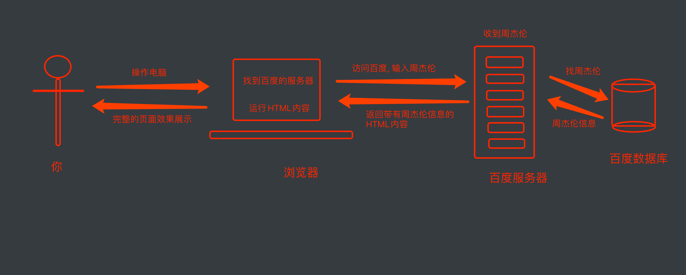

接下来就是一个比较重要的事情了. 所有的数据都在页面源代码里么? 非也~ 这里要介绍一个新的概念

那就是页面渲染数据的过程, 我们常见的页面渲染过程有两种, 

1. 服务器渲染, 你需要的数据直接在页面源代码里能搜到

   这个最容易理解, 也是最简单的. 含义呢就是我们在请求到服务器的时候, 服务器直接把数据全部写入到html中, 我们浏览器就能直接拿到带有数据的html内容. 比如, 

   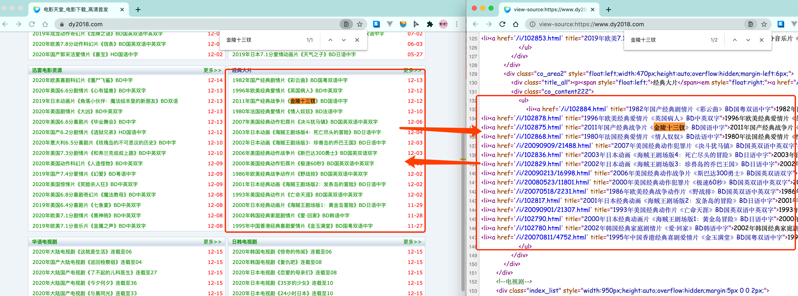

   由于数据是直接写在html中的, 所以我们能看到的数据都在页面源代码中能找的到的. 

   这种网页一般都相对比较容易就能抓取到页面内容. 

2. 前端JS渲染, 你需要的数据在页面源代码里搜不到

   这种就稍显麻烦了. 这种机制一般是第一次请求服务器返回一堆HTML框架结构. 然后再次请求到真正保存数据的服务器, 由这个服务器返回数据, 最后在浏览器上对数据进行加载. 就像这样:

   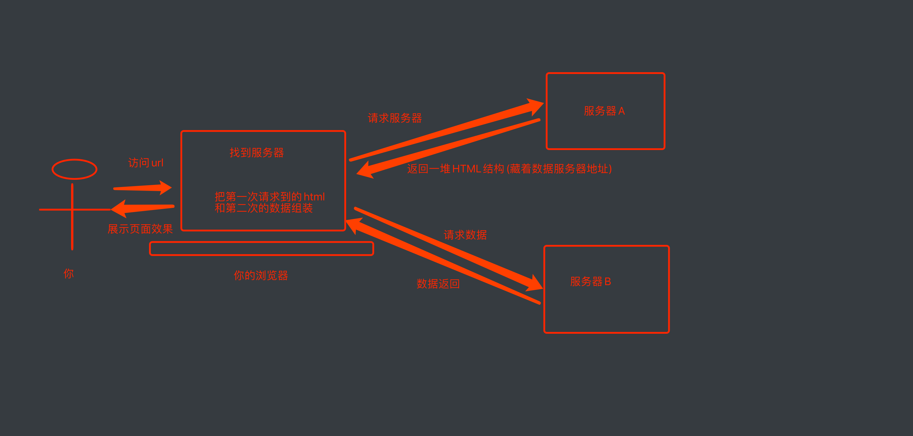

   这样做的好处是服务器那边能缓解压力. 而且分工明确. 比较容易维护. 典型的有这么一个网页

   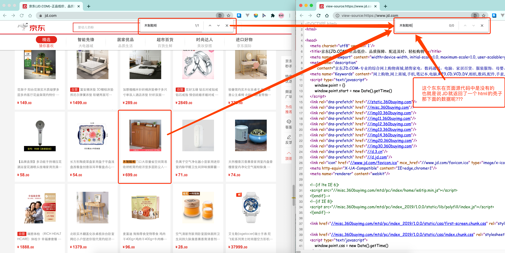

   

   那数据是何时加载进来的呢?  其实就是在我们进行页面向下滚动的时候, jd就在偷偷的加载数据了, 此时想要看到这个页面的加载全过程, 我们就需要借助浏览器的调试工具了(F12)

   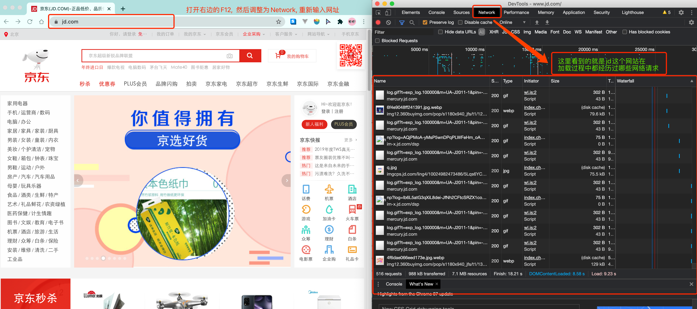

   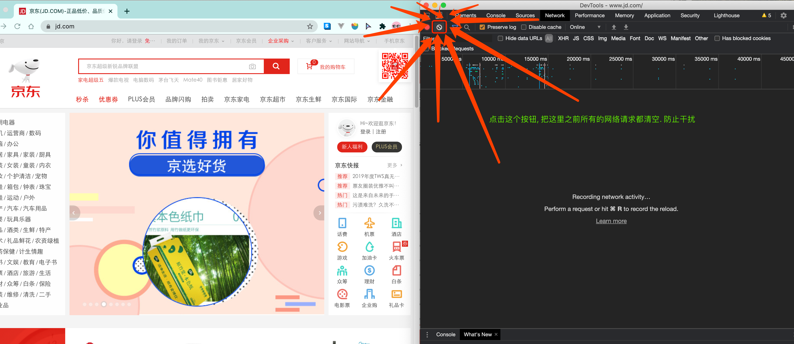

   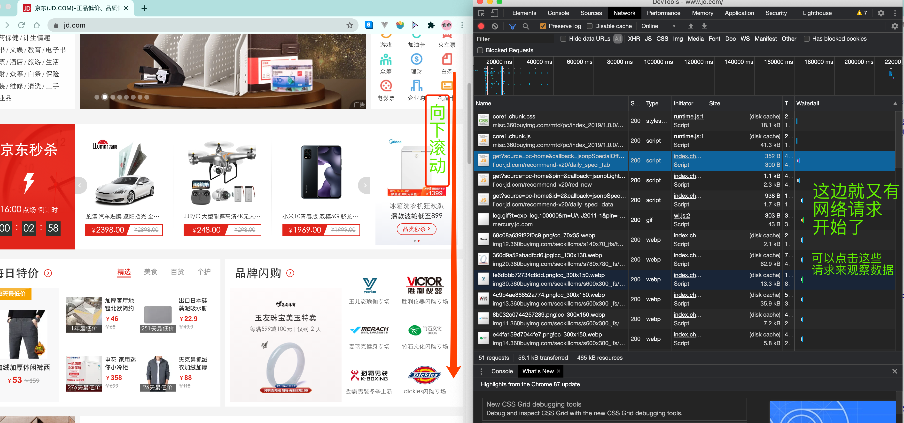

   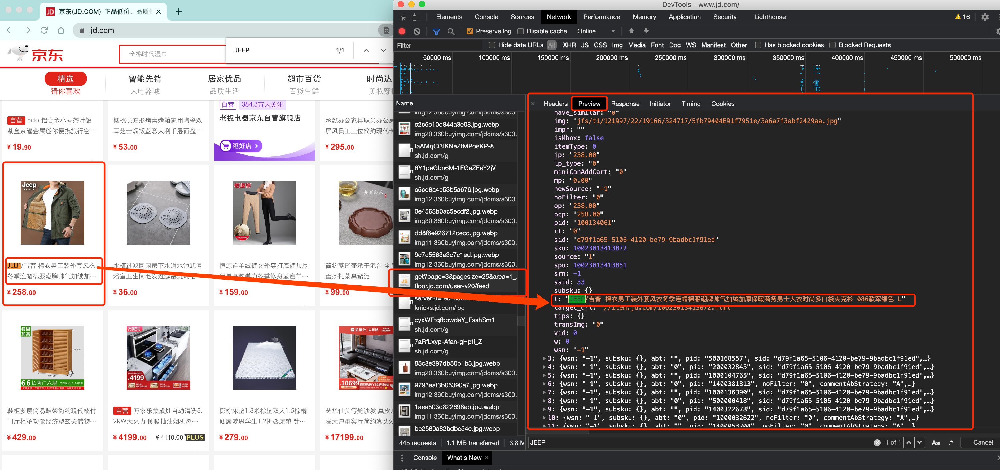

   看到了吧, 页面上看到的内容其实是后加载进来的. 

OK, 在这里我不是要跟各位讲jd有多牛B, 也不是说这两种方式有什么不同, 只是想告诉各位, 有些时候, 我们的数据不一定都是直接来自于页面源代码.  如果你在页面源代码中找不到你要的数据时, 那很可能数据是存放在另一个请求里. 

```
 1.你要的东西在页面源代码. 直接拿`源代码`提取数据即可
 2.你要的东西，不在页面源代码, 需要想办法找到真正的加载数据的那个请求. 然后提取数据
```

### 2、最简单的web应用程序


#### 【1】http协议特性

HTTP协议是Hyper Text Transfer Protocol（超文本传输协议）的缩写,是用于万维网（WWW:World Wide Web ）服务器与本地浏览器之间传输超文本的传送协议。HTTP是一个属于应用层的面向对象的协议，由于其简捷、快速的方式，适用于分布式超媒体信息系统。它于1990年提出，经过几年的使用与发展，得到不断地完善和扩展。HTTP协议工作于客户端-服务端架构为上。浏览器作为HTTP客户端通过URL向HTTP服务端即WEB服务器发送所有请求。Web服务器根据接收到的请求后，向客户端发送响应信息。


* 基于TCP/IP协议

* 基于请求－响应模式

* 无状态保存

* 短连接和长连接

  HTTP1.0默认使用的是短连接。浏览器和服务器每进行一次HTTP操作，就建立一次连接，任务结束就中断连接。
  HTTP/1.1起，默认使用长连接。要使用长连接，客户端和服务器的HTTP首部的Connection都要设置为keep-alive，才能支持长连接。
  HTTP长连接，指的是复用TCP连接。多个HTTP请求可以复用同一个TCP连接，这就节省了TCP连接建立和断开的消耗。

#### 【2】http请求协议与响应协议

http协议包含由浏览器发送数据到服务器需要遵循的请求协议与服务器发送数据到浏览器需要遵循的请求协议。用于HTTP协议交互的信被为HTTP报文。请求端(客户端)的HTTP报文 做请求报文,响应端(服务器端)的 做响应报文。HTTP报文本身是由多行数据构成的字文本。

* 一个完整的URL包括：协议、ip、端口、路径、参数  （lagou网）
* 请求方式: get与post请求

请求协议格式：


响应协议格式：


#### 【3】get请求和post请求

HTTP 协议是用于在客户端（如浏览器）和服务器之间传输数据的协议。它定义了多种请求方法，其中最常用的两种是 **GET** 和 **POST** 请求。以下是对这两种请求的详细介绍：

GET 请求

- **定义**：GET 请求用于从服务器获取数据。它是无副作用的，即不会对服务器上的资源产生改变。
- 特点：
  - **参数传递**：请求参数通常附加在 URL 中，通过 `?` 和 `&` 分隔。例如：`https://example.com/api?name=John&age=30`。
  - **限制**：URL 的长度有限制，这通常取决于浏览器和服务器，实现上大约为 2000 字符，因此不适合传递大量数据。
  - **安全性**：因为参数在 URL 中明文显示，所以 GET 请求不适合传递敏感信息（如密码）。

POST 请求

- **定义**：POST 请求用于向服务器发送数据，通常用于创建或更新资源。
- 特点：
  - **参数传递**：请求参数包含在请求体中，而不是 URL 中。这使得可以传递大量数据。
  - **灵活性**：可以处理多种类型的数据，比如 JSON、XML、表单数据等。
  - **安全性**：虽然 POST 请求比 GET 请求更安全（因为数据不暴露在 URL 中），但仍需通过 HTTPS 进行加密，以保护敏感信息。

#### 【4】响应html和json数据类型

#### 【5】流程


## 四、浏览器工具的使用(重点)

Chrome是一款非常优秀的浏览器. 不仅仅体现在用户使用上. 对于我们开发人员而言也是非常非常好用的. 

对于一名爬虫工程师而言. 浏览器是最能直观的看到网页情况以及网页加载内容的地方. 我们可以按下F12来查看一些普通用户很少能使用到的工具. 

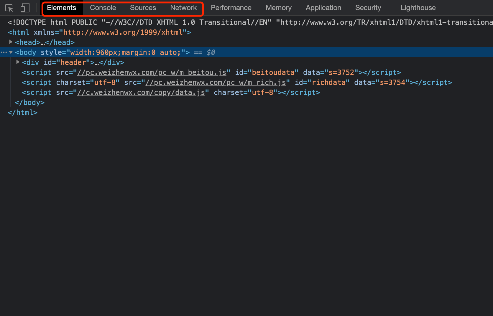

其中, 最重要的Elements, Console, Sources, Network. 

Elements是我们实时的网页内容情况, 注意, 很多兄弟尤其到了后期. 非常容易混淆Elements以及页面源代码之间的关系. 

> 注意,  
>
> 1. 页面源代码是执行js脚本以及用户操作之前的服务器返回给我们最原始的内容
> 2. Elements中看到的内容是js脚本以及用户操作之后的当时的页面显示效果. 

你可以理解为, 一个是老师批改之前的卷子, 一个是老师批改之后的卷子. 虽然都是卷子. 但是内容是不一样的. 而我们目前能够拿到的都是页面源代码. 也就是老师批改之前的样子. 这一点要格外注意. 

在Elements中我们可以使用左上角的小箭头.可以直观的看到浏览器中每一块位置对应的当前html状况. 还是很贴心的. 

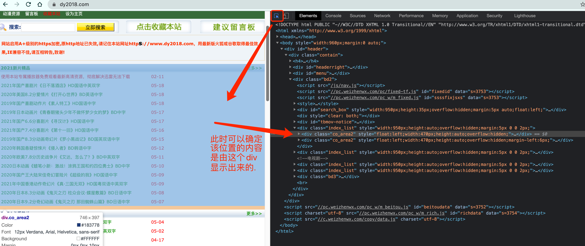


第二个窗口, Console是用来查看程序员留下的一些打印内容, 以及日志内容的. 我们可以在这里输入一些js代码自动执行. 

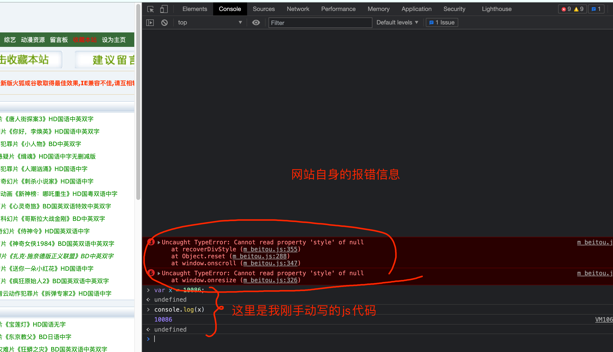

等咱们后面讲解js逆向的时候会用到这里.


第三个窗口, Source, 这里能看到该网页打开时加载的所有内容. 包括页面源代码. 脚本. 样式, 图片等等全部内容. 

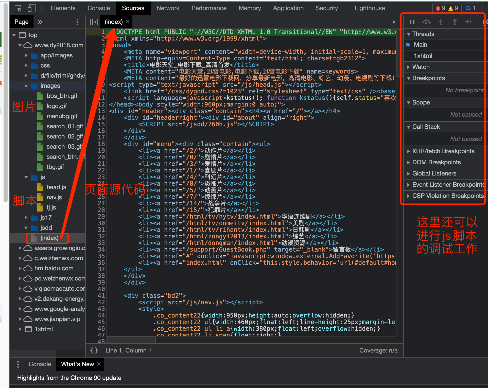


第四个窗口, Network, 我们一般习惯称呼它为抓包工具. 在这里, 我们能看到当前网页加载的所有网路网络请求, 以及请求的详细内容. 这一点对我们爬虫来说至关重要. 

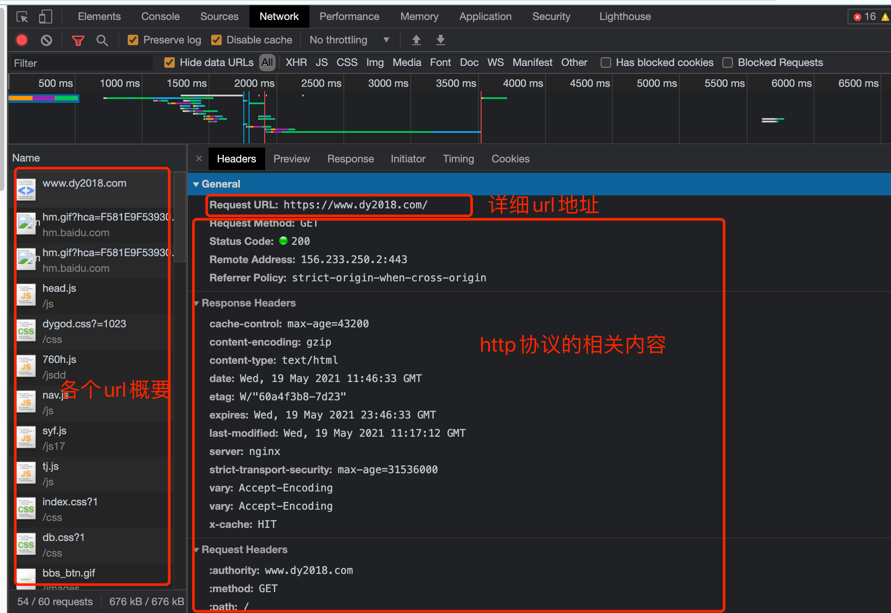

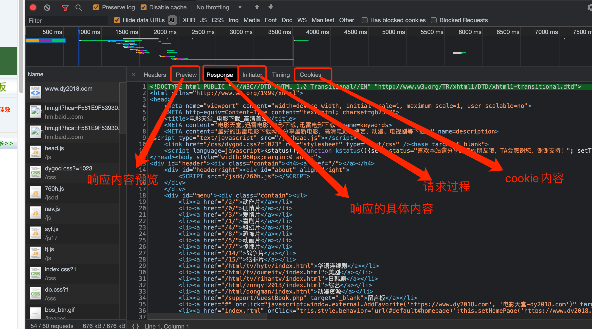

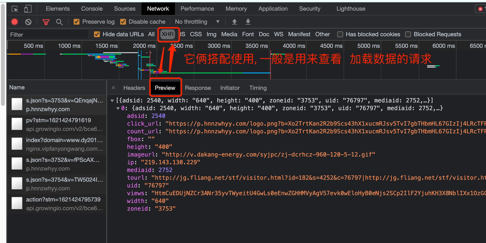

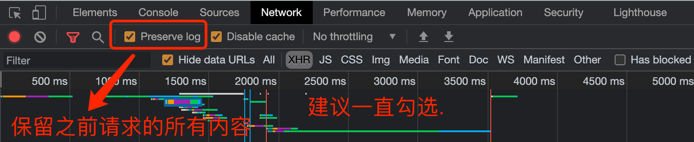

其他更加具体的内容. 随着咱们学习的展开. 会逐一进行讲解. 

## 五、http协议

### 1、 什么是协议？双方规定的传输形式

+ 概述

  超文本传输协议（HTTP，HyperText Transfer Protocol)是互联网上应用最为广泛的一种网络协议。所有的WWW文件都必须遵守这个标准

+ http协议：网站原理

+ 应用层的协议  ftp(21)
+ 常见端口号
  + http(80)
  + https(443)   
  + ssh(22)  
  + mysql(3306)  
  + redis(6379)
  + mongo(27017)

### 2、HTTPS和HTTP的主要区别

`https://www.cnblogs.com/wqhwe/p/5407468.html`

+ https协议需要到ca申请证书，一般免费证书较少，因而需要一定费用。
+ http是超文本传输协议，信息是明文传输，https则是具有安全性的ssl加密传输协议。
+ http和https使用的是完全不同的连接方式，用的端口也不一样，前者是80，后者是443。
+ http的连接很简单，是无状态的；HTTPS协议是由SSL+HTTP协议构建的可进行加密传输、身份认证的网络协议，比http协议安全。

### 3、请求包含

http协议详解
https://www.cnblogs.com/10158wsj/p/6762848.html

+ 包含

  请求行、请求头、请求内容

+ 请求行：
  		get、post，以及区别
+ 常见请求头：
  + accept:浏览器通过这个头告诉服务器，它所支持的数据类型
  + Accept-Charset: 浏览器通过这个头告诉服务器，它支持哪种字符集
  + Accept-Encoding：浏览器通过这个头告诉服务器，支持的压缩格式
  + Accept-Language：浏览器通过这个头告诉服务器，它的语言环境
  + Host：浏览器通过这个头告诉服务器，想访问哪台主机
  + If-Modified-Since: 浏览器通过这个头告诉服务器，缓存数据的时间
  + Referer：浏览器通过这个头告诉服务器，客户机是哪个页面来的  防盗链
  + Connection：浏览器通过这个头告诉服务器，请求完后是断开链接还是何持链接
  + X-Requested-With: XMLHttpRequest  代表通过ajax方式进行访问
+ http响应头部信息
  + Location: 服务器通过这个头，来告诉浏览器跳到哪里
  + Server：服务器通过这个头，告诉浏览器服务器的型号
  + Content-Encoding：服务器通过这个头，告诉浏览器，数据的压缩格式
  + Content-Length: 服务器通过这个头，告诉浏览器回送数据的长度
  + Content-Language: 服务器通过这个头，告诉浏览器语言环境
  + Content-Type：服务器通过这个头，告诉浏览器回送数据的类型
  + Refresh：服务器通过这个头，告诉浏览器定时刷新
  + Content-Disposition: 服务器通过这个头，告诉浏览器以下载方式打数据
  + Transfer-Encoding：服务器通过这个头，告诉浏览器数据是以分块方式回送的
  + Expires: -1  控制浏览器不要缓存
  + Cache-Control: no-cache  
  + Pragma: no-cache

### 4、常见HTTP状态码

+ 100：这个状态码是告诉客户端应该继续发送请求，这个临时响应是用来通知客户端的，部分的请求服务器已经接受，但是客户端应继续发送求请求的剩余部分，如果请求已经完成，就忽略这个响应，而且服务器会在请求完成后向客户发送一个最终的结果

+ 200：这个是最常见的http状态码，表示服务器已经成功接受请求，并将返回客户端所请求的最终结果

+ 202：表示服务器已经接受了请求，但是还没有处理，而且这个请求最终会不会处理还不确定

+ 204：服务器成功处理了请求，但没有返回任何实体内容 ，可能会返回新的头部元信息

+ 301：客户端请求的网页已经永久移动到新的位置，当链接发生变化时，返回301代码告诉客户端链接的变化，客户端保存新的链接，并向新的链接发出请求，已返回请求结果

+ 404：请求失败，客户端请求的资源没有找到或者是不存在

+ 500：服务器遇到未知的错误，导致无法完成客户端当前的请求。

+ 503：服务器由于临时的服务器过载或者是维护，无法解决当前的请求，以上http状态码是服务器经常返回的状态代码，用户只能通过浏览器的状态了解服务器是否正常运行，一般除了错误的状态码，都不会看到服务器的状态码的，新SEOer你们了解到了吗？内容编辑来自51特色购SEO优化人员，想了解更过状态码的知识可以加我好友，一起相互交流学习

## 六、爬虫准备工作

### 1、 fiddler

一个网页的呈现，中间不止一次http请求，平均一个网页差不多10-15个http请求

- 配置https

  点击Tools-->options--->https--->选中面板下

  Capture Https CONNECTS

  Decrypt Https Traffic

  Ignore

  复选框后，将Fiddler重启即可

- fiddler界面介绍

  - Fiddler菜单栏

    包括捕获http请求，停止捕获请求，保存http请求，载入本地session、设置捕获规则等功能

  - Fiddler的工具栏

    包括Fiddler针对当前view的操作（暂停，清除session,decode模式、清除缓存等）

    

  - Web Session面板

    主要是Fiddler抓取到的每条http请求（每一条称为一个session）,主要包含了请求的url，协议，状态码，body等信息

  - 详情和数据统计板

    针对每条http请求的具体统计（例如发送/接受字节数，发送/接收时间，还有粗略统计世界各地访问该服务器所花费的时间）和数据包分析。如inspector面板下，提供headers、textview、hexview,Raw等多种方式查看单条http请求的请求报文的信息

    - Inspector

      提供供headers、textview、hexview,Raw等多种方式查看单条http请求的请求报文的信息,分为上下两个部分，上半部分是请求头部分，下半部分是响应头部分。

    - ImageView标签 

      JPG 格式使用 ImageView 就可以看到图片

    - TextView 标签

      HTML/JS/CSS 使用 TextView 可以看到响应的内容。选择一条Content-Type是text/html的会话

    - Raw标签

      Raw标签可以查看响应报文和响应正文,但是不包含请求报文

    - Cookies标签

      Cookies标签可以看到请求的cookie和响应的set-cookie头信息。

    - WebForms

      post请求所有表单数据

    - Headers

      请求头和响应头信息

    - Json\XML

      Json或XML格式的数据

    - Statistics面板

      HTTP请求的性能和其他数据分析

    - composer面板

      可以模拟向相应的服务器发送数据的过程

    - Filters面板

      Filter标签则可以设置Fiddler的过滤规则，来达到过滤http请求的目的。最简单如：过滤内网http请求而只抓取internet的http请求，或则过滤相应域名的http请求。Fiddler的过滤器非常强大，可以过滤特定http状态码的请求，可以过滤特定请求类型的http请求（如css请求，image请求，js请求等），可以过滤请求报文大于或则小于指定大小（byte）的请求

- 关闭fiddler

  左上角File,反选Capture Traffic

- WebSession过滤功能

  点击工具栏中的X符号

- WebSession选择功能

  左下角的黑色对话框

  - select json\html\image
  - cls清除所有请求
  - ?xxx搜索

- 谷歌浏览器

- mac 青花瓷

  mac版安装：http://www.cocoachina.com/apple/20170704/19729.html

