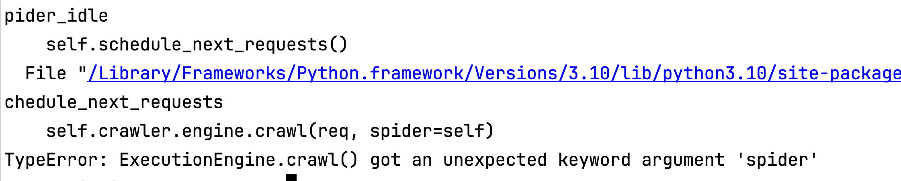
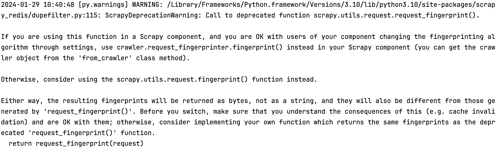
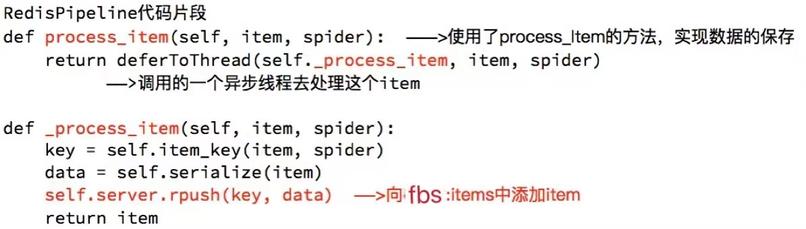
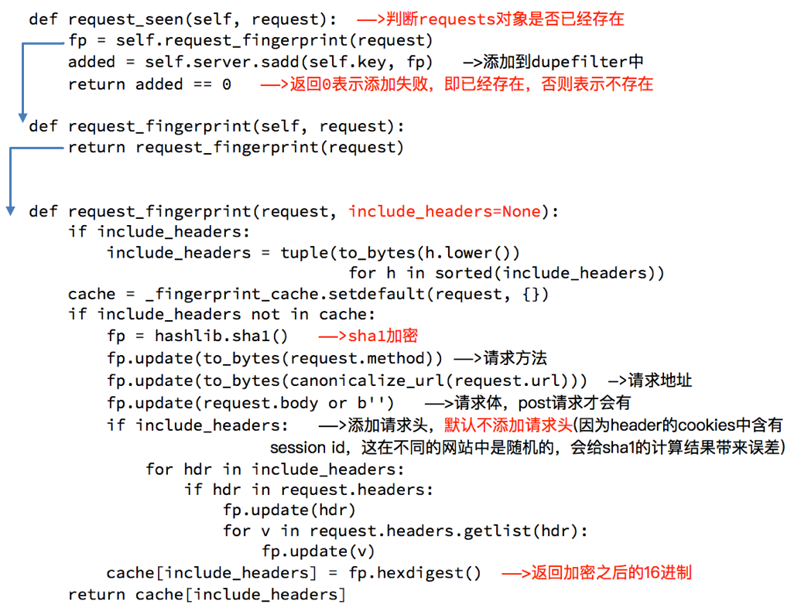
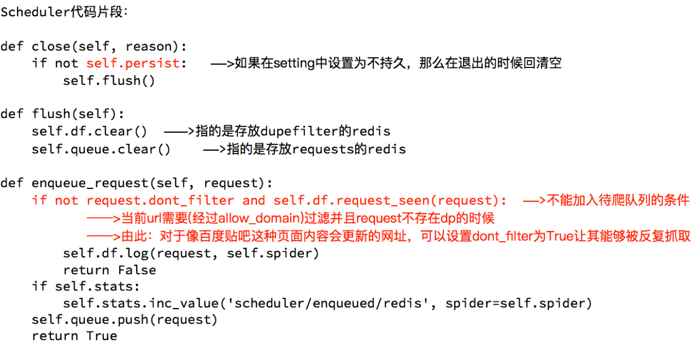
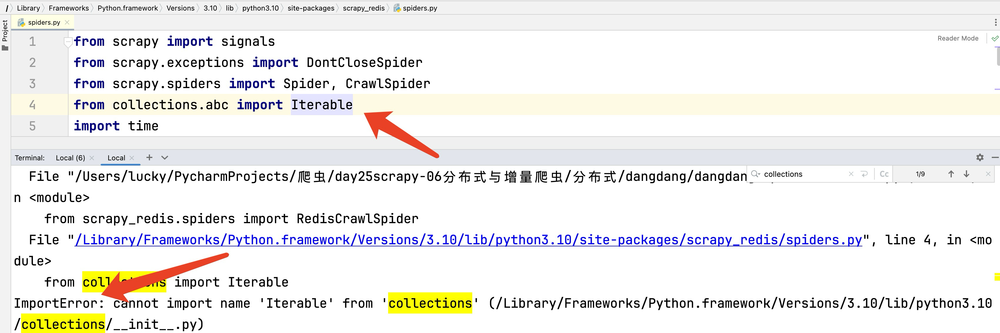
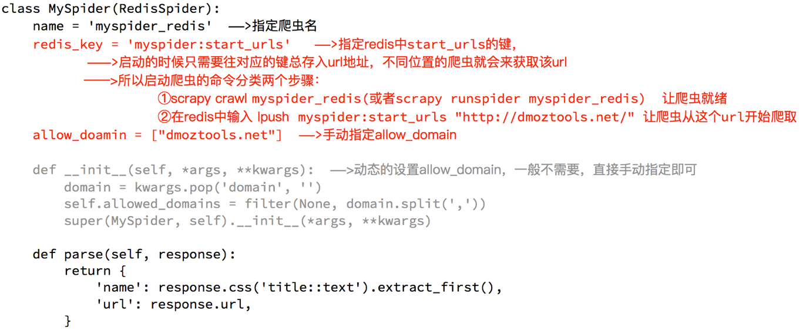

# 十六、scrapy_redis

## 一、scrapy_redis分布式原理

##### 学习目标

1. 了解 scarpy_redis的概念和功能
2. 了解 scrapy_redis的原理
3. 了解 redis数据库操作命令

------

> 在前面scrapy框架中我们已经能够使用框架实现爬虫爬取网站数据,如果当前网站的数据比较庞大, 我们就需要使用分布式来更快的爬取数据

### 1、scrapy_redis是什么

分布式爬取/抓取

> 您可以启动共享单个 Redis 队列的多个蜘蛛实例。最适合广泛的多域爬网。

### 2、安装

**方式一**

pip install scrapy_redis == 0.7.3

不建议，因为当前方式需要先将URL扔进redis队列中，否则先运行scrapy会抛出如下异常



先执行url扔进队列，在运行scrapy，程序会正常执行，但是也会抛出如下警告（所以建议使用第二章方式进行安装）



**方式二**（建议）

运行无论是否先将URL扔进队列中都可以正常运行

下载scrapy安装包，使用命令进行安装

下载地址：https://github.com/rmax/scrapy-redis#features

文档： https://readthedocs.org/projects/scrapy-redis/downloads/pdf/stable/

安装：

```
cd scrapy-redis-master（git上下载下来的安装包）
python setup.py install
```

**要求**

- Python 3.7+
- Redis >= 5.0
- `Scrapy`>= 2.0
- `redis-py`>= 4.0

### 3、为什么要学习scrapy_redis

Scrapy_redis在scrapy的基础上实现了更多，更强大的功能，具体体现在：

- 请求对象的持久化
- 去重的持久化
- 和实现分布式

### 4、scrapy_redis的原理分析

##### 4.1 回顾scrapy的流程


那么，在这个基础上，如果需要实现分布式，即多台服务器同时完成一个爬虫，需要怎么做呢？

##### 4.2 scrapy_redis的流程

- 在scrapy_redis中，所有的带抓取的对象和去重的指纹都存在所有的服务器公用的redis中
- 所有的服务器公用一个redis中的request对象
- 所有的request对象存入redis前，都会在同一个redis中进行判断，之前是否已经存入过
- 在默认情况下所有的数据会保存在redis中

具体流程如下：


### 5、对于redis的复习

> 由于时间关系,大家对redis的命令遗忘的差不多了, 但是在scrapy_redis中需要使用redis的操作命令,所有需要回顾下redis的命令操作

##### 5.1 redis是什么

redis是一个开源的内存型数据库，支持多种数据类型和结构，比如列表、集合、有序集合等,同时可以使用redis-manger-desktop等客户端软件查看redis中的数据，关于redis-manger-desktop的使用可以参考扩展阅读

##### 5.2 redis服务端和客户端的启动

- `redis-server.exe redis-windwos.conf` 启动服务端
- `redis-cli` 客户端启动

##### 5.3 redis中的常见命令

1. `select 1` 切换db
2. `keys *` 查看所有的键
3. `type 键` 查看键的类型
4. `flushdb` 清空db
5. `flushall` 清空数据库

##### 5.4 redis命令的复习

redis的命令很多，这里我们简单复习后续会使用的命令


### 小结

scarpy_redis的分布式工作原理
- 在scrapy_redis中，所有的带抓取的对象和去重的指纹都存在所有的服务器公用的redis中
- 所有的服务器公用一个redis中的request对象
- 所有的request对象存入redis前，都会在同一个redis中进行判断，之前是否已经存入过


## 二、配置分布式爬虫

##### 学习目标

配置完成使用分布式爬虫

### 1、概述

分布式爬虫

- 使用多台机器搭建一个分布式的机器，然后让他们联合且分布的对同一组资源进行数据爬取
- 原生的scrapy框架是无法实现分布式爬虫？
  - 原因：调度器，管道无法被分布式机群共享
- 如何实现分布式
  - 借助：scrapy-redis组件
  - 作用：提供了可以被共享的管道和调度器
  - 只可以将爬取到的数据存储到redis中

### 2、创建分布式crawlspider爬虫

+ scrapy  startproject fbsPro
+ cd fbsPro
+ scrapy genspider -t crawl fbs www.xxx.com

### 3、redis-settings需要的配置

1. (必须). 使用了scrapy_redis的去重组件，在redis数据库里做去重

   ```python
   DUPEFILTER_CLASS = "scrapy_redis.dupefilter.RFPDupeFilter"
   ```

2. (必须). 使用了scrapy_redis的调度器，在redis里分配请求

   ```python
   SCHEDULER = "scrapy_redis.scheduler.Scheduler"
   ```

3. (可选). 在redis中保持scrapy-redis用到的各个队列，从而允许暂停和暂停后恢复，也就是不清理redis queues

   ```python
   SCHEDULER_PERSIST = True
   ```

4. (必须). 通过配置RedisPipeline将item写入key为 spider.name : items 的redis的list中，供后面的分布式处理item 这个已经由 scrapy-redis 实现，不需要我们写代码，直接使用即可

   ```python
   ITEM_PIPELINES = {
   　　 'scrapy_redis.pipelines.RedisPipeline': 100 ,
   }
   ```

5. (必须). 指定redis数据库的连接参数

   ```python
   REDIS_HOST = '127.0.0.1' 
   REDIS_PORT = 6379
   #  设置密码
   REDIS_PARAMS = {'password': '123456'}
   ```

### 4、settings.py

settings.py

这几行表示`scrapy_redis`中重新实现的了去重的类，以及调度器，并且使用的`RedisPipeline`

需要添加redis的地址，程序才能够使用redis

在settings.py文件修改pipelines，增加scrapy_redis。

```python
# 配置分布式
DUPEFILTER_CLASS = "scrapy_redis.dupefilter.RFPDupeFilter"
SCHEDULER = "scrapy_redis.scheduler.Scheduler"
SCHEDULER_PERSIST = True

ITEM_PIPELINES = {
    'scrapy_redis.pipelines.RedisPipeline': 400,
}

# REDIS_URL = "redis://127.0.0.1:6379"
# 或者使用下面的方式
REDIS_HOST = "127.0.0.1"
REDIS_PORT = 6379
REDIS_PARAMS = {'password': '123456'}
```

**注意：scrapy_redis的优先级要调高**

## 三、配置scrapy爬虫

### 1、配置正常抓取代码

```python
import scrapy
from scrapy_redis.spiders import RedisSpider

class FbsSpider(RedisSpider):
    name = "fbs"
    # allowed_domains = ["duanzixing.com"]
    # start_urls = ["https://duanzixing.com"]
    redis_key = 'fbsQueue'  # 使用管道名称（课根据实际功能起名称）

    def parse(self, response, **kwargs):
        article_list = response.xpath('//article[@class="excerpt"]')
        for article in article_list:
            title = article.xpath('./imgs/header/h2/a/text()').extract_first()
            con = article.xpath('./imgs/p[@class="note"]/text()').extract_first()
            data = {'title': title, 'con': con}
            print(data)
            yield data
```

### 2、配置RedisCrawlSpider

```python
import scrapy
from scrapy.linkextractors import LinkExtractor
from scrapy.spiders import CrawlSpider, Rule
from scrapy_redis.spiders import RedisCrawlSpider

# 注意  一定要继承RedisCrawlSpider
class FbsSpider(RedisCrawlSpider):
    name = 'fbs'
    # allowed_domains = ['www.xxx.com']
    # start_urls = ['http://www.xxx.com/']
    redis_key = 'fbsQueue'  # 使用管道名称
    link = LinkExtractor(allow=r'/political/politics/index?id=\d+')
    rules = (
        Rule(link, callback='parse_item', follow=True),
    )

    def parse_item(self, response):
        item = {}
        yield item
```


### 3、scrapy-redis键名介绍

scrapy-redis中都是用key-value形式存储数据，其中有几个常见的key-value形式：

1、 “项目名:items”  -->list 类型，保存爬虫获取到的数据item 内容是 json 字符串

2、 “项目名:dupefilter”   -->set类型，用于爬虫访问的URL去重 内容是 40个字符的 url 的hash字符串

3、 “项目名: start_urls”   -->List 类型，用于获取spider启动时爬取的第一个url

4、 “项目名:requests”   -->zset类型，用于scheduler调度处理 requests 内容是 request 对象的序列化 字符串   **当前在redis中可能看到，也可能看不到，因为如果数据全部抓取完当前key便不存在**

### 4、注意

+ redis中

  + redis-windwos.conf  （如果当前配置文件中的已经被注释或者不存在，则不用处理）

    + 56行添加注释 取消绑定127.0.0.1  # bind 127.0.0.1
    + 75行  修改保护模式为no  protected-mode no

  + 启动redis

  + 队列中添加url地址

    添加：lpush fbsQueue https://wz.sun0769.com/political/index/politicsNewest

    查看：lrange fbsQueue 0 -1 

+ 进入到路径中

  cd fbsPro/fbsPro/spiders

+ 启动分布式爬虫

  scrapy runspider fbs.py

+ 去redis中查看存储的数据

## 四、scrapy_redis 爬虫 分析

##### 学习目标

1. 了解 scrapy_redis实现去重的原理
2. 了解 scrapy中请求入队的条件
3. 能够应用 scrapy_redis完成基于url地址的增量式爬虫

### 1、运行查看redis

2. 我们执行分布式爬虫，会发现redis中多了一下三个键：

   

3. 继续执行程序

   继续执行程序，会发现程序在前一次的基础之上继续往后执行，**所以分布式爬虫是一个基于url地址的增量式的爬虫**

### 2、scrapy_redis的原理分析

我们从settings.py中的三个配置来进行分析 分别是：

- RedisPipeline
- RFPDupeFilter
- Scheduler

##### 2.1 Scrapy_redis之RedisPipeline

RedisPipeline中观察process_item，进行数据的保存，存入了redis中



##### 2.2 Scrapy_redis之RFPDupeFilter

RFPDupeFilter 实现了对request对象的加密



##### 2.3 Scrapy_redis之Scheduler

scrapy_redis调度器的实现了决定什么时候把request对象加入带抓取的队列，同时把请求过的request对象过滤掉



由此可以总结出request对象入队的条件

- request之前没有见过
- request的dont_filter为True，即不过滤
- start_urls中的url地址会入队，因为他们默认是不过滤

### 3、报错

如果您的解释器为3.10及以上，运行出现如下错误

```
ImportError: cannot import name 'Iterable' from 'collections' (/Library/Frameworks/Python.framework/Versions/3.10/lib/python3.10/collections/__init__.py)
```

**原因：**

3.10及以上杜对于`from collections import Iterable` 导包路径更改为`from collections.abc import Iterable`

去到当前导包报错路径文件中更改即可




## 总结

- 本小结重点
  - 知道什么是scrapy_redis
  - 掌握scarpy_redis实现分布式的原理
  - 掌握scrapy_进行url地址加密的方法
  - 掌握request对象入队的条件
  - 能够通过scrapy_redis完成基于url地址的增量式爬虫


## 五、案例

##### 学习目标

1. 能够应用 scrapy_redis实现分布式爬虫
2. 能够应用 scrapy_redis中RedisCrawlspider类实现分布式爬虫

------

### 1 RedisSpider

##### 1.1 分析demo中代码

通过观察代码：

- 继承自父类为RedisSpider
- 增加了一个redis_key的键，没有start_urls，因为分布式中，如果每台电脑都请求一次start_url就会重复
- 多了`__init__`方法，该方 法不是必须的，可以手动指定allow_domains



##### 1.2 动手实现当当图书爬虫

需求：抓取当当图书的信息

目标：抓取当当图书又有图书的名字、封面图片地址、图书url地址、作者、出版社、出版时间、价格、图书所属大分类、图书所属小的分类、分类的url地址

url：http://book.dangdang.com


### 2  RedisCrawlSpider

##### 2.1 代码

```python
import scrapy
from scrapy.linkextractors import LinkExtractor
from scrapy.spiders import CrawlSpider, Rule
from scrapy_redis.spiders import RedisCrawlSpider

'''
当当网 分布式抓取 crawlspider
redis终端输入
lpush dangdang http://category.dangdang.com/cp01.01.02.00.00.00.html
启动scrapy
'''
# class DdcrawlSpider(CrawlSpider):
class DdcrawlSpider(RedisCrawlSpider):
    name = 'ddcrawl'
    # allowed_domains = ['category.dangdang.com/cp01.01.02.00.00.00.html']
    # start_urls = ['http://category.dangdang.com/cp01.01.02.00.00.00.html/']
    redis_key = 'dangdang'  # 使用管道名称（课根据实际功能起名称）
    """
    url
    http://category.dangdang.com/cp01.01.02.00.00.00.html
    http://category.dangdang.com/pg2-cp01.01.02.00.00.00.html
    http://category.dangdang.com/pg100-cp01.01.02.00.00.00.html
    """
    rules = (
        Rule(LinkExtractor(allow=r'cp01\.01\.02\.00\.00\.00\.html$'),callback='parse_item', follow=False),
    )

    def parse_item(self, response):
        con_shoplist = response.xpath('//div[@class="con shoplist"]/div/ul/li')
        print(con_shoplist)
        for li in con_shoplist:
            item = {}
            # 获取图片src
            img = li.xpath('./imgs/a/img/@src').extract_first()
            # 获取标题
            title = li.xpath('./imgs/p[@name="title"]/a/text()').extract_first()
            # 获取详情
            detail = li.xpath('./imgs/p[@class="detail"]/text()').extract_first()
            # 获取价格
            price = li.xpath('./imgs/p[@class="price"]/span/text()').extract_first()
            item['img'] = img
            item['title'] = title
            item['detail'] = detail
            item['price'] = price
            print(response.request.url, item)
            yield item
```