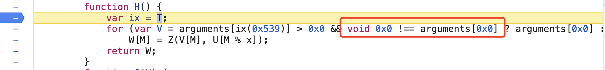
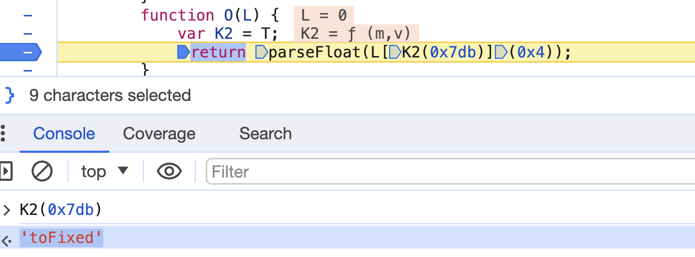

# 十七、js数据类型

# 组成部分

ECMAScript，描述了该语言的语法

文档对象模型（DOM），描述处理网页内容的方法和接口

浏览器对象模型（BOM），描述与浏览器进行交互的方法和接口

## 一、基本语法

### 1、使用JavaScript的三种方式 

1. 在header头部内嵌

   \<script type="text/javascript">\</script>

2. 在header头部导入

   \<script type=“text/javascript”  src="**.js">\</script>

3. 给HTML代码绑定js事件

   \<button onclick="js代码">点击\</button>

```html
<span onclick="this.innerHTML='ss'">点击</span>
```

**注意：**

在导入js代码的标签内 不可以书写js代码 否则不会被执s行


### 2 、js代码输出的3种方式 

```javascript
第一句javascript代码：alert("hello world!") ; 
第二句javascript代码：document.write("亲，我在页面上，跟alert不一样噢！");
第三句javascript代码：console.log("我是在控制台打印的, 以后常用我！");
```


### 3、script标签可以出现多次

且可以出现在html文件的任何地方,建议写在\<head>\</head>之间;另外,同一个文件中Javascript和HTML代码,它们的执行顺序都是自上而下，谁在前就谁先执行,谁在后就后执行.


### 4 、JavaScript的注释

+ 单行注释://

+ 多行注释 /**/


### 5、外部javaScript文件引入方式

```javascript
<script type="text/javascript" src="demo1.js" ></script>
```

注意：

+ 不可以使用单标,以下是不正确的写法

  ```javascript
  <script type="text/javascript" src="demo1.js“/>
  ```

+ 在引入了外部文件的标签中写代码会无效,下面的alert()不会执行

  ```javascript
  <script src="demo1.js">alert('xxxx')</script>
  ```

+ script标签的属性: 

  src表示要引入的外部文件

  type 表示脚本语言的类型


## 二、变量和常量定义(使用var关键字)

### 1、var 声明变量

+ 定义变量

  var age;       //var 是关键字，age是变量名 

  注意：在javascript中name既不是保留字，也不是关键字，但在window对象中有一个属性是 window.name
  window.name 是一个字符串，所以当你声明name变量的时候,相当于给window.name赋值,所以只能为字符串。

+ 赋值

  age= 20;

+ 定义的同时赋值

  var age=20；

+ 一次定义多个变量

​     `var name="zhangsan", age=18, weight=108;`

+ JS是弱数据类型的语言，容错性较高,在赋值的时候才确定数据类型

  ```javascript
  var b;           //temp时啥数据类型？不确定
  b = 12;            //temp变量是数字类型
  b = "hello";      //temp变量变成了字符串类型
  console.log(typeof b);
  ```

+ **注意**

  + **函数作用域：** `var` 声明的变量具有函数作用域，而不是块级作用域。这意味着变量在整个函数内是可见的，而不仅限于声明它的块。

    ```javascript
    function example() {
      if (true) {
        var y = 20;
        console.log(y);  // 20
      }
    
      console.log(y);  // 20，y 在整个函数内都可见
    }
    
    example();
    ```

  + **变量提升：** 使用 `var` 声明的变量会在其所在作用域的顶部被提升，意味着可以在声明之前访问变量。

    ```javascript
    console.log(a);  // undefined
    var a = 5;
    ```

  + **允许重复声明：** 在相同作用域内，使用 `var` 可以多次声明同一个变量。

  + 尽管 `var` 在过去是主要的变量声明方式，但由于其特有的一些问题（例如变量提升、没有块级作用域等），推荐在现代 JavaScript 中使用 `let` 和 `const` 来声明变量，除非有特定的需求。

### 2、let声明

+ let 声明的变量只在 let 命令所在的代码块内有效。

  ```javascript
  var x = 10;
  // 这里输出 x 为 10
  {
      let x = 2;
      // 这里输出 x 为 2
  }
  // 这里输出 x 为 10
  console.log(x)
  ```

+ 注意

  + `let` 是 JavaScript 中用于声明变量的关键字之一。它引入了块级作用域，与 `var` 不同，`let` 在定义变量的同时将其限制在当前的代码块内。

    ```javascript
    if (true) {
      let x = 10;
      console.log(x);  // 10
    }
    
    console.log(x);  // Error: x is not defined
    ```

  + **避免变量提升：** `let` 不会像 `var` 一样在作用域开始时被提升，而是在代码执行到声明的位置时才会被创建。

    ```javascript
    console.log(a);  // undefined
    var a = 5;
    
    console.log(b);  // Error: b is not defined
    let b = 10;
    ```

  + **不允许重复声明：** 在相同作用域内，使用 `let` 重复声明同一个变量会导致语法错误。

    ```javascript
    let name = "John";
    let name = "Lucky";  // Error: Identifier 'name' has already been declared
    ```

  + 总体而言，`let` 提供了更加灵活和可控的变量声明方式，有助于避免一些由于变量提升和作用域问题导致的 bug。

  

###    3、常量定义

**说明**

`const` 是 JavaScript 中用于声明常量的关键字。使用 `const` 声明的变量必须进行初始化，并且一旦赋值后，就不能再被修改。`const` 的主要作用包括：

1. **常量声明：** `const` 用于声明常量，常量是指一旦赋值就不能被重新赋值的变量。

   ```javascript
   const PI = 3.14;
   ```

2. **块级作用域：** 与 `let` 类似，`const` 也具有块级作用域。声明的常量只在当前代码块内有效。

   ```javascript
   if (true) {
     const x = 10;
     console.log(x);  // 10
   }
   
   console.log(x);  // Error: x is not defined
   ```

3. **不允许重新赋值：** 一旦使用 `const` 声明变量并赋值，就不能再修改以及删除它的值。

   ```javascript
   const name = "Lucky";
   name = "Doe";  // Error: Assignment to constant variable
   console.log(name) // Lucky
   ```
   
4. **常量不会被提升：** 与 `var` 不同，使用 `const` 声明的变量不会被提升到当前作用域的顶部。

   ```javascript
   console.log(a);  // Error: Cannot access 'a' before initialization
   const a = 5;
   ```

使用 `const` 的优势在于它提供了更强的不可变性，使得代码更容易理解和维护。通常建议在能够使用常量的地方优先使用 `const`。如果需要可变性，可以考虑使用 `let`。

### 3、JS代码规范

+ 保持代码缩进
+ 变量名遵守命名规范,尽量见名思意
+ JS语句的末尾尽量写上分号;
+ 运算符两边都留一个空格,如 var n = 1 + 2;


## 三、JS变量的命名规范

### 1、规范

+ 变量名可以是数字,字母,下划线_和美元符$组成;
+ 第一个字符不能为数字
+ 不能使用关键字或保留字
+ 标识符区分大小写，如：age和Age是不同的变量。但强烈不建议用同一个单词的大小写区分两个变量。
+ 变量命名尽量遵守驼峰原则:myStudentScore
+ 变量命名尽量见名思意,


### 2、参考下图

|  类型  | 前缀 |   类型   |          实例          |
| :----: | :--: | :------: | :--------------------: |
|  整数  |  i   |   Int    |           1            |
| 浮点数 |  f   |  Float   |          1.2           |
|  数组  |  a   |  Array   |           []           |
| 布尔值 |  b   | Boolean  |       true/false       |
|  函数  |  Fn  | Function | var a = function () {} |
|  对象  |  o   |  Object  |           {}           |
| 字符串 |  s   |  String  |        'lucky'         |


## 四、JS数据类型

### 	1、JS数据类型

+ Boolean:布尔类型  

+ Number：数字（整数int，浮点数float）

+ String：字符串

+ Array：数组 

+ Object：对象

+ 特殊数据类型Null(空对象)、Undefined(未定义)

  undefined 不是关键字，取值的时候推荐用void 0
  
  ```javascript
  var data;
  data === void 0  // true
  ```

+ 实际使用场景

  

注意:

1. 变量的类型在赋值时才能确定

2.  数组，函数都属于对象类型

   ```javascript
   var a = function () {}
   console.log({} instanceof Object)
   console.log(function () {} instanceof Object)
   console.log([] instanceof Object)
   ```

`instanceof` 是 JavaScript 中的运算符，用于检查对象是否是某个特定类型（类）的实例。它的作用是判断一个对象是否是另一个对象的实例。


### 	2、typeof操作符

+ 概述

  用来检测变量的数据类型,对于值或变量使用 typeof操作符会返回如下字符串: 

+ 类型
  + Undefined数据类型的值为:  undefined  未定义
  + Boolean数据类型的值为:  boolean     布尔值
  + String数据类型的值为:  string         字符串
  + Number数据类型的值为:  number       数值
  + Object数据类型的值为:  object          对象或者null
  + Function数据类型的值为:  function      函数

+ 例如:

​		var b = "Lucky";

​		console.log(typeof b);

​		console.log(typeof  "Lucky"); 

### 3、Undefined类型

+ 概述

  Undefined类型只有一个值，即特殊的 undefined。在使用var声明变量，但没有对其初始化时，这个变量的值就是 undefined

+ 例如

  ```javascript
  var b;
  console.log(typeof b); //undefined
  ```

​	注意:我们在定义变量的时候， 尽可能的不要只声明，不赋值, 而是声明的同时初始化一个值。

### 	4、Null类型

+ 概述

  Null类型是一个只有一个值的数据类型，即特殊的值 null。它表示一个空对象引用(指针)，而typeof操作符检测 null 会返回 object。 

+ 例如

  ```javascript
  var b = null;
  console.log(typeof b);
  // ECMA-262 规定对它们的相等性测试返回 true, 表示值相等。
  console.log(undefined == null);
  ```

  **ECMA-262** 是 JavaScript 语言的规范标准，它由 Ecma 国际（European Computer Manufacturers Association）制定和维护。ECMA-262 定义了 JavaScript 的核心语法、数据类型、对象和函数等方面的规范，以确保不同的 JavaScript 引擎能够在不同的环境中实现一致的行为。

  但是两者的数据类型是不一样的
  
  ```javascript
  var b;
  var car = null;
  console.log(typeof b == typeof car)  // false
  console.log(b == car)  							 // true
  ```

### 5、Boolean类型

+ Boolean类型的转换规则:(牢记)

  + String:非空字符串为true,空字符串为false

  + Number:非0数值为true, 0或者NaN为false

  + Object:对象不为null则为true, null为false

    ```javascript
    console.log(null,Boolean(null));
    ```

  + Undefined: undefined为false

+ 实例

  ```javascript
  console.log(Number(true) )  // 1 转为数值为1
  console.log(Number(false))  // 0 转为数值为0
  
  console.log(Boolean(''));   // false
  console.log(Boolean({}));   // true
  console.log(Boolean([]));   // true
  console.log(Boolean(undefined));  // false
  ```

### 	6、Number类型

Number类型包含两种数值：整型和浮点型.

+ 整型:

  ```javascript
  var b = 100; 
  
  console.log(b);
  ```

+ 浮点类型:

  就是该数值中必须包含一个小数点，并且小数点后面必须至少有一位数字

  ```javascript
  var b= 3.8;
  var b= 0.8;
  var b= .8;  //有效，但不推荐此写法
  ```

+ 注意事项

  由于保存浮点数值需要的内存空间比整型数值大两倍，因此ECMAScript会自动将可以转换为整型的浮点数值转成为整型。

  var b= 8.;  //小数点后面没有值，转换为 8

  var b= 12.0;  //小数点后面是 0，转成为12

​	对于那些过大或过小的数值，可以用科学技术法来表示(e表示法)。用 e 表示该数值的前面 10 的指数次幂。

​	var box = 4.12e9;  //即 4120000000

​	var box = 0.0000412;  //即 4.12e-5

​	浮点数值的范围在：Number.MIN_VALUE ~ Number.MAX_VALUE之间,如果超过了浮点数值范围的最大值或最小值，那么就先出现 Infinity(正无穷)或-Infinity(负无穷)。

+ NaN, 即非数值(Not a Number)是一个特殊的值

  + 概述

    这个数值用于表示一个本来要返回数值的操作数未返回数值的情况(这样就不会抛出错误了)。比如，在其他语言中,  任何数值除以 0都会导致错误而终止程序执行。但在ECMAScript中，会返回出特殊的值，因此不会影响程序执行。

    ```javascript
    var b =0/0;    //NaN
    var b =12/0;  //Infinity
    var b =12/0 * 0  //NaN
    ```

  +  isNaN

    ECMAScript提供了 isNaN()函数，用来判断这个值到底是不是 NaN。isNaN()函数在接收到一个值之后，会尝试将这个值转换为数值。

    ```javascript
    console.log(isNaN(NaN));       //true
    console.log(isNaN(25));           //false，25 是一个数值
    console.log(isNaN('25'));  //false，'25'是一个字符串数值，可以转成数值
    console.log(isNaN('zhangsan')); //true，'zhangsan'不能转换为数值
    console.log(isNaN(true));         //false       true 可以转成成 1
    ```

+ JS类型转换

  字符串转换数字类型：parseInt()、parseFloat() 、Number()
  + parseInt()      是把其它类型转换为整型

    + 参数1: 目标
    + 参数2: 进制关系
      + 二进制: 0 1
      + 十进制: 0-9
      + 八进制: 0-7
      + 十六进制: 0-F
  
  + parseFloat()  是把其它类型转换为浮点型（小数）
  
    ```javascript
    console.log(typeof parseFloat('1.23'))
    console.log(parseInt('1.23'))
    console.log(parseInt('F', 16))  // 十六进制转换为十进制
    console.log(parseInt('12', 8))  // 八进制转换为十进制
    console.log(parseInt('010', 2))  // 二进制转换为十进制
    ```


### 7、Math对象

+ Math对象

  Math对象可以用于执行数学任务

+ Math对象的常用函数: 

  + Math.round(3.6)    //四舍五入

  + toFixed  保留小数

    ```javascript
    var num =2.446242342;
    num = num.toFixed(2); // 输出结果为 2.45
    ```

    

  + Math.random()       //返回0-1之间的随机数

  + Math.max(num1, num2)  //返回较大的数

  + Math.min(num1, num2)   //返回较小的数

  + Math.abs(num)     //绝对值

  + Math.ceil(19.3)     //向上取整
  
  + Math.floor(11.8)    //向下取整
  
+ Math.random()   实际使用实例

  ```javascript
  // 返回0-100的随机整数
  function u(t){
    return ~~(Math['random']() * t)
  }
  u(100)
  ```
  

逆向中：


**注意：**

`~~`: 这是 JavaScript 中的位运算符，称为双取反。它的作用是将数值转换为整数。

