# 二十六、jQuery

## 一、前言

+ **jQuery 介绍**

  jQuery 是一个 JavaScript 库。

  jQuery 极大地简化了 JavaScript 编程。

+ 下载 jQuery

  共有两个版本的 jQuery 可供下载：一份是精简过的，另一份是未压缩的（供调试或阅读）。

  字节cdn:  https://cdn.bytedance.com/

  jquery:  https://cdn.bytedance.com/?query=jquery&version=1.9.1

+ jQuery 语法

  - $(this).hide()

    演示 jQuery hide() 函数，隐藏当前的 HTML 元素。


  - $("#test").hide()

    演示 jQuery hide() 函数，隐藏 id="test" 的元素。


  - $("p").hide()

    演示 jQuery hide() 函数，隐藏所有 <p> 元素。


  - $(".test").hide()

    演示 jQuery hide() 函数，隐藏所有 class="test" 的元素。


+ 入口操作:

  ```javascript
  $(function(){
  
  })
  
  $(document).ready(function(){
  
  })
  ```

  相当于js的onlaod = functino(){}

  在线js

  ```javascript
  <script src="http://libs.baidu.com/jquery/1.10.2/jquery.min.js"></script>
  ```

  


## 二、jQuery 选择器

### (1) jQuery 元素选择器

jQuery 使用 CSS 选择器来选取 HTML 元素。

+ $("p") 选取 <p> 元素。
+ $("p.intro") 选取所有 class="intro" 的 <p> 元素。
+ $("p#demo") 选取所有 id="demo" 的 <p> 元素。
+ $('ul>li:nth-child(2)')
+ $('li~p')
+ $('li+p')
+ $('ul li')

### (2) jQuery 属性选择器

jQuery 使用 XPath 表达式来选择带有给定属性的元素。

+ $("[href]") 选取所有带有 href 属性的元素。
+ $("[href='#']") 选取所有带有 href 值等于 "#" 的元素。
+ $("[href!='#']") 选取所有带有 href 值不等于 "#" 的元素。
+ $("[href$='.jpg']") 选取所有 href 值以 ".jpg" 结尾的元素。


### (3) jQuery CSS 选择器

jQuery CSS 选择器可用于改变 HTML 元素的 CSS 属性。

下面的例子把所有 p 元素的背景颜色更改为红色：

```javascript
$("p").css("background-color","red");
```


## 二、jQuery - 获得内容和属性

#### 获得内容 - text()、html() 以及 val()

三个简单实用的用于 DOM 操作的 jQuery 方法：

- text() - 设置或返回所选元素的文本内容
- html() - 设置或返回所选元素的内容（包括 HTML 标记 **当内容存在标签时才会进行返回**）
- val() - 设置或返回表单字段的值

下面的例子演示如何通过 jQuery text() 和 html() 方法来获得内容：

### 实例

```javascript
<script>
$(document).ready(function(){
  $("#btn1").click(function(){
    alert("Text: " + $("#test").text());
  });
  $("#btn2").click(function(){
    alert("HTML: " + $("#test").html());
  });
});
</script>
</head>
<body>
<p id="test">这是段落中的<b>粗体</b>文本。</p>
<button id="btn1">显示文本</button>
<button id="btn2">显示 HTML</button>
</body>
```

下面的例子演示如何通过 jQuery val() 方法获得输入字段的值：

### 实例

```javascript
<script>
$(document).ready(function(){
  $("button").click(function(){
    alert("Value: " + $("#test").val());
  });
});
</script>
</head>

<body>
<p>姓名：<input type="text" id="test" value="米老鼠"></p>
<button>显示值</button>
```

### 获取属性 - attr()

jQuery attr() 方法用于获取属性值。

下面的例子演示如何获得链接中 href 属性的值：

**实例**

```javascript
<script>
$(document).ready(function(){
  $("button").click(function(){
    alert($("#lucky").attr("href"));
  });
});
</script>
</head>
<body>
<p><a href="http://www.xialigang.com" id="lucky">xialigang.com</a></p>
<button>显示 href 值</button>
```


## 三、jQuery - 设置内容和属性

#### (1) 设置内容 - text()、html() 以及 val()

我们将使用前一章中的三个相同的方法来设置内容：

- text() - 设置或返回所选元素的文本内容
- html() - 设置或返回所选元素的内容（包括 HTML 标记）
- val() - 设置或返回表单字段的值

下面的例子演示如何通过 text()、html() 以及 val() 方法来设置内容：

**实例**

```javascript
<script>
$(document).ready(function(){
  $("#btn1").click(function(){
    $("#test1").text("Hello world!");
  });
  $("#btn2").click(function(){
    $("#test2").html("<b>Hello world!</b>");
  });
  $("#btn3").click(function(){
    $("#test3").val("Dolly Duck");
  });
});
</script>
</head>
<body>
<p id="test1">这是段落。</p>
<p id="test2">这是另一个段落。</p>
<p>Input field: <input type="text" id="test3" value="Mickey Mouse"></p>
<button id="btn1">设置文本</button>
<button id="btn2">设置 HTML</button>
<button id="btn3">设置值</button>
```


#### (2) 设置属性 - attr()

jQuery attr() 方法也用于设置/改变属性值。

下面的例子演示如何改变（设置）链接中 href 属性的值：

**实例**

```javascript
<script>
$(document).ready(function(){
  $("button").click(function(){
    $("#w3s").attr("href","http://www.baidu.com");
  });
});
</script>
</head>

<body>
<p><a href="http://http://www.xialigang.com"" id="w3s">http://www.xialigang.com</a></p>
<button>改变 href 值</button>
<p>请把鼠标指针移动到链接上，或者点击该链接，来查看已经改变的 href 值。</p>
</body>
```

attr() 方法也允许您同时设置多个属性。

#### (3) 下面的例子演示如何同时设置 href 和 title 属性：

**实例**

```javascript
<script>
$(document).ready(function(){
  $("button").click(function(){
    $("#w3s").attr({
      "href" : "http://www.baidu.com",
      "title" : "title"
    });
  });
});
</script>
</head>
<body>
<p><a href="http://www.xialigang.com" id="w3s">W3School.com.cn</a></p>
<button>改变 href 和 title 值</button>
<p>请把鼠标指针移动到链接上，或者点击该链接，来查看已经改变的 href 值和已经设置的 title 值。</p>
</body>
```


## 四、jQuery - 添加元素 以及获取动态添加元素的节点

**添加新的 HTML 内容**

我们将学习用于添加新内容的四个 jQuery 方法：

- append() - 在被选元素的结尾插入内容
- prepend() - 在被选元素的开头插入内容
- after() - 在被选元素之后插入内容
- before() - 在被选元素之前插入内容

#### (1) jQuery append() 方法

jQuery append() 方法在被选元素的结尾插入内容。

**实例**

```javascript
<script>
$(document).ready(function(){
  $("#btn1").click(function(){
    $("p").append(" <b>Appended text</b>.");
  });

  $("#btn2").click(function(){
    $("ol").append("<li>Appended item</li>");
  });
});
</script>
</head>
<body>
<p>This is a paragraph.</p>
<p>This is another paragraph.</p>
<ol>
<li>List item 1</li>
<li>List item 2</li>
<li>List item 3</li>
</ol>
<button id="btn1">追加文本</button>
<button id="btn2">追加列表项</button>
</body>
```

#### (2) jQuery prepend() 方法

jQuery prepend() 方法在被选元素的开头插入内容。

**实例**

```javascript
<script>
$(document).ready(function(){
  $("#btn1").click(function(){
    $("p").prepend("<b>Prepended text</b>");
  });
  $("#btn2").click(function(){
    $("ol").prepend("<li>Prepended item</li>");
  });
});
</script>
</head>
<body>
<p>This is a paragraph.</p>
<p>This is another paragraph.</p>
<ol>
<li>List item 1</li>
<li>List item 2</li>
<li>List item 3</li>
</ol>
<button id="btn1">添加文本</button>
<button id="btn2">添加列表项</button>
</body>
```

#### (3) jQuery after() 和 before() 方法

jQuery after() 方法在被选元素之后插入内容。 最多只能添加3个参数值

jQuery before() 方法在被选元素之前插入内容。

**实例**

```javascript
$("img").after("Some","text","after");
$("img").before("Some","text"," before");
```

**例子**

```javascript
<script>
$(document).ready(function(){
  $("#btn1").click(function(){
    $("em").before("<b>Before</b>");
  });

  $("#btn2").click(function(){
    $("em").after("<i>After</i>");
  });
});
</script>
</head>

<body>
<em>b标签</em>
<br><br>
<button id="btn1">在图片前面添加文本</button>
<button id="btn2">在图片后面添加文本</button>
```

## 五、jQuery - 删除元素

**删除元素/内容**

如需删除元素和内容，一般可使用以下两个 jQuery 方法：

- remove() - 删除被选元素（**及其子元素**）
- empty() - 从被选元素中删除子元素

#### (1) jQuery remove() 方法

jQuery remove() 方法删除被选元素及其子元素。

**实例**

```javascript
$("#div1").remove()
```

#### (2) jQuery empty() 方法

jQuery empty() 方法删除被选元素的子元素（清空）。

**实例**

```javascript
$("#div1").empty();
```

#### (3) 过滤被删除的元素

jQuery remove() 方法也可接受一个参数，允许您对被删元素进行过滤。

该参数可以是任何 jQuery 选择器的语法。

下面的例子删除 class="italic" 的所有 <p> 元素：

**实例**

```javascript
$("p").remove(".italic");
```


## 六、jQuery - 获取并设置 CSS 类(了解)

**jQuery 操作 CSS**

jQuery 拥有若干进行 CSS 操作的方法。我们将学习下面这些：

- addClass() - 向被选元素添加一个或多个类
- removeClass() - 从被选元素删除一个或多个类
- toggleClass() - 对被选元素进行添加/删除类的切换操作
- css() - 设置或返回样式属性

#### (1) jQuery addClass() 方法

下面的例子展示如何向不同的元素添加 class 属性。当然，在添加类时，您也可以选取多个元素：

**实例**

```javascript
$("button").click(function(){
  $("h1,h2,p").addClass("blue");
  $("div").addClass("important");
});
```

**您也可以在 addClass() 方法中添加多个类：**

**实例**

```javascript
$("button").click(function(){
  $("#div1").addClass("important blue");
});
```

#### (2) jQuery removeClass() 方法

下面的例子演示如何不同的元素中删除指定的 class 属性：

**实例**

```javascript
$("button").click(function(){
  $("h1,h2,p").removeClass("blue");
});
```

#### (3) jQuery toggleClass() 方法

下面的例子将展示如何使用 jQuery toggleClass() 方法。该方法对被选元素进行添加/删除类的切换操作：

**实例**

```javascript
$("button").click(function(){
  $("h1,h2,p").toggleClass("blue");
});
```


## 七、发送json数据

#### (1) 之前发送json数据

```python
resp = requests.post(url, json=data)  # 此时. 发送的数据是以json格式发送出去的
```

**注意**：

1. 内部处理把data转化成json字符串, json.dumps(data)

2. 把请求头中的ContentType设置成application/json

上述方案的缺陷: json格式的字符串中会有空格. 服务器能检测到.

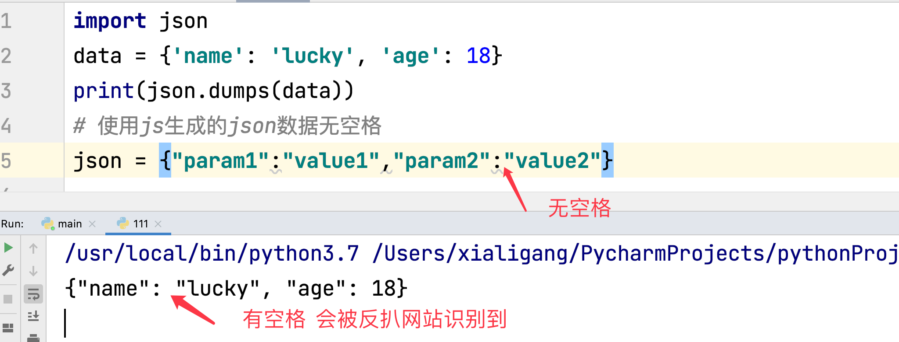


#### (2) 建议使用方式

```python
import json
resp = requests.post(url, data=json.dumps(data, separators=(',', ':')), headers={"Content-Type": "application/json"}) # 需要设置类型. 否则服务器接受不到数据
print(resp.text)
```

separators：作用是去掉 **， ：** 后面的空格，

#### (3) 实例

**网址：** https://www.jiansheku.com/search/business/

**请求头类型**      application/json

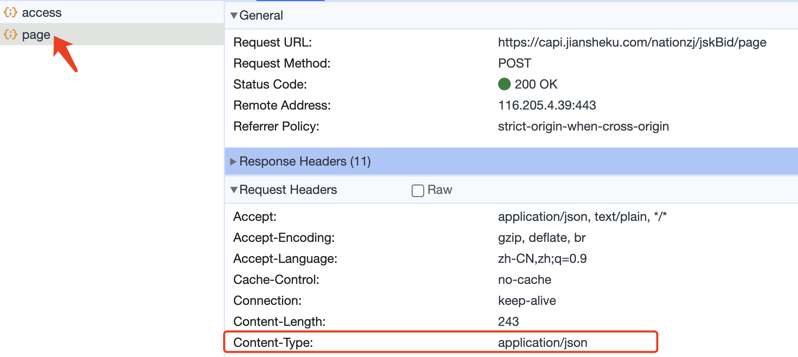

**请求发送参数**

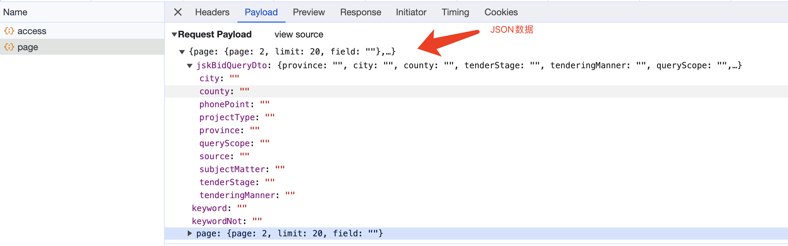

**代码：**

```python
import requests
url = 'https://capi.jiansheku.com/nationzj/jskBid/page'
headers = {
    "User-Agent": "Mozilla/5.0 (Windows NT 10.0; Win64; x64) AppleWebKit/537.36 (KHTML, like Gecko) Chrome/54.0.2840.99 Safari/537.36",
    'Content-Type': 'application/json',
    'Timestamp': str(time),
    'Sign': sign,
}
response = requests.post(url, headers=headers, data=json.dumps(data, separators=(',', ':')))
# 或
response = requests.post(url, headers=headers, json=data)
```


## 八、Ajax

#### (1) js原生Ajax

+ **概述:**

  JavaScript原生Ajax指的是使用JavaScript语言自带的XMLHttpRequest对象来实现异步数据交互的技术。通过Ajax，可以在不刷新整个页面的情况下，向服务器发送请求并获取响应数据，然后利用JavaScript动态更新页面内容。

+ **以下是一个使用原生Ajax发送GET请求的示例代码：**

  ```javascript
  // 创建 XMLHttpRequest 对象
  var xhr = new XMLHttpRequest();
  
  // 监听请求状态变化
  xhr.onreadystatechange = function() {
    if (xhr.readyState === 4 && xhr.status === 200) {
      // 请求完成且响应成功
      var response = xhr.responseText;
      // 处理响应数据
      console.log(response);
    }
  };
  
  // 发送 GET 请求
  xhr.open('GET', 'http://example.com/api/data');
  xhr.send();
  ```

+ **说明**

  首先，我们创建一个XMLHttpRequest对象，并定义了一个回调函数`onreadystatechange`，该函数会在请求状态发生变化时被调用。然后，通过`open`方法设置请求方法和URL，最后使用`send`方法发送请求。

  当请求状态变为4（表示请求完成）且响应状态码为200（表示成功）时，我们可以通过`responseText`属性获取到服务器返回的响应数据，并进行进一步处理。

  需要注意的是，以上是一个基本的GET请求示例，如果需要发送POST请求，还需要使用`setRequestHeader`方法设置请求头和`send`方法传递请求体数据。

  另外，现代浏览器提供了更方便的Fetch API和Axios等库来简化Ajax操作，使用这些工具可以更加简洁和易用。

+ **XMLHttpRequest对象的请求状态（readyState）有五种：**

  0（未初始化）：XMLHttpRequest对象已创建，但尚未调用open方法。此时无法获取到服务器的响应。

  1（打开）：open方法已调用，但尚未调用send方法。可以通过设置请求头和其他请求参数。

  2（发送）：send方法已调用，且请求正在发送中。此时可以获取到请求的状态信息。

  3（接收）：已接收到部分响应数据。此时可以获取到部分响应内容。

  4（完成）：响应已完成且成功接收到完整的响应数据。此时可以获取到完整的响应内容。

  通常，我们主要关注请求状态为4时的情况，即请求已完成并成功接收到完整的响应数据。在这个状态下，可以对服务器返回的数据进行处理和更新页面内容等操作。而其他状态则可以用来进行一些请求进度的监控或错误处理等。

+ **GET请求**

  GET请求将参数以键值对的形式附加到URL的末尾，例如：`http://example.com/api?param1=value1&param2=value2`。 下面是一个使用原生Ajax进行GET请求传参的示例：

  ```javascript
  var xhr = new XMLHttpRequest();
  xhr.onreadystatechange = function() {
    if (xhr.readyState == 4 && xhr.status == 200) {
      var response = xhr.responseText;
      // 处理响应数据
    }
  };
  var url = "http://example.com/api";
  var params = "param1=value1&param2=value2";
  xhr.open("GET", url + "?" + params,);
  xhr.send();
  ```

+ **POST请求**

  POST请求将参数放在请求体中发送，需要设置请求头的Content-Type为`application/x-www-form-urlencoded`，同时将参数以键值对的形式编码后发送。 下面是一个使用原生Ajax进行POST请求传参的示例：

  **传递json数据**

  ```javascript
  var xhr = new XMLHttpRequest();
  xhr.onreadystatechange = function() {
    if (xhr.readyState == 4 && xhr.status == 200) {
      var response = xhr.responseText;
      // 处理响应数据
    }
  };  
  var url = "http://example.com/api";
  xhr.open("POST", url);
  xhr.setRequestHeader("Content-Type", "application/json");
  var params = {param1: 'value1', param2: 'value2'};
  json_data = JSON.stringify(params);
  console.log(json_data);
  xhr.send(json_data);
  ```

  **传递表单数据数据**

  ```javascript
  var xhr = new XMLHttpRequest();
  xhr.onreadystatechange = function() {
    if (xhr.readyState == 4 && xhr.status == 200) {
      var response = xhr.responseText;
      // 处理响应数据
    }
  };  
  var url = "http://example.com/api";
  var params = "param1=value1&param2=value2";
  xhr.open("POST", url);
  xhr.setRequestHeader("Content-Type", "application/x-www-form-urlencoded");
  xhr.send(params);
  ```

  **后端代码**

  文件结构

  manage.py   后端flask代码

  ---- templates    存放前端HTML页面的文件夹

  ​		ajax.html

  manage.py

  ```python
  from flask import Flask,render_template,jsonify,request # 导入flask类
  
  # 实例化Flask类
  app = Flask(__name__)
  
  # 创建路由 地址为 127.0.0.1:5000/
  # 渲染ajax模板
  @app.route('/')
  def index():
    	# 渲染Ajax页面内容
      return render_template('ajax.html')
  
  # 更改路由请求方式为 get和post
  @app.route('/test_ajax/',methods=['GET','POST'])
  def test_ajax():
      if request.method == 'POST':
          # 接收POST数据
          print(request.form)
      else:
          # 接收GET数据
          print(request.args)
      # 返回响应JSON数据
      return jsonify({'code':200})
  
  if __name__ == '__main__':
      app.run(debug=True) # 运行
  ```


#### (2) Hook   Ajax

+ Hook Ajax

  第一步 将传递表单数据进行改造

  ```javascript
  <!DOCTYPE html>
  <html>
  <head>
      <meta charset="UTF-8">
      <title>Title</title>
  </head>
  <body>
    <button type="button">button</button>
  <script>
      document.querySelector('button').addEventListener('click', function (){
          var xhr = new XMLHttpRequest()
          var params = "param1=value1&param2=value2";
          var  url = "http://127.0.0.1:5000/ajax/";
          xhr.onreadystatechange = function (){
              if(xhr.readyState == 4 && xhr.status == 200){
                  var response = xhr.responseText;
                  console.log(response)
              }
          }
          my_open()
          function my_open() {
              console.log('进行加密啦')
              xhr.open("POST", url + '?md5=abcdef---');
              my_send()
          }
          function my_send() {
              xhr.setRequestHeader("Content-Type", "application/x-www-form-urlencoded");
              xhr.send(params)
          }
      })
  
  </script>
  </body>
  </html>
  ```

通过浏览器发现此刻在传递数据中多了加密的值

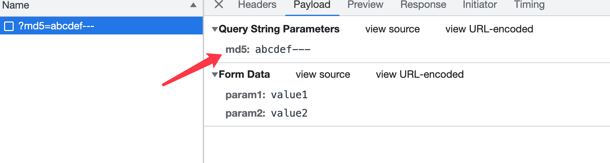


进入js调用栈进行查找

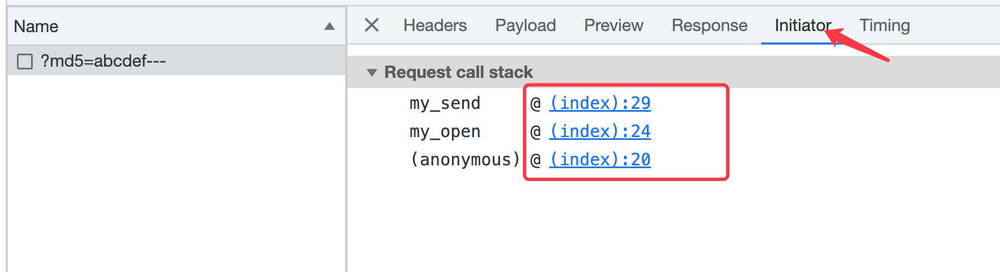

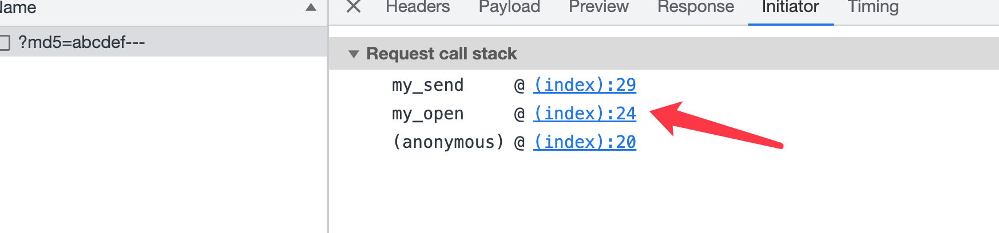

发现很容易能够找到加密的位置

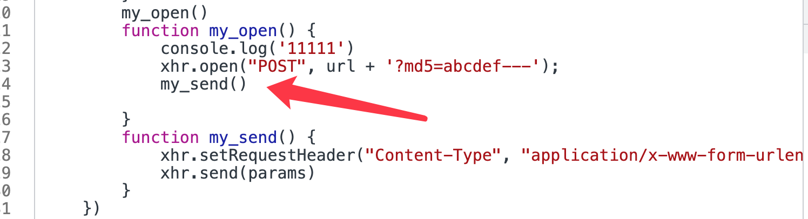

代码进行改造 使用hook 隐藏加密

```javascript
<!DOCTYPE html>
<html>
<head>
    <meta charset="UTF-8">
    <title>Title</title>
</head>
<body>
  <button type="button">button</button>
<script>
    document.querySelector('button').addEventListener('click', function (){
        var xhr = new XMLHttpRequest()
        var params = "param1=value1&param2=value2";
        var url = "http://127.0.0.1:5000/ajax/";

        var my_open = XMLHttpRequest.prototype.open
        XMLHttpRequest.prototype.open = function () {
            console.log('进行加密啦')
            var url = arguments[1]
            arguments[1] = url + '?md5=abcdef---'
            return my_open.apply(this, arguments)
        }
 
        xhr.onreadystatechange = function (){
            if(xhr.readyState == 4 && xhr.status == 200){
                var response = xhr.responseText;
                console.log(response)
            }
        }
        xhr.open("POST", url)
        xhr.setRequestHeader("Content-Type", "application/x-www-form-urlencoded");
        xhr.send(params)
    })

</script>
</body>
</html>
```

在浏览器进行调试查看  发现此刻无法查找到加密位置

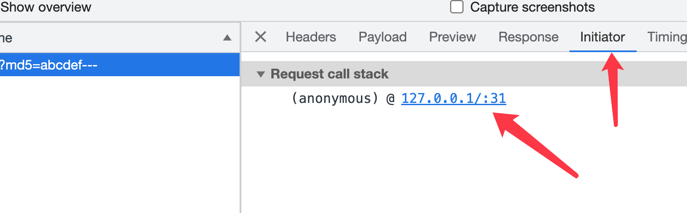

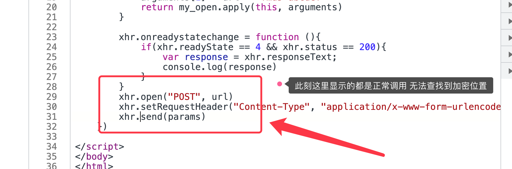

出现这种情况可以进行如下操作

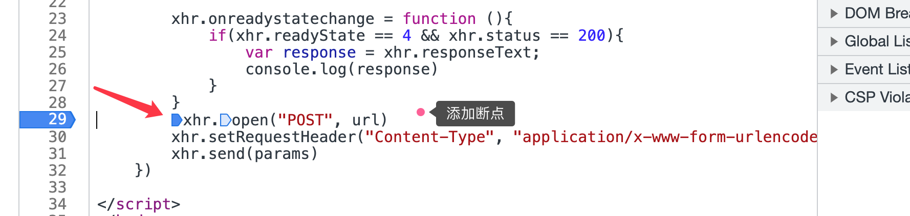

在console中输入XMLHttpRequest.prototype.open 通过打印查看

此刻能够查看到并不是原生的open  而是被修改后的open  此刻便查找到了加密位置

原生的open的代码应该是这样的

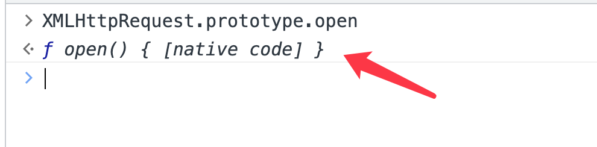

被修改后的open

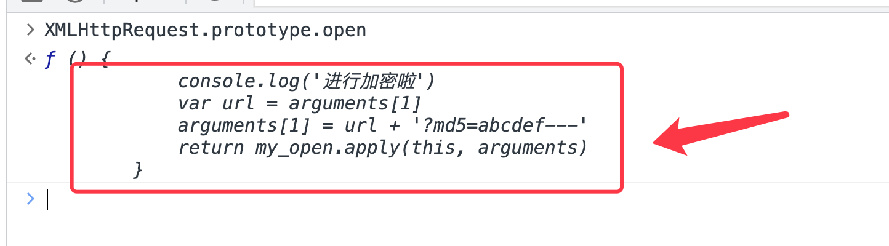

+ XMLHttpRequest.prototype.open  Hook实例

  **网址：**  http://www.fangdi.com.cn/old_house/old_place.html?district3=27d3af3bd45acf5e

  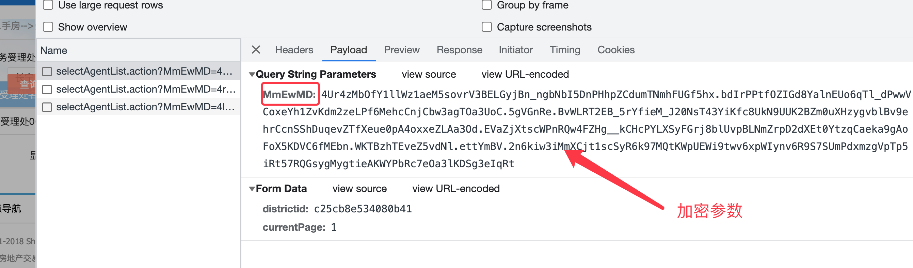

  点击js调用栈

  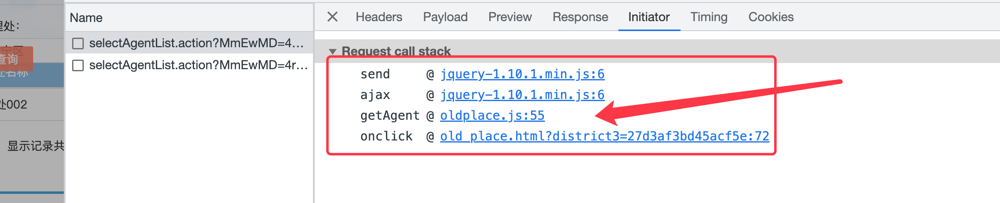

  点击进入后 通过打断点 并没有发现在请求里面那么长的参数

  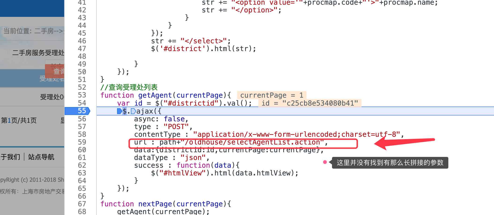

  此刻进入到终端 查看当前是否使用hook进行了加密

  XMLHttpRequest.prototype.open

  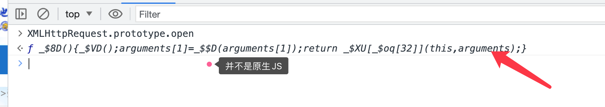

  点击进入 查找到加密位置

  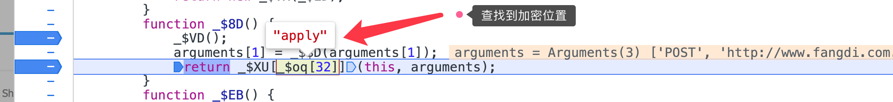

  

#### (3) JQuery Ajax

+ **概述**

  jQuery Ajax是一个用于进行异步请求的JavaScript库。它提供了一种简单而强大的方式来发送HTTP请求，并在后台与服务器进行通信，而无需刷新整个页面。

+ **请求类型**

  使用jQuery Ajax，您可以通过以下方式发送不同类型的HTTP请求：

  - GET请求：用于从服务器获取数据。

  - POST请求：用于向服务器提交数据。

  - PUT请求：用于更新服务器上的数据。

  - DELETE请求：用于从服务器删除数据。

+ **jQuery Ajax发送GET请求的示例：**

  ```javascript
  $.ajax({
    url: "http://example.com/data",
    type: "GET",
    // method: "GET", method和type都是指定请求的方式
    success: function(response) {
      // 在成功接收到响应时执行的回调函数
      console.log(response);
    },
    error: function(xhr, status, error) {
      // 在请求失败时执行的回调函数
      console.log("请求失败：" + error);
    }
  });
  ```

+ **说明**

  在这个例子中，我们使用`$.ajax()`函数发送一个GET请求到指定的URL。`url`参数指定目标URL，`type`参数指定请求类型为GET。`success`参数是一个函数，在成功接收到响应时被调用，并将服务器返回的数据作为参数传递给该函数。`error`参数是一个函数，在请求失败时被调用，并将错误信息作为参数传递给该函数。

+ **jQuery Ajax发送POST请求的示例：**

  使用jQuery Ajax发送POST请求的方法与发送GET请求类似，只需将`type`参数设置为"POST"，并通过`data`参数传递要发送的数据。

  下面是一个示例

  ```javascript
  $.ajax({
    url: "http://example.com/submit",
    type: "POST",
    // method: "GET", method和type都是指定请求的方式
    data: {
      name: "John",
      age: 25
    },
    success: function(response) {
      // 在成功接收到响应时执行的回调函数
      console.log(response);
    },
    error: function(xhr, error) {
      // 在请求失败时执行的回调函数
      console.log("状态码为：" + xhr.status, "请求失败：" + error);
    }
  });
  ```

+ **说明：**

  在这个例子中，我们使用`$.ajax()`函数发送一个POST请求到指定的URL。`url`参数指定目标URL，`type`参数设置为"POST"以指定请求类型为POST。`data`参数是一个对象，其中包含要发送的数据，可以根据需要添加更多字段和值。

  当服务器成功处理请求并返回响应时，`success`回调函数将被调用，并将服务器返回的数据作为参数传递给该函数。在请求失败时，`error`回调函数将被调用，并将错误信息作为参数传递给该函数。

+ 注意：

  当使用 `$.ajax` 发送请求时，如果请求失败且 `xhr.status` 的值为 0，表示该请求在发送过程中发生了错误，无法获取有效的 HTTP 状态码。

#### (4) 跨域请求

##### 4.1 概述

跨域请求指的是在浏览器环境下，通过JavaScript代码向不同源（即协议、域名或端口不同）的服务器发送 HTTP 请求。由于浏览器出于安全考虑实施了同源策略（Same-Origin Policy），默认情况下，JavaScript 只能与同一源的服务器进行通信。

当 JavaScript 代码试图向不同源的服务器发送请求时，浏览器会阻止这个请求，以保护用户的安全和隐私。这是因为跨域请求可能会引发一些安全风险，例如跨站点脚本攻击（Cross-Site Scripting，简称 XSS）。同源策略要求请求必须遵循以下规则：

- 协议相同：两个页面的协议（如 http 或 https）必须相同。
- 域名相同：两个页面的域名必须完全相同。
- 端口相同：两个页面的端口号必须完全相同。

如果不满足以上全部条件，就会被视为跨域请求。例如，在网页 http://example.com/index.html 中使用 JavaScript 发送请求到 http://api.example.com/data 接口，就属于跨域请求。

需要注意的是，跨域请求并不限于 AJAX 请求，它也适用于其他类型的资源请求，比如 ``、`<script>`、`<link>` 等。

为了在跨域情况下实现安全的通信，可以使用一些特定的技术和策略，如 JSONP、CORS、代理服务器等。这些方式可以绕过浏览器的同源策略限制，从而实现跨域请求。

##### 4.2 代码准备

+ 服务器端代码

  ```python
  from flask import Flask, render_template, request, make_response
  app = Flask(__name__)
  @app.route('/ajax/', methods=['GET', 'POST'])
  def ajax():
      if request.method == 'POST':
          print("POST===>", request.form)
          return {'name': 'POST'}
      if request.args:
          print('GET=>>>>>>', request.args)
          return {'name': 'GET'}
      return render_template('ajax.html')
  if __name__ == '__main__':
      app.run(debug=True)
  ```

+ 前端代码  ajax.html

  ```html
  <!DOCTYPE html>
  <html>
  <head>
      <meta charset="UTF-8">
      <title>Title</title>
      <script src="https://code.jquery.com/jquery-3.7.0.min.js"></script>
  </head>
  <body>
    <button type="button" id="jq_btn_get">GET请求</button>
    <button type="button" id="jq_btn_post">POST请求</button>
  <script>
      // post
      $('#jq_btn_post').click(function (){
        // POST
          $.ajax({
              url: 'http://127.0.0.1:5000/ajax/?name=lucky',
              type: 'POST',
              data: {
                  name: 'lucky',
                  age: 18,
              },
              success: function(response){
                  console.log(response)
              },
              error: function (xhr, error) {
                  console.log(xhr.status, error)
              }})
      })
      // GET
      $('#jq_btn_get').click(function (){
          $.ajax({
              url: 'http://127.0.0.1:5000/ajax/?name=lucky',
              type: 'GET',
              success: function (response) {
                  console.log(response.name)
              },
              error: function (xhr, error) {
                  console.log('xhr', xhr.status)
                  console.log('error', error)
              }})
      })
  </script>
  </body>
  </html>
  ```

##### 4.3 同源访问与跨域访问

+ **同源访问**

  此刻如果正在通过flask运行访问 http://127.0.0.1:5000/ajax/则正常访问 因为此刻为同源访问

  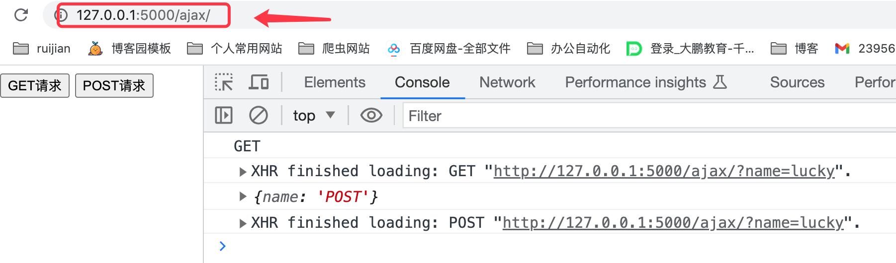

+ **跨域访问**

  也就是单独运行HTML文件  此刻请求失败 出现了跨域请求

  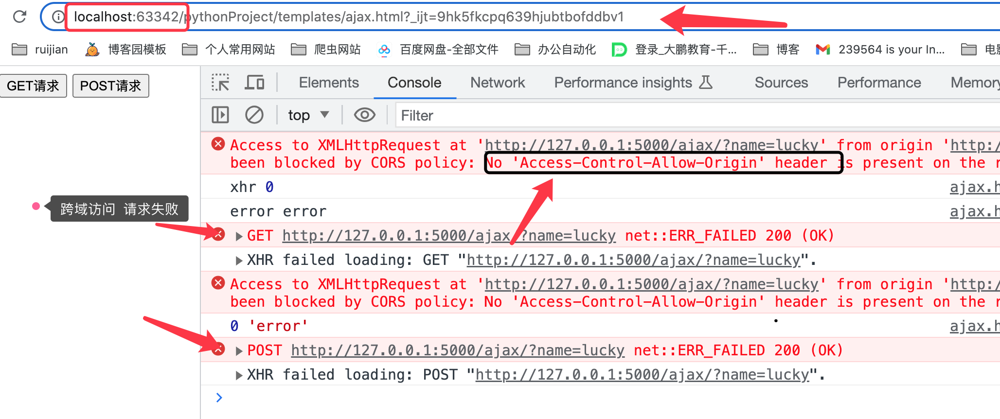  

##### 4.4 解决方式

+ **Access-Control-Allow-Origin**

  在服务器端进行设定响应头  Access-Control-Allow-Origin

  ```python
  from flask import Flask, render_template, request, make_response
  app = Flask(__name__)
  @app.route('/ajax/', mehods=['GET', 'POST'])
  def ajax():
      if request.method == 'POST':
          print("POST===>", request.form)
          response = make_response({'name': 'POST'})
          # 设置响应头  允许跨域
          response.headers['Access-Control-Allow-Origin'] = '*'
          return response
  
      if request.args:
          print('GET=>>>>>>', request.args)
          response = make_response({'name': 'GET'})
          # 设置响应头  允许跨域
          response.headers['Access-Control-Allow-Origin'] = '*'
          return response
      return render_template('ajax.html')
  
  if __name__ == '__main__':
      app.run(debug=True)
  ```

  进行访问

  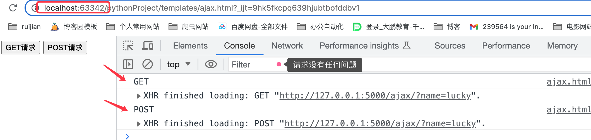

+ **JSONP**

  + 前端代码

    ```javascript
    <!DOCTYPE html>
    <html>
    <head>
        <meta charset="UTF-8">
        <title>Title</title>
        <script src="https://code.jquery.com/jquery-3.7.0.min.js"></script>
    <!--    <script src="http://127.0.0.1:5000/ajax/?name=lucky"></script>-->
    </head>
    <body>
    <script>
        url = 'http://127.0.0.1:5000/new_ajax/'
        jsonp(function (data) {
            console.log(data)
        })
    
        function jsonp(fn){
            var time = Date.now();  // 用于起不重复的函数名
            var prefix = 'callback'  // 请求传递的key名称
            url += `?${prefix}=${time}`  // 参数拼接到url
            var my_script = document.createElement('script')  // 创建script节点
            my_script.setAttribute('src', url)   // 设置url
            console.log(my_script)
            document.querySelector('head').appendChild(my_script)
            window[prefixre+time] = fn  // 设定执行功能的函数
        }
    </script>
    </body>
    </html>
    ```

  + 后端代码

    ```python
    @app.route('/new_ajax/')
    def new_ajax():
        time = request.args.get('callback')
        return 'callback'+time+'({"name": "lucky", "age": 18, "con": "服务器端返回js数据"})'
    ```

  + 注意

    1. 只能get请求
    2. 服务端返回内容为js代码   浏览器会解析执行调用js代码
    3. 当前请求只会出现在js菜单中  不再是xhr

  + 运行图例

    找到当前请求查看请求参数

    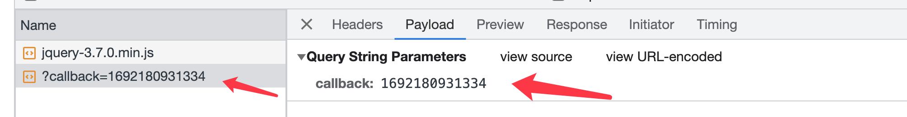

    查看请求返回内容

    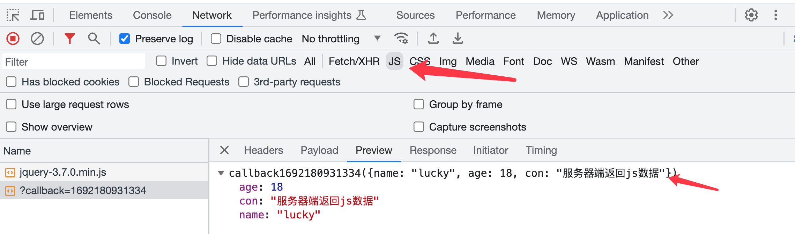

    查看控制台执行打印内容

    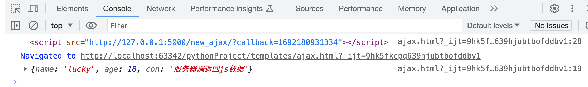

+ ajax的JSONP

  前端代码

  ```javascript
  $('#JSONP').click(function (){
           $.ajax({
            url: 'http://127.0.0.1:5000/new_ajax/',
            dataType: 'jsonp',
            jsonp: 'callback',
            success: function(data) {
               // 处理返回的数据
                console.log('返回数据', data)
            },
          });
  })
  ```

  后端代码

  ```python
  @app.route('/new_ajax/', methods=['GET', 'POST'])
  def new_ajax():
      time = request.args.get('callback')
      print(time)
      return str(time)+'({"name": "lucky", "age": 18, "con": "服务器端返回js数据"})'
  ```

  

+ 实战案例

  + www.taobao.com

    查看响应内容

    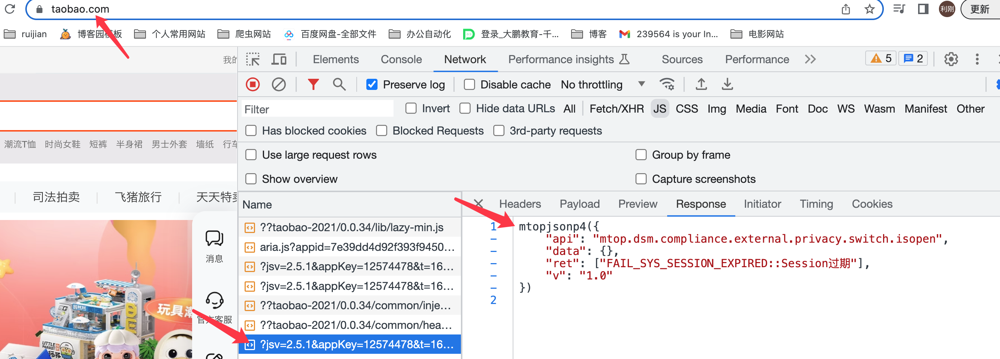

    查看请求内容

    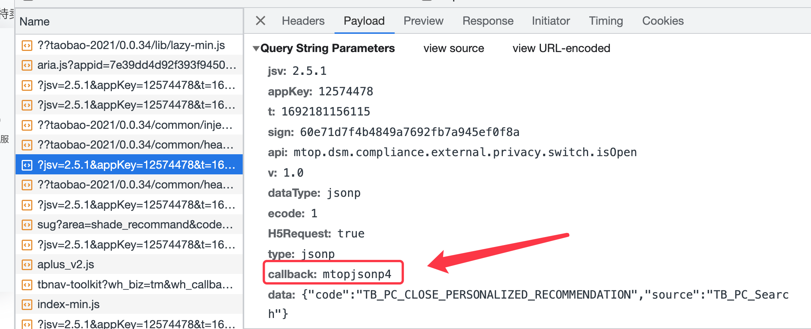

    查看当前请求的url

    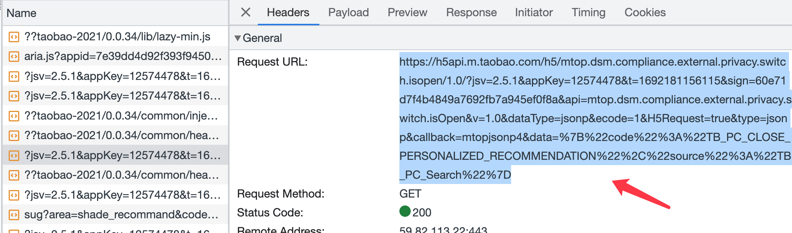

    当前url直接在浏览器中进行请求

    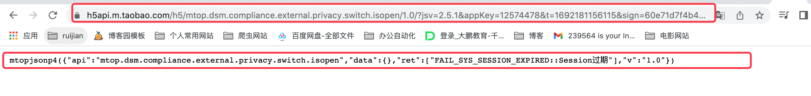

  + www.jd.com

    根据js点击查看找到jsonp的请求

    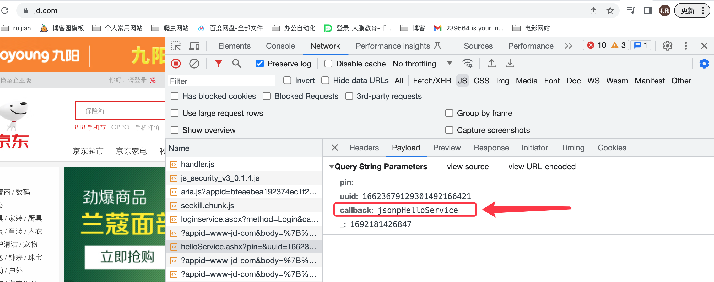

    查看响应内容

    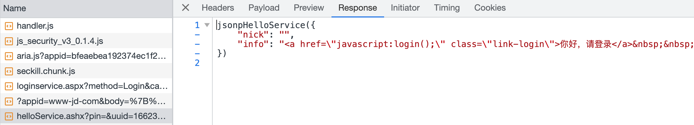

    

## 九、axios

#### (1) 概述

在JavaScript中，Axios是一个流行的第三方库，用于进行HTTP请求。它提供了一种简单、灵活和强大的方式来与后端服务器进行通信，并处理响应数据。

Axios具有以下功能和作用：

1. 发送HTTP请求：Axios可以发送GET、POST、PUT、DELETE等各种类型的HTTP请求。它提供了简洁的语法和易于使用的方法，使得发送请求变得非常方便。
2. 处理响应数据：Axios可以接收服务器返回的响应数据，并提供多种处理方式。你可以使用Axios的拦截器对请求和响应进行预处理，也可以对响应数据进行转换、过滤、分析等操作。
3. 支持并发请求：Axios支持同时发送多个并发请求，并且提供了合并返回结果、取消请求等功能。这对于需要同时获取多个数据或者批量提交表单等场景非常有用。
4. 设置请求配置：Axios允许你设置请求的各种配置，包括请求头、超时时间、认证信息等。你可以通过全局配置或者针对特定请求进行定制，从而满足不同的需求。
5. 处理错误和异常：Axios可以捕获请求过程中的错误和异常，并提供适当的错误处理机制。你可以根据请求状态码、网络错误、超时等情况来定制错误处理逻辑。

总之，Axios是一个功能强大且易于使用的HTTP请求库，在JavaScript中广泛应用于前端开发中与后端API进行通信的场景。它简化了请求过程的操作和管理，提高了开发效率，并提供了丰富的功能来满足各种需求。

#### (2) 通过axios.create创建对象进行发起请求

+ 需要发送HTTP请求的地方，通过创建Axios实例来使用Axios。可以通过以下方式引入Axios库并创建实例

  ```html
  <script src="https://lf3-cdn-tos.bytecdntp.com/cdn/expire-1-M/axios/0.26.0/axios.min.js" type="application/javascript"></script>
  <script src="https://code.jquery.com/jquery-3.7.0.min.js"></script>
  ```

  代码实例

  ```javascript
  // 创建Axios实例
  const instance = axios.create({
    baseURL: 'https://api.example.com', // 设置基础URL
    timeout: 5000, // 设置超时时间
    headers: { // 设置请求头
      'Content-Type': 'application/json',
    }
  });
  ```

+ 发送GET请求：

  ```javascript
  instance.get('/api/users?name=lucky').then(response => {
      // 处理响应数据
      console.log(response.data);
    })
    .catch(error => {
      // 处理错误
      console.error(error);
    });
  ```

+ 发送POST请求：

  ```javascript
  instance.post('/api/users', {
      name: 'lucky',
      email: 'lucky@example.com'
    })
    .then(response => 
      // 处理响应数据
      console.log(response.data);
    })
    .catch(error => {
      // 处理错误
      console.error(error);
    });
  ```

+ 实例

  客户端代码   axios.html

  ```javascript
  <!DOCTYPE html>
  <html lang="en">
  <head>
      <meta charset="UTF-8">
      <title>Title</title>
      <script src="https://lf9-cdn-tos.bytecdntp.com/cdn/expire-1-M/jquery/1.9.1/jquery.min.js" type="application/javascript"></script>
      <script src="https://lf3-cdn-tos.bytecdntp.com/cdn/expire-1-M/axios/0.26.0/axios.min.js" type="application/javascript"></script>
  </head>
  <body>
  <button>点击发送</button>
  </body>
  </html>
  <script>
  $('button').click(function(){
      var instance = axios.create({
          baseURL: 'http://127.0.0.1:5000',
          timeout: 5000,
          headers:{
              // 'Content-Type': 'application/json',  // 发送JSON数据
              "Content-Type": "application/x-www-form-urlencoded", // 发送表单数据
          }
      });
    	// 发送JSON数据
      // instance.post('/axios/',{'name':'lucky'}).then(response=>{
      // 发送表单数据
    	instance.post('/axios/','name=lucky').then(response=>{
          console.log(response.data, '成功')
      }).catch(error=>{
          console.log('error', error)
      })
  }
  </script>
  ```

  服务端代码  manage.py

  ```python
  from flask import Flask,render_template,jsonify,request,make_response # 导入flask类
  # 实例化Flask类
  app = Flask(__name__)
  
  # 渲染ajax模板
  @app.route('/')
  def post():
      return render_template('axios.html')
  
  # 更改路由请求方式为post和get
  @app.route('/axios/',methods=['GET','POST'])
  def test_ajax():
      if request.method == 'POST':
          # 接收POST数据
          print('接收表单数据', request.form)     # 接收表单数据
          # print('接收JSON数据', request.json)   # 接收JSON数据
      else:
          # 接收GET数据
          print(request.args)
      response = make_response({"name": "lucky", "age": 18, "con": "服务器端返回js数据"})
      # 设置响应头  允许跨域
      response.headers['Access-Control-Allow-Origin'] = '*'
      return response
  
  # 判断值在本模块才运行
  if __name__ == '__main__':
      app.run(debug=True) # 运行
  ```

  

#### (3) 直接进行get和post发起请求

+ **`axios.get`发送GET请求格式：**

  ```javascript
  axios.get(url[, config])
    .then(response => {
      // 处理响应数据
      console.log(response.data);
    })
    .catch(error => {
      // 处理错误
      console.error(error);
    });
  ```

+ **使用`axios.post`发送POST请求格式：**

  ```javascript
  axios.post(url[, data[, config]])
    .then(response => {
      // 处理响应数据
      console.log(response.data);
    })
    .catch(error => {
      // 处理错误
      console.error(error);
    });
  ```

  注意：发送post请求默认请求头为 application/json

+ **参数说明**

  + `url` 是要发送POST请求的目标URL。

  + `data` 是要发送的数据，可以是对象、字符串、FormData等。

  + `config` 是一个可选参数，用于配置请求。其中包括请求头、超时时间等等。

    使用这些方法时，你可以根据实际需要传递不同的参数，如URL、请求体数据、请求配置等。然后，通过Promise的`.then()`方法处理请求成功后的响应数据，通过`.catch()`方法处理请求出错时的错误信息。

+ **实例**

  + get实例

    ```javascript
    axios.get('http://127.0.0.1:5000/axios/?name=lucky').then(response=>{
      console.log(response.data, '成功')
    }).catch(error=>{
    	console.log('error', error)
    })
    ```

  + post实例

    ```javascript
    axios.post('http://127.0.0.1:5000/axios/',{'name':'lucky'}, {'Content-Type': 'application/json'}).then(response=>{
      console.log(response.data, '成功')
    }).catch(error=>{
      console.log('error', error)
    })
    ```

#### (4) 注意

Axios库中的所有请求方法，包括`axios.get`、`axios.post`等，都会返回一个Promise实例。这意味着你可以使用Promise的链式调用语法（`.then().catch()`）来处理异步请求的结果。

通过调用`axios.get`方法发送GET请求时，它会返回一个Promise对象。你可以使用`.then()`方法来处理请求成功后的响应数据，使用`.catch()`方法来处理请求出错时的错误信息。

#### (5) axios.create和axios.get/post 的区别

`axios.create`和`axios.get`是Axios库中的两个不同的方法，它们有以下区别：

1. 功能不同：

   - `axios.create`：`axios.create`方法用于创建一个新的Axios实例。通过这个实例，可以设置自定义的配置、拦截器、默认请求头等。创建实例后，可以使用该实例发送各种类型的HTTP请求。
   - `axios.get`：`axios.get`方法是Axios库提供的特定的HTTP GET请求方法，用于发送GET请求并获取服务器返回的数据。

2. 使用方式不同：

   - `axios.create`：`axios.create`方法需要先调用创建实例，并将返回的实例赋值给一个变量，然后通过这个变量来发送HTTP请求。创建实例时可以设置全局的基础URL、请求超时时间、请求头等配置。
   - `axios.get`：`axios.get`方法直接调用Axios库提供的全局的GET请求方法，无需创建实例。只需提供请求的URL和可选的配置参数即可发送GET请求。

   #### (6) axios和ajax的区别

   **Axios和Ajax都是用于在前端发送HTTP请求的工具，但它们之间有以下几个主要区别：**

   1. 底层实现方式：
      - Axios: Axios是一个基于Promise的现代化的HTTP客户端库，使用了浏览器内置的XMLHttpRequest或者Node.js中的http模块来实现底层的HTTP请求。
      - Ajax: Ajax（Asynchronous JavaScript and XML）是一种使用原生的JavaScript和XMLHttpRequest对象进行异步通信的技术。
   2. 语法和接口：
      - Axios: Axios提供了简洁、易用的API接口，以链式调用的形式处理请求和响应。它返回的是Promise实例，可以使用async/await等语法糖进行更加方便的异步操作。
      - Ajax: Ajax需要手动创建XMLHttpRequest对象，并通过事件监听的方式处理请求和响应。它通常使用回调函数来处理异步操作，代码结构较为繁琐。
   3. 功能和特性：
      - Axios: Axios支持在浏览器和Node.js环境中使用，提供了丰富的功能，如拦截器、取消请求、全局配置、错误处理等。它还能自动转换请求和响应数据，支持多种格式，如JSON、FormData等。
      - Ajax: Ajax主要用于浏览器环境中，只提供了基本的发送HTTP请求和处理响应的功能，不支持自动转换数据格式等高级特性。

   综上所述，Axios是一个基于Promise的现代化HTTP客户端库，相比传统的Ajax更加易用、功能丰富。它提供了优雅的API接口和许多便捷的功能，使得在前端开发中处理HTTP请求变得更加方便和高效。

#### (5)  拦截器 interceptors

+ 概述

  它提供了拦截器(interceptors)的功能，可以在请求发送或响应返回之前对其进行拦截和处理。

  使用Axios拦截器可以实现很多功能，例如：

  1. 添加公共请求头：你可以在请求发送之前通过拦截器向请求中添加一些公共的请求头信息，这样可以减少重复代码的编写。
  2. 请求错误处理：在请求返回时，你可以使用拦截器来统一处理请求的错误，比如网络错误、认证错误等。
  3. 认证处理：拦截器还可以用于处理认证相关的操作，例如在每个请求中添加认证信息、刷新token等。
  4. 进行反扒处理 加密数据 携带token

+ **请求拦截器**

  ```javascript
  axios.interceptors.request.use(
    (config) => {  // 成功执行函数
      // 在请求发送之前可以对请求进行处理
      console.log(config, '拦截成功')
      // 添加请求头类型
      config['headers']['Content-Type'] = 'application/json'
      return config
    },(error) => {  // 失败执行函数
      // 处理请求错误
      return Promise.reject(error, '拦截失败');
  })
  ```

+ **响应拦截器** （用于处理错误、或対相应数据进行解密等操作） 在上方进行拦截

  ```javascript
  // 响应拦截器
  axios.interceptors.response.use(
    (response) => {   // 成功执行函数
      // 在响应返回之前可以对响应进行处理
      response.data.name = '迪丽热巴'  // 进行解密 将lucky解密为迪丽热巴 
      console.log(response, '响应拦截')
      return response;
    },
    (error) => {   // 失败执行函数
      // 处理响应错误
      return Promise.reject(error);
    }
  );
  ```

+ 上面使用axios.create创建的请求 需要使用其对应的对象进行拦截

  ```javascript
  // 创建请求对象instance
  let instance = axios.create({
    baseURL: 'http://127.0.0.1:5000', // 设置基础URL
    timeout: 5000, // 设置超时时间
    headers: { // 设置请求头
    'Content-Type': 'application/json',
    }
  });
  // 进行拦截
  // 请求拦截器
  instance.interceptors.request.use(response=>{},error=>{})
  
  // 响应拦截器
  instance.interceptors.response.use(response=>{},error=>{})
  instance.get('/axios/?name=lucky&age=18').then(response => {
          // instance.post('/axios/',{name: 'lucky', 'age': 18}).then(response => {
              console.log('response===>', response);
          }).catch(error => {
              // 处理错误
              console.error('error', error);
  });
  ```

​	注意：拦截器需要放请求上方

#### (6) 实战案例

https://ctbpsp.com/#/

+ 发现加密数据

  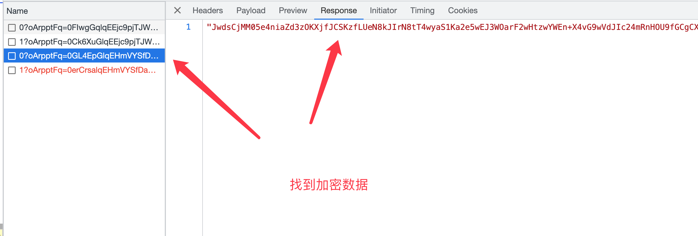

+ 通过调用栈发现Promise.then  这种情况绝大多数为拦截器 直接搜索interceptors即可

  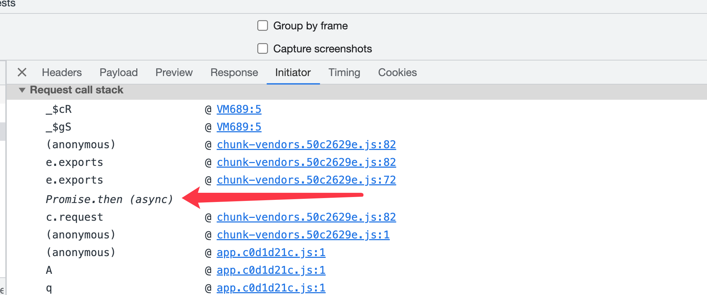

+ 搜索到后进行点击进行查看

  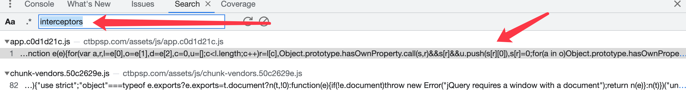

+ 通过查找 interceptors找到当前进行解密的代码 

  找到拦截器的位    进行打断点

  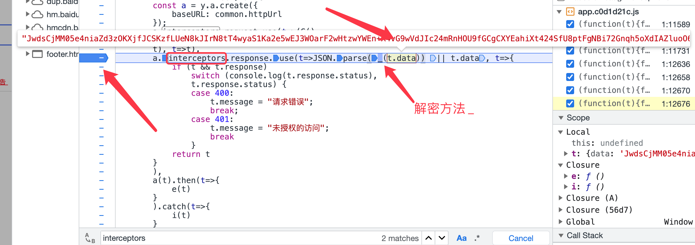

+ 通过断点 找到当前解密函数

  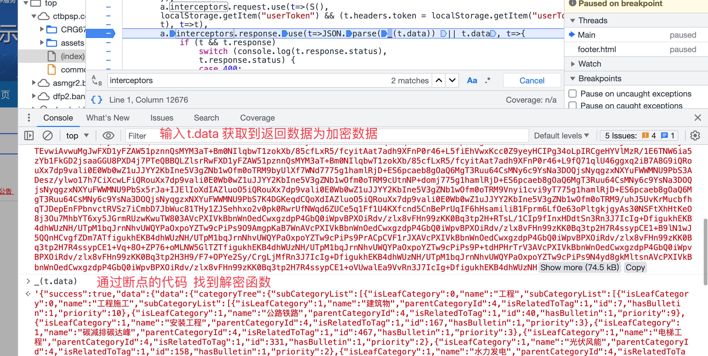

+ 进入到加密函数位置

  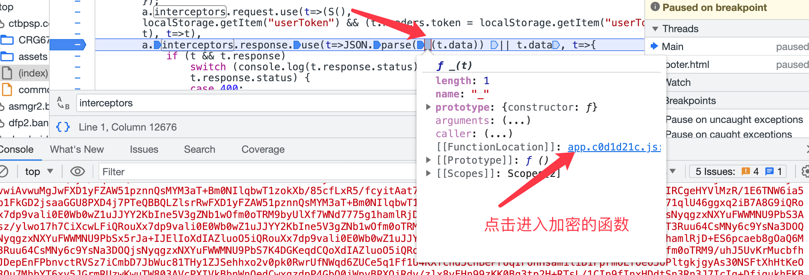

+ 发现加密算法

  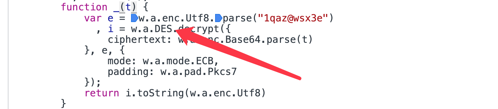