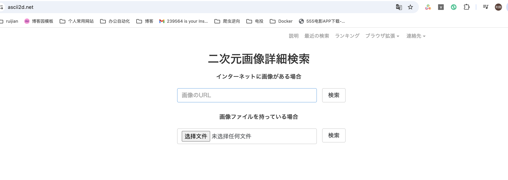
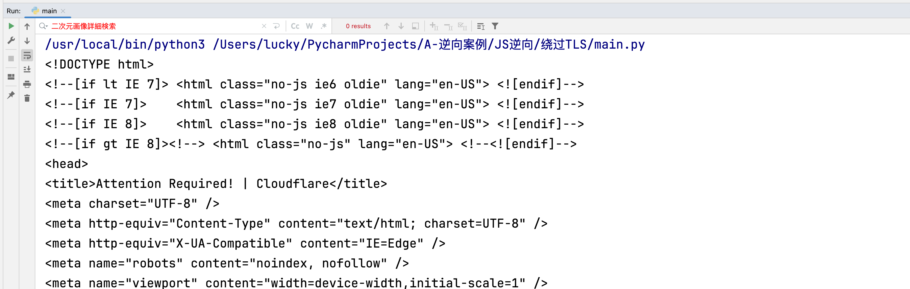
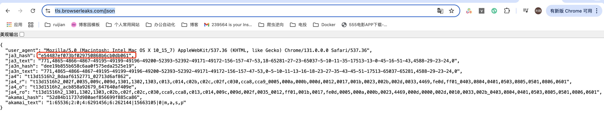
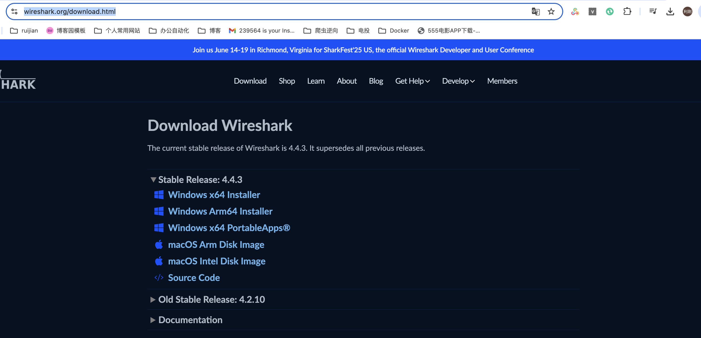
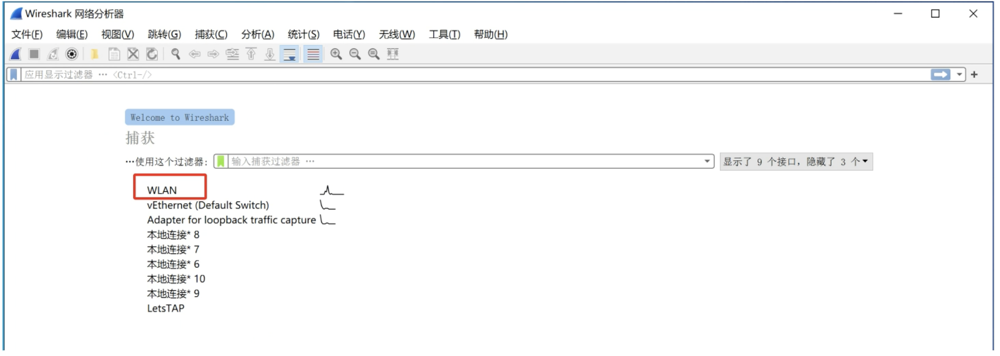
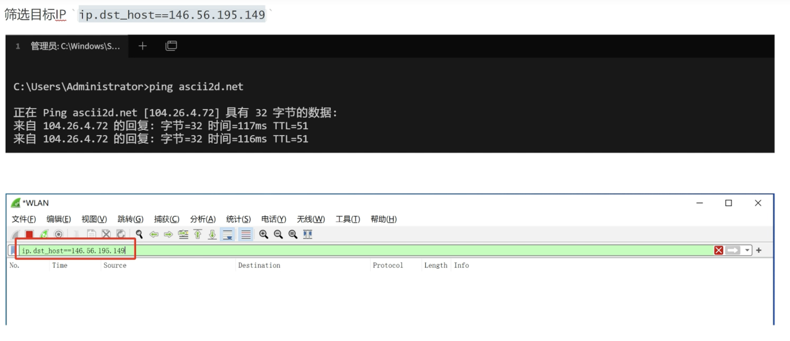
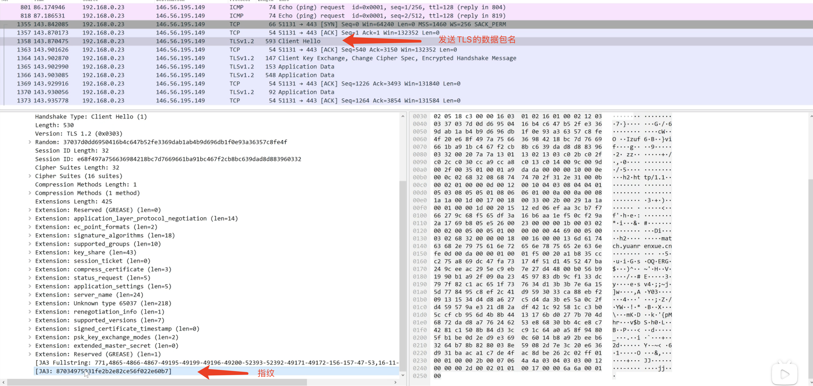
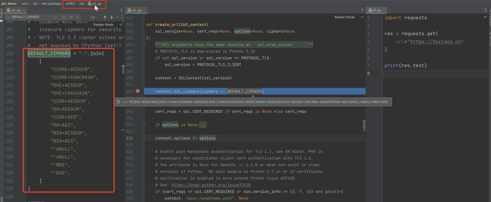

# 三十二、TLS指纹绕过

**什么是TLS指纹校验?**
客户端   http    服务端
客户端     https = TLS/SSL + http   服务端
也就是说，TLS只存在于https请求中

**服务端接收请求后**：

​					第1次 TLS/SSL(握手通过/不通过)

​					 第2次 http(数据)

**视频资料**
https://www.bilibili.com/video/BV16u4y1j7eN?vd_source=87cd9028314be53c0d99d132ffe7796d&spm_id_from=333.788.player.switch&p=2

### 1、案例

+ 网站：https://ascii2d.net/

**浏览器访问**




**代码访问**

```python
import requests
url = "https://ascii2d.net/"
res = requests.get(url,headers={'user-Agent': 'Mozilla/5.0 (Macintosh; Intel Mac os x 10_15_7) ApplewebKit/537.36 (KHTML, like Gecko)Chrome/96.0.4664.93 safari/537.36'})
print(res.text)
```

**返回结果**




### 2、检测并返回指纹信息

**网址：**  https://tls.browserleaks.com/json



### 3、更细致分析TLS工具

#### (1) 网址和下载

**网址**：https://www.wireshark.org/download.html

如果想要更细致分析TLS、可以使用wireshark



#### (2) 抓网卡

打开wireshark，选择要抓包监测的网卡，选择你上网使用的那个网卡。



#### (3) 筛选IP

获取域名ip并筛选




#### (4) 查看代码/浏览器发送请求的TLS指纹



### 2、绕过TLS指纹

#### (1) 方式一 

urllib3解决（有的可能不过，因为还会检测别的值）

requests发送请求依赖于 -> urllib3  那么当前代码中生成指纹的位置

注意版本(如果你当前的版本搜不到、那么尝试降低版本安装以下版本在查找)

```
pip install urllib3==1.26.15
pip install urllib3==1.26.16
pip install urllib3=-2.0.7
```



```python
import requests
urllib3.util.ssl_.DEFAULT_CIPHERS =":".join([
# "ECDHE+AESGCM"
# "ECDHE+CHACHA20"
# "DHE+AESGCM"，
# "DHE+CHACHA20"
# "ECDH+AESGCM"
# "DH+AESGCM"
# "ECDH+AES"
"DH+AES",
"RSA+AESGCM",
"RSA+AES",
"!aNULL",
"!eNULL",
"!MD5",
"!DSS",
])
url = "https://tls.browserleaks.com/json"
res = requests.get(url,headers={'user-Agent': 'Mozilla/5.0 (Macintosh; Intel Mac os x 10_15_7) ApplewebKit/537.36 (KHTML, like Gecko)Chrome/96.0.4664.93 safari/537.36'})
print(res.json())
```

**说明：**

注释掉一些内容，使当前的值发生更改，以绕过SSL指纹

#### (2) 方式二 

curl-cffi 解决（推荐）

**模块地址：** https://pypi.org/project/curl-cffi/#description

+ curl是一个可以发送网络请求的工具
+ curl-impersonate是一个基于curl基础上进行开发的一个工具，可以完美的模拟主流的浏览器
+ curl_cffi，是套壳curl-impersonate，让此工具可以更方便的应用在Python中。

**安装**

+ pip install curl-cffi

**使用**

```python
from curl_cffi import requests
# TLS检测网站
url = "https://ascii2d.net/"
res = requests.get(url,headers={'user-Agent': 'Mozilla/5.0 (Macintosh; Intel Mac os x 10_15_7) ApplewebKit/537.36 (KHTML, like Gecko)Chrome/96.0.4664.93 safari/537.36'},impersonate="chrome101")
print(res.text)
```

