# 三十三、微信小程序逆向开发

## 一、前置知识点

### 1、wxapkg文件

**如何查看微信小程序包文件**

打开微信的设置：

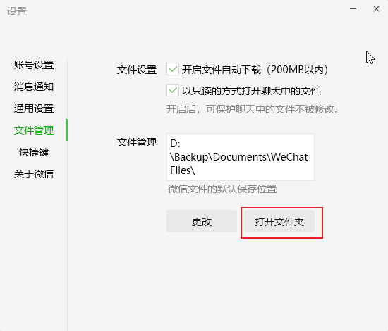

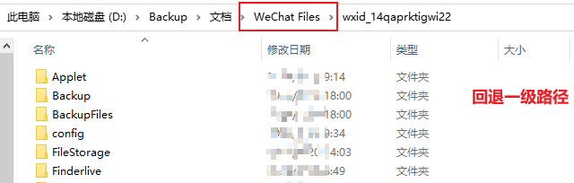


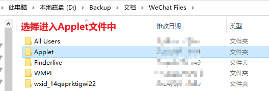


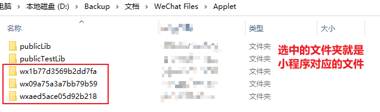

**.wxapkg概述**

.wxapkg是微信小程序的包文件格式，且其具有**独特的结构**和**加密方式**。它不仅包含了小程序的源代码，还包括了图像和其他资源文件，这些内容在普通的文件浏览器中是无法直接访问的。这种特殊的包装方式是为了保护小程序的代码和资源不被轻易获取和篡改，确保了小程序的安全性。


### 2、解密工具unpackminiapp

unpackminiapp主要用于解密微信小程序的.wxapkg文件，将其转换为可以进一步反编译的格式。该工具能够自动解密小程序包，并将解密后的文件存储在指定的文件夹中，供后续步骤使用。

**注意：**

- 在使用该工具时，需要在该工具同级目录下**新建一个wxpack的文件夹**，用于存储解密后的wxapkg文件。
- 如果要解密多个文件，则需要对解密后的文件依次进行重命名。因为该工具对解密后的每一个文件的命名是一致的，不重新命名会产生文件覆盖。

### 3、反编译工具unveilr

使用unveilr可以直接通过命令行对.wxapkg文件进行反编译，并将结果输出到指定的文件夹中。

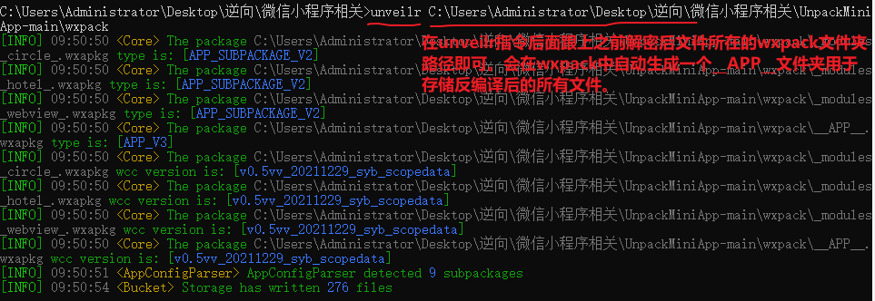

### 4、微信开发者工具

当使用unveilr完成对小程序的反编译后，微信开发者工具将发挥其强大的功能，帮助开发者进一步进行开发和调试微信小程序。

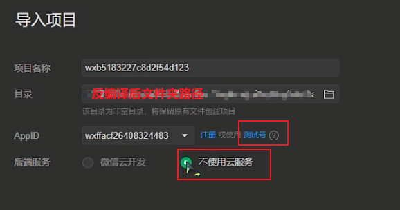

打开应用后，设置详情：

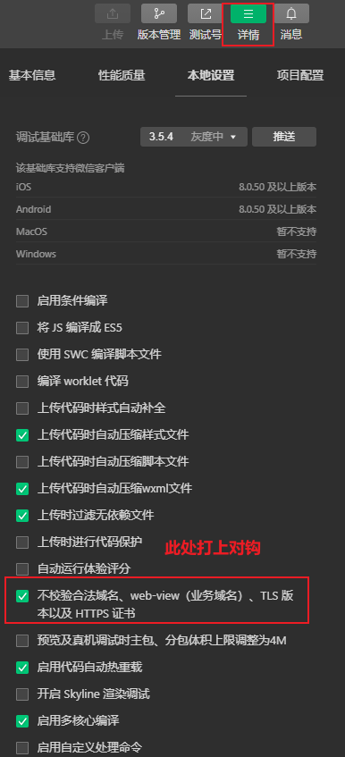

### 5、NodeJs开发环境

Node是在浏览器之外运行js代码的开发环境，可以脱离浏览器在外部运行js程序。

## 二、案例

### 1、百达屋

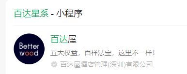

**该小程序中，众多数据包都需要用到两个加密的请求头参数（Signature和MessageId），接下来就逆向这两个参数！**

- 在微信中查看该小程序加密且编译后的文件

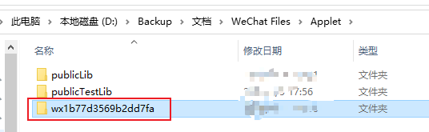

- 使用解密工具和反编译工具对该小程序包文件进行处理

- 使用微信开发者工具打开编译后的该小程序项目

  - 在详情的本地设置中点选上【不校验合法域名......】

- 在微信开发者工具中，打开network的XHR，然后在首页进入第一家店铺，下拉查看【圈子】，然后清空数据包，下拉刷新【圈子】，捕获加载数据的数据包：

  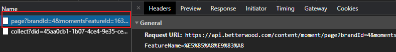

- 数据包分析：

  - 经过多次请求发现，该数据包的url不变
  - 请求头中存在一个**Signature**，保存的数据是一组16进制的数据，且是动态变化的需要逆向。
  - 请求头中存在一个**MessageId**，且是动态变化的需要逆向。

##### Signature逆向：

- 搜索”Signature：“关键字，定位在common.js数据包，注意，在js数据包中，先格式化再打断点：

  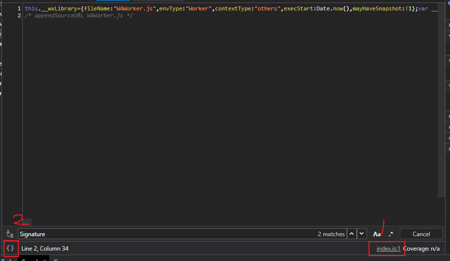

- 继续下拉页面，加载更多【圈子】内容，会执行如下断点：

  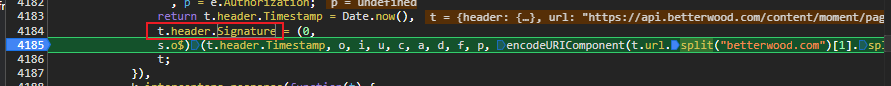

  - 其核心js代码为：

    ```js
    //调用(0, s.o$)返回的函数，传入10个参数，返回数据赋值给header.Signature
    t.header.Signature = (0, s.o$)(t.header.Timestamp, o, i, u, c, a, d, f, p, encodeURIComponent(t.url.split("betterwood.com")[1].split("?")[0]))
    //参数1：t.header.Timestamp为当前时间戳
    //参数2-9：o, i, u, c, a, d, f, p
    //参数10：encodeURIComponent(t.url.split("betterwood.com")[1].split("?")[0])，其中t.url可以抓包工具中查看为固定值
    ```

    - 在上述代码上面就可以查看参数2-8的值各自为：

      ```js
      //参数2-9：o, i, u, c, a, d, f, p，以此在抓包工具中查看各自变量的值
       var e = t.header //可直接删除变量e
       , o = e.OsVersion
       , i = e.DeviceManufacture
       , u = e.DeviceModel
       , c = e.ClientType
       , a = e.AppVersion
       , d = e.Channel
       , f = e.MessageId
       , p = e.Authorization;
      
      //解析变量值后，各个变量为：
       var o = "iOS 10.0.1"
       , i = "devtools"
       , u = "iPhone 12/13 (Pro)"
       , c = "5"
       , a = "3.0.1"
       , d = "bdw"
       , f = "3e85ee4b-653d-4d22-e84d-fba176ca1db8"
       , p = undefined;
      ```

  - 进入(0, s.o$)函数，查看函数实现：

    ```js
    L = function L(t, n, e, r, o, i, u, a, s, d) {
                    var f = "987EBBF8450544D7A52D5539DF9A92A2"
                      , l = "";
                    return l = s ? "AppVersion=".concat(i, "Authorization=").concat(s, "Channel=").concat(u, "ClientType=").concat(o, "DeviceManufacture=").concat(e, "DeviceModel=").concat(r, "MessageId=").concat(a, "OsVersion=").concat(n, "Timestamp=").concat(t, "AppKey=").concat(f, "Url=").concat(d) : "AppVersion=".concat(i, "Channel=").concat(u, "ClientType=").concat(o, "DeviceManufacture=").concat(e, "DeviceModel=").concat(r, "MessageId=").concat(a, "OsVersion=").concat(n, "Timestamp=").concat(t, "AppKey=").concat(f, "Url=").concat(d),
                        
                    //此处只有c()需要补全，其他代码可以直接执行
                    l = c()(l.replace(/\s*/g, "")).substring(4, 28).toLocaleUpperCase();
                }
    
    //改写该函数，将参数封装在函数内部
    function L(t, n, e, r, o, i, u, a, s, d) {
        			var t = Date.now();//参数1
        			// 参数10
                    var d = encodeURIComponent('https://api.betterwood.com/content/moment/feature/list'.split("betterwood.com")[1].split("?")[0]);
        			//参数2-9：
        			 var n = "iOS 10.0.1"
                     , e = "devtools"
                     , r = "iPhone 12/13 (Pro)"
                     , o = "5"
                     , i = "3.0.1"
                     , u = "bdw"
                     , a = "3e85ee4b-653d-4d22-e84d-fba176ca1db8"
                     , s = undefined;
        
                    var f = "987EBBF8450544D7A52D5539DF9A92A2"
                      , l = "";
                    return l = s ? "AppVersion=".concat(i, "Authorization=").concat(s, "Channel=").concat(u, "ClientType=").concat(o, "DeviceManufacture=").concat(e, "DeviceModel=").concat(r, "MessageId=").concat(a, "OsVersion=").concat(n, "Timestamp=").concat(t, "AppKey=").concat(f, "Url=").concat(d) : "AppVersion=".concat(i, "Channel=").concat(u, "ClientType=").concat(o, "DeviceManufacture=").concat(e, "DeviceModel=").concat(r, "MessageId=").concat(a, "OsVersion=").concat(n, "Timestamp=").concat(t, "AppKey=").concat(f, "Url=").concat(d),
                        
                    //此处只有c()需要补全，其他代码可以直接执行
                    l = c()(l.replace(/\s*/g, "")).substring(4, 28).toLocaleUpperCase();
                }
    ```

  - 补全c()函数，在上述代码c()函数处打断点，然后进入c函数内部：

    ```js
    function(e) {
        return new Md5(!0).update(e)[t]();
    }
    //此处为md5加密。然后return处打上断点查看未知项t是什么？发现t为hex（将加密数据转换成16进制的形式）
    
    //基于crypto-js模块改写该c()函数实现的数据加密
    function md5_encrypt(e){
        //npm install crypto-js
        var CryptoJS = require('crypto-js');
    	return CryptoJS.MD5(e).toString();
    }
    ```

  - 完整代码：

    ```js
    function md5_encrypt(e){
        var CryptoJS = require('crypto-js');
    	return CryptoJS.MD5(e).toString();
    }
    
    function L() {
        			var t = Date.now();//参数1
                    var d = encodeURIComponent('https://api.betterwood.com/content/moment/feature/list'.split("betterwood.com")[1].split("?")[0]);// 参数10
        			//参数2-9：
        			 var n = "iOS 10.0.1"
                     , e = "devtools"
                     , r = "iPhone 12/13 (Pro)"
                     , o = "5"
                     , i = "3.0.1"
                     , u = "bdw"
                     , a = "3e85ee4b-653d-4d22-e84d-fba176ca1db8"
                     , s = undefined;
    
                    var f = "987EBBF8450544D7A52D5539DF9A92A2"
                      , l = "";
                    return l = s ? "AppVersion=".concat(i, "Authorization=").concat(s, "Channel=").concat(u, "ClientType=").concat(o, "DeviceManufacture=").concat(e, "DeviceModel=").concat(r, "MessageId=").concat(a, "OsVersion=").concat(n, "Timestamp=").concat(t, "AppKey=").concat(f, "Url=").concat(d) : "AppVersion=".concat(i, "Channel=").concat(u, "ClientType=").concat(o, "DeviceManufacture=").concat(e, "DeviceModel=").concat(r, "MessageId=").concat(a, "OsVersion=").concat(n, "Timestamp=").concat(t, "AppKey=").concat(f, "Url=").concat(d),
    
                    //此处只有c()需要补全，其他代码可以直接执行
                    l = md5_encrypt(l.replace(/\s*/g, "")).substring(4, 28).toLocaleUpperCase();
                }
    ```

##### MessageId逆向：

- 全局搜索“MessageId：",定位到了common.js数据包：

  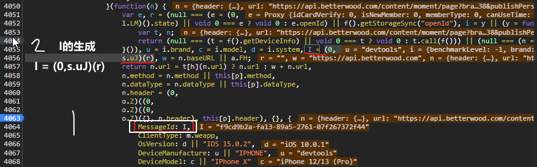

  其中I的生成函数的r是一个空字符串”“

- 分析生成I的函数，进入其内部：

  ```js
  function H() {
      for (var t = arguments.length > 0 && void 0 !== arguments[0] ? arguments[0] : "", n = [], e = "0123456789abcdef", r = 0; r < 36; r++) {
          var o = Math.floor(16 * Math.random());
          n[r] = e.substring(o, o + 1);
      }
      n[14] = "4";
      var i = 3 & Number(n[19]) | 8;
      n[19] = e.substring(i, i + 1),
      n[8] = n[13] = n[18] = n[23] = "-";
      var u = n.join("")
      
      	//其中R和c是未知，但是此处的c()就是Signature参数逆向时的md5加密，可以直接使用之前的md5_encrypt函数代替c()
        //, a = R(c()(u + new Date().getTime() + t)); //md5_encrypt函数代替c()
        , a = R(md5_encrypt(u + new Date().getTime() + t));
      return a;
  }
  ```

- 分析R函数，在console中输入R在返回结果中进入R函数实现内部：

  ```js
  //无需补充任何内容
  function R(t) {
      for (var n = [8, 13, 18, 23], e = 0; e < n.length; e++)
          t = t.slice(0, n[e]) + "-" + t.slice(n[e]);
      return t;
  }
  ```

- 分析c函数：就是md加密，可以使用md5_encrypt函数即可

- 完整代码：

  ```js
  function H() {
      for (var t = arguments.length > 0 && void 0 !== arguments[0] ? arguments[0] : "", n = [], e = "0123456789abcdef", r = 0; r < 36; r++) {
          var o = Math.floor(16 * Math.random());
          n[r] = e.substring(o, o + 1);
      }
      n[14] = "4";
      var i = 3 & Number(n[19]) | 8;
      n[19] = e.substring(i, i + 1),
      n[8] = n[13] = n[18] = n[23] = "-";
      var u = n.join("")
        , a = R(md5_encrypt(u + new Date().getTime() + t));
      return a;
  }
  function R(t) {
      for (var n = [8, 13, 18, 23], e = 0; e < n.length; e++)
          t = t.slice(0, n[e]) + "-" + t.slice(n[e]);
      return t;
  }
  ```

2个逆向参数完整逆向js代码

```js
function md5_encrypt(e){
    var CryptoJS = require('crypto-js');
	return CryptoJS.MD5(e).toString();
}
//获取Signature逆向值的L函数
function L() {
    			var t = Date.now();//参数1
                var d = encodeURIComponent('https://api.betterwood.com/content/moment/feature/list'.split("betterwood.com")[1].split("?")[0]);// 参数10
    			//参数2-9：
    			 var n = "iOS 10.0.1"
                 , e = "devtools"
                 , r = "iPhone 12/13 (Pro)"
                 , o = "5"
                 , i = "3.0.1"
                 , u = "bdw"
                 , a = "3e85ee4b-653d-4d22-e84d-fba176ca1db8"
                 , s = undefined;

                var f = "987EBBF8450544D7A52D5539DF9A92A2"
                  , l = "";
                return l = s ? "AppVersion=".concat(i, "Authorization=").concat(s, "Channel=").concat(u, "ClientType=").concat(o, "DeviceManufacture=").concat(e, "DeviceModel=").concat(r, "MessageId=").concat(a, "OsVersion=").concat(n, "Timestamp=").concat(t, "AppKey=").concat(f, "Url=").concat(d) : "AppVersion=".concat(i, "Channel=").concat(u, "ClientType=").concat(o, "DeviceManufacture=").concat(e, "DeviceModel=").concat(r, "MessageId=").concat(a, "OsVersion=").concat(n, "Timestamp=").concat(t, "AppKey=").concat(f, "Url=").concat(d),

                //此处只有c()需要补全，其他代码可以直接执行
                l = md5_encrypt(l.replace(/\s*/g, "")).substring(4, 28).toLocaleUpperCase();
            }


//获取MessageId逆向值的H函数
function H() {
    for (var t = arguments.length > 0 && void 0 !== arguments[0] ? arguments[0] : "", n = [], e = "0123456789abcdef", r = 0; r < 36; r++) {
        var o = Math.floor(16 * Math.random());
        n[r] = e.substring(o, o + 1);
    }
    n[14] = "4";
    var i = 3 & Number(n[19]) | 8;
    n[19] = e.substring(i, i + 1),
    n[8] = n[13] = n[18] = n[23] = "-";
    var u = n.join("")
      , a = R(md5_encrypt(u + new Date().getTime() + t));
    return a;
}
function R(t) {
    for (var n = [8, 13, 18, 23], e = 0; e < n.length; e++)
        t = t.slice(0, n[e]) + "-" + t.slice(n[e]);
    return t;
}

```

### 2、掘金壁纸

掘金壁纸：请求头参数逆向（requestData和iv）+加密响应数据解密。

进入小程序后，搜索666或者888对应数据包的数据，或者搜索结果页面中全部或者壁纸等选项卡的pageIndex请求数据。

全局搜索requestData关键字，定位到api的数据包

```js
/*
    处理参数requestData的值：通过调用带参数的函数t返回，且t函数定义中只使用了
    前两个参数c(固定值)和u(AES的iv)和一个undefine
*/
//直接拷贝JSON.stringify(c)的值即可（固定值）
var c = `{"acc_id":78,"page":1,"class":1,"sort":"4","appid":"wx41cd4f32cf8164b3","ver":"7.0.0","min_push":0,"scene":1001}`
//参数u的处理：上一行函数d()
function d(){
    for (var e = "", a = ["1", "2", "4", "5", "3", "8", "0", "7", "9", "6", "A", "Q", "W", "E", "R", "T", "Y", "U", "I", "O", "P", "S", "D", "F", "G", "H", "J", "K", "L", "q", "w", "S", "e", "a", "s", "d", "z", "x", "c", "v", "f", "r", "t", "g", "b", "y", "h", "n", "m", "j", "u", "i", "o", "k", "l", "p"], n = 0; n < 16; n++)
            e += a[(Math.random() * (a.length - 1)).toFixed(0)];
        return e
}
var u = d();
//函数t的封装
function t(e, n) {
        const CryptoJS = require("crypto-js");
        var r = arguments.length > 2 && void 0 !== arguments[2] ? arguments[2] : "WAG0JIUGYALACVJF"
          , i = CryptoJS.enc.Utf8.parse(r)
          , t = CryptoJS.enc.Utf8.parse(n);
        return CryptoJS.AES.encrypt(e, i, {
            iv: t,
            mode: CryptoJS.mode.CBC,
            padding: CryptoJS.pad.Pkcs7
        }).toString()
    }

//返回两个逆向参数结果的s封装，可直接作为请求参数
function s(){
    return {
        'requestData':t(c,u,undefined),
        'iv':u
    }
}

/*
    加密响应数据解密，数据包返回的json数据，其中data的value值是密文数据
    尝试1：全局搜索data关键字，数据包太多了，放弃
    尝试2：搜索ajax请求关键字（ajx或者XMLHttpRequest）定位不到，放弃
    尝试3：搜索数据包的部分url（Product/pageIndex）放弃
    尝试4：搜索加密算法关键字（AES）可行api包中（因为请求头参数就是AES加密）

*/
//数据解密原函数
var i = function(e, n) { //参数e是加密数据，n是固定值
        var r = arguments.length > 2 && void 0 !== arguments[2] ? arguments[2] : "WAG0JIUGYALACVJF"
          , i = a.CryptoJS.enc.Utf8.parse(r)
        	//t是通过n得来的
          , t = a.CryptoJS.enc.Utf8.parse(n);
        return a.CryptoJS.AES.decrypt(e, i, {
            iv: t, // iv是t，t是n，则iv就是函数参数n这个固定值
            mode: a.CryptoJS.mode.CBC,
            padding: a.CryptoJS.pad.Pkcs7
        }).toString(a.CryptoJS.enc.Utf8)
    }


function decrype(e,n = 'HI9Z3B5DD8CYQ8WH'){
    const CryptoJS = require("crypto-js");
     var r = arguments.length > 2 && void 0 !== arguments[2] ? arguments[2] : "WAG0JIUGYALACVJF"
          , i = CryptoJS.enc.Utf8.parse(r)
          , t = CryptoJS.enc.Utf8.parse(n);
    return CryptoJS.AES.decrypt(e, i, {
            iv: t,
            mode: CryptoJS.mode.CBC,
            padding: CryptoJS.pad.Pkcs7
        }).toString(CryptoJS.enc.Utf8)
}
//解密测试
var data = 'xxx'
var iv = "HI9Z3B5DD8CYQ8WH";
console.log(decrype(data,iv))

```

python代码

```python
import requests
import execjs
import time
import subprocess
from functools import partial
subprocess.Popen = partial(subprocess.Popen, encoding='utf-8')

node = execjs.get()
fp = open('main.js','r',encoding='utf-8')
ctx = node.compile(fp.read())

#获取加密数据
url = 'https://min-api.xliii.cn/miniapi/Product/pageIndex'
headers = {
    'User-Agent':'Mozilla/5.0 (iPhone; CPU iPhone OS 15_0 like Mac OS X) AppleWebKit/605.1.15 (KHTML, like Gecko) Version/15.0 Mobile/15E148 Safari/604.1 wechatdevtools/1.06.2407110 MicroMessenger/8.0.5 webview/',
}
s = ctx.eval('s()')

response = requests.get(url,params=s).json()
encrypt_data = response['data']['data']
print(encrypt_data)
```

错误处理

乡信助农