# 三十三、高级逆向

# 一、JavaScript基础与进阶

## 1.1、JavaScript基础语法

### 【1】JavaScript初识

 JavaScript 是一种用于在客户端（即用户的浏览器）上运行的编程语言。它是一种脚本语言，可以直接嵌入到 HTML 页面中，并由浏览器解释和执行。

在客户端环境中，JavaScript 可以与用户交互，操作和修改网页的内容、结构和样式。它可以用于处理用户输入、响应事件、进行表单验证、创建动态效果等。JavaScript 还可以通过浏览器提供的 API 访问浏览器功能，例如操作 DOM（文档对象模型）、发送网络请求、处理本地存储等。

需要注意的是，JavaScript 也可以在服务器端运行，例如使用 Node.js 环境。在服务器端，JavaScript 可以用于构建网络应用、处理后端逻辑等。但在这种情况下，它并不是典型的“客户端语言”，而是作为一种通用的脚本语言使用。

**demo服务端：**

```python
from flask import Flask, render_template, jsonify
import datetime

app = Flask(__name__, template_folder="templates", static_folder='static')


@app.get("/index")
def index():
    timer = datetime.datetime.now().strftime("%Y-%m-%d:%X")
    return render_template("index.html", **{"timer": timer})

@app.get("/books")
def get_books():
    # 数据库获取书籍
    books = ["聊斋志异", "金瓶梅", "国色天香", "剪灯新话"]
    return jsonify(books)

app.run()

```

**demo客户端：**

```html
<!DOCTYPE html>
<html lang="en">
<head>
    <meta charset="UTF-8">
    <title>Title</title>
    <style>
        p {
            color: rebeccapurple;
        }
    </style>
</head>
<body>

<h3>Hello Alex!</h3>
<p>当前时间：{{timer}}</p>
<p class="books">四大名著</p>
<p class="books_box"></p>

<script>
    var dom = document.getElementsByTagName("h3")[0]
    dom.onclick = function () {
        this.style.color = "green"
    }
</script>
<script src="https://cdn.bootcdn.net/ajax/libs/jquery/3.7.1/jquery.js"></script>
<script>
    $(".books").click(function () {
        $.ajax({
            url: "http://127.0.0.1:5000/books",
            success: function (res) {
                console.log("响应数据:", res);
                $(".books_box").append(res.join("，"))
            }
        })
    })
</script>

</body>
</html>
```

登陆页面：

```html
<!DOCTYPE html>
<html>
<head>
  <title>Login</title>
    <meta charset="utf8">
  <script>
    function validateForm() {
      var username = document.getElementById("username").value;

      // 验证用户名是否为有效的电子邮件地址或手机号码
      var emailRegex = /^[^\s@]+@[^\s@]+\.[^\s@]+$/;
      var phoneRegex = /^\d{10}$/;
      if (!emailRegex.test(username) && !phoneRegex.test(username)) {
        alert("请输入有效的电子邮件地址或手机号码作为用户名！");
        return false; // 验证失败，阻止表单提交
      }
    }
  </script>
</head>
<body>
  <h1>Login</h1>
  <form onsubmit="return validateForm()">
    <label for="username">Username:</label>
    <input type="text" id="username" name="username" required>
    <br><br>
    <label for="password">Password:</label>
    <input type="password" id="password" name="password" required>
    <br><br>
    <input type="submit" value="Login">
  </form>
</body>
</html>
```

### 【2】基本语法

```js
// JS代码导入方式：
// 1 直接编写
   /*
    <script>
        console.log('hello yuan')
    </script>
    */
// 2 导入文件

// <script src="hello.js"></script>


// 单行注释
/*
    这是
    多行
    注释
        */
     
// 语句分隔符 ; 表示一行代码的结束
```

### 【3】变量与数据类型

```js
// (1) 声明变量
var x;  // 声明一个变量叫x, x没有值. 此时打印x的内容是undefined(没有被定义)
x = 10
console.log(x);

// (2) 基本数据类型：number string  bool

var x = 3.1415; 
console.log(typeof x); // 可以查看数据类型. 但是只能看基础数据类型.

var x = "hello yuan";
console.log(typeof x); // string 字符串

var x1 = true;
var x2 = false; // 布尔值. python里面是大写的. js里面是小写.

console.log(typeof x1); // boolean 布尔. python简化成bool

// (3) 高级数据类型：  数组[]    对象{}    

var x = [1,2,3]; // 数组. => python的列表.
console.log(typeof x);  // 类型叫object

var x = {name:"yuan",age:22}; // 对象 => python的字典.
console.log(typeof x); // 也是object

// (4) 两个特殊值:   undefined null

var x; // undefined
console.log(typeof x);  // undefined类型... 不占用内存空间的

var x = null; // 空.... 是python的None, 要使用堆内存的....
console.log(typeof x); // object类型

// 一次性可以声明多个变量
var name="yuan", age=20, job="lecturer";
var a, b, c=3, d, e = 5; // 从左到右,声明5个变量, 其中, c=3, e=5

```

类型转换：

```js
// 在js中. 所有的数据和字符串相加. 结果都是字符串拼接.(重点)
var a = 123;
var b = "我爱你";
console.log(a + b);
console.log(1+1); // 2

var a = "123"; // 字符串
// 字符串转化成整数
// parse 转换
// Int 整数
a = parseInt(a);
console.log(a + 3); // 126 数学上的加法. 证明转化成功了.

var a = 123; // 转化成字符串
var b = a.toString(); // 把数字, 转化成字符串
console.log(b + 3); //"1233"

// 一般的程序员不用toString()的.
var a = 123;
var b = a + ""; // 在逆向的过程中. 这种写法是最多的.
console.log(b+333); // "123333" 字符串


var a = 123;
// 数字的toString()可以指定进制
var b = a.toString(16);
console.log(b);

var m = '7b'; // 眼睛看着是字符串. 但是我们知道它应该是一个十六进制的字符串.
// 字符串, 转化成整数   parseInt
var n = parseInt(m, 16);
console.log(n)
```

### 【4】运算符

```js
// （1） 科学运算符
 + - * / %

// （2）比较运算符
> <   <=  >= === !==

// （3） 赋值运算符 
+= -= *= /=  ++

// 在单独使用a++和++a是没有区别的. 都是让a自增1
var b = a ++;  // 先赋值, 后运算...

console.log(a); // 11
console.log(b); // 10

var b = ++ a; // 先计算, 后赋值
console.log(a);
console.log(b);

// （4）逻辑运算符： Python中的and, or, not
// &&, 并且, 左右两端必须同时为真, 结果才能是真..
// ||, 或者, 左右两端, 有一个是真, 结果就是真
// !, 非/不, 非真即假, 非假既真.

console.log(1 > 2 || 3 < 5);
console.log(1 > 2 && 3 < 5);

console.log(!true);
console.log(!false);

// x() && y()
// 该逻辑叫短路...如果前面的表达式已经得到结果了. 后面就不运行了. 相同的逻辑还有||
// 如果x()返回真. 则运行y()
// 如果x()返回假, 则不运行y(). 直接结束判断了.


// （5）逗号运算符
a = 1,2,3,4
b = (1,"yuan",true)
// （6）三目运算：条件? 成立: 不成立
// 案例1
var a = 100;
var b = 20;
var c = a > b ? a: b;
console.log(c);
// 案例2:终极一练

let a = 10;
let b = 20;
let c = 5;
let d = 17;

let e;
let m;
e = (e = a > 3 ? b : c, m = e < b++ ? c-- : a = 3 > b % d ? 27: 37, m++);
// e = a > 3 ? b : c; // e = 20
// b = 21 , m 和 a都是37
// m = e < b++ ? c-- : a = 3 > b % d ? 27: 37;
// e = m++; // e 37  m 38  a 37
```

### 【5】流程控制语句

分支语句

```js
// 分支语句
if(条件){
     // 条件为true时,执行的代码
   }else{
     // 条件为false时,执行的代码
 }  

switch(条件){
    case 结果1:
         // 满足条件执行的结果是结果1时,执行这里的代码..
         break;
    case 结果2:
         // 满足条件执行的结果是结果2时,执行这里的代码..
         break;
    ...
    default:
         // 条件和上述所有结果都不相等时,则执行这里的代码
   }


// （1）双分支
var age = 23
if (age > 18) {
    console.log("播放成人电影！")
} else {
    console.log("播放未成年电影")
}
// （2）多分支
var score = 45;
if (score >= 90) {
    console.log("A");
} else if (score >= 80) {
    console.log("B");
} else if (score >= 70) {
    console.log("C");
} else if (score >= 60) {
    console.log("D");
} else {
    console.log("E");
}
// （3）switch多分支
var week = 3;
switch(week){
    case 1:
        console.log("星期一");
        break;
    case 2:
        console.log("星期二");
        break;
    case 3: // 某一个case匹配成功. 那么后面的case就不判断了, 直接被执行.
        console.log("星期三");
        break;
    case 4:
        console.log("星期四");
        break;
    case 5:
        console.log("星期五");
        break;
    case 6:
        console.log("星期六");
        break;
    case 7:
        console.log("星期天");
        break;
    default:
        console.log("啥也不是!");
        break;
}
```

循环语句

```js
/*

// 循环语句
while(循环的条件){
      // 循环条件为true的时候,会执行这里的代码
   }
   
// 循环三要素
for(1.声明循环的开始; 2.条件; 4.循环的计数){
   // 3. 循环条件为true的时候,会执行这里的代码
} 
 
 * 1. 首先, 会执行语句1, 通常会在语句1里完成对循环变量的初始化
 * 2. 然后, 判断表达式2计算的结果是否是真, 如果是真, 则执行循环体, 如果是假, 结束循环
 * 3. 执行完循环体后. 执行表达式3，然后回到第二步...
 
 */

// while 循环
var a = 0; // 1. 初始变量
while (a < 100) {  // 2. 条件判断
    console.log("我爱你");  // 业务需求...循环内容...
    a++;  // 3. 步进语句
}


for(var i = 0; i < 10; i++){
    console.log(i);
}

```

### 【6】字符串对象

```js
// js的字符串对象
var s = "Hello Yuan      "
console.log(s.toUpperCase())
console.log(s.toLowerCase())
console.log(s.slice(0, 5))
console.log(s.split(" ")) // ["Hello","Yuan"]
console.log(s.length)
console.log(s.trim(" ").length)
console.log(s.trimEnd(" ").length)
console.log(s.indexOf("Yuan"))
console.log(s.replace("Yuan","Rain"))
console.log(s.startsWith("Hel"))
console.log(s.charCodeAt(i)) // 某个位置的字符的ascii
console.log(s.charAt(i)) //  第i索引位置的字符  s[i]
```

### 【7】数组对象

```js
// 注意, 前端js里面的数组. 相当于python的列表, java的List

// 创建数组的方法;
// 1. 直接赋值一个数组
var arr1 = [11,22,33];
console.log(arr1);

// new表示创建对象.  理解成分配内存.
var arr2 = new Array();  // var arr2 = []

// 1. push 在数组的末尾添加数据...
// 2. pop 在数组的末尾删除数据
var arr = [11,22,33,44];
arr.push(55);
var item = arr.pop();
console.log(item);


// 1 unshift 在数组的首位添加数据...  2 shift 删除数组的首位数据

var arr = [11,22,33];
arr.unshift(0); // 在数组的前面插入数据
// console.log(arr);
var item = arr.shift();
console.log(item);
console.log(arr);

var arr = ["a","b","c"];
arr.splice(1,1);
arr.splice(1,0,"b")
arr.splice(1,1,"B")

arr.reverse();

// slice(开始下标,结束下标)  切片,开区间
arr.slice(1,3)

var arr = ["北京","深圳","广州"];
console.log(arr.join(",")); // 把数组转化成字符串

// 循环和遍历
//  key       0         1       2         3          4         5
var arr = ["高圆圆", "赵丽颖", "范冰冰", "波多野结衣", "森泽佳奈", "橘梨纱"];

// 三要素for循环
for(var i = 0; i < arr.length; i++){
    console.log(arr[i]);
}

// for-in
for(var x in arr){ // 此时拿到的是数组的索引(key)
    console.log(x);
}

// for-of
for (var x of arr){ // 此时拿到的是数组的元素(value)
    console.log(x);
}

// arr中的每一项循环出来. 分别去调用function函数, 会自动的将`数据`传递给函数的第一个参数
arr.forEach(function(e, i){  // 第二个参数是可选的
    console.log(i+"__"+e);
});

// arr中的每一个元素执行里面传递进去的函数
// 回调函数的参数是 元素和索引

console.log(ret);

// 高阶函数 map filter
```

### 【8】object对象

```js
var obj = {
          "name": "yuan",
          age: 18,
          girl_friend: {
              name: "高圆圆",
              age: 28
          }
      }

// 当他是python的字典, 无缝衔接的. `[]` 也可以翻译成`的`
console.log(obj['girl_friend']['name']);
// 当他是对象... 对象.属性  `.`可以翻译成`的`
console.log(obj.name)
console.log(obj.girl_friend.name)

// 它俩可以混着来.
var w = "girl_friend"
console.log(obj[w].name);
console.log(obj.girl_friend['name']);
// js的对象在使用的时候. 既可以通过`[]`来获取属性的值. 也可以通过`.`来获取属性的值
// 区别: []里面必须放字符串.
//       .后面放的必须是属性名(不可以是字符串)
console.log(obj.girl_friend.name); // 68

// 如果想要对代码进行伪装,混淆. 就不能用`.`

console.log(obj['girl_friend']['name']); // 高圆圆
console.log(obj.girl_friend.name); // 高圆圆


var obj = {};
obj.name = "alvin";  // 对象.属性 = 值. 可以给对象增加新的属性(设置一个新的属性)
obj['age'] = 28;

console.log(obj);
```

序列化和反序列化：

| 方法                      | 描述                                          |
| ------------------------- | --------------------------------------------- |
| **`JSON.stringify(obj)`** | 把obj对象转换成json格式字符串，会移除对象方法 |
| **`JSON.parse(str)`**     | 把符合json语法的字符串转换成js对象            |

### 【9】其它常用对象

```js
// Math对象 Date类
var now=new Date();
console.log(now.toLocaleString( ));

// console.log(Math.random());
console.log( Math.round(Math.random() * 10 ));
```

## 1.2、函数

### 【1】函数初识

```js
// 函数声明
function 函数名(形参){
   return // 返回值
}

// 函数调用
函数名(实参)

// 编译运行
// 默认返回undefined
// arguments参数

```

### 【2】作用域

作用域（Scope）是指在程序中定义变量的可访问性和可见性的范围。它决定了在代码中的哪些位置可以访问或引用特定变量、函数或对象。

在大多数编程语言中，包括 JavaScript，在不同的作用域中定义的变量具有不同的可见性和生命周期。常见的作用域类型有以下几种：

1. 全局作用域（Global Scope）：全局作用域是在整个程序中都可访问的作用域。在全局作用域中声明的变量可以在程序的任何位置被访问。
2. 函数作用域（Function Scope）：函数作用域是在函数内部定义的作用域。在函数作用域中声明的变量只能在函数内部被访问，它们对于函数外部是不可见的。每当函数被调用时，都会创建一个新的函数作用域。
3. 块级作用域（Block Scope）：块级作用域是在代码块（通常由花括号 `{}` 包围）内定义的作用域。在块级作用域中声明的变量只能在该块内部被访问，而在块外部是不可见的。在 ES6 中引入的 `let` 和 `const` 关键字可以用来创建块级作用域。

```js
//  首先熟悉下var

var name = "yuan"; // 声明一个全局变量 name并赋值”yuan“
name = "张三";  // 对已经存在的变量name重新赋值 ”张三“
console.log(name);

age = 18   // 之前不存在age变量，这里等同于var age = 19 即声明全局变量age并赋值为18

var  gender = "male"
var  gender = "female" // 原内存释放与新内存开辟，指针指向新开辟的内存
console.log(gender)
```

作用域案例：

```js
var num = 10; // 在函数外部声明的变量, 全局变量
function func(){
    // num = 20; // 函数内部直接使用变量,则默认调用了全局的变量,
    //var num = 20;                  
    console.log("函数内部num：",num)
}
func();
console.log("全局num：",num);
```

作用域的正确使用可以避免变量名冲突和数据泄漏，并提供更好的代码封装和隔离性。理解作用域的概念对于编写可维护和可扩展的代码非常重要。

### 【3】匿名函数

在 JavaScript 中，匿名函数是一种没有名称的函数定义。匿名函数可以被直接传递给其他函数作为参数，也可以被赋值给变量或对象的属性，以便稍后调用。

```js
// 匿名函数赋值变量
 var foo = function () {
     console.log("这是一个匿名函数！")
 };

// 匿名函数的自执行
(function (x,y) {
     console.log(x+y);
 })(2,3)

// 匿名函数作为一个高阶函数使用
function bar() {

  return function () {
      console.log("inner函数！")
  }
}

bar()()
```

匿名函数常用于回调函数、事件处理程序、异步操作等场景，它们允许我们在需要时动态定义函数逻辑，并将其作为值传递或存储，而不需要为函数命名。这提供了更灵活和简洁的编程方式。

### 【4】闭包函数

闭包（closures）是 Javascript 语言的一个难点，也是它的特色，很多高级应用都是依靠闭包实现的。闭包与变量的作用域以及变量的生命周期密切相关，本节我们就来简单介绍一下。

> 在计算机科学中，闭包（英语：Closure），又称词法闭包（Lexical Closure）或函数闭包（function closures），是引用了自由变量（外部非全局）的函数。

简单来说就是一个函数定义中引用了函数外定义的变量，并且该函数可以在其定义环境外被执行。这样的一个函数我们称之为闭包函数。

```html
<!DOCTYPE html>
<html lang="en">
<head>
    <meta charset="UTF-8">
    <title>Title</title>
    <script>

        function getCounter() {

            let count = 0

            function counter() {
                let name = "yuan"
                count++  // count = count+1
                return count
            }

            window.yuan = counter

            // counter()
            // counter()
            // counter()
            return counter
        }

        // c1 = getCounter()
        // c1()
        // c1()
        // c2 = getCounter()
        // c2()
        // c2();

        getCounter()

        let c3 = window.yuan
        console.log(c3())
        console.log(c3())
        console.log(c3())
    </script>
    <script>
        var count = 100
    </script>
</head>
<body>

<button onclick="c1()">add1</button>
<button onclick="c2()">add2</button>
</body>
</html>
```

### 【5】ES6中的箭头函数

在ES6中简化了函数的声明语法. 

```js
// es6允许使用“箭头”(=>)定义函数。
var f = v => v*v
// 等同于
var f = function(v) {
 return v
}

// 如果箭头函数不需要参数或需要多个参数，就使用一个圆括号代表参数部分。
var f = () => 5
// 等同于
var f = function() {
   return 5
}
 
var sum = (num1, num2) => num1 + num2
// 等同于
var sum = function(num1, num2) {
   return num1 + num2
}

// 如果箭头函数的代码块部分多于一条语句，就要使用大括号将它们括起来，并且使用return语句返回。
var sum = (num1, num2) => {return num1 + num2}

//由于大括号被解释为代码块，所以如果箭头函数直接返回一个对象，必须在对象外面加上括号，否则会报错。

// 报错
let getUser = id => {id: id, name: "yuan"}
// 不报错
let getUser = id => ({id: id, name: "yuan"})


// 箭头函数的一个用处是简化回调函数。
// 正常函数写法
[1, 2, 3].map(function(x) {
 return x * x
})
// 箭头函数写法
[1, 2, 3].map(x => x * x)
```

### 【6】导入模块

当涉及到实际案例时，我将给出一个常见的示例，以说明如何在 JavaScript 中使用 `require` 或 `import` 导入模块。

假设我们有两个文件：`math.js` 和 `main.js`。

首先，让我们创建 `math.js` 文件，它包含一个简单的数学函数：

```js
// math.js
const add = (a, b) => {
  return a + b;
};

const multiply = (a, b) => {
  return a * b;
};

module.exports = {
  add,
  multiply
};
```

在 `math.js` 中，我们定义了两个函数 `add` 和 `multiply`，并使用 `module.exports` 导出这些函数，使其可以在其他文件中使用。

接下来，我们创建 `main.js` 文件，它将使用 `math.js` 中的函数：

使用 `require`（CommonJS 模块系统）的示例：

```js
// main.js
const math = require('./math');

console.log(math.add(2, 3)); // 输出：5
console.log(math.multiply(2, 3)); // 输出：6
```

在这个示例中，我们使用 `require` 函数将 `math.js` 文件导入到 `main.js` 文件中。`require('./math')` 表示我们导入与 `main.js` 文件相同目录下的 `math.js` 文件。

然后，我们可以使用 `math.add()` 和 `math.multiply()` 调用 `math.js` 中导出的函数。

使用 `import`（ES 模块系统）的示例：

```js
function add(a, b) {
    return a + b;
}

function multiply(a, b) {
    return a * b;
}

export default {
    add: add,
    multiply: multiply,
}
```

```js
// main.js
import cal from './cal.js'

console.log(cal.add(1,2))
console.log(cal.multiply(1,2))
```

```html
 <script type="module" src="main.js"></script>
```

## 1.3、Window对象

window 是客户端浏览器对象模型的基类，window 对象是客户端 JavaScript 的全局对象。一个 window 对象实际上就是一个独立的窗口，对于框架页面来说，浏览器窗口每个框架都包含一个 window 对象。

### 【1】全局作用域

在客户端浏览器中，window 对象是访问 BOM 的接口，如引用 document 对象的 document 属性，引用自身的 window 和 self 属性等。同时 window 也为客户端 JavaScript 提供全局作用域。

由于 window 是全局对象，因此所有的全局变量都被解析为该对象的属性。

```html
<script>

    var username = "yuanhao";  //全局变量
    function f() {  //全局函数
        console.log(username);
    }
  
    console.log(window.username);  //返回字符串“yuanhao”
    window.f();  //返回字符串“yuanhao”

</script>


```

### 【2】使用系统对话框

window 对象定义了 3 个人机交互的方法，主要方便对 JavaScript 代码进行调试。

- alert()：确定提示框。由浏览器向用户弹出提示性信息。该方法包含一个可选的提示信息参数。如果没有指定参数，则弹出一个空的对话框。
- confirm()：选择提示框。。由浏览器向用户弹出提示性信息，弹出的对话框中包含两个按钮，分别表示“确定”和“取消”按钮。如果点击“确定”按钮，则该方法将返回 true；单击“取消”按钮，则返回 false。confirm() 方法也包含一个可选的提示信息参数，如果没有指定参数，则弹出一个空的对话框。
- prompt()：输入提示框。可以接收用户输入的信息，并返回输入的信息。prompt() 方法也包含一个可选的提示信息参数，如果没有指定参数，则弹出一个没有提示信息的输入文本对话框。

### 【3】使用定时器

window 对象包含 4 个定时器专用方法，说明如下表所示，使用它们可以实现代码定时执行，或者延迟执行，使用定时器可以设计演示动画。

| 方法            | 说明                                             |
| --------------- | ------------------------------------------------ |
| setInterval()   | 按照执行的周期（单位为毫秒）调用函数或计算表达式 |
| setTimeout()    | 在指定的毫秒数后调用函数或计算表达式             |
| clearInterval() | 取消由 setInterval() 方法生成的定时器            |
| clearTimeout()  | 取消由 setTimeout() 方法生成的定时器             |

setTimeout() 方法能够在指定的时间段后执行特定代码。用法如下：

`var o = setTimeout(code, delay)`

参数 code 表示要延迟执行的字符串型代码，将在 Windows 环境中执行，如果包含多个语句，应该使用分号进行分隔。delay 表示延迟时间，以毫秒为单位。

该方法返回值是一个 Timer ID，这个 ID 编号指向延迟执行的代码控制句柄。如果把这个句柄传递给 clearTimeout() 方法，则会取消代码的延迟执行。

```html
<!DOCTYPE html>
<html lang="en">
<head>
    <meta charset="UTF-8">
    <title>Title</title>
</head>
<body>

<input id="ID1" type="text" >
<button onclick="begin()">开始</button>
<button onclick="end()">停止</button>

<script>
    function showTime(){
           var nowd2=new Date().toLocaleString();
           var temp=document.getElementById("ID1");
           temp.value=nowd2;

    }
    var ID;
    function begin(){
        if (ID==undefined){
             showTime();
             ID=setInterval(showTime,1000);
        }
    }
    function end(){
        clearInterval(ID);
        ID=undefined;
    }

</script>

</body>
</html>
```

### 【4】访问客户端对象

使用 window 对象可以访问客户端其他对象，这种关系构成浏览器对象模型，window 对象代表根节点，浏览器对象关系的关系如图所示，每个对象说明如下。

- window：客户端 JavaScript 顶层对象。每当 <body> 或 <frameset> 标签出现时，window 对象就会被自动创建。
- navigator：包含客户端有关浏览器信息。
- screen：包含客户端屏幕的信息。
- history：包含浏览器窗口访问过的 URL 信息。
- location：包含当前网页文档的 URL 信息。
- document：包含整个 HTML 文档，可被用来访问文档内容及其所有页面元素。

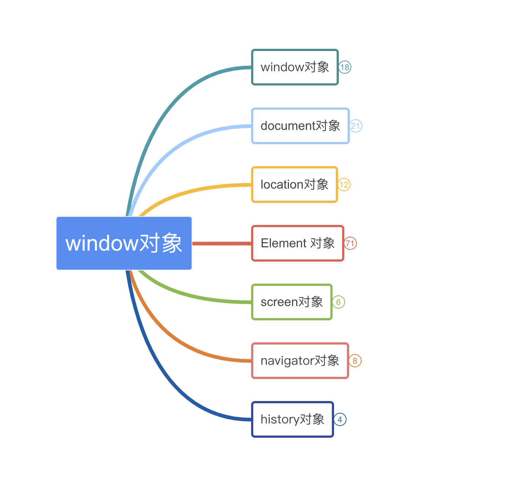

[window对象树](https://www.processon.com/view/link/66497878cfe67e27899b9e70?cid=66488d812b49420be3452fa3)

# 二、JS逆向必备知识点


## 2.1、编码

### 【1】url编码

```python
import urllib.parse 

# s = 'a'
s = ' 123'
ret = urllib.parse.quote(s)
print(ret)
s = urllib.parse.unquote(ret)
print(s)

params = {'name': '张三', 'age': 20, 'address': '北京市海淀区'}
query_string = urllib.parse.urlencode(params)
print(query_string)

query_string = 'name=%E5%BC%A0%E4%B8%89&age=20&address=%E5%8C%97%E4%BA%AC%E5%B8%82%E6%B5%B7%E6%B7%80%E5%8C%BA'
params = urllib.parse.parse_qs(query_string)
print(params, type(params))
```

### 【2】 base64编码

#### （1）base64是什么

Base64编码，是由64个字符组成编码集：**26个大写字母A~Z，26个小写字母a~z，10个数字0~9，符号“+”与符号“/”**。Base64编码的基本思路是**将原始数据的三个字节拆分转化为四个字节**，然后根据Base64的对应表，得到对应的编码数据。

当原始数据凑不够三个字节时，编码结果中会使用额外的**符号“=”**来表示这种情况。

#### （2）base64原理

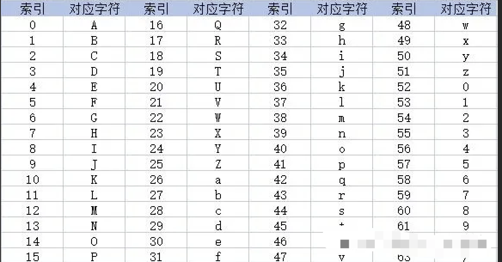

一个Base64字符实际上代表着6个二进制位(bit)，4个Base64字符对应3字节字符串/二进制数据。

3个字符为一组的的base64编码方式如：

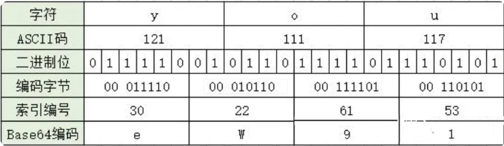

小于3个字符为一组的编码方式如：

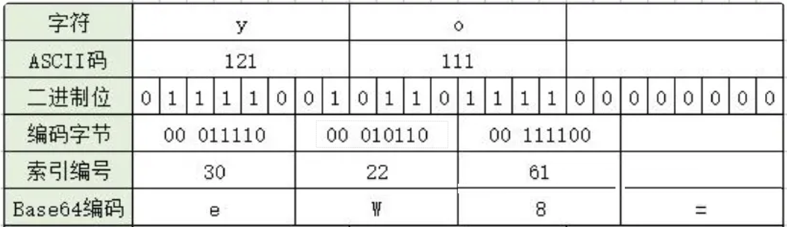

总结：base64过程


最后处理完的编码字符再转字节中不再有base64以外的任何字符。

#### （3）base64测试

```python
import base64

bs = "you".encode("utf-8")
# 把字节转化成b64
print(base64.b64encode(bs).decode())

bs = "yo".encode("utf-8")
# 把字节转化成b64
print(base64.b64encode(bs).decode())

# 猜测结果
bs = "y".encode("utf-8")
# 把字节转化成b64
print(base64.b64encode(bs).decode())


```

注意, b64处理后的字符串长度. 一定是4的倍数. 如果在网页上看到有些密文的b64长度不是4的倍数. 会报错

例如, 

```python
import base64

s = "eW91"
ret = base64.b64decode(s)
print(ret)

s = "eW91eQ=="
ret = base64.b64decode(s)
print(ret)

s = "eW91eQ"
ret = base64.b64decode(s)
print(ret)
```

解决思路. base64长度要求. 字符串长度必须是4的倍数. 填充一下即可

```python
s = "eW91eQ"
# ret = base64.b64decode(s)
# print(ret)

s += ("=" * (4 - len(s) % 4))
print("填充后", s)
ret = base64.b64decode(s).decode()
print(ret)
```

#### （4）base64变种

```python
# 方式1
data = res.text.replace("-", "+").replace("_", "/")
base64.b64decode(data)
# 方式2
data = base64.b64decode(res.text, altchars=b"-_")  # base64解码成字节流
```

#### （5）为什么要base64编码

base64 编码的优点：

- 算法是编码，不是压缩，编码后只会增加字节数（一般是比之前的多1/3，比如之前是3， 编码后是4）
- 算法简单，基本不影响效率
- 算法可逆，解码很方便，不用于私密传输。
- 加密后的字符串只有【0-9a-zA-Z+/=】 ，不可打印字符（转译字符）也可以传输（关键！！！）

有些网络传输协议是为了传输`ASCII文本`设计的，当你使用其传输二进制流时（比如视频/图片），二进制流中的数据可能会被协议错误的识别为控制字符等等，因而出现错误。那这时就要将二进制流传输编码，因为有些8Bit字节码并没有对应的ASCII字符。

比如十进制ASCII码8对应的是后退符号(backspace), 如果被编码的数据中包含这个数值，那么编码出来的结果在很多编程语言里会导致前一个字符被删掉。又比如ASCII码0对应的是空字符，在一些编程语言里代表字符串结束，后续的数据就不会被处理了。

用Base64编码因为限定了用于编码的字符集，确保编码的结果可打印且无歧义。

不同的网络节点设备交互数据需要：设备A把base64编码后的数据封装在`json字符串`里，设备B先解析json拿到value，再进行base64解码拿到想要的数据。

> 1. 早年制定的一些协议都是只支持文本设定的。随着不断发展需要支持非文本了，才搞了一个base64做兼容
>
> 2. 虽然编码之后的数据与加密一样都具有不可见性，但编码与加密的概念并不一样。编码是公开的，任何人都可以解码；而加密则相反，你只希望自己或者特定的人才可以对内容进行解密。

base64处理图片数据：

```python
import base64
source = ""
s = source.split(",")[1]
with open("a.png", "wb") as f:
    f.write(base64.b64decode(s))
```

J的base64编码与解码

```js
// 编码
btoa()
// 解码
atob()
```

## 2.2、摘要&加密算法

###  【1】摘要算法：一切从MD5开始

MD5是一个非常常见的摘要(hash)逻辑.  其特点就是小巧. 速度快. 极难被破解. 所以, md5依然是国内非常多的互联网公司选择的密码摘要算法. 

> 1. 这玩意不可逆. 所以. 摘要算法就不是一个加密逻辑. 
>
> 2. 相同的内容计算出来的摘要是一样的
>
> 3. 不同的内容(哪怕是一丢丢丢丢丢不一样) 计算出来的结果差别非常大

在数学上. 摘要其实计算逻辑就是hash. 

hash(数据)  => 数字

 	1. 密码
 	2. 一致性检测  

md5的python实现:

```python
from hashlib import md5

obj = md5()
obj.update("yuan".encode("utf-8"))
# obj.update("alex".encode('utf-8'))  # 可以添加多个被加密的内容

bs = obj.hexdigest()
print(bs)
```

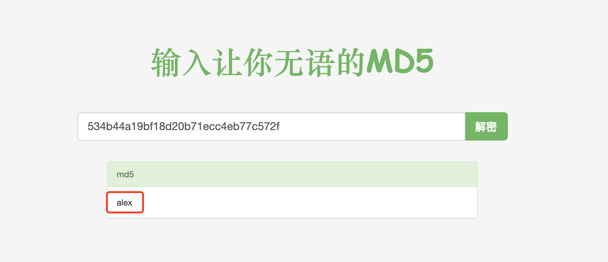

我们把密文丢到网页里. 发现有些网站可以直接解密. 但其实不然. 这里并不是直接解密MD5. 而是"撞库". 

就是它网站里存储了大量的MD5的值. 就像这样:

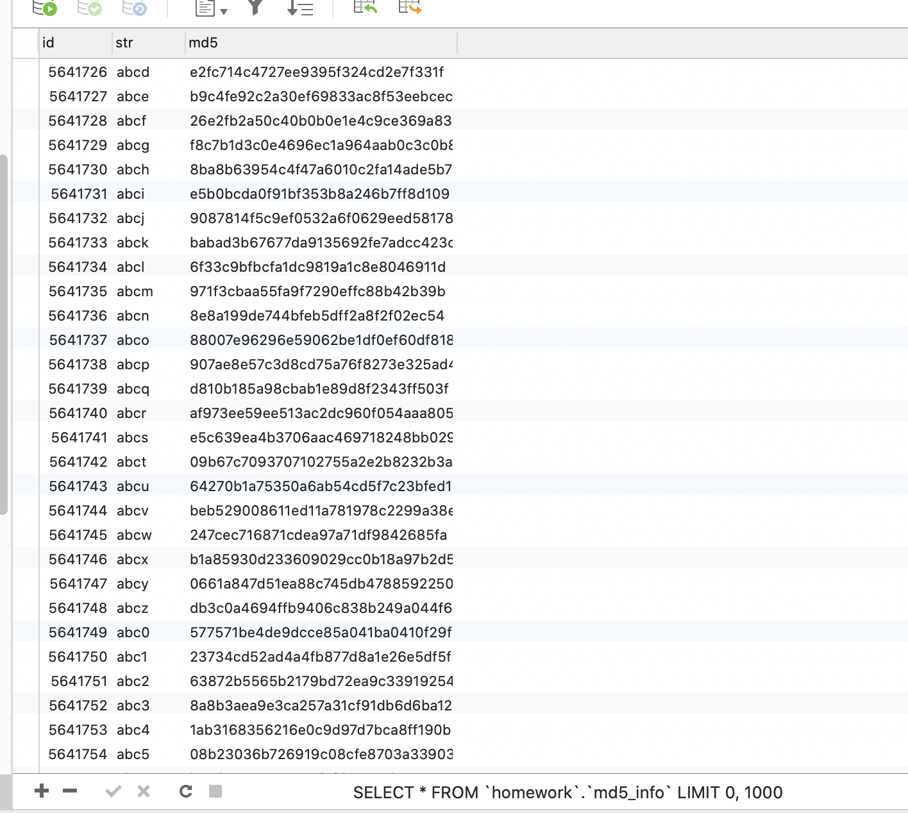

而需要进行查询的时候. 只需要一条select语句就可以查询到了. 这就是传说中的撞库. 

如何避免撞库: md5在进行计算的时候可以加盐. 加盐之后. 就很难撞库了. 

```python
from hashlib import md5


salt = "我是盐.把我加进去就没人能破解了"
obj = md5(salt.encode("utf-8"))  # 加盐
obj.update("alex".encode("utf-8"))

bs = obj.hexdigest()
print(bs)
```

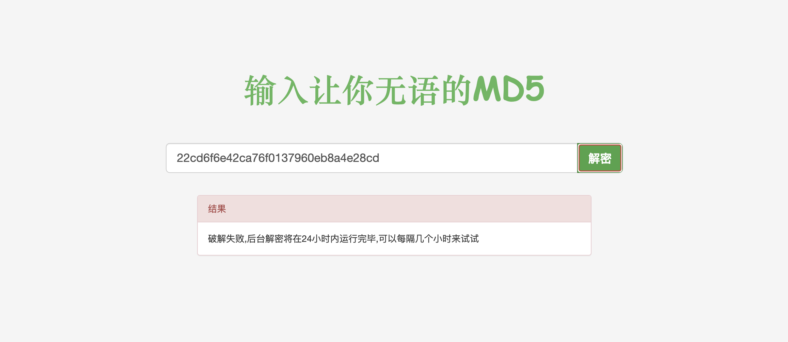

扩展; sha256

```python
from hashlib import sha1, sha256
sha = sha256(b'salt')
sha.update(b'alex')
print(sha.hexdigest())
```

不论是sha1, sha256, md5都属于摘要算法. 都是在计算hash值. 只是散列的程度不同而已. 这种算法有一个特性. 他们是散列. 不是加密. 而且, 由于hash算法是不可逆的, 所以不存在解密的逻辑.

### 【2】对称加密（AES与DES）

AES是一种对称加密，所谓对称加密就是加密与解密使用的秘钥是一个。

常见的对称加密: AES, DES, 3DES. 我们这里讨论AES。

安装：

```python
pip install pycryptodome
```

AES 加密最常用的模式就是 CBC 模式和 ECB模式 ，当然还有很多其它模式，他们都属于AES加密。ECB模式和CBC 模式俩者区别就是 ECB 不需要 iv偏移量，而CBC需要。

```apl
"""
key的长度
    16: *AES-128*   
    24: *AES-192*
    32: *AES-256*

iv的字节长度只能是16位

MODE 加密模式. 
    常见的ECB, CBC
    ECB：是一种基础的加密方式，密文被分割成分组长度相等的块（不足补齐），然后单独一个个加密，一个个输出组成密文。
    CBC：是一种循环模式，前一个分组的密文和当前分组的明文异或或操作后再加密，这样做的目的是增强破解难度。
"""
```

CBC加密案例（选择aes-128）：

```python
from Crypto.Cipher import AES
from Crypto.Util.Padding import pad
import base64

key = '0123456789abcdef'.encode()  # 秘钥: 因为aes-128模式，所以必须16字节
iv = b'abcdabcdabcdabcd'  # 偏移量：因为aes-128模式，所以必须16字节
text = 'alex is a monkey!'  # 加密内容，因为aes-128模式，所以字节长度必须是16的倍数
# while len(text.encode('utf-8')) % 16 != 0:  # 如果text不足16位的倍数就用空格补足为16位
#     text += '\0'
text = pad(text.encode(), 16)
print("完整text:", text)

aes = AES.new(key, AES.MODE_CBC, iv)  # 创建一个aes对象

en_text = aes.encrypt(text)  # 加密明文
print("aes加密数据:::", en_text)  # b"_\xf04\x7f/R\xef\xe9\x14#q\xd8A\x12\x8e\xe3\xa5\x93\x96'zOP\xc1\x85{\xad\xc2c\xddn\x86"

en_text = base64.b64encode(en_text).decode()  # 将返回的字节型数据转进行base64编码
print(en_text)  # X/A0fy9S7+kUI3HYQRKO46WTlid6T1DBhXutwmPdboY=
```

CBC解密案例：

````python
from Crypto.Cipher import AES
import base64
from Crypto.Util.Padding import unpad

key = '0123456789abcdef'.encode()
iv = b'abcdabcdabcdabcd'
aes = AES.new(key, AES.MODE_CBC, iv)

text = 'X/A0fy9S7+kUI3HYQRKO46WTlid6T1DBhXutwmPdboY='.encode()  # 需要解密的文本
ecrypted_base64 = base64.b64decode(text)  # base64解码成字节流
source = aes.decrypt(ecrypted_base64)  # 解密
print("aes解密数据:::", source.decode())
print("aes解密数据:::", unpad(source, 16).decode())
````

> 1. 在Python中进行AES加密解密时，所传入的密文、明文、秘钥、iv偏移量、都需要是bytes（字节型）数据。python 在构建aes对象时也只能接受bytes类型数据。
> 2. 当秘钥，iv偏移量，待加密的明文，字节长度不够16字节或者16字节倍数的时候需要进行补全。
>
> 3. CBC模式需要重新生成AES对象，为了防止这类错误，无论是什么模式都重新生成AES对象就可以了。

### 【3】非对称加密(RSA)

非对称加密. 加密和解密的秘钥不是同一个秘钥. 这里需要两把钥匙. 一个公钥, 一个私钥.  公钥发送给客户端. 发送端用公钥对数据进行加密. 再发送给接收端, 接收端使用私钥来对数据解密. 由于私钥只存放在接受端这边. 所以即使数据被截获了. 也是无法进行解密的. 

[公钥和私钥](https://blog.csdn.net/Ruishine/article/details/114705443)

常见的非对称加密算法: RSA, DSA等等, 我们就介绍一个. RSA加密, 也是最常见的一种加密方案

1. 创建公钥和私钥

```python
from Crypto.PublicKey import RSA

# 生成秘钥
rsakey = RSA.generate(1024)
with open("rsa.public.pem", mode="wb") as f:
    f.write(rsakey.publickey().exportKey())

with open("rsa.private.pem", mode="wb") as f:
    f.write(rsakey.exportKey())
```

2. 加密

```python
from Crypto.PublicKey import RSA
from Crypto.Cipher import PKCS1_v1_5
import base64


# 加密
data = "我喜欢你"
with open("rsa.public.pem", mode="r") as f:
    pk = f.read()
    rsa_pk = RSA.importKey(pk)
    rsa = PKCS1_v1_5.new(rsa_pk)

    result = rsa.encrypt(data.encode("utf-8"))
    # 处理成b64方便传输
    b64_result = base64.b64encode(result).decode("utf-8")
    print(b64_result)

```

3. 解密

```python
from Crypto.PublicKey import RSA
from Crypto.Cipher import PKCS1_v1_5
import base64

data = "BkiKG8jzVGzbWOl4m8NXJEYglgtxhOB05MGmap8JSP97GzoewPBmDTs7c5iACUof3k/uJf0H88GygajVgBvkcbckJp7oO+Qj6VSUQYTOHhKN/VG2a8v+WzL34EO/S7BYoj2oOxIDAr8wDLxYxjBeXq/Be6Q1yBbnZcKaMkifhP8="
# 解密
with open("rsa.private.pem", mode="r") as f:
    prikey = f.read()
    rsa_pk = RSA.importKey(prikey)
    rsa = PKCS1_v1_5.new(rsa_pk)
    result = rsa.decrypt(base64.b64decode(data), None)
    print("rsa解密数据:::", result.decode("utf-8")
```

## 2.3、JS版本的加密算法

### 【1】md5摘要算法

```js
const CryptoJS = require('crypto-js');
// 原始数据
const data = '123456';
// 生成MD5摘要
const md5Digest = CryptoJS.MD5(data).toString();

console.log(md5Digest);
```

### 【2】AES加密

```js
const CryptoJS = require("crypto-js")

// 密钥（128位，16字节）
var key = CryptoJS.enc.Utf8.parse('0123456789abcdef');

// 初始化向量（IV）（128位，16字节）
var iv = CryptoJS.enc.Utf8.parse('1234567890abcdef');

// 待加密的数据
var plaintext = 'Hello, yuan!';

// 进行AES-128加密，使用CBC模式和PKCS7填充
var encrypted = CryptoJS.AES.encrypt(plaintext, key, {
    iv: iv,
    mode: CryptoJS.mode.CBC,
    padding: CryptoJS.pad.Pkcs7
});

// 获取加密后的密文
var ciphertext = encrypted.toString();

console.log(ciphertext);
```

# 三、JS逆向实战案例


## 1. Webpack逆向

### 【1】概念

Webpack是一个现代的静态模块打包工具，它主要用于前端开发中的模块化打包和构建。通过Webpack，开发者可以将多个模块（包括JavaScript、CSS、图片等）进行打包，生成优化后的静态资源文件，以供在浏览器中加载和运行。

Webpack的主要功能和特点包括：

1. 模块化支持：Webpack将应用程序拆分为多个模块，通过模块化的方式管理和加载依赖关系。它支持CommonJS、ES module、AMD等多种模块化规范，并且能够将这些模块打包成最终的静态资源文件。
2. 打包和压缩：Webpack可以将多个模块打包成一个或多个最终的静态资源文件。它支持对JavaScript、CSS、图片等资源进行压缩、合并和优化，以减小文件大小，提升加载速度和性能。
3. 资源加载管理：Webpack可以处理各种类型的资源文件，例如JavaScript、CSS、图片、字体等。通过加载器（Loader）的配置，Webpack可以对这些资源文件进行转换和处理，使其能够被应用程序正确地引用和加载。

```js
/*
!function(形参){加载器}([模块1，模块2,...])

!function(形参){加载器}({"k1":"模块1","k2":"模块2"}) 
*/
```

```js
window = global;
!function (e) {
    var t = {};

    function n(r) {
        if (t[r])
            return t[r].exports;
        var o = t[r] = {
            i: r,
            l: !1,
            exports: {}
        };
        e[r].call(o.exports, o, o.exports, n);
        return o.exports.exports; 
    }

    window.loader = n;

    // n("1002");
}([ function () {
        console.log("foo");
        this.exports = 100; 
    },
    function () {
        console.log("bar");
        this.exports = 200;
    }]
);

console.log(window.loader(0));
console.log(window.loader(1));
```

```js
window = global;
!function (e) {
    var t = {};

    function n(r) {
        if (t[r])
            return t[r].exports;
        var o = t[r] = {
            i: r,
            l: !1,
            exports: {}
        };
        e[r].call(o.exports, o, o.exports, n);
        return o.exports.exports; // 返回 o.exports.exports，而不是整个 o.exports 对象
    }
    
    window.loader = n;

    // n("1002");
}({
    "1001": function () {
        console.log("foo");
        this.exports = 100; // 直接修改 exports 变量
    },
    "1002": function () {
        console.log("bar");
        this.exports = 200;
    }
});

console.log(window.loader("1001"));
```

### 【2】医保局案例

```bash
# 页面：
`https://fuwu.nhsa.gov.cn/nationalHallSt/#/search/pharmacies?code=90000&flag=false&gbFlag=true`
# 接口：
`https://fuwu.nhsa.gov.cn/ebus/fuwu/api/nthl/api/CommQuery/queryRtalPhacBInfo`
```

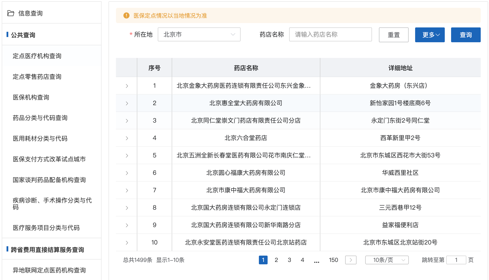

### 【3】响应解密

### 【4】入口定位

搜索`interceptors.response.use`

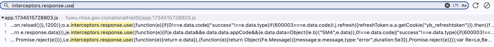

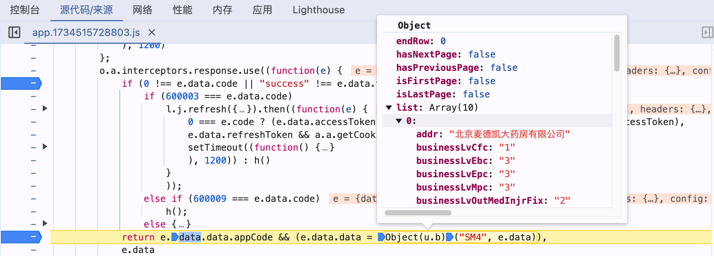

### 【5】基于webpack逆向解密

可以进入u.b深入挖掘和复原，但是更简单的做法是直接构建u.b

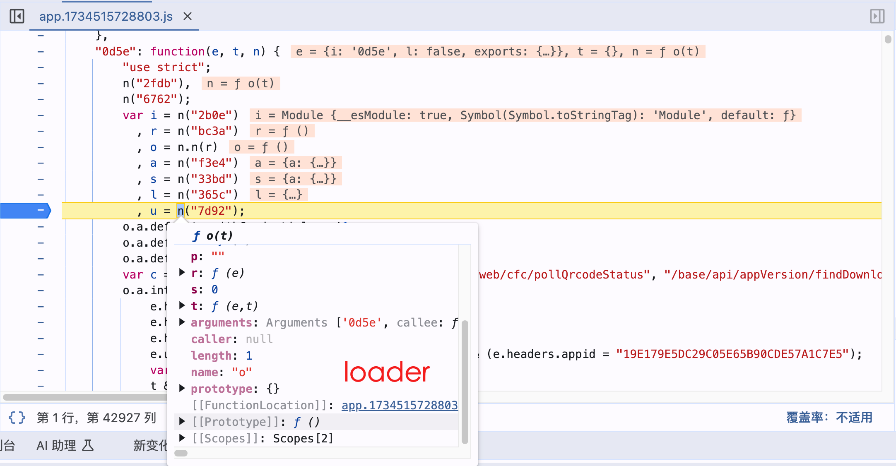

将loader拿到本地,构建loader.js

1. 补上window对象

2. 将构建函数赋值给window对象，方便全局调用

3. 注释一些初始化代码，防止补无效环境

   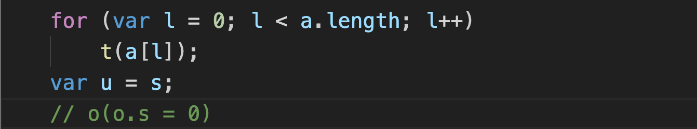

4. 将调用模块打上日志，可以观察调用信息

   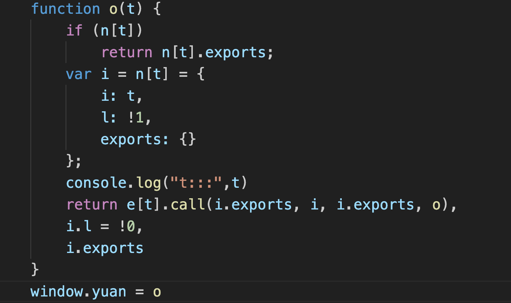

构建主逻辑main.js

```js
require("./loader")
console.log(window.yuan("7d92"))

u = window.yuan("7d92")

// 1. 测试解密代码
// 注意e别拿错了
function decrypt() {
    e = {
        "data": {
            "code": 0,
            "data": {
                "signData": "4QJOwsGQ893uRFwW8Q0VqkJxck81/Qk3gIvEFaQ5QsjkPxHgI7nKWfXLwmTTz2MyIr+riAuQLAq/mOewQoj+eQ==",
                "encType": "SM4",
                "data": {
                    "encData": "943195DDA5E5337E08E0A527071CC637E0074CBD73D293A3643B2199C79561872E19ABE7BB2600D23E9CDB14C1A75194C1D3C735D2DCC50E297311A423B72BF0AE4781F770874C1AC923AD26618311F182DFD96DBF46FD4EB0475F347756783DC91AC1A85DDB6CF1E859ED27C0247D0B8E38E87D09B74B6183D722C9C5BC1FC8ABAA64B40827F66C7103DA3EC1CB79357FA4DE3E012936C754BE9094F60BF6B2766C9AE3D07CE1FBB7E810B20BD8C3724DB6D42E72B47D0195A67AE2B577CD1D85691761F12307EFB8EC17C4BB862B453EDEDBBC80BDA91EEA41F58FD3084EE54C4635B12D1596B64ED66980BEAA24874B2922A40A9EB2B42DFA547101ED9203E6C5FE982E8DB540CAABCF72755B3D344B45B84A1FF82F77F00CA1BC99A6E68BDE8A1062158A1E40CC34236D58F32E155DD963A198B81AA0C508CB8912AAF75B92DA07444DA1526331109FAA4B5190B528103F9EDABB6C76CA5A6C1F24BDBFBD81A8A4440B0BB5493048C4001EE2B6F88791A859764475AE5365FE5F2D3207DFF94B8CA83EDEE175700A24EEC5F869495626E7300E3E1C43B432B84E47D8B0109BA756CBF627CA3CA91138F764E4E79AC1D8FD1A1155B7DCE9665B3A1856E1BB6193DDE8EC8D80ECD137DC24B04BFC7DC3EEE373E0A71DDCBEAA0D6F8350F6A423CA60D48BE079AB959EB56975CF1DD2FD2EA5223C14436C0A1BCD6095A980452F7E0A6E85087957FBC1FA19369DCDCF2FF575E5A08224248A668A514D1EFBDB7A11056C9481CD9B3BAD3A6EB6E62B4BCA23D6131B2B2958BD807E1453C5447EAF0BC5D15EFD6B978B4F44C0CD088034929FD30C638E7F5CC7435914EB1582FF2C2BB08DBE0B2BD1B51D9E023B61B03AFDBECFE523CF3EA2DF64CF27421C0DFA374E70E692C52655A4B78BAA0F62FA0B70165FA33E1A32E6430EC13911F08993941400D3F018F4D3E814C13ECD2E8B098DF426A1A90422D40FE350AA784246D2582ED934A2128B607854B0A38F84DAA630D4F1229ED3A1B9A54758C46F1654A6FA86E3F98B0EB5C8BE9E93D8BB65E30097D9663D775BA1483515B9D36E8AF8598BC5CC1309E79CD4D9A6401DA15F5F821A81D03D58A49869A51AB219E228808A37222075760E5D8FD3BFE2FF70D827AA18CAFDBB5EEEAF0DACBB17BDDC993D0F9027473065419DD7AD3B182A745585CA21D57D8782DFB3EAAD3170EE20045CAC80B046CBC22D5D5F71986E59A08EEF3AE412EE5DA72B65BFEFE9CA98FCEFF3DE75D6F24E3D0925FD1B0FBDF905FBB1641DC00B2C059FF432406F67960E6BA12F934748FE06769569BBC4E47D1DBBE6E4DF17DBF0AF690467B3A81157327E1C1B12547A651EC2F1F754187475C3E806AFFA8F635ACA0FA92614BF9B9D02E31BDD417B8840242DF9095293D8240B3736D157246C9C9E24BF8151DE0737E76497F195B88CFE3489F0CC825C24908F0F356D54F2306B41914731409C6E254BB84C870C6B938FB449B3366909044B240D4745961F9F7871370E77A523F9991C659F0CCB3F53A3E33BD924E023CB4D2466FE5FD8808027665DC09B81DD86C4FBAF26D4AD0D3D99C54A971331C1310095F1798A6D5127735CD1B6D22CD0C8C09CDA1E6F972FECBC7DD09970E3A28577413984D5027523668887593B3E35A88FBF7FA063DF18AAC85044EAB1691D6A120810293193A755FE43F994D4A56470C7B0458C80BE5B8CB156B6C07FEAE5DF62DDC46358440021AD99E46B818627912383E163B0705F510B8F1A4BB3EE5241197B24C16DC3271506884F6FC59D86D02876EE5CF2C2FCD02422AECF3892FD08C8EEE0C6D1B004E462B1AC835F03A779BE611D970852E512FB1F52323EADEB7420AD34B9ABF4740826770C4FE19C344AD90AA910DAA361F6FC54CBF9BD275AFD7BFFA665837708052B4BD9B64923A6C39EA92374F9DBAE2E91D757CCFB10FCEFE2E92408CF49C45774F384EA4914C930BC75B26D631CC3D1BFDD4E0A2D4D5C6D2646F8FC6E15C17577ABEA801BCA1E9297489C2F26A03C5630F760D3389C522FDCD358AF61907228575692F06822201465AEF3F844987C9F48ED0ED2F84D721D60709D65998445F52CAAEA8A93FB4FD203C7EACB507942990037055ED3A24F07066B0A82E05CD081B1BA63346C6354C8497CB0862AAD0D3D99C54A971331C1310095F1798AB0A49036B1E8947ED3A6BE0C8083A54B007D758DBE404BBCE666CDDFD56719E55AA1DE72CB2FB53B89CC69386A27D0E115BF94C575D25BE66DD75BFDD7E075D697D9663D775BA1483515B9D36E8AF859E0225BF1FB9E7004DD40097742F940293815FCABFABE9509A2DA3C61A20078B46A855D0BCC3615E3A63A1861677123A2EC6B5C96694E69963053D0A6F0DA70178594696D042559F474208688CE821485D5C1396BAADB01031C1A3B469CA6A60ADAD2ABD62EEF87E582AC769848583ECE29FAC03CA372F7A6D0765D6D68BE08165D4122B52FE86038CA0E7A33AEAE03D21A91C78B848DED57CA24306716CE130E42B1E36871B2AE2FDF14F135CE72FB5BD84F6987D9F23D9FDE76D1CD4EB1B48435FAC7CDF743DB43E10C50355C0AB5537DABBDB59EA2F8549823D373342CCFBC640C947444C755210A36291EC920394FCA37CD8D9BD895566C8462E43F8407CE70E5C50B8BAD6953F84A34FB06FA640218EC6F9A44A974D9B23C10556F766BB7200162303EC72ABC55B1B0A9F40A4ECB97D9663D775BA1483515B9D36E8AF859D256A8CD4A6FA861DFF480017267354824DD5BF0EC07D029D31CE465790837FB1B5799057B17FC5DAA9C2854EC75D5AC00B787AFA653C5964747618DFBCED145843B8A934B01B9CCF6E6DC8CA1045AA8A1BA0CB34A761326BDBA6ED6B4CB64887505E4F46E47B3CA40AC55CB8162BD146EB4471EB225248A5D756F5A9F7EE8598C33F277B985298F23DE9CB2815527DD8FCC5A373E4C2CB2CBF10CCEE7874FAD31B2E8A796AF977BA38F66B781D11F64B814B3C4709EA945FCC22E2564102114900C3F00534BEFC5758CE38A616BE18AD6DDA7119F8428138AABB75A2A291B6BBE5FF87174B9D0288BFC3670B8DBDD431C5D6F06307389DC291E48C151719519493EF7929CF1F3D21CD4F0CCBA3E6507E74492A65EA3BCF285E6573C14EF1C2F2C0DA2D0100600B53858408177C59C05987C9F48ED0ED2F84D721D60709D6599F4961FFD22A3208CD49DD84B8CFAEFE818EC8B31EB047C322A6E8FF34D04C16D2F1274B247E0629F951B7C148B264FFDC98B6EB8989D8202AA3516FFA29B3A1AEE7021A0E3FADE7493B070C9CDDE94E05D0AA02749823F1B93B16ECF30AF6308218550D8DFF01F48E02BD424E92512C5C5B1A27867767F7BEEF279DFCFE4E681BBBD5DB53EA5E7154071E74EF0BE481E71BBECD3DB8BF0D94D5BB630597E70D1BBBD5DB53EA5E7154071E74EF0BE481EC937762E26C1C310788AB9A66822912263CC20EB6AF79BF07AD98986282B0CA1A193DCD8F079025A99D6E4D42EC9370BC08285E0BF5E5852448A15060CE14BC8AD214202C3712F8FB1B3AFE8CB9886E077830FC1D7FF0FCEC441B45B5839C9DF3BF53F786F8C7E12124F7C6D689A648B9F1142B244FF669F76CD2085344C73F5803E042ABF683F9718FA3EE7A21679BABDAD417EB5EDC97C94E7B340CFBE464E17B4768EA5561668E6850B7AE2C37B1CC84AF2A50887752A72B01584E9C0004EF22CDB67245D1A126F384CD163DD825CF3DA643F9DA436999D1F963BFC00285D2C4B51E46CC029AE6E4ECA8EFC4F5100BDFEE756603654E9264669C2E90E56B54E1C1EF869BA6BF4E370AB9EE65307C6534D3F4F84B12E2B578DA72AF53290571473444F8ADDC5E726EF9FB6EA1469A4F71B48E4D7BD653DAD071E0FF53604253C40DA6DA556EF16716BE3D07296E08D8D760DBB39F47EE77675B19498478D239A72D11B42B012A3FECD2F6F25A290F9934B5CF8FC6B9A65AF9540F414FAC1E811AAF12D40A6B62BF3F76DBCA09248770392DB77A7F2D2CA58AEFC1E8686CADDB37F912821EF5FD88C7BF7E4A8BD51A644D25F61DC577194B9B7FE7DB08C03A29BA2727D169BF7B14D998651A2AD2C388111B4EDA3BE273BC7EC402EEDAD329D4D48E440F62D692AFFA3FDC969C2711C6A6FDE1381DCFAC20033D0B114ECE1F7F2E7460846A4D90F253D2F597F40221D7DCB60BBF30E033754691B5509222D89661481F7E683E5D67ECFB4D968FA1A6C640C947444C755210A36291EC920394FC81058A6786D0422B05C18C0CC1D60E94C077BB4831C80E78820138D02A3F3B910C7589B30AA97E737160F13E111A336400B6621C9E19828E1D1BBE352EDBE1798070B0160B2A19B32E913D7BA20375AE84EA79F0E113FFC541D234D451D8E1D523C856783C6E7089E51EA8C1499142E574A19983EAF96C252FD2CA4FB76BD3E8EAC4796E6A4B2C425695DA335940597C70F3AD1203B122E33E4C0EF2DB2E6E4589102D1E82EC3EFAA18996C1825200E26EAE4B33519F04F370F01B9115456393815FCABFABE9509A2DA3C61A20078B4D389B18B6B1C39322647DA4963B40BC483BD82482309349C6940B789B5ABB44565D87627E132D6E8281823416F1B46907C9863497333FCF64E2B7AEDE1B85EC5210F35F57B08B9B878F40C63C649A5B5987C9F48ED0ED2F84D721D60709D659971D9C0926A245E4BED5121356CBC6FBC18EC8B31EB047C322A6E8FF34D04C16DDE809EB0B5A4A449BC2E9402B964FE80EFE6B84B34174F107BF18A7973CCDA7AEC778B189EF445FA79737DB5BE38133F444900A7F1DC60803B5D392B0054FC75663B6A513AAA8686FAE63251D126C31208DCFB0F5D40EF0F18AC8126B0B2A3AF1FCE60A6DBAA20743A287A19310A57711FCA418578F73CC86C032B474492C48332B881964D1DF9197B2B1CF63648A1565F98D5378DE78C8A41A40C053E10205EFF98A4F24F0A5D71CDAE9CB9B232B529F6F80FC310DCF9A05C01F5E125121007D782891DC51DD2FE76D0A6A3E11DBD9888307BF6853C0D24B153FD7CF812BA1B515ADDA4303AFBAE80030E37D1E77DEE97718B79A6C1D2C11C18F0B3AB1E2B3A28359D28B28F791025CD2F7A333964C8994427E653FFB0CA3061E7E6B6846218B446AB60720919F6284D7E4B367AEF4E57EF5554E70DF20419FB905BF6F98DDAAF0F8483CD69C20312A73A7ABB226BAD300628B4ED8F04BD59BBC1BA98C13220AA96A343A18374560F91D963371004EC5EA62FFE81A56DB7B4FCE6D08A383A01444900A7F1DC60803B5D392B0054FC75A2DB48F3FA6E14D5D5F2401E65433BC2961F9F7871370E77A523F9991C659F0C4B19F01672256066F29B06EF7F7FF1B7268E4B6602FF142D01E0860103E90DF9F5A6008408AD264E09112A7317809EF313398FFB689CA58AC611301DD1B37AD3B977432A1F68BB3E6B878728012295CC6A93FB1F98E4B0A12DDDE7A3494616BE181C46666049DE9E13AD1D2B2E085E61C768AD29CFA2B6B32CA347D9F206DD174AC0FD61AD5503F744E927D6D9483E51F39E9029292E41403B95CF3F2E251883629F6B8E51D170F2F0A2FE4CA17891F91E14A5DC37720712CE0F2EA22AF50114C8CABC772776CADEFBD1E0ADC6356B1CD28418CE406FC2C1BA6AF765B3397B47987C9F48ED0ED2F84D721D60709D6599564F2D2F4C08ECBA9CF7E1C9D9EF5FD4DABF2D33EBCBD8B268CC1DEFA5EFC341962625E2EDEF651766FCAFD7CCD294C53815FCABFABE9509A2DA3C61A20078B4CFC8FC2B37372BC988CC8334813A21BD97D9663D775BA1483515B9D36E8AF859175A801AC65C8D6CE7BE5E0285D6AA6F3815FCABFABE9509A2DA3C61A20078B46758C414F8DF0E3C839C66F3425CC5E6A3F712410D40A97CB2B2BBD27E83C14BD03D1D4E2FB7DF972493679EF395559B7942990037055ED3A24F07066B0A82E088BAB2629BD546AEDA7E1C04D24144D0928BE79DC6EADE64277410265C843B404779EE07558B0563C70DCC882F06920DEEFFE04A935B6753ED56B7A7E34A57835EA5355B3A00DC92A40FE29F6F1F1C4E0A8BB8E5972ACD3C0454F966671A0028A76C0967E51EC7A59DC479FDE871384B0DB900551F22DB202380E822B0311C7EE0C21227A0678F5121A42A8D0AEC73A30DB900551F22DB202380E822B0311C7E793EF792D491E0DDDF11EA99F8639A4FA51EFBE85B1660718232C81F7FBB6CCF204ADE2544CD6FCA894BB59990DEB3C51518A23323C8535EEC4FC125010E9390C4D48C14620BF456F4C5688F319B4612E716B3D9C3FFB338EA53382CF610D71AB9FAD7CC239E35538657A66CF301EF0ABA7B1422E824D3C047372237899C4C52B712B224CBD69CE64D734686D2714A9C285322B3C52E8ABC74DF9AF8206F3D26187DDCF931500041E33B714D0D338934F174F1A5200DC2EE0E23DA4EC49DCEDD5EA62FFE81A56DB7B4FCE6D08A383A01444900A7F1DC60803B5D392B0054FC75A2DB48F3FA6E14D5D5F2401E65433BC2961F9F7871370E77A523F9991C659F0C4B19F01672256066F29B06EF7F7FF1B7268E4B6602FF142D01E0860103E90DF9F5A6008408AD264E09112A7317809EF313398FFB689CA58AC611301DD1B37AD3E5638D7EA4D23B75FC48C4695A85952F6A93FB1F98E4B0A12DDDE7A3494616BE181C46666049DE9E13AD1D2B2E085E61C768AD29CFA2B6B32CA347D9F206DD174AC0FD61AD5503F744E927D6D9483E51F39E9029292E41403B95CF3F2E251883629F6B8E51D170F2F0A2FE4CA17891F91E14A5DC37720712CE0F2EA22AF50114C8CABC772776CADEFBD1E0ADC6356B1C8D8FC0CED5F7A956AAF354F16471475E987C9F48ED0ED2F84D721D60709D6599564F2D2F4C08ECBA9CF7E1C9D9EF5FD4DABF2D33EBCBD8B268CC1DEFA5EFC341962625E2EDEF651766FCAFD7CCD294C53815FCABFABE9509A2DA3C61A20078B4CFC8FC2B37372BC988CC8334813A21BD97D9663D775BA1483515B9D36E8AF859175A801AC65C8D6CE7BE5E0285D6AA6F3815FCABFABE9509A2DA3C61A20078B46758C414F8DF0E3C839C66F3425CC5E6A3F712410D40A97CB2B2BBD27E83C14BD03D1D4E2FB7DF972493679EF395559B181C46666049DE9E13AD1D2B2E085E6188BAB2629BD546AEDA7E1C04D24144D042A19DAEB379CA2BC6011DC4A1FB176C7D32930FE120DBBB30585C7327A004AD446BF88DD66F2061F3B48196C3C874CC9700AFBC1F89C4BCEB43C54B3D30C87879BFE00E77258A07010562067813CE59F2A02F00756C8A8BEB8039D420D6D36ED9096C7C2120531BC96EECCFC7DE250B177A69F7A2EDACE2093ACB2BCD47C45B656D5FB82D89286AC381C231F8428931D1FE9E2ACCDC48D54DD0DC4B3DD55F5DB1505B8802CE9347C9B2D0EE0ED66EF09597365E92C07D603B240081D2D9A297B3E67441249CCCF702AA68216D9017F8F4CEDB4EFF2975DA8BFB6D050148BC673324B051B6AB4CA1E3A7D42D14EDA8560D96F51DB4A51B877983975263B15922721624DBCB49BBCDF1B20FFC8AB1EF5DDA7FACF4AE61F63578C15F32826373DA2F512A50FEF595D569AA6FB631EAC04D8B9DB33416EC234496A6AAD671735B24BBBD5DB53EA5E7154071E74EF0BE481EC429551452268BE9C4919E923688457A987C9F48ED0ED2F84D721D60709D65992710F996D1E31CD59B0DA2948536E1ED5D4993D6599F2007E8DD123839F16A3F5205374DBA8E71242A15CBC9A068EFC31A2A4FFAD3221479093EFB3207D13498F9E5D6121EEA43BFF204A958A7A896B86C3E0F10B2FFFFCCF5A13B1766B4870DCE2AD69681A4BF45325339CE9F01DB90A61DF6FAC08BC9F808BE116002CB1C1BC91AC1A85DDB6CF1E859ED27C0247D0B8E38E87D09B74B6183D722C9C5BC1FC8D5E84E1A7ECB9F678655BFDFE7C6185ADE0D4642EC3033A4DC63003938262E8C766C9AE3D07CE1FBB7E810B20BD8C3724DB6D42E72B47D0195A67AE2B577CD1D85691761F12307EFB8EC17C4BB862B453EDEDBBC80BDA91EEA41F58FD3084EE54C4635B12D1596B64ED66980BEAA24874B2922A40A9EB2B42DFA547101ED9203E6C5FE982E8DB540CAABCF72755B3D344B45B84A1FF82F77F00CA1BC99A6E68BDE8A1062158A1E40CC34236D58F32E155DD963A198B81AA0C508CB8912AAF75B9B1648DC03DC2493069270ADFE0B58C5C0F88C2157260C25949B2934A28164AC81A8A4440B0BB5493048C4001EE2B6F88791A859764475AE5365FE5F2D3207DF81A014114D2A35BF113427ECC99BC4BCB95C51588CC417BFA9AB6F43DB55F34CD6047F37D38BE114350EFD1C8D811ABA7F091FCCF971D0B2B17597DC54F0902162E7C55C3C31D5BA0EDB1F9A9D3C19CEC3EEE373E0A71DDCBEAA0D6F8350F6A428A6A7791FCB75AA3EA49208C7A7E3C3AAABD3D76CA9A8A11C42BF5F5FB74B3160AA0AB5EC8EF5E1CB1276645ACE06BBC986BB3AF3A476493CCA7C7FF4E22C052E062A59E6A733D780BFCC2D2D4AABABCE6262DD74FE4E49DC60480748E6B1A992DA614F4D7FAAEF80ECEFE8107264D568D685E0B7A639C4387A43E7789DEB2D791680837C1FF9217DAF5B3AF03D2B39A996331794514801140377E70A74A9D8AB8CE9260F2C3ABF5548FFADB39F01C4BBBD5DB53EA5E7154071E74EF0BE481ECBE780167AA8A242146E3369B7732A2B3815FCABFABE9509A2DA3C61A20078B48A19771A677EDE403A2BA518E5D5ACF87942990037055ED3A24F07066B0A82E07454806472F90D4783C65BA282381D309EF7F74D2A5E852B4E26CD310AF64DDDAD6123B0CFD169D8BC296A04C0F728C4A902FAE39F74B40214651C5200047B0A60A50A9A4E8506A912A75356C2D677DE61AF6A2CEEC3345345E39B12144809A597D9663D775BA1483515B9D36E8AF8593567DB4E4A9011423E13A442EFF6F60A97D9663D775BA1483515B9D36E8AF8591F2CFC1C65A65B934FD56C104FE3640333BF4512BB432390A58F386BB41D3C268CBA1E5C0A86B6C6BAF6371722C96EA22445F6B3FBE14A0B6F6BDD6F1785A88D803E042ABF683F9718FA3EE7A21679BA5E91A3A2D09491FC4806EFE8B6C518390DDEAB7A89CC8E722A89B6B84B2E2539064E75FA72FF95EDE936D931CF9867CD3D3765C46B89D9CEDB6BC24CDC84E1A670E6F2B7E27419F7AF63923503A71E6800484E9FC4FA99C364015E1B1C71DE4AE7D84F6B2091AEB79947C7104CFB4400322870F31AFDC579D440B85A5DFC58D149781294547B1B41D87A0EDE7A6B82FFBBBD5DB53EA5E7154071E74EF0BE481E5F1E209932A07A74284CA6A2B38A6EEC2E60AFAD5B06EBD8BD1168C553E6E63C43CBA3899789DB7D6CC2742B36E171A5A68800C0180A6487C4A11DE09A70AD9A7762D77689AB4C70B818AB1A333C62C7F24E151085638879EC198D3A62FD261BBB724289FF9ADF421138E8D9719A176D342AE8150E7CEF39F66C6FC799C2B708581DCF80F575AFBE4CD2CD589EEB4F17B02CD8F7EA2B9C5BE548D0FB04AC4BB5738215D6C4598C41DADE77782ADF75E3F8F0A1F3608706F0BA78B859D3D8DFC3485CB655C350BDC856AD5A76506922850A17FB9517EA6B059FCC219C0BD98782A3218505C098E22823D6FE0F81AEFE78A8797D1E92CB6B4B8030CFACC8FB57CC907228575692F06822201465AEF3F844987C9F48ED0ED2F84D721D60709D65998445F52CAAEA8A93FB4FD203C7EACB507942990037055ED3A24F07066B0A82E05CD081B1BA63346C6354C8497CB0862AAD0D3D99C54A971331C1310095F1798AB0A49036B1E8947ED3A6BE0C8083A54B007D758DBE404BBCE666CDDFD56719E56854AED9B10AA2C1C82C6143BD6AA8D415BF94C575D25BE66DD75BFDD7E075D697D9663D775BA1483515B9D36E8AF859E0225BF1FB9E7004DD40097742F940293815FCABFABE9509A2DA3C61A20078B46A855D0BCC3615E3A63A1861677123A2EC6B5C96694E69963053D0A6F0DA70178594696D042559F474208688CE821485D5C1396BAADB01031C1A3B469CA6A60A1177FA7A10D393FE326F70356D951EC129FAC03CA372F7A6D0765D6D68BE08165D4122B52FE86038CA0E7A33AEAE03D20F899C42EB990616BE2EEB4EEAA1DC4042B1E36871B2AE2FDF14F135CE72FB5BD84F6987D9F23D9FDE76D1CD4EB1B48435FAC7CDF743DB43E10C50355C0AB5537DABBDB59EA2F8549823D373342CCFBC640C947444C755210A36291EC920394FCA37CD8D9BD895566C8462E43F8407CE70E5C50B8BAD6953F84A34FB06FA640218EC6F9A44A974D9B23C10556F766BB7200162303EC72ABC55B1B0A9F40A4ECB97D9663D775BA1483515B9D36E8AF859D256A8CD4A6FA861DFF480017267354824DD5BF0EC07D029D31CE465790837FB9A13A323744DB41781DC619818F34062B018602D747390CA88298E186A2EDBE43C2B5309E67A21BF89D2C2A7C43064E96A0BAE165ADC39234D05EC8A514C8CF60415B5C89ED64D651402034273A66F06E15DCAB2E9BE6B060C7CFC983D60911AF9BFED3E18BC6E12CFD374FE979F4511F0958EF7545AFB0E9BC8B3B863C43444187E5D73626EEA5856BBEF8CB8F21794C3767CB9A068F9DBDD2BEB65E50241F9CAB0DD5B5A18C48543C2428318BB4474354D09F5EBC845EEF08929E3D8B9DA990B458152E444C1A608286AE20178FA75C2F65FBCAD578FFE2B7541D2BF4C385F2E062A59E6A733D780BFCC2D2D4AABAB304DC51633924B0FE0D4D3ACFBF2055CE53EE6E3150396DE1D60B3B7435DAAC8212BFF39A31D407E2F8E1352D46D51C198EB9FEF9BF90ABDC3BDC228DA5F5C05403886195DEC70209990180F4D8291104DA1C6B11562D46194578A5BB1B95324493EF7929CF1F3D21CD4F0CCBA3E6507E74492A65EA3BCF285E6573C14EF1C2F2C0DA2D0100600B53858408177C59C05987C9F48ED0ED2F84D721D60709D6599F4961FFD22A3208CD49DD84B8CFAEFE818EC8B31EB047C322A6E8FF34D04C16D2F1274B247E0629F951B7C148B264FFDC98B6EB8989D8202AA3516FFA29B3A1A502BDB6869C7D0CA8ED04501D481F0F85C49DBE377E736AA4E8ACF7B70373A8C3D49E10769ADF903F53E58FBB514FC2332F763EDD3197C938C322D46B3231B2080C83A717C0DD2C4513CBEC008A07432CB4C761CAE1DC4452664292099E09A8A24BB18281CF5B37B1BB7046EF26BD1BF35FF0C62640FDE24BA32BB172BBF45F24F6D231DD03926E08B733492616DA2987A749A04019F42FE6BC721013AF4CA8CCFB3E92CB7A47470A5D154588BE22E404AB3CD75FBE5589EDB5008A512CC1B40A5B9328442FDE48667E19087CD3AEBA89FABC82F326D3AE62AEBBFBE71D425C442E75B4597DCD21C5C6C29E49A002860802F5456AF8E1A53E18A4E92A76E7F4E"
                },
                "signType": "SM2",
                "appCode": "T98HPCGN5ZVVQBS8LZQNOAEXVI9GYHKQ",
                "version": "1.0.0",
                "timestamp": "1736589824238"
            },
            "message": "成功",
            "timestamp": "1736589824",
            "type": "success"
        },
        "status": 200,
        "statusText": "OK",
        "headers": {
            "access-control-allow-credentials": "true",
            "access-control-allow-methods": "GET,POST,OPTIONS",
            "access-control-allow-origin": "https://fuwu.nhsa.gov.cn",
            "access-control-expose-headers": "Content-Length,Content-Range",
            "cache-control": "no-store",
            "connection": "keep-alive",
            "content-language": "zh-CN",
            "content-type": "application/json;charset=UTF-8",
            "date": "Sat, 11 Jan 2025 10:03:44 GMT",
            "server": "WAF",
            "strict-transport-security": "max-age=0; preload",
            "transfer-encoding": "chunked",
            "x-mg-code": "200",
            "x-mg-timestamp": "1736589824243",
            "x-mg-traceid": "647f0aae-9ee9-4f75-8e7f-ec56188a98ec",
            "x-request-id": "71a2300fd91fe9be166c43c4a40ae906",
            "x-ser": "i32399_c4103, i32859_c25015"
        },
        "config": {
            "transformRequest": {},
            "transformResponse": {},
            "timeout": 30000,
            "xsrfCookieName": "XSRF-TOKEN",
            "xsrfHeaderName": "X-XSRF-TOKEN",
            "maxContentLength": -1,
            "headers": {
                "Accept": "application/json",
                "Content-Type": "application/json",
                "channel": "web",
                "x-tif-signature": "cfef8145813ab89ee6d9f36db876e211d9cfd2a9e864b9c26d10922c05804d6e",
                "x-tif-timestamp": 1736589824,
                "x-tif-nonce": "L3aL9aHK",
                "contentType": "application/x-www-form-urlencoded"
            },
            "withCredentials": false,
            "baseURL": "/ebus/fuwu/api",
            "method": "post",
            "url": "/ebus/fuwu/api/nthl/api/CommQuery/queryRtalPhacBInfo",
            "data": "{\"data\":{\"data\":{\"encData\":\"3DFBCA4667B978F639BB23B95DCE4CC74CE34C33DC32F1068E9E23CA546C9EA8CCD20943B4DAE96380B41164D761DE97BBBD5DB53EA5E7154071E74EF0BE481E2BADC2FDCC843E425B4CA14CEDBC102CA979CA4202C06C9F2CD837D90C6DA45E64DE712DF3683DE81C358841664CBE17561D0390069F11B0D412FE38BE15BA5C\"},\"appCode\":\"T98HPCGN5ZVVQBS8LZQNOAEXVI9GYHKQ\",\"version\":\"1.0.0\",\"encType\":\"SM4\",\"signType\":\"SM2\",\"timestamp\":1736589824,\"signData\":\"Ugk5SiJz4NMjy1pn5rbAHzbBaDJAeyHjkjWqn0nbFVaqYhVBP1Xcv4fnXon5s6yvPVmlJKtaoMrm1FYT7svv0w==\"}}"
        },
        "request": {
            "_ty_rum": 1,
            "__ty_xhr_hooked_type": "onreadystatechange"
        }
    }
    ret = u.b("SM4", e.data)
    console.log(ret)
    return ret
}
decrypt()
```

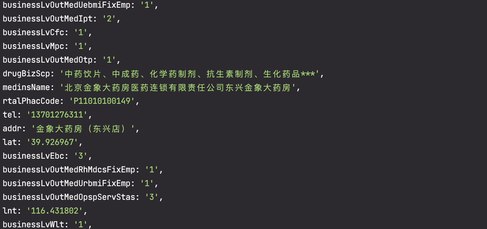

### 【6】请求加密

+ 入口定位

路径关键字：搜索`/CommQuery/queryRtalPhacBInfo`

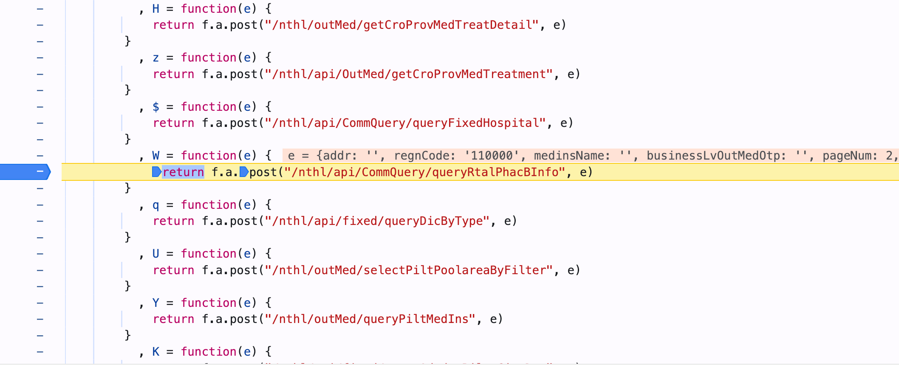

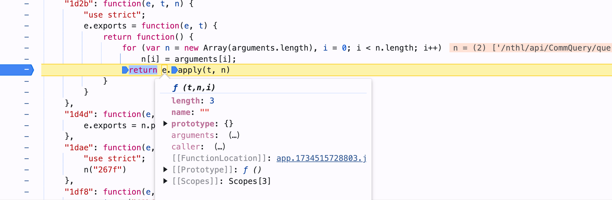

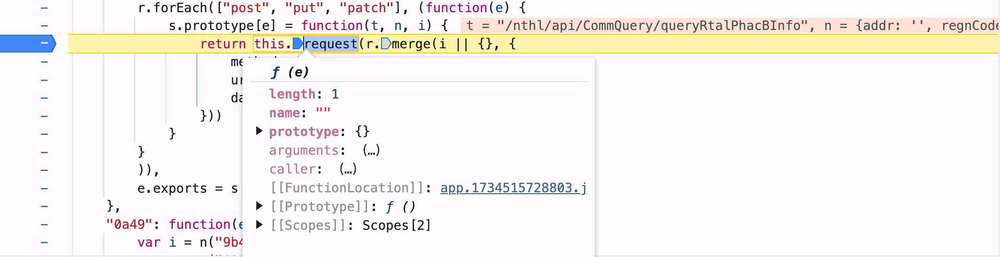

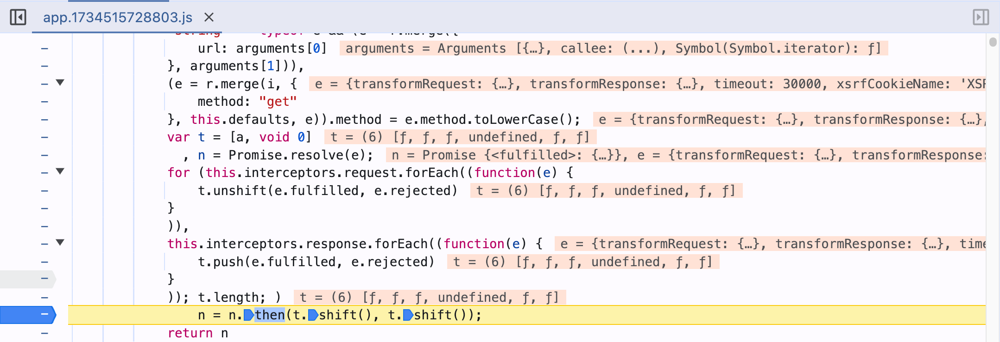

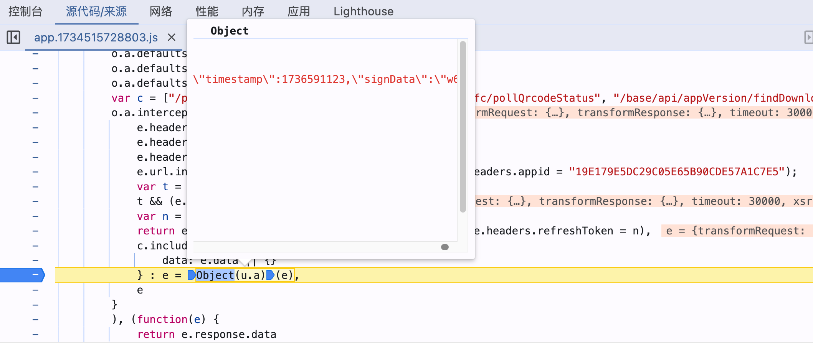

### 【7】逆向加密

发现这个u对象和上面响应解密的是一个,上面是u.b，这里是u.a

```js
function encrypt(page) {
    let source_data = {
        "transformRequest": {},
        "transformResponse": {},
        "timeout": 30000,
        "xsrfCookieName": "XSRF-TOKEN",
        "xsrfHeaderName": "X-XSRF-TOKEN",
        "maxContentLength": -1,
        "headers": {
            "common": {
                "Accept": "application/json, text/plain, */*"
            },
            "delete": {},
            "get": {},
            "head": {},
            "post": {
                "Content-Type": "application/x-www-form-urlencoded"
            },
            "put": {
                "Content-Type": "application/x-www-form-urlencoded"
            },
            "patch": {
                "Content-Type": "application/x-www-form-urlencoded"
            },
            "Accept": "application/json",
            "Content-Type": "application/json",
            "channel": "web"
        },
        "withCredentials": false,
        "baseURL": "/ebus/fuwu/api",
        "method": "post",
        "url": "/nthl/api/CommQuery/queryRtalPhacBInfo",
        "data": {
            "addr": "",
            "regnCode": "110000",
            "medinsName": "",
            "businessLvOutMedOtp": "",
            "pageNum": page,
            "pageSize": 10,
            "queryDataSource": "es"
        }
    }
    return u.a(source_data)
}

console.log(encrypt(1))
```

### 【8】完整实现

`main.js`

```js
require("./loader")

console.log(window.yuan("7d92"))

u = window.yuan("7d92")

// 1. 测试解密代码
// 注意e别拿错了
function decrypt(e) {
   /* e = {
        "data": {
            "code": 0,
            "data": {
                "signData": "4QJOwsGQ893uRFwW8Q0VqkJxck81/Qk3gIvEFaQ5QsjkPxHgI7nKWfXLwmTTz2MyIr+riAuQLAq/mOewQoj+eQ==",
                "encType": "SM4",
                "data": {
                    "encData": "943195DDA5E5337E08E0A527071CC637E0074CBD73D293A3643B2199C79561872E19ABE7BB2600D23E9CDB14C1A75194C1D3C735D2DCC50E297311A423B72BF0AE4781F770874C1AC923AD26618311F182DFD96DBF46FD4EB0475F347756783DC91AC1A85DDB6CF1E859ED27C0247D0B8E38E87D09B74B6183D722C9C5BC1FC8ABAA64B40827F66C7103DA3EC1CB79357FA4DE3E012936C754BE9094F60BF6B2766C9AE3D07CE1FBB7E810B20BD8C3724DB6D42E72B47D0195A67AE2B577CD1D85691761F12307EFB8EC17C4BB862B453EDEDBBC80BDA91EEA41F58FD3084EE54C4635B12D1596B64ED66980BEAA24874B2922A40A9EB2B42DFA547101ED9203E6C5FE982E8DB540CAABCF72755B3D344B45B84A1FF82F77F00CA1BC99A6E68BDE8A1062158A1E40CC34236D58F32E155DD963A198B81AA0C508CB8912AAF75B92DA07444DA1526331109FAA4B5190B528103F9EDABB6C76CA5A6C1F24BDBFBD81A8A4440B0BB5493048C4001EE2B6F88791A859764475AE5365FE5F2D3207DFF94B8CA83EDEE175700A24EEC5F869495626E7300E3E1C43B432B84E47D8B0109BA756CBF627CA3CA91138F764E4E79AC1D8FD1A1155B7DCE9665B3A1856E1BB6193DDE8EC8D80ECD137DC24B04BFC7DC3EEE373E0A71DDCBEAA0D6F8350F6A423CA60D48BE079AB959EB56975CF1DD2FD2EA5223C14436C0A1BCD6095A980452F7E0A6E85087957FBC1FA19369DCDCF2FF575E5A08224248A668A514D1EFBDB7A11056C9481CD9B3BAD3A6EB6E62B4BCA23D6131B2B2958BD807E1453C5447EAF0BC5D15EFD6B978B4F44C0CD088034929FD30C638E7F5CC7435914EB1582FF2C2BB08DBE0B2BD1B51D9E023B61B03AFDBECFE523CF3EA2DF64CF27421C0DFA374E70E692C52655A4B78BAA0F62FA0B70165FA33E1A32E6430EC13911F08993941400D3F018F4D3E814C13ECD2E8B098DF426A1A90422D40FE350AA784246D2582ED934A2128B607854B0A38F84DAA630D4F1229ED3A1B9A54758C46F1654A6FA86E3F98B0EB5C8BE9E93D8BB65E30097D9663D775BA1483515B9D36E8AF8598BC5CC1309E79CD4D9A6401DA15F5F821A81D03D58A49869A51AB219E228808A37222075760E5D8FD3BFE2FF70D827AA18CAFDBB5EEEAF0DACBB17BDDC993D0F9027473065419DD7AD3B182A745585CA21D57D8782DFB3EAAD3170EE20045CAC80B046CBC22D5D5F71986E59A08EEF3AE412EE5DA72B65BFEFE9CA98FCEFF3DE75D6F24E3D0925FD1B0FBDF905FBB1641DC00B2C059FF432406F67960E6BA12F934748FE06769569BBC4E47D1DBBE6E4DF17DBF0AF690467B3A81157327E1C1B12547A651EC2F1F754187475C3E806AFFA8F635ACA0FA92614BF9B9D02E31BDD417B8840242DF9095293D8240B3736D157246C9C9E24BF8151DE0737E76497F195B88CFE3489F0CC825C24908F0F356D54F2306B41914731409C6E254BB84C870C6B938FB449B3366909044B240D4745961F9F7871370E77A523F9991C659F0CCB3F53A3E33BD924E023CB4D2466FE5FD8808027665DC09B81DD86C4FBAF26D4AD0D3D99C54A971331C1310095F1798A6D5127735CD1B6D22CD0C8C09CDA1E6F972FECBC7DD09970E3A28577413984D5027523668887593B3E35A88FBF7FA063DF18AAC85044EAB1691D6A120810293193A755FE43F994D4A56470C7B0458C80BE5B8CB156B6C07FEAE5DF62DDC46358440021AD99E46B818627912383E163B0705F510B8F1A4BB3EE5241197B24C16DC3271506884F6FC59D86D02876EE5CF2C2FCD02422AECF3892FD08C8EEE0C6D1B004E462B1AC835F03A779BE611D970852E512FB1F52323EADEB7420AD34B9ABF4740826770C4FE19C344AD90AA910DAA361F6FC54CBF9BD275AFD7BFFA665837708052B4BD9B64923A6C39EA92374F9DBAE2E91D757CCFB10FCEFE2E92408CF49C45774F384EA4914C930BC75B26D631CC3D1BFDD4E0A2D4D5C6D2646F8FC6E15C17577ABEA801BCA1E9297489C2F26A03C5630F760D3389C522FDCD358AF61907228575692F06822201465AEF3F844987C9F48ED0ED2F84D721D60709D65998445F52CAAEA8A93FB4FD203C7EACB507942990037055ED3A24F07066B0A82E05CD081B1BA63346C6354C8497CB0862AAD0D3D99C54A971331C1310095F1798AB0A49036B1E8947ED3A6BE0C8083A54B007D758DBE404BBCE666CDDFD56719E55AA1DE72CB2FB53B89CC69386A27D0E115BF94C575D25BE66DD75BFDD7E075D697D9663D775BA1483515B9D36E8AF859E0225BF1FB9E7004DD40097742F940293815FCABFABE9509A2DA3C61A20078B46A855D0BCC3615E3A63A1861677123A2EC6B5C96694E69963053D0A6F0DA70178594696D042559F474208688CE821485D5C1396BAADB01031C1A3B469CA6A60ADAD2ABD62EEF87E582AC769848583ECE29FAC03CA372F7A6D0765D6D68BE08165D4122B52FE86038CA0E7A33AEAE03D21A91C78B848DED57CA24306716CE130E42B1E36871B2AE2FDF14F135CE72FB5BD84F6987D9F23D9FDE76D1CD4EB1B48435FAC7CDF743DB43E10C50355C0AB5537DABBDB59EA2F8549823D373342CCFBC640C947444C755210A36291EC920394FCA37CD8D9BD895566C8462E43F8407CE70E5C50B8BAD6953F84A34FB06FA640218EC6F9A44A974D9B23C10556F766BB7200162303EC72ABC55B1B0A9F40A4ECB97D9663D775BA1483515B9D36E8AF859D256A8CD4A6FA861DFF480017267354824DD5BF0EC07D029D31CE465790837FB1B5799057B17FC5DAA9C2854EC75D5AC00B787AFA653C5964747618DFBCED145843B8A934B01B9CCF6E6DC8CA1045AA8A1BA0CB34A761326BDBA6ED6B4CB64887505E4F46E47B3CA40AC55CB8162BD146EB4471EB225248A5D756F5A9F7EE8598C33F277B985298F23DE9CB2815527DD8FCC5A373E4C2CB2CBF10CCEE7874FAD31B2E8A796AF977BA38F66B781D11F64B814B3C4709EA945FCC22E2564102114900C3F00534BEFC5758CE38A616BE18AD6DDA7119F8428138AABB75A2A291B6BBE5FF87174B9D0288BFC3670B8DBDD431C5D6F06307389DC291E48C151719519493EF7929CF1F3D21CD4F0CCBA3E6507E74492A65EA3BCF285E6573C14EF1C2F2C0DA2D0100600B53858408177C59C05987C9F48ED0ED2F84D721D60709D6599F4961FFD22A3208CD49DD84B8CFAEFE818EC8B31EB047C322A6E8FF34D04C16D2F1274B247E0629F951B7C148B264FFDC98B6EB8989D8202AA3516FFA29B3A1AEE7021A0E3FADE7493B070C9CDDE94E05D0AA02749823F1B93B16ECF30AF6308218550D8DFF01F48E02BD424E92512C5C5B1A27867767F7BEEF279DFCFE4E681BBBD5DB53EA5E7154071E74EF0BE481E71BBECD3DB8BF0D94D5BB630597E70D1BBBD5DB53EA5E7154071E74EF0BE481EC937762E26C1C310788AB9A66822912263CC20EB6AF79BF07AD98986282B0CA1A193DCD8F079025A99D6E4D42EC9370BC08285E0BF5E5852448A15060CE14BC8AD214202C3712F8FB1B3AFE8CB9886E077830FC1D7FF0FCEC441B45B5839C9DF3BF53F786F8C7E12124F7C6D689A648B9F1142B244FF669F76CD2085344C73F5803E042ABF683F9718FA3EE7A21679BABDAD417EB5EDC97C94E7B340CFBE464E17B4768EA5561668E6850B7AE2C37B1CC84AF2A50887752A72B01584E9C0004EF22CDB67245D1A126F384CD163DD825CF3DA643F9DA436999D1F963BFC00285D2C4B51E46CC029AE6E4ECA8EFC4F5100BDFEE756603654E9264669C2E90E56B54E1C1EF869BA6BF4E370AB9EE65307C6534D3F4F84B12E2B578DA72AF53290571473444F8ADDC5E726EF9FB6EA1469A4F71B48E4D7BD653DAD071E0FF53604253C40DA6DA556EF16716BE3D07296E08D8D760DBB39F47EE77675B19498478D239A72D11B42B012A3FECD2F6F25A290F9934B5CF8FC6B9A65AF9540F414FAC1E811AAF12D40A6B62BF3F76DBCA09248770392DB77A7F2D2CA58AEFC1E8686CADDB37F912821EF5FD88C7BF7E4A8BD51A644D25F61DC577194B9B7FE7DB08C03A29BA2727D169BF7B14D998651A2AD2C388111B4EDA3BE273BC7EC402EEDAD329D4D48E440F62D692AFFA3FDC969C2711C6A6FDE1381DCFAC20033D0B114ECE1F7F2E7460846A4D90F253D2F597F40221D7DCB60BBF30E033754691B5509222D89661481F7E683E5D67ECFB4D968FA1A6C640C947444C755210A36291EC920394FC81058A6786D0422B05C18C0CC1D60E94C077BB4831C80E78820138D02A3F3B910C7589B30AA97E737160F13E111A336400B6621C9E19828E1D1BBE352EDBE1798070B0160B2A19B32E913D7BA20375AE84EA79F0E113FFC541D234D451D8E1D523C856783C6E7089E51EA8C1499142E574A19983EAF96C252FD2CA4FB76BD3E8EAC4796E6A4B2C425695DA335940597C70F3AD1203B122E33E4C0EF2DB2E6E4589102D1E82EC3EFAA18996C1825200E26EAE4B33519F04F370F01B9115456393815FCABFABE9509A2DA3C61A20078B4D389B18B6B1C39322647DA4963B40BC483BD82482309349C6940B789B5ABB44565D87627E132D6E8281823416F1B46907C9863497333FCF64E2B7AEDE1B85EC5210F35F57B08B9B878F40C63C649A5B5987C9F48ED0ED2F84D721D60709D659971D9C0926A245E4BED5121356CBC6FBC18EC8B31EB047C322A6E8FF34D04C16DDE809EB0B5A4A449BC2E9402B964FE80EFE6B84B34174F107BF18A7973CCDA7AEC778B189EF445FA79737DB5BE38133F444900A7F1DC60803B5D392B0054FC75663B6A513AAA8686FAE63251D126C31208DCFB0F5D40EF0F18AC8126B0B2A3AF1FCE60A6DBAA20743A287A19310A57711FCA418578F73CC86C032B474492C48332B881964D1DF9197B2B1CF63648A1565F98D5378DE78C8A41A40C053E10205EFF98A4F24F0A5D71CDAE9CB9B232B529F6F80FC310DCF9A05C01F5E125121007D782891DC51DD2FE76D0A6A3E11DBD9888307BF6853C0D24B153FD7CF812BA1B515ADDA4303AFBAE80030E37D1E77DEE97718B79A6C1D2C11C18F0B3AB1E2B3A28359D28B28F791025CD2F7A333964C8994427E653FFB0CA3061E7E6B6846218B446AB60720919F6284D7E4B367AEF4E57EF5554E70DF20419FB905BF6F98DDAAF0F8483CD69C20312A73A7ABB226BAD300628B4ED8F04BD59BBC1BA98C13220AA96A343A18374560F91D963371004EC5EA62FFE81A56DB7B4FCE6D08A383A01444900A7F1DC60803B5D392B0054FC75A2DB48F3FA6E14D5D5F2401E65433BC2961F9F7871370E77A523F9991C659F0C4B19F01672256066F29B06EF7F7FF1B7268E4B6602FF142D01E0860103E90DF9F5A6008408AD264E09112A7317809EF313398FFB689CA58AC611301DD1B37AD3B977432A1F68BB3E6B878728012295CC6A93FB1F98E4B0A12DDDE7A3494616BE181C46666049DE9E13AD1D2B2E085E61C768AD29CFA2B6B32CA347D9F206DD174AC0FD61AD5503F744E927D6D9483E51F39E9029292E41403B95CF3F2E251883629F6B8E51D170F2F0A2FE4CA17891F91E14A5DC37720712CE0F2EA22AF50114C8CABC772776CADEFBD1E0ADC6356B1CD28418CE406FC2C1BA6AF765B3397B47987C9F48ED0ED2F84D721D60709D6599564F2D2F4C08ECBA9CF7E1C9D9EF5FD4DABF2D33EBCBD8B268CC1DEFA5EFC341962625E2EDEF651766FCAFD7CCD294C53815FCABFABE9509A2DA3C61A20078B4CFC8FC2B37372BC988CC8334813A21BD97D9663D775BA1483515B9D36E8AF859175A801AC65C8D6CE7BE5E0285D6AA6F3815FCABFABE9509A2DA3C61A20078B46758C414F8DF0E3C839C66F3425CC5E6A3F712410D40A97CB2B2BBD27E83C14BD03D1D4E2FB7DF972493679EF395559B7942990037055ED3A24F07066B0A82E088BAB2629BD546AEDA7E1C04D24144D0928BE79DC6EADE64277410265C843B404779EE07558B0563C70DCC882F06920DEEFFE04A935B6753ED56B7A7E34A57835EA5355B3A00DC92A40FE29F6F1F1C4E0A8BB8E5972ACD3C0454F966671A0028A76C0967E51EC7A59DC479FDE871384B0DB900551F22DB202380E822B0311C7EE0C21227A0678F5121A42A8D0AEC73A30DB900551F22DB202380E822B0311C7E793EF792D491E0DDDF11EA99F8639A4FA51EFBE85B1660718232C81F7FBB6CCF204ADE2544CD6FCA894BB59990DEB3C51518A23323C8535EEC4FC125010E9390C4D48C14620BF456F4C5688F319B4612E716B3D9C3FFB338EA53382CF610D71AB9FAD7CC239E35538657A66CF301EF0ABA7B1422E824D3C047372237899C4C52B712B224CBD69CE64D734686D2714A9C285322B3C52E8ABC74DF9AF8206F3D26187DDCF931500041E33B714D0D338934F174F1A5200DC2EE0E23DA4EC49DCEDD5EA62FFE81A56DB7B4FCE6D08A383A01444900A7F1DC60803B5D392B0054FC75A2DB48F3FA6E14D5D5F2401E65433BC2961F9F7871370E77A523F9991C659F0C4B19F01672256066F29B06EF7F7FF1B7268E4B6602FF142D01E0860103E90DF9F5A6008408AD264E09112A7317809EF313398FFB689CA58AC611301DD1B37AD3E5638D7EA4D23B75FC48C4695A85952F6A93FB1F98E4B0A12DDDE7A3494616BE181C46666049DE9E13AD1D2B2E085E61C768AD29CFA2B6B32CA347D9F206DD174AC0FD61AD5503F744E927D6D9483E51F39E9029292E41403B95CF3F2E251883629F6B8E51D170F2F0A2FE4CA17891F91E14A5DC37720712CE0F2EA22AF50114C8CABC772776CADEFBD1E0ADC6356B1C8D8FC0CED5F7A956AAF354F16471475E987C9F48ED0ED2F84D721D60709D6599564F2D2F4C08ECBA9CF7E1C9D9EF5FD4DABF2D33EBCBD8B268CC1DEFA5EFC341962625E2EDEF651766FCAFD7CCD294C53815FCABFABE9509A2DA3C61A20078B4CFC8FC2B37372BC988CC8334813A21BD97D9663D775BA1483515B9D36E8AF859175A801AC65C8D6CE7BE5E0285D6AA6F3815FCABFABE9509A2DA3C61A20078B46758C414F8DF0E3C839C66F3425CC5E6A3F712410D40A97CB2B2BBD27E83C14BD03D1D4E2FB7DF972493679EF395559B181C46666049DE9E13AD1D2B2E085E6188BAB2629BD546AEDA7E1C04D24144D042A19DAEB379CA2BC6011DC4A1FB176C7D32930FE120DBBB30585C7327A004AD446BF88DD66F2061F3B48196C3C874CC9700AFBC1F89C4BCEB43C54B3D30C87879BFE00E77258A07010562067813CE59F2A02F00756C8A8BEB8039D420D6D36ED9096C7C2120531BC96EECCFC7DE250B177A69F7A2EDACE2093ACB2BCD47C45B656D5FB82D89286AC381C231F8428931D1FE9E2ACCDC48D54DD0DC4B3DD55F5DB1505B8802CE9347C9B2D0EE0ED66EF09597365E92C07D603B240081D2D9A297B3E67441249CCCF702AA68216D9017F8F4CEDB4EFF2975DA8BFB6D050148BC673324B051B6AB4CA1E3A7D42D14EDA8560D96F51DB4A51B877983975263B15922721624DBCB49BBCDF1B20FFC8AB1EF5DDA7FACF4AE61F63578C15F32826373DA2F512A50FEF595D569AA6FB631EAC04D8B9DB33416EC234496A6AAD671735B24BBBD5DB53EA5E7154071E74EF0BE481EC429551452268BE9C4919E923688457A987C9F48ED0ED2F84D721D60709D65992710F996D1E31CD59B0DA2948536E1ED5D4993D6599F2007E8DD123839F16A3F5205374DBA8E71242A15CBC9A068EFC31A2A4FFAD3221479093EFB3207D13498F9E5D6121EEA43BFF204A958A7A896B86C3E0F10B2FFFFCCF5A13B1766B4870DCE2AD69681A4BF45325339CE9F01DB90A61DF6FAC08BC9F808BE116002CB1C1BC91AC1A85DDB6CF1E859ED27C0247D0B8E38E87D09B74B6183D722C9C5BC1FC8D5E84E1A7ECB9F678655BFDFE7C6185ADE0D4642EC3033A4DC63003938262E8C766C9AE3D07CE1FBB7E810B20BD8C3724DB6D42E72B47D0195A67AE2B577CD1D85691761F12307EFB8EC17C4BB862B453EDEDBBC80BDA91EEA41F58FD3084EE54C4635B12D1596B64ED66980BEAA24874B2922A40A9EB2B42DFA547101ED9203E6C5FE982E8DB540CAABCF72755B3D344B45B84A1FF82F77F00CA1BC99A6E68BDE8A1062158A1E40CC34236D58F32E155DD963A198B81AA0C508CB8912AAF75B9B1648DC03DC2493069270ADFE0B58C5C0F88C2157260C25949B2934A28164AC81A8A4440B0BB5493048C4001EE2B6F88791A859764475AE5365FE5F2D3207DF81A014114D2A35BF113427ECC99BC4BCB95C51588CC417BFA9AB6F43DB55F34CD6047F37D38BE114350EFD1C8D811ABA7F091FCCF971D0B2B17597DC54F0902162E7C55C3C31D5BA0EDB1F9A9D3C19CEC3EEE373E0A71DDCBEAA0D6F8350F6A428A6A7791FCB75AA3EA49208C7A7E3C3AAABD3D76CA9A8A11C42BF5F5FB74B3160AA0AB5EC8EF5E1CB1276645ACE06BBC986BB3AF3A476493CCA7C7FF4E22C052E062A59E6A733D780BFCC2D2D4AABABCE6262DD74FE4E49DC60480748E6B1A992DA614F4D7FAAEF80ECEFE8107264D568D685E0B7A639C4387A43E7789DEB2D791680837C1FF9217DAF5B3AF03D2B39A996331794514801140377E70A74A9D8AB8CE9260F2C3ABF5548FFADB39F01C4BBBD5DB53EA5E7154071E74EF0BE481ECBE780167AA8A242146E3369B7732A2B3815FCABFABE9509A2DA3C61A20078B48A19771A677EDE403A2BA518E5D5ACF87942990037055ED3A24F07066B0A82E07454806472F90D4783C65BA282381D309EF7F74D2A5E852B4E26CD310AF64DDDAD6123B0CFD169D8BC296A04C0F728C4A902FAE39F74B40214651C5200047B0A60A50A9A4E8506A912A75356C2D677DE61AF6A2CEEC3345345E39B12144809A597D9663D775BA1483515B9D36E8AF8593567DB4E4A9011423E13A442EFF6F60A97D9663D775BA1483515B9D36E8AF8591F2CFC1C65A65B934FD56C104FE3640333BF4512BB432390A58F386BB41D3C268CBA1E5C0A86B6C6BAF6371722C96EA22445F6B3FBE14A0B6F6BDD6F1785A88D803E042ABF683F9718FA3EE7A21679BA5E91A3A2D09491FC4806EFE8B6C518390DDEAB7A89CC8E722A89B6B84B2E2539064E75FA72FF95EDE936D931CF9867CD3D3765C46B89D9CEDB6BC24CDC84E1A670E6F2B7E27419F7AF63923503A71E6800484E9FC4FA99C364015E1B1C71DE4AE7D84F6B2091AEB79947C7104CFB4400322870F31AFDC579D440B85A5DFC58D149781294547B1B41D87A0EDE7A6B82FFBBBD5DB53EA5E7154071E74EF0BE481E5F1E209932A07A74284CA6A2B38A6EEC2E60AFAD5B06EBD8BD1168C553E6E63C43CBA3899789DB7D6CC2742B36E171A5A68800C0180A6487C4A11DE09A70AD9A7762D77689AB4C70B818AB1A333C62C7F24E151085638879EC198D3A62FD261BBB724289FF9ADF421138E8D9719A176D342AE8150E7CEF39F66C6FC799C2B708581DCF80F575AFBE4CD2CD589EEB4F17B02CD8F7EA2B9C5BE548D0FB04AC4BB5738215D6C4598C41DADE77782ADF75E3F8F0A1F3608706F0BA78B859D3D8DFC3485CB655C350BDC856AD5A76506922850A17FB9517EA6B059FCC219C0BD98782A3218505C098E22823D6FE0F81AEFE78A8797D1E92CB6B4B8030CFACC8FB57CC907228575692F06822201465AEF3F844987C9F48ED0ED2F84D721D60709D65998445F52CAAEA8A93FB4FD203C7EACB507942990037055ED3A24F07066B0A82E05CD081B1BA63346C6354C8497CB0862AAD0D3D99C54A971331C1310095F1798AB0A49036B1E8947ED3A6BE0C8083A54B007D758DBE404BBCE666CDDFD56719E56854AED9B10AA2C1C82C6143BD6AA8D415BF94C575D25BE66DD75BFDD7E075D697D9663D775BA1483515B9D36E8AF859E0225BF1FB9E7004DD40097742F940293815FCABFABE9509A2DA3C61A20078B46A855D0BCC3615E3A63A1861677123A2EC6B5C96694E69963053D0A6F0DA70178594696D042559F474208688CE821485D5C1396BAADB01031C1A3B469CA6A60A1177FA7A10D393FE326F70356D951EC129FAC03CA372F7A6D0765D6D68BE08165D4122B52FE86038CA0E7A33AEAE03D20F899C42EB990616BE2EEB4EEAA1DC4042B1E36871B2AE2FDF14F135CE72FB5BD84F6987D9F23D9FDE76D1CD4EB1B48435FAC7CDF743DB43E10C50355C0AB5537DABBDB59EA2F8549823D373342CCFBC640C947444C755210A36291EC920394FCA37CD8D9BD895566C8462E43F8407CE70E5C50B8BAD6953F84A34FB06FA640218EC6F9A44A974D9B23C10556F766BB7200162303EC72ABC55B1B0A9F40A4ECB97D9663D775BA1483515B9D36E8AF859D256A8CD4A6FA861DFF480017267354824DD5BF0EC07D029D31CE465790837FB9A13A323744DB41781DC619818F34062B018602D747390CA88298E186A2EDBE43C2B5309E67A21BF89D2C2A7C43064E96A0BAE165ADC39234D05EC8A514C8CF60415B5C89ED64D651402034273A66F06E15DCAB2E9BE6B060C7CFC983D60911AF9BFED3E18BC6E12CFD374FE979F4511F0958EF7545AFB0E9BC8B3B863C43444187E5D73626EEA5856BBEF8CB8F21794C3767CB9A068F9DBDD2BEB65E50241F9CAB0DD5B5A18C48543C2428318BB4474354D09F5EBC845EEF08929E3D8B9DA990B458152E444C1A608286AE20178FA75C2F65FBCAD578FFE2B7541D2BF4C385F2E062A59E6A733D780BFCC2D2D4AABAB304DC51633924B0FE0D4D3ACFBF2055CE53EE6E3150396DE1D60B3B7435DAAC8212BFF39A31D407E2F8E1352D46D51C198EB9FEF9BF90ABDC3BDC228DA5F5C05403886195DEC70209990180F4D8291104DA1C6B11562D46194578A5BB1B95324493EF7929CF1F3D21CD4F0CCBA3E6507E74492A65EA3BCF285E6573C14EF1C2F2C0DA2D0100600B53858408177C59C05987C9F48ED0ED2F84D721D60709D6599F4961FFD22A3208CD49DD84B8CFAEFE818EC8B31EB047C322A6E8FF34D04C16D2F1274B247E0629F951B7C148B264FFDC98B6EB8989D8202AA3516FFA29B3A1A502BDB6869C7D0CA8ED04501D481F0F85C49DBE377E736AA4E8ACF7B70373A8C3D49E10769ADF903F53E58FBB514FC2332F763EDD3197C938C322D46B3231B2080C83A717C0DD2C4513CBEC008A07432CB4C761CAE1DC4452664292099E09A8A24BB18281CF5B37B1BB7046EF26BD1BF35FF0C62640FDE24BA32BB172BBF45F24F6D231DD03926E08B733492616DA2987A749A04019F42FE6BC721013AF4CA8CCFB3E92CB7A47470A5D154588BE22E404AB3CD75FBE5589EDB5008A512CC1B40A5B9328442FDE48667E19087CD3AEBA89FABC82F326D3AE62AEBBFBE71D425C442E75B4597DCD21C5C6C29E49A002860802F5456AF8E1A53E18A4E92A76E7F4E"
                },
                "signType": "SM2",
                "appCode": "T98HPCGN5ZVVQBS8LZQNOAEXVI9GYHKQ",
                "version": "1.0.0",
                "timestamp": "1736589824238"
            },
            "message": "成功",
            "timestamp": "1736589824",
            "type": "success"
        },
        "status": 200,
        "statusText": "OK",
        "headers": {
            "access-control-allow-credentials": "true",
            "access-control-allow-methods": "GET,POST,OPTIONS",
            "access-control-allow-origin": "https://fuwu.nhsa.gov.cn",
            "access-control-expose-headers": "Content-Length,Content-Range",
            "cache-control": "no-store",
            "connection": "keep-alive",
            "content-language": "zh-CN",
            "content-type": "application/json;charset=UTF-8",
            "date": "Sat, 11 Jan 2025 10:03:44 GMT",
            "server": "WAF",
            "strict-transport-security": "max-age=0; preload",
            "transfer-encoding": "chunked",
            "x-mg-code": "200",
            "x-mg-timestamp": "1736589824243",
            "x-mg-traceid": "647f0aae-9ee9-4f75-8e7f-ec56188a98ec",
            "x-request-id": "71a2300fd91fe9be166c43c4a40ae906",
            "x-ser": "i32399_c4103, i32859_c25015"
        },
        "config": {
            "transformRequest": {},
            "transformResponse": {},
            "timeout": 30000,
            "xsrfCookieName": "XSRF-TOKEN",
            "xsrfHeaderName": "X-XSRF-TOKEN",
            "maxContentLength": -1,
            "headers": {
                "Accept": "application/json",
                "Content-Type": "application/json",
                "channel": "web",
                "x-tif-signature": "cfef8145813ab89ee6d9f36db876e211d9cfd2a9e864b9c26d10922c05804d6e",
                "x-tif-timestamp": 1736589824,
                "x-tif-nonce": "L3aL9aHK",
                "contentType": "application/x-www-form-urlencoded"
            },
            "withCredentials": false,
            "baseURL": "/ebus/fuwu/api",
            "method": "post",
            "url": "/ebus/fuwu/api/nthl/api/CommQuery/queryRtalPhacBInfo",
            "data": "{\"data\":{\"data\":{\"encData\":\"3DFBCA4667B978F639BB23B95DCE4CC74CE34C33DC32F1068E9E23CA546C9EA8CCD20943B4DAE96380B41164D761DE97BBBD5DB53EA5E7154071E74EF0BE481E2BADC2FDCC843E425B4CA14CEDBC102CA979CA4202C06C9F2CD837D90C6DA45E64DE712DF3683DE81C358841664CBE17561D0390069F11B0D412FE38BE15BA5C\"},\"appCode\":\"T98HPCGN5ZVVQBS8LZQNOAEXVI9GYHKQ\",\"version\":\"1.0.0\",\"encType\":\"SM4\",\"signType\":\"SM2\",\"timestamp\":1736589824,\"signData\":\"Ugk5SiJz4NMjy1pn5rbAHzbBaDJAeyHjkjWqn0nbFVaqYhVBP1Xcv4fnXon5s6yvPVmlJKtaoMrm1FYT7svv0w==\"}}"
        },
        "request": {
            "_ty_rum": 1,
            "__ty_xhr_hooked_type": "onreadystatechange"
        }
    }*/
    ret = u.b("SM4", e)
    console.log(ret)
    return ret
}
// decrypt()

// 2. 测试加密代码

function encrypt(page) {
    let source_data = {
        "transformRequest": {},
        "transformResponse": {},
        "timeout": 30000,
        "xsrfCookieName": "XSRF-TOKEN",
        "xsrfHeaderName": "X-XSRF-TOKEN",
        "maxContentLength": -1,
        "headers": {
            "common": {
                "Accept": "application/json, text/plain, */*"
            },
            "delete": {},
            "get": {},
            "head": {},
            "post": {
                "Content-Type": "application/x-www-form-urlencoded"
            },
            "put": {
                "Content-Type": "application/x-www-form-urlencoded"
            },
            "patch": {
                "Content-Type": "application/x-www-form-urlencoded"
            },
            "Accept": "application/json",
            "Content-Type": "application/json",
            "channel": "web"
        },
        "withCredentials": false,
        "baseURL": "/ebus/fuwu/api",
        "method": "post",
        "url": "/nthl/api/CommQuery/queryRtalPhacBInfo",
        "data": {
            "addr": "",
            "regnCode": "110000",
            "medinsName": "",
            "businessLvOutMedOtp": "",
            "pageNum": page,
            "pageSize": 10,
            "queryDataSource": "es"
        }
    }
    return u.a(source_data)["data"]
}

// console.log(encrypt(1))
```

`main.py`

```python
import json
import time

import requests
import execjs

js_compile = execjs.compile(open("main.js").read())
cookies = {
    'amap_local': '110000',
    'yb_header_active': '-1',
}

headers = {
    'User-Agent': 'Mozilla/5.0 (Macintosh; Intel Mac OS X 10_15_7) AppleWebKit/537.36 (KHTML, like Gecko) Chrome/131.0.0.0 Safari/537.36',
}

for i in range(10):
    # 一、请求加密
    data = js_compile.call("encrypt", 2)

    response = requests.post(
        'https://fuwu.nhsa.gov.cn/ebus/fuwu/api/nthl/api/CommQuery/queryRtalPhacBInfo',
        cookies=cookies,
        headers=headers,
        json=json.loads(data),
    )
    print("response.text:::", response.text)
    res = response.json()

    # 二、响应解密
    ret = js_compile.call("decrypt", res)
    for i in ret["list"]:
        print(i.get("medinsName"), i.get("addr"))
    time.sleep(2)
```


## 2. JS逆向实战案例解析【补环境】

### 【1】补环境的原理

 浏览器环境和node环境对比：

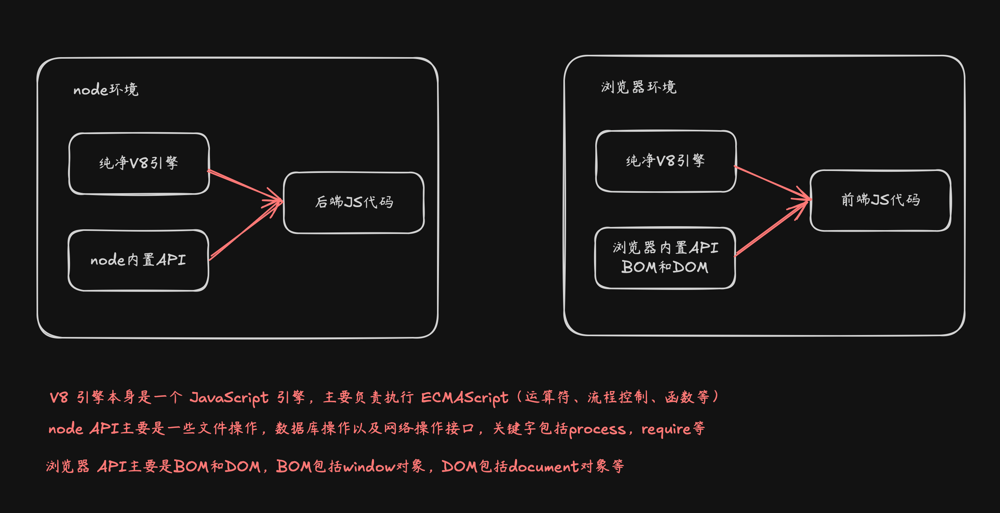

浏览器下：

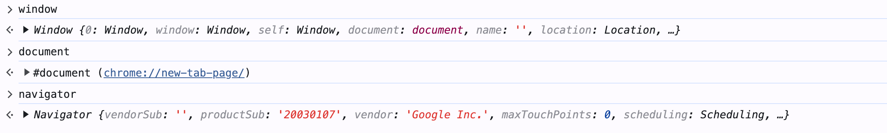

`node.js`下

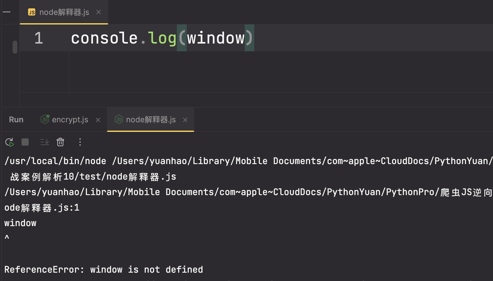

**浏览器环境**： 是指 JS代码在浏览器中的运行时环境，它包括V8自动构建的对象（即ECMAScript的内容,如Date、Array），浏览器（内置）传递给V8的操作DOM和BOM的对象（如document、navigator）；

**Node环境**：是基于V8引擎的Js运行时环境，它包括V8与其自己的内置API，如fs，http，path；

**Node环境** 与 **浏览器环境** 的异同点可以简单概括如图：

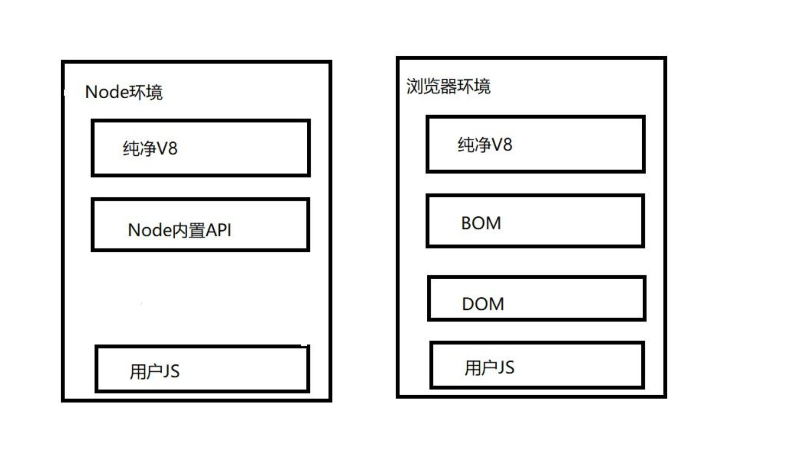

所以我们所说的 **“补浏览器环境**” 其实是补浏览器有 而Node没有的环境，即 补BOM和DOM的对象；

当我们辛苦将浏览器环境的加密或者解密入口找到，把加密或者解密的JS的代码拷贝到本地，由node解释器驱动执行的时候，会因为拷贝的JS代码中包括只能由浏览器调用的API，现在被node执行就会报错，为了解决这个问题，我们需要在拷贝的代码环境中模拟补充需要的前端对象，所以我们就非常有必要掌握浏览器接口对象常用的==八大前端对象==

### 【2】前端8大必备对象

* window:窗口对象，也是最重要的一个对象

  ```css
  addEventListener:f
  setInterval:f
  setTimeout:f
  name
  self
  
  document
  navigator
  location
  screen
  history
  
  toString:f
  ```

  > window是顶级变量，在浏览器中，任何在全局作用域中声明的变量或函数都会成为 window 对象的属性。例如，如果你声明一个全局变量 var yuan = 10;，你可以通过 window.yuan。`window` 仅在浏览器环境中存在。在 Node.js 等其他环境中，顶级对象是 `global`。

* document：文档对象：第二重要对象

  ```css
  body
  documentElement
  cookie
  
  getElementById:f
  getElementByTagName:f
  getElementByClassName:f
  createElement:f
  
  toString:f
  ```

* navigator：导航对象

  ````css
  userAgent
  toString:f
  ````

* location：地址栏对象

  ```css
  href
  toString:f
  ```

* screen：屏幕对象

  ```css
  availHeight
  availLeft
  availTop
  availWidth
  toString:f
  ```

* history:历史对象

  ```css
  back
  forward
  go
  toString:f
  ```

* localStorage和sessionStorage：本地存储对象

  ```css
  getItem:f
  setItem:f
  removeItem:f
  toString:f
  ```

* element：泛指，标签对象

  ```css
  # 常用标签对象
  h1-h6标签
  p标签
  input标签
  div和span标签
  img标签
  table标签
  form标签
  canvas标签：toDataURL：f
  
  # 标签对象常用属性和方法
  ele.style
  ele.innerHtml
  ele.getAttribute()
  ```

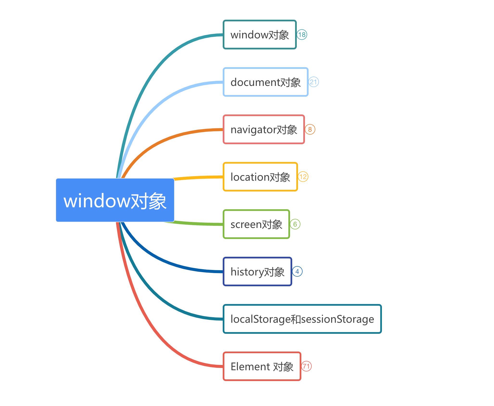

为了更好的让大家理解我们接下来的实战补环境案例，我先给大家模拟了一套简单的JS逆向代码

 ```js
function get_sign() {
    // 黑匣子，省略很多代码
    // (1) BOM和DOM正常的前端动作
    window.addEventListener("test")
    // 搜索框
    let kw = document.getElementById("kw")
    let _class = kw.getAttribute("class")
    // 创建画布
    let canvas = document.createElement("canvas")
    let ctx = canvas.getContext("2d");
    ctx.fillRect(10, 10, 100, 100);

    // (2) 基于DOM和BOM进行环境校验
    if (navigator.toString() === '[object Navigator]') {
        let navLength = navigator.userAgent.length
        return "u82d1660a" + navLength // Yuan老师的微信，想深入学逆向爬虫的联系我，结一段善缘!
        
    } else {
        return false
    }
}

console.log(get_sign())
 ```

在这里，整层的JS加密代码对于我们而言就是一个黑匣子，有千千万万行代码，甚至做了混淆处理，我们不能去一行行读，看看整个过程到底用到了哪些对象以及对应的属性和方法的。所以这里就涉及到了到了补环境最终的一件事情：==代理监控==

### 【3】Proxy代理

JavaScript中的Proxy是一种内置对象，它允许你在访问或操作对象之前拦截和自定义底层操作的行为。通过使用Proxy，你可以修改对象的默认行为，添加额外的逻辑或进行验证，以实现更高级的操作和控制。

Proxy对象包装了另一个对象（目标对象），并允许你定义一个处理程序（handler）来拦截对目标对象的操作。处理程序是一个带有特定方法的对象，这些方法被称为"捕获器"（traps），它们会在执行相应的操作时被调用。

```js
var yuan = {
    username: "yuan",
    age: 22,
    wx: "u82d1660a"
}
yuan = new Proxy(yuan, {
    get(target, p, receiver) {
        console.log(target, "查询了属性", p)
        // return window['username'];/// 这里如果这样写. 有递归风险的...
        // return Reflect.get(...arguments);
        return Reflect.get(target, p);
    },
    set(target, p, value, receiver) {
        console.log(target, "设置了属性", p, "值为：", value)
        Reflect.set(target, p, value);
    }
});

yuan.username;
yuan.age;
yuan.username = "rain"
yuan.age = 18
```

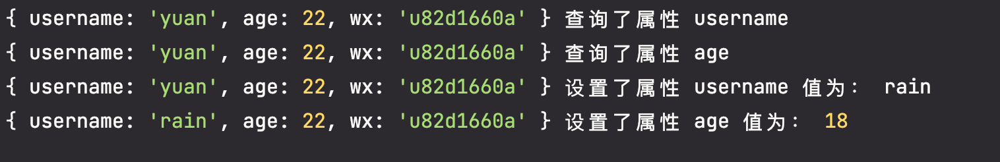

基于Proxy的特性，衍生了基本补环境思路：在本地，用**Proxy**代理监控浏览器所有的BOM、DOM对象，相当于在node.js中，对整个浏览器环境对象进行了代理，拷贝的加密JS代码使用任何==浏览器 api==都能被我们所拦截。然后我们针对拦截到的环境检测点去补对应属性和方法。

因为接下来的补环境中，涉及到需要监控的前端对象还是比较多的 ，如果每一个都按着上面对yuan的Proxy代理，就会导致监控代码大量重复不简洁。所以，在这里，爬虫工程师都需要一个简单的功能函数，对需要监控的数组对象循环监控：

```js
function setProxyArr(proxyObjArr) {
    for (let i = 0; i < proxyObjArr.length; i++) {
        const objName = proxyObjArr[i];
        const handler = {
            get(target, property, receiver) {
                console.log("方法:", "get", "对象:", objName, "属性:", property, "属性类型：", typeof property, "属性值：", target[property], "属性值类型：", typeof target[property]);

                return target[property];
            },
            set(target, property, value, receiver) {
                console.log("方法:", "set", "对象:", objName, "属性:", property, "属性类型：", typeof property, "属性值：", value, "属性值类型：", typeof target[property]);
                return Reflect.set(target, property, value, receiver);
            }
        };
        // 检查并初始化对象
        let targetObject = global[objName] || {};  // 在 Node.js 环境中使用 global
        global[objName] = new Proxy(targetObject, handler);  // 在 Node.js 中使用 global
    }
}
```

接下来，我们就将这段Proxy监控函数注入到刚才我们的案例中：

```js
window = global
window.addEventListener = function () {
}
kw = {
    getAttribute() {
    }
}
ctx = {
    fillRect: function () {
    }
}
canvas = {
    getContext() {
        return ctx
    }
}
document = {
    getElementById(id) {
        console.log("document getElementById by:", id)
        if (id === "kw") {
            return kw
        }
    },
    createElement(ele) {
        console.log("document createElement ", ele)
        return canvas

    }
}
navigator = {
    userAgent: 'Mozilla/5.0 (Macintosh; Intel Mac OS X 10_15_7) AppleWebKit/537.36 (KHTML, like Gecko) Chrome/131.0.0.0 Safari/537.36',
    toString: function () {
        return '[object Navigator]'
    }
}

function setProxyArr(proxyObjArr) {
    for (let i = 0; i < proxyObjArr.length; i++) {
        const objName = proxyObjArr[i];
        const handler = {
            get(target, property, receiver) {
                console.log("方法:", "get", "对象:", objName, "属性:", property, "属性类型：", typeof property, "属性值：", target[property], "属性值类型：", typeof target[property]);

                return target[property];
            },
            set(target, property, value, receiver) {
                console.log("方法:", "set", "对象:", objName, "属性:", property, "属性类型：", typeof property, "属性值：", value, "属性值类型：", typeof target[property]);
                return Reflect.set(target, property, value, receiver);
            }
        };
        // 检查并初始化对象
        let targetObject = global[objName] || {};  // 在 Node.js 环境中使用 global
        global[objName] = new Proxy(targetObject, handler);  // 在 Node.js 中使用 global
    }
}

setProxyArr(["window", "document", "navigator"])

function get_sign() {
    // 黑匣子，省略很多代码
    // (1) BOM和DOM正常的前端动作
    window.addEventListener("test")
    // 搜索框
    let kw = document.getElementById("kw")
    let _class = kw.getAttribute("class")
    // 创建画布
    let canvas = document.createElement("canvas")
    let ctx = canvas.getContext("2d");
    ctx.fillRect(10, 10, 100, 100);

    // (2) 基于DOM和BOM进行环境校验
    if (navigator.toString() === '[object Navigator]') {
        let navLength = navigator.userAgent.length
        return "u82d1660a" + navLength // Yuan老师的微信，想深入学逆向爬虫的联系我，结一段善缘!

    } else {
        return false
    }
}

console.log(get_sign())

```

环境验证的JS代码其实一共有两个思路，思路一是基于当前环境是不是浏览器环境，是的话正常执行。思路二是当前环境是不是node环境，如果不是，则正常执行，扩展案例：

```js
window = global

delete global
delete process
delete Buffer
delete __dirname
delete __filename

window.addEventListener = function () {
}
kw = {
    getAttribute() {
    }
}
ctx = {
    fillRect: function () {
    }
}
canvas = {
    getContext() {
        return ctx
    }
}
document = {
    getElementById(id) {
        console.log("document getElementById by:", id)
        if (id === "kw") {
            return kw
        }
    },
    createElement(ele) {
        console.log("document createElement ", ele)
        return canvas
    }
}
navigator = {
    userAgent: 'Mozilla/5.0 (Macintosh; Intel Mac OS X 10_15_7) AppleWebKit/537.36 (KHTML, like Gecko) Chrome/131.0.0.0 Safari/537.36',
    toString: function () {
        return '[object Navigator]'
    }
}

function setProxyArr(proxyObjArr) {
    for (let i = 0; i < proxyObjArr.length; i++) {
        const objName = proxyObjArr[i];
        const handler = {
            get(target, property, receiver) {
                console.log("方法:", "get", "对象:", objName, "属性:", property, "属性类型：", typeof property, "属性值：", target[property], "属性值类型：", typeof target[property]);

                return target[property];
            },
            set(target, property, value, receiver) {
                console.log("方法:", "set", "对象:", objName, "属性:", property, "属性类型：", typeof property, "属性值：", value, "属性值类型：", typeof target[property]);
                return Reflect.set(target, property, value, receiver);
            }
        };
        // 检查并初始化对象
        // let targetObject = global[objName] || {};  // 在 Node.js 环境中使用 global
        // global[objName] = new Proxy(targetObject, handler);  // 在 Node.js 中使用 global

        let targetObject = window[objName] || {};  // 在 Node.js 环境中使用 global
        window[objName] = new Proxy(targetObject, handler);  // 在 Node.js 中使用 global
    }
}

setProxyArr(["window", "document", "navigator"])

function get_sign() {
    // 黑匣子，省略很多代码
    // (1) BOM和DOM正常的前端动作
    window.addEventListener("test")
    // 搜索框
    let kw = document.getElementById("kw")
    let _class = kw.getAttribute("class")
    // 创建画布
    let canvas = document.createElement("canvas")
    let ctx = canvas.getContext("2d");
    ctx.fillRect(10, 10, 100, 100);
    let navLength = navigator.userAgent.length
    // (2) 基于DOM和BOM进行环境校验
    if (navigator.toString() === '[object Navigator]') {

        // (3) 基于node关键字判断是不是浏览器环境
        const isNode = typeof process !== 'undefined' && typeof global !== 'undefined';
        if (isNode) {
            console.log("当前环境是 Node.js");
            return false
        } else {
            console.log("当前环境不是 Node.js");
            return "u82d1660a".toUpperCase() + navLength // Yuan老师的微信，想深入学逆向爬虫的联系我，结一段善缘!
        }

    } else {
        return false
    }
}

console.log(get_sign())

```

JavaScript中的Proxy是一种内置对象，它允许你在访问或操作对象之前拦截和自定义底层操作的行为。通过使用Proxy，你可以修改对象的默认行为，添加额外的逻辑或进行验证，以实现更高级的操作和控制。

Proxy对象包装了另一个对象（目标对象），并允许你定义一个处理程序（handler）来拦截对目标对象的操作。处理程序是一个带有特定方法的对象，这些方法被称为"捕获器"（traps），它们会在执行相应的操作时被调用。

```js
var yuan = {
    username: "yuan",
    age: 22
}
yuan = new Proxy(yuan, {
    get(target, p, receiver) {
        console.log("target: ", target);
        console.log("p: ", p);
        // return window['username'];/// 这里如果这样写. 有递归风险的...
        // return Reflect.get(...arguments);
        return Reflect.get(target, p);
    },
    set(target, p, value, receiver) {
        console.log("设置操作")
        Reflect.set(target, p, value);
    }
});

console.log(yuan.username);
console.log(yuan.age);
yuan.username = "rain"
yuan.age = 18
console.log(yuan.username);
console.log(yuan.age);
```

基于Proxy的特性，衍生了两种补环境思路： 

> 1. **Proxy**代理浏览器所有的**BOM、DOM对象及其属性**，再配合**node vm2模块**提供的**纯净V8环境**，就相当于在node中，对整个浏览器环境对象进行了代理，JS代码使用任何**浏览器环境** api都能被我们所拦截。然后我们针对拦截到的环境检测点去补。
> 2. 搭建补环境框架，用JS模拟浏览器基于原型链去伪造实现各个BOM、DOM对象，然后将这些JS组织起来，形成一个**纯JS版浏览器环境**，补环境越完善，越接近真实浏览器环境，能通杀的js环境检测就越多。

基于上面的语法，我们构建一套完整的代理补环境的功能函数

```js
function setProxyArr(proxyObjArr) {
    for (let i = 0; i < proxyObjArr.length; i++) {
        const handler = `{
      get: function(target, property, receiver) {
        console.log("方法:", "get  ", "对象:", "${proxyObjArr[i]}", "  属性:", property, "  属性类型：", typeof property, ", 属性值：", target[property], ", 属性值类型：", typeof target[property]);
        return target[property];
      },
      set: function(target, property, value, receiver) {
        console.log("方法:", "set  ", "对象:", "${proxyObjArr[i]}", "  属性:", property, "  属性类型：", typeof property, ", 属性值：", value, ", 属性值类型：", typeof target[property]);
        return Reflect.set(...arguments);
      }
    }`;
        eval(`try {
            ${proxyObjArr[i]};
            ${proxyObjArr[i]} = new Proxy(${proxyObjArr[i]}, ${handler});
        } catch (e) {
            ${proxyObjArr[i]} = {};
            ${proxyObjArr[i]} = new Proxy(${proxyObjArr[i]}, ${handler});
        }`);
    }
}

```

## 3. 瑞数之补环境

### 3.1、瑞数介绍

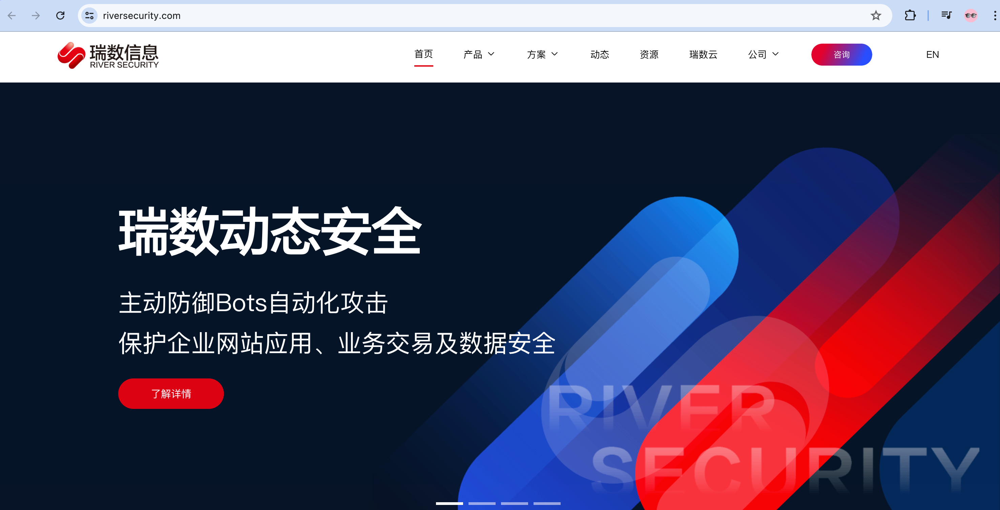

**‌瑞数信息是一家专注于提供互联网动态业务应用安全防护解决方案的公司**

瑞数动态安全 Botgate（[机器人](https://so.csdn.net/so/search?q=机器人&spm=1001.2101.3001.7020)防火墙）以“动态安全”技术为核心，通过动态封装、动态验证、动态混淆、动态令牌等技术对服务器网页底层代码持续动态变换，增加服务器行为的“不可预测性”，实现了从用户端到服务器端的全方位“主动防护”，为各类 Web、HTML5 提供强大的安全保护。

> 瑞数可以理解为是我们进入到JS逆向世界的标志

过瑞数的方法基本上有以下几种

* 自动化工具
* 补环境
* 纯算

### 3.2、瑞数流程

1. rs的网站会请求两次page_url（文档请求），第1次page_url（文档请求）会返回一个cookie1，和一个响应体（HTML源码），以及请求响应码是 202或者 412

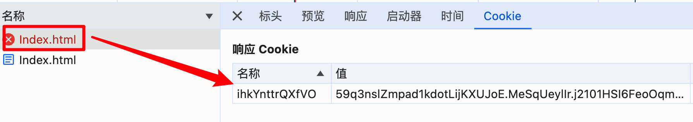

2. 响应体（HTML源码）包括3个部分：

* **一个meta标签**，其content内容很长且是`动态`的（每次请求会变化），会在eval执行第二层JS代码时使用到；
* **一个ts代码**，下面的自执行函数会解密文件内容生成eval执行时需要的JS源码，也就是第二层vm代码；
* **一个大自执行函数**（每次请求首页都会`动态`变化），主要是解密外链JS内容，给window添加一些属性如$_ts，会在vm中使用;
* 这三个要素用于在本地生成一个cookie2，用于第2次请求

3. 第2次page_url（文档请求）携带cookie1和ncookie2，获取真正的页面内容！

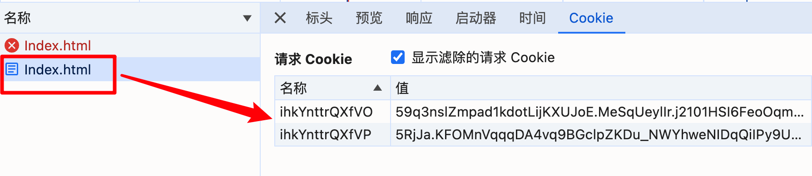

瑞数 3、4 代有以 T 和 S 结尾的两个 Cookie，其中以 S 开头的 Cookie 是第一次的 201 那个请求返回的，以 T 开头的 Cookie 是由 JS 生成的，动态变化的，T 和 S 前面一般会跟 80 或 443 的数字，Cookie 值第一个数字为瑞数的版本。

瑞数 5 代也有以 T 和 S 结尾的两个 Cookie，但有些特殊的 5 代瑞数也有以 O 和 P 结尾的，同样的，以 O 开头的是第一次的 412 那个请求返回的，以 P 开头的是由 JS 生成的，Cookie 值第一个数字同样为瑞数的版本。

### 3.3、瑞数案例解析

#### 【1】入口定位

先定位入口，这里涉及一个VM环境

* “VM”表示的是Virtual Machine（虚拟机），这些文件通常表示**由浏览器生成和执行的虚拟机脚本环境中的临时脚本**。这些脚本并不是项目源代码的一部分，也不是实际存在的物理文件。 它们**在浏览器的内存中创建并执行**。

* 比如说，当你在调试一个网页时，如果在某些动态生成并执行的JS代码上设定了断点，Chrome调试器会在一个以"VM"开头的文件中显示这些代码，例如"VM111.js"。这个"VM"文件的存在只是为了调试目的，它并不存在于服务器端，也不会被存储在本地，而是存在于浏览器内存中。一般情况下，这类文件的出现是因为浏览器对JavaScript代码的处理方式，如动态编译或者JavaScript堆栈跟踪。
* 通过eval函数或者new Function方法，Chrome浏览器会创建一个"VM"文件来展示这段临时执行的代码

通过脚本断点可以断住ts和自执行函数，因为第一次响应的index.html是动态的，所以为了后面调试，我们先试用文件替换本地化。

接下来在index.html中直接使用正则快速定位入口函数：

```apl
# 瑞数5:正则搜索
\S{4} = \S{4}\[\S{4}\[\d{2}\]\]\(\S{4},
# 瑞数6:搜索.call
```

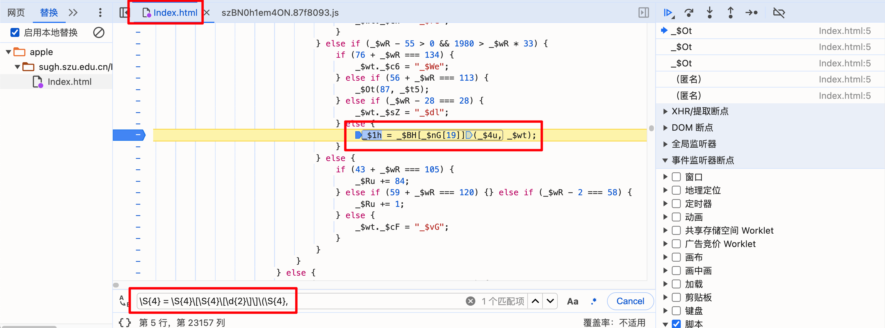

这个位置通常在分析瑞数的时候作为入口，图中 ==_$BH== 实际上是 ==eval== 方法，传入的第一个参数 ==_$4u== 是 ==Window 对象==，第二个对象 ==_$wt== 是我们前面看到的 VM 虚拟机中的 IIFE 自执行代码。

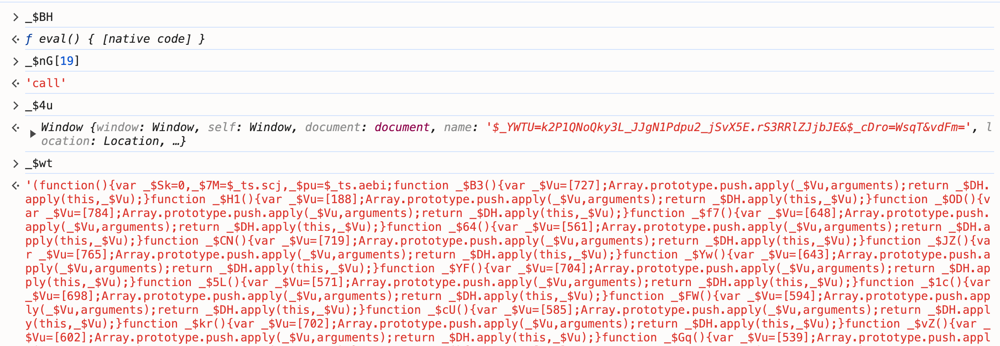

最后在入口位置单步调试，即可进入到VM环境！

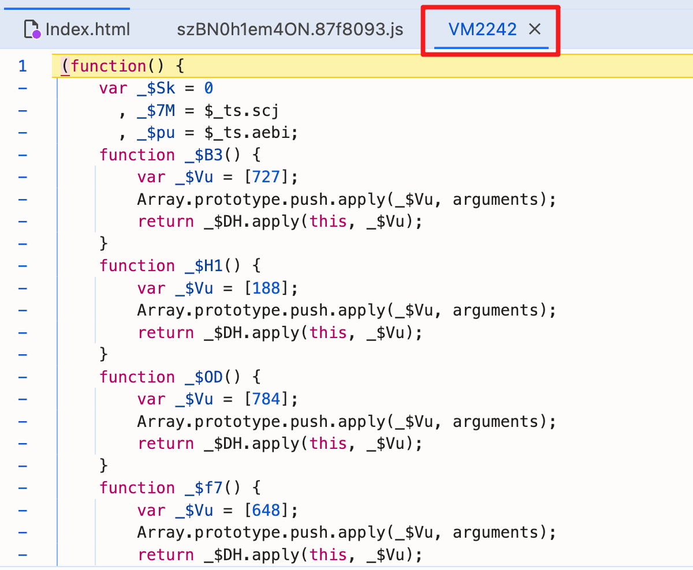

后面的断点调试就在这个环境中。

#### 【2】补环境

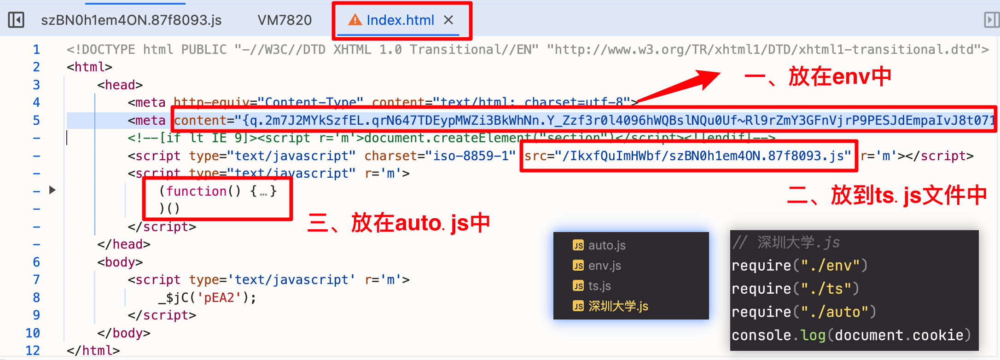

> 注意content的值和auto.js是关联的，必须保持一致！

初始化补环境文件

```js
delete __dirname
delete __filename

top = self = window = global

document = {}
location = {}
navigator = {}
history = {}
screen = {}

function getEnv(proxy_array) {
    for (var i = 0; i < proxy_array.length; i++) {
        handler = `{\n
            get: function(target, property, receiver) {\n
                   console.log('方法：get','    对象：${proxy_array[i]}','    属性：',property,'    属性类型：',typeof property,'    属性值类型：',typeof target[property]);
                   return target[property];
            },
            set: function(target, property, value, receiver){\n
                    console.log('方法：set','    对象：${proxy_array[i]}','    属性：',property,'    属性类型：',typeof property,'    属性值类型：',typeof target[property]);
                    return Reflect.set(...arguments);
            }
        }`
        eval(`
            try {
                ${proxy_array[i]};
                ${proxy_array[i]} = new Proxy(${proxy_array[i]}, ${handler});
            } catch (e) {
                ${proxy_array[i]} = {};
                ${proxy_array[i]} = new Proxy(${proxy_array[i]}, ${handler});
            }
        `)
    }
}

proxy_array = ['window', 'document', 'location', 'navigator', 'history', 'screen']
getEnv(proxy_array)

```

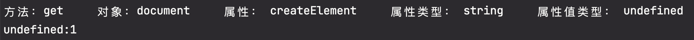

接下来就是按之前教给大家的监控器补环境。

## 4. Web自动化-DrissionPage

### 4.1、DP初识

在当今互联网高速发展的时代，网页数据的获取和处理变得愈发重要。传统的自动化工具如 Selenium 在某些方面逐渐显露出一些局限性，而 DrissionPage 正是在这样的背景下崭露头角。
DrissionPage 的发展历程充满了创新与突破。它最初的设计理念是将浏览器自动化和数据包操控相结合，以解决传统工具在面对复杂网页交互和反爬机制时的不足。从早期的版本开始，DrissionPage 就致力于为开发者提供一种更高效、更便捷的网页自动化解决方案。
在发展过程中，DrissionPage 不断优化和改进自身的功能。它摆脱了对 Selenium 的依赖，从 3.0 版本开始，作者另起炉灶，用 chromium 协议自行实现了类似 Selenium 的全部功能，并且在此基础上增加了许多独特的特性。例如，无 webdriver 特征使得它更难被网站识别，减少了被阻止或限制访问的风险。
同时，DrissionPage 还在易用性方面下足了功夫。与其他需要针对不同浏览器版本下载对应驱动的工具不同，它简化了配置过程，使得设置和使用变得更加简单快捷。官方文档详细介绍了安装、配置以及使用方法，为开发者提供了丰富的学习资源。
随着技术的不断进步，DrissionPage 的功能也在不断拓展。它不仅可以用于自动化测试，还在爬虫开发等领域展现出强大的潜力。无论是处理复杂的表单交互，还是绕过前端的一些限制，DrissionPage 都能发挥出重要作用。
总之，DrissionPage 以其独特的设计理念和不断创新的精神，在自动化爬虫领域逐渐崛起，为开发者带来了全新的体验和更多的可能性。

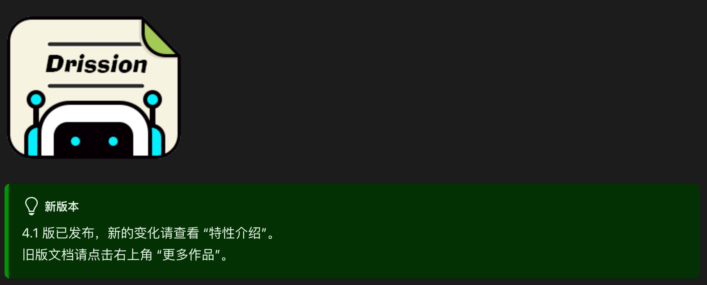

为什么叫DrissionPag？Selenium框架用于操作浏览器的对象叫 Driver，requests 用于管理请求连接的对象叫 Session，因此Drission 就是它们两者的合体。在旧版本中，是通过对 selenium 和 requests 的重新封装实现的。因此 Drission 读作 “拽神”。但从 3.0 版开始，作者另起炉灶，用 chromium 协议自行实现了 selenium 全部功能，从而摆脱了对 selenium 的依赖，功能更多更强，运行效率更高，开发更灵活。

本库采用全自研的内核，内置了 N 多实用功能，对常用功能作了整合和优化，对比 selenium，有以下优点：

- 无 webdriver 特征
- 无需为不同版本的浏览器下载不同的驱动
- 运行速度更快
- 可以跨 iframe 查找元素，无需切入切出
- 把 iframe 看作普通元素，获取后可直接在其中查找元素，逻辑更清晰
- 可以同时操作浏览器中的多个标签页，即使标签页为非激活状态，无需切换
- 可以直接读取浏览器缓存来保存图片，无需用 GUI 点击另存
- 可以对整个网页截图，包括视口外的部分（90以上版本浏览器支持）
- 可处理非`open`状态的 shadow-root

除了以上优点，本库还内置了无数人性化设计。

- 极简的语法规则，集成大量常用功能，代码更优雅；
- 定位元素更加容易，功能更强大稳定；
- 无处不在的等待和自动重试功能。使不稳定的网络变得易于控制，程序更稳定，编写更省心；
- 提供强大的下载工具。操作浏览器时也能享受快捷可靠的下载功能；
- 允许反复使用已经打开的浏览器。无需每次运行从头启动浏览器，调试超方便；
- 使用 ini 文件保存常用配置，自动调用，提供便捷的设置，远离繁杂的配置项；
- 内置 lxml 作为解析引擎，解析速度成几个数量级提升；
- 使用 POM 模式封装，可直接用于测试，便于扩展；

首先，你需要安装 `drissionpage`。可以通过以下命令进行安装：

```python
pip install drissionpage
```

官网：`https://drissionpage.cn/`

```apl
# 安装及导入
pip install DrissionPage -i https://pypi.org/simple

from DrissionPage import ChromiumPage
from DrissionPage import SessionPage as Session
from DrissionPage import WebPage

# 工具讲解
- ChromiumPage 
    - 类似 selenium的 driver.Chrome(...) 会打开一个浏览器窗口
    - 只能进行GET请求
- SessionPage 
    - 使用起来类似 requests模块的 session,但比session更强大
    - 为了方便我直接取了别名
    - GET/POST 都可以满足以及代理
- WebPage
    - 集成了 ChromiumPage 和 SessionPage,还可以在两者之间自由切换,非常强大
```

我们以ChromiumPage为主，网站以百度一下为案例([https://www.baidu.com/](https://link.zhihu.com/?target=https%3A//www.baidu.com/))

```python
# 案例1
from DrissionPage import ChromiumPage, ChromiumOptions

co = ChromiumOptions()
co.headless(False)
# 1、设置无头模式：co.headless(True)
# 2、设置无痕模式：co.incognito(True)
# 3、设置访客模式：co.set_argument('--guest')
# 4、设置请求头user-agent：co.set_user_agent()
# 5、设置指定端口号：co.set_local_port(7890)
# 6、设置代理：co.set_proxy('http://localhost:2222')
page = ChromiumPage(co)
url = "https://www.baidu.com"
page.get(url)
page.wait.load_start()  # 等待页面加载完成
page.ele("css:#kw").input("美女")
page.ele("css:#su").click()

print(page.html)

# 案例2
from DrissionPage import ChromiumPage

cp = ChromiumPage()
cp.get('https://www.baidu.com/')
cp.ele("#kw").input("IP地址")  # 定位到搜索框并填充数据
cp.wait.load_start()  # 等待页面加载完成
cp.ele("#su").click()  # 找到搜索按钮并点击搜索

cp.listen.start('qifu-api.baidubce.com/ip/local/geo/v1/district')
res = cp.listen.wait()  # 等待并获取一个数据包
print(res.url)  # 输出数据包url
print(res.response.headers)  # 输出响应头
print(res.response.statusText)  # 输出响应状态码
print(res.response.body)  # 输出响应内容
```

### 4.2、重点语法

#### 【1】get方法

该方法用于跳转到一个网址。当连接失败时，程序会进行重试：

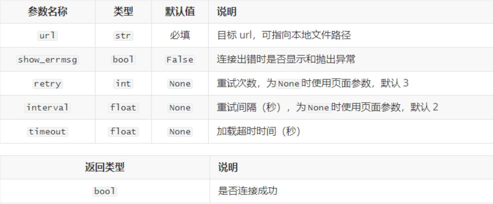

#### 【2】元素查找

```python
# 根据属性查找，@ 后面可跟任意属性
page.ele('@id:ele_id', timeout=2)  # 查找 id 为 ele_id 的元素，设置等待时间2秒  
page.eles('@class')  # 查找所有拥有 class 属性的元素
page.eles('@class:class_name')  # 查找所有 class 含有 ele_class 的元素 
page.eles('@class=class_name')  # 查找所有 class 等于 ele_class 的元素 
 
# 根据 class 或 id 查找
page.ele('#ele_id')  # 等价于 page.ele('@id=ele_id')
page.ele('#:ele_id')  # 等价于 page.ele('@id:ele_id')
page.ele('.ele_class')  # 等价于 page.ele('@class=ele_class')
page.ele('.:ele_class')  # 等价于 page.ele('@class:ele_class')
 
# 根据 tag name 查找
page.ele('tag:li')  # 查找第一个 li 元素  
page.eles('tag:li')  # 查找所有 li 元素  
 
# 根据 tag name 及属性查找
page.ele('tag:div@class=div_class')  # 查找 class 为 div_class 的 div 元素
page.ele('tag:div@class:ele_class') # 查找 class 含有 ele_class 的 div 元素
page.ele('tag:div@class=ele_class') # 查找 class 等于 ele_class 的 div 元素
page.ele('tag:div@text():search_text') # 查找文本含有 search_text 的 div 元素
page.ele('tag:div@text()=search_text') # 查找文本等于 search_text 的 div 元素
 
# 根据文本内容查找
page.ele('search text')  # 查找包含传入文本的元素  
page.eles('text:search text')  # 如文本以 @、tag:、css:、xpath:、text: 开头，则应在前加上 text: 避免冲突  
page.eles('text=search text')  # 文本等于 search_text 的元素
 
# 根据 xpath 或 css selector 查找
page.eles('xpath://div[@class="ele_class"]')  
page.eles('css:div.ele_class')  
 
 
# 查找下级元素
element = page.ele('@id:ele_id')
element.ele('@class:class_name')  # 在 element 下级查找第一个 class 为 ele_class 的元素
element.eles('tag:li')  # 在 ele_id 下级查找所有li元素
 
# 根据位置查找
element.parent  # 父元素  
element.next  # 下一个兄弟元素  
element.prev  # 上一个兄弟元素  
 
# 获取 shadow-root，把它作为元素对待。只支持 open 的 shadow-root
ele1 = element.shadow_root.ele('tag:div')
 
# 串连查找
page.ele('@id:ele_id').ele('tag:div').next.ele('some text').eles('tag:a')
 
# 简化写法
eles = page('@id:ele_id')('tag:div').next('some text').eles('tag:a')
ele2 = ele1('tag:li').next('some text')

```

简化写法对应列表

| 原写法    | 简化写法 | 说明                                                    |
| --------- | -------- | ------------------------------------------------------- |
| `@id`     | `#`      | 表示 id 属性，简化写法只在语句最前面且单独使用时生效    |
| `@class`  | `.`      | 表示 class 属性，简化写法只在语句最前面且单独使用时生效 |
| `text`    | `tx`     | 按文本匹配                                              |
| `@text()` | `@tx()`  | 按文本查找与 @ 或 @@ 配合使用时                         |
| `tag`     | `t`      | 按标签类型匹配                                          |
| `xpath`   | `x`      | 用 xpath 方式查找元素                                   |
| `css`     | `c`      | 用 css selector 方式查找元素                            |

#### 【3】元素操作

```python
element.click(by_js)  # 点击元素，可选择是否用 js 方式点击
element.input(value)  # 输入文本
element.run_script(js)  # 对元素运行 JavaScript 脚本
element.submit()  # 提交
element.clear()  # 清空元素
element.screenshot(path, filename)  # 对元素截图
element.select(text)  # 根据文本选择下拉列表
element.set_attr(attr, value)  # 设置元素属性值
element.remove_attr(attr)  # 删除属性
element.drag(x, y, speed, shake)  # 拖动元素相对距离，可设置速度和是否随机抖动
element.drag_to(ele_or_loc, speed, shake)  # 拖动元素到另一个元素或某个坐标，可设置速度和是否随机抖动
element.hover()  # 在元素上悬停鼠标

```

#### 【4】元素属性和方法

```python
element.html  # 返回元素 outerHTML
element.inner_html  # 返回元素 innerHTML
element.tag  # 返回元素 tag name
element.text  # 返回元素 innerText 值
element.comments  # 返回元素内注释列表
element.link  # 返回元素 href 或 src 绝对 url
element.texts()  # 返回元素内所有直接子节点的文本，包括元素和文本节点，可指定只返回文本节点
element.attrs  # 返回元素所有属性的字典
element.attr(attr)  # 返回元素指定属性的值
element.css_path  # 返回元素绝对 css 路径
element.xpath  # 返回元素绝对 xpath 路径
element.parent  # 返回元素父元素
element.next  # 返回元素后一个兄弟元素
element.prev  # 返回元素前一个兄弟元素
element.parent()  # 返回第 1 级父元素
element.parents(num)  # 返回第 num 级父元素
element.nexts(num, mode)  # 返回后面第几个元素或节点
element.prevs(num, mode)  # 返回前面第几个元素或节点
element.ele(loc_or_str, timeout)  # 返回当前元素下级第一个符合条件的子元素、属性或节点文本
element.eles(loc_or_str, timeout)  # 返回当前元素下级所有符合条件的子元素、属性或节点文本

```

案例：

```python
from DrissionPage import ChromiumPage, ChromiumOptions
from loguru import logger
import platform

if platform.system().lower() == 'windows':
    co = ChromiumOptions().set_paths(browser_path=r"C:\Program Files (x86)\Microsoft\Edge\Application\msedge.exe")
else:
    co = ChromiumOptions()  # .set_paths(browser_path=r"/opt/google/chrome/google-chrome")
    co.set_local_port(9211)
    co.set_user_agent(
        user_agent='Mozilla/5.0 (Windows NT 10.0; Win64; x64) AppleWebKit/537.36 (KHTML, like Gecko) Chrome/123.0.0.0 Safari/537.36')  # 设置ua
    co.headless(True)  # 设置无头加载  无头模式是一种在浏览器没有界面的情况下运行的模式，它可以提高浏览器的性能和加载速度
    co.incognito(True)  # 无痕隐身模式打开的话，不会记住你的网站账号密码的
    co.set_argument('--guest')  # 设置访客模式，不会记住你的网站账号密码的等cookie
    co.set_argument(
        '--no-sandbox')  # 禁用沙箱 禁用沙箱可以避免浏览器在加载页面时进行安全检查,从而提高加载速度 默认情况下，所有Chrome 用户都启用了隐私沙盒选项  https://zhuanlan.zhihu.com/p/475639754
    co.set_argument("--disable-gpu")  # 禁用GPU加速可以避免浏览器在加载页面时使用过多的计算资源，从而提高加载速度

# 创建浏览器对象
cp = ChromiumPage(co)  # 创建对象
cp.get("https://www.itjuzi.com/ipo", retry=3, interval=2, timeout=15)  # 访问网

detail_links_all = []
for tr in cp.eles("css:.el-table__row"):
    tds = [td.text.strip() for td in tr.eles("x:.//td")[1:]]
    company = tr.ele("tag:a").text
    a_href = tr.ele("tag:a").attr("href")
    detail_links_all.append(a_href)
    logger.info(f"list_page_company is {company} , a_href is {a_href}")
logger.success(f">>>>>total_detail_urls is : {len(detail_links_all)}")
cp.quit()

```

### 4.3、案例解析

#### 【1】招聘平台

```python
import time

from DrissionPage import ChromiumPage, ChromiumOptions
import pandas as pd

page = ChromiumPage()
page.listen.start('/wapi/zpgeek/search/joblist.json')
page.get('https://www.zhipin.com/web/geek/job?query=python&city=101010100')

res = page.listen.wait()
print("res:::",res.response.body)
joblist = res.response.body['zpData']['jobList']
for i in range(10):
    time.sleep(1)
    btn = page.ele('.ui-icon-arrow-right')
    btn_a = btn.parent().attr('class')

    if btn_a != 'disabled':
        btn.click()
        res = page.listen.wait()
        joblist += res.response.body['zpData']['jobList']
        print(joblist)
    else:
        print('爬虫结束！')
        break
# 写入到excel中
df = pd.DataFrame(joblist)
df.to_excel('boss直聘.xlsx', index=False)
page.quit()
```

#### 【2】瑞数案例：SZU

```python
import time

from DrissionPage import WebPage, ChromiumOptions

page = WebPage()
url = "https://sugh.szu.edu.cn/Html/News/Columns/7/Index.html"

page.get(url, retry=3, interval=2, timeout=15)


def show(page):
    els = page.eles('x: //*[@id="zoom"]/li')
    for ele in els:
        # print(ele)
        href = ele.ele("x: ./a").attr("href")
        title = ele.ele("x: ./a").text
        if not title:
            title = ele.ele("x: ./a[2]").text
        print(href, title)


# 展示第一页
show(page)

for i in range(5):
    time.sleep(1)
    btn = page.ele('x: //*[@class="pagination_nextpage ui-state-default ui-corner-all"]')
    print("btn:::", btn)
    btn.click()
    show(page)

```

#### 【3】瑞数案例之YJJ：

```python
from DrissionPage import ChromiumPage

cp = ChromiumPage()
cp.listen.start("/datasearch/data/nmpadata/search")
cp.get("https://www.nmpa.gov.cn/datasearch/home-index.html#category=yp")

cp.eles('tag:input@class=el-input__inner')[1].input("布洛芬")
cp.ele('x=//*[@id="home"]/main/div[1]/div[7]/div/div[2]/div/button').click()

cp.wait.load_start()
cp.get("https://www.nmpa.gov.cn/datasearch/search-result.html")

for i in range(100):
    res = cp.listen.wait()
    data = res.response.body
    print(data)
    cp.ele(".btn-next").click()

```

#### 【4】淘宝案例

```python
import re
import time

from DrissionPage import ChromiumPage
from user import user, pwd
import json

cp = ChromiumPage()

# cp.get("https://login.taobao.com/member/login.jhtml")
# time.sleep(2)
# cp.ele("css:#fm-login-id").input(user)
# time.sleep(2)
# cp.ele("css:#fm-login-password").input(pwd)
# time.sleep(2)
# cp.ele("css:.fm-button.fm-submit.password-login").click()

cp.listen.start('h5/mtop.relationrecommend.wirelessrecommend.recommend/2.0')

cp.get("https://taobao.com/")
res = cp.listen.wait()
body = res.response.body
print("body:::", body)
cp.ele('css:#q').input("iphone 16 pro max")
cp.ele('css:.btn-search.tb-bg').click()

while 1:
    print("接收响应")
    try:
        res = cp.listen.wait()
        body = res.response.body

        if body.find("itemsArray") != -1:
            # print(body)
            ret = re.findall("mtopjsonp\d+\((.*)\)", body)[0]
            # print("ret:::",ret)
            data = json.loads(ret)
            itemsArray = data.get("data").get("itemsArray")
            print("len:::", len(itemsArray))
            for i in itemsArray:
                title = i.get("title")
                priceWap = i.get("priceWap")
                print(title, priceWap)

            break

        time.sleep(1)
    except Exception as e:
        pass

```

