# 三十四、高级逆向

# 第一章. 爬虫初识【1】

## 1.1、web开发核心

### 【1】http协议

````text
1. 什么是请求头请求体，响应头响应体
2. URL地址包括什么
3. get请求和post请求到底是什么
4. Content-Type是什么
````

#### （1）简介

HTTP协议是Hyper Text Transfer Protocol（超文本传输协议）的缩写,是用于万维网（WWW:World Wide Web ）服务器与本地浏览器之间传输超文本的传送协议。HTTP是一个属于应用层的面向对象的协议，由于其简捷、快速的方式，适用于分布式超媒体信息系统。它于1990年提出，经过几年的使用与发展，得到不断地完善和扩展。HTTP协议工作于客户端-服务端架构为上。浏览器作为HTTP客户端通过URL向HTTP服务端即WEB服务器发送所有请求。Web服务器根据接收到的请求后，向客户端发送响应信息。

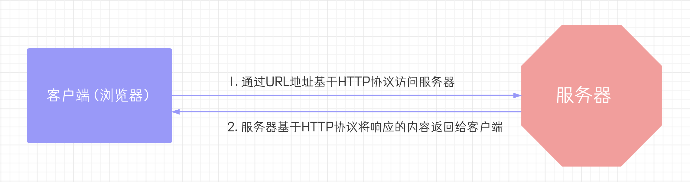

#### （2）http协议特性

 ```htaccess
# (1) 基于TCP/IP协议

http协议是基于TCP/IP协议之上的应用层协议。

# (2) 基于请求－响应模式

HTTP协议规定,请求从客户端发出,最后服务器端响应该请求并返回。换句话说,肯定是先从客户端开始建立通信的,服务器端在没有接收到请求之前不会发送响应

# (3) 无状态保存

HTTP是一种不保存状态,即无状态(stateless)协议。HTTP协议自身不对请求和响应之间的通信状态进行保存。也就是说在HTTP这个级别,协议对于发送过的请求或响应都不做持久化处理。

使用HTTP协议,每当有新的请求发送时,就会有对应的新响应产生。协议本身并不保留之前一切的请求或响应报文的信息。这是为了更快地处理大量事务,确保协议的可伸缩性,而特意把HTTP协议设计成如此简单的。

# (4) 短连接和长连接

HTTP1.0默认使用的是短连接。浏览器和服务器每进行一次HTTP操作，就建立一次连接，任务结束就中断连接。
HTTP/1.1起，默认使用长连接。要使用长连接，客户端和服务器的HTTP首部的Connection都要设置为keep-alive，才能支持长连接。
HTTP长连接，指的是复用TCP连接。多个HTTP请求可以复用同一个TCP连接，这就节省了TCP连接建立和断开的消耗。
 ```

#### （3）http请求协议与响应协议

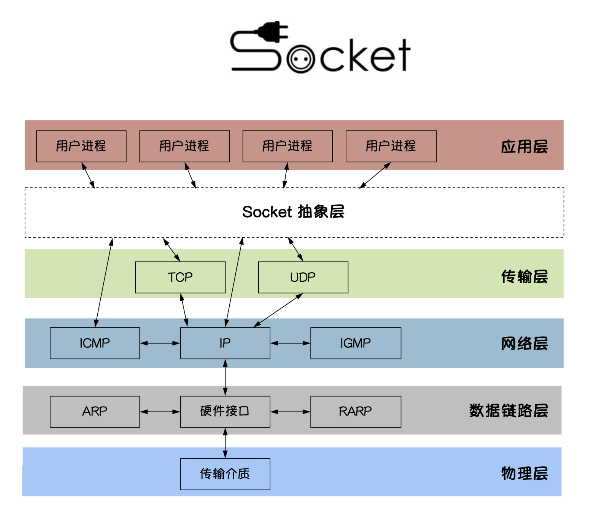

http协议包含由浏览器发送数据到服务器需要遵循的请求协议与服务器发送数据到浏览器需要遵循的请求协议。用于HTTP协议交互的信被为HTTP报文。请求端(客户端)的HTTP报文 做请求报文,响应端(服务器端)的 做响应报文。HTTP报文本身是由多行数据构成的字文本。

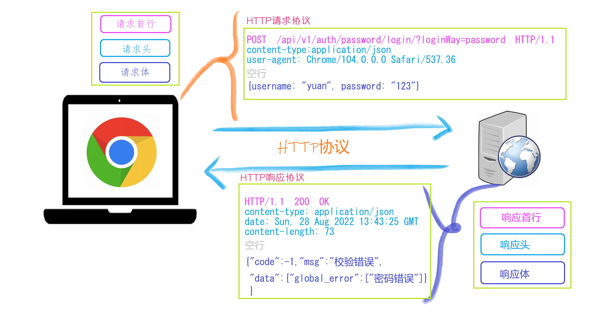

> 一个完整的URL包括：协议、ip、端口、路径、参数  
>
> 例如： https://www.baidu.com/s?wd=yuan     其中https是协议，www.baidu.com 是IP，端口默认80，/s是路径，参数是wd=yuan
>
> 请求方式: get与post请求
>
> - GET提交的数据会放在URL之后，以?分割URL和传输数据，参数之间以&相连，如EditBook?name=test1&id=123456. POST方法是把提交的数据放在HTTP包的请求体中.
> - GET提交的数据大小有限制（因为浏览器对URL的长度有限制），而POST方法提交的数据没有限制
>
> 响应状态码：状态码的职 是当客户端向服务器端发送请求时, 返回的请求 结果。借助状态码,用户可以知道服务器端是正常 理了请求,还是出 现了 。状态码如200 OK,以3位数字和原因组成。

### 【2】最简单的web应用程序

```golang
import socket

sock = socket.socket()
sock.bind(("127.0.0.1", 7777))
sock.listen(3)

print("京东服务器已经启动...")
while 1:
    conn, addr = sock.accept()
    data = conn.recv(1024)
    print("data:", data)
    conn.send(
        b"HTTP/1.1 200 ok\r\ncontent-type:text/plain\r\n\r\n<h1>alex black girl!</h1>")
    conn.close()

```

> 基于postman完成测试！

### 【3】基于flask搭建web网站

```python
from flask import Flask, render_template

app = Flask(__name__, template_folder="templates")


@app.get("/index")
def index():
    return render_template("index.html")


@app.get("/timer")
def timer():
    import datetime

    now = datetime.datetime.now().strftime("%Y-%m-%d %X")
    return render_template("timer.html", **{
        "now": nowa
    })


app.run()

```

### 【4】浏览器开发者工具（重点）

**（1）Elements**

**（2）Network**

**（3）Application**

# 第二章. 前端基础【3】

## 2.1 、HTML

了解了web相关基本概念以后，我们开始正式接触网页开发，网页开发的基础是HTML，所以，本章内容主要分两部分，一是介绍HTML的相关概念、发展历史，二是 创建HTML网页文档和认识HTML的基本结构。我们学会如何新建一个 HTML 页面和熟记HTML文档的基本结构和主要标签。

### 2.1.1、 HTML概述

* HTML，即超文本标记语言（HyperText Markup Language ]），由SGML (标准通用标记语言) 发展而来，也叫web页面。扩展名是 .html 或是 .htm 。

* HTML，是一种用来制作网页的标准标记语言。超文本，指的就是超出普通文本范畴的文档，可以包含文本、图片、视频、音频、链接等元素。

* HTML 不是一种编程语言，而是一种写给网页浏览器、具有描述性的标记语言。

自1990年以来HTML就一直被用作WWW（World Wide Web的缩写，也可简写WEB，中文叫做万维网）的信息表示语言，使用HTML语言描述的文件，需要通过网页浏览器显示出效果。用户在访问网页时，是把服务器的HTML文档**下载** 到本地客户设备中，然后通过本地客户设备的浏览器将文档按顺序解释渲染成对应的网页效果。

网页本身是一种文本文件，通过在文本文件中添加各种各样的标记标签，可以告诉[浏览器](http://baike.baidu.com/view/7718.htm)如何显示标记中的代表的内容，如：HTML中有的标签可以告诉浏览器要把字体放大，就像word一样，也有的标签可以告诉浏览器显示指定的图片，还有的标签可以告诉浏览器把内容居中或者倾斜等等。

每一个HTML标签代表的意义都不一样。同样，他们在浏览器中表现出来的外观也是不一样的。

### 2.1.2、 HTML结构和标签格式

```html
<!DOCTYPE html>
<html lang="en">
<head>
    <meta charset="UTF-8">
    <title>Title</title>
</head>
<body>

</body>
</html>

```

> 1、`<!DOCTYPE html>` 告诉浏览器使用什么样的`html`或者`xhtml`来解析`html`文档
>
> 2、`<html></html>`是文档的开始标记和结束标记。此元素告诉浏览器其自身是一个 `HTML `文档，在它们之间是文档的头部`<head>`和主体`<body>`。	
>
> 3、<head></head>元素出现在文档的开头部分。<head>与</head>之间的内容不会在浏览器的文档窗口显示，但是其间的元素有特殊重要的意义。
>
> 4、`<title></title>`定义网页标题，在浏览器标题栏显示。
>
> 5、`<meta charset="UTF-8"> `  声明编码方式用utf8
>
> 6、`<body></body>`之间的文本是可见的网页主体内容

### 2.1.3、标签的语法

```html
<标签名 属性1=“属性值1” 属性2=“属性值2”……>内容部分</标签名>
<标签名 属性1=“属性值1” 属性2=“属性值2”…… />
```

> 1、HTML标签是由尖括号包围的特定关键词
>
> 2、标签分为闭合和自闭合两种标签
>
> 3、HTML不区分大小写
>
> 4、标签可以有若干个属性,也可以不带属性,比如<head>就不带任何属性
>
> 5、标签可以嵌套,但是不可以交叉嵌套

XHTML是实现 HTML 到 XML的 过渡。

### 2.1.4、基本标签

#### （1）标题标签

```html
<h1>标题1</h1>
<h2>标题2</h2>
<h3>标题3</h3>
<h4>标题4</h4>
<h5>标题5</h5>
<h6>标题6</h6>
```

#### （2）换行标签

```html
悟道休言天命，<br>
修行勿取真经。<br>
一悲一喜一枯荣，<br>
哪个前生注定？
```

#### （3）段落标签

````html
<p>菩提本无树，</p>
<p>明镜亦非台。</p>
<p>本来无一物，</p>
<p>何处惹尘埃。</p>
````

#### （4）文本格式化标签

HTML提供了一系列的用于格式化文本的标签，可以让我们输出不同外观的元素，比如粗体和斜体字。如果需要在网页中，需要让某些文本内容展示的效果丰富点，可以使用以下的标签来进行格式化。

```html
<b>定义粗体文本</b><br />
<strong>定义粗体文本方式2</strong><br />
<em>定义斜体字</em><br />
<i>定义斜体字方式2</i><br />
<del>定义删除文本</del><br />
```

#### （5）特殊符号

```html
&reg; &nbsp; &copy;
```

> 标签大致可分为两类
>
> *  块级标签(block)  -- 独占一行 
> *  内联标签(inline)  -- 按文本内容占位

#### (6）div和span标签

````html
<div>只是一个块级元素，并无实际的意义。主要通过CSS样式为其赋予不同的表现.
<span>表示了内联行(行内元素),并无实际的意义,主要通过CSS样式为其赋予不同的表现
````


块级元素与行内元素的区别所谓块元素，是以另起一行开始渲染的元素，行内元素则不需另起一行。如果单独在网页中插入这两个元素，不会对页面产生任何的影响。这两个元素是专门为定义CSS样式而生的。

### 2.1.5、超链接标签

#### 超链接基本使用

超链接是浏览者和服务器的交互的主要手段，也叫超级链接或a链接，是网页中指向一个目标的连接关系，这个目标可以是网页、网页中的具体位置、图片、邮件地址、文件、应用程序等。

超链接是网页中最重要的元素之一。一个网站的各个网页就是通过超链接关联起来的，用户通过点击超链接可以从一个网页跳转到另一个网页。

几乎可以在所有的网页中找到链接。点击链接可以从一张页面跳转到另一张页面。例如,在阅读某个网站时，遇到一个不认识的英文，你只要在这个单词上单击一下，即可跳转到它的翻译页面中，看完单词的解释后点一下返回按钮，又可继续阅读，这就是超链接的常见用途。还有经常到购物网站中去，我们都是在百度搜索，然后点击对应的搜索项进入到对应的购物网站的，这也是超链接的作用。超链接的属性：

| 属性   | 值                                                           | 描述                                                         |
| ------ | ------------------------------------------------------------ | ------------------------------------------------------------ |
| href   | 网络链接 [ 例如: http://www.baidu.com ]     本地链接 [ 例如：F:\html\index.html ] | 规定链接的跳转目标                                           |
| title  | <a href="http://www.baidu.com" title="国内最著名的搜索引擎网站">百度</a> | 链接的提示信息                                               |
| target | _blank [ 在新建窗口中打开网页 ]                                                                                       _self  [ 默认值，覆盖自身窗口打开网页 ]                                                                                  _parent [ 在父级框架中打开网页 ]                                                                                                           _top  [ 在顶级框架中打开网页 ] framename [  在指定的框架中打开网页] | 与前面四项固定值不同，framename是泛指，并不是这个值，这点将在后面框架部分内容中详细介绍，这里可以暂时先略过 |

> 1、href是超链接最重要的属性，规定了用户点击链接以后的跳转目标，这个目标可以是 网络连接，也可以是本地连接。
>
> 2、网络链接指的是依靠网络来进行关联的地址，一般在地址前面是以 http://或者https://这样开头的，如果没有网络，则用户点击了超链接也无法访问对应的目标。
>
> 3、本地链接跳转指的是本地计算机的地址，一般在地址前面是以 file:///开头或直接以 C:/、D:/、E:/开头的，不需要经过网络。
>
> 4、如果href的值留空，则默认是跳转到当前页面，也就是刷新当前页面。

#### 锚点应用

锚点( anchor )是超链接的一种应用，也叫命名锚记，锚点可以像一个定位器一样，可以实现页面内的链接跳转，运用相当普遍。例如，我们有一个网页，由于内容太多，导致页面很长，而且里面的内容，可以分为N个部分。这样的话，我们就可以在网页的顶部设置一些锚点，这样便可以方便浏览者点击相应的锚点，到达本页内相应的位置，而不必在一个很长的网页里自行寻找。又例如，我们页面中，有个链接需要跳转到另一个页面的中间或者脚部去，这时候也可以运用上锚点技术来解决这个问题。

```html
<!DOCTYPE HTML>
<html lang="en-US">
  <head>
    <title>锚点的使用</title>
  </head>
  <body>
  <a href="#i1">第一章</a>
  <a href="#i2">第二章</a>
  <a href="#i3">第三章</a>

   <div id="i1">
      <p>第一章内容</p>
  </div>
   <div id="i2">
      <p>第二章内容</p>
  </div>
  <div id="i3">
     <p> 第三章内容</p>
  </div>
  </body>
</html>
```

### 2.1.6、img标签

在HTML中，图像由标签定义的，它可以用来加载图片到html网页中显示。网页开发过程中，有三种图片格式被广泛应用到web里，分别是 jpg、png、gif。

img标签的属性：

```go
/*
src属性：
    指定图像的URL地址，是英文source的简写，表示引入资源。
    src的值可以是本地计算机存储的图片的地址，也可以是网络上外部网站的图片的地址。
    如果src的值不正确，那么浏览器就无法正确的图片，而是显示一张裂图。

alt属性：指定图像无法显示时的替换文本。当图像显示错误时，在图像位置上显示alt的值。如上所示，就是谷歌浏览器中，引入图像失败后，显示了替换文本。alt属性一般	作为SEO优化的手段之一，所以，使用了img标签就需要加上alt属性。
width属性： 指定引入图片的显示宽度。
height属性：指定引入图片的显示高度。
border属性：指定引入图片的边框宽度，默认为0。
title属性：悬浮图片上的提示文字
*/
```

点击图片跳转可以配合a标签使用

```html
<a></a>
```

### 2.1.7、列表标签

```html
  <ul type="square">
      <li>item1</li>
      <li>item2</li>
      <li>item3</li>
  </ul>

  <ol start="100">
      <li>item1</li>
      <li>item2</li>
      <li>item3</li>
  </ol>
```

### 2.1.8、表格标签

在HTML中使用table来定义表格。网页的表格和办公软件里面的xls一样，都是有行有列的。HTML使用tr标签定义行，使用td标签定义列。

语法：

```html
<table border="1">
  <tr>
    <td>单元格的内容</td>
    ……
  </tr>
  ……
</table>
```

> 1、`<table>`和`</table>`表示一个表格的开始和结束。一组`<table>...</table>`表示一个表格。
>
> 2、border用于设置整个表格的边框宽度，默认为0，表示不显示边框。
>
> 3、`<tr>`和`</tr>`表示表格中的一行的开始和结束。一组`<tr>...</tr>`，一个表格可以有多行。通过计算table标签中包含多少对tr子标签即可知道一个表格有多少行。
>
> 4、`<td>`和`</td>`表示表格中的一个单元格的开始和结束。通过计算一个tr里面包含了多少对td自标签即可知道一个表格有多少列，多少的单元格了。

**table属性**

| 属性                                                         | 值                             | 描述                               |
| ------------------------------------------------------------ | ------------------------------ | ---------------------------------- |
| [width](http://www.w3school.com.cn/tags/att_table_width.asp) | px、%                          | 规定表格的宽度。                   |
| height                                                       | px、%                          | 规定表格的高度。                   |
| [align](http://www.w3school.com.cn/tags/att_table_align.asp) | left、center、right            | 规定表格相对周围元素的对齐方式。   |
| [bgcolor](http://www.w3school.com.cn/tags/att_table_bgcolor.asp) | rgb(x,x,x)、#xxxxxx、colorname | 规定表格的背景颜色。               |
| background                                                   | url                            | 规定表格的背景图片。               |
| [border](http://www.w3school.com.cn/tags/att_table_border.asp) | px                             | 规定表格边框的宽度。               |
| [cellpadding](http://www.w3school.com.cn/tags/att_table_cellpadding.asp) | px、%                          | 规定单元格边框与其内容之间的空白。 |
| [cellspacing](http://www.w3school.com.cn/tags/att_table_cellspacing.asp) | px、%                          | 规定单元格之间的空隙。             |

**td属性**

表格中除了行元素以外，还有单元格，单元格的属性和行的属性类似。td和th都是单元格。

| 属性                                                         | 值                             | 描述                           |
| ------------------------------------------------------------ | ------------------------------ | ------------------------------ |
| height                                                       | px、%                          | 规定单元格的高度。             |
| width                                                        | px、%                          | 规定单元格的宽度。             |
| [align](http://www.w3school.com.cn/tags/att_table_align.asp) | left、center、right            | 规定单元格内容的对齐方式。     |
| valign                                                       | top、middle、bottom            | 规定单元格内容的垂直对齐方式。 |
| [bgcolor](http://www.w3school.com.cn/tags/att_table_bgcolor.asp) | rgb(x,x,x)、#xxxxxx、colorname | 规定单元格的背景颜色。         |
| background                                                   | url                            | 规定单元格的背景图片。         |
| rowspan                                                      | number                         | 规定单元格合并的行数           |
| colspan                                                      | number                         | 规定单元格合并的列数           |

### 2.1.9、表单标签

表单主要是用来收集客户端提供的相关信息，提供了用户数据录入的方式，有多选、单选、单行文本、下拉列表等输入框，便于网站管理员收集用户的数据，是Web浏览器和Web服务器之间实现信息交流和数据传递的桥梁.

表单被form标签包含，内部使用不同的表单元素来呈现不同的方式来供用户输入或选择。当用户输入好数据后，就可以把表单数据提交到服务器端。

一个表单元素有三个基本组成部分：

* 表单标签，包含了表单处理程序所在的URL以及数据提交到服务器的方法等表单信息。 

* 表单域，包含了文本框、密码框、隐藏域、多行文本框、复选框、单选框、下拉选择框和文件上传框等表单控件。

* 表单按钮，包括提交按钮、复位按钮和一般按钮，用于将数据传送到服务器上的CGI脚本或者取消输入，还可以用表单按钮来控制其他定义了处理脚本的处理工作。

在HTML中创建表单用form标签。每个表单都可以包含一到多个表单域或按钮。form标签属性：

| 属性    | 值                                                           | 描述                          |
| ------- | ------------------------------------------------------------ | ----------------------------- |
| action  | 访问服务器地址                                               | 服务器端表单处理程序的URL地址 |
| method  | post、get[默认值]                                            | 表单数据的提交方法            |
| target  | 参考超链接的target属性                                       | 表单数据提交时URL的打开方式   |
| enctype | application/x-www-form-urlencoded[默认值]    multipart/form-data [用于文件上传]                                                        text/plain [用于纯文本数据发送] | 表单提交数据时的编码方式      |

```html
  <h3>用户注册</h3>

  <form action="http://127.0.0.1:8800" method="get">
       <p><label for="user">姓名</label>： <input type="text" name="user" id="user"></p>
       <p>密码： <input type="password" name="pwd"></p>
       <p>爱好：
           <input type="checkbox" name="hobby" value="basketball">篮球
           <input type="checkbox" name="hobby" value="football">足球
           <input type="checkbox" name="hobby" value="shuangseqiu" checked>双色球
       </p>
       <p>性别：
           <input type="radio" name="gender" value="men">男
           <input type="radio" name="gender" value="female">女
           <input type="radio" name="gender" value="qita">其他
       </p>
      <p>生日：<input type="date" name="birth"></p>
      
      <p>籍贯：
          <select name="province" id="" multiple size="2">
              <option value="">广东省</option>
              <option value="" selected>山东省</option>
              <option value="">河北省</option>
          </select>
      </p>
      <p>
          <textarea name="" id="" cols="30" rows="10" placeholder="个人简介"></textarea>
      </p>

      <div>
          <p><input type="reset" value="重置"></p>
          <p><input type="button" value="普通按钮"></p>
          <p><button>普通按钮</button></p>
          <p><input type="submit" value="提交"></p>
      </div>

  </form>

```


## 2.2 、CSS


CSS就是Cascading Style Sheet的缩写，中文译作“层叠样式表”或者是“级联样式表”，是用于控制网页外观处理并允许将网页的表现与内容分离的一种标记性语言，CSS不需要编译,可以直接由浏览器执行(属于浏览器解释型语言)，是Web网页开发技术的重要组成部分。

那么接下来，继续看下，使用CSS有什么好处吧。

*  使用CSS样式可以有效地对页面进行布局，更加灵活多样。

*  使用CSS样式可以对页面字体、颜色、背景和其他效果实现精确控制，同时对它们的修改和控制变得更加快捷，更加强大。

*  站点中所有的网页风格都使用一个CSS文件进行统一控制，达到一改全改。还可以快速切换主题，我们可以把HTML比作是骨架，CSS是衣服。同一个HTML骨架结构，不同CSS样式，所得到的美化布局效果不同。

*  CSS可以支持多种设备,比如手机,PDA,打印机,电视机,游戏机等。

*  CSS可以将网页的表现与结构分离，使页面载入得更快,更利于维护，这也是我们的最终目的。

CSS基本语法:

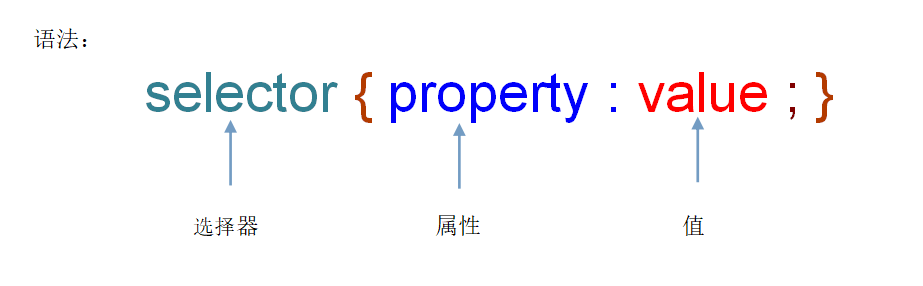

> CSS的基本语法由选择器、属性、属性的值组成，如果选择符有多个属性，由分号隔开。
>
> 注意，这里的代码都是英文格式，例如花括号、冒号和分号。

### 2.2.1、CSS的引入方式

CSS样式有三种不同的使用方式，分别是行内样式，嵌入样式以及链接式。我们需要根据不同的场合不同的需求来使用不同的样式。

* 行内样式

行内样式，就是写在元素的style属性中的样式，这种样式仅限于元素内部起作用。当个别元素需要应用特殊样式时就可以使用内联样式。但不推荐大量使用内联样式，因为那样不利于后期维护。

```html
<div style="color: white;background-color: #369;text-align: center">行内设置</div>
```

* 嵌入式

嵌入式，是把CSS样式写在HTML文档内部head标签中的style标签里。浏览器加载HTML的同时就已经加载了CSS样式了。当单个文档需要特殊，单独的样式时，可以使用内部样式表。

```html
<!DOCTYPE HTML>
<html lang="en-US">
  <head>
     <title>锚点的使用</title>
      <meta charset="utf8">

      <style>
          div{
              color: white;
              background-color: #369;
              text-align: center
          }
      </style>
  </head>
  <body>
  
  <div> 嵌入式</div>

  </body>
</html>
```

* 链接式

链接式，就是把CSS样式写在HTML文档的外部，一个后缀为 .css 的外部样式表中，然后使用时在head标签中，使用link标签的href属性引入文件即可。当CSS样式需要应用在很多页面时，外部样式表是最理想的选择。在使用外部样式表的情况下，我们可以通过改变一个文件来改变这所有页面的外观。

common.css

````css
div{
      color: white;
      background-color: #369;
      text-align: center
}
````

html文件

```html
<!DOCTYPE HTML>
<html lang="en-US">
  <head>
     <title>锚点的使用</title>
      <meta charset="utf8">

      <link rel="stylesheet" href="common.css">
  </head>
  <body>

  <div>链接式</div>
  
  </body>
</html>
```

### 2.2.2、CSS的选择器

#### 基本选择器

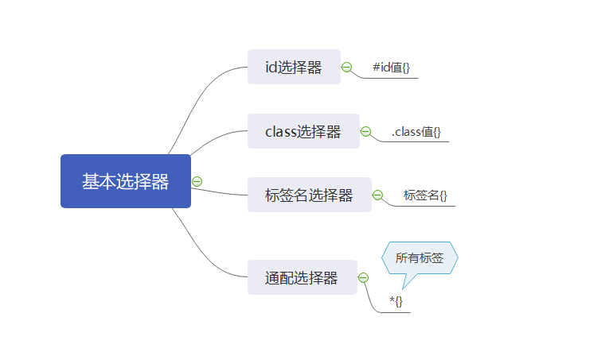

```html
<!DOCTYPE html>
<html lang="en">
<head>
    <meta charset="UTF-8">
    <title>Title</title>

    <style>
           #i1{
               color: red;
           }

           .c1{
               color: red;
           }
           .c2{
               font-size: 32px;
           }

    </style>


</head>
<body>

<div id="i1">item1</div>
<div id="i2">item2</div>
<div id="i3">item3</div>

<div class="c1 c2">item4</div>
<div class="c1">item5</div>
<div class="c1">item6</div>

</body>
</html>
```

#### 组合选择器

* 后代子代选择器

```html
<!DOCTYPE html>
<html lang="en">
<head>
    <meta charset="UTF-8">
    <title>Title</title>


    <style>
        /*后代选择器*/
        .c1 .c2{
            color: red;
        }

        /*子代选择器*/
        .c3 .c5{
            color: red;
        }

        .c3 > .c5{
            color: red;
        }

        .c3 .c4 .c5{
            color: red;
        }
        
    </style>


</head>
<body>

<!--后代选择器-->
<div class="c1">
    <div class="c2">item1</div>
</div>
<div class="c2">item2</div>

<!--子代选择器-->
<div class="c3">
    <div class="c4">
        <div class="c5">item3</div>
    </div>
     <div class="c5">item4</div>
</div>

</body>
</html>
```

* 与或选择器

```html
<!DOCTYPE html>
<html lang="en">
<head>
    <meta charset="UTF-8">
    <title>Title</title>

    <style>
        /*与选择器*/
        p.c1{
            color: red;
        }
         /*或选择器*/
        p.c1,#i1{
            color: red;
        }


    </style>


</head>
<body>

<!--与选择器-->
<div class="c1">item1</div>
<p class="c1">item2</p>
<div>item3</div>
<p id="i1">item4</p>


</body>
</html>
```

* 兄弟选择器

```html
<!DOCTYPE html>
<html lang="en">
<head>
    <meta charset="UTF-8">
    <title>Title</title>

    <style>
        /*毗邻选择器*/
       #i1 + div.c1{
           color: red;
       }

       #i1 + div.c2{
           color: red;
       }

        /*兄弟选择器*/
        #i1 ~ div.c2{
           color: red;
        }
        #i1 ~ div{
           color: red;
        }


    </style>


</head>
<body>
    
<p id="i1">item0</p>
<div class="c1">item1</div>
<div class="c2">item2</div>
<div class="c3">item3</div>
<div class="c4">item4</div>


</body>
</html>
```

#### 属性选择器

```js 
/*
E[att]          匹配所有具有att属性的E元素，不考虑它的值。（注意：E在此处可以省略。
                比如“[cheacked]”。以下同。）   p[title] { color:#f00; }
                
E[att=val]      匹配所有att属性等于“val”的E元素   div[class=”error”] { color:#f00; }
 
E[att~=val]     匹配所有att属性具有多个空格分隔的值、其中一个值等于“val”的E元素
                td[class~=”name”] { color:#f00; }
 
E[attr^=val]    匹配属性值以指定值开头的每个元素                    
                div[class^="test"]{background:#ffff00;}
 
E[attr$=val]    匹配属性值以指定值结尾的每个元素    div[class$="test"]{background:#ffff00;}
 
E[attr*=val]    匹配属性值中包含指定值的每个元素    div[class*="test"]{background:#ffff00;}*/
```

```html
<!DOCTYPE html>
<html lang="en">
<head>
    <meta charset="UTF-8">
    <title>Title</title>

    <style>
        /*属性选择器*/
        [type="text"]{
            border: 1px solid red;
        }

        [index]{
            font-size: 32px;
            font-style: italic;
        }

        [href*="png"]{
            color: red;
        }

    </style>


</head>
<body>


<input type="text">
<input type="password">

<div index="1">1</div>
<div index="2">2</div>
<div index="3">3</div>

<ul>
    <li><a href="1.png">item1</a></li>
    <li><a href="2.jpg">item2</a></li>
    <li><a href="3.jpg">item3</a></li>
    <li><a href="4.png">item4</a></li>
    <li><a href="5.gif">item5</a></li>
</ul>

</body>
</html>
```

#### 伪类选择器

* anchor伪类：专用于控制链接的显示效果

| [:link](https://www.w3school.com.cn/cssref/selector_link.asp) | a:link    | 选择所有未被访问的链接。     |
| ------------------------------------------------------------ | --------- | ---------------------------- |
| [:visited](https://www.w3school.com.cn/cssref/selector_visited.asp) | a:visited | 选择所有已被访问的链接。     |
| [:active](https://www.w3school.com.cn/cssref/selector_active.asp) | a:active  | 选择活动链接。               |
| [:hover](https://www.w3school.com.cn/cssref/selector_hover.asp) | a:hover   | 选择鼠标指针位于其上的链接。 |

```html
    <style>
           a:link{
               color: red;
           }
           a:visited{
               color: coral;
           }
           a:hover{
               color: blue;
           }
           a:active{
               color: rebeccapurple;
           }

    </style>

```

* before after伪类 

| [:first-child](https://www.w3school.com.cn/cssref/selector_first-child.asp) | p:first-child | 选择属于父元素的第一个子元素的每个 <p> 元素。 |
| ------------------------------------------------------------ | ------------- | --------------------------------------------- |
| [:last-child](https://www.w3school.com.cn/cssref/selector_last-child.asp) | p:last-child  | 选择属于其父元素最后一个子元素每个 <p> 元素。 |
| [:before](https://www.w3school.com.cn/cssref/selector_before.asp) | p:before      | 在每个 <p> 元素的内容之前插入内容。           |
| [:after](https://www.w3school.com.cn/cssref/selector_after.asp) | p:after       | 在每个 <p> 元素的内容之后插入内容。           |

```html
<!DOCTYPE html>
<html lang="en">
<head>
    <meta charset="UTF-8">
    <title>Title</title>

    <style>

        .c1 p:first-child{
            color: red;
        }

        .c1 div:last-child{
            color: red;
        }

        p#i1:after{
            content:"hello";
            color:red;
            display: block;
        }

    </style>


</head>
<body>

<div class="c1">
    <p>item1</p>
    <p>item1</p>
    <div>item1</div>
    <p>item1</p>
</div>

<p id="i1">p标签</p>

</body>
</html>
```

#### 样式继承

CSS的样式表继承指的是，特定的CSS属性向下传递到子孙元素。总的来说，一个HTML文档就是一个家族，然后html元素有两个子元素，相当于它的儿子，分别是head和body，然后body和head各自还会有自己的儿子，最终形成了一张以下的家族谱。

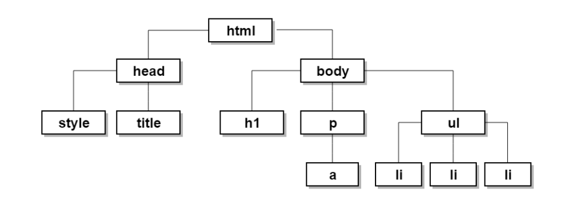


在上图中，可以看到，body的子元素有三个，h1、p和ul，ul也有几个子元素，p也有1个子元素，那么li和a就都是body的后代元素。有时可能我们在body里面设置了一些属性，结果，body下面所有的后代元素都可能享受到，这就是样式继承。就像一句俗语一样，“龙生龙，凤生凤，老鼠的儿子会打洞”。样式继承，可以给我们的网页布局带来很多的便利，让我们的代码变得更加简洁，但是，如果不了解，或者使用不当，也有可能会给我们带来很多不必要的麻烦。

因此，如果了解了哪些样式是会继承到后代元素的，那么就可以避免这些问题的发生了。

| 文本相关属性       |                     |                 |              |
| ------------------ | ------------------- | --------------- | ------------ |
| font-family        | font-size           | letter-spacing  | line-height  |
| font-style         | font-variant        | text-align      | text-indent  |
| font-weight        | font                | text-transform  | word-spacing |
| color              | direction           |                 |              |
| 列表相关属性       |                     |                 |              |
| list-style-image   | list-style-position | list-style-type | list-style   |
| 表格和其他相关属性 |                     |                 |              |
| border-collapse    | border-spacing      | caption-side    | empty-cells  |
| cursor             |                     |                 |              |

#### 选择器优先级

* 继承

继承是CSS的一个主要特征，它是依赖于祖先-后代的关系的。继承是一种机制，它允许样式不仅可以应用于某个特定的元素，还可以应用于它的后代。例如一个BODY定义了的颜色值也会应用到段落的文本中。

```
body{color:red;}    <p>helloyuan</p>
```

这段文字都继承了由body {color:red;}样式定义的颜色。然而CSS继承性的权重是非常低的，是比普通元素的权重还要低的0。

```
p{color:green}
```

发现只需要给加个颜色值就能覆盖掉它继承的样式颜色。由此可见：任何显示申明的规则都可以覆盖其继承样式。 此外，继承是CSS重要的一部分，我们甚至不用去考虑它为什么能够这样，但CSS继承也是有限制的。有一些属性不能被继承，如：border, margin, padding, background等。

* 优先级

  所谓CSS优先级，即是指CSS样式在浏览器中被解析的先后顺序。样式表中的特殊性描述了不同规则的相对权重。

```css
/*
!important > 行内样式>ID选择器 > 类选择器 > 标签 > 通配符 > 继承 > 浏览器默认属性

1 内联样式表的权值最高               style=""           1000；

2 统计选择符中的ID属性个数。         #id                100

3 统计选择符中的CLASS属性个数。      .class             10

4 统计选择符中的HTML标签名个数。     标签名              1

按这些规则将数字符串逐位相加，就得到最终的权重，然后在比较取舍时按照从左到右的顺序逐位比较。
*/
```

```html
<!DOCTYPE html>
<html lang="en">
<head>
    <meta charset="UTF-8">
    <title>Title</title>

    <style>
            .c1{
                color: red;
            }
            #i1{
                color: coral;
            }
            div{
                color: greenyellow;
            }

            /*.c2 .c3 .c4 span{*/
            /*    color: orange;*/
            /*}*/

            .c2 .c4 span{
                color: blue;
            }

            .c2 .c3 .c5{
                color: rebeccapurple;
            }

            .c2 .c4 .c5{
                color: darkcyan;
            }

    </style>

</head>
<body>


<div class="c1" id="i1">item1</div>


<div class="c2">
    <div class="c3">
        <div class="c4">
            <span class="c5">item2</span>
        </div>
    </div>
</div>


</body>
</html>
```

> 1、有!important声明的规则高于一切。
>
> 2、如果!important声明冲突，则比较优先权。
>
> 3、如果优先权一样，则按照在源码中出现的顺序决定，后来者居上。
>
> 4、由继承而得到的样式没有specificity的计算，它低于一切其它规则(比如全局选择符*定义的规则)。
>
> 5、用数字表示只是说明思想，一万个class也不如一个id权值高

### 2.2.3、CSS的属性操作

#### 文本属性

* font-style（字体样式风格）

```go
/*
属性值：
normal：设置字体样式为正体。默认值。 
italic：设置字体样式为斜体。这是选择字体库中的斜体字。
oblique：设置字体样式为斜体。人为的使文字倾斜，而不是去使用字体库的斜体字。
*/
```

* font-weight（字体粗细）

```go
/*
属性值：
normal：设置字体为正常字体。相当于数字值400
bold：设置字体为粗体。相当于数字值700。
bolder：设置字体为比父级元素字体更粗的字体。
lighter：设置字体为比父级元素字体更细的字体。
number：用数字表示字体粗细。从小到大，越来约粗，取值范围：100、200、300、400、500、600、700、800、900。
注意：
font-weight的常用值有两个normal和bold，其他的值在浏览器中的支持并不好。
*/
```

* font-size（字体大小）

```go
/*
font-size的值有很多，有xx-small、x-small、small、medium、large、x-large、xx-large、smaller和larger，也可以设置值为具体的数值加上对应的计算单位来表示字体的大小。字体单位有像素（ px ）、字符（ em，默认1em等于16px，2em等于32px，根据不同浏览器的默认字体大小而决定 ）、百分比（ % ），磅[点]（ pt ）。
字体不指定大小时，主流浏览器默认是15像素到16像素。旧版本的谷歌浏览器，字体最小只能设置成12像素，新版已经修复。*/
```

* font-family（字体族）

```go
/*
font-family可以指定元素使用的字体系列或字体族。当我们使用font-family指定字体族的时候，可以指定多种字体,作为候补。指定多个字体的时候，需要使用逗号隔开。
如果css中没有声明当前内容使用的字体族的时候，默认：
	中文：  宋体 [ win7以后默认是 微软雅黑 ]
	英文：  Arial
*/
```

* color（字体颜色）

```go
// 可以使用color来表示字体的颜色，颜色值最常用的有三种形式，英文单词，十六进制，RGB十进制。更高级的有 RGBA、HSL、HSLA，不过低版本的浏览器并不支持。
```

````
 <style>
        .c1{
            color: red;
        }
        .c1{
            color: #369;
        }
        .c1{
            color: RGB(0,0,255);
        }
</style>

````

> 另外要注意，使用十六进制表示颜色值的时候，如果字符的格式类似于“AAAAAA”的这种，六个字符一样的；又或者是“AABBCC”，这种，一二，三四，五六 位置上的数字一样的，我们可以使用简写来表达。

* text-align（文本对齐方式）

```go
/*
text-align属性可以设置文本内容的水平对齐方式。属性值常用的有
左对齐left、居中对齐center、右对齐right。justify 实现两端对齐文本效果。
*/
```

* text-decoration

```go
// 使用text-decoration可以设置文本内容的装饰线条，正常的文本是没有线条的，常用的值有none，underline，overline，line-through四种。
```

*  line-height（字体行高）

```go
// 字体行高即字体最底端与字体内部顶端之间的距离。值可以是normal、px、number、%。
```

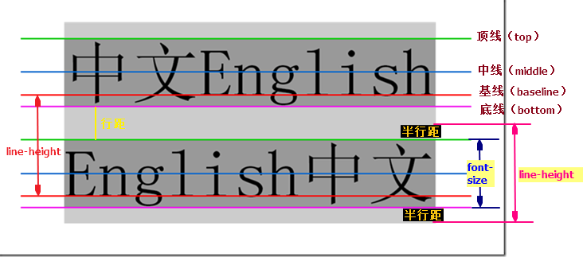

> 行高 = 字体大小 + 上半行距 + 下半行距

* vertical-align

vertical-align 属性设置元素的垂直对齐方式。

```html
<span>yuan</span>
```

#### 背景属性

* background-color（背景颜色）

页面的背景颜色有四种属性值表示，分别是transparent（透明），RGB十进制颜色表示，十六进制颜色表示和颜色单词表示。

属性使用：

```go
/*
background-color: transparent;   // 透明 
background-color: rgb(255,0,0); //  红色背景 
background-color: #ff0000;  //  红色背景
background-color: red;    // 红色背景 
*/
```

* background-image（背景图片）

background-image可以引入一张图片作为元素的背景图像。默认情况下，background-image放置在元素的左上角，并在垂直和水平方向重复平铺。

语法：

```go
// background-image: url('图片地址')
```

> 当同时定义了背景颜色和背景图像时，背景图像覆盖在背景颜色之上。 所以当背景图片没有被加载到，或者不能完全铺满元素时，就会显示背景颜色。

* background-repeat（背景平铺方式）

CSS中，当使用图像作为背景了以后，都是默认把整个页面平铺满的，但是有时候在很多场合下面，页面并不需要这种默认的效果，而可能需要背景图像只显示一次，或者只按照指定方式进行平铺的时候，可以使用background-repeat来进行设置。

background-repeat专门用于设置背景图像的平铺方式，一般有四个值，默认是repeat（平铺），no-repeat（不平铺），repeat-x（X轴平铺），repeat-y（Y轴平铺）。

*  background-position（背景定位）

CSS中支持元素对背景图像的定位摆放功能，就是利用background-position属性来实现，以页面中元素的左上角为原点（0，0），把元素的内部区域当成一个坐标轴（上边框为X轴，越往左X的值越大，左边框为Y轴，越往下Y轴的值就越大，反之亦然），然后计算出背景图片的左上角与圆点的距离（x轴和y轴的距离），然后把背景图片放入到指定的位置上，对背景图片的位置进行精确的控制和摆放。

​	background-position的值分成两个，使用空格隔开，前面一个是背景图片左上角的x轴坐标，后面一个是背景图片左上角的y轴坐标。两个值都可以是正、负值。

语法：

```go
// background-position: x轴坐标 y轴坐标
```

> 背景定位的值除了是具体的数值以外，还可以是左（left）、中（center）、右（right）

* background（背景样式缩写）

和字体属性一样，多个不同背景样式属性也是可以同时缩写的，不过不需要像字体那样按照一定的顺序，背景样式的缩写属性的顺序是不固定的，可以任意编排。

语法：

```go
// background: 背景颜色  背景图片  背景平铺方式  背景定位;
```

#### 边框属性

* border-style（边框风格）

定义边框的风格，值可以有

```go
/*
none：没有边框，当border的值为none的时候，系统将会忽略[border-color]
hidden：隐藏边框，低版本浏览器不支持。
dotted：点状边框。
dashed：虚线边框。
solid：实线边框。
double：双实线边框，两条单线与其间隔的和等于border-width值。
*/
```

border-style的值可以缩写的：

```go
/*
只有一个值的时候表示同时控制上下左右的边框风格。
只有两个值的时候表示分别控制上下、左右的边框风格。
有三个值的时候表示分别控制上、左右、下的边框风格。
有四个只的时候表示分别控制上、右、下、左的边框风格。
*/
```

border-style还可以单独指定不同方向：

```go
/*
border-top-style		设置上边的边框风格
border-bottom-style	     设置下边的边框风格
border-left-style		设置左边的边框风格
border-right-style		设置右边的边框风格
*/
```

* border-width（边框宽度）

使用border-width可以定义边框的厚度，值可以是medium，thin，thick和指定数值的宽度。 同时，border-width也可以进行缩写：

```go
/*
只有一个值的时候表示同时控制上下左右的边框宽度。
只有两个值的时候表示分别控制上下、左右的边框宽度。
有三个值的时候表示分别控制上、左右、下的边框宽度。
有四个只的时候表示分别控制上、右、下、左的边框宽度。
*/
```

border-width也可以单独指定不同方向：

```go
/*
border-top-width		设置上边的边框宽度
border-bottom-width	    设置下边的边框宽度
border-left-width		设置左边的边框宽度
border-right-width		设置右边的边框宽度
*/
```

* border-color（边框颜色）

定义边框的颜色，值表示的方式可以是十六进制，RGB十进制和单词表示法。

 同上，border-color的缩写：

```go
/*
只有一个值的时候表示同时控制上下左右的边框颜色。
只有两个值的时候表示分别控制上下、左右的边框颜色。
有三个值的时候表示分别控制上、左右、下的边框颜色。
有四个只的时候表示分别控制上、右、下、左的边框颜色。
*/
```

border-color也可以单独指定不同方向：

```css
/*
border-top-color		设置上边的边框颜色
border-bottom-color	设置下边的边框颜色
border-left-color		设置左边的边框颜色
border-right-color		设置右边的边框颜色
*/
```

* 边框样式缩写

还可以把边框风格，边框宽度，边框颜色进行组合在一起，进行缩写：语法：

```go
// border: 边框宽度 边框样式 边框颜色;
```

> 注意，border的缩写值可以不按照顺序来进行书写。这样的缩写可以同时控制4个方向的边框样式。	

#### 列表属性

CSS中提供了一些列表属性可以用来：

​	(1)、设置不同的列表项标记为有序列表

​	(2)、设置不同的列表项标记为无序列表

​	(3)、设置列表项标记为图像

* list-style-type（系统提供的列表项目符号）

* list-style-image（自定义的列表项目符号）

```css
 li { list-style-image:url('qq.gif'); }
```

#### dispaly属性

display可以指定元素的显示模式，它可以把行内元素修改成块状元素，也可以把别的模式的元素改成行内元素。diisplay常用的值有四个。

语法：

```css
/*
display: block;		 	// 声明当前元素的显示模式为块状元素
display: inline;		// 声明当前元素的显示模式为行内元素
display: inline-block; 	 // 声明当前元素的显示模式为行内块状元素
display: none;			// 声明当前元素的显示模式为隐藏 
*/
```

#### 盒子模型（重点）

盒模型是CSS的核心知识点之一，它指定元素如何显示以及如何相互交互。HTML页面上的每个元素都可以看成一个个方盒子，这些盒子由元素的content（内容）、padding（内边距）、border（边框）、margin（外边距）组成。

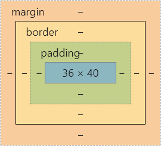

* padding（内边距及其缩写）

内边距，也叫“内补白”，表示页面中元素的边框与内容的距离。内边距的值不能是负值，相当于table标签的cellpadding属性。

内边距可以设置多个值：

```go
/*
当padding只有一个值的时候表示同时控制上下左右的内边距。
当padding只有两个值的时候表示分别控制上下、左右的内边距。
当padding有三个值的时候表示分别控制上、左右、下的内边距。
当padding有四个只的时候表示分别控制上、右、下、左的内边距。
*/
```

内边距也可以进行单独设置：

```css
/*
padding-top 			设置上边的外边距
padding -bottom 		设置下边的外边距
padding -left			设置左边的外边距
padding -right			设置右边的外边距
*/
```

*  margin（外边距及其缩写）

外边距，也叫“外补白”，表示页面中元素与元素之间的距离。外边距越大，两者的距离就越远，反之，如果外边距越小，则元素之间的距离就越近，外边距的值可以是正数，也可以是负值。

margin也可以像padding一样设置多个值和单独方向设置，用法一样。

> 1、在网页的开发过程中，需要让一个元素相对于父级元素作水平居中时，可以借助margin的特性来实现。
>
> ​      使用margin让元素自身居中：  margin: 0 auto;
>
> 2、浏览器的默认边距清零

```html
<!DOCTYPE html>
<html lang="en">
<head>
    <meta charset="UTF-8">
    <title>Title</title>
    <style>
       .c1{
           width: 100%;
           height: 600px;
           border: 1px solid red;

       }

       .c2{
           width: 50%;
           height: 40px;
           background-color: rebeccapurple;
           margin: 10px auto;
       }
    </style>
</head>
<body>

<div class="c1">
    <div class="c2"></div>
    <div class="c2"></div>
</div>
</body>
</html>
```

边距案例：

```html
<!DOCTYPE HTML>
<html lang="en-US">
  <head>
        <meta charset="utf8">
        <style>

            *{
                margin: 0;
                padding: 0;
            }

            .c1{
                width: 80%;

                margin: 100px auto;

            }

            .c1 .J_categoryList{
                list-style: none;

            }
            .c1 .J_categoryList li{
                display: inline-block;
                margin: 10px;

            }
            .c1 .J_categoryList li a{
                font-size: 16px;
                color: #333;
                padding: 20px;
                border: 1px solid rebeccapurple;
                text-decoration: none;
            }

        </style>
  </head>
  <body>
<div class="c1">
      <ul class="J_categoryList">
          <li><a href=""><span>红米</span></a></li>
          <li><a href=""><span>电视</span></a></li>
          <li><a href=""><span>笔记本</span></a></li>
          <li><a href=""><span>家电</span></a></li>
          <li><a href=""><span>小米手机</span></a></li>
      </ul>
</div>
  </body>
</html>
```

#### float属性（重点）

* 流动布局

流动模型（Flow），即文档流，浏览器打开HTML网页时，从上往下，从左往右，逐一加载。

在正常情况下，HTML元素都会根据文档流来分布网页内容的。

文档流有2大特征：

① 块状元素会随着浏览器读取文档的顺序，自上而下垂直分布，一行一个的形式占据页面位置。

② 行内元素会随着浏览器区队文档的顺序，从左往右水平分布，一行多个的形式占据页面位置。行内元素摆放满一行以后才会到下一行继续排列。

```html
<!DOCTYPE HTML>
<html lang="en-US">
  <head>
    <title></title>
    <style>
    div{ border: 1px solid #f00; margin: 4px; }
    .d3{ width: 100px; }
    </style>
  </head>
  <body>
    <div>d1</div>
    <div>d2</div>
    <div class="d3">
      <span>span1</span>
      <a>a1</a>
      <a>a2</a>
      <span>span2</span>
    </div>
  </body>
</html>
```

* 浮动模型

要学习浮动模型的布局模式，就要了解CSS提供的浮动属性（float）。浮动属性是网页布局中最常用的属性之一，通过浮动属性不但可以很好的实现页面布局，而且还可以依靠它来制作导航栏等页面功能。

简单浮动：

```html
<!DOCTYPE HTML>
<html lang="en-US">
  <head>
    <title>简单浮动</title>
    <style>

        .c1{
            width: 200px;
            height: 200px;
            background-color: indianred;
            float: left;
        }

        .c2{
            width: 300px;
            height: 200px;
            background-color: orange;
            float: left;

        }

        .c3{
            width: 400px;
            height: 200px;
            background-color: lightblue;
            float: left;
        }
        

    </style>
  </head>
  <body>

   <div class="c1"></div>
   <div class="c2"></div>
   <div class="c3"></div>

  </body>
</html>
```

* 字围效果

```html
<!DOCTYPE HTML>
<html lang="en-US">
  <head>
    <title>字围效果</title>
    <style>

        .c1{
            width: 200px;
            height: 200px;
            background-color: indianred;

        }

        .c2{
            width: 300px;
            height: 200px;
            background-color: orange;
            float: left;

        }

        .c3{
            width: 400px;
            height: 400px;
            background-color: lightblue;

        }
        
    </style>
  </head>
  <body>

   <div class="c1">111</div>
   <div class="c2">222</div>
   <div class="c3">333</div>>

  </body>
</html>
```

案例：

```html
<!DOCTYPE HTML>
<html lang="en-US">
  <head>
    <title>字围案例</title>
    <meta charset="utf8">
    <style>

        .c1{
            width: 500px;
        }

        img{
            float: left;
            width: 300px;
            height: 200px;
        }

      
    </style>
  </head>
  <body>
    <div class="c1">
           
           <span class="text">
           </span>
    </div>

  </body>
</html>
```

> 当一个元素被设置浮动后，将具有以下特性：
>
> 1. 任何申明为float 的元素都会自动被设置为一个行内块状元素，具有行内块状元素的特性。 
> 2. 假如某个元素A是浮动的，如果A元素上一个元素也是浮动的，那么A元素会跟随在上一个元素的后边(如果一行放不下这两个元素，那么A元素会被挤到下一行)；如果A元素上一个元素是标准流中的元素，那么A的相对垂直位置不会改变，也就是说A的顶部总是和上一个元素的底部对齐。
> 3. 在标准浏览器中如果浮动元素a脱离了文档流，那么排在浮动元素a后的元素将会往回排列占据浮动元素a本来所处的位置，使页面布局产生变化。
> 4. 如果水平方向上没有足够的空间容纳浮动元素，则转向下一行。
> 5. 字围效果：文字内容会围绕在浮动元素周围。
> 6. 浮动元素只能浮动至左侧或者右侧。
> 7. 浮动元素只能影响排在其后面元素的布局，却无法影响出现在浮动元素之前的元素。

*  **清除浮动**

网页布局中，最常用的布局便是浮动模型。但是浮动了以后就会破坏原有的文档流，使页面产生不必要的改动，所以我们一般在浮动了以后，达到目的了，就紧接着清除浮动。

在主流浏览器（如Firefox）下，如果没有设置height，元素的高度默认为auto，且其内容中有浮动元素时，在这种情况下元素的高度不能自动伸长以适应内容的高度，使得内容溢出到容器外面而影响（甚至破坏）布局的情况，叫“浮动溢出”，为了防止这个现象的出现而进行的CSS处理操作，CSS里面叫“清除浮动”。

```html
<!DOCTYPE HTML>
<html lang="en-US">
  <head>
    <title></title>
    <meta charset="utf8">
    <style>

        .box{
            border: 1px solid red;
        }

        .c1{
            width: 200px;
            height: 200px;
            background-color: #336699;
            float: left;
        }

         .c2{
            width: 200px;
            height: 200px;
            background-color: orange;
            float: right;
        }

         .footer{
             width: 100%;
             height: 60px;
             background-color: yellowgreen;

         }
    </style>
  </head>
  <body>
    <div class="box">
        <div class="c1"></div>
        <div class="c2"></div>
    </div>
   <div class="footer"></div>

  </body>
</html>
```

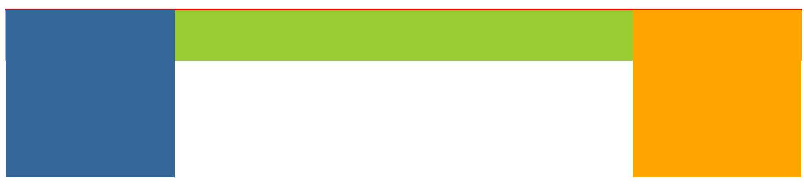

clear是css中专用于清除浮动的，常用的属性值有以下几个：

| 值    | 描述                             |
| ----- | -------------------------------- |
| left  | 在左侧不允许浮动元素。           |
| right | 在右侧不允许浮动元素。           |
| both  | 在左右两侧均不允许浮动元素。     |
| none  | 默认值。允许浮动元素出现在两侧。 |

```html
<!DOCTYPE HTML>
<html lang="en-US">
  <head>
    <title>简单浮动</title>
    <style>

        .c1{
            width: 200px;
            height: 200px;
            background-color: indianred;
            float: left;
            /*float: right;*/
        }

        .c2{
            width: 300px;
            height: 200px;
            background-color: orange;
            float: left;
            clear: left;
            /*clear: both;*/

        }

        .c3{
            width: 400px;
            height: 200px;
            background-color: lightblue;
            float: left;

        }

    </style>
  </head>
  <body>

   <div class="c1"></div>
   <div class="c2"></div>
   <div class="c3"></div>

  </body>
</html>
```

清除浮动解决父级塌陷问题：

````css
  .clearfix:after {                         /*在类名为“clearfix”的元素内最后面加入内容*/
            content: ".";                    /*内容为“.”就是一个英文的句号而已。也可以不写。*/
            display: block;                  /*加入的这个元素转换为块级元素。*/
            clear: both;                     /*清除左右两边浮动。*/
            visibility: hidden;              /*可见度设为隐藏。注意它和display:none;是有区别的。*/
                                              /* visibility:hidden;仍然占据空间，只是看不到而已；*/
            line-height: 0;                  /*行高为0；*/
            height: 0;                       /*高度为0；*/
            font-size:0;                     /*字体大小为0；*/
        }
 

整段代码就相当于在浮动元素后面跟了个宽高为0的空div，然后设定它clear:both来达到清除浮动的效果。
之所以用它，是因为，你不必在html文件中写入大量无意义的空标签，又能清除浮动。
<div class="head clearfix"></div>


````

> 此外，还给父元素加上溢出隐藏属性（overflow: hidden;）来进行清除浮动。

## 2.3、JavaScript基础

一门弱类型的编程语言,属于基于对象和基于原型的脚本语言.

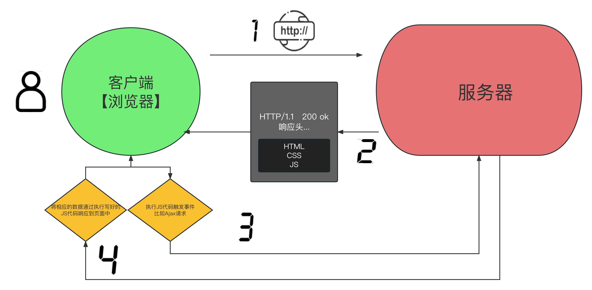

```html
1 直接编写
    <script>
        console.log('hello yuan')
    </script>
2 导入文件
    <script src="hello.js"></script>
```

### 【1】基本语法

```js
// 变量
// 数据类型
// 运算符
// 流程控制语句
// 函数
```

```js
// （1）变量声明赋值
var x = 10;  // 如果不写var则是全局变量

// （2）数据类型
var age = 10
var name = "yuan"
var isMarried = false
var names = ["rain","eric","yuan"]
var info = {name:"yuan",age:18,isMarried:false}

var info2 = {
   "name": "yuan",
	 "age":22,
   "sex": true,
   "son": {
      "name":"alex",
      "age": 38
   },
   "hobby": ["篮球","唱","跳"]
}

// （3）运算符
+ - * / ++
+=
> <   <=. >=. ===. !==
&& || !
  
// （4）流程控制语句
  
// 分支语句
if(条件){
     // 条件为true时,执行的代码
   }else{
     // 条件为false时,执行的代码
 }  

switch(条件){
      case 结果1:
           // 满足条件执行的结果是结果1时,执行这里的代码..
           break;
      case 结果2:
      	   // 满足条件执行的结果是结果2时,执行这里的代码..
      	   break;
      ...
      default:
           // 条件和上述所有结果都不相等时,则执行这里的代码
   }


// 循环语句
while(循环的条件){
      // 循环条件为true的时候,会执行这里的代码
   }
// 循环三要素
for(1.声明循环的开始; 2.条件; 4. 循环的计数){
  // 3. 循环条件为true的时候,会执行这里的代码
}  


// （5）函数

function add(x,y){
  return x + y
}
add()
```

### 【2】数据类型内置方法

````js
// (1) 字符串内置方法
var str = "hello world";
console.log( str.length );
str.toUpperCase()
str.toLowerCase()
str.slice(3,6);
str.split(" ");
str.trim();
````

```js
// (2) 数组内置方法

var arr = [1,2,3,4,5];
arr.push(6); // 给数组后面追加成员
arr.pop(); // 删除最后一个成员作为返回值

arr.shift() // shift是将数组的第一个元素删除
arr.unshift(0)  // unshift是将value值插入到数组的开始

var arr = ["a","b","c"];
arr.splice(1,1);
arr.splice(1,0,"b")
arr.splice(1,1,"B")

arr.reverse();

// slice(开始下标,结束下标)  切片,开区间
arr.slice(1,3)

 // filter() 高阶函数, 对数组的每一个成员进行过滤,返回符合条件的结果
var arr = [4, 6, 5, 7];

function func(num) {  // 也可以使用匿名函数或者箭头函数
  if (num % 2 === 0) {
    return num;
  }
}

var ret = arr.filter(func);  // 所有的函数名都可以作为参数传递到另一个函数中被执行
console.log(ret);

  //  map() 对数组的每一个成员进行处理,返回处理后的每一个成员
var arr = [1, 2, 3, 4, 5];
var ret = arr.map((num) => {
  return num ** 3;
});
console.log(ret); // [1, 8, 27, 64, 125]

```

序列化：

| 方法                      | 描述                                          |
| ------------------------- | --------------------------------------------- |
| **`JSON.stringify(obj)`** | 把obj对象转换成json格式字符串，会移除对象方法 |
| **`JSON.parse(str)`**     | 把符合json语法的字符串转换成js对象            |

### 【3】DOM对象

DOM （document Object Model： 文档对象模型）

```js
// 整个html文档,会保存一个文档对象document
// console.log( document ); // 获取当前文档的对象
```

#### 查找标签

* 直接查找标签

```js
document.getElementsByTagName("标签名")
document.getElementById("id值")
document.getElementsByClassName("类名")
```

> 1、方法的返回值是dom对象还是数组
>
> 2、document对象可以是任意dom对象，将查询范围限制在当前dom对象

* 导航查找标签

```js
elementNode.parentElement           // 父节点标签元素
elementNode.children                // 所有子标签
elementNode.firstElementChild       // 第一个子标签元素
elementNode.lastElementChild        // 最后一个子标签元素
elementNode.nextElementSibling     // 下一个兄弟标签元素
elementNode.previousElementSibling  // 上一个兄弟标签元素
```

* CSS选择器查找

```JS
document.querySelector("css选择器")  //根据css选择符来获取查找到的第一个元素，返回标签对象（dom对象）
document.querySelectorAll("css选择器"); // 根据css选择符来获取查找到的所有元素,返回数组
```

```html
<!DOCTYPE html>
<html lang="en">
<head>
    <meta charset="UTF-8">
    <title>Title</title>
</head>
<body>


<div id="i1">DIV1</div>

<div class="c1">DIV</div>
<div class="c1">DIV</div>
<div class="c1">DIV</div>


<div class="outer">
    <div class="c1">item</div>
</div>


<div class="c2">
    <div class="c3">
        <ul class="c4">
            <li class="c5" id="i2">111</li>
            <li>222</li>
            <li>333</li>
        </ul>
    </div>
</div>

<script>

   // 直接查找

   var ele = document.getElementById("i1");  // ele就是一个dom对象
   console.log(ele);

   var eles = document.getElementsByClassName("c1"); // eles是一个数组 [dom1,dom2,...]
   console.log(eles);

   var eles2 = document.getElementsByTagName("div"); // eles2是一个数组 [dom1,dom2,...]
   console.log(eles2);

   var outer = document.getElementsByClassName("outer")[0];
   var te = outer.getElementsByClassName("c1");
   console.log(te);

   // 导航查找

    var c5 = document.getElementsByClassName("c5")[0];
    console.log(c5);  // c5是一个DOM对象

    console.log(c5.parentElement.lastElementChild);  // 返回值是dom对象
    console.log(c5.parentElement.children);  // 返回值是dom对象数组
    console.log(c5.nextElementSibling.nextElementSibling);
    console.log(c5.parentElement.children);

    // css选择器

    var dom = document.querySelector(".c2 .c3 .c5");
    console.log(":::",dom);

    var doms = document.querySelectorAll("ul li");
    console.log(":::",doms);
    
</script>

</body>
</html>
```

#### 绑定事件

* 静态绑定 ：直接把事件写在标签元素中

```html
<div id="div" onclick="foo(this)">click</div>

<script>
    function foo(self){           // 形参不能是this;
        console.log("foo函数");
        console.log(self);   
    }
</script>


```

* 动态绑定：在js中通过代码获取元素对象,然后给这个对象进行后续绑定

```html
<p id="i1">试一试!</p>

<script>

    var ele=document.getElementById("i1");

    ele.onclick=function(){
        console.log("ok");
        console.log(this);    // this直接用
    };

</script>
```

> 一个元素本身可以绑定多个不同的事件, 但是如果多次绑定同一个事件,则后面的事件代码会覆盖前面的事件代码

多个标签绑定事件

```html
<ul>
    <li>111</li>
    <li>222</li>
    <li>333</li>
    <li>444</li>
    <li>555</li>
</ul>


<script>

    var eles = document.querySelectorAll("ul li");
    for(var i=0;i<eles.length;i++){
        eles[i].onclick = function (){
            console.log(this.innerHTML)
        }
    }

</script>
```

#### 操作标签

```html
<标签名 属性1=“属性值1” 属性2=“属性值2”……>文本</标签名>
```

* **文本操作**

```html
<div class="c1"><span>click</span></div>

<script>

    var ele =document.querySelector(".c1");
  
    ele.ondblclick = function (){
      
       // 查看标签文本
        console.log(this.innerHTML)
        // 设置标签文本
        this.innerHTML = "<a href='#'>yuan</a>"
    }


</script>
```

* **value操作**

像input标签，select标签以及textarea标签是没有文本的，但是显示内容由value属性决定

```html
    <input type="text" id="i1" value="yuan">
  
<script>

    // input标签
    var ele1 =document.getElementById("i1");
    console.log(ele1.value);
    ele1.onmouseover = function (){
        this.value = "alvin"
    }

</script>
```

* **css样式操作**

```html
<p id="i1">Hello world!</p>


<script>
    var ele = document.getElementById("i1");
    ele.onclick = function (){
        this.style.color = "red"
    }
</script>
```

* **属性操作**

```js
elementNode.setAttribute("属性名","属性值")    
elementNode.getAttribute("属性名")       
elementNode.removeAttribute("属性名");
```

> 并不是所有属性都可以像value那样操作。

* **class属性操作**

```js
elementNode.className
elementNode.classList.add
elementNode.classList.remove
```

案例：tab切换

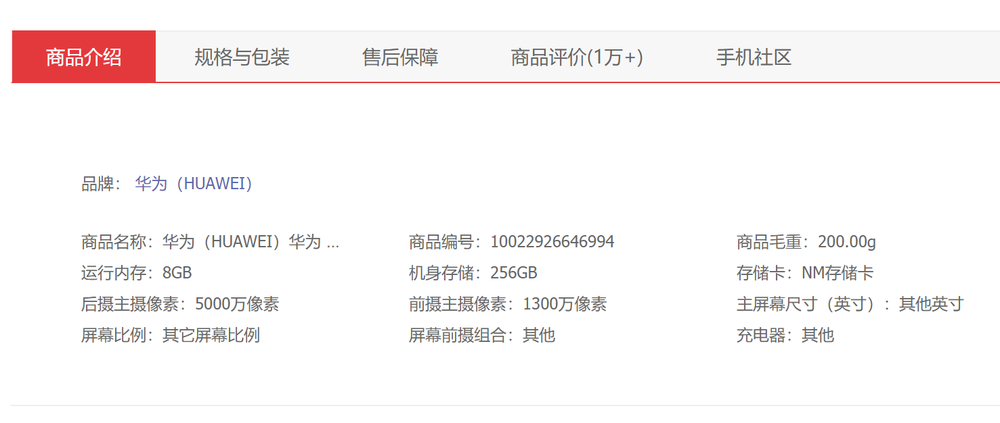

```html
<!DOCTYPE html>
<html lang="en">
<head>
    <meta charset="UTF-8">
    <title>Title</title>

    <style>
        *{
            margin: 0;
            padding: 0;
        }

        .tab{
            width: 800px;
            height: 300px;
            /*border: 1px solid red;*/
            margin: 200px auto;
        }

        .tab ul{
            list-style: none;
        }

        .tab-title{
            background-color: #f7f7f7;
            border: 1px solid #eee;
            border-bottom: 1px solid #e4393c;
        }

        .tab .tab-title li{
            display: inline-block;
            padding: 10px 25px;
            font-size: 14px;
        }

        li.current {
            background-color: #e4393c;
            color: #fff;
            cursor: default;
        }

        .hide{
            display: none;
        }


    </style>
</head>
<body>


<div class="tab">
    <ul class="tab-title">
        <li class="current" index="0">商品介绍</li>
        <li class="" index="1">规格与包装</li>
        <li class="" index="2">售后保障</li>
        <li class="" index="3">商品评价</li>
    </ul>

    <ul class="tab-content">
        <li>商品介绍...</li>
        <li class="hide">规格与包装...</li>
        <li class="hide">售后保障...</li>
        <li class="hide">商品评价...</li>
    </ul>
</div>

<script>
     var titles = document.querySelectorAll(".tab-title li");
     var contents = document.querySelectorAll(".tab-content li");
     
     for (var i = 0;i<titles.length;i++){
         
         titles[i].onclick = function () {
             // (1) 触发事件标签拥有current样式
             for (var j = 0;j<titles.length;j++){
                 titles[j].classList.remove("current")
             }

             console.log(this);
             this.classList.add("current");

             // (2) 显示点击title对应的详情内容
             var index = this.getAttribute("index");
             // console.log(this.getAttribute("index"));
             // console.log(contents[index]);

             for (var z = 0;z<contents.length;z++){
                 contents[z].classList.add("hide");
             }

             contents[index].classList.remove("hide");
             
         }
         
     } 

</script>

</body>
</html>
```


### 【4】jQuery

jQuery是一个快速、简洁的JavaScript框架，是继Prototype之后又一个优秀的JavaScript代码库（*或JavaScript框架*）。jQuery设计的宗旨是“write Less，Do More”，即倡导写更少的代码，做更多的事情。它封装JavaScript常用的功能代码，提供一种简便的JavaScript设计模式，优化HTML文档操作、事件处理、动画设计和Ajax交互。

jQuery的核心特性可以总结为：具有独特的链式语法和短小清晰的多功能接口；具有高效灵活的css选择器，并且可对CSS选择器进行扩展；拥有便捷的插件扩展机制和丰富的插件。jQuery兼容各种主流浏览器，如IE 6.0+、FF 1.5+、Safari 2.0+、Opera 9.0+等

目前在市场上, 1.x , 2.x, 3.x 功能的完善在1.x, 2.x的时候是属于删除旧代码,去除对于旧的浏览器兼容代码。3.x的时候增加es的新特性以及调整核心代码的结构

根本上jquery就是一个写好的js文件,所以想要使用jQuery的语法必须先引入到本地

```html
<script src="https://cdn.bootcdn.net/ajax/libs/jquery/3.5.1/jquery.js"></script>
```

#### 查找标签

```go
/*

基本选择器 :

$("#id")   
$(".class")  
$("element")  
$(".class,p,div")

后代选择器：
$(".outer div") 

筛选器：
  $().first()       
  $().last()          
  $().eq()     
  
导航查找：  

$("div").children(".test")     
$("div").find(".test")  
                               
// 向下查找兄弟标签 
$(".test").next()               

// 查找所有兄弟标签  
$("div").siblings()  
              
// 查找父标签：         
$(".test").parent() 
  
*/
```

#### 绑定事件

```js
1. on 和 off
// 绑定事件
$().on("事件名",匿名函数)

// 解绑事件,给指定元素解除事件的绑定
$().off("事件名")

2. 直接通过事件名来进行调用
$().事件名(匿名函数)

```

#### 操作标签

* 文本操作

```jquery
$("选择符").html()     // 读取指定元素的内容,如果$()函数获取了有多个元素,提取第一个元素
$("选择符").html(内容) // 修改内容,如果$()函数获取了多个元素, 则批量修改内容
```

* value操作

```jquery
$().val()
```

* 属性操作

```jquery
//读取属性值
	$("选择符").attr("属性名");   // 获取非表单元素的属性值,只会提取第一个元素的属性值
//操作属性
  $("选择符").attr("属性名","属性值");  // 修改非表单元素的属性值,如果元素有多个,则全部修改
```

* css样式操作

```js
获取样式
$().css("样式属性");   // 获取元素的指定样式属性的值,如果有多个元素,只得到第一个元素的值

操作样式
$().css("样式属性","样式值").css("样式属性","样式值");
$().css({"样式属性1":"样式值1","样式属性2":"样式值2",....})
```

* class 属性操作

```js
$().addClass("class1  class2 ... ...")   // 给获取到的所有元素添加指定class样式
$().removeClass() // 给获取到的所有元素删除指定class样式
$().toggleClass() // 给获取到的所有元素进行判断,如果拥有指定class样式的则删除,如果没有指定样式则添加
```

* 节点操作

```js
$("").append(content|fn)      // $("p").append("<b>Hello</b>");
```

### 【5】Ajax请求

```
# 向服务器发送请求的方式：

1. 地址栏请求。get
2. a标签。get
3. form表单 get post

同步，页面刷新

4. ajax请求

异步, 局部刷新
```


Ajax，一般中文称之为："阿贾克斯"，是英文 “Async Javascript And Xml”的简写，译作：异步js和xml传输数据技术。

ajax的作用： ajax可以让js代替浏览器向后端程序发送**`http`**请求，与后端通信，在用户不知道的情况下操作数据和信息，从而实现页面局部刷新数据/无刷新更新数据。

所以开发中ajax是很常用的技术，主要用于操作后端提供的`数据接口`，从而实现网站的`前后端分离`。

ajax技术的原理是实例化js的XMLHttpRequest对象，使用此对象提供的内置方法就可以与后端进行数据通信。

##### 数据接口

数据接口，也叫api接口，表示`后端提供`操作数据/功能的url地址给客户端使用。

客户端通过发起请求向服务端提供的url地址申请操作数据【操作一般：增删查改】

同时在工作中，大部分数据接口都不是手写，而是通过函数库/框架来生成。

##### 前后端分离

在开发Web应用中，有两种应用模式：

- 前后端不分离

- 前后端分离

##### ajax的使用

ajax的使用必须与服务端程序配合使用，但是开发中我们对于ajax请求的数据，不仅仅可以是自己写的服务端代码，也可以是别人写好的数据接口进行调用。

数据接口：

```apl
# 天气接口
https://v0.yiketianqi.com/api?unescape=1&version=v91&appid=43656176&appsecret=I42og6Lm&ext=&cityid=&city=

# 音乐接口
https://c.y.qq.com/v8/fcg-bin/fcg_v8_toplist_cp.fcg?g_tk=5381&uin=0&format=json&inCharset=utf-8&outCharset=utf-8%C2%ACice=0&platform=h5&needNewCode=1&tpl=3&page=detail&type=top&topid=36&_=1520777874472%E4%BD%9C%E8%80%85%EF%BC%9Atsia%E9%93%BE%E6%8E%A5%EF%BC%9Ahttps://www.jianshu.com/p/67e4bd47d981
```


# 第三章. 数据解析

## 3.1、正则表达式

Regular Expression，译作正则表达式或正规表示法，表示有规则的表达式，意思是说，描述一段文本排列规则的表达式。

正则表达式并不是Python的一部分。而是一套独立于编程语言，用于处理复杂文本信息的强大的高级文本操作工具。正则表达式拥有自己独特的规则语法以及一个独立的正则处理引擎，我们根据正则语法编写好规则（模式）以后，引擎不仅能够根据规则进行模糊文本查找，还可以进行模糊分割，替换等复杂的文本操作，能让开发者随心所欲地处理文本信息。正则引擎一般由编程语言提供操作，像python就提供了re模块或regex模块来调用正则处理引擎。

正则表达式在处理文本的效率上不如系统自带的字符串操作，但功能却比系统自带的要强大许多。

最早的正则表达式来源于Perl语言，后面其他的编程语言在提供正则表达式操作时基本沿用了Perl语言的正则语法，所以我们学习python的正则以后，也可以在java，php，go，javascript，sql等编程语言中使用。

正则对字符串或文本的操作，无非是分割、匹配、查找和替换。

在线测试工具  http://tool.chinaz.com/regex/

### 【1】元字符(Metacharacters)

元字符是具有特殊含义的字符。

| 元字符      | 描述                                                         |
| ----------- | :----------------------------------------------------------- |
| **.**       | 叫通配符、万能通配符或通配元字符，匹配1个除了换行符\n以外任何原子 |
| **[]**      | 匹配一个中括号中出现的任意原子                               |
| **[^原子]** | 匹配一个没有在中括号出现的任意原子                           |
| **+**       | 叫加号贪婪符，指定左边原子出现1次或多次                      |
| *****       | 叫星号贪婪符，指定左边原子出现0次或多次                      |
| **?**       | 叫非贪婪符，指定左边原子出现0次或1次                         |
| **{n,m}**   | 叫数量范围贪婪符，指定左边原子的数量范围，有{n}，{n, }, {,m}, {n,m}四种写法，其中n与m必须是非负整数。 |
| **^**       | 叫开始边界符或开始锚点符，匹配一行的开头位置                 |
| **$**       | 叫结束边界符或结束锚点符，匹配一行的结束位置                 |
| **\|**      | 指定原子或正则模式进行二选一或多选一                         |
| **()**      | 对原子或正则模式进行捕获提取和分组划分整体操作，             |
| **\\**      | 转义字符，可以把原子转换特殊元字符，也可以把特殊元字符转成原子。 |

```python
import re
"""re.findall(正则模式, 文本)  基于正则模式查找所有匹配的文本内容"""
# part1: 通配符->.  字符集-> []
ret1 = re.findall("a", "a,b,c,d,e")
ret1 = re.findall(".", "a,b,c,d,e")
ret1 = re.findall("[ace]", "a,b,c,d,e")
ret1 = re.findall("[a-z]", "a,b,c,d,e")
ret1 = re.findall("[0-9]", "1,2,3,4,5")
ret1 = re.findall("\d", "1,2,3,4,5")
ret1 = re.findall("[0-9a-z]", "1,a,2,b,3")
ret1 = re.findall("[^a-z]", "1,a,2,b,3")
ret1 = re.findall("[^0-9,]", "1,a,2,b,3")
print(ret1)

# part2:重复元字符-> + * {} ?
ret2 = re.findall("[0-9a-zA-Z]", "apple,banana,orange,melon")
ret2 = re.findall("\w", "apple,banana,orange,melon")
ret2 = re.findall("\w+", "apple,banana,orange,melon")
ret2 = re.findall("\w+?", "apple,banana,orange,melon")  # 取消贪婪匹配
ret2 = re.findall("\w*", "apple,banana,orange,melon")
ret2 = re.findall("\w{6}", "apple,banana,orange,melon")

# part3: 位置元字符-> ^ $
ret3 = re.findall("^\w{5}", "apple,banana,peach,orange,melon")
ret3 = re.findall("\w{5}$", "apple,banana,peach,orange,melon")
ret3 = re.findall("^\w{5}$", "apple,banana,peach,orange,melon")
print(ret3)

# part4:
# | 指定原子或正则模式进行二选一或多选一
# () 具备模式捕获的能力，也就是优先提取数据的能力，通过(?:) 可以取消模式捕获
ret4 = re.findall(",\w{5},", ",apple,banana,peach,orange,melon,")  # 筛选出5个字符的单词
ret4 = re.findall(",(\w{5}),", ",apple,banana,peach,orange,melon,")  # 筛选出5个字符的单词
ret4 = re.findall("\w+@\w+\.com", "123abc@163.com,....234xyz@qq.com,....")  # 筛选出5个字符的单词
ret4 = re.findall("(\w+)@qq\.com", "123abc@163.com,....234xyz@qq.com,....")  # 筛选出5个字符的单词
ret4 = re.findall("(?:\w+)@(?:qq|163)\.com", "123abc@163.com,....234xyz@qq.com,....")  # 筛选出5个字符的单词
print(ret4)

# part5:  转义符-> \d \D  \w \W      \n    \s \S  \b \B
""" \b 1个单词边界原子 """
txt = "my name is nana. nihao,nana"
ret = re.findall(r"na", txt)
ret = re.findall(r"\bna", txt)
ret = re.findall(r"\bna\w{2}", txt)
print(ret)  # ['na', 'na', 'na']

```

转义元字符是`\`开头的元字符，由于某些正则模式会在开发中反复被用到，所以正则语法预定义了一些特殊正则模式以方便我们简写。

| 元字符 | 描述                                                         | 示例             |
| ------ | ------------------------------------------------------------ | ---------------- |
| **\d** | 匹配一个数字原子，等价于`[0-9]`。                            | \d               |
| \D     | 匹配一个非数字原子。等价于`[^0-9]`或`[^\d]`。                | "\D"             |
| \b     | 匹配一个单词边界原子，也就是指单词和空格间的位置。           | er\b             |
| \B     | 匹配一个非单词边界原子，等价于 `[^\b]`                       | r"\Bain"r"ain\B" |
| **\n** | 匹配一个换行符                                               |                  |
| \t     | 匹配一个制表符，tab键                                        |                  |
| **\s** | 匹配一个任何空白字符原子，包括空格、制表符、换页符等等。等价于`[ \f\n\r\t\v]`。 | "\s"             |
| \S     | 匹配一个任何非空白字符原子。等价于`[^ \f\n\r\t\v]`或 `[^\s]`。 | "\S"             |
| **\w** | 匹配一个包括下划线的单词原子。等价于`[A-Za-z0-9_]`。         | "\w"             |
| \W     | 匹配任何非单词字符。等价于`[^A-Za-z0-9_]` 或 `[^\w]`。       | "\W"             |

> 注意：python本身没有内置正则处理的，python中的正则就是一段字符串，我们需要使用python模块中提供的函数把字符串发送给正则引擎，正则引擎会把字符串转换成真正的正则表达式来处理文本内容。

### 【2】re模块中的常用函数

`re`模块提供了一组正则处理函数，使我们可以在字符串中搜索匹配项：

| 函数        | 描述                                                         |
| ----------- | ------------------------------------------------------------ |
| **findall** | 按指定的正则模式查找文本中所有符合正则模式的匹配项，以列表格式返回结果。 |
| **search**  | 在字符串中**任何位置**查找首个符合正则模式的匹配项，存在则返回re.Match对象，不存在返回None |
| **match**   | 判定字符串**开始位置**是否匹配正则模式的规则，匹配则返回re.Match对象，不匹配返回None |
| **split**   | 按指定的正则模式来分割字符串，返回一个分割后的列表           |
| **sub**     | 把字符串按指定的正则模式来查找符合正则模式的匹配项，并可以替换一个或多个匹配项成其他内容。 |

#### findall

```python
def findall(pattern, string, flags=0)
```

`findall()`函数返回包含所有匹配项的列表，如果找不到匹配项，则返回一个空列表。

#### search

```python
def search(pattern, string, flags=0)
```

`search()`函数搜索匹配的字符串，如果匹配上则返回匹配对象re.Match。如果有多个匹配项，则仅返回匹配项的第一个匹配项，如果找不到匹配项，则返回值为None

```python
import re

ret = re.search("1[3-9]\d{9}", "我的手机号码是13928835900,我女朋友的手机号是15100363326")
print(ret)
print(ret.start(), ret.end(), ret.span())
print(ret.group())

ret = re.search("(?P<tel>1[3-9]\d{9}).*?(?P<email>\d+@qq.com)", "我的手机号码是13928835900,我的邮箱是123@qq.com")
print(ret)
print(ret.group("tel"))
print(ret.group("email"))
```

#### match

```python
def match(pattern, string, flags=0)
```

`match()`函数搜索匹配的字符串开始位置，如果匹配上则返回匹配对象，如果找不到匹配项，则返回值为None

#### split

```python
def split(patter, string, maxsplit=0, flags=0)
```

`split()`函数返回一个列表，对字符串进行正则分割。

```python
import re

txt = "my name is moluo"
ret = re.split("\s", txt)
print(ret)  # ['my', 'name', 'is', 'moluo']
```

可以通过指定`maxsplit`参数来控制分割的次数，例如，仅在第1次出现时才拆分字符串：

```python
import re

txt = "my  name        is    yuan"
ret = re.split("\s+", txt)
print(ret)
```

#### sub和subn

````python
def sub(pattern, repl, string, count=0, flags=0)  返回匹配后的结果
def subn(pattern, repl, string, count=0, flags=0)  返回匹配后的结果和次数
````

`sub()`函数用选择的文本替换匹配:

```python
import re

txt = "my  name        is    yuan"
# ret = re.sub("\s+"," " ,txt)
ret = re.sub("\s+", " ", txt, 2)
print(ret)
```

#### compile()

```py
def compile(pattern, flags=0)
```

```python
import re

re_email = re.compile(r"(?:\+86)?1[3-9]\d{9}")
ret = re_email.findall("15100649928,123@qq.com,13653287791,666@163.com")
print(ret)

```

如果一个正则表达式要使用几千遍，每一次都会编译，出于效率的考虑进行正则表达式的编译，就不需要每次都编译了，节省了编译的时间，从而提升效率

### 【4】正则进阶

#### `.*?`

```python
import re

text = '<12> <xyz> <!@#$%> <1a!#e2> <>'

ret = re.findall("<\d+>", text)
ret = re.findall("<\w+>", text)
ret = re.findall("<.+>", text)
ret = re.findall("<.+?>", text)
ret = re.findall("<.*?>", text)

print(ret)
```

#### `模式修正符`

模式修正符，也叫正则修饰符，模式修正符就是给正则模式增强或增加功能的。

**通用flags（修正符）**

| 值   | 说明                                               |
| :--- | :------------------------------------------------- |
| re.I | 是匹配对大小写不敏感                               |
| re.L | 做本地化识别匹配                                   |
| re.M | 多行匹配，影响到^和$                               |
| re.S | 使.匹配包括换行符在内的所有字符                    |
| re.U | 根据Unicode字符集解析字符，影响\w、\W、\b、\B      |
| re.X | 通过给予我们功能灵活的格式以便更好的理解正则表达式 |

```python
import re

text = """
<12
>
 
 <x
 yz> 
 
 <!@#$%> 
 
 <1a!#
 e2> 
 
 <>
"""

ret = re.findall("<.*?>", text)
ret = re.findall("<.*?>", text, re.S)

print(ret)
```

练习：豆瓣Top250页面解析

```

```


### 【5】练习

工作中，正则一般用于验证数据、校验用户输入的信息、爬虫、运维日志分析等。其中如果是验证用户输入的数据：

| 场景                  | 正则表达式                                                   |
| :-------------------- | ------------------------------------------------------------ |
| 用户名                | `^[a-z0-9_-]{3,16}$`                                         |
| 密码                  | `^[a-z0-9_-]{6,18}$`                                         |
| 手机号码              | `^(?:\+86)?1[3-9]\d{9}$`                                     |
| 颜色的十六进制值      | `^#?([a-f0-9]{6}|[a-f0-9]{3})$`                              |
| 电子邮箱              | `^[a-z\d]+(\.[a-z\d]+)*@([\da-z](-[\da-z])?)+\.[a-z]+$`      |
| URL                   | `^(?:https:\/\/|http:\/\/)?([\da-z\.-]+)\.([a-z\.]+).\w+$`   |
| IP 地址               | `((2[0-4]\d|25[0-5]|[01]?\d\d?)\.){3}(2[0-4]\d|25[0-5]|[01]?\d\d?)` |
| **HTML 标签**         | `^<([a-z]+)([^<]+)*(?:>(.*)<\/\1>`                           |
| utf-8编码下的汉字范围 | `^[\u2E80-\u9FFF]+$`                                         |

```python
1、编写正则，匹配整数或者小数（包括正数和负数）

2、编写正则，匹配年月日日期 格式2018-12-31

3、编写正则，匹配qq号 5-12

4、编写正则，11位的电话号码

5、编写正则，长度为8-10位的用户密码 ： 包含数字字母下划线

6、编写正则，从18位省份证中提取用户生日日期

7、编写正则，从文本"a@com  b@qq.com 333@qq.com  333@168.com   19022@sina.com.cn"中匹配qq邮箱地址

8、从以下多行文本中提取href=""中的双引号的值，并提取标签内容 <a>内容<a>
"""
<a href="http://www.badu.com/s?wd=hahaha">hahaha</a>
<a href="http://www.tmall.com/">tmall</a>
<a href="http://www.tmall.com/">tmall</a>
"""
```

课堂代码

```python
import re

"""
1、编写正则，匹配文本中的整数或者小数（包括正数和负数）
"""
# txt = "10.3 10 20 -20 +20 --20 ++20 -30.5444"
# # ret = re.findall(r"-?\+?\d+", txt)
# ret = re.findall(r"[\+\-]?(?:(?:\d+\.\d+)|(?:\d+))", txt)
# print(ret)
# # ['10', '3', '10', '20', '-20', '+20', '-20', '+20']


"""
2、编写正则，匹配年月日日期 格式: 2018-12-31
"""

# txt = "2018-12-31  2018-12-01 2018-12  2018-31 0000-12-31 2018-1-31 2018-01-31  20-01-31  20-01-1  2020-1-1  2020-01-01"
# ret = re.findall(r"[12]\d{3}-\d+-\d+", txt)
# print(ret)  # ['2018-12-31', '2018-12-01', '2018-1-31', '2018-01-31', '2020-1-1', '2020-01-01']
#

"""
3、编写正则，匹配qq号 5-12数字
"""
# txt = "20181231  40001 2202020133  13311233220222 20202012024222 222050sss2222  33020202222  2001  202011  2020.0101222"
# ret = re.findall(r"[1-9]\d{4,11}", txt)
# print(ret)  # ['20181231', '40001', '2202020133', '133112332202', '202020120242', '222050', '33020202222', '202011', '101222']


"""
4、编写正则，11位的手机号码
"""
# txt = "1331234546 1501233453 15812345678  158-1234-5678  158 1234 5678   20022221111  10012345678  19012345678"
# ret = re.findall(r"1[3-9]\d{9}", txt)
# print(ret)  #
#
# # 如果 158-1234-5678 和 158 1234 5678也算呢？
# txt = "1331234546 1501233453 15812345678  158-1234-5678  158 1234 5678   20022221111  10012345678  19012345678"
# ret = re.findall(r"1[3-9]\d[\- ]?\d{4}[\- ]?\d{4}", txt)
# print(ret)  #


"""
5、编写正则，长度为8-10位的用户密码 ： 包含数字字母下划线
"""
# password = input("请输入长度为8-10位的用户密码（包含数字字母下划线）：")
# ret = re.match(r"^\w{8,10}$", password)
# print(ret)

"""
6、编写正则，从18位省份证中提取用户生日日期
"""
# idCard = "51142119991021155x"
# ret = re.findall(r"^[1-6]\d{5}(\d{8})\d{3}[\dxX]$", idCard)
# # ret = re.findall(r"^(?:1[1-5]|2[1-3]|3[1-7]|4[1-6]|5[0-4]|6[1-5])\d{4}(\d{8})\d{3}[\dxX]$", idCard)
# print(ret)

"""
7、编写正则，从文本"a@com  b@qq.com 333@qq.com  333@168.com   19022@sina.com.cn"中匹配qq邮箱地址
"""
# txt = "a@com  b@qq.com 333@qq.com  333@168.com   19022@sina.com.cn"
# ret = re.findall(r"\w+@\w+\.\w+(?:.cn)?", txt)
# print(ret)  # ['b@qq.com', '333@qq.com', '333@168.com', '19022@sina.com.cn']

"""
8、从以下多行文本中提取href=""中的双引号的值，并提取标签内容 <a>内容<a>
"""

# txt = """
# <a href="http://www.badu.com/s?wd=hahaha">hahaha</a>
# <a href="http://www.tmall.com/">tmall</a>
# <a href="http://www.tmall.com/">tmall</a>
# """
# ret = re.findall(r'<a href="(?P<href>.*?)">(?P<content>.*?)</a>', txt, re.M+re.S)
# print(ret)
```

## 3.2、BS4

### 【1】简介

简单来说，Beautiful Soup是python的一个库，最主要的功能是从网页抓取数据。官方解释如下：

```
'''
Beautiful Soup提供一些简单的、python式的函数用来处理导航、搜索、修改分析树等功能。
它是一个工具箱，通过解析文档为用户提供需要抓取的数据，因为简单，所以不需要多少代码就可以写出一个完整的应用程序。
'''
```

Beautiful Soup 是一个可以从HTML或XML文件中提取数据的Python库.它能够通过你喜欢的转换器实现惯用的文档导航,查找,修改文档的方式.Beautiful Soup会帮你节省数小时甚至数天的工作时间.你可能在寻找 Beautiful Soup3 的文档,Beautiful Soup 3 目前已经停止开发,官网推荐在现在的项目中使用Beautiful Soup 4。

> 官方文档: https://beautifulsoup.readthedocs.io/zh_CN/v4.4.0/

```python
# pip install bs4 安装
 
from bs4 import BeautifulSoup
```

Beautiful Soup支持Python标准库中的HTML解析器,还支持一些第三方的解析器，如果我们不安装它，则 Python 会使用 Python默认的解析器，lxml 解析器更加强大，速度更快，推荐安装。

```py
pip3 install lxml
```

另一个可供选择的解析器是纯Python实现的 html5lib , html5lib的解析方式与浏览器相同,可以选择下列方法来安装html5lib:

```python
pip3 install html5lib
```

解析器对比：

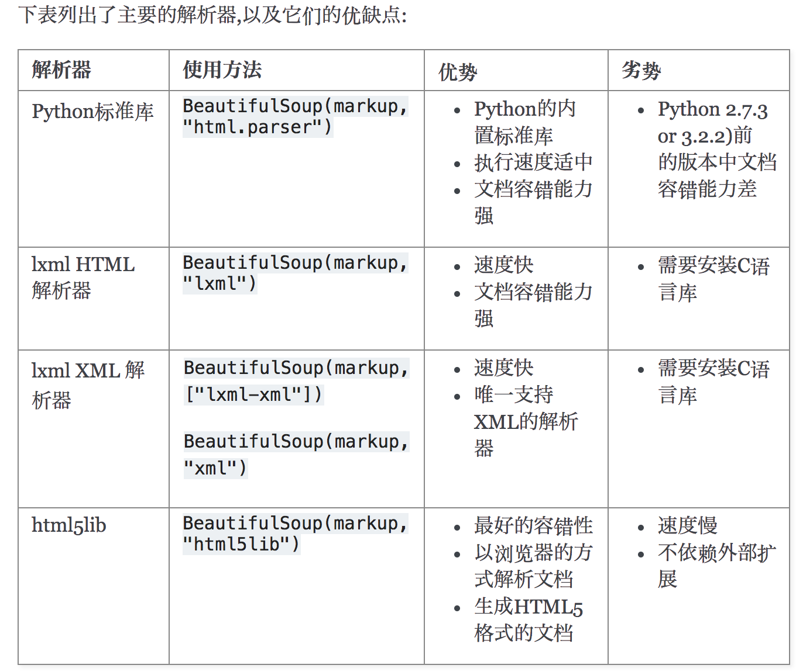

简单使用：

- 从一个`soup`对象开始，以下两种方式生成一个soup对象

```python
from bs4 import BeautifulSoup
soup = BeautifulSoup(open("index.html"))    ##传入文件
soup = BeautifulSoup("<html>data</html>")   ##文本
```

> 构造soup对象时，可以传入解析器参数，如果不传入的话，会以最好的方式去解析

下面的一段HTML代码将作为例子被多次用到.这是 *爱丽丝梦游仙境的* 的一段内容(以后内容中简称为 *爱丽丝* 的文档):

```python
html_doc = """
<html><head><title>The Dormouse's story</title></head>
<body>
<p class="title"><b>The Dormouse's story</b></p>

<p class="story">Once upon a time there were three little sisters; and their names were
<a href="http://example.com/elsie" class="sister" id="link1">Elsie</a>,
<a href="http://example.com/lacie" class="sister" id="link2">Lacie</a> and
<a href="http://example.com/tillie" class="sister" id="link3">Tillie</a>;
and they lived at the bottom of a well.</p>

<p class="story">...</p>
"""
```

使用BeautifulSoup解析这段代码,能够得到一个 `BeautifulSoup` 的对象

```py
from bs4 import BeautifulSoup
soup = BeautifulSoup(html_doc, 'html.parser')
```

从文档中找到所有<a>标签的链接:

```python
for link in soup.find_all('a'):
    print(link.get('href'))
```

从文档中获取所有文字内容:

```python
print(soup.get_text())
```

### 【2】四种对象

Beautiful Soup将复杂HTML文档转换成一个复杂的树形结构,每个节点都是Python对象,所有对象可以归纳为4种`BeautifulSoup`， `Tag` , `NavigableString` ,   `Comment`

tag对象，同网页中的**标签**的意思

```python
from bs4 import BeautifulSoup

html_doc = """
<html><head><title>The Dormouse's story</title></head>
<body>
<p class="title"><b>The Dormouse's story</b></p>

<p class="story">Once upon a time there were three little sisters; and their names were
<a href="http://example.com/elsie" class="sister" id="link1">Elsie</a>,
<a href="http://example.com/lacie" class="sister" id="link2">Lacie</a> and
<a href="http://example.com/tillie" class="sister" id="link3">Tillie</a>;
and they lived at the bottom of a well.</p>

<p class="story">...</p>
"""

# 一、查找tag对象
soup = BeautifulSoup(html_doc, 'html.parser')
print(soup.head, type(soup.head))
print(soup.title, type(soup.title))
print(soup.a, type(soup.a))  # 第一个a标签，如果想获取所有a标签要用到soup.find_all('a')
print(soup.p.b)

# 二、查找tag对象的标签名和属性
print(soup.a.name)  # a
print(soup.p.b.name)  # b
print(soup.a["href"])
print(soup.a.attrs)

'''
三、
HTML 4定义了一系列可以包含多个值的属性.在HTML5中移除了一些,却增加更多.
最常见的多值的属性是 class (一个tag可以有多个CSS的class). 
还有一些属性 rel , rev , accept-charset , headers , accesskey . 
在Beautiful Soup中多值属性的返回类型是list
'''

print(soup.a["class"])  # 返回列表

# 四、tag的属性可以被添加,删除或修改(tag的属性操作方法与字典一样)
# soup.a["class"] = ["sister c1"]
# del soup.a["id"]
# print(soup)

# 五、获取标签对象的文本内容
print(soup.p.string)  # p下的文本只有一个时，取到，否则为None
print(soup.p.strings)  # 拿到一个生成器对象, 取到p下所有的文本内容
for i in soup.p.strings:
    print(i)
# 如果tag包含了多个子节点,tag就无法确定 .string 方法应该调用哪个子节点的内容, .string 的输出结果是 None，如果只有一个子节点那么就输出该子节点的文本，比如下面的这种结构，soup.p.string 返回为None,但soup.p.strings就可以找到所有文本
p2 = soup.find_all("p")[1]
print(p2.string)
print(p2.strings)
for i in p2.strings:
    print(i)
# text 和 string
print(soup.p.string)
print(soup.p.text)  # 取到p下所有的文本内容,text属性更常用，并且它可以直接过滤掉注释
print(p2.text)

```

这种情况下，会产生Comment对象

```xml
markup = "<b><!--Hey, buddy. Want to buy a used parser?--></b>"
soup = BeautifulSoup(markup,"html.parser")
comment = soup.b.string
print(comment)
print(type(comment))
```

**结果为：**

```vbnet
Hey, buddy. Want to buy a used parser?
<class 'bs4.element.Comment'>
```

我们可以看到这时候.string返回的对象不再是`bs4.element.NavigableString`，而是`Comment`

### 【3】遍历文档树（导航文档树）

```python
from bs4 import BeautifulSoup

html_doc = """
<html><head><title>The Dormouse's story</title></head>
<body>
<p class="title"><b>The Dormouse's story</b></p>

<p class="story">Once upon a time there were three little sisters; and their names were
<a href="http://example.com/elsie" class="sister" id="link1">Elsie</a>,
<a href="http://example.com/lacie" class="sister" id="link2">Lacie</a> and
<a href="http://example.com/tillie" class="sister" id="link3">Tillie</a>;
and they lived at the bottom of a well.</p>

<p class="story">...</p>
"""

soup = BeautifulSoup(html_doc, 'html.parser')

# 1、嵌套选择
print(soup.head.title.text)
print(soup.body.a.text)

# 2、子节点、子孙节点
print(soup.p.contents)  # p下所有子节点
print(soup.p.children)  # 得到一个迭代器,包含p下所有子节点

for i, child in enumerate(soup.p.children, 1):
    print(i, child)

print(soup.p.descendants)  # 获取子孙节点,p下所有的标签都会选择出来
for i, child in enumerate(soup.p.descendants, 1):
    print(i, child)
for i, child in enumerate(soup.find_all("p")[1].descendants, 1):
    print(i, child)

# 3、父节点、祖先节点
print(soup.a.parent)  # 获取a标签的父节点
print(soup.a.parent.text)  # 获取a标签的父节点
print(soup.a.parents)  # 找到a标签所有的祖先节点，父亲的父亲，父亲的父亲的父亲...

# 4、兄弟节点
print("===")
print(soup.a.next_sibling)  # 下一个兄弟,类型：<class 'bs4.element.NavigableString'>
print(soup.a.next_sibling.next_sibling)
print(soup.a.previous_sibling.previous_sibling)
print(soup.a.previous_siblings)  # 上面的兄弟们=>生成器对象

```

### 【4】搜索文档树

- recursive 是否从当前位置递归往下查询，如果不递归，只会查询当前`soup`文档的子元素
- string 这里是通过tag的内容来搜索，并且**返回的是类容，而不是tag类型的元素**
- `**kwargs` 自动拆包接受属性值，所以才会有`soup.find_all('a',id='title')` ，id='title'为`**kwargs`自动拆包掺入

BeautifulSoup定义了很多搜索方法,这里着重介绍2个: find() 和 find_all() .其它方法的参数和用法类似

参数列表解读

#### `（1）find_all`

```python
find_all( name , attrs , recursive , string , **kwargs )
```

* **name参数**

```python
soup = BeautifulSoup(html_doc, 'lxml')

# 一、 name 四种过滤器: 字符串、正则表达式、列表、方法
# 1、字符串：即标签名
print(soup.find_all(name='a'))

# 2、正则表达式

print(soup.find_all(name=re.compile('^b')))  # 找出b开头的标签，结果有body和b标签

# 3、列表：如果传入列表参数,Beautiful Soup会将与列表中任一元素匹配的内容返回.下面代码找到文档中所有<a>标签和<b>标签:
print(soup.find_all(name=['a', 'b']))


# 4、方法:如果没有合适过滤器,那么还可以定义一个方法,方法只接受一个元素参数 ,如果这个方法返回 True 表示当前元素匹配并且被找到,如果不是则反回 False
def has_class_but_no_id(tag):
    return tag.has_attr('class') and tag.has_attr('id')


print(soup.find_all(name=has_class_but_no_id))

```

* **keyword 参数**

如果一个指定名字的参数不是搜索内置的参数名,搜索时会把该参数当作指定名字tag的属性来搜索,如果包含一个名字为 `id` 的参数,Beautiful Soup会搜索每个tag的”id”属性.

```python
print(soup.find_all(href="http://example.com/tillie"))
print(soup.find_all(href=re.compile("^http://")))
print(soup.find_all(id=True)) # 拥有id属性的tag
print(soup.find_all(href=re.compile("http://"), id='link1') # 多个属性
print(soup.find_all("a", class_="sister")) # 注意，class是Python的关键字，所以class属性用class_
print(soup.find_all("a",attrs={"href": re.compile("^http://"), "id": re.compile("^link[12]")}))      
# 通过 find_all() 方法的 attrs 参数定义一个字典参数来搜索包含特殊属性的tag:
data_soup.find_all(attrs={"data-foo": "value"})    
```

* **text参数**

```python
import re

print(soup.find_all(text="Elsie"))
# ['Elsie']

print(soup.find_all(text=["Tillie", "Elsie", "Lacie"]))
# ['Elsie', 'Lacie', 'Tillie']

# 只要包含Dormouse就可以
print(soup.find_all(text=re.compile("Dormouse")))
# ["The Dormouse's story", "The Dormouse's story"]
```

* **limit参数**

`find_all()` 方法返回全部的搜索结构,如果文档树很大那么搜索会很慢.如果我们不需要全部结果,可以使用 `limit` 参数限制返回结果的数量.效果与SQL中的limit关键字类似,当搜索到的结果数量达到 `limit` 的限制时,就停止搜索返回结果.

````python
print(soup.find_all("a",limit=2))
````

* **recursive 参数**

调用tag的 `find_all()` 方法时,Beautiful Soup会检索当前tag的所有子孙节点,如果只想搜索tag的直接子节点,可以使用参数 `recursive=False` 

#### `（2）find`

```python
find( name , attrs , recursive , string , **kwargs )
```

`find_all()` 方法将返回文档中符合条件的所有tag,尽管有时候我们只想得到一个结果.比如文档中只有一个<body>标签,那么使用 `find_all()` 方法来查找<body>标签就不太合适, 使用 `find_all` 方法并设置 `limit=1` 参数不如直接使用 `find()` 方法.下面两行代码是等价的:

````python
soup.find_all('title', limit=1)
# [<title>The Dormouse's story</title>]

soup.find('title')
# <title>The Dormouse's story</title>
````

**唯一的区别是 `find_all()` 方法的返回结果是值包含一个元素的列表,而 `find()` 方法直接返回结果.`find_all()` 方法没有找到目标是返回空列表, `find()` 方法找不到目标时,返回 `None` .**

`soup.head.title` 是 tag的名字 方法的简写.这个简写的原理就是多次调用当前tag的 `find()` 方法:

```python
soup.head.title
# <title>The Dormouse's story</title>

soup.find("head").find("title")
# <title>The Dormouse's story</title>
```

#### `（3）其它方法`

````python
#（1） find_parents() 和 find_parent()
a_string = soup.find(text="Lacie")
print(a_string)  # Lacie

print(a_string.find_parent())
# <a class="sister" href="http://example.com/lacie" id="link2">Lacie</a>
print(a_string.find_parents())
print(a_string.find_parent("p"))
'''
<p class="story">
    Once upon a time there were three little sisters; and their names were
    <a class="sister" href="http://example.com/elsie" id="link1">Elsie</a>,
    <a class="sister" href="http://example.com/lacie" id="link2">Lacie</a> and
    <a class="sister" href="http://example.com/tillie" id="link3">Tillie</a>;
    and they lived at the bottom of a well.
</p>

'''

# （2）find_next_siblings() 和 find_next_sibling()
'''
这2个方法通过 .next_siblings 属性对当tag的所有后面解析的兄弟tag节点进行迭代, find_next_siblings() 方法返回所有符合条件的后面的兄弟节点, find_next_sibling() 只返回符合条件的后面的第一个tag节点.
'''

first_link = soup.a

print(first_link.find_next_sibling("a"))
# <a class="sister" href="http://example.com/lacie" id="link2">Lacie</a>

print(first_link.find_next_siblings("a"))
'''
[<a class="sister" href="http://example.com/lacie" id="link2">Lacie</a>,
<a class="sister" href="http://example.com/tillie" id="link3">Tillie</a>
]
'''
# find_previous_siblings() 和 find_previous_sibling()的使用类似于find_next_sibling和find_next_siblings。

# （3）find_all_next() 和 find_next()
'''
这2个方法通过 .next_elements 属性对当前tag的之后的tag和字符串进行迭代, find_all_next() 方法返回所有符合条件的节点, find_next() 方法返回第一个符合条件的节点:　
'''
first_link = soup.a
print(first_link.find_all_next(string=True))
# ['Elsie', ',\n', 'Lacie', ' and\n', 'Tillie', ';\nand they lived at the bottom of a well.', '\n', '...', '\n']
print(first_link.find_next(string=True)) # Elsie

# find_all_previous() 和 find_previous()的使用类似于find_all_next() 和 find_next()。
````

### 【5】Css选择器

#### select

css选择器的方法为select(css_selector)
目前支持的选择器如下案例，css选择器可以参考https://www.w3school.com.cn/cssref/css_selectors.ASP

```xml
soup.select("title")
# [<title>The Dormouse's story</title>]

soup.select("p nth-of-type(3)")
# [<p class="story">...</p>]

soup.select("body a")
# [<a class="sister" href="http://example.com/elsie" id="link1">Elsie</a>,
#  <a class="sister" href="http://example.com/lacie"  id="link2">Lacie</a>,
#  <a class="sister" href="http://example.com/tillie" id="link3">Tillie</a>]

soup.select("html head title")
# [<title>The Dormouse's story</title>]


soup.select("head > title")
# [<title>The Dormouse's story</title>]

soup.select("p > a")
# [<a class="sister" href="http://example.com/elsie" id="link1">Elsie</a>,
#  <a class="sister" href="http://example.com/lacie"  id="link2">Lacie</a>,
#  <a class="sister" href="http://example.com/tillie" id="link3">Tillie</a>]

soup.select("p > a:nth-of-type(2)")
# [<a class="sister" href="http://example.com/lacie" id="link2">Lacie</a>]

soup.select("p > #link1")
# [<a class="sister" href="http://example.com/elsie" id="link1">Elsie</a>]

soup.select("body > a")

soup.select("#link1 ~ .sister")
# [<a class="sister" href="http://example.com/lacie" id="link2">Lacie</a>,
#  <a class="sister" href="http://example.com/tillie"  id="link3">Tillie</a>]

soup.select("#link1 + .sister")
# [<a class="sister" href="http://example.com/lacie" id="link2">Lacie</a>]


soup.select(".sister")
# [<a class="sister" href="http://example.com/elsie" id="link1">Elsie</a>,
#  <a class="sister" href="http://example.com/lacie" id="link2">Lacie</a>,
#  <a class="sister" href="http://example.com/tillie" id="link3">Tillie</a>]

soup.select("[class~=sister]")
# [<a class="sister" href="http://example.com/elsie" id="link1">Elsie</a>,
#  <a class="sister" href="http://example.com/lacie" id="link2">Lacie</a>,
#  <a class="sister" href="http://example.com/tillie" id="link3">Tillie</a>]

soup.select("#link1")
# [<a class="sister" href="http://example.com/elsie" id="link1">Elsie</a>]

soup.select("a#link2")
# [<a class="sister" href="http://example.com/lacie" id="link2">Lacie</a>]


soup.select("#link1,#link2")
# [<a class="sister" href="http://example.com/elsie" id="link1">Elsie</a>,
#  <a class="sister" href="http://example.com/lacie" id="link2">Lacie</a>]


soup.select('a[href]')
# [<a class="sister" href="http://example.com/elsie" id="link1">Elsie</a>,
#  <a class="sister" href="http://example.com/lacie" id="link2">Lacie</a>,
#  <a class="sister" href="http://example.com/tillie" id="link3">Tillie</a>]

soup.select('a[href="http://example.com/elsie"]')
# [<a class="sister" href="http://example.com/elsie" id="link1">Elsie</a>]

soup.select('a[href^="http://example.com/"]')
# [<a class="sister" href="http://example.com/elsie" id="link1">Elsie</a>,
#  <a class="sister" href="http://example.com/lacie" id="link2">Lacie</a>,
#  <a class="sister" href="http://example.com/tillie" id="link3">Tillie</a>]

soup.select('a[href$="tillie"]')
# [<a class="sister" href="http://example.com/tillie" id="link3">Tillie</a>]

soup.select('a[href*=".com/el"]')
# [<a class="sister" href="http://example.com/elsie" id="link1">Elsie</a>]
multilingual_markup = """
 <p lang="en">Hello</p>
 <p lang="en-us">Howdy, y'all</p>
 <p lang="en-gb">Pip-pip, old fruit</p>
 <p lang="fr">Bonjour mes amis</p>
"""
multilingual_soup = BeautifulSoup(multilingual_markup)
multilingual_soup.select('p[lang|=en]')
# [<p lang="en">Hello</p>,
#  <p lang="en-us">Howdy, y'all</p>,
#  <p lang="en-gb">Pip-pip, old fruit</p>]
```

#### select_one

**返回查找到的元素的第一个**

### 【6】练习

使用bs4爬取豆瓣电影排行榜信息

````python
from bs4 import BeautifulSoup
soup = BeautifulSoup(s, 'html.parser')

s=soup.find_all(class_="item")
for item in s:
  print(item.find(class_="pic").a.get("href"))
  print(item.find(class_="pic").em.string)
  print(item.find(class_="info").contents[1].a.span.string)
        print(item.find(class_="info").contents[3].contents[3].contents[3].string)
        print(item.find(class_="info").contents[3].contents[3].contents[7].string)
````

## **3.3、xpath**

xpath在Python的爬虫学习中，起着举足轻重的地位，对比正则表达式 re两者可以完成同样的工作，实现的功能也差不多，但xpath明显比re具有优势，在网页分析上使re退居二线。

xpath 全称为**XML Path Language** 一种小型的**查询语言**
xpath的优点： 

- 可在XML中查找信息 
- 支持HTML的查找 
- 通过元素和属性进行导航

**python开发使用XPath条件：** 由于XPath属于lxml库模块，所以首先要安装库lxml。

```python
from lxml import etree
selector=etree.HTML(源码) #将源码转化为能被XPath匹配的格式
selector.xpath(表达式) #返回为一列表
```

### **【1】路径表达式**

| 表达式 | 描述                                                     | 实例           | 解析                                |
| :----- | :------------------------------------------------------- | -------------- | ----------------------------------- |
| /      | 从根节点选取                                             | `/body/div[1]` | 选取根结点下的body下的第一个div标签 |
| //     | 从匹配选择的当前节点选择文档中的节点，而不考虑它们的位置 | `//a`          | 选取文档中所有的a标签               |
| ./     | 当前节点再次进行xpath                                    | `./a`          | 选取当前节点下的所有a标签           |
| @      | 选取属性                                                 | `//@calss`     | 选取所有的class属性                 |

### **【2】谓语（Predicates）**

谓语用来查找某个特定的节点或者包含某个指定的值的节点。

谓语被嵌在方括号中。

在下面的表格中，我们列出了带有谓语的一些路径表达式，以及表达式的结果：

| 路径表达式                    | 结果                                                         |
| :---------------------------- | :----------------------------------------------------------- |
| /ul/li[1]                     | 选取属于 ul子元素的第一个 li元素。                           |
| /ul/li[last()]                | 选取属于 ul子元素的最后一个 li元素。                         |
| /ul/li[last()-1]              | 选取属于 ul子元素的倒数第二个 li元素。                       |
| //ul/li[position()<3]         | 选取最前面的两个属于 ul元素的子元素的 li元素。               |
| //a[@title]                   | 选取所有拥有名为 title的属性的 a元素。                       |
| //a[@title='xx']              | 选取所有 a元素，且这些元素拥有值为 xx的 title属性。          |
| //a[@title>10] `> < >= <= !=` | 选取 a元素的所有 title元素，且其中的 title元素的值须大于 10。 |
| /body/div[@price>35.00]       | 选取body下price元素值大于35的div节点                         |
| //dd[text()="原创"]           | 选取文本是原创的dd标签                                       |

### **【3】选取未知节点**

XPath 通配符可用来选取未知的 XML 元素。

| 通配符 | 描述                 |
| :----- | :------------------- |
| *      | 匹配任何元素节点。   |
| @*     | 匹配任何属性节点。   |
| node() | 匹配任何类型的节点。 |

**实例**

在下面的表格中，我们列出了一些路径表达式，以及这些表达式的结果：

| 路径表达式  | 结果                              |
| :---------- | :-------------------------------- |
| /ul/*       | 选取 bookstore 元素的所有子元素。 |
| //*         | 选取文档中的所有元素。            |
| //title[@*] | 选取所有带有属性的 title 元素。   |
| //node()    | 获取所有节点                      |

### **【4】选取若干路径**

通过在路径表达式中使用“|”运算符，您可以选取若干个路径。

**实例**

在下面的表格中，我们列出了一些路径表达式，以及这些表达式的结果：

| 路径表达式                       | 结果                                                         |
| :------------------------------- | :----------------------------------------------------------- |
| //book/title \| //book/price     | 选取 book 元素的所有 title 和 price 元素。                   |
| //title \| //price               | 选取文档中的所有 title 和 price 元素。                       |
| /bookstore/book/title \| //price | 选取属于 bookstore 元素的 book 元素的所有 title 元素，以及文档中所有的 price 元素。 |

- 逻辑运算

  ```python
  //div[@id="head" and @class="s_down"] # 查找所有id属性等于head并且class属性等于s_down的div标签
  //title | //price # 选取文档中的所有 title 和 price 元素,“|”两边必须是完整的xpath路径
  ```

- 属性查询

  ```python
  //div[@id] # 找所有包含id属性的div节点
  //div[@id="maincontent"]  # 查找所有id属性等于maincontent的div标签
  //@class
  //li[@name="xx"]//text()  # 获取li标签name为xx的里面的文本内容
  ```

- 获取第几个标签 索引从1开始

  ```python
  tree.xpath('//li[1]/a/text()')  # 获取第一个
  tree.xpath('//li[last()]/a/text()')  # 获取最后一个
  tree.xpath('//li[last()-1]/a/text()')  # 获取倒数第二个
  ```

- 模糊查询

  ```python
  //div[contains(@id, "he")]  # 查询所有id属性中包含he的div标签
  //div[starts-with(@id, "he")] # 查询所有id属性中包以he开头的div标签
  //div/h1/text()  # 查找所有div标签下的直接子节点h1的内容
  //div/a/@href   # 获取a里面的href属性值 
  //*  #获取所有
  //*[@class="xx"]  #获取所有class为xx的标签
  
  # 获取节点内容转换成字符串
  c = tree.xpath('//li/a')[0]
  result=etree.tostring(c, encoding='utf-8')
  print(result.decode('UTF-8'))
  ```

### 【5】案例

豆瓣Top250基于xpath解析：

```python
import requests
from lxml import etree

url = "https://movie.douban.com/top250?start=0"
headers = {
    "User-Agent": "Mozilla/5.0 (Windows NT 10.0; Win64; x64) AppleWebKit/537.36 (KHTML, like Gecko) Chrome/99.0.4844.82 Safari/537.36"
}
resp = requests.get(url, headers=headers)

tree = etree.HTML(resp.text)  # 加载页面源代码

items = tree.xpath('//li/div[@class="item"]/div[@class="info"]')

for item in items:
    title = item.xpath('./div[@class="hd"]/a/span[1]/text()')[0]
    rating_num = item.xpath('./div[@class="bd"]/div[@class="star"]/span[@class="rating_num"]/text()')[0]
    comment_num = item.xpath('./div[@class="bd"]/div[@class="star"]/span[4]/text()')[0]
    print(title, rating_num, comment_num)

```

练习：基于xpath完成解析练习

```python
import requests
from lxml import etree

res = requests.get("https://top.baidu.com/board?platform=pc&sa=pcindex_entry", )

selector = etree.HTML(res.text)

rets = selector.xpath('//div[@theme="car"]//div[contains(@class,"item-wrap_Z0BrP ")]')

info = {}
for i in rets:
    name = i.xpath('./div[@class="normal_1glFU"]/a/text()')
    link = i.xpath('./div[@class="normal_1glFU"]/a/@href')
    info[name[0]] = link[0]

print(info)
print(len(info))

```

# 第四章.爬虫核心模块

## 4.1、requests模块

requests 作为一个专门为「人类」编写的 HTTP 请求库，其易用性很强，因此在推出之后就迅速成为 Python 中首选的 HTTP 请求库。requests 库的最大特点是提供了简单易用的 API，让编程人员可以轻松地提高效率。由于 requests 不是 Python 的标准库，因此在使用之前需要进行安装：

```python
pip install requests
```

通过 requests 可以完成各种类型的 HTTP 请求，包括 HTTP、HTTPS、HTTP1.0、HTTP1.1 及各种请求方法。requests 库支持的 HTTP 方法。

### 【1】requests支持的方法

requests模块支持的请求：

```python
import requests
requests.get("http://httpbin.org/get")
requests.post("http://httpbin.org/post")
requests.put("http://httpbin.org/put")
requests.delete("http://httpbin.org/delete")
requests.head("http://httpbin.org/get")
requests.options("http://httpbin.org/get")　　
```

> ■ get——发送一个 GET 请求，用于请求页面信息。
>
> ■ options——发送一个 OPTIONS 请求，用于检查服务器端相关信息。
>
> ■ head——发送一个 HEAD 请求，类似于 GET 请求，但只请求页面的响应头信息。
>
> ■ post——发送一个 POST 请求，通过 body 向指定资源提交用户数据。
>
> ■ put——发送一个 PUT 请求，向指定资源上传最新内容。
>
> ■ patch——发送一个 PATCH 请求，同 PUT 类似，可以用于部分内容更新。
>
> ■ delete——发送一个 DELETE 请求，向指定资源发送一个删除请求。

可以看到，requests 使用与 HTTP 请求方法同名的 API 来提供相应的 HTTP 请求服务，从而降低了编程人员的学习和记忆成本。另外，这些 API 方法都调用同一个基础方法，因此在调用参数的使用上也基本保持一致。

```python
import requests

res = requests.get("https://www.taobao.com/")
# print(res.text)
with open("taobao.html", "wb") as f:
    f.write(res.content)
```

### 【2】requests的响应信息

#### 1. 基本信息

````python
print(respone.status_code)
print(respone.headers)
print(respone.text)　
print(response.json)
````

#### 2. 编码

```python 
print(respone.content)　
print(response.encoding)
```

#### 3. 下载图片、视频

```python
# 下载图片
import requests

res = requests.get("https://img0.baidu.com/it/u=3330672963,1063627283&fm=253&fmt=auto&app=138&f=JPEG?w=500&h=281")

with open("美女.jpg", "wb") as f:
    f.write(res.content)
    
# 下载视频
import requests

res = requests.get("https://video.pearvideo.com/mp4/adshort/20180613/cont-1365496-12251302_adpkg-ad_hd.mp4")

with open("梨视频.mp4", "wb") as f:
    for item in res.iter_content():
        f.write(item)
```

### 【3】requests的请求参数

#### 1. 请求头参数

**（1）UA反爬**

访问百度首页的新闻信息

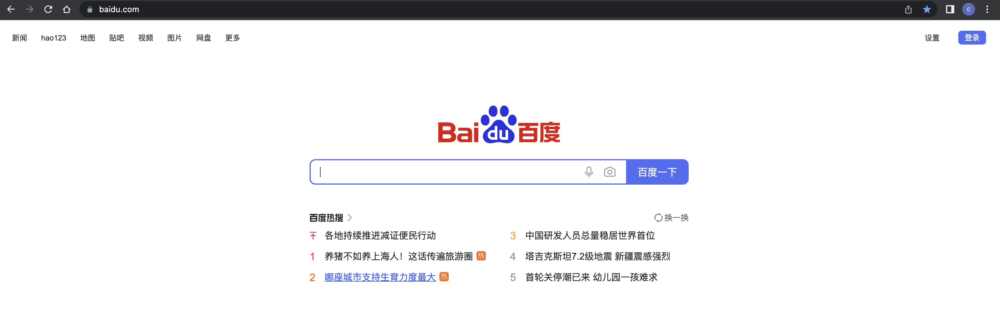

````python
# 爬取百度首页

res = requests.get("https://www.baidu.com/")
res.encoding = "utf8"
with open("baidu.html", "wb") as f:
    f.write(res.content)
````

结果是：

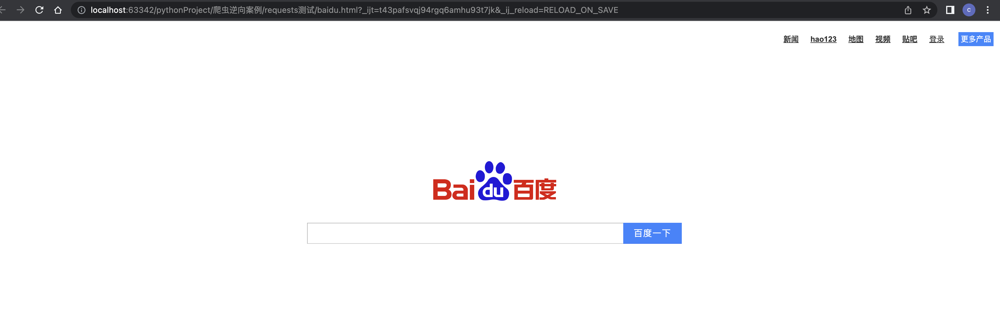

这里就涉及到了最简单的UA反爬，百度服务器通过UA请求头辨别是否为正常请求用户，所以为了攻破这个简单的反爬，只需要在requests请求中加入UA请求头即可。

```python
res = requests.get("https://www.baidu.com/", headers={
    "User-Agent": "Mozilla/5.0 (Macintosh; Intel Mac OS X 10_15_7) AppleWebKit/537.36 (KHTML, like Gecko) Chrome/109.0.0.0 Safari/537.36"
})
```

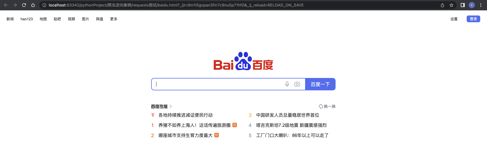


基于xpath解析新闻数据：

```python
import requests
from lxml import etree

# 百度首页

res = requests.get("https://www.baidu.com/", headers={
    "User-Agent": "Mozilla/5.0 (Macintosh; Intel Mac OS X 10_15_7) AppleWebKit/537.36 (KHTML, like Gecko) Chrome/109.0.0.0 Safari/537.36"
})

selector = etree.HTML(res.text)
items = selector.xpath('//ul[@class="s-hotsearch-content"]/li[contains(@class,"hotsearch-item")]')
print("items:", items)
for item in items:
    href = item.xpath('./a/@href')[0]
    title = item.xpath('.//span[@class="title-content-title"]/text()')[0]
    print(title, href)

```

**（2）Referer反爬**

```python
import requests

# https://movie.douban.com/explore

headers = {
    'User-Agent': 'Mozilla/5.0 (Windows NT 10.0; Win64; x64) AppleWebKit/537.36 (KHTML, like Gecko) Chrome/109.0.0.0 Safari/537.36',
    'Referer': 'https://movie.douban.com/explore',
}
url = 'https://m.douban.com/rexxar/api/v2/movie/recommend?refresh=0&start=0&count=20&selected_categories=%7B%7D&uncollect=false&tags='
res = requests.get(url, headers=headers)
print(res.json())
items = res.json()['items']
for m in items:
    print(m.get('title'))
```

#### 2. 请求参数

```python
import requests

# https://movie.douban.com/explore

headers = {
    'User-Agent': 'Mozilla/5.0 (Windows NT 10.0; Win64; x64) AppleWebKit/537.36 (KHTML, like Gecko) Chrome/109.0.0.0 Safari/537.36',
    'Referer': 'https://movie.douban.com/explore',
}
url = 'https://m.douban.com/rexxar/api/v2/movie/recommend'
res = requests.get(url, headers=headers, params={
    "tags": "欧美",
    "sort": "S"
})
print(res.json())
items = res.json()['items']
for m in items:
    print(m.get('title'))
```

#### 3. 请求体数据

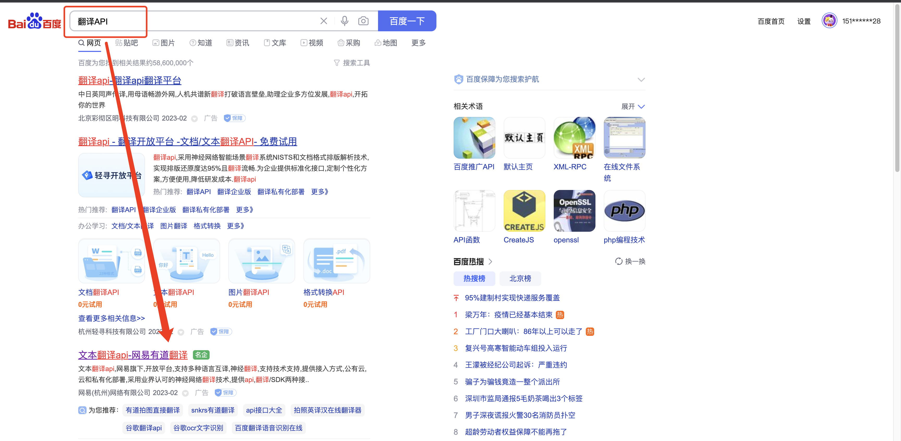


```python
import requests

while 1:
    kd = input("请输入翻译内容:")
    res = requests.post("https://aidemo.youdao.com/trans", data={
        "q": kd.strip()
    })

    # print(res.text)
    print(res.json()["web"][0]["value"])
```

### 【4】Cookie与Session

**（1）cookie的玩法**


```python
# server.py
from flask import Flask, request, make_response, render_template
import json

app = Flask(__name__, template_folder="temps")

COOKIE = "sadfnwejfnfcvxwerw213kbnkj2k3j23234jk2k"


@app.route("/login")
def login():
    return render_template("login.html")


@app.route("/auth", methods=['POST'])
def auth():
    user = request.form.get("user")
    pwd = request.form.get("pwd")
    if user == "yuan" and pwd == "123":
        # 设置响应体
        resp = make_response("登录成功")
        resp.set_cookie("cookie", COOKIE)
        return resp
    else:
        print("OK")
        return "登录失败！"


@app.route("/")
def index():
    return render_template("index.html")


@app.route("/books")
def books():
    print(request.cookies.get("cookie"))
    if request.cookies.get("cookie") == COOKIE:

        data = ["西游记", "三国演义", "水浒传", "金瓶梅"]
        return json.dumps(data, ensure_ascii=False)
    else:
        return "认证失败，请重新登录！"


if __name__ == '__main__':
    app.run()  # 默认端口号

```

````html
# index.html
<!DOCTYPE html>
<html lang="en">
<head>
    <meta charset="UTF-8">
    <title>Title</title>
    <script src="https://cdn.bootcdn.net/ajax/libs/jquery/3.5.1/jquery.js"></script>
</head>
<body>

<h1>四大名著</h1>
<p class="content"></p>

<script>
    $.ajax({
        url: "/books",
        success: function (res) {
            console.log(res)
            $(".content").html(res)
        }
    })
</script>
</body>
</html>
````

**（2）爬虫的cookie应用**

```python
# 请求cookie
requests.get(url="", headers={}, cookies={})
# 响应cookie
print(respone.cookies)
print(respone.cookies.get_dict())
print(respone.cookies.items())
```

session对象:该对象和requests模块用法几乎一致.如果在请求的过程中产生了cookie,如果该请求使用session发起的,则cookie会被自动存储到session中.

```python
import requests

headers = {
    'User-Agent': 'Mozilla/5.0 (Windows NT 10.0; Win64; x64) AppleWebKit/537.36 (KHTML, like Gecko) Chrome/109.0.0.0 Safari/537.36',
}

# 获取从服务器端响应的cookie
url = 'https://xueqiu.com/'
res = requests.get(url, headers=headers)
cookies = dict(res.cookies)
url = 'https://stock.xueqiu.com/v5/stock/batch/quote.json?symbol=SH000001,SZ399001,SZ399006,SH000688,SH000016,SH000300,BJ899050,HKHSI,HKHSCEI,HKHSTECH,.DJI,.IXIC,.INX'
res = requests.get(url, headers=headers, cookies=cookies)
# print(res.json())
print(res.content.decode())

```

**（2）session对象**

```python
import requests

headers = {
    'User-Agent': 'Mozilla/5.0 (Windows NT 10.0; Win64; x64) AppleWebKit/537.36 (KHTML, like Gecko) Chrome/109.0.0.0 Safari/537.36',
}

# 获取从服务器端响应的cookie
url = 'https://xueqiu.com/'
session = requests.session()
session.get(url, headers=headers)
url = 'https://stock.xueqiu.com/v5/stock/batch/quote.json?symbol=SH000001,SZ399001,SZ399006,SH000688,SH000016,SH000300,BJ899050,HKHSI,HKHSCEI,HKHSTECH,.DJI,.IXIC,.INX'
res = session.get(url, headers=headers)
print(res.json())
```

### 【5】代理IP

**代理IP：**反反爬使用代理ip是非常必要的一种反反爬的方式，但是即使使用了代理ip，对方服务器任然会有很多的方式来检测我们是否是一个爬虫，比如：一段时间内，检测IP访问的频率，访问太多频繁会屏蔽；检查Cookie，User-Agent，Referer等header参数，若没有则屏蔽；服务方购买所有代理提供商，加入到反爬虫数据库里，若检测是代理则屏蔽等。所以更好的方式在使用代理ip的时候使用随机的方式进行选择使用，不要每次都用一个代理ip

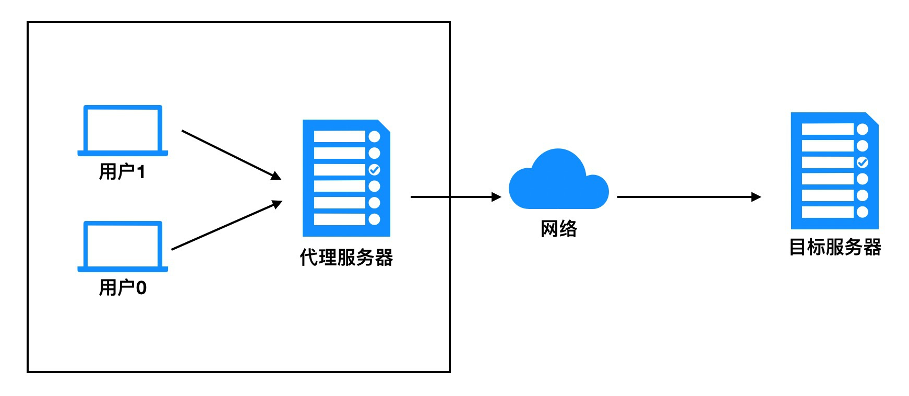

````python
res = requests.get("http://httpbin.org/ip",
                   proxies={
                       "http": "101.132.25.152:50001"
                   }
                   )

print(res.text)
````

**代理ip池的更新：**购买的代理ip很多时候大部分(超过60%)可能都没办法使用，这个时候就需要通过程序去检测哪些可用，把不能用的删除掉。

免费代理IP：https://www.kuaidaili.com/free/inha/

## 4.2、爬虫案例

### 【1】下载电影封面

```python
import random
import time
import requests

# https://movie.douban.com/explore

headers = {
    'User-Agent': 'Mozilla/5.0 (Windows NT 10.0; Win64; x64) AppleWebKit/537.36 (KHTML, like Gecko) Chrome/109.0.0.0 Safari/537.36',
    'Referer': 'https://movie.douban.com/explore',
}
url = 'https://m.douban.com/rexxar/api/v2/movie/recommend?refresh=0&start=0&count=20&selected_categories=%7B%7D&uncollect=false&tags=&ck=DvZ3'
res = requests.get(url, headers=headers)
items = res.json()['items']

# 循环获取下载
i = 0
for m in items:
    title = m["title"]
    # 进行图片的下载
    res = requests.get(m['pic']['large'], headers=headers)
    with open(f'./imgs/{title}.jpg', 'wb') as f:
        f.write(res.content)
    print(title, '下载完成！')
    # 给一个自省时间 防止给服务器造成太大的压力 避免服务器崩溃或者当前被封
    time.sleep(random.randint(1, 4))
    i += 1
```

练习：下载桌面图片：`http://www.netbian.com/desk/30360-1920x1080.htm`

### 【2】爬取小说网的小说

`第一版`

```python
import requests

headers = {
    'User-Agent': 'Mozilla/5.0 (Windows NT 10.0; Win64; x64) AppleWebKit/537.36 (KHTML, like Gecko) Chrome/109.0.0.0 Safari/537.36',
}

# 发送登陆处理接口的url地址
url = 'https://passport.17k.com/ck/user/login'
# 传递给服务器端的数据
data = {
    'loginName': '13121758648',
    'password': 'yuan0316'
}
session = requests.Session()
session.post(url, headers=headers, data=data)

# 抓取登录后的数据
url = 'https://user.17k.com/ck/author/shelf?page=1&appKey=2406394919'
res = session.get(url, headers=headers)

# 获取书架上的所有书籍
shelf_books = res.json().get("data")
print(shelf_books)

```

`第二版`

```python
import requests
from lxml import etree
import os
import time

headers = {
    'User-Agent': 'Mozilla/5.0 (Windows NT 10.0; Win64; x64) AppleWebKit/537.36 (KHTML, like Gecko) Chrome/109.0.0.0 Safari/537.36',
}

# 发送登陆处理接口的url地址
url = 'https://passport.17k.com/ck/user/login'
# 传递给服务器端的数据
data = {
    'loginName': '13121758648',
    'password': 'yuan0316'
}
session = requests.Session()
session.post(url, headers=headers, data=data)

# 抓取登录后的数据
url = 'https://user.17k.com/ck/author/shelf?page=1&appKey=2406394919'
res = session.get(url, headers=headers)

# 获取书架上的所有书籍
shelf_books = res.json().get("data")
# print(shelf_books)

if not os.path.exists("shelf_books"):
    os.mkdir("shelf_books")

for book in shelf_books:
    # print(book)
    # print(book["bookId"])
    bookName = book["bookName"]
    bookId = book["bookId"]
    res = requests.get(f"https://www.17k.com/list/{bookId}.html")
    res.encoding = "utf8"
    selector = etree.HTML(res.text)
    chapter_links = selector.xpath('//dl[@class="Volume"][last()]/dd/a')

    os.mkdir("./shelf_books/" + bookName)

    for chapter_link in chapter_links:
        chapter_name = chapter_link.xpath("./span/text()")[0].strip()
        chapter_href = chapter_link.xpath("./@href")[0]
        print(chapter_name, chapter_href)

        res = requests.get(f"https://www.17k.com" + chapter_href)
        res.encoding = "utf8"
        selector = etree.HTML(res.text)
        ret = selector.xpath('//div[contains(@class,"content")]/div[@class="p"]/p[position()<last()-1]/text()')
        print(ret)
        path = os.path.join("shelf_books", bookName, chapter_name)
        with open(path, "w") as f:
            for line in ret:
                f.write(line + "\n")

        time.sleep(1)
        print(f"{chapter_name}下载完成！")
```

`第三版[函数]`

```python
import requests
from lxml import etree
import os
import time
import random

headers = {
    'User-Agent': 'Mozilla/5.0 (Windows NT 10.0; Win64; x64) AppleWebKit/537.36 (KHTML, like Gecko) Chrome/109.0.0.0 Safari/537.36',
}


def login():
    # 发送登陆处理接口的url地址
    login_url = 'https://passport.17k.com/ck/user/login'

    # 传递给服务器端的数据
    data = {
        'loginName': '13121758648',
        'password': 'yuan0316'
    }

    session.post(login_url, headers=headers, data=data)


def get_shelf_books():
    # 抓取登录后的数据
    url = 'https://user.17k.com/ck/author/shelf?page=1&appKey=2406394919'
    res = session.get(url, headers=headers)
    # 获取书架上的所有书籍
    shelf_books = res.json().get("data")
    return shelf_books


def get_book_chapter_links(book):
    # print(book)
    # print(book["bookId"])
    bookName = book["bookName"]
    bookId = book["bookId"]
    res = requests.get(f"https://www.17k.com/list/{bookId}.html")
    res.encoding = "utf8"
    selector = etree.HTML(res.text)
    chapter_links = selector.xpath('//dl[@class="Volume"][last()]/dd/a')
    return bookName, chapter_links


def get_book_chapter_texts(book_name, chapter_links):
    book_path = os.path.join("my_shelf_books", book_name)
    if not os.path.exists(book_path):
        os.mkdir(book_path)

    for chapter_link in chapter_links:
        chapter_name = chapter_link.xpath("./span/text()")[0].strip()
        chapter_href = chapter_link.xpath("./@href")[0]
        print(chapter_name, chapter_href)

        res = requests.get(f"https://www.17k.com" + chapter_href)
        res.encoding = "utf8"
        selector = etree.HTML(res.text)
        ret_text = selector.xpath('//div[contains(@class,"content")]/div[@class="p"]/p[position()<last()-1]/text()')
        print(ret_text)

        download_chapter_text(book_name, chapter_name, ret_text)


def download_chapter_text(book_name, chapter_name, ret_text):
    path = os.path.join("my_shelf_books", book_name, chapter_name)
    with open(path, "w") as f:
        for line in ret_text:
            f.write(line + "\n")

    time.sleep(random.randint(1, 5))
    print(f"{book_name}的{chapter_name} 下载完成！")


if __name__ == '__main__':
    # 构建session对象
    session = requests.Session()
    # 模拟登录
    login()
    # 获取登录人的书架上的所有书籍
    shelf_books = get_shelf_books()

    # 创建my_shelf_books文件夹
    if not os.path.exists("my_shelf_books"):
        os.mkdir("my_shelf_books")

    for book in shelf_books:
        bookName, chapter_links = get_book_chapter_links(book)
        # 抓取并下载每一章文本
        get_book_chapter_texts(bookName, chapter_links)

```

## 4.3、websockets模块

[新浪财经](https://finance.sina.com.cn/realstock/company/sh000001/nc.shtml)

Websocket（简称：ws）是web前端HTML5提供的一种浏览器与服务器进行全双工通讯的网络技术，属于应用层协议，它基于TCP协议开发而来，并复用HTTP的握手通道。

> 1. 调用简单，由浏览器进行了封装提供强大的操作接口，直接使用浏览器的websocket对象即可通过事件与服务端进行websocket通信。
> 2. 支持二进制，
> 3. 支持双向通信, 更灵活, 更实时性， 更高效，可扩展性更好

爬虫也经常会遇到websocket协议下的请求数据，我们通过websockets来实现相关爬虫。

```python
import websockets
import asyncio
import ssl
import certifi

ssl_context = ssl.create_default_context()
ssl_context.load_verify_locations(certifi.where())


# https://finance.sina.com.cn/realstock/company/sh000001/nc.shtml
async def main():
    url = "wss://hq.sinajs.cn/wskt?list=sh000001"
    # extra_headers给ws 传递请求头.
    async with websockets.connect(url, extra_headers={
        "Origin": "https://finance.sina.com.cn",
        "User-Agent": "Mozilla/5.0 (Windows NT 10.0; Win64; x64) AppleWebKit/537.36 (KHTML, like Gecko) Chrome/110.0.0.0 Safari/537.36"
    }, ssl=ssl_context) as ws:
        await ws.send("")
        ret = await ws.recv()
        print(ret)


if __name__ == '__main__':
    asyncio.run(main())

```


# 第五章. 并发爬虫

````
1. 并发与并行
2. IO密集型任务和计算密集型任务
3. 同步与异步
4. IO模型（IO多路复用）
5. 内核态多线程，用户态多线程
````

所谓并发编程是指在一台处理器上“同时”处理多个任务。并发是在同一实体上的多个事件**。强调多个事件在同一时间间隔发生。**

## 1、进程、线程以及协程

### 【1】进程概念

我们都知道计算机的核心是CPU，它承担了所有的计算任务；而操作系统是计算机的管理者，它负责任务的调度、资源的分配和管理，统领整个计算机硬件；应用程序则是具有某种功能的程序，程序是运行于操作系统之上的。

> 进程是一个具有一定独立功能的程序在一个数据集上的一次动态执行的**过程**，是操作系统进行资源分配和调度的一个独立单位，是应用程序运行的载体。

多道技术：空间复用+时间复用，于是有了进程！

进程是一种抽象的概念，从来没有统一的标准定义。进程一般由程序、数据集合和进程控制块三部分组成。

````
例子：我和我的女朋友们的故事

我就是CPU，我跟三个女朋友玩就是三个任务

1. 我教第一个女朋友做菜，菜谱就是程序，食材就是数据，我做饭的过程就是一个进程（切换，状态保存）

2. 我给第二个女朋友治疗脚伤，医疗手册就是程序，医药箱就是数据，治疗脚伤的过程就是第二个进程

。。。

````

[进程](https://baike.baidu.com/item/进程/382503?fromModule=lemma_inlink)状态反映进程执行过程的变化。这些状态随着进程的执行和外界条件的变化而转换。在三态模型中，进程状态分为三个基本状态，即运行态，就绪态，阻塞态。在五态模型中，进程分为[新建](https://baike.baidu.com/item/新建/6015276?fromModule=lemma_inlink)态、终止态，运行态，就绪态，阻塞态。

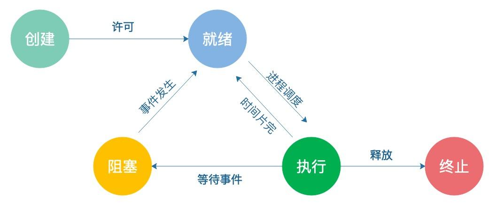

### 【2】线程的概念

在早期的操作系统中并没有线程的概念，进程是能拥有资源和独立运行的最小单位，也是程序执行的最小单位。任务调度采用的是时间片轮转的抢占式调度方式，而进程是任务调度的最小单位，每个进程有各自独立的一块内存，使得各个进程之间内存地址相互隔离。后来，随着计算机的发展，对CPU的要求越来越高，进程之间的切换开销较大，已经无法满足越来越复杂的程序的要求了。于是就发明了线程。

线程是程序执行中一个单一的顺序控制流程，是程序执行流的最小单元，是处理器调度和分派的基本单位。

一个进程可以有一个或多个线程，各个线程之间共享程序的内存空间(也就是所在进程的内存空间)。一个标准的线程由线程ID、当前指令指针(PC)、寄存器和堆栈组成。而进程由内存空间(代码、数据、进程空间、打开的文件)和一个或多个线程组成。

#### 线程的生命周期

当线程的数量小于处理器的数量时，线程的并发是真正的并发，不同的线程运行在不同的处理器上。但当线程的数量大于处理器的数量时，线程的并发会受到一些阻碍，此时并不是真正的并发，因为此时至少有一个处理器会运行多个线程。

在单个处理器运行多个线程时，并发是一种模拟出来的状态。操作系统采用时间片轮转的方式轮流执行每一个线程。现在，几乎所有的现代操作系统采用的都是时间片轮转的抢占式调度方式，如我们熟悉的Unix、Linux、Windows及macOS等流行的操作系统。

我们知道线程是程序执行的最小单位，也是任务执行的最小单位。在早期只有进程的操作系统中，进程有五种状态，创建、就绪、运行、阻塞(等待)、退出。早期的进程相当于现在的只有单个线程的进程，那么现在的多线程也有五种状态，现在的多线程的生命周期与早期进程的生命周期类似。

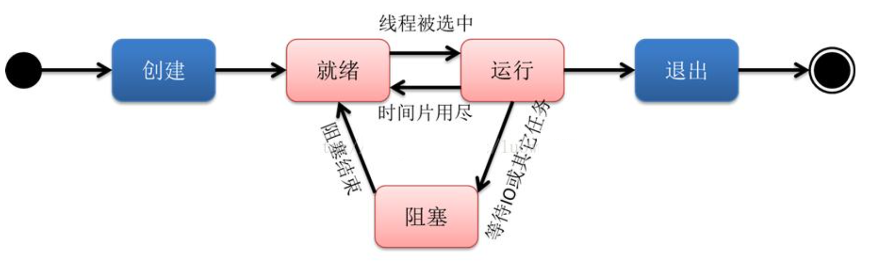

```python 
线程的生命周期

# 创建：一个新的线程被创建，等待该线程被调用执行；
# 就绪：时间片已用完，此线程被强制暂停，等待下一个属于它的时间片到来；
# 运行：此线程正在执行，正在占用时间片；
# 阻塞：也叫等待状态，等待某一事件(如IO或另一个线程)执行完；
# 退出：一个线程完成任务或者其他终止条件发生，该线程终止进入退出状态，退出状态释放该线程所分配的资源。
```

#### 进程与线程的区别

前面讲了进程与线程，但可能你还觉得迷糊，感觉他们很类似。的确，进程与线程有着千丝万缕的关系，下面就让我们一起来理一理：

> 1. 线程是程序执行的最小单位，而进程是操作系统分配资源的最小单位；
> 2. 一个进程由一个或多个线程组成，线程是一个进程中代码的不同执行路线；
> 3. 进程之间相互独立，但同一进程下的各个线程之间共享程序的内存空间(包括代码段、数据集、堆等)及一些进程级的资源(如打开文件和信号)，某进程内的线程在其它进程不可见；
> 4. 调度和切换：线程上下文切换比进程上下文切换要快得多。

### 【3】协程(Coroutines)

[协程](https://so.csdn.net/so/search?q=协程&spm=1001.2101.3001.7020)（Co-routine），也可称为微线程，或非抢占式的多任务子例程，一种用户态的上下文切换技术（通过一个线程实现代码块间的相互切换执行）。这种由程序员自己写程序来管理的轻量级线程叫做『用户空间线程』，具有对内核来说不可见的特性。正如一个进程可以拥有多个线程一样，一个线程也可以拥有多个协程。

> 协程解决的是线程的切换和内存开销的问题

```js
* 用户空间 首先是在用户空间, 避免内核态和用户态的切换导致的成本。
* 由语言或者框架层调度
* 更小的栈空间允许创建大量实例（百万级别）
```

## 2、多线程实现

### 【1】threading模块

Python提供两个模块进行多线程的操作，分别是`thread`和`threading`，前者是比较低级的模块，用于更底层的操作，一般应用级别的开发不常用。

````python
import time


def foo():
    print("foo start...")
    time.sleep(5)
    print("foo end...")


def bar():
    print("bar start...")
    time.sleep(3)
    print("bar end...")


# 串行版本
# start = time.time()
# foo()
# bar()
# end = time.time()
# print("cost timer:", end - start)

# 多线程并发版本

import threading

start = time.time()
t1 = threading.Thread(target=foo, args=())
t1.start()
t2 = threading.Thread(target=bar, args=())
t2.start()

# 等待所有子线程结束
# t1.join()  # 等待子线程t1
# t2.join()  # 等待子线程t2
end = time.time()
print(end - start)

````

### 【2】互斥锁

````python
import time
import threading

Lock = threading.Lock()


def addNum():
    global num  # 在每个线程中都获取这个全局变量

    # 上锁
    Lock.acquire()
    t = num - 1
    time.sleep(0.0001)
    num = t
    Lock.release()
    # 放锁


num = 100  # 设定一个共享变量

thread_list = []

for i in range(100):
    t = threading.Thread(target=addNum)
    t.start()
    thread_list.append(t)

for t in thread_list:  # 等待所有线程执行完毕
    t.join()

print('Result: ', num)

````

### 【3】线程池

系统启动一个新线程的成本是比较高的，因为它涉及与操作系统的交互。在这种情形下，使用线程池可以很好地提升性能，尤其是当程序中需要创建大量生存期很短暂的线程时，更应该考虑使用线程池。

线程池在系统启动时即创建大量空闲的线程，程序只要将一个函数提交给线程池，线程池就会启动一个空闲的线程来执行它。当该函数执行结束后，该线程并不会死亡，而是再次返回到线程池中变成空闲状态，等待执行下一个函数。

此外，使用线程池可以有效地控制系统中并发线程的数量。当系统中包含有大量的并发线程时，会导致系统性能急剧下降，甚至导致解释器崩溃，而线程池的最大线程数参数可以控制系统中并发线程的数量不超过此数。

```python
import time
from concurrent.futures import ThreadPoolExecutor


def task(i):
    print(f'任务{i}开始！')
    time.sleep(i)
    print(f'任务{i}结束！')
    return i


start = time.time()
pool = ThreadPoolExecutor(3)

future01 = pool.submit(task, 1)
# print("future01是否结束", future01.done())
# 当程序使用 Future 的 result() 方法来获取结果时，该方法会阻塞当前线程，如果没有指定 timeout 参数，当前线程将一直处于阻塞状态，直到 Future 代表的任务返回。
# print("future01的结果", future01.result())  # 同步等待
future02 = pool.submit(task, 2)
future03 = pool.submit(task, 3)
pool.shutdown()  # 阻塞等待
print(f"程序耗时{time.time() - start}秒钟")

print("future01的结果", future01.result())
print("future02的结果", future02.result())
print("future03的结果", future03.result())
```

> 使用线程池来执行线程任务的步骤如下：
>
> 1. 调用 ThreadPoolExecutor 类的构造器创建一个线程池。
> 2. 定义一个普通函数作为线程任务。
> 3. 调用 ThreadPoolExecutor 对象的 submit() 方法来提交线程任务。
> 4. 当不想提交任何任务时，调用 ThreadPoolExecutor 对象的 shutdown() 方法来关闭线程池。

### 【4】线程应用

```python
import requests
from lxml import etree
import os
import asyncio
import time
import threading


def get_img_urls():
    res = requests.get("https://www.pkdoutu.com/photo/list/", headers={
        "User-Agent": "Mozilla/5.0 (Macintosh; Intel Mac OS X 10_15_7) AppleWebKit/537.36 (KHTML, like Gecko) Chrome/110.0.0.0 Safari/537.36"
    })
    
    selector = etree.HTML(res.text)
    img_urls = selector.xpath('//li[@class="list-group-item"]/div/div/a/img[@data-backup]/@data-backup')

    print(img_urls)
    return img_urls


def save_img(url):
    res = requests.get(url)
    name = os.path.basename(url)
    with open("imgs/" + name, "wb") as f:
        f.write(res.content)
    print(f"{name}下载完成！")


def main():
    img_urls = get_img_urls()
    # 串行
    [save_img(url) for url in img_urls]
    # 协程并发
    t_list = []
    for url in img_urls:
        t = threading.Thread(target=save_img, args=(url,))
        t.start()
        t_list.append(t)

    for t in t_list:
        t.join()


if __name__ == '__main__':
    start = time.time()
    main()
    end = time.time()
    print(end - start)

```

> 针对IO密集型任务，Python多线程可以发挥出不错的并发作用

## 3、多进程实现

由于GIL的存在，python中的多线程其实并不是真正的多线程，如果想要充分地使用多核CPU的资源，在python中大部分情况需要使用多进程。

multiprocessing包是Python中的多进程管理包。与threading.Thread类似，它可以利用multiprocessing.Process对象来创建一个进程。该进程可以运行在Python程序内部编写的函数。该Process对象与Thread对象的用法相同，也有start(), run(), join()的方法。此外multiprocessing包中也有Lock/Event/Semaphore/Condition类 (这些对象可以像多线程那样，通过参数传递给各个进程)，用以同步进程，其用法与threading包中的同名类一致。所以，multiprocessing的很大一部份与threading使用同一套API，只不过换到了多进程的情境。

python的进程调用:

```python
import multiprocessing
import time


def foo():
    print("foo start...")
    time.sleep(5)
    print("foo end...")


def bar():
    print("bar start...")
    time.sleep(3)
    print("bar end...")


if __name__ == '__main__':
  
    start = time.time()
    t1 = multiprocessing.Process(target=foo, args=())
    t1.start()
    t2 = multiprocessing.Process(target=bar, args=())
    t2.start()

    # 等待所有子线程结束
    t1.join()  # 等待子线程t1
    t2.join()  # 等待子线程t2
    end = time.time()
    print(end - start)

```

## 4、协程实现

协程，又称微线程，纤程。英文名Coroutine。一句话说明什么是线程：协程是一种用户态的轻量级线程。

协程拥有自己的寄存器上下文和栈。协程调度切换时，将寄存器上下文和栈保存到其他地方，在切回来的时候，恢复先前保存的寄存器上下文和栈。因此：

协程能保留上一次调用时的状态（即所有局部状态的一个特定组合），每次过程重入时，就相当于进入上一次调用的状态，换种说法：进入上一次离开时所处逻辑流的位置。

### 【1】yield与协程

```python
def foo():
    print("OK1")
    yield 100  # 切换: 保存/恢复的功能
    print("OK2")
    yield 1000


def bar():
    print("OK3")
    yield 200
    print("OK4")
    yield 2000


gen = foo()
ret = next(gen)    # gen.__next__()
print(ret)

gen2 = bar()
ret2 = next(gen2)  # gen.__next__()
print(ret2)

ret = next(gen)    # gen.__next__()
print(ret)

ret2 = next(gen2)  # gen.__next__()
print(ret2)
```

### 【2】asyncio模块

asyncio即Asynchronous I/O是python一个用来处理并发(concurrent)事件的包，是很多python异步架构的基础，多用于处理高并发网络请求方面的问题。

为了简化并更好地标识异步IO，从[Python](http://www.zzvips.com/article/123934.html) 3.5开始引入了新的语法[async](http://www.zzvips.com/article/98814.html)和[await](http://www.zzvips.com/article/120838.html)，可以让coroutine的代码更简洁易读。

asyncio 被用作多个提供高性能 Python 异步框架的基础，包括网络和网站服务，数据库连接库，分布式任务队列等等。

asyncio 往往是构建 IO 密集型和高层级 **结构化** 网络代码的最佳选择。

```python
import asyncio


async def task(i):
    print(f"task {i} start")
    await asyncio.sleep(1)
    print(f"task {i} end")


# 创建事件循环对象
loop = asyncio.get_event_loop()
# 直接将协程对象加入时间循环中
tasks = [task(1), task(2)]
# asyncio.wait:将协程任务进行收集，功能类似后面的asyncio.gather
# run_until_complete阻塞调用，直到协程全部运行结束才返回
loop.run_until_complete(asyncio.wait(tasks))
loop.close()

```

`task`: 任务,对**协程对象**的进一步封装,包含任务的各个状态;asyncio.Task是Future的一个子类，用于实现协作式多任务的库，且Task对象不能用户手动实例化，通过下面2个函数`loop.create_task() 或 asyncio.ensure_future()`创建。

```python
import asyncio, time


async def work(i, n):  # 使用async关键字定义异步函数
    print('任务{}等待: {}秒'.format(i, n))
    await asyncio.sleep(n)  # 休眠一段时间
    print('任务{}在{}秒后返回结束运行'.format(i, n))
    return i + n


start_time = time.time()  # 开始时间

tasks = [asyncio.ensure_future(work(1, 1)),
         asyncio.ensure_future(work(2, 2)),
         asyncio.ensure_future(work(3, 3))]

loop = asyncio.get_event_loop()
loop.run_until_complete(asyncio.wait(tasks))
loop.close()

print('运行时间: ', time.time() - start_time)
for task in tasks:
    print('任务执行结果: ', task.result())
```

### 【3】3.8版本+

> `async.run()` 运行协程
> `async.create_task()`创建task
> `async.gather()`获取返回值

```python
import asyncio, time

async def work(i, n):  # 使用async关键字定义异步函数
    print('任务{}等待: {}秒'.format(i, n))
    await asyncio.sleep(n)  # 休眠一段时间
    print('任务{}在{}秒后返回结束运行'.format(i, n))
    return i + n


tasks = []
async def main():
    global tasks
    tasks = [asyncio.create_task(work(1, 1)),
             asyncio.create_task(work(2, 2)),
             asyncio.create_task(work(3, 3))]

    await asyncio.wait(tasks) # 阻塞


start_time = time.time()  # 开始时间
asyncio.run(main())
print('运行时间: ', time.time() - start_time)
for task in tasks:
    print('任务执行结果: ', task.result())

```

> asyncio.create_task() 函数在 Python 3.7 中被加入。

`asyncio.gather`方法

```python
# 用gather()收集返回值

import asyncio, time


async def work(i, n):  # 使用async关键字定义异步函数
    print('任务{}等待: {}秒'.format(i, n))
    await asyncio.sleep(n)  # 休眠一段时间
    print('任务{}在{}秒后返回结束运行'.format(i, n))
    return i + n


async def main():
    tasks = [asyncio.create_task(work(1, 1)),
             asyncio.create_task(work(2, 2)),
             asyncio.create_task(work(3, 3))]

    # 将task作为参数传入gather，等异步任务都结束后返回结果列表
    response = await asyncio.gather(tasks[0], tasks[1], tasks[2])
    print("异步任务结果：", response)


start_time = time.time()  # 开始时间

asyncio.run(main())

print('运行时间: ', time.time() - start_time)
```

### 【4】aiohttp

我们之前学习过爬虫最重要的模块requests，但它是阻塞式的发起请求，每次请求发起后需阻塞等待其返回响应，不能做其他的事情。本文要介绍的aiohttp可以理解成是和requests对应Python异步网络请求库，它是基于 asyncio 的异步模块，可用于实现异步爬虫，有点就是更快于 requests 的同步爬虫。安装方式，pip install aiohttp。

aiohttp是一个为Python提供异步HTTP 客户端/服务端编程，基于`asyncio`的异步库。asyncio可以实现单线程并发IO操作，其实现了TCP、UDP、SSL等协议，aiohttp就是基于asyncio实现的http框架。

````python
import aiohttp
import asyncio

async def main():
    async with aiohttp.ClientSession() as session:
        async with session.get("http://httpbin.org/headers") as response:
            print(await response.text())

asyncio.run(main())
````

### 【5】应用案例（异步爬虫）

#### （1）异步爬取斗图网

```python
import aiohttp
import asyncio
import os
from lxml import etree
import time

headers = {
    "User-Agent": "Mozilla/5.0 (Macintosh; Intel Mac OS X 10_15_7) AppleWebKit/537.36 (KHTML, like Gecko) Chrome/110.0.0.0 Safari/537.36"
}


async def get_img_urls():
    url = "https://www.pkdoutu.com/photo/list/"
    async with aiohttp.ClientSession() as session:
        async with session.get(url, headers=headers, ssl=False) as resp:
            text = await resp.content.read()

            selector = etree.HTML(text)
            img_urls = selector.xpath('//li[@class="list-group-item"]/div/div/a/img[@data-backup]/@data-backup')

            return img_urls


async def async_download(url):
    name = os.path.basename(url)
    async with aiohttp.ClientSession() as session:
        async with session.get(url, ssl=False) as resp:
            # 将得到的请求保存到文件中
            with open(f"imgs/{name}.jpg", "wb") as f:
                f.write(await resp.content.read())


async def main():
    tasks = [asyncio.create_task(async_download(url)) for url in await get_img_urls()]
    await asyncio.wait(tasks)


if __name__ == '__main__':
    start = time.time()
    asyncio.run(main())
    print(time.time() - start)

```

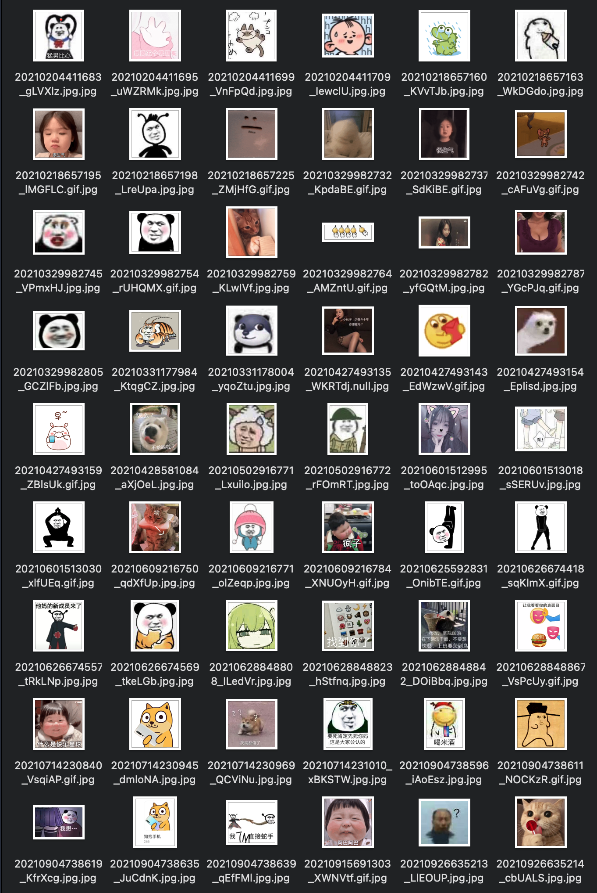

####  （2）异步爬取m3u8视频

**m3u8串行爬取版本**

```python
import requests
import re
import os

session = requests.Session()

# (1) 爬取m3u8文件的链接
url = "https://www.9tata.cc/play/14999-1-0.html"
headers = {
    'user-agent': 'Mozilla/5.0 (Windows NT 10.0; Win64; x64) AppleWebKit/537.36 (KHTML, like Gecko) Chrome/109.0.0.0 Safari/537.36'
}
res = session.get(url, headers=headers, verify=False)

m3u8_link = re.search('now="(.*?m3u8)"', res.text).group(1)
print(m3u8_link)  # https://ikcdn01.ikzybf.com/20221015/ecMSO74h/index.m3u8
# 顺便抓一个名字
name = re.search(r'<td class="col2 hidden-xs">(?P<name>\w+)</td>', res.text).group("name")
print("name", name)
# (2) 爬取m3u8文件
res = session.get(m3u8_link)
print(res.text.split("\n")[-1])

m3u8_detail_link = os.path.join(os.path.dirname(m3u8_link), res.text.split("\n")[-1])
print(m3u8_detail_link)

# (3) 爬取m3u8具体文件
res = requests.get(m3u8_detail_link)
print(res.text)

# (4) 解析ts文件
ret = re.findall(r"\n(.*?\.ts)", res.text)
print(ret)

# (5) 下载每一个ts文件
p = os.path.dirname(m3u8_detail_link)
with open(name, "ab") as f:
    for ts in ret:
        path = os.path.join(p, ts)
        res = requests.get(path)
        f.write(res.content)
        print(f"{ts}下载完成！")

```

**m3u8并发爬取版本**

```python
import requests
import re
import os
import aiohttp
import asyncio
import time

headers = {
    'user-agent': 'Mozilla/5.0 (Windows NT 10.0; Win64; x64) AppleWebKit/537.36 (KHTML, like Gecko) Chrome/109.0.0.0 Safari/537.36'
}


async def get_m3u8_link():
    # (1) 爬取m3u8文件的链接
    url = "https://www.9tata.cc/play/14999-1-0.html"

    async with aiohttp.ClientSession() as session:
        async with session.get(url, headers=headers, ssl=False) as response:
            res = await response.text()

            m3u8_link = re.search('now="(.*?m3u8)"', res).group(1)
            print(m3u8_link)  # https://ikcdn01.ikzybf.com/20221015/ecMSO74h/index.m3u8
            # 顺便抓一个名字
            name = re.search(r'<td class="col2 hidden-xs">(?P<name>\w+)</td>', res).group("name")
            print("name", name)
            return m3u8_link, name


async def get_m3u8_detail_link(m3u8_link):
    # (2) 爬取m3u8文件
    async with aiohttp.ClientSession() as session:
        async with session.get(m3u8_link, headers=headers, ssl=False) as response:
            res = await response.text()
            m3u8_detail_link = os.path.join(os.path.dirname(m3u8_link), res.split("\n")[-1])
            print(m3u8_detail_link)
            return m3u8_detail_link


async def parse_ts(m3u8_detail_link):
    # (3) 爬取m3u8具体文件
    async with aiohttp.ClientSession() as session:
        async with session.get(m3u8_detail_link, headers=headers, ssl=False) as response:
            with open("ts文件/index.m3u8", "w") as f:
                res_text = await response.text()
                f.write(res_text)
                # (4) 解析ts文件
                ret = re.findall(r"\n(.*?\.ts)", res_text)
                print(ret)
                return ret


async def download_video(m3u8_detail_link, ts_list):
    p = os.path.dirname(m3u8_detail_link)
    tasks = []
    for ts in ts_list:
        path = os.path.join(p, ts)

        task = asyncio.create_task(download_ts(path, ts))
        tasks.append(task)

    await asyncio.wait(tasks)


async def download_ts(path, ts):
    if not os.path.exists("ts文件"):
        os.mkdir("ts文件")

    async with aiohttp.ClientSession() as session:
        async with session.get(path, ssl=False) as resp:
            # 将得到的请求保存到文件中
            with open("ts文件/" + ts, "wb") as f:
                f.write(await resp.content.read())
            print(f"{ts}下载完成！")


def merge(filename='out'):
    '''
    视频合并
    :return:
    '''
    # 进入到下载后ts 的目录
    os.chdir("ts文件")
    # 视频合并的命令
    os.system(f'ffmpeg -i index.m3u8 -c copy {filename}.mp4')
    print(f'视频{filename} 合并成功====')


async def main():
    m3u8_link, name = await get_m3u8_link()
    m3u8_detail_link = await get_m3u8_detail_link(m3u8_link)
    ts_list = await parse_ts(m3u8_detail_link)
    await download_video(m3u8_detail_link, ts_list)
    merge(name)


if __name__ == '__main__':
    start = time.time()
    asyncio.run(main())
    print(time.time() - start)

```

> 1. 知识点：ffmpeg -i index.m3u8 -c copy apple.mp4
> 2. 知识点：os.system执行终端命令

# 第六章.web自动化

随着互联网的发展，前端技术也在不断变化，数据的加载方式也不再是单纯的服务端渲染了。现在你可以看到很多网站的数据可能都是通过接口的形式传输的，或者即使不是接口那也是一些 JSON 的数据，然后经过 JavaScript 渲染得出来的。

这时，如果你还用 requests 来爬取内容，那就不管用了。因为 requests 爬取下来的只能是服务器端网页的源码，这和浏览器渲染以后的页面内容是不一样的。因为，真正的数据是经过 JavaScript 执行后，渲染出来的，数据来源可能是 Ajax，也可能是页面里的某些 Data，或者是一些 ifame 页面等。不过，大多数情况下极有可能是 Ajax 接口获取的。

所以，很多情况我们需要分析 Ajax请求，分析这些接口的调用方式，通过抓包工具或者浏览器的“开发者工具”，找到数据的请求链接，然后再用程序来模拟。但是，抓包分析流的方式，也存在一定的缺点。因为有些接口带着加密参数，比如 token、sign 等等，模拟难度较大；

那有没有一种简单粗暴的方法，这时 Puppeteer、Pyppeteer、Selenium、Splash 等自动化框架出现了。使用这些框架获取HTML源码，这样我们爬取到的源代码就是JavaScript 渲染以后的真正的网页代码，数据自然就好提取了。同时，也就绕过分析 Ajax 和一些 JavaScript 逻辑的过程。这种方式就做到了可见即可爬，难度也不大，同时适合大批量的采集。

Selenium，作为一款知名的Web自动化测试框架，支持大部分主流浏览器，提供了功能丰富的API接口，常常被我们用作爬虫工具来使用。然而selenium的缺点也很明显，**比如速度太慢、对版本配置要求严苛,最麻烦是经常要更新对应的驱动**。

## 6.1 selenium

### 【1】安装

由于sleenium4.1.0需要python3.7以上方可支持，请注意自己的python版本。

方式一：pip安装
Python3.x安装后就默认就会有pip（pip.exe默认在python的Scripts路径下），打开 cmd，使用pip安装。

> pip install selenium


首次安装会有进度条，而且装出来是多个包（依赖于其他第三方库）。如果安装慢（默认连接官网），可以指定国内源。

> pip install selenium -i https://mirrors.aliyun.com/pypi/simple/

方式一：Pycharm安装

Pycharm-File-Setting-Project:xxxx-Python Interpreter，点击+号

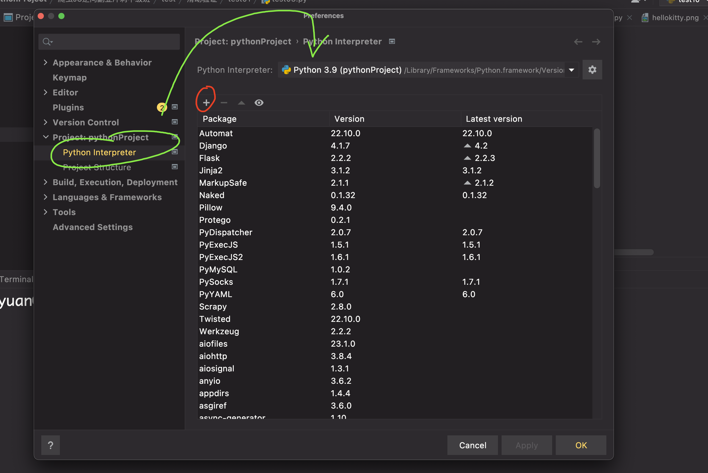

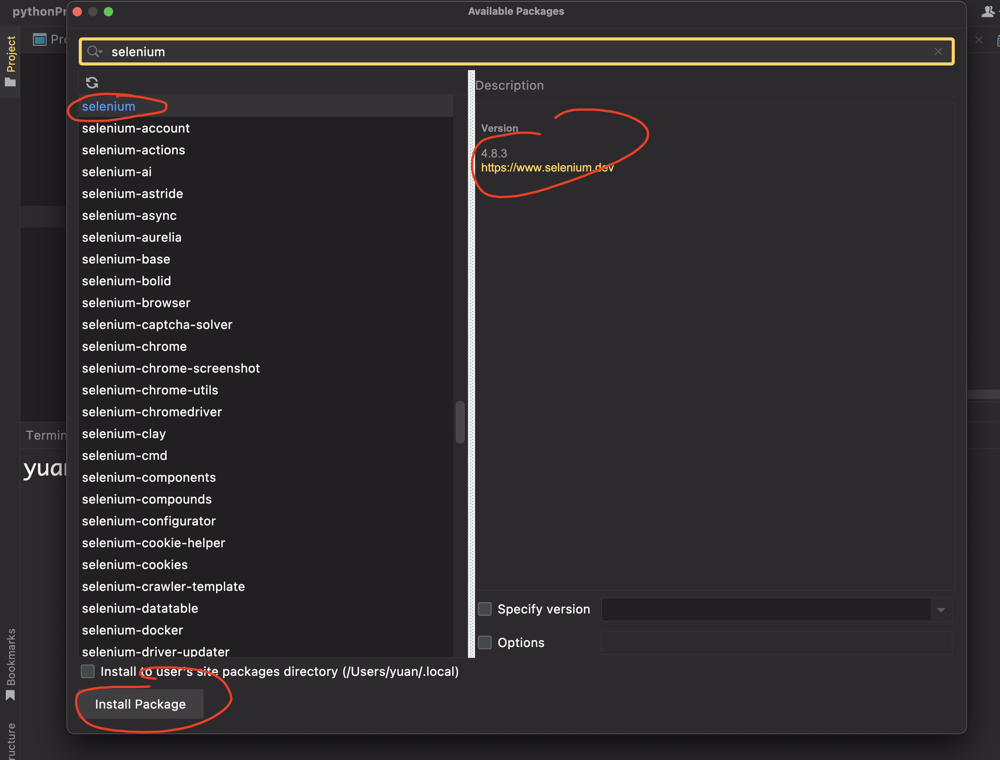

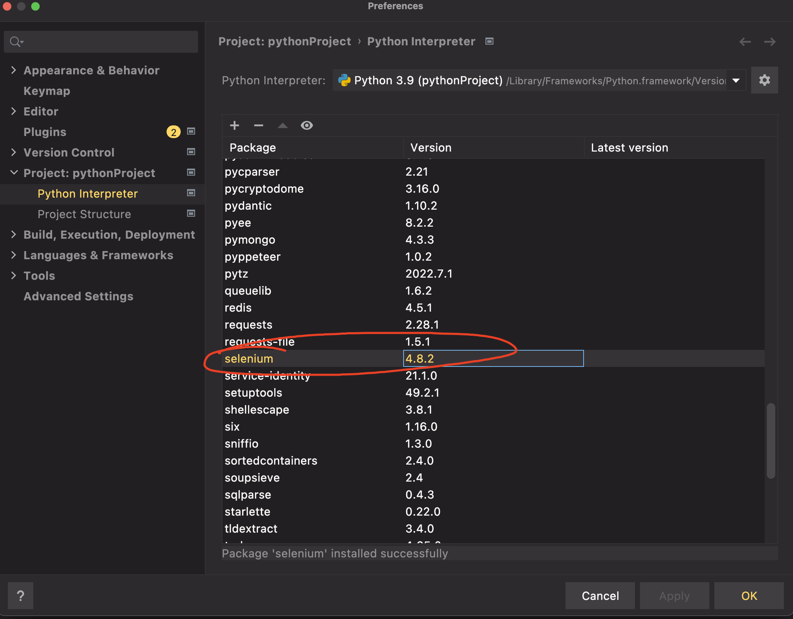

chrome驱动地址:http://chromedriver.storage.googleapis.com/index.html

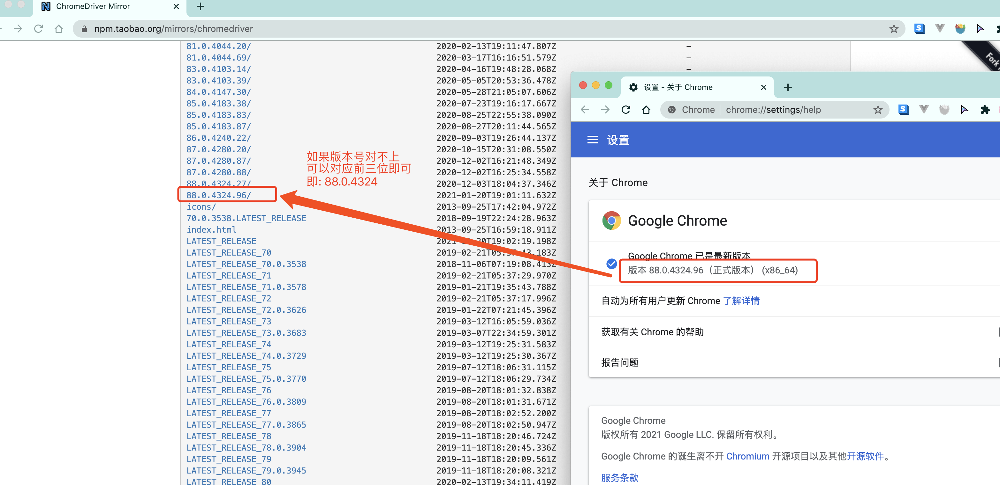

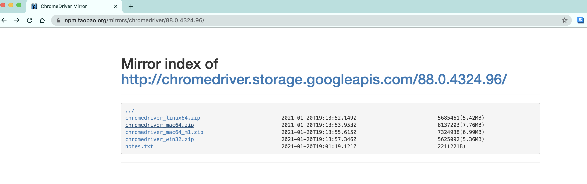

根据你电脑的不同自行选择吧.  win64选win32即可. 把你下载的浏览器驱动放在python解释器所在的文件夹

### 【2】quick start

selenium最初是一个自动化测试工具,而爬虫中使用它主要是为了解决requests无法直接执行JavaScript代码的问题 selenium本质是通过驱动浏览器，完全模拟浏览器的操作，比如跳转、输入、点击、下拉等，来拿到网页渲染之后的结果，可支持多种浏览器

安装pip包

```bash
pip3 install -i https://pypi.tuna.tsinghua.edu.cn/simple selenium
```

案例：

```python
from selenium import webdriver
from selenium.webdriver.common.by import By  # 按照什么方式查找，By.ID,By.CSS_SELECTOR
from selenium.webdriver.common.keys import Keys  # 键盘按键操作
from selenium.webdriver.support import expected_conditions as EC
from selenium.webdriver.support.wait import WebDriverWait  # 等待页面加载某些元素

chrome = webdriver.Chrome()

try:
    chrome.get('https://www.jd.com')
    input_tag = chrome.find_element(By.ID, 'key')
    input_tag.send_keys('hellokitty')
    input_tag.send_keys(Keys.ENTER)
    wait = WebDriverWait(chrome, 10)
    # time.sleep(3)
    wait.until(EC.presence_of_element_located((By.ID, 'J_goodsList')))  # 等到id为J_goodsList的元素加载完毕,最多等10秒
    chrome.save_screenshot("hellokitty.png")

finally:
    chrome.close()

```

### 【3】元素定位

```python
# 方式1
el = driver.find_element_by_xxx(value)
# 方式2: 推荐
from selenium.webdriver.common.by import By
driver.find_element(By.xxx,value)
driver.find_elements(By.xx, value)  # 返回列表
```

八种方式：

````htaccess
 id
 name
 class 
 tag 
 link 
 partial 
 xpath
 css 
````

### 【4】元素操作（节点交互）

Selenium可以驱动浏览器来执行一些操作，也就是说可以让浏览器模拟执行一些动作。比较常见的用法有：输入文字时用`send_keys()`方法，清空文字时用`clear()`方法，点击按钮时用`click()`方法。示例如下：

> find_element方法仅仅能够获取元素对象，接下来就可以对元素执行以下操作 从定位到的元素中提取数据的方法

1. 从定位到的元素中获取数据

```python
el.get_attribute(key)           # 获取key属性名对应的属性值
el.text                        	# 获取开闭标签之间的文本内容
```

2. 对定位到的元素的操作

```python
el.click()                      # 对元素执行点击操作
el.submit()                     # 对元素执行提交操作
el.clear()                      # 清空可输入元素中的数据
el.send_keys(data)              # 向可输入元素输入数据
```

````python
from selenium import webdriver
import time
from selenium.webdriver.common.by import By

browser = webdriver.Chrome()
browser.get('https://www.taobao.com')

q = browser.find_element(By.ID, "q")
q.send_keys('MAC')
time.sleep(1)
q.clear()
q.send_keys('IPhone')
button = browser.find_element(By.CLASS_NAME, "btn-search")
button.click()

````

### 【5】动作链

在上面的实例中，一些交互动作都是针对某个节点执行的。比如，对于输入框，我们就调用它的输入文字和清空文字方法；对于按钮，就调用它的点击方法。其实，还有另外一些操作，它们没有特定的执行对象，比如鼠标拖曳、键盘按键等，这些动作用另一种方式来执行，那就是动作链。

比如，现在实现一个节点的拖曳操作，将某个节点从一处拖曳到另外一处，可以这样实现：

```python
from time import sleep
from selenium import webdriver
from selenium.webdriver import ActionChains
from selenium.webdriver.common.by import By

driver = webdriver.Chrome()
driver.implicitly_wait(10)
driver.maximize_window()
driver.get('http://sahitest.com/demo/dragDropMooTools.htm')

dragger = driver.find_element(By.ID, 'dragger')  # 被拖拽元素
item1 = driver.find_element(By.XPATH, '//div[text()="Item 1"]')  # 目标元素1
item2 = driver.find_element(By.XPATH, '//div[text()="Item 2"]')  # 目标2
item3 = driver.find_element(By.XPATH, '//div[text()="Item 3"]')  # 目标3
item4 = driver.find_element(By.XPATH, '//div[text()="Item 4"]')  # 目标4
action = ActionChains(driver)
action.drag_and_drop(dragger, item1).perform()  # 1.移动dragger到目标1
sleep(2)
action.click_and_hold(dragger).release(item2).perform()  # 2.效果与上句相同，也能起到移动效果
sleep(2)
action.click_and_hold(dragger).move_to_element(item3).release().perform()  # 3.效果与上两句相同，也能起到移动的效果
sleep(2)
action.click_and_hold(dragger).move_by_offset(800, 0).release().perform()
sleep(2)
driver.quit()
```

### 【6】执行JS

selenium并不是万能的，有时候页面上操作无法实现的，这时候就需要借助JS来完成了。

当页面上的元素超过一屏后，想操作屏幕下方的元素，是不能直接定位到，会报元素不可见的。这时候需要借助滚动条来拖动屏幕，使被操作的元素显示在当前的屏幕上。滚动条是无法直接用定位工具来定位的。selenium里面也没有直接的方法去控制滚动条，这时候只能借助Js代码了，还好selenium提供了一个操作js的方法:execute_script()，可以直接执行js的脚本。
代码如下：

```python
import time
from selenium import webdriver

browser = webdriver.Chrome()
browser.get('https://www.jd.com/')
browser.execute_script('window.scrollTo(0, document.body.scrollHeight)')
time.sleep(3)
```

### 【7】页面等待

- 为什么需要等待
  如果网站采用了动态html技术，那么页面上的部分元素出现时间便不能确定，这个时候就可以设置一个等待时间，强制等待指定时间，等待结束之后进行元素定位，如果还是无法定位到则报错 

- 页面等待的三种方法

  - 强制等待

    也叫线程等待, 通过线程休眠的方式完成的等待,如等待5秒: Thread sleep(5000)，一般情况下不太使用强制等待，主要应用的场景在于不同系统交互的地方。

    ```python
    import time
    time.sleep(n)      # 阻塞等待设定的秒数之后再继续往下执行
    ```

  - 显式等待

    也称为智能等待，针对指定元素定位指定等待时间，在指定时间范围内进行元素查找，找到元素则直接返回，如果在超时还没有找到元素，则抛出异常，显示等待是 selenium 当中比较灵活的一种等待方式，他的实现原理其实是通过 while 循环不停的尝试需要进行的操作。

    ```python
    from selenium.webdriver.common.keys import Keys
    from selenium.webdriver.common.by import By
    from selenium.webdriver.support.ui import WebDriverWait
    from selenium.webdriver.support import expected_conditions as EC
    
     # 每隔 0.5s 检查一次(默认就是 0.5s), 最多等待 10 秒,否则报错。如果定位到元素则直接结束等待，如果在10秒结束之后仍未定位到元素则报错
     wait = WebDriverWait(chrome, 10,0.5)
     wait.until(EC.presence_of_element_located((By.ID, 'J_goodsList'))) 
    
    ```

  - 隐式等待 隐式等待设置之后代码中的所有元素定位都会做隐式等待

    通过implicitly Wait完成的延时等待，注意这种是针对全局设置的等待，如设置超时时间为10秒，使用了implicitlyWait后，如果第一次没有找到元素，会在10秒之内不断循环去找元素，如果超过10秒还没有找到，则抛出异常，隐式等待比较智能，它可以通过全局配置，但是只能用于元素定位

    ```python
    driver.implicitly_wait(10)    # 在指定的n秒内每隔一段时间尝试定位元素，如果n秒结束还未被定位出来则报错
    ```

**注意：**

Selenium显示等待和隐式等待的区别
1、selenium的显示等待
原理：显示等待，就是明确要等到某个元素的出现或者是某个元素的可点击等条件，等不到，就一直等，除非在规定的时间之内都没找到，就会跳出异常Exception

(简而言之，就是直到元素出现才去操作，如果超时则报异常)

2、selenium的隐式等待

原理：隐式等待，就是在创建driver时，为浏览器对象创建一个等待时间，这个方法是得不到某个元素就等待一段时间，直到拿到某个元素位置。
注意：在使用隐式等待的时候，实际上浏览器会在你自己设定的时间内部断的刷新页面去寻找我们需要的元素

### 【8】selenium的其他操作

#### （1）无头浏览器

我们已经基本了解了selenium的基本使用了. 但是呢, 不知各位有没有发现, 每次打开浏览器的时间都比较长. 这就比较耗时了. 我们写的是爬虫程序. 目的是数据. 并不是想看网页. 那能不能让浏览器在后台跑呢? 答案是可以的

```python
from selenium.webdriver import Chrome
from selenium.webdriver.chrome.options import Options

opt = Options()
opt.add_argument("--headless")
opt.add_argument('--disable-gpu')
opt.add_argument("--window-size=4000,1600")  # 设置窗口大小

web = Chrome(options=opt)
```

#### （2）selenium 处理cookie

```python
# 通过driver.get_cookies()能够获取所有的cookie
dictCookies = driver.get_cookies()
# 添加cookie
driver.add_cookie(dictCookies)
# 删除一条cookie
driver.delete_cookie("CookieName")
# 删除所有的cookie
driver.delete_all_cookies()
```

#### （3）页面前进和后退

```python
driver.forward()     # 前进
driver.back()        # 后退
driver.refresh() 		 # 刷新
driver.close()       # 关闭当前窗口
```

### 【9】滑动验证案例

```python
import time
from selenium import webdriver
from selenium.webdriver.common.by import By  # 按照什么方式查找，By.ID,By.CSS_SELECTOR
from selenium.webdriver.support import expected_conditions as EC
from selenium.webdriver.support.wait import WebDriverWait  # 等待页面加载某些元素
import cv2

from urllib import request
from selenium.webdriver.common.action_chains import ActionChains


def get_distance():
    background = cv2.imread("background.png", 0)
    gap = cv2.imread("gap.png", 0)

    res = cv2.matchTemplate(background, gap, cv2.TM_CCOEFF_NORMED)
    value = cv2.minMaxLoc(res)[2][0]
    print(value)
    return value * 278 / 360


def main():
    chrome = webdriver.Chrome()
    chrome.implicitly_wait(5)

    chrome.get('https://passport.jd.com/new/login.aspx?')

    login = chrome.find_element(By.CLASS_NAME, 'login-tab-r')
    login.click()

    loginname = chrome.find_element(By.ID, 'loginname')
    loginname.send_keys("123@qq.com")

    nloginpwd = chrome.find_element(By.ID, 'nloginpwd')
    nloginpwd.send_keys("987654321")

    loginBtn = chrome.find_element(By.CLASS_NAME, 'login-btn')
    loginBtn.click()

    img_src = chrome.find_element(By.XPATH, '//*[@class="JDJRV-bigimg"]/img').get_attribute("src")
    temp_src = chrome.find_element(By.XPATH, '//*[@class="JDJRV-smallimg"]/img').get_attribute("src")
    request.urlretrieve(img_src, "background.png")
    request.urlretrieve(temp_src, "gap.png")

    distance = int(get_distance())
    print("distance:", distance)

    print('第一步,点击滑动按钮')
    element = chrome.find_element(By.CLASS_NAME, 'JDJRV-slide-btn')
    ActionChains(chrome).click_and_hold(on_element=element).perform()  # 点击鼠标左键，按住不放

    ActionChains(chrome).move_by_offset(xoffset=distance, yoffset=0).perform()
    ActionChains(chrome).release(on_element=element).perform()


if __name__ == '__main__':
    main()

```

## 6.2 pyppeteer

由于Selenium流行已久，现在稍微有点反爬的网站都会对selenium和webdriver进行识别，网站只需要在前端js添加一下判断脚本，很容易就可以判断出是真人访问还是webdriver。虽然也可以通过中间代理的方式进行js注入屏蔽webdriver检测，但是webdriver对浏览器的模拟操作（输入、点击等等）都会留下webdriver的标记，同样会被识别出来，要绕过这种检测，只有重新编译webdriver，麻烦自不必说，难度不是一般大。

由于Selenium具有这些严重的缺点。pyperteer成为了爬虫界的又一新星。相比于selenium具有异步加载、速度快、具备有界面/无界面模式、伪装性更强不易被识别为机器人，同时可以伪装手机平板等终端；虽然支持的浏览器比较单一，但在安装配置的便利性和运行效率方面都要远胜selenium。


pyppeteer无疑为防爬墙撕开了一道大口子，针对selenium的淘宝、美团、文书网等网站，目前可通过该库使用selenium的思路继续突破，毫不费劲。

介绍Pyppeteer之前先说一下Puppeteer，Puppeteer是谷歌出品的一款基于Node.js开发的一款工具，主要是用来操纵Chrome浏览器的 API，通过Javascript代码来操纵Chrome浏览器，完成数据爬取、Web程序自动测试等任务。

pyppeteer是非官方 Python 版本的 Puppeteer 库，浏览器自动化库，由日本工程师开发。

Puppeteer是 Google 基于 Node.js 开发的工具，调用 Chrome 的 API，通过 JavaScript 代码来操纵 Chrome 完成一些操作，**用于网络爬虫、Web 程序自动测试等。**

pyppeteer 使用了 Python 异步协程库[asyncio](https://docs.python.org/3/library/asyncio.html)，可整合 Scrapy 进行分布式爬虫。

> puppet 木偶，puppeteer 操纵木偶的人。

```python
pip3 install pyppeteer
```

滑动验证案例

```python
import random
from pyppeteer import launch
import asyncio
import cv2
from urllib import request


async def get_track():
    background = cv2.imread("background.png", 0)
    gap = cv2.imread("gap.png", 0)

    res = cv2.matchTemplate(background, gap, cv2.TM_CCOEFF_NORMED)
    value = cv2.minMaxLoc(res)[2][0]
    print(value)
    return value * 278 / 360


async def main():
    browser = await launch({
        "headless": False,  # headless指定浏览器是否以无头模式运行，默认是True。
        "args": ['--window-size=1366,768'],
    })
    # 打开新的标签页
    page = await browser.newPage()
    # 设置页面大小一致
    await page.setViewport({"width": 1366, "height": 768})
    # 访问主页
    await page.goto("https://passport.jd.com/new/login.aspx?")

    # evaluate()是执行js的方法，js逆向时如果需要在浏览器环境下执行js代码的话可以利用这个方法
    # js为设置webdriver的值，防止网站检测
    # await page.evaluate('''alert("马上输入用户名密码了！")''')
    # await page.evaluate('''() =>{ Object.defineProperties(navigator,{ webdriver:{ get: () => false } }) }''')
    # await page.screenshot({'path': './1.jpg'})   # 截图保存路径
    # 单击事件
    await page.click('div.login-tab-r')
    # 模拟输入用户名和密码,输入每个字符的间隔时间delay ms
    await page.type("#loginname", '324534534@qq.com', {
        "c": random.randint(30, 60)
    })
    await page.type("#nloginpwd", '345653332', {
        "delay": random.randint(30, 60)
    })

    # page.waitFor 通用等待方式，如果是数字，则表示等待具体时间（毫秒）: 等待2秒
    await page.waitFor(2000)
    await page.click("div.login-btn")
    await page.waitFor(2000)
    # page.jeval（selector，pageFunction）#定位元素，并调用js函数去执行
    img_src = await page.Jeval(".JDJRV-bigimg > img", "el=>el.src")
    temp_src = await page.Jeval(".JDJRV-smallimg > img", "el=>el.src")

    request.urlretrieve(img_src, "background.png")
    request.urlretrieve(temp_src, "gap.png")

    # 获取gap的距离
    distance = await get_track()
    """
        # Pyppeteer 三种解析方式
        Page.querySelector()  # 选择器
        Page.querySelectorAll()
        Page.xpath()  # xpath  表达式
        # 简写方式为：
        Page.J(), Page.JJ(), and Page.Jx()
        """
    el = await page.J("div.JDJRV-slide-btn")
    # 获取元素的边界框，包含x,y坐标
    box = await el.boundingBox()
    await page.hover("div.JDJRV-slide-btn")
    await page.mouse.down()
    # steps 是指分成几步来完成，steps越大，滑动速度越慢
    await page.mouse.move(box["x"] + distance + random.uniform(30, 33), box["y"], {"steps": 100})
    await page.waitFor(1000)
    await page.mouse.move(box["x"] + distance + 29, box["y"], {"steps": 100})
    await page.mouse.up()
    await page.waitFor(2000)


loop = asyncio.get_event_loop()
loop.run_until_complete(main())

```

# 第七章. 数据库

假设现在你已经是某大型互联网公司的高级程序员，让你写一个火车票购票系统，来hold住十一期间全国的购票需求，你怎么写？

在同一时段抢票的人数如果太多，那么你的程序不可能运行在一台机器上，应该是多台机器一起分担用户的购票请求。

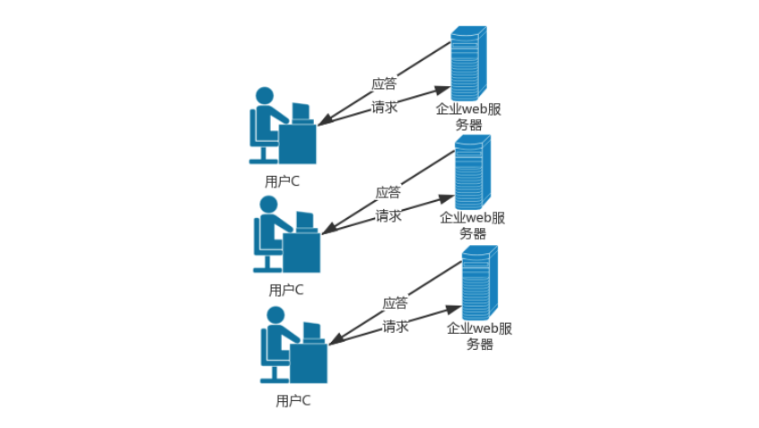

那么问题就来了，票务信息的数据存在哪里？存在文件里么？

如果存储在文件里，那么存储在哪一台机器上呢？是每台机器上都存储一份么？

首先，如果其中一台机器上卖出的票另外两台机器是感知不到的，其次，如果我们将数据和程序放在同一个机器上，如果程序和数据有一个出了问题都会导致整个服务不可用。最后，操作或修改文件中的内容对python代码来说是一件很麻烦的事。

基于上面这些问题，单纯的将数据存储在和程序同一台机器上的文件中是非常不明智的。

根据上面的例子，我们可以知道，将文件和程序存在一台机器上是很不合理的，同时，操作文件是一件很麻烦的事，所以我们可以使用数据库来存储数据。

## 7.1、MySQL

MySQL是一个开源免费的关系型数据库管理系统，由瑞典MySQL AB 公司开发，目前属于 Oracle 旗下公司。MySQL 最流行的关系型数据库管理系统，在 WEB 应用方面MySQL是最好的 RDBMS (Relational Database Management System，关系数据库管理系统) 应用软件之一，具有成本低、速度快、体积小且开放源代码等优点。

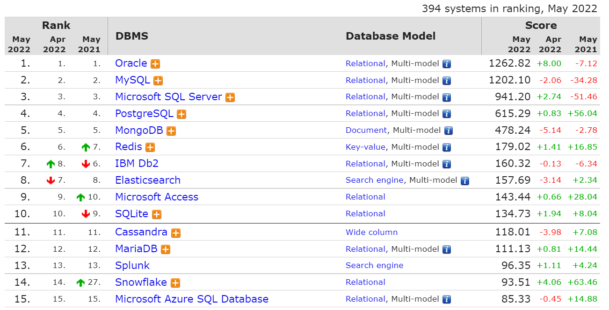

上图来源：https://db-engines.com/en/ranking

### 基本安装

此处我们演示的是windows下安装mysql。linux的安装过程在ubuntu封装笔记里面有。

#### 下载

打开网址，https://www.mysql.com，点击导航[DOWNLOADS](https://www.mysql.com/downloads/)


mysql分2个主版本：Enterprise（企业版，收费闭源）和 Community（社区版，免费开源）。此处我们使用免费的社区版。

点击[MySQL Community (GPL) Downloads »](https://dev.mysql.com/downloads/)。


点击 [MySQL Community Server](https://dev.mysql.com/downloads/mysql/)

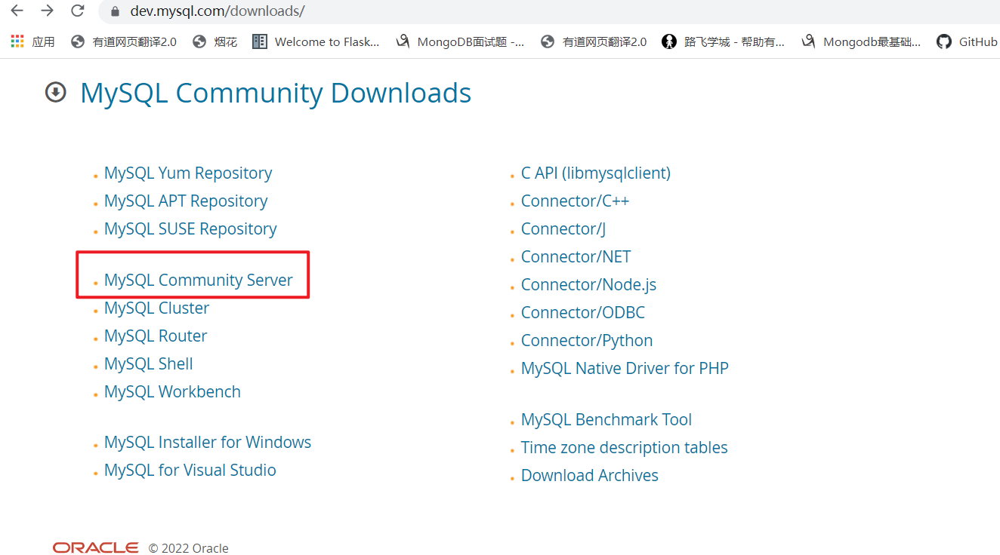

windows选择zip压缩包格式，mac OS选择dmg格式。


不需要注册登陆网站，直接谢谢，继续下载即可。


#### 解压

把下载到本地的zip文件手动解压，将解压之后的文件夹放到专门保存开发软件的目录下，这个目录就是mysql的安装目录。

例如，此处我放在了C:/tool/目录下。

注意，目录路径不能出现中文，不能出现空格等特殊符号，否则会出错的！！！

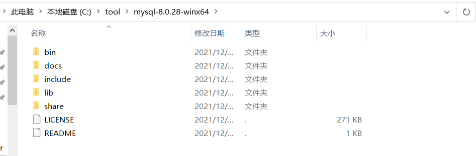

#### 配置

##### 配置环境变量

【此电脑】- 【右键】-【属性】-【高级系统设置】-【环境变量】- 【找到系统变量中的path】-【选中】-【编辑】- 【新建】-【将刚刚mysql压缩包点进去bin目录路径复制并粘贴进来】-【确定】

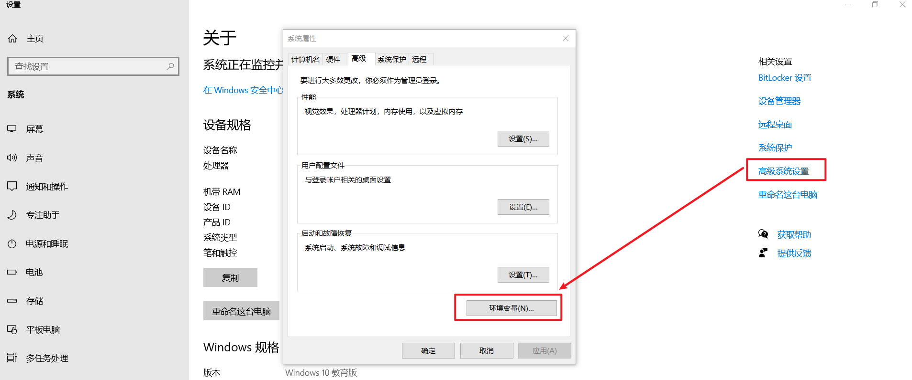

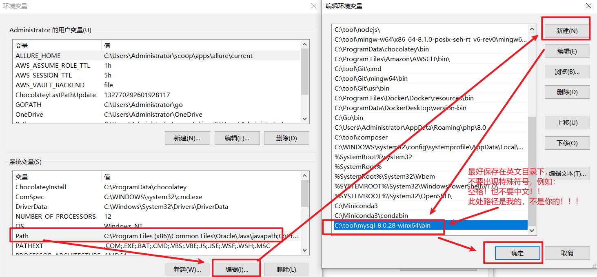

##### 创建data目录

主要用于存放mysql数据库以及数据的。

> 注意：是mysql的安装目录！！！！

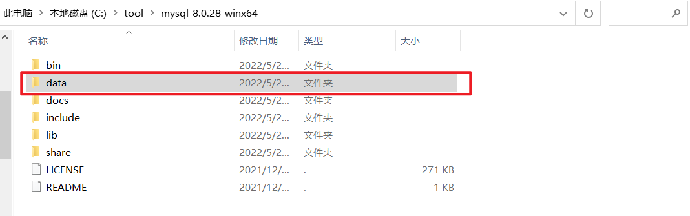

##### 创建配置文件

mysql在windows下的配置文件，叫 mysql.ini，默认是没有的，我们需要手动创建。

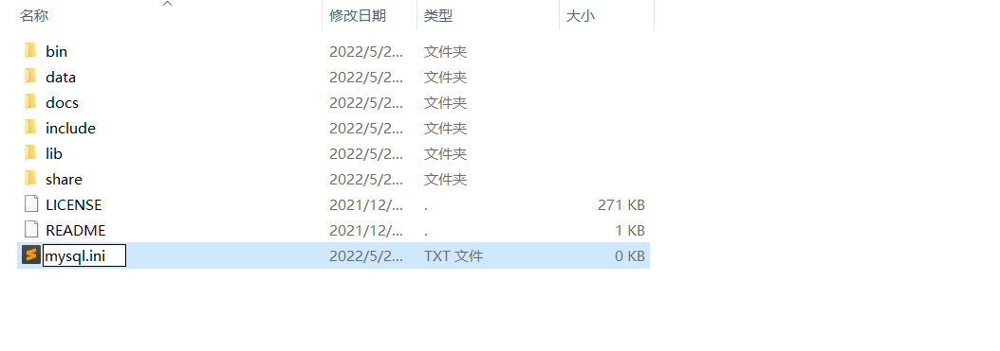

mysql.ini的配置内容，注意，basedir和datadir的路径要根据自己的路径如实填写，如下：

```ini
[mysqld]
; 设置3306端口
port=3306
; 设置mysql的安装目录
basedir="C:/tool/mysql-8.0.28-winx64"
; 设置mysql数据库的数据的存放目录，就是前面手动创建的data目录
datadir="C:/tool/mysql-8.0.28-winx64/data"
; 允许最大连接数
max_connections=200
; 允许连接失败的次数。
max_connect_errors=10
; 服务端使用的字符集默认为utf8mb4
character-set-server=utf8mb4
; 创建新表时将使用的默认存储引擎
default-storage-engine=INNODB
; 默认使用“mysql_native_password”插件认证, mysql_native_password
default_authentication_plugin=mysql_native_password
[mysql]
; 设置mysql网络通信的默认字符集
default-character-set=utf8mb4
[client]
; 设置mysql客户端连接服务端时默认使用的端口
port=3306
; 设置mysql客户端的默认字符集
default-character-set=utf8mb4
```

##### 初始化数据库

重新打开一个cmd黑窗口，输入以下命令，让数据库完成初始化操作。

```bash
mysqld --initialize --console
```

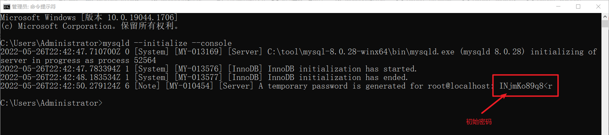

##### 注册系统服务

把mysql注册到操作系统作为系统服务，保证将来电脑重启了就可以开机自启了。在上面打开的黑窗口中如下以下命令：

```bash
mysqld --install mysql80

# 注销服务，用于卸载mysql的，别乱用。
# mysqld --remove mysql80
```

mysql80就是自己取的服务名（服务器是唯一的），只要符合python的变量规则，不要使用中文，可以自己发挥。

确认是否安装到了系统服务，可以通过【此电脑】- 【右键】-【管理】- 【服务与应用程序】 - 【服务】- 【右边窗口】

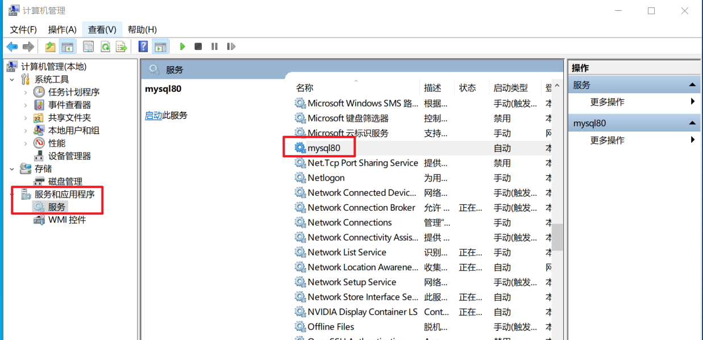


#### 启动

windows下安装的mysql默认是没有启动服务的。

```bash
net start mysql80

# 关闭mysql的命令:
# net stop mysql80
# 重启mysql的命令：
# net start mysql80
```

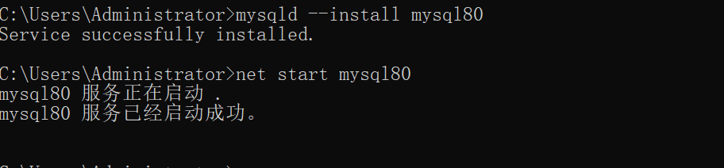

#### 登录

通过以下命令按回车键，接着输入上面初始化的登陆密码，就可以登陆MySQL交互终端了。

```bash
mysql -uroot -p


# 退出终端
# exit
```

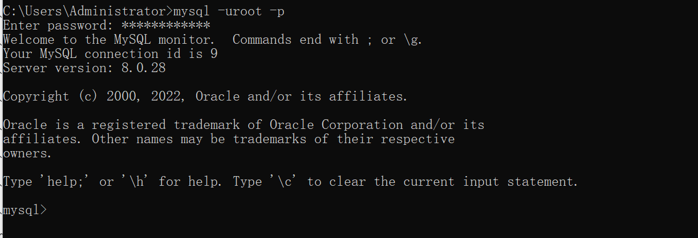

注意：mysql与linux一样，在安装成功以后默认就存在了一个上帝一般的用户，叫root。

##### 修改root登陆密码

接下来的操作是在登陆了mysql终端以后的操作。

```bash
alter user 'root'@'localhost' identified by '123';
# 'root' 就是要修改密码的用户名
# 'localhost' 表示允许用户在什么地址下可以使用密码登陆到数据库服务器，localhost表示本地登陆
# '123'  就是新的密码了，注意，不要设置空密码！以后公司里面的密码一定要非常难记的才最好。
```

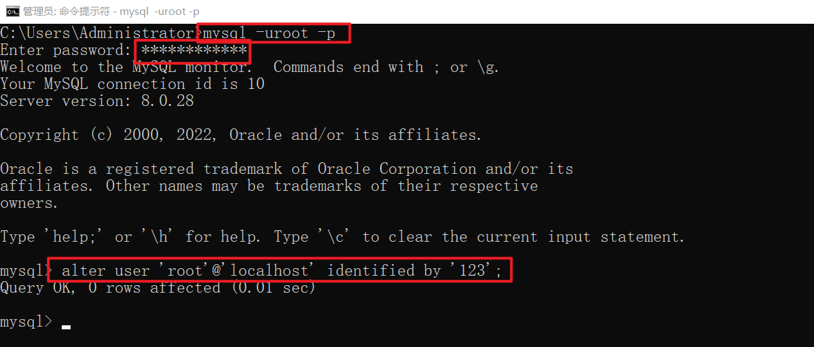

完成了上面的操作以后，mysql就安装完成了。


#### 基本概念

前面的学习中我们提到，mysql是关系型数据库，所以我们要操作mysql就需要使用SQL（结构化查询语言）。

##### SQL规范

```tex
1. 在数据库管理系统中，SQL语句关键字不区分大小写(但建议用大写) ，参数区分大小写。建议命令大写，数据库名、数据表名、字段名统一小写，如数据库名、数据表名、字段名与关键字同名，使用反引号` ` 圈起来，避免冲突。

2. SQL语句可单行或多行书写，默认以英文分号（;）结尾，关键词不能跨多行或简写。

3. 字符串跟日期类型的值都要以 单引号括起来，单词之间需要使用半角的空格隔开。

4. 用空格和缩进来提高SQL语句的可读性。

```

```sql
SELECT * FROM table_name
WHERE name="moluo";
```


##### 注释

```sql
第一种：
-- 单行注释

第二种：
/*
   多行注释
*/

第三种：
# mysql支持单行注释
```


##### SQL类型

根据不同的用途，SQL语句通常分3大类型：

1. 数据定义语言（Data Definition Language，DDL）

   用于创建或删除数据库以及数据表的语句，DDL包含以下几种指令：

   ​    CREATE:	               创建数据库和表等对象
   ​    DROP:                      删除数据库和表等对象
   ​    ALTER:                     修改数据库和表等对象的结构

2. 数据操纵语言（Data Manipulation Language，DML）

   用于对数据表中的数据进行增删查改的。

   ​    SELECT:                  查询表中的数据
   ​    INSERT:                  向表中插入新数据
   ​    UPDATE:	             变更表中的数据
   ​    DELETE:                  删除表中的数据

3. 数据控制语言（Data Control Language，DCL）

   用于对控制数据库的操作权限的，包括用户权限以及数据操作权限。

   ​    COMMIT:               确认对数据库中的数据进行的变更
   ​    ROLLBACK:            取消对数据库中的数据进行的变更
   ​    GRANT:                  赋予用户操作权限
   ​    REMOVE:	           取消用户的操作权限


##### 常用命令

| 命令   | 描述                                                     |
| ------ | -------------------------------------------------------- |
| help   | 查看系统帮助想你想                                       |
| status | 查看数据库管理系统的状态信息                             |
| exit   | 退出数据库终端连接                                       |
| quit   | 退出数据库终端连接                                       |
| \c     | 当打错命令了，想换行重新写时可以在错误命令后面跟着\c回车 |

### 数据库操作

```sql
-- 1.创建数据库（在磁盘上创建一个对应的文件夹）
    create database [if not exists] db_name [character set xxx] 
    
-- 2.查看数据库
    show databases;  -- 查看所有数据库
    show create database db_name; -- 查看数据库的创建方式

-- 3.修改数据库
    alter database db_name [character set xxx] 

-- 4.删除数据库
    drop database [if exists] db_name;
    
-- 5.使用数据库
    use db_name; -- 切换数据库  注意：进入到某个数据库后没办法再退回之前状态，但可以通过use进行切换
    select database(); --  查看当前使用的数据库

```

### 数据表操作

数据表就相当于存储数据的特殊文件，数据表中的一条记录就相当于普通文件的一行内容。

```text
moluo, True, 18, 2000, 广东, 计算机科学与技术, python开发
xiaohong, False, 17, 2001, 广西, 舞蹈学, 音乐老师
```

与普通文件不同的是，数据表是二维的表格结构。

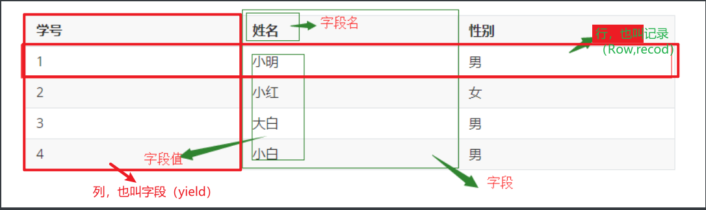

#### 创建数据表

数据表就相当于文件，文件有文件名，自然地，数据表也要有表名。同样道理，数据表中的一条记录就相当于文件的一行内容。只是不同的是，数据表需要定义表头（上图中的首行），称为表的字段名。而且因为数据库的存储数据更加科学、严谨，所以需要创建表时要给每一个字段设置数据类型以及字段约束（完整性约束条件）。

```sql
create table  [if not exists]  表名 (
    字段名1    数据类型[ ( 存储空间 )    字段约束 ],
    字段名2    数据类型[ ( 存储空间 )    字段约束 ],
    字段名3    数据类型[ ( 存储空间 )    字段约束 ],
    .....
    字段名n   数据类型[ ( 存储空间 )    字段约束 ],
    primary key(一个 或 多个 字段名)    -- 注意，最后一段定义语句，不能有英文逗号的出现，否则报错。
) [engine = 存储引擎 character set 字符集];
```

注意：

>1. 上面SQL语句中，小括号中的定义字段语句后面必须以英文逗号结尾，而最后一个字段的定义语句不能有英文逗号出现，否则报错。
>2. 在同一张数据表中，字段名是不能相同，否则报错！
>3. 创建数据表的SQL语句中，存储空间和字段约束是选填的，而字段名和数据类型则是必须填写的。

创建班级表

```sql
-- mysql中创建数据表要以 create table `表名`
-- 表的字段信息必须写在 (  )  小括号里面
create table classes (
    -- 建议一行一个字段，id 就是字段名
    -- int 表示设置字段值要以整数的格式保存到硬盘中，
    -- auto_increment表示当前字段值在每次新增数据时自动+1作为值保存
    -- primary key，mysql中叫主键，表示用于区分一个数据表中不同行的数据的唯一性，同时还具备加快查询速度的作用
    -- 注意：auto_increment与primary key 一般是配合使用的，对应的字段名一般也叫id，而且在一个数据表中只有一个字段能使用auto_increment primary key进行设置。
    id int auto_increment primary key,
    -- 字段名：name
    -- varchar(10) 表示当前name这一列可以存储的数据是字符串格式，并且最多只能存10个字符
    name varchar(10),
    -- 字段名：address
    -- varchar(100) 表示adderss这一列可以存储的数据是字符串格式，并且最多只能存100个字符
    address varchar(100),
    -- 字段名：total
    -- int 表示当前total这一列的数据只能是整数，而且一个数据表中，整数的最大范围只能是42亿
    total int
);
```

上面的SQL语句就相当于创建了一个表格。

| id   | name | address | total |
| ---- | ---- | ------- | ----- |
|      |      |         |       |
|      |      |         |       |

创建学生表

```sql
create table student(
id int auto_increment,   -- 字段名：id，数据类型：int整型，auto_increment整数自动增长+1
name varchar(10),   -- 字段名：name， 数据类型：varchar字符串（长度限制最多10个字符）
sex int default 1,  -- 字段名：sex，数据类型：int整型，默认值（default）：1 相当于True 
classes int,         -- 字段名：classes， 数据类型：int整型，
age int,             -- 字段名：age，数据类型：int整数,
description text,  -- 字段名：description，数据类型：text文本
primary key (id)  -- 设置主键(id) 每个表必须都有主键，用以区分不同行的数据
);
```

练习：假设现在我们有一个课程表(courses)，里面需要保存课程编号（id），课程名（cource），授课老师（lecturer），教室（address）。

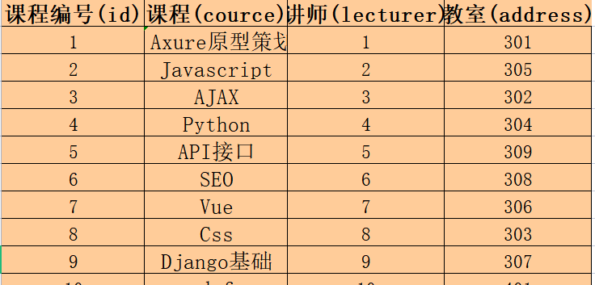

```sql
create table courses (
id int auto_increment primary key comment "课程编号",
course varchar(50) comment "课程名称",
lecturer int comment "讲师编号",
address int comment "教室编号"
);
```

#### 查看数据表

##### 查看所有数据表

列出当前数据库中所有的数据表,语法：

```sql
show tables;
```

##### 查看表结构

以表格形式列出当前数据表的结构信息。语法：

```sql
-- 方式1：简单查看
describe 表名;
desc 表名;   -- desc是describe的缩写

-- 方式2：详细查看
describe 表名;
desc 表名;
```

##### 查看建表语句

```sql
show create table 表名 \G;
```

#### 删除数据表

删除表结构，并把数据一并删除，使用需谨慎，强烈建议先备份后删除，或者直接改表名来代替删除操作。

```sql
drop table 表名;
```

重置表信息

保留数据表结构，但是把数据表存储的数据以及数据表的状态回滚，相当于删除原表，并新建一张一模一样的空数据表。

```sql
TRUNCATE table 表名;
```

### 表记录操作

#### 【1】添加记录

INSERT 语句有两种语法形式，分别是 INSERT…VALUES 语句和 INSERT…SET 语句。

```sql 
INSERT [INTO] <表名> [ <列名1> [ , … <列名n>] ] VALUES (值1) [… , (值n) ];
```

> 1. 指定需要插入数据的列名。若向表中的所有列插入数据，则全部的列名均可以省略，直接采用 INSERT<表名>VALUES(…) 即可。
>
> 2. INSERT 语句后面的列名称顺序可以不是 表定义时的顺序，即插入数据时，不需要按照表定义的顺序插入，只要保证值的顺序与列字段的顺序相同就可以。
>
> 3. 使用 INSERT…VALUES 语句可以向表中插入一行数据，也可以插入多行数据；
>
>    ````sql 
>    INSERT [INTO] <表名> [ <列名1> [ , … <列名n>] ] VALUES (值1…,值n),
>                                                          (值1…,值n),
>                                                          ...
>                                                          (值1…,值n);
>    -- 用单条 INSERT 语句处理多个插入要比使用多条 INSERT 语句更快。
>    ````
>
> 

案例：

```sql 
INSERT employee (name,gender,birthday,salary,department) VALUES 
                                                               ("yuan",1,"1985-12-12",8000,"教学部"),
                                                               ("alvin",1,"1987-08-08",5000,"保安部"),
                                                               ("rain",1,"1990-06-06",20000,"销售部");
```

#### 【2】查询记录

标准语法：

```sql 
-- 查询语法：

   SELECT *|field1,filed2 ...   FROM tab_name
                  WHERE 条件
                  GROUP BY field
                  HAVING 筛选
                  ORDER BY field
                  LIMIT 限制条数


-- Mysql在执行sql语句时的执行顺序：
                -- from  where  select  group by  having order by
```

准备数据：

```sql 
CREATE TABLE emp(
    id       INT PRIMARY KEY AUTO_INCREMENT,
    name     VARCHAR(20),
    gender   ENUM("male","female","other"),
    age      TINYINT,
    dep      VARCHAR(20),
    city     VARCHAR(20),
   salary    DOUBLE(7,2)
)character set=utf8;


INSERT INTO emp (name,gender,age,dep,city,salary) VALUES
                ("yuan","male",24,"教学部","河北省",8000),
                ("eric","male",34,"销售部","山东省",8000),
                ("rain","male",28,"销售部","山东省",10000),
                ("alvin","female",22,"教学部","北京",9000),
                ("George", "male",24,"教学部","河北省",6000),
                ("danae", "male",32,"运营部","北京",12000),
                ("Sera", "male",38,"运营部","河北省",7000),
                ("Echo", "male",19,"运营部","河北省",9000),
                ("Abel", "female",24,"销售部","北京",9000);


```

##### 查询字段（select）

```sql 
mysql> SELECT  * FROM emp;
+----+--------+--------+------+--------+--------+----------+
| id | name   | gender | age  | dep    | city   | salary   |
+----+--------+--------+------+--------+--------+----------+
|  1 | yuan   | male   |   24 | 教学部 | 河北省 |  8000.00 |
|  2 | eric   | male   |   34 | 销售部 | 山东省 |  8000.00 |
|  3 | rain   | male   |   28 | 销售部 | 山东省 | 10000.00 |
|  4 | alvin  | female |   22 | 教学部 | 北京   |  9000.00 |
|  5 | George | male   |   24 | 教学部 | 河北省 |  6000.00 |
|  6 | danae  | male   |   32 | 运营部 | 北京   | 12000.00 |
|  7 | Sera   | male   |   38 | 运营部 | 河北省 |  7000.00 |
|  8 | Echo   | male   |   19 | 运营部 | 河北省 |  9000.00 |
|  9 | Abel   | female |   24 | 销售部 | 北京   |  9000.00 |
+----+--------+--------+------+--------+--------+----------+
mysql> SELECT  name,dep,salary FROM emp;
+--------+--------+----------+
| name   | dep    | salary   |
+--------+--------+----------+
| yuan   | 教学部 |  8000.00 |
| eric   | 销售部 |  8000.00 |
| rain   | 销售部 | 10000.00 |
| alvin  | 教学部 |  9000.00 |
| George | 教学部 |  6000.00 |
| danae  | 运营部 | 12000.00 |
| Sera   | 运营部 |  7000.00 |
| Echo   | 运营部 |  9000.00 |
| Abel   | 销售部 |  9000.00 |
+--------+--------+----------+
```

##### where语句

````sql 
-- where字句中可以使用：

         -- 比较运算符：
                        > < >= <= <> !=
                        between 80 and 100 值在10到20之间
                        in(80,90,100) 值是10或20或30
                        like 'yuan%'
                        /*
                        pattern可以是%或者_，
                        如果是%则表示任意多字符，此例如唐僧,唐国强
                        如果是_则表示一个字符唐_，只有唐僧符合。两个_则表示两个字符：__
                        */

         -- 逻辑运算符
                        在多个条件直接可以使用逻辑运算符 and or not
                        
         -- 正则 
                      SELECT * FROM emp WHERE emp_name REGEXP '^yu';
                      SELECT * FROM emp WHERE name REGEXP 'n$';
                      
````

练习：

```sql 
-- 查询年纪大于24的员工
SELECT * FROM emp WHERE age>24;

-- 查询教学部的男老师信息
SELECT * FROM emp WHERE dep="教学部" AND gender="male";
```

##### order：排序

按指定的列进行，排序的列即可是表中的列名，也可以是select语句后指定的别名。

```sql 
-- 语法：

select *|field1,field2... from tab_name order by field [Asc|Desc]
         -- Asc 升序、Desc 降序，其中asc为默认值 ORDER BY 子句应位于SELECT语句的结尾。
```

练习：

````sql 
-- 按年龄从高到低进行排序
SELECT * FROM emp ORDER BY age DESC ;

-- 按工资从低到高进行排序
SELECT * FROM emp ORDER BY salary;

-- 先按工资排序，工资相同的按年龄排序
SELECT * FROM emp ORDER BY salary,age;
````

##### group by：分组查询

GROUP BY 语句根据某个列对结果集进行分组。分组一般配合着聚合函数完成查询。

**常用聚合(统计)函数**

- `max()`：最大值。
- `min()`：最小值。
- `avg()`：平均值。
- `sum()`：总和。
- `count()`：个数。

在MySQL的SQL执行逻辑中，where条件必须放在group by前面！也就是先通过where条件将结果查询出来，再交给group by去分组，完事之后进行统计，统计之后的查询用having。

练习：

```sql 
-- 查询男女员工各有多少人
SELECT gender 性别,count(*) 人数 FROM emp GROUP BY gender;
 
-- 查询各个部门的人数
SELECT dep 部门,count(*) 人数 FROM emp GROUP BY dep;
 
-- 查询每个部门最大的年龄
SELECT dep 部门,max(age) 最大年纪 FROM emp GROUP BY dep;
 
-- 查询每个部门年龄最大的员工姓名
SELECT * FROM emp5 WHERE age in (SELECT max(age) FROM emp5 GROUP BY dep);
 
-- 查询每个部门的平均工资
SELECT dep 部门,avg(salary) 最大年纪 FROM emp GROUP BY dep;
 
--  查询教学部的员工最高工资:
SELECT dep,max(salary) FROM emp11 GROUP BY dep HAVING dep="教学部";
 
-- 查询平均薪水超过8000的部门
SELECT dep,AVG(salary) FROM  emp GROUP BY dep HAVING avg(salary)>8000;
 
--  查询每个组的员工姓名
SELECT dep,group_concat(name) FROM emp GROUP BY dep;
 
-- 查询公司一共有多少员工(可以将所有记录看成一个组)
SELECT COUNT(*) 员工总人数 FROM emp;

```

##### limit：记录条数限制

```sql 
SELECT * from emp limit 1;
SELECT * from emp limit 2,5;        --  跳过前两条显示接下来的五条纪录
SELECT * from emp limit 2,2;
```

##### distinct：查询去重

```sql 
SELECT distinct salary from emp order by salary;
```

#### 【3】更新记录

```sql 
UPDATE <表名> SET 字段 1=值 1 [,字段 2=值 2… ] [WHERE 子句 ]
```

#### 【4】删除记录

```sql 
DELETE FROM <表名> [WHERE 子句] [ORDER BY 子句] [LIMIT 子句]
```

> - `<表名>`：指定要删除数据的表名。
> - `ORDER BY` 子句：可选项。表示删除时，表中各行将按照子句中指定的顺序进行删除。
> - `WHERE` 子句：可选项。表示为删除操作限定删除条件，若省略该子句，则代表删除该表中的所有行。
> - `LIMIT` 子句：可选项。用于告知服务器在控制命令被返回到客户端前被删除行的最大值。

### 关联表

一对多关系为关系数据库中两个表之间的一种关系，该关系中第一个表中的单个行可以与第二个表中的一个或多个行相关，但第二个表中的一个行只可以与第一个表中的一个行相关。

```sql 
-- 书籍表
CREATE TABLE book(
id INT PRIMARY KEY AUTO_INCREMENT,
title VARCHAR(32),
price DOUBLE(5,2),    
pub_id INT NOT NULL
)ENGINE=INNODB CHARSET=utf8;


-- 出版社表
CREATE TABLE publisher(
id INT PRIMARY KEY AUTO_INCREMENT,
name VARCHAR(32),
email VARCHAR(32),
addr VARCHAR(32)
)ENGINE=INNODB CHARSET=utf8;

-- 插入数据
INSERT INTO book(title,price,pub_id) VALUES
('西游记',15,1),
('三国演义',45,2),
('红楼梦',66,3),
('水浒传',21,2),
('红与黑',67,3),
('乱世佳人',44,6),
('飘',56,1),
('放风筝的人',78,3);

INSERT INTO publisher(id,name,email,addr) VALUES
(1,'清华出版社',"123","bj"),
(2,'北大出版社',"234","bj"),
(3,'机械工业出版社',"345","nj"),
(4,'邮电出版社',"456","nj"),
(5,'电子工业出版社',"567","bj"),
(6,'人民大学出版社',"678","bj");
```

```sql 
mysql> select * from book;
+----+------------+-------+--------+
| id | title      | price | pub_id |
+----+------------+-------+--------+
|  1 | 西游记     | 15.00 |      1 |
|  2 | 三国演义   | 45.00 |      2 |
|  3 | 红楼梦     | 66.00 |      3 |
|  4 | 水浒传     | 21.00 |      2 |
|  5 | 红与黑     | 67.00 |      3 |
|  6 | 乱世佳人   | 44.00 |      6 |
|  7 | 飘         | 56.00 |      1 |
|  8 | 放风筝的人 | 78.00 |      3 |
+----+------------+-------+--------+
8 rows in set (0.00 sec)

mysql> select * from publisher;
+----+----------------+-------+------+
| id | name           | email | addr |
+----+----------------+-------+------+
|  1 | 清华出版社     | 123   | bj   |
|  2 | 北大出版社     | 234   | bj   |
|  3 | 机械工业出版社 | 345   | nj   |
|  4 | 邮电出版社     | 456   | nj   |
|  5 | 电子工业出版社 | 567   | bj   |
|  6 | 人民大学出版社 | 678   | bj   |
+----+----------------+-------+------+
6 rows in set (0.00 sec)
```

### Python操作MySQL

```python
import pymysql

# 打开数据库连接

db = pymysql.connect(host='localhost', user='root', passwd='...', port=3306)
print('连接成功！')

# 使用 cursor() 方法创建一个游标对象 cursor
cursor = db.cursor()

# 使用 execute()  方法执行 SQL 查询
cursor.execute("SELECT VERSION()")

# 使用 fetchone() 方法获取单条数据.
data = cursor.fetchone()

print("Database version : %s " % data)

# 关闭数据库连接
db.close()

```

**class版本**

```python
import pymysql


class DBHandler:
    def __init__(self, host, port, user, password,
                 database, charset, **kwargs):
        # 连接数据库服务器
        self.conn = pymysql.connect(host=host, port=port, user=user, password=password,
                                    database=database, cursorclass=pymysql.cursors.DictCursor,
                                    charset=charset, **kwargs)
        # 获取游标
        self.cursor = self.conn.cursor()

    def query(self, sql, args=None, one=True):
        self.cursor.execute(sql, args)
        if one:
            return self.cursor.fetchone()
        else:
            return self.cursor.fetchall()

    def close(self):
        self.cursor.close()
        self.conn.close()


if __name__ == "__main__":
    db = DBHandler(host='127.0.0.1', port=3306,
                   user='root', password='yuan0316',
                   database='uric', charset='utf8')
    sql = 'SELECT VERSION()'
    data = db.query(sql)
    print(data)

```

### 爬虫小说存储案例

```python
import requests
from lxml import etree
import pymysql


class Spider(object):
    def __init__(self, host, port, user, password,
                 database, charset, **kwargs):
        # 连接数据库服务器
        self.conn = pymysql.connect(host=host, port=port, user=user, password=password,
                                    database=database, cursorclass=pymysql.cursors.DictCursor,
                                    charset=charset, **kwargs)
        # 获取游标
        self.cursor = self.conn.cursor()

        # 初始化表、
        self.init_table()

        self.headers = {
            'User-Agent': 'Mozilla/5.0 (Windows NT 10.0; Win64; x64) AppleWebKit/537.36 (KHTML, like Gecko) Chrome/109.0.0.0 Safari/537.36',
        }

        self.session = requests.session()

    def exec(self, sql, args=None, one=True):
        self.cursor.execute(sql, args)
        self.conn.commit()

        if one:
            return self.cursor.fetchone()
        else:
            return self.cursor.fetchall()

    def close(self):
        self.cursor.close()
        self.conn.close()

    def init_table(self):

        # 使用 execute()  方法执行 SQL 查询
        sql1 = """
           create table if not exists book(
           id int primary key auto_increment,
           bookName varchar(32),
           coverImg varchar(255),
           authorPenName varchar(32)
           )character set=utf8; 
           """
        self.exec(sql1)

        sql2 = """
               create table if not exists chapter(
               id int primary key auto_increment ,
               chapter_name varchar(32),
               chapter_content text,
               book_id INT NOT NULL
               )character set=utf8;
               """
        self.exec(sql2)

    def login(self):
        self.session.post("https://passport.17k.com/ck/user/login", data={
            "loginName": "13121758648",
            "password": "yuan0316"
        }, headers=self.headers)

    def get_shelf_books(self):
        '''
        params:
        :return: data [{},{},{}]
        '''
        res = self.session.get("https://user.17k.com/ck/author/shelf?page=1&appKey=2406394919")

        res.encoding = "utf8"
        # print(res.text)
        data = res.json().get("data")

        for book_dict in data:
            self.handle_one_book(book_dict)

    def handle_one_book(self, book_dict):
        # 循环处理每一本书
        print(book_dict)
        bookId = book_dict.get("bookId")
        bookName = book_dict.get("bookName")
        coverImg = book_dict.get("coverImg")
        authorPenName = book_dict.get("authorPenName")

        sql = f"""insert into book (bookName,coverImg,authorPenName) values (
            "{bookName}","{coverImg}","{authorPenName}");"""
        print("sql:::", sql)
        self.exec(sql)

        # 爬取每一章的文本信息并下载
        self.get_chapters(bookId)

    def get_chapters(self, book_id):

        # 爬虫每一本书架书籍的章节页面
        res = requests.get(f"https://www.17k.com/list/{book_id}.html")
        res.encoding = "utf8"
        # 解析该书籍的章节页面中章节链接
        selector = etree.HTML(res.text)
        items = selector.xpath('//dl[@class="Volume"][position()>1]/dd/a')

        for item in items:
            self.handle_one_chapter(item, book_id)

    def handle_one_chapter(self, item, book_id):
        # 每一本书籍的每一章节的信息
        chapter_href = item.xpath("./@href")[0]
        chapter_name = item.xpath("./span/text()")[0].strip()
        # 爬取章节内容
        res = requests.get("https://www.17k.com" + chapter_href)
        res.encoding = "utf8"
        chapter_html = res.text
        print(chapter_html)
        selector = etree.HTML(res.text)
        chapter_content_list = selector.xpath(
            '//div[contains(@class,"content")]/div[@class="p"]/p[position()<last()]/text()')
        chapter_content_str = "\n".join(chapter_content_list)
        # 章节进行下载，写入到一个文件中

        sql = f"""insert into chapter (chapter_name,chapter_content,book_id) values (
                  "{chapter_name}",'{chapter_content_str}',"{book_id}");"""
        print("sql:::", sql)
        self.exec(sql)

    def run(self):
        # (1) 模拟登录，获取Cookie
        self.login()
        # (2) 爬取书架上的书籍信息
        self.get_shelf_books()


if __name__ == "__main__":
    s = Spider(host='127.0.0.1', port=3306,
               user='root', password='yuan0316',
               database='xiaoshuo', charset='utf8')

    s.run()

```

## 7.2、redis

### redis介绍


#### 定义

> Redis（Remote Dictionary Server ，远程字典服务） 是一个使用ANSIC编写的开源、支持网络、基于内存、可选持久性的键值对存储数据库，是NoSQL数据库。

redis的出现主要是为了替代早期的Memcache缓存系统的。map内存型(数据存放在内存中)的非关系型(nosql)key-value(键值存储)数据库，支持数据的持久化(基于RDB和AOF，注: 数据持久化时将数据存放到文件中，每次启动redis之后会先将文件中数据加载到内存，经常用来做缓存、数据共享、购物车、消息队列、计数器、限流等。(最基本的就是缓存一些经常用到的数据，提高读写速度)。

redis特性：

> - 速度快
> - 持久化
> - 多种数据结构
> - 支持多种编程语言
> - 主从复制
> - 高可用、分布式

#### Redis的数据类型及主要特性

Redis提供的数据类型主要分为5种自有类型和一种自定义类型，这5种自有类型包括：String类型、哈希类型、列表类型、集合类型和顺序集合类型。

```
redis={
"name":"yuan",
"age":"23",
"scors":[78,79,98,],
"info":{"gender":"male","tel":"110"},
"set":{1,2,3},
"zset":{1,2,3,}
}

```


#### Redis的应用场景有哪些？

Redis 的应用场景包括：

> 缓存系统（“热点”数据：高频读、低频写）：缓存用户信息，优惠券过期时间，验证码过期时间、session、token等
>
> 计数器：帖子的浏览数，视频播放次数，评论次数、点赞次数等
>
> 消息队列，秒杀系统
>
> 社交网络：粉丝、共同好友（可能认识的人），兴趣爱好（推荐商品）
>
> 排行榜（有序集合）
>
> 发布订阅：粉丝关注、消息通知

#### redis环境安装

redis的官方只提供了linux版本的redis，window系统的redis是微软团队根据官方的linux版本高仿的。

官方原版: https://redis.io/

中文官网:http://www.redis.cn

下载地址：https://github.com/tporadowski/redis/releases

 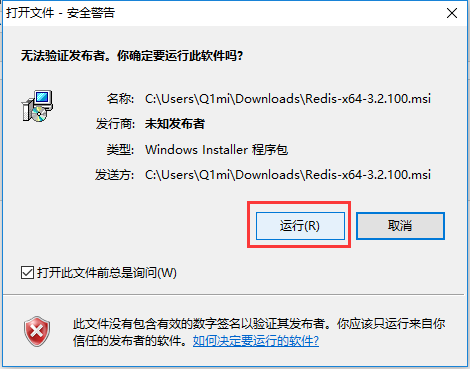

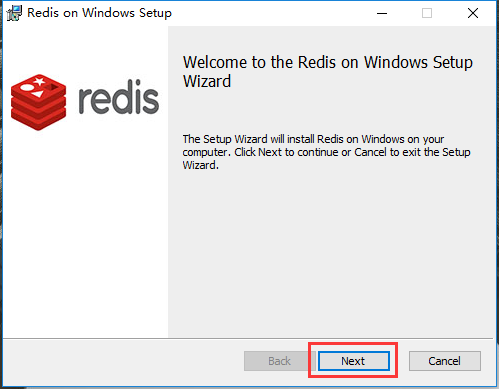


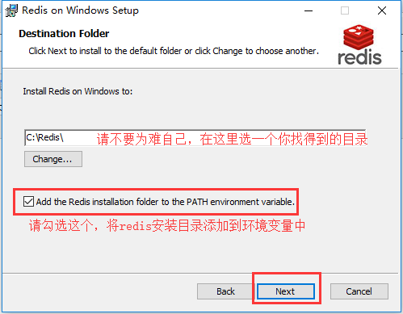

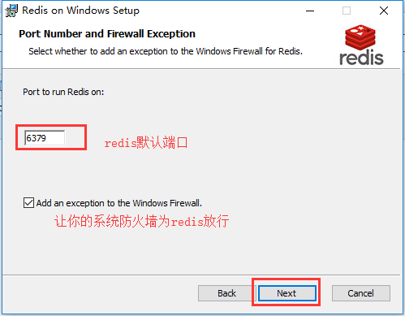

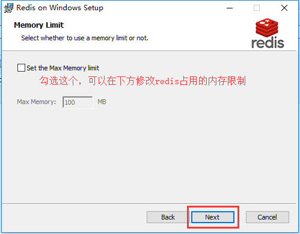

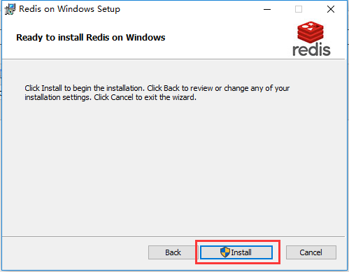

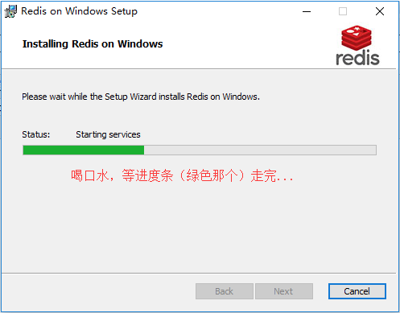

 

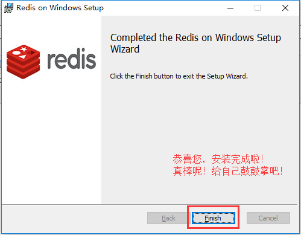

使用以下命令启动redis服务端

```
redis-server C:/tool/redis/redis.windows.conf
```

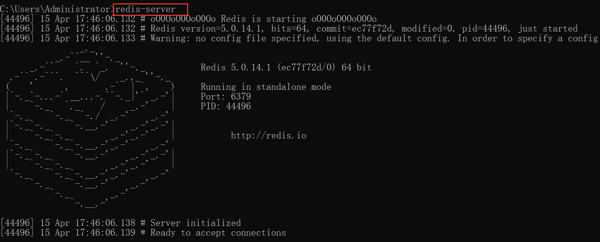

关闭上面这个cmd窗口就关闭redis服务器服务了。

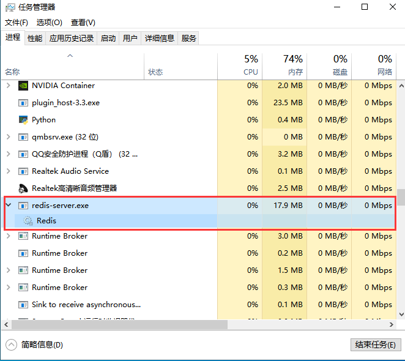

**redis作为windows服务启动方式**

```bash
redis-server --service-install redis.windows.conf
```

启动服务：redis-server --service-start
停止服务：redis-server --service-stop

```bash
# 如果连接操作redis，可以在终端下，使用以下命令：
redis-cli
```

### redis数据类型


```text
redis可以理解成一个全局的大字典，key就是数据的唯一标识符。根据key对应的值不同，可以划分成5个基本数据类型。

redis = {
    "name":"yuan",
    "scors":["100","89","78"],
    "info":{
        "name":"rain"
        "age":22
    },
    "s":{item1,itme2,..}
}

1. string类型:
	字符串类型，是 Redis 中最为基础的数据存储类型，它在 Redis 中是二进制安全的，也就是byte类型。
	单个数据的最大容量是512M。
		key: 值
	
2. hash类型:
	哈希类型，用于存储对象/字典，对象/字典的结构为键值对。key、域、值的类型都为string。域在同一个hash中是唯一的。
		key:{
            域（属性）: 值，
            域:值，            
            域:值，
            域:值，
            ...
		}
3. list类型:
	列表类型，它的子成员类型为string。
		key: [值1，值2, 值3.....]
		
4. set类型:
	无序集合，它的子成员类型为string类型，元素唯一不重复，没有修改操作。
		key: {值1, 值4, 值3, ...., 值5}

5. zset类型(sortedSet):
	有序集合，它的子成员值的类型为string类型，元素唯一不重复，没有修改操作。权重值(score,分数)从小到大排列。
		key: {
			值1 权重值1(数字);
			值2 权重值2;
			值3 权重值3;
			值4 权重值4;
		}


```

### Python操作redis

#### （1）连接redis

```python
# 方式1
import redis

r = redis.Redis(host='127.0.0.1', port=6379)
r.set('foo', 'Bar')
print(r.get('foo'))


# 方式2
import redis

pool = redis.ConnectionPool(host='127.0.0.1', port=6379)
r = redis.Redis(connection_pool=pool)
r.set('bar', 'Foo')
print(r.get('bar'))
```

通常情况下, 当我们需要做redis操作时, 会创建一个连接, 并基于这个连接进行redis操作, 操作完成后, 释放连接,一般情况下, 这是没问题的, 但当并发量比较高的时候, 频繁的连接创建和释放对性能会有较高的影响。于是, 连接池就发挥作用了。连接池的原理是, 通过预先创建多个连接, 当进行redis操作时, 直接获取已经创建的连接进行操作, 而且操作完成后, 不会释放, 用于后续的其他redis操作。这样就达到了避免频繁的redis连接创建和释放的目的, 从而提高性能。

#### （2）数据类型操作

```python
import redis

pool = redis.ConnectionPool(host='127.0.0.1', port=6379, db=0, decode_responses=True)
r = redis.Redis(connection_pool=pool)
# 一 ： 字符串操作
# （1）字符串操作：不允许对已经存在的键设置值
ret = r.setnx("name", "yuan")
print(ret)
# （2）字符串操作：设置键有效期
r.setex("good_1001", 10, "2")
# （3）字符串操作：自增自减
r.set("age", 20)
r.incrby("age", 2)
print(r.get("age"))  # b'22'
# 二 ： hash操作

r.hset("info", "name", "rain")
print(r.hget("info", "name"))  # b'rain'
r.hset("info", mapping={"gender": "male", "age": 22})
print(r.hgetall("info"))  # {b'name': b'rain', b'gender': b'male', b'age': b'22'}

# 三 ： list操作
r.rpush("scores", "100", "90", "80")
r.rpush("scores", "70")
r.lpush("scores", "120")
print(r.lrange("scores", 0, -1))  # ['120', '100', '90', '80', '70']
r.linsert("scores", "AFTER", "100", 95)
print(r.lrange("scores", 0, -1))  # ['120', '100', '95', '90', '80', '70']
print(r.lpop("scores"))  # 120
print(r.rpop("scores"))  # 70
print(r.lindex("scores", 1))  # '95'

# 四 ： 集合操作
# key对应的集合中添加元素
r.sadd("name_set", "zhangsan", "lisi", "wangwu")
# 获取key对应的集合的所有成员
print(r.smembers("name_set"))  # {'lisi', 'zhangsan', 'wangwu'}
# 从key对应的集合中随机获取 numbers 个元素
print(r.srandmember("name_set", 2))
r.srem("name_set", "lisi")
print(r.smembers("name_set"))  # {'wangwu', 'zhangsan'}

# 五 ：有序集合操作
# 在key对应的有序集合中添加元素
r.zadd("jifenbang", {"yuan": 78, "rain": 20, "alvin": 89, "eric": 45})
# 按照索引范围获取key对应的有序集合的元素
print(r.zrange("jifenbang", 0, -1))  # ['rain', 'eric', 'yuan', 'alvin']
print(
    r.zrange("jifenbang", 0, -1, withscores=True))  # [('rain', 20.0), ('eric', 45.0), ('yuan', 78.0), ('alvin', 89.0)]
print(r.zrevrange("jifenbang", 0, -1,
                  withscores=True))  # [('alvin', 89.0), ('yuan', 78.0), ('eric', 45.0), ('rain', 20.0)]

print(r.zrangebyscore("jifenbang", 0, 100))  # ['rain', 'eric', 'yuan', 'alvin']
print(r.zrangebyscore("jifenbang", 0, 100, start=0, num=2))  # ['rain', 'eric']
# 删除key对应的有序集合中值是values的成员
print(r.zrem("jifenbang", "yuan"))  # 删除成功返回1
print(r.zrange("jifenbang", 0, -1))  # ['rain', 'eric', 'alvin']

# 六 ：键值对操作
r.delete("scores")
print(r.exists("scores"))
print(r.keys("*"))
r.expire("name", 10)
```

## 7.3、MongoDB

一般爬虫使用的数据库，是根据项目来定的。如需求方指定了使用什么数据库、如果没指定，那么决定权就在爬虫程序员手里，如果自选的话，mysql 和mongodb 用的都是比较多的。但不同的数据库品种有各自的优缺点，不同的场景任何一种数据库都可以用来存储，但是某种可能会更好。比如如果抓取的数据之间的耦合性很高，关系比较复杂的话，那么mysql可能会是更好的选择。如果抓取的数据是分版块的，并且它们之间没有相似性或关联性不强，那么可能mongodb 会更好。

官方文档：https://docs.mongodb.com/

中文文档：https://www.mongodb.org.cn/

mongoDB的生态、理念非常先进而且成熟、但是mongoDB不仅有开源版本，还有企业版本。所以有部分公司比较担心，哪天无法使用mongoDB了，所以也会产生一些替代产品。

```
DynamoDB  : AWS
SequoiaDB : 巨杉数据库
```

### 【1】安装

#### （1）mac安装

在 Mac OS 系统下安装 MongoDB 与在 Linux 下安装比较相似，本节我们就来详细介绍一下 Mac OS 系统下如何安装 MongoDB。

1. 下载 MongoDB

与在 Linux 系统下安装 MongoDB 相同，首先我们需要在 MongoDB 的官网获得 MongoDB 安装包的下载链接，如下图所示：

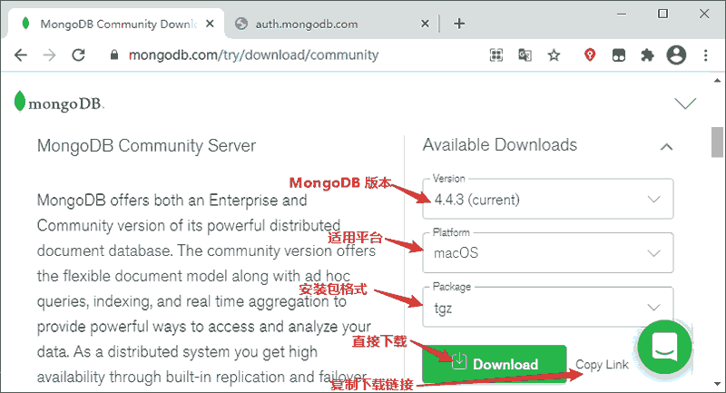
图：MongoDB 官网

得到下载链接后，使用`cd`命令进入 /usr/local 目录，然后使用`wget`命令下载 MongoDB 的压缩包，命令如下：

> cd /usr/local
> sudo wget https://fastdl.mongodb.org/osx/mongodb-macos-x86_64-4.4.3.tgz

（2）安装 MongoDB

待压缩包下载完成后就可以尝试安装 MongoDB 了，具体的安装步骤如下：

【步骤 1】解压缩刚刚下载的压缩包，并将其重命名为 mongodb：

> sudo tar -zxvf mongodb-macos-x86_64-4.4.3.tgz     # 解压 MongoDB 压缩包
> sudo mv mongodb-osx-ssl-x86_64-4.0.17/ mongodb  # 重命名解压得到的文件夹

【步骤 2】在 /usr/local/mongodb 目录下新建两个文件夹 data 和 log，用于存储 MongoDB 的数据和日志。

> sudo mkdir -p /usr/local/mongodb/data
> sudo mkdir -p /usr/local/mongodb/log

使用如下命令为当前用户分配目录的读写权限：

> sudo chown biancheng /usr/local/mongodb/data
> sudo chown biancheng /usr/local/mongodb/log

其中“biancheng”为当前的用户名，您需要修改为您当前系统的用户名。

【步骤 3】配置 PATH。在终端中输入`open -e .bash_profile`命令打开 bash_profile 配置文件，然后将 MongoDB 的安装目录下的 bin 目录添加到环境变量中，如下所示：

> export PATH=${PATH}:/usr/local/mongodb/bin

编辑完成后保存并退出，然后使用`source .bash_profile`命令使配置立即生效。

【步骤 4】使用下面的命令来启动 MongoDB 服务：

> mongod --dbpath /usr/local/mongodb/data --logpath /usr/local/mongodb/log/mongo.log --fork

参数说明如下：

- --dbpath 用来设置数据的存放目录；
- --logpath 用来设置日志的存放目录；
- --fork 用来设置在后台运行。

至此 MongoDB 就安装完成了。

（3）验证安装

您可以使用`mongod -version`命令来验证 MongoDB 是否安装成功，如果出现类似下面所示的内容，则说明 MongoDB 安装成功。

> mongod -version
>
> db version v4.0.10
> git version: c389e7f69f637f7a1ac3cc9fae843b635f20b766
> allocator: tcmalloc
> modules: none
> build environment:
> distmod: 2008plus-ssl
> distarch: x86_64
> target_arch: x86_64

#### （2）win安装

通过前面的介绍我们已经简单的了解了 MongoDB，本节我们来看看如何在 Windows 系统上安装 MongoDB。

##### 下载 MongoDB

要在 Windows 系统上安装 MongoDB，首先需要在 MongoDB 的官网（https://www.mongodb.com/try/download/community）下载 MongoDB 的安装包，如下图所示：


图：下载 MongoDB 安装包

提示：下载前需要先注册/登陆 MongoDB 官网的账号。

##### 安装 MongoDB

【步骤 1】双击运行我们刚刚下载的 .msi 格式的 MongoDB 安装包，在弹出的窗口种单击 Next，如下图所示：


图：运行 MongoDB 安装包

【步骤 2】接受用户许可协议，并单击 Next，如下图所示：


图：接受用户协议

【步骤 3】单击 Custom（自定义）按钮来自定义安装，如下图所示：


图：自定义安装

【步骤 4】修改安装目录，并单击 Next，如下图所示：


图：自定义安装目录

【步骤 5】选中“Install MongoD as a Service”，并在下面的选项中选择“Run service as Network Service user”，完成后单击 Next，如下图所示：


图：安装 Windows 服务

【步骤 6】取消“Install MongoDB Compass”的勾选（当然您也可以选择安装它，但这样就需要花费更久的安装时间），MongoDB Compass 是一个图形界面管理工具，后面如果需要我们也可以再单独下载（https://www.mongodb.com/try/download/compass）和安装它，完成上述操作后单击 Next，如下图所示：


图：取消“Install MongoDB Compass”的勾选

【步骤 7】单击“Install”按钮开始安装。


图：开始安装

【步骤 8】等待安装完成，单击“Finish”按钮退出安装程序即可完成安装。


图：完成安装

##### 验证安装

不出意外的话，完成上面的一系列操作后 MongoDB 就成功安装到您的电脑上了。想要验证安装是否成功，您可以打开“服务”，如果能在服务列表中找到 MongoDB Server，就说明 MongoDB 已经安装成功。


### 【2】常用概念

#### （1）数据库

数据库是用于存储数据的物理容器，每个数据库在文件系统中都有属于自己的文件集。一台 MongoDB 服务器中可以创建多个数据库，并且每个数据库都是独立的，都有属于自己的集合和权限，而且不同数据库中的数据会放置在不同的文件中。

MongoDB 的默认数据库为“test”，该数据库存储在 data 目录中，您可以使用`show dbs`命令来查看所有的数据库列表，如下所示：

```
\> show dbs
admin  0.000GB
config 0.000GB
local  0.000GB
```

注意：在使用`show dbs`命令时，若数据库中没有存储任何数据，则不会在列表中显示出来，也就是说只有非空数据库才能通过`show dbs`命令查看。

#### （2）集合

集合就是一组 MongoDB 文档的组合，类似于关系型数据库（例如 MySQL）中的数据表。集合存在于数据库中，且没有固定的结构，您可以向集合中插入不同格式或类型的数据。

#### （3）文档

文档是 MongoDB 中数据的基本单位，由 BSON 格式（一种计算机数据交换格式，类似于 JSON）的键/值对组成，类似于关系型数据库中的一行行数据，但要相对复杂一些。

文档具有动态模式，所谓动态模式就是同一集合中的文档不需要具有相同的字段，即使是相同的字段也可以是不同的类型，这与关系型数据库有很大的区别，也是 MongoDB 最突出的特点之一。

下表列举了关系型数据库与 MongoDB 中的一些差异：

| 关系型数据库 | MongoDB     | 解释说明                                  |
| ------------ | ----------- | ----------------------------------------- |
| database     | database    | 数据库                                    |
| table        | collection  | 数据表/集合                               |
| row          | document    | 数据行/文档                               |
| column       | field       | 字段/域                                   |
| index        | index       | 索引                                      |
| table joins  |             | 表连接，MongoDB 中不支持                  |
| primary key  | primary key | 主键，MongoDB 会自动将 _id 字段设置为主键 |

### 【3】数据库操作

```sql
> show dbs
admin   0.000GB
config  0.000GB
local   0.000GB
> use blog
switched to db blog
> db
blog
> db.article.insert({"title":"mongodb"})
WriteResult({ "nInserted" : 1 })
> use shop
switched to db shop
> db.goods.insert({"name":"电子商品"})
WriteResult({ "nInserted" : 1 })
> show dbs
admin   0.000GB
blog    0.000GB
config  0.000GB
local   0.000GB
shop    0.000GB
> db.dropDatabase()
{ "dropped" : "shop", "ok" : 1 }
```

### 【4】集合操作

MongoDB 的集合就相当于 **MySQL** 的一个表 table，MySQL 列出的所有表都可以使用 show tables，MongoDB 可以使用 show collections 展示所有集合

```sql
> db
shop
> db.createCollection("menu")
{ "ok" : 1 }
> db.menu.insert({"id":"1231231","name":"张三"})
WriteResult({ "nInserted" : 1 })
> db.menu.find()
{ "_id" : ObjectId("6425263f8ae74e12d95c4c7e"), "id" : "1231231", "name" : "张三" }
> db.menu.insert({"id":"1231231","name":"李四","price":199})
WriteResult({ "nInserted" : 1 })
> db.menu.find()
{ "_id" : ObjectId("6425263f8ae74e12d95c4c7e"), "id" : "1231231", "name" : "张三" }
{ "_id" : ObjectId("642526968ae74e12d95c4c7f"), "id" : "1231231", "name" : "李四", "price" : 199 }
> show tables;
menu
> show collections;
menu
> db.menu.drop()
true
> show tables;
> 
```

### 【5】文档操作

文档是 MongoDB 中存储的基本单元，是一组有序的键值对集合。文档中存储的文档键的格式必须是符合 UTF-8 标准的字符串。

#### 添加文档

语法

```sql
db_name.collection_name.insert(
	<document or array of documents>,
	{
	    writeConcern: <document>,    //可选字段
	    ordered: <boolean>    //可选字段
	}
)
```

参数

| 参数                           | 描述                                           |
| ------------------------------ | ---------------------------------------------- |
| db_name                        | 数据库名                                       |
| collection_name                | 集合名                                         |
| document or array of documents | 表示可设置插入一条或多条文档                   |
| writeConcern                   | 参数表示自定义写出错的级别，是一种出错捕捉机制 |
| ordered                        | 是可选的，默认为 true                          |

> 在插入时，我们既可以指定 `_id` 的值，如果指定了，则该值必须唯一，如果没有指定，则系统默认生成唯一的值ObjectId。

```sql
#插入单条
user1={
    "name":"张三",
    "age":22,
    'hobbies':['music','read','dancing'],
    'addr':{
        'country':'China',
        'city':'BJ'
    }
}
 
db.user.insert(user1)
db.user.find()
 
#3、插入多条
user2={
    "name":"李四",
    "age":23,
    'hobbies':['music','read','dancing'],
    'addr':{
        'country':'China',
        'city':'珠海'
    }
}
 
user3={
  
    "name":"王五",
    "age":20,
    'hobbies':['music','read'],
    'addr':{
        'country':'China',
        'city':'廊坊'
    }
}

user4={
   
    "name":"赵六",
    "age":32,
    'hobbies':['read','run'],
    'addr':{
        'country':'China',
        'city':'大连'
    }
}

user5={
   
    "name":"朱七",
    "age":35,
    'hobbies':['run'],
    'addr':{
        'country':'China',
        'city':'青岛'
    }
}
 
db.user.insertMany([user2,user3,user4,user5])　
# db.user.find().pretty()
```

#### 查看文档

```sql
(1) 比较运算 
 
# SQL：=,!=,>,<,>=,<=
# MongoDB：{key:value}代表什么等于什么,"$ne","$gt","$lt","gte","lte",其中"$ne"能用于所有数据类型
 
#1、select * from db.user where name = "张三";
db.user.find({'name':'张三'})
 
#2、select * from db.user where name != "alex";
db.user.find({'name':{"$ne":'张三'}})
 
#3、select * from db.user where age > 30;
db.user.find({'age':{'$gt':30}})
 
 
(2) 逻辑运算 
 
# SQL：and，or，not
# MongoDB：字典中逗号分隔的多个条件是and关系，"$or"的条件放到[]内,"$not"
 
db.user.find({'age':{"$gte":20,"$lt":33}})
 
db.user.find({"addr.city":"青岛","age":{"$gt":30}})
 
db.user.find({
    "$or":[
        {"addr.city":"青岛"},
        {"age":{"$gt":30}}
        ]
})
 
#4、select * from db1.user where id % 2=1;
db.user.find({'age':{"$mod":[2,1]}})
 
#5、上题，取反
db.user.find({'age':{"$not":{"$mod":[2,1]}}})
 
 
(3) 成员运算 
 
# SQL：in，not in
# MongoDB："$in","$nin"
 
db.user.find({"age":{"$in":[20,30,40]}})
 
db.user.find({"name":{"$nin":['张三','']}})
 
 
(4) 正则匹配
 
# SQL: regexp 正则
# MongoDB: /正则表达/i

db.user.find({'name':/^张.*/i})
 
(5) 取指定字段  

db.user.find({'name':/^张.*/i},{'_id':0,'name':1,'age':1})
 
(6) 查询数组 
 
# 查看有dancing爱好的人
db.user.find({'hobbies':'dancing'})
 
# 查看既有dancing爱好又有music爱好的人
db.user.find({
    'hobbies':{
        "$all":['music','dancing']
        }
})
 
 
 (7) 排序 
 
# 排序:--   1代表升序，  -1代表降序
db.user.find().sort({"name":1,})
db.user.find().sort({"age":-1,'_id':1})
 
 (8) 分页 
 
# 分页:--limit代表取多少个document，skip代表跳过前多少个document。
db.user.find().limit(1).skip(2)
 
 (9) 查询数量 
# 获取数量
db.user.count({'age':{"$gt":30}})
 
--或者
db.user.find({'age':{"$gt":30}}).count()
 
 (10) 其它  
 
# 查找所有
db.user.find() #等同于db.user.find({})
db.user.find().pretty()
 
#3、查找一个，与find用法一致，只是只取匹配成功的第一个
db.user.findOne({"_id":{"$gt":3}})　
```

#### 更新文档

(1) update的语法 

update() 方法用于更新已存在的文档。语法格式如下：

```sql
db.collection.update(
   <query>,
   <update>,
   {
     upsert: <boolean>,
     multi: <boolean>,
     writeConcern: <document>
   }
)
```

参数说明：对比`update db1.t1 set name='EGON',sex='Male' where name='egon' and age=18`;

> query : 相当于where条件。
> update : update的对象和一些更新的操作符（如$,$inc...等，相当于set后面的
> upsert : 可选，默认为false，代表如果不存在update的记录不更新也不插入，设置为true代表插入。
> multi : 可选，默认为false，代表只更新找到的第一条记录，设为true,代表更新找到的全部记录。
> writeConcern :可选，抛出异常的级别。

更新操作是不可分割的：若两个更新同时发送，先到达服务器的先执行，然后执行另外一个，不会破坏文档。

```sql
(1) 覆盖更新 
 
#注意：除非是删除，否则_id是始终不会变的
#1 :
db.user.update({'age':20},{"name":"xxx"})
是用{"_id":2,"name":"xxx"}覆盖原来的记录
 
#2、一种最简单的更新就是用一个新的文档完全替换匹配的文档。这适用于大规模式迁移的情况。例如
var obj=db.user.findOne({"name":"张三"})
 
obj.name=obj.name+'先生'
obj.age++
delete obj.hobbies
 
db.user.update({"nmae":"张三"},obj)
 
(2) 局部更新  
 
#设置：$set
 
通常文档只会有一部分需要更新。可以使用原子性的更新修改器，指定对文档中的某些字段进行更新。
更新修改器是种特殊的键，用来指定复杂的更新操作，比如修改、增加后者删除
 
db.user.update({'name':"xxx"},{"$set":{"name":"apple",}})
 
# 没有匹配成功则新增一条{"upsert":true}
db.user.update({'name':"eric"},{"$set":{"name":"eirc","age":18}},{"upsert":true})
 
# 默认只改匹配成功的第一条,{"multi":改多条}
db.user.update({'age':{"$gt":20}},{"$set":{"age":18}})
db.user.update({'age':{"$gt":20}},{"$set":{"age":18}},{"multi":true})

# 
db.user.update({'name':"朱七"},{"$set":{"hobbies.1":"swimming"}})

db.user.update({'name':"朱七"},{"$unset":{"hobbies":""}})
 
(3) 自增或自减  
 
#增加和减少：$inc
 
#1、所有人年龄增加一岁
db.user.update({},
    {
        "$inc":{"age":1}
    },
    {
        "multi":true
    }
    )
#2、所有人年龄减少5岁
db.user.update({},
    {
        "$inc":{"age":-5}
    },
    {
        "multi":true
    }
    )
 
 
(4) 添加删除数组内元素
 
#添加删除数组内元素：$push,$pop,$pull
     
往数组内添加元素:$push
# 为名字为朱七添加一个爱好pingpong
db.user.update({"name":"yuanhao"},{"$push":{"hobbies":"pingpong"}})
 
 
# 按照条件删除元素,："$pull" 把符合条件的统统删掉，而$pop只能从两端删
db.user.update({'addr.country':"China"},{"$pull":{
    "hobbies":"read"}
},
{
    "multi":true
}
)
 
(5) 避免重复添加
 
#避免添加重复："$addToSet"
 
db.urls.insert({"_id":1,"urls":[]})
 
db.urls.update({"_id":1},{"$addToSet":{"urls":'http://www.baidu.com'}})
db.urls.update({"_id":1},{"$addToSet":{"urls":'http://www.baidu.com'}})
db.urls.update({"_id":1},{"$addToSet":{"urls":'http://www.baidu.com'}})
 
db.urls.update({"_id":1},{
    "$addToSet":{
        "urls":{
        "$each":[
            'http://www.baidu.com',
            'http://www.baidu.com',
            'http://www.xxxx.com'
            ]
            }
        }
    }
)
 
```

#### 删除文档

```sql
#1、删除多个中的第一个
db.user.deleteOne({ 'age': 8 })
 
#2、删除国家为China的全部
db.user.deleteMany( {'addr.country': 'China'} )
 
#3、删除全部
db.user.deleteMany({})
```

### 【6】PyMongo

在这里我们来看一下Python3下MongoDB的存储操作，在本节开始之前请确保你已经安装好了MongoDB并启动了其服务，另外安装好了Python的PyMongo库。

安装：

```bash
pip install pymongo
```

#### 添加文档

```sql
import pymongo

client = pymongo.MongoClient(host='localhost', port=27017)
"""
这样我们就可以创建一个MongoDB的连接对象了。另外MongoClient的第一个参数host还可以直接传MongoDB的连接字符串，以mongodb开头，
例如：client = MongoClient('mongodb://localhost:27017/')可以达到同样的连接效果。
"""
# 指定数据库
# MongoDB中还分为一个个数据库，我们接下来的一步就是指定要操作哪个数据库，在这里我以test数据库为例进行说明，所以下一步我们
# 需要在程序中指定要使用的数据库。

db = client.test
# 调用client的test属性即可返回test数据库，当然也可以这样来指定：
# db = client['test']
# 　两种方式是等价的。

# 指定集合
# MongoDB的每个数据库又包含了许多集合Collection，也就类似与关系型数据库中的表，下一步我们需要指定要操作的集合，
# 在这里我们指定一个集合名称为students，学生集合。还是和指定数据库类似，指定集合也有两种方式。

collection = db.students
# collection = db['students']
# 插入数据,接下来我们便可以进行数据插入了，对于students这个Collection，我们新建一条学生数据，以字典的形式表示：

student = {
    'id': '20230001',
    'name': 'yuan',
    'age': 20,
    'gender': 'male'
}
# 在这里我们指定了学生的学号、姓名、年龄和性别，然后接下来直接调用collection的insert()方法即可插入数据。

result = collection.insert_one(student)
print(result)

student1 = {
    'id': '20230002',
    'name': 'rain',
    'age': 24,
    'gender': 'male'
}

student2 = {
    'id': '20230003',
    'name': 'eric',
    'age': 26,
    'gender': 'male'
}

result = collection.insert_many([student1, student2])
print(result)
print(result.inserted_ids)


# insert_many()方法返回的类型是InsertManyResult，调用inserted_ids属性可以获取插入数据的_id列表，运行结果：

# <pymongo.results.InsertManyResult object at 0x101dea558>
# [ObjectId('5932abf415c2607083d3b2ac'), ObjectId('5932abf415c2607083d3b2ad')]

```

#### 查询文档

```sql
import pymongo
from bson.objectid import ObjectId

client = pymongo.MongoClient(host='localhost', port=27017)
db = client.test
collection = db.students

# 查询，插入数据后我们可以利用find_one()或find()方法进行查询，find_one()查询得到是单个结果，find()则返回多个结果。

result = collection.find_one({'name': 'yuan'})
print(type(result))
print(result)
# 在这里我们查询name为yuan的数据，它的返回结果是字典类型，运行结果： <class'dict'>
# {'_id': ObjectId('5932a80115c2606a59e8a049'), 'id': '20170202', 'name': 'Mike', 'age': 21, 'gender': 'male'}
# 可以发现它多了一个_id属性，这就是MongoDB在插入的过程中自动添加的。

# 我们也可以直接根据ObjectId来查询，这里需要使用bson库里面的ObjectId。


result = collection.find_one({'_id': ObjectId('64255f6012345f5a41fb4f56')})
print(result)
# 其查询结果依然是字典类型，运行结果：

# {' ObjectId('593278c115c2602667ec6bae'), 'id': '20170101', 'name': 'Jordan', 'age': 20, 'gender': 'male'}
# 当然如果查询_id':结果不存在则会返回None。

# 对于多条数据的查询，我们可以使用find()方法，例如在这里查找年龄为20的数据，示例如下：

results = collection.find({'age': 20})
print(results, type(result))
for result in results:
    print(result)

# 如果要查询年龄大于20的数据，则写法如下：

results = collection.find({'age': {'$gt': 20}})
# 在这里查询的条件键值已经不是单纯的数字了，而是一个字典，其键名为比较符号$gt，意思是大于，键值为20，这样便可以查询出所有
# 年龄大于20的数据。

# 在这里将比较符号归纳如下表：
"""
符号含义示例
$lt小于{'age': {'$lt': 20}}
$gt大于{'age': {'$gt': 20}}
$lte小于等于{'age': {'$lte': 20}}
$gte大于等于{'age': {'$gte': 20}}
$ne不等于{'age': {'$ne': 20}}
$in在范围内{'age': {'$in': [20, 23]}}
$nin不在范围内{'age': {'$nin': [20, 23]}}
"""
# 另外还可以进行正则匹配查询，例如查询名字以M开头的学生数据，示例如下：

results = collection.find({'name': {'$regex': '^M.*'}})
# 在这里使用了$regex来指定正则匹配，^M.*代表以M开头的正则表达式，这样就可以查询所有符合该正则的结果。
print(results)
# 在这里将一些功能符号再归类如下：
"""
符号含义示例示例含义
$regex匹配正则{'name': {'$regex': '^M.*'}}name以M开头
$exists属性是否存在{'name': {'$exists': True}}name属性存在
$mod数字模操作{'age': {'$mod': [2, 0]}}年龄模2余0
$where高级条件查询{'$where': 'obj.fans_count == obj.follows_count'}自身粉丝数等于关注数
"""
# 这些操作的更详细用法在可以在MongoDB官方文档找到：
# https://docs.mongodb.com/manual/reference/operator/query/

# 计数
# 要统计查询结果有多少条数据，可以调用count()方法，如统计所有数据条数：

count = collection.count_documents({})
print(count)
# 或者统计符合某个条件的数据：

count = collection.count_documents({'age': 20})
print(count)
# 排序
# 可以调用sort方法，传入排序的字段及升降序标志即可，示例如下：

results = collection.find().sort('name', pymongo.ASCENDING)
print([result['name'] for result in results])


# 偏移,可能想只取某几个元素，在这里可以利用skip()方法偏移几个位置，比如偏移2，就忽略前2个元素，得到第三个及以后的元素。

results = collection.find().sort('name', pymongo.ASCENDING).skip(2).limit(2)
print([result['name'] for result in results])

# 值得注意的是，在数据库数量非常庞大的时候，如千万、亿级别，最好不要使用大的偏移量来查询数据，很可能会导致内存溢出，
# 可以使用类似find({'_id': {'$gt': ObjectId('593278c815c2602678bb2b8d')}}) 这样的方法来查询，记录好上次查询的_id。

```

#### 更新记录

```sql
import pymongo

client = pymongo.MongoClient(host='localhost', port=27017)
db = client.test
collection = db.students

# 更新

# condition = {'name': 'yuan'}
# student = collection.find_one(condition)
# student['age'] = 100
# result = collection.update_one(condition, {'$set': student})
# print(result)
# print(result.matched_count, result.modified_count)
# print(collection.find_one({"name": "yuan"}))

# 在这里调用了update_one方法，第二个参数不能再直接传入修改后的字典，而是需要使用{'$set': student}这样的形式，
# 其返回结果是UpdateResult类型，然后调用matched_count和modified_count属性分别可以获得匹配的数据条数和影响的数据条数。

# 运行结果：
#
# <pymongo.results.UpdateResult object at 0x10d17b678>
# 1 0


# 我们再看一个例子：
# print(list(collection.find({"age": {"$gt": 20}})))
# condition = {'age': {'$gt': 20}}
# result = collection.update_one(condition, {'$inc': {'age': 1}})
# print(list(collection.find({"age": {"$gt": 20}})))
# 在这里我们指定查询条件为年龄大于20，然后更新条件为{'$inc': {'age': 1}}，执行之后会讲第一条符合条件的数据年龄加1。


# 如果调用update_many()方法，则会将所有符合条件的数据都更新，示例如下：

# condition = {'age': {'$gt': 20}}
# result = collection.update_many(condition, {'$inc': {'age': 1}})
# print(result)
# print(result.matched_count, result.modified_count)
# 这时候匹配条数就不再为1条了，运行结果如下：
#
# <pymongo.results.UpdateResult object at 0x10c6384c8>
# 3 3
# 可以看到这时所有匹配到的数据都会被更新。
# print(list(collection.find({"age": {"$gt": 20}})))

```

#### 删除文档

```sql
import pymongo

client = pymongo.MongoClient(host='localhost', port=27017)
db = client.test
collection = db.students

# 删除

# delete_one()和delete_many()方法，示例如下：

result = collection.delete_one({'name': 'yuan'})
print(result)
print(result.deleted_count)
result = collection.delete_many({'age': {'$lt': 25}})
print(result.deleted_count)
```

详细用法可以参见官方文档：http://api.mongodb.com/python/current/api/pymongo/collection.html

另外还有对数据库、集合本身以及其他的一些操作，在这不再一一讲解，可以参见

官方文档：http://api.mongodb.com/python/current/api/pymongo/


# 第八章. scrapy框架

## 【1】 scrapy框架简介

### （1）基本介绍

Scrapy一个开源和协作的框架，其最初是为了页面抓取 (更确切来说, 网络抓取 )所设计的，使用它可以以快速、简单、可扩展的方式从网站中提取所需的数据。但目前Scrapy的用途十分广泛，可用于如数据挖掘、监测和自动化测试等领域，也可以应用在获取API所返回的数据(例如 Amazon Associates Web Services ) 或者通用的网络爬虫。Scrapy 是基于twisted框架开发而来，twisted是一个流行的事件驱动的python网络框架。因此Scrapy使用了一种非阻塞（又名异步）的代码来实现并发。

整体架构大致如下：

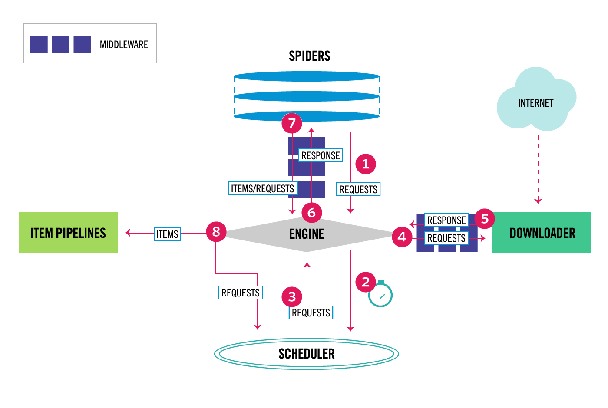


```tex
Components：

1、引擎(EGINE)
引擎负责控制系统所有组件之间的数据流，并在某些动作发生时触发事件。

2、调度器(SCHEDULER)
用来接受引擎发过来的请求, 压入队列中, 并在引擎再次请求的时候返回. 可以想像成一个URL的优先级队列, 由它来决定下一个要抓取的网址是什么, 同时去除重复的网址

3、下载器(DOWLOADER)
用于下载网页内容, 并将网页内容返回给EGINE，下载器是建立在twisted这个高效的异步模型上的

4、爬虫(SPIDERS)
SPIDERS是开发人员自定义的类，用来解析responses，并且提取items，或者发送新的请求

5、项目管道(ITEM PIPLINES)
在items被提取后负责处理它们，主要包括清理、验证、持久化（比如存到数据库）等操作
下载器中间件(Downloader Middlewares)位于Scrapy引擎和下载器之间，主要用来处理从EGINE传到DOWLOADER的请求request，已经从DOWNLOADER传到EGINE的响应response，

6、爬虫中间件(Spider Middlewares)
位于EGINE和SPIDERS之间，主要工作是处理SPIDERS的输入（即responses）和输出（即requests）

```

[官网链接](https://docs.scrapy.org/en/latest/topics/architecture.htm)

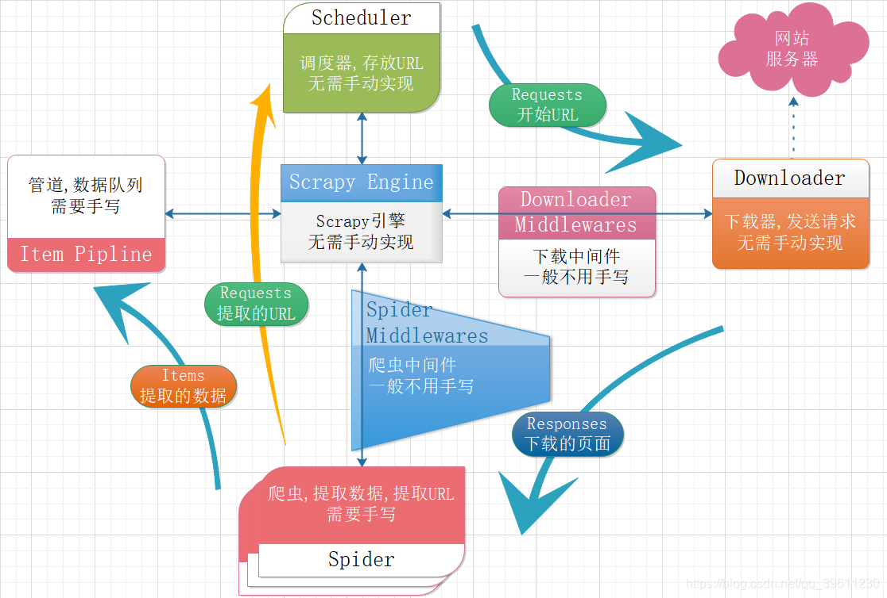

### （2）安装

```sql
#Windows平台
    1、pip3 install wheel #安装后，便支持通过wheel文件安装软件，wheel文件官网：https://www.lfd.uci.edu/~gohlke/pythonlibs
    3、pip3 install lxml
    4、pip3 install pyopenssl
    5、下载并安装pywin32：https://sourceforge.net/projects/pywin32/files/pywin32/
    6、下载twisted的wheel文件：http://www.lfd.uci.edu/~gohlke/pythonlibs/#twisted
    7、执行pip3 install 下载目录\Twisted-17.9.0-cp36-cp36m-win_amd64.whl
    8、pip3 install scrapy
  
#Linux平台
    1、pip3 install scrapy
```

### （3）命令行工具

```bash
# 1 查看帮助
    scrapy -h
    scrapy <command> -h

# 2 有两种命令：其中Project-only必须切到项目文件夹下才能执行，而Global的命令则不需要
    Global commands:
        startproject #创建项目
        genspider    #创建爬虫程序
        settings     #如果是在项目目录下，则得到的是该项目的配置
        runspider    #运行一个独立的python文件，不必创建项目
        shell        #scrapy shell url地址  在交互式调试，如选择器规则正确与否
        fetch        #独立于程单纯地爬取一个页面，可以拿到请求头
        view         #下载完毕后直接弹出浏览器，以此可以分辨出哪些数据是ajax请求
        version      #scrapy version 查看scrapy的版本，scrapy version -v查看scrapy依赖库的版本
    Project-only commands:
        crawl        #运行爬虫，必须创建项目才行，确保配置文件中ROBOTSTXT_OBEY = False
        check        #检测项目中有无语法错误
        list         #列出项目中所包含的爬虫名
        parse        #scrapy parse url地址 --callback 回调函数  #以此可以验证我们的回调函数是否正确
        bench        #scrapy bentch压力测试

# 3 官网链接
    https://docs.scrapy.org/en/latest/topics/commands.html
```

### （4）创建项目

创建项目命令：

```python
scrapy startproject NewsPro
cd NewsPro
scrapy genspider wangyi news.163.com
scrapy genspider huanqiu huanqiu.com
```

目录：

```apl
├── NewsPro
│   ├── __init__.py
│   ├── items.py
│   ├── middlewares.py
│   ├── pipelines.py
│   ├── settings.py
│   └── spiders
│       ├── __init__.py
│       ├── huanqiu.py
│       └── wangyi.py
└── scrapy.cfg

```

文件说明：

> - scrapy.cfg  项目的主配置信息，用来部署scrapy时使用，爬虫相关的配置信息在settings.py文件中。
> - items.py   设置数据存储模板，用于结构化数据，如：Django的Model
> - pipelines   数据处理行为，如：一般结构化的数据持久化
> - settings.py 配置文件，如：递归的层数、并发数，延迟下载等。强调:配置文件的选项必须大写否则视为无效，正确写法USER_AGENT='xxxx'
> - spiders    爬虫目录，如：创建文件，编写爬虫规则

`wangyi.py`

```python
import scrapy


class WangyiSpider(scrapy.Spider):
    name = "wangyi"
    allowed_domains = ["news.163.com"]
    start_urls = ["http://news.163.com/"]

    def parse(self, response):
        print("response:::", response.text)
```

启动爬虫程序：

```bash
scrapy crawl wangyi
```

每一次终端启动和麻烦，我们可以在**项目根目录**下新建启动文件，bin.py:

```python
from scrapy.cmdline import execute
execute(['scrapy', 'crawl', 'wangyi', "--nolog"])
```

### （5）settings 配置文件

##### 1. 为什么项目中需要配置文件

在配置文件中存放一些公共变量，在后续的项目中方便修改，如：本地测试数据库和部署服务器的数据库不一致

##### 2. 配置文件中的变量使用方法

> 1. 变量名一般全部大写
> 2. 导入即可使用

##### 3. settings.py中的重点字段和含义

```apl
- USER_AGENT 设置ua

- ROBOTSTXT_OBEY 是否遵守robots协议，默认是遵守

- CONCURRENT_REQUESTS 设置并发请求的数量，默认是16个

- DOWNLOAD_DELAY 下载延迟，默认无延迟 （下载器在从同一网站下载连续页面之前应等待的时间（以秒为单位）。这可以用来限制爬行速度，以避免对服务器造成太大影响）

- COOKIES_ENABLED 是否开启cookie，即每次请求带上前一次的cookie，默认是开启的

- DEFAULT_REQUEST_HEADERS 设置默认请求头，这里加入了USER_AGENT将不起作用

- SPIDER_MIDDLEWARES 爬虫中间件，设置过程和管道相同

- DOWNLOADER_MIDDLEWARES 下载中间件

- LOG_LEVEL 控制终端输出信息的log级别，终端默认显示的是debug级别的log信息

  - LOG_LEVEL = "WARNING"
    - CRITICAL  严重
    - ERROR  错误
    - WARNING  警告
    - INFO  消息
    - DEBUG   调试

- LOG_FILE 设置log日志文件的保存路径，如果设置该参数，终端将不再显示信息

  LOG_FILE = "./test.log"
  
- FEED_EXPORT_ENCODING='UTF-8' 保存的是unicode编码字符转为utf8
```

## 【2】 Spider类

Spiders是定义如何抓取某个站点（或一组站点）的类，包括如何执行爬行（即跟随链接）以及如何从其页面中提取结构化数据（即抓取项目）。换句话说，Spiders是您为特定站点（或者在某些情况下，一组站点）爬网和解析页面定义自定义行为的地方。　

```apl
1、 生成初始的Requests来爬取第一个URLS，并且标识一个回调函数
     第一个请求定义在start_requests()方法内默认从start_urls列表中获得url地址来生成Request请求，
     默认的回调函数是parse方法。回调函数在下载完成返回response时自动触发

2、 在回调函数中，解析response并且返回值
     返回值可以4种：
          包含解析数据的字典
          Item对象
          新的Request对象（新的Requests也需要指定一个回调函数）
          或者是可迭代对象（包含Items或Request）

3、在回调函数中解析页面内容
   通常使用Scrapy自带的Selectors，但很明显你也可以使用Beutifulsoup，lxml或其他你爱用啥用啥。

4、最后，针对返回的Items对象将会被持久化到数据库
   通过Item Pipeline组件存到数据库：https://docs.scrapy.org/en/latest/topics/item-pipeline.html）
   或者导出到不同的文件（通过Feed exports：https://docs.scrapy.org/en/latest/topics/feed-exports.html）
   
```

### 应用（网易新闻）

```python
import scrapy

class WangyiSpider(scrapy.Spider):
    name = 'wangyi'
    # allowed_domains = ['www.xxx.com']
    start_urls = ['https://news.163.com/']
    cate_list = []  # 每一个板块对应的url

    cate_num_map = {
        "{{__i == 0}}": "新闻",
        "{{__i == 1}}": "北京",
        "{{__i == 2}}": "国内",
        "{{__i == 3}}": "国际",
        "{{__i == 4}}": "独家",
    }

    # 数据解析：每一个板块对应的url
    def parse(self, response):
        with open("news163.html", "w") as f:
            f.write(response.text)

        cate_num_list = response.xpath('//*[contains(@ne-if,"{{")]/@ne-if').extract()
        print("cate_num_list", cate_num_list)

        for cate_num in cate_num_list:
            print("cate_num", cate_num)
            if cate_num in self.cate_num_map:
                cate_title = self.cate_num_map.get(cate_num)
                news_list = response.xpath(f'//*[contains(@ne-if,"{cate_num}")]/div/a')
                print(news_list)

                for news_selector in news_list:
                    news_title = news_selector.xpath('text()').extract_first()
                    news_detail_url = news_selector.xpath('@href').extract_first()

                    print("new_title", news_title)
                    print("new_detail_url", news_detail_url)
                    print("cate_title", cate_title)

                    # 对新闻详情页的url发起请求
                    print("发起新的请求，", news_detail_url)
                    yield scrapy.Request(url=news_detail_url, callback=self.parse_news_detail)

    def parse_news_detail(self, response):
        # 解析新闻内容
        # content = response.xpath('//*[@id="content"]/div[@class="post_body"]/p[contains(@id,"1M")]/text()').extract()
        content = response.xpath('//*[@id="content"]/div[@class="post_body"]/p/text()').extract()
        content = ''.join([i.strip() for i in content])

        if content:
            print("content", content)

    # 爬虫类父类的方法，该方法是在爬虫结束最后一刻执行
    def closed(self, spider):
        # self.bro.quit()
        print("此次爬虫全部结束！")

```

## 【3】 Item

抓取的主要目标是从非结构化源（通常是网页）中提取结构化数据。Scrapy爬虫可以像Python一样返回提取的数据。虽然方便和熟悉，但很容易在字段名称中输入拼写错误或返回不一致的数据，尤其是在具有许多爬虫的较大项目中。

为了定义通用输出数据格式，Scrapy提供了Item类。 Item对象是用于收集抓取数据的简单容器。它们提供类似字典的 API，并具有用于声明其可用字段的方便语法。

### 1、声明项目

使用简单的类定义语法和Field 对象声明项。这是一个例子：

```python
import scrapy
 
class Product(scrapy.Item):
    name = scrapy.Field()
    price = scrapy.Field()
    stock = scrapy.Field()
    last_updated = scrapy.Field(serializer=str)
```

注意那些熟悉Django的人会注意到Scrapy Items被宣告类似于Django Models，除了Scrapy Items更简单，因为没有不同字段类型的概念。

Field对象用于指定每个字段的元数据。例如，last_updated上面示例中说明的字段的序列化函数。

您可以为每个字段指定任何类型的元数据。Field对象接受的值没有限制。出于同样的原因，没有所有可用元数据键的参考列表。

Field对象中定义的每个键可以由不同的组件使用，只有那些组件知道它。您也可以根据Field自己的需要定义和使用项目中的任何其他键。

Field对象的主要目标是提供一种在一个地方定义所有字段元数据的方法。通常，行为取决于每个字段的那些组件使用某些字段键来配置该行为。

### 2、应用（网易新闻）

```python
import scrapy
from items import NewsProItem


class WangyiSpider(scrapy.Spider):
    name = 'wangyi'
    # allowed_domains = ['www.xxx.com']
    start_urls = ['https://news.163.com/']
    cate_list = []  # 每一个板块对应的url
    cate_num_map = {
        "{{__i == 0}}": "新闻",
        "{{__i == 1}}": "北京",
        "{{__i == 2}}": "国内",
        "{{__i == 3}}": "国际",
        "{{__i == 4}}": "独家",
    }

    # 数据解析：每一个板块对应的url
    def parse(self, response):
        with open("news163.html", "w") as f:
            f.write(response.text)

        cate_num_list = response.xpath('//*[contains(@ne-if,"{{")]/@ne-if').extract()
        print("cate_num_list", cate_num_list)

        for cate_num in cate_num_list:
            print("cate_num", cate_num)
            if cate_num in self.cate_num_map:
                cate_title = self.cate_num_map.get(cate_num)
                news_list = response.xpath(f'//*[contains(@ne-if,"{cate_num}")]/div/a')
                print(cate_title)
                print(news_list)

                for news_selector in news_list:
                    news_title = news_selector.xpath('text()').extract_first()
                    news_detail_url = news_selector.xpath('@href').extract_first()
                    cate_title = self.cate_num_map.get(cate_num)
                    print("new_title", news_title)
                    print("new_detail_url", news_detail_url)
                    print("cate_title", cate_title)
                    # 存储数据到item对象
                    item = NewsProItem()
                    item['cate'] = cate_title
                    item['title'] = news_title
                    # 对新闻详情页的url发起请求
                    print("发起新的请求，", news_detail_url)
                    yield scrapy.Request(url=news_detail_url, callback=self.parse_news_detail, meta={'item': item})

    def parse_news_detail(self, response):
        # 解析新闻内容
        # content = response.xpath('//*[@id="content"]/div[@class="post_body"]/p[contains(@id,"1M")]/text()').extract()
        content = response.xpath('//*[@id="content"]/div[@class="post_body"]/p/text()').extract()
        content = ''.join([i.strip() for i in content])
        item = response.meta['item']
        item['content'] = content
        if content:
            print("item", item)
            yield item

    # 爬虫类父类的方法，该方法是在爬虫结束最后一刻执行
    def closed(self, spider):
        # self.bro.quit()
        print("此次爬虫全部结束！")

```

## 【4】 Item PipeLine

在一个项目被蜘蛛抓取之后，它被发送到项目管道，该项目管道通过顺序执行的几个组件处理它。

每个项目管道组件（有时简称为“项目管道”）是一个实现简单方法的Python类。他们收到一个项目并对其执行操作，同时决定该项目是否应该继续通过管道或被丢弃并且不再处理。

项目管道的典型用途是：

> - cleansing HTML data
> - validating scraped data (checking that the items contain certain fields)
> - checking for duplicates (and dropping them)
> - storing the scraped item in a database

### 1 编写自己的项目管道

```python
'''
每个项管道组件都是一个必须实现以下方法的Python类：

process_item（self，项目，蜘蛛）
为每个项目管道组件调用此方法。process_item() 

必须要么：返回带数据的dict，返回一个Item （或任何后代类）对象，返回Twisted Deferred或引发 DropItem异常。丢弃的项目不再由其他管道组件处理。

此外，他们还可以实现以下方法：

open_spider（self，蜘蛛）
打开蜘蛛时会调用此方法。

close_spider（self，蜘蛛）
当蜘蛛关闭时调用此方法。

from_crawler（cls，crawler ）
如果存在，则调用此类方法以从a创建管道实例Crawler。它必须返回管道的新实例。Crawler对象提供对所有Scrapy核心组件的访问，
如设置和信号; 它是管道访问它们并将其功能挂钩到Scrapy的一种方式。
'''
```

### 2 项目管道示例

#### (1) 价格验证和丢弃物品没有价格

让我们看看下面的假设管道，它调整 `price`那些不包含增值税（`price_excludes_vat`属性）的项目的属性，并删除那些不包含价格的项目：

```python
from scrapy.exceptions import DropItem
 
class PricePipeline(object):
 
    vat_factor = 1.15
 
    def process_item(self, item, spider):
        if item['price']:
            if item['price_excludes_vat']:
                item['price'] = item['price'] * self.vat_factor
            return item
        else:
            raise DropItem("Missing price in %s" % item)
```

#### (2) 将项目写入JSON文件

以下管道将所有已删除的项目（来自所有蜘蛛）存储到一个`items.jl`文件中，每行包含一个以JSON格式序列化的项目：

注意JsonWriterPipeline的目的只是介绍如何编写项目管道。如果您确实要将所有已删除的项目存储到JSON文件中，则应使用Feed导出。

```python
import json
 
class JsonWriterPipeline(object):
 
    def open_spider(self, spider):
        self.file = open('items.jl', 'w')
 
    def close_spider(self, spider):
        self.file.close()
 
    def process_item(self, item, spider):
        line = json.dumps(dict(item)) + "\n"
        self.file.write(line)
        return item
```

#### (3) 将项目写入数据库（网易新闻应用）

在这个例子中，我们将使用[pymongo](https://api.mongodb.org/python/current/)将项目写入[MongoDB](https://www.mongodb.org/)。MongoDB地址和数据库名称在Scrapy设置中指定; MongoDB集合以item类命名。

```python
from scrapy.exceptions import DropItem
import pymongo


class NewsproPipeline:
    def process_item(self, item, spider):
        print("item:::", item)
        if not item["content"]:
            raise DropItem(f"{item['title']}content为空")

        return item


class MongoPipeline(object):
    mongo_db = "news"
    collection_name = 'wangyiNews'

    def __init__(self, mongo):
        self.mongo = mongo

    @classmethod
    def from_crawler(cls, crawler):
        # Scrapy会先通过getattr判断我们是否自定义了from_crawler,有则调它来完成实例化

        return cls(crawler.settings.get('MONGO'))

    def open_spider(self, spider):
        self.client = pymongo.MongoClient(host=self.mongo[0], port=self.mongo[1])
        self.db = self.client[self.mongo_db]

    def close_spider(self, spider):
        self.client.close()

    def process_item(self, item, spider):
        self.db[self.collection_name].insert_one(dict(item))
        print(f"news数据库的{self.collection_name}表中插入{item['title']}记录")
        return item

```

这个例子的要点是展示如何使用[`from_crawler()`](https://docs.scrapy.org/en/latest/topics/item-pipeline.html#from_crawler) 方法以及如何正确地清理资源。

补充知识点(**from_crawler**)：

当您使用 `settings` 对象获取全局变量时，可以在 Scrapy 配置文件中设置该变量的值，然后通过 `settings.get('MY_SETTING')` 方法来访问它。这样做很方便，但也有一些限制：

> - 您无法根据特定的 Crawler 实例动态地调整全局变量的值。例如，当您在多个爬虫之间共享同一个 Scrapy 项目时，某些设置可能需要在每个爬虫之间进行微调。
> - 您无法轻松地将其他参数传递给中间件。如果您想基于环境变量、命令行参数或其他外部因素配置中间件，那么使用 `settings` 对象可能很麻烦。

为了解决这些问题，Scrapy 引入了 `from_crawler` 方法。这个方法可以让您根据具体的 Crawler 实例创建中间件实例，并动态地向中间件传递其他参数。

具体来说，`from_crawler` 方法接收一个 `crawler` 参数，这是当前 Crawler 实例的引用。您可以使用 `crawler.settings` 访问 Scrapy 的全局配置变量，还可以使用 `crawler.signals` 注册信号处理程序，以及使用 `crawler.engine` 和 `crawler.spider` 访问其他 Scrapy 子系统和资源。

因此，在 `from_crawler` 中，您可以使用更多的 Scrapy 资源，并根据需要动态地配置中间件。这使得中间件更加灵活和可扩展，可以适应多种场景和需求。

#### (4) 重复过滤

一个过滤器，用于查找重复项目，并删除已处理的项目。假设我们的项目具有唯一ID，但我们的蜘蛛会返回具有相同ID的多个项目：

```python
from scrapy.exceptions import DropItem
 
class DuplicatesPipeline(object):
 
    def __init__(self):
        self.ids_seen = set()
 
    def process_item(self, item, spider):
        if item['id'] in self.ids_seen:
            raise DropItem("Duplicate item found: %s" % item)
        else:
            self.ids_seen.add(item['id'])
            return item
```

### 3 激活项目管道组件

要激活Item Pipeline组件，必须将其类添加到`settings.py`的 [`ITEM_PIPELINES`](https://docs.scrapy.org/en/latest/topics/settings.html#std:setting-ITEM_PIPELINES)设置中，如下例所示：

```python
ITEM_PIPELINES = {
    'myproject.pipelines.PricePipeline': 300,
    'myproject.pipelines.JsonWriterPipeline': 800,
    "NewsPro.pipelines.MongoPipeline": 500,
}
```

您在此设置中为类分配的整数值决定了它们运行的顺序：项目从较低值到较高值类进行。习惯上在0-1000范围内定义这些数字。

## 【5】下载中间件

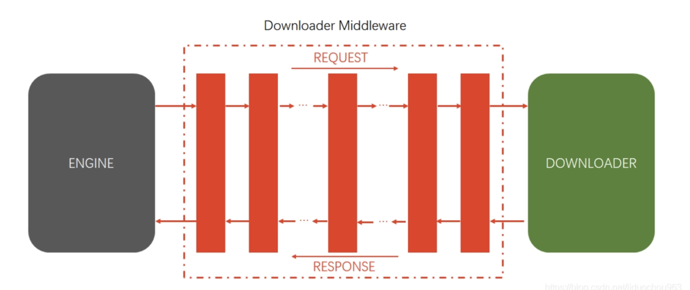

```python
class MyDownMiddleware(object):
    def process_request(self, request, spider):
        """
        请求需要被下载时，经过所有下载器中间件的process_request调用
        :param request: 
        :param spider: 
        :return:  
            None,继续后续中间件去下载；
            Response对象，停止process_request的执行，开始执行process_response
            Request对象，停止中间件的执行，将Request重新调度器
            raise IgnoreRequest异常，停止process_request的执行，开始执行process_exception
        """
        pass


    def process_response(self, request, response, spider):
        """
        spider处理完成，返回时调用
        :param response:
        :param result:
        :param spider:
        :return: 
            Response 对象：转交给其他中间件process_response
            Request 对象：停止中间件，request会被重新调度下载
            raise IgnoreRequest 异常：调用Request.errback
        """
        print('response1')
        return response

    def process_exception(self, request, exception, spider):
        """
        当下载处理器(download handler)或 process_request() (下载中间件)抛出异常
        :param response:
        :param exception:
        :param spider:
        :return: 
            None：继续交给后续中间件处理异常；
            Response对象：停止后续process_exception方法
            Request对象：停止中间件，request将会被重新调用下载
        """
        return None
```

案例

```python
import logging
import time
import random


# http://httpbin.org/get
class TestMiddleware:
    """This middleware allows spiders to override the user_agent"""
    user_agent_list = [
        'Mozilla/5.0 (Windows NT 10.0; Win64; x64) AppleWebKit/537.36 (KHTML, like Gecko) Chrome/58.0.3029.110 Safari/537.36 Edge/16.16299',
        'Mozilla/5.0 (Windows NT 6.1; WOW64) AppleWebKit/537.36 (KHTML, like Gecko) Chrome/56.0.2924.87 Safari/537.36',
        'Mozilla/5.0 (Windows NT 10.0; Win64; x64) AppleWebKit/537.36 (KHTML, like Gecko) Chrome/61.0.3163.100 Safari/537.36',
        'Mozilla/5.0 (Windows NT 6.1; WOW64) AppleWebKit/537.36 (KHTML, like Gecko) Chrome/61.0.3163.79 Safari/537.36',
        'Mozilla/5.0 (Windows NT 10.0; Win64; x64) AppleWebKit/537.36 (KHTML, like Gecko) Chrome/63.0.3239.132 Safari/537.36',
    ]

    proxies = [
        "http://61.216.185.88:60808",
    ]

    def process_request(self, request, spider):
        # 设置一个随机的UA
        request.headers['User-Agent'] = random.choice(self.user_agent_list)

        # 每一个请求延迟随机时间
        delay = random.uniform(0, 1)
        time.sleep(delay)
        logging.info(f"延迟{delay}秒发起请求")

        # 设置随机代理IP
        random_ip = random.choice(self.proxies)
        request.meta["proxy"] = random_ip
        logging.info(f"当前代理IP{random_ip}")

```

## 【6】进阶

### 1. start_rquests重写

scrapy中start_url是通过start_requests来进行处理的，其实现代码如下

```python
def start_requests(self):
    cls = self.__class__
    if method_is_overridden(cls, Spider, 'make_requests_from_url'):
        warnings.warn(
            "Spider.make_requests_from_url method is deprecated; it "
            "won't be called in future Scrapy releases. Please "
            "override Spider.start_requests method instead (see %s.%s)." % (
                cls.__module__, cls.__name__
            ),
        )
        for url in self.start_urls:
            yield self.make_requests_from_url(url)
    else:
        for url in self.start_urls:
            yield Request(url, dont_filter=True)
```

有些时候,需要重写starte_rquests方法发起首次请求

```python
import scrapy

class N17kSpider(scrapy.Spider):
    name = "n_17k"
    start_urls = ["https://user.17k.com/ck/author/shelf?page=1&appKey=2406394919"]

    def start_requests(self):
        '''
        请求登陆的账号和密码
        '''
        login_url = 'https://passport.17k.com/ck/user/login'
        # 使用request进行请求
        # yield scrapy.Request(url=login_url, body='loginName=17346570232&password=xlg17346570232', callback=self.do_login, method='POST')
        # 使用Request子类FormRequest进行请求  自动为post请求
        yield scrapy.FormRequest(
            url=login_url,
            formdata={'loginName': '13121758648', 'password': 'yuan0316'},
            callback=self.do_start
        )

    def do_start(self, response):
        '''
        登陆成功后调用parse进行处理
        cookie中间件会帮我们自动处理携带cookie
        '''
        for url in self.start_urls:
            yield scrapy.Request(url=url, callback=self.parse)

    def parse(self, response, **kwargs):
        with open("data.json", "w") as f:
            f.write(response.text)

```

### 2. 全站爬虫(CrawlSpider)

在之前 Scrapy 的基本使用当中，spider 如果要重新发送请求的话，就需要自己解析页面，然后发送请求。而 CrawlSpider 则可以通过设置 url 条件自动发送请求。

#### LinkExtractors

CrawlSpider 是 Spider 的一个派生类。CrawlSpider 与 spider 不同的是就在于下一次请求的 url 不需要自己手动解析，而这一点则是通过 LinkExtractors 实现的。

LinkExtractor类的构造方法如下所示。

```python
class scrapy.linkextractors.LinkExtractor(
    allow = (),
    deny = (),
    allow_domains = (),
    deny_domains = (),
    restrict_xpaths = (),
    tags = ('a','area'),
    attrs = ('href'),
    canonicalize = False,
    unique = True,
    process_value = None,
    deny_extensions = None,
    restrict_css=(),
   strip=True
)
```

其中的参数为：

```apl
allow：允许的 url。所有满足这个正则表达式的 url 都会被提取
deny：禁止的 url。所有满足这个正则表达式的 url 都不会被提取
allow_domains：允许的域名。只有在这个里面指定的域名的 url 才会被提取
deny_domains：禁止的域名。所有在这个里面指定的域名的 url 都不会被提取
restrict_xpaths：严格的 xpath。和 allow 共同过滤链接

tags：接收一个标签或标签列表，提取标签内的列表，默认为[‘a’, ‘area’]
attrs：接收一个属性或属性列表，提取指定属性内的链接，默认为[‘href’]
```

#### Rule

LinkExtractors 需要传递到 Rule 类对象中才能发挥作用。Rule 类常见的参数为：

```apl
link_extractors:是一个LinkExtractor对象，用于定义需要提取的链接

callback：从link_extractor中没获取链接时，参数所制定的值作为回调函数，该回调函数接受一个response作为起第一个参数
注意：当编写爬虫规则是，避免使用parse作为回调函数。由于CrawlSpider使用parse方法来实现其逻辑，如果覆盖了parse方法，CrawlSpider将会运行失败

follow：是一个布尔值(boolean),制定了根据该规则从response提取的链接是偶需要跟进。如果callback为None，follow默认设置为True，否则默认为Flase

process_links：指定该Spider中那个的函数将会被调用，从link_extractor中获取到链接列表是将会调用该函数。该方法主要用来过滤
process_request：指定该Spider中那个的函数将会被调用，该规则提取到每个request是都会调用该函数。(用来过滤request)

```

除了上述的这些差别，Crawlspider 和 spider 基本没有什么差别了。

#### CrawlSpider如何工作的？

**因为CrawlSpider继承了Spider，所以具有Spider的所有函数。**
 首先由`start_requests`对`start_urls`中的每一个url发起请求（`make_requests_from_url`)，这个请求会被parse接收。在Spider里面的parse需要我们定义，但CrawlSpider定义`parse`去解析响应（`self._parse_response(response, self.parse_start_url, cb_kwargs={}, follow=True)`）
 **_parse_response**根据有无`callback`,`follow`和`self.follow_links`执行不同的操作

eg:

```ruby
    def _parse_response(self, response, callback, cb_kwargs, follow=True):
    ##如果传入了callback，使用这个callback解析页面并获取解析得到的reques或item
        if callback:
            cb_res = callback(response, **cb_kwargs) or ()
            cb_res = self.process_results(response, cb_res)
            for requests_or_item in iterate_spider_output(cb_res):
                yield requests_or_item
    ## 其次判断有无follow，用_requests_to_follow解析响应是否有符合要求的link。
        if follow and self._follow_links:
            for request_or_item in self._requests_to_follow(response):
                yield request_or_item
```

其中`_requests_to_follow`又会获取`link_extractor`（这个是我们传入的LinkExtractor）解析页面得到的link`（link_extractor.extract_links(response)）`,对url进行加工（process_links，需要自定义），对符合的link发起Request。使用`.process_request`(需要自定义）处理响应。

#### 全站爬虫案例

创建项目：

```python
scrapy startproject imgPro
cd imgPro
scrapy genspider img
```

`spider.img.py`

````python
# -*- coding: utf-8 -*-
from scrapy.spiders import CrawlSpider, Rule
from scrapy.linkextractors import LinkExtractor
import os


class ImgSpider(CrawlSpider):
    name = 'img'

    # allowed_domains = ["netbian.com"]

    start_urls = ['http://www.daimg.com/pic/%E7%BE%8E%E5%A5%B3%E5%9B%BE%E7%89%87']

    link = LinkExtractor(tags=['img'], attrs='src', deny_extensions=[''], )
    link2 = LinkExtractor(allow=r'pic/%E7%BE%8E%E5%A5%B3%E5%9B%BE%E7%89%87')
    rules = (
        Rule(link, callback="parse_item", follow=False, ),
        Rule(link2, follow=True),
    )

    def parse_item(self, response):
        p = os.path.join("imgs", os.path.basename(response.url))
        with open(p, 'wb') as f:
            f.write(response.body)
        print(f"{p}下载完成！")
````

注意事项：

> 1. crawlspider爬虫默认继承了CrawlSpider类。
> 2. parse_item表示crawlspider爬虫的数据提取函数，在crawlspider爬虫中不能编写parse函数。parse函数是普通类独有的。
> 3. rules是元组类型，小括号后面必须加逗号","  
> 4. `scrapy  genspider -t crawl   爬虫名`可以直接生成CrawlSpider结构的模板代码

### 3. 分布式爬虫(scrapy_redis)

分布式爬虫是指将一个大型的爬虫任务分解成多个子任务，由多个爬虫进程或者多台机器同时执行的一种爬虫方式。在分布式爬虫中，每个爬虫进程或者机器都具有独立的爬取能力，可以独立地爬取指定的网页或者网站，然后将爬取到的数据进行汇总和处理。

分布式爬虫相对于单机爬虫的优势在于：

> 1. 高效性：分布式爬虫可以同时爬取多个网页或者网站，从而大大提高爬取速度和效率。
> 2. 可扩展性：分布式爬虫可以根据需要动态地添加或者删除爬虫进程或者机器，从而适应不同的爬虫任务需求。
> 3. 高稳定性：分布式爬虫可以通过任务分解和数据备份等机制保证任务的连续性和稳定性。
> 4. 高可靠性：分布式爬虫可以通过多个 IP 地址和 User-Agent 等方式来防止 IP 被封锁、反爬等问题。1

#### （1） scrapy-redis架构

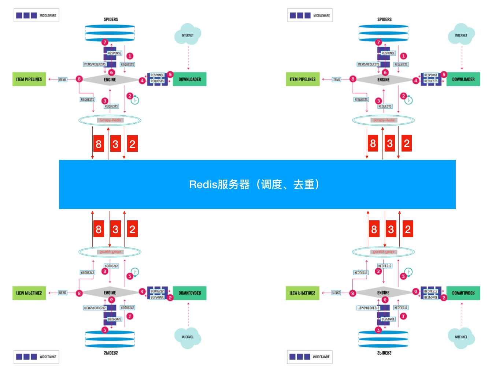


##### Scheduler

Scrapy改造了python本来的collection.deque(双向队列)形成了自己的Scrapy queue，但是Scrapy多个spider不能共享待爬取队列Scrapy queue， 即Scrapy本身不支持爬虫分布式，scrapy-redis 的解决是把这个Scrapy queue换成**redis数据库**（也是指redis队列），从同一个redis-server存放要爬取的request，便能让多个spider去同一个数据库里读取。

Scrapy中跟“待爬队列”直接相关的就是调度器Scheduler，它负责对新的request进行入列操作（加入Scrapy queue），取出下一个要爬取的request（从Scrapy queue中取出）等操作。它把待爬队列按照优先级建立了一个字典结构，比如：

```
{
        优先级0 : 队列0
        优先级1 : 队列1
        优先级2 : 队列2
    }
```


然后根据request中的优先级，来决定该入哪个队列，出列时则按优先级较小的优先出列。为了管理这个比较高级的队列字典，Scheduler需要提供一系列的方法。但是原来的Scheduler已经无法使用，所以使用Scrapy-redis的scheduler组件。

##### Duplication Filter

Scrapy中用集合实现这个request去重功能，Scrapy中把已经发送的request指纹放入到一个集合中，把下一个request的指纹拿到集合中比对，如果该指纹存在于集合中，说明这个request发送过了，如果没有则继续操作。

在scrapy-redis中去重是由Duplication Filter组件来实现的，它通过redis的set 不重复的特性，巧妙的实现了Duplication Filter去重。scrapy-redis调度器从引擎接受request，将request的指纹存⼊redis的set检查是否重复，并将不重复的request push写⼊redis的 request queue。

引擎请求request(Spider发出的）时，调度器从redis的request queue队列⾥里根据优先级pop 出⼀个request 返回给引擎，引擎将此request发给spider处理。

##### Item Pipeline

引擎将(Spider返回的)爬取到的Item给Item Pipeline，scrapy-redis 的Item Pipeline将爬取到的 Item 存⼊redis的 items queue。

修改过Item Pipeline可以很方便的根据 key 从 items queue 提取item，从⽽实现items processes集群。

##### Base Spider

不再使用scrapy原有的Spider类，重写的RedisSpider继承了Spider和RedisMixin这两个类，RedisMixin是用来从redis读取url的类。当我们生成一个Spider继承RedisSpider时，调用setup_redis函数，这个函数会去连接redis数据库，然后会设置signals(信号)：一个是当spider空闲时候的signal，会调用spider_idle函数，这个函数调用schedule_next_request函数，保证spider是一直活着的状态，并且抛出DontCloseSpider异常。一个是当抓到一个item时的signal，会调用item_scraped函数，这个函数会调用schedule_next_request函数，获取下一个request。

#### （2）Scrapy-Redis分布式策略

假设有四台电脑：Windows 10、Mac OS X、Ubuntu 16.04、CentOS 7.2，任意一台电脑都可以作为 Master端 或 Slaver端，比如：

Master端(核心服务器) ：使用 Windows 10，搭建一个Redis数据库，不负责爬取，只负责url指纹判重、Request的分配，以及数据的存储。Slaver端(爬虫程序执行端) ：使用 Mac OS X 、Ubuntu 16.04、CentOS 7.2，负责执行爬虫程序，运行过程中提交新的Request给Master。

首先Slaver端从Master端拿任务（Request、url）进行数据抓取，Slaver抓取数据的同时，产生新任务的Request便提交给 Master 处理；Master端只有一个Redis数据库，负责将未处理的Request去重和任务分配，将处理后的Request加入待爬队列，并且存储爬取的数据。

Scrapy-Redis默认使用的就是这种策略，我们实现起来很简单，因为任务调度等工作Scrapy-Redis都已经帮我们做好了，我们只需要继承RedisSpider、指定redis_key就行了。

缺点是，Scrapy-Redis调度的任务是Request对象，里面信息量比较大（不仅包含url，还有callback函数、headers等信息），可能导致的结果就是会降低爬虫速度、而且会占用Redis大量的存储空间，所以如果要保证效率，那么就需要一定硬件水平。

```python
from scrapy.linkextractors import LinkExtractor
from scrapy.spiders import CrawlSpider, Rule
from fbs2.items import DaImgItem

from scrapy_redis.spiders import RedisCrawlSpider


class DaimgSpider(RedisCrawlSpider): # 注意这里的继承类
    name = "daimg"

    # start_urls = ['http://www.daimg.com/pic/%E7%BE%8E%E5%A5%B3%E5%9B%BE%E7%89%87-0-0-0-0-0_1.html']
    redis_key = 'daImgQueue'

    link = LinkExtractor(allow=r'pic/%E7%BE%8E%E5%A5%B3%E5%9B%BE%E7%89%87')
    rules = (
        Rule(link, callback="parse_item", follow=False, ),
    )

    def parse_item(self, response):
        li_list = response.xpath('/html/body/div[5]/ul/li')
        for li in li_list:
            title = li.xpath('./a/img/@title').extract_first()
            src = li.xpath('./a/img/@src').extract_first()
            item = DaImgItem()
            item['img_name'] = title
            item['img_url'] = src
            print("item:::", item)
            yield item

```

> 注意：如果不是全站的深度爬虫，仅需要继承RedisSpider，来自`from scrapy_redis.spiders import RedisSpider`

`settings.py`

```python
# 增加了一个去重容器类的配置, 作用使用Redis的set集合来存储请求的指纹数据, 从而实现请求去重的持久化
DUPEFILTER_CLASS = "scrapy_redis.dupefilter.RFPDupeFilter"
# 使用scrapy-redis组件自己的调度器
SCHEDULER = "scrapy_redis.scheduler.Scheduler"
# 配置调度器是否要持久化, 也就是当爬虫结束了, 要不要清空Redis中请求队列和去重指纹的set。如果是True, 就表示要持久化存储, 就不清空数据, 否则清空数据
SCHEDULER_PERSIST = True

ITEM_PIPELINES = {
    'scrapy_redis.pipelines.RedisPipeline': 400
}


REDIS_HOST = '127.0.0.1'
REDIS_PORT = 6379
# REDIS_ENCODING = ‘utf-8’
# REDIS_PARAMS = {"password":"123456"}
```

在 Scrapy-Redis 分布式爬虫中，Redis 起到了以下作用：

> 1. 任务调度和分配：Scrapy-Redis 使用 Redis 数据库实现了多台机器之间的任务调度和分配，通过 Redis 中的队列来存储待爬取的 URL、请求和爬取状态等信息，从而实现多个爬虫进程或者机器之间的任务分配和调度。
> 2. URL 管理：Scrapy-Redis 使用 Redis 数据库来存储待爬取的 URL 队列和已经爬取过的 URL 集合，从而避免了爬虫任务的重复执行和冲突问题。
> 3. 数据存储：Scrapy-Redis 可以将爬取到的数据存储到 Redis 数据库中，从而实现分布式数据存储。这样可以避免单机存储造成的数据量过大和存储速度慢的问题。
> 4. 状态共享：Scrapy-Redis 使用 Redis 数据库作为状态存储，从而实现多台机器之间的状态共享。当一个爬虫进程爬取了一个 URL 后，它可以将爬虫状态保存到 Redis 数据库中，其他进程就可以直接从 Redis 数据库中获取该状态。

开启多个slaver端：

````python
scrapy crawl daming
````

启动Master端：

```python
# redis-cli
# flushall
# lpush daImgQueue http://www.daimg.com/pic/%E7%BE%8E%E5%A5%B3%E5%9B%BE%E7%89%87-0-0-0-0-0_1.html
```

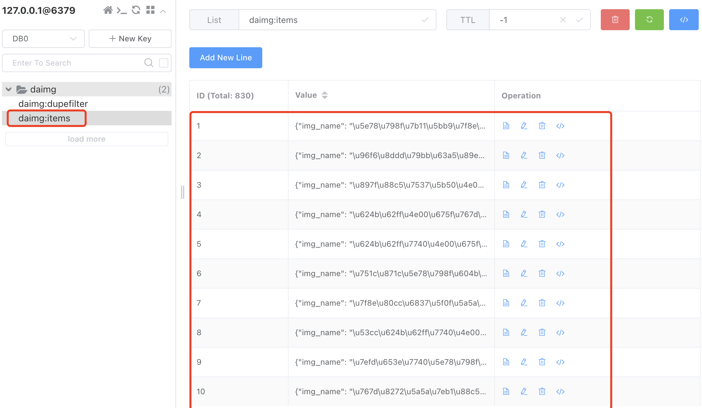


```apl
- 编码流程：
        1.创建工程
        2.cd proName
        3.创建crawlspider的爬虫文件
        4.修改一下爬虫类：
            - 导包：from scrapy_redis.spiders import RedisCrawlSpider
            - 修改当前爬虫类的父类：RedisCrawlSpider
            - allowed_domains和start_urls删除
            - 添加一个新属性：redis_key = 'xxxx'可以被共享的调度器队列的名称
        5.修改配置settings.py
            - 指定管道
                ITEM_PIPELINES = {
                        'scrapy_redis.pipelines.RedisPipeline': 400
                    }
            - 指定调度器
                # 增加了一个去重容器类的配置, 作用使用Redis的set集合来存储请求的指纹数据, 从而实现请求去重的持久化
                DUPEFILTER_CLASS = "scrapy_redis.dupefilter.RFPDupeFilter"
                # 使用scrapy-redis组件自己的调度器
                SCHEDULER = "scrapy_redis.scheduler.Scheduler"
                # 配置调度器是否要持久化, 也就是当爬虫结束了, 要不要清空Redis中请求队列和去重指纹的set。
                # 如果是True, 就表示要持久化存储, 就不清空数据, 否则清空数据
                SCHEDULER_PERSIST = True
            - 指定redis数据库
                REDIS_HOST = 'redis服务的ip地址'
                REDIS_PORT = 6379
         6.配置redis数据库（redis.windows.conf）
            - 关闭默认绑定
                - 56Line：#bind 127.0.0.1
            - 关闭保护模式
                - 75line：protected-mode no
         7.启动redis服务（携带配置文件）和客户端
            - redis-server.exe redis.windows.conf
            - redis-cli
         8.执行工程
            - scrapy runspider spider.py
         9.将起始的url仍入到可以被共享的调度器的队列（sun）中
            - 在redis-cli中操作：lpush sun www.xxx.com
         10.redis:
            - xxx:items:存储的就是爬取到的数据
```


# 第九章. JS进阶

https://developer.mozilla.org/zh-CN/docs/Web/API/Window

## 9.1、JS对象

### 1. 字符串对象

### 2. 数组对象

### 3. object对象

### 4. Date对象

创建Date对象:

```js
var now=new Date();
console.log(now.toLocaleString( ));

/*
获取日期和时间
now.getDate()                 获取日
now.getDay ()                 获取星期
now.getMonth ()               获取月（0-11）
now.getFullYear ()            获取完整年份
now.getYear ()                获取年
now.getHours ()               获取小时
now.getMinutes ()             获取分钟
now.getSeconds ()             获取秒
now.getMilliseconds ()        获取毫秒
now.getTime ()                返回累计毫秒数(从1970/1/1午夜)*/

```

### 5. Math对象

```js
 //  Number对象的内置方法
 //  toFixed(x) 保留小数位
 var num = 100.3;
 var ret = num.toFixed(2);
 console.log(num);  // 100.3
 console.log(ret);  // 100.30

// Math对象的内置方法
// abs(x)  返回数值的绝对值
// var num = -10;
console.log( Math.abs(num) ); // 10

// ceil(x)  向上取整
var num = 10.3;
console.log( Math.ceil(num) ); // 11

// floor(x) 向下取整
var num = 10.3;
console.log( Math.floor(num) ); // 10

// max(x,y,z,...,n)
console.log( Math.max(3,56,3) ); // 56
// min(x,y,z,...,n)

// pow(x,y)
console.log(Math.pow(3, 2)); // 相等于 3**2
console.log( 3**2 ); // 使用这个,上面废弃

// random()  生成0-1随机数
console.log(Math.random());

// 生成0-10之间的数值
console.log( Math.random() * 10 );

// round(x) 四舍五入
// 生成0-10之间的整数
console.log( Math.round( Math.random() * 10 ) );
```

- 练习：获取1-100的随机整数，包括1和100

  ```js
  var num=Math.random();
  num=num*100;
  num=Math.round(num);
  console.log(num)
  ```

### 6. Function对象

#### (1) 函数作用域

作用域是JavaScript最重要的概念之一，想要学好JavaScript就需要理解JavaScript作用域和作用域链的工作原理。

任何程序设计语言都有作用域的概念，简单的说，作用域就是变量与函数的可访问范围，即作用域控制着变量与函数的可见性和生命周期。在JavaScript中，变量的作用域有全局作用域和局部作用域两种。

局部变量,是在函数内部声明,它的生命周期在当前函数被调用的时候, 当函数调用完毕以后,则内存中自动销毁当前变量.

全局变量,是在函数外部声明,它的生命周期在当前文件中被声明以后就保存在内存中,直到当前文件执行完毕以后,才会被内存销毁掉。

```js
//  首先熟悉下var

var name = "yuan"; // 声明一个全局变量 name并赋值”yuan“
name = "张三";  // 对已经存在的变量name重新赋值 ”张三“
console.log(name);

age = 18   // 之前不存在age变量，这里等同于var age = 19 即声明全局变量age并赋值为18

var  gender = "male"
var  gender = "female" // 原内存释放与新内存开辟，指针指向新开辟的内存
console.log(gender)
```

作用域案例：

```js
var num = 10; // 在函数外部声明的变量, 全局变量
function func(){
    // num = 20; // 函数内部直接使用变量,则默认调用了全局的变量,
    //var num = 20; // 函数内部使用var 或者 let声明的变量则是局部变量
              // 函数内部直接使用变量,则默认调用了全局的变量,
              // 使用变量的时候,解释器会在当前花括号范围值搜索是否有关键字var 或者 let 声明了变量,如果没有,则一层一层往外查找          最近的声明
              // 如果最终查找不到,则直接报错! 变量名 is not define!
    console.log("函数内部num：",num)
}
func();
console.log("全局num：",num);
```

#### (2) 匿名函数

匿名函数，即没有变量名的函数。在实际开发中使用的频率非常高！也是学好JS的重点。

```js
// 匿名函数赋值变量
 var foo = function () {
     console.log("这是一个匿名函数！")
 };

// 匿名函数的自执行
(function (x,y) {
     console.log(x+y);
 })(2,3)


// 匿名函数作为一个高阶函数使用
function bar() {

  return function () {
      console.log("inner函数！")
  }
}

bar()()
```

#### (3) 闭包函数

闭包（closures）是 Javascript 语言的一个难点，也是它的特色，很多高级应用都是依靠闭包实现的。闭包与变量的作用域以及变量的生命周期密切相关，本节我们就来简单介绍一下。

> 在计算机科学中，闭包（英语：Closure），又称词法闭包（Lexical Closure）或函数闭包（function closures），是引用了自由变量（外部非全局）的函数。

简单来说就是一个函数定义中引用了函数外定义的变量，并且该函数可以在其定义环境外被执行。这样的一个函数我们称之为闭包函数。

我们先看一段代码。

```html
<script>

    var key = "123456"

    function foo(){
        console.log(key)
    }

</script>

<script>

    var key = "abcdefg"

    function bar(){
        console.log(key)
    }

</script>

<script src="test01.js"></script>
<script src="test02.js"></script>
```

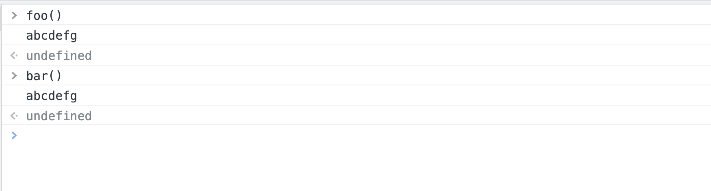

这就是**全局变量污染**

很明显,  虽然各自js在编写时是分开的. 但是在运行时, 是在同一个空间内执行的. 他们拥有相同的作用域. 此时的变量势必是非常非常不安全的. 那么如何来解决呢?  注意, 在js里. 变量是有作用域的. 也就是说一个变量的声明和使用是有范围的. 不是无限的. 这一点, 很容易验证.

```js
function fn(){
    let love = "爱呀"
}
fn()
console.log(love)
```

直接就报错了.  也就是说. 在js里是有全局和局部的概念的. 

直接声明在最外层的变量就是全局变量. 所有函数, 所有代码块都可以共享的. 但是反过来就不是了. 在函数内和代码块内声明的变量. 尤其是函数内. 声明出来的变量它是一个局部变量. 外界是无法进行访问的，即函数是可以开辟独立的作用域环境的。我们就可以利用这一点来给每个功能脚本创建一个局部空间. 就像这样：

```html
<script>

    var f = (function () {
        let key = "123456"

        function foo() {
            return key
        }

        return foo
    })()

</script>

<script>

    var b = (function () {
        let key = "abcdefg"

        function bar() {
            return key
        }

        return bar
    })()

</script>

```

html里面使用时:

```html
 <script src="test01.js"></script>
 <script src="test02.js"></script>
  <script>
      console.log(f())
      console.log(b())
  </script>
```

#### (4) prototype 原型对象

案例1:

```js
// 创建方式1
var foo = new Function("console.log('hello world!')")
foo()

// 创建方式2
function Person() {
      console.log("hello person")
}

var p1 = Person()
console.log(p1)

var p2 = new Person()
console.log(p2)
```

##### 什么是JS原型对象?

> 1. prototype(原型对象)就是一个容器.   {}
> 2. 存放公共的方法给对象使用.
> 3. 对象可以直接访问原型对象中的方法和属性.
> 4. 原型对象类似Python的类对象（fn.prototype）

##### 原型对象和函数之间的关系.

> - 每个函数都会有一个`prototype`属性,指向原型对象.
> - 每个原型对象都会有一个`constructor`属性,指向函数.
> - 总结:每个函数与原型对象之间的关系是`互相引用`.


##### 对象和原型对象和函数之间的关系

> - 函数创建对象`var o = new Fn();`
> - 对象通过`__proto__`属性,指向原型对象.
> - 对象可以直接调用原型对象中所有的属性和方法.
> - 对象可以通过原型对象中的constructor属性知道构造函数
> - 总结: 原型对象就是一个容器,帮助函数存放公共方法,以及给函数new出来的对象提供公共方法使用.


```js
function Dog(name, age) {
    this.name = name;//面试题：构造函数中的this指向谁？ 答：指向new创建的对象
    this.age = age;
    this.sleep = function () {
        console.log("sleeping")
    }

}

// Dog("rain",12) // 普通函数
//构造函数
let alex = new Dog("alex", 36);   // 使用new来创建对象
let eric = new Dog("eric", 35);   // 使用new来创建对象

// (1) 函数对象通过prototype容器设置公共属性和方法
Dog.prototype.eat = function (food) {
    console.log(this.name +"吃"+ food);
}

alex.eat("吃骨头")
eric.eat("吃肉")

// (2) 对象通过`__proto__`属性,指向原型对象
console.log(alex.__proto__)
console.log(alex.__proto__.constructor.name)
console.log(alex.__proto__.constructor)

// 看看能不能理解
console.log(alex.__proto__ === Dog.prototype)
console.log(Dog.prototype)

alex.age = 100
console.log(alex.age) // 先查找自己的空间，找不到，去原型中找
console.log(eric.age)

// 猜一猜1
Dog.prototype.sleep =function (){
    console.log("prototype sleeping")
}

alex.sleep()

// 猜一猜2
let zhangSan = new Dog("张三", 35);
Dog.prototype = {
    fly:function (){
        console.log("flying...")
    }
}
// let zhangSan = new Dog("张三", 35);
// zhangSan.fly()
zhangSan.eat("辣条")

```

#### (5) call和apply方法

call，apply都属于Function.prototype的一个方法，它是JavaScript引擎内在实现的，因为属于Function.prototype，所以每个Function对象实例(就是每个方法)都有call，apply属性。既然作为方法的属性，那它们的使用就当然是针对方法的了，这两个方法是容易混淆的，因为它们的作用一样，只是使用方式不同。

```js
foo.call(this, arg1,arg2,arg3) == foo.apply(this, arguments) == this.foo(arg1, arg2, arg3);
```

案例1:

```js
function Person(name, age) {
    this.name = name
    this.age = age
}

Person.prototype.eat = function () {
    console.log(this.name + "正在吃东西")
}

p = new Person("yuan", 22)

p.eat()
```

案例2:

```js
function Person(name, age) {
    this.name = name
    this.age = age
}
p = new Person("yuan", 22)

function eat () {
    console.log(this.name + "正在吃东西")
}
eat.call(p)
```

案例3:

```js
function Person(name, age) {
    this.name = name
    this.age = age
}
p = new Person("yuan", 22)

function eat () {
    console.log(this.name + "正在吃东西")
}
eat.call(p)
eat.apply(p)
```

> 如果call和apply的第一个参数写的是null，那么this指向的是window对象

案例4:

```js
function Person(name, age) {
    this.name = name
    this.age = age
}

p = new Person("yuan", 22)

function eat(a, b, c) {
    console.log(this.name + "正在吃东西")
    console.log(a, b, c)
}

eat.call(p, "1", "2", "3")
eat.apply(p, ["1", "2", "3"])
// apply传递多个参数的时候第二个参数需要传递一个数组
```


### 7. window对象 

window 是客户端浏览器对象模型的基类，window 对象是客户端 JavaScript 的全局对象。一个 window 对象实际上就是一个独立的窗口，对于框架页面来说，浏览器窗口每个框架都包含一个 window 对象。

#### （1）全局作用域

在客户端浏览器中，window 对象是访问 BOM 的接口，如引用 document 对象的 document 属性，引用自身的 window 和 self 属性等。同时 window 也为客户端 JavaScript 提供全局作用域。

由于 window 是全局对象，因此所有的全局变量都被解析为该对象的属性。

```html
<script>

    var username = "yuanhao";  //全局变量
    function f() {  //全局函数
        console.log(username);
    }

    console.log(window.username);  //返回字符串“yuanhao”
    window.f();  //返回字符串“yuanhao”

</script>


```

#### （2）使用系统对话框

window 对象定义了 3 个人机交互的方法，主要方便对 JavaScript 代码进行调试。

- alert()：确定提示框。由浏览器向用户弹出提示性信息。该方法包含一个可选的提示信息参数。如果没有指定参数，则弹出一个空的对话框。
- confirm()：选择提示框。。由浏览器向用户弹出提示性信息，弹出的对话框中包含两个按钮，分别表示“确定”和“取消”按钮。如果点击“确定”按钮，则该方法将返回 true；单击“取消”按钮，则返回 false。confirm() 方法也包含一个可选的提示信息参数，如果没有指定参数，则弹出一个空的对话框。
- prompt()：输入提示框。可以接收用户输入的信息，并返回输入的信息。prompt() 方法也包含一个可选的提示信息参数，如果没有指定参数，则弹出一个没有提示信息的输入文本对话框。

#### （3）访问客户端对象

使用 window 对象可以访问客户端其他对象，这种关系构成浏览器对象模型，window 对象代表根节点，浏览器对象关系的关系如图所示，每个对象说明如下。

- window：客户端 JavaScript 顶层对象。每当 <body> 或 <frameset> 标签出现时，window 对象就会被自动创建。
- navigator：包含客户端有关浏览器信息。
- screen：包含客户端屏幕的信息。
- history：包含浏览器窗口访问过的 URL 信息。
- location：包含当前网页文档的 URL 信息。
- document：包含整个 HTML 文档，可被用来访问文档内容及其所有页面元素。

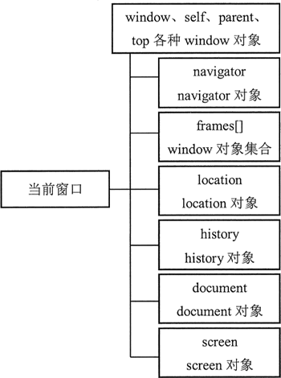

#### （4）使用定时器

window 对象包含 4 个定时器专用方法，说明如下表所示，使用它们可以实现代码定时执行，或者延迟执行，使用定时器可以设计演示动画。

| 方法            | 说明                                             |
| --------------- | ------------------------------------------------ |
| setInterval()   | 按照执行的周期（单位为毫秒）调用函数或计算表达式 |
| setTimeout()    | 在指定的毫秒数后调用函数或计算表达式             |
| clearInterval() | 取消由 setInterval() 方法生成的定时器            |
| clearTimeout()  | 取消由 setTimeout() 方法生成的定时器             |

setTimeout() 方法能够在指定的时间段后执行特定代码。用法如下：

`var o = setTimeout(code, delay)`

参数 code 表示要延迟执行的字符串型代码，将在 Windows 环境中执行，如果包含多个语句，应该使用分号进行分隔。delay 表示延迟时间，以毫秒为单位。

该方法返回值是一个 Timer ID，这个 ID 编号指向延迟执行的代码控制句柄。如果把这个句柄传递给 clearTimeout() 方法，则会取消代码的延迟执行。

```html
<!DOCTYPE html>
<html lang="en">
<head>
    <meta charset="UTF-8">
    <title>Title</title>


</head>
<body>

<input id="ID1" type="text" >
<button onclick="begin()">开始</button>
<button onclick="end()">停止</button>

<script>
    function showTime(){
           var nowd2=new Date().toLocaleString();
           var temp=document.getElementById("ID1");
           temp.value=nowd2;

    }
    var ID;
    function begin(){
        if (ID==undefined){
             showTime();
             ID=setInterval(showTime,1000);
        }
    }
    function end(){
        clearInterval(ID);
        ID=undefined;
    }

</script>

</body>
</html>
```

## 9.2、ES6新语法

### 1. var、let以及const

ES6 中引入了关键字 let 和 const 作为 var 的替代。它们非常有用，如今几乎每个 JavaScript 开发人员都在使用它们。

与关键字 var 不同，这两个关键字具有块作用域。这意味着当你在块中声明它们时，它们只能在该块 {} 内访问。

```js
// for (var i=0;i<10;i++){
//     console.log(i)
// }
// console.log(i)


for (let i=0;i<10;i++){
    console.log(i)
}
console.log(i)
```

**变量提升**

看以下代码, 或多或少会有些问题的.

```js
function fn(){
    console.log(name);
    var name = 'yuan';
}
fn()
```

发现问题了么. 这么写代码, 在其他语言里. 绝对是不允许的. 但是在js里. 不但允许, 还能执行. 为什么呢?  因为在js执行的时候. 它会首先检测你的代码.  发现在代码中会有name使用. OK. 运行时就会变成这样的逻辑:

```js
function fn(){
    var name;
    console.log(name);
    name = 'yuan';
}
fn()
console.log(a);
```

看到了么. 实际运行的时候和我们写代码的顺序可能会不一样....这种把变量提前到代码块第一部分运行的逻辑被称为变量提升. 这在其他语言里是绝对没有的. 并且也不是什么好事情. 正常的逻辑不应该是这样的. 那么怎么办?  在新的ES6中. 就明确了, 这样使用变量是不完善的. es6提出. 用let来声明变量. 就不会出现该问题了. 

```js
function fn(){
    console.log(name);  // 直接报错, let变量不可以变量提升.
    let name = 'yuan'; 
}
fn()
```

结论一, 用let声明变量是新版本javascript提倡的一种声明变量的方案

let还有哪些作用呢?  

```js
function fn(){
  
    var name = "rain";
    var name = "yuan";
    console.log(name);
}
fn()
```

显然一个变量被声明了两次. 这样也是不合理的. var本意是声明变量. 同一个东西. 被声明两次. 所以ES6规定. let声明的变量. 在同一个作用域内. 只能声明一次. 

```js
function fn(){

    let name = "yuan";
    let name = "rain";
    console.log(name);
}
fn()
```

注意, 报错是发生在代码检查阶段. 所以. 上述代码根本就执行不了. 

结论二, 在同一个作用域内. let声明的变量只能声明一次. 其他使用上和var没有差别。

除了 let，ES6 同时还增加了 const 关键字。使用 const 声明的变量必须同时初始化为某个值。 一经声明，在其生命周期的任何时候都不能再重新赋予新值。

````html
 
<script>
        // const声明常量必须赋初始值
        const a=6;//合法有效
        const b;//报错 SyntaxError，必须赋初始值才可以
  
       // const声明的常量不能更改
        const a=6;//合法有效
        a=7;//报错，不能更改
  
       /*
       对于const声明的原始数据类型，一旦声明变不能更改，但是对于引用数据类型，虽然不能重新赋值给某个新的引用类型变量。但是操作操作引用数据类型变量中的元素或者属性却是合法的。因为这些操作不会改变引用数据类型的地址。
       */
  
       const obj={};
       obj.name="南山行者";//合法有效
       console.log(obj);

       const arr=[1,2,3];
       arr.push(3);//合法有效
       arr.shift();//合法有效
       console.log(arr);
   
</script>
````

### 2. ES6中的箭头函数

在ES6中简化了函数的声明语法. 

```js
// es6允许使用“箭头”(=>)定义函数。
var f = v => v
// 等同于
var f = function(v) {
 return v
}

// 如果箭头函数不需要参数或需要多个参数，就使用一个圆括号代表参数部分。
var f = () => 5
// 等同于
var f = function() {
   return 5
}
 
var sum = (num1, num2) => num1 + num2
// 等同于
var sum = function(num1, num2) {
   return num1 + num2
}

// 如果箭头函数的代码块部分多于一条语句，就要使用大括号将它们括起来，并且使用return语句返回。
var sum = (num1, num2) => {return num1 + num2}

//由于大括号被解释为代码块，所以如果箭头函数直接返回一个对象，必须在对象外面加上括号，否则会报错。

// 报错
let getUser = id => {id: id, name: "yuan"}
// 不报错
let getUser = id => ({id: id, name: "yuan"})


// 箭头函数的一个用处是简化回调函数。
// 正常函数写法
[1, 2, 3].map(function(x) {
 return x * x
})
// 箭头函数写法
[1, 2, 3].map(x => x * x)
```

### 3. ES6对象简写

```js
var name = "yuan"
var age = 22

function run() {
    console.log(this.name + " running")
}

p1 = {
    name,
    age,
    eat: function () {
        console.log(this.name + " is eating")
    },
    run: run,
}

p1.eat()
p1.run()
```

### 4. ES6格式化

ES6中允许使用反引号 ` 来创建字符串，
此种方法创建的字符串里面可以包含由美元符号加花括号包裹的变量 ${vraible}。

```js
var num = Math.random()
console.log(`生成一个随机数：${num}`)
```

## 9.3、JS工具

### 1. 三元运算符

```js
三元运算符:  条件表达式?语句1:语句2;  
/*
             * 条件运算符也叫三元运算符
             *     语法：
             *         条件表达式?语句1:语句2;
             *     - 执行的流程：
             *         条件运算符在执行时，首先对条件表达式进行求值，
             *             如果该值为true，则执行语句1，并返回执行结果
             *             如果该值为false，则执行语句2，并返回执行结果
             *         如果条件的表达式的求值结果是一个非布尔值，
             *             会将其转换为布尔值然后在运算
             */  

```

案例1:

```js
let a = 10;
let b = 20;
let d = a > b? a: b
console.log(d);

```

案例2:

```js
let a = 10;
let b = 20;
let c = 5;
let d = 17;

let e;
let m;

e = (e = a > 3 ? b : c, m = e < b++ ? c-- : a = 3 > b % d ? 27: 37, m++)
// e = a > 3 ? b : c // e=b=20
// m = e < b++ ? c-- : a = 3 > b % d ? 27: 37// m=a=37
// e = m++ // e= 37 m=38 
console.log(e);
console.log(c);
console.log(m);
```

### 2. eval

eval() 函数计算 JavaScript 字符串，并把它作为脚本代码来执行。

如果参数是一个表达式，eval() 函数将执行表达式。如果参数是Javascript语句，eval()将执行 Javascript 语句。

```js
eval(string)
// 
eval('[1,2,3,4,5].map(x=>x*x)')
```

> http://tools.jb51.net/password/evalencode

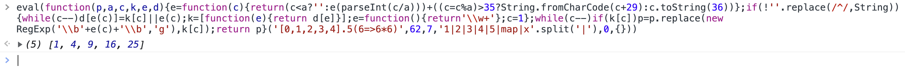

### 3. Hook函数

在 JS 逆向中，我们通常把替换原函数的过程都称为 Hook。

```js
function foo() {
    console.log("foo功能...")
    return 123
}
foo()

var _foo = foo

foo = function () {
    console.log("截断开始...")
    debugger;
    _foo()
    console.log("截断结束...")
}
```

```js
function foo(a, b, c, d, e, f) {
    console.log("foo功能...")
    console.log(a, b, c, d, e, f)
    return 123
}

var _foo = foo

foo = function () {
    console.log("截断开始...")
    // _foo(arguments)
    _foo.apply(this,arguments)
    console.log("截断结束...")
}

foo(1,2,3,4,5,6,7)
```

#### 案例1: Hook eval

```js
console.log("程序开始")
// eval("console.log('yuan')")
window["e"+"v"+"a"+"l"]("console.log('eval yuan')")
console.log("程序结束")
```

````js
var _eval = eval

eval = function (src) {
    console.log("eval截断开始...")
    debugger;
    _eval.apply(this, src)
    console.log("eval截断结束...")
}
````

#### 案例2: Hook JSON.stringify

JSON.stringify() 方法用于将 JavaScript 值转换为 JSON 字符串，在某些站点的加密过程中可能会遇到，以下代码演示了遇到 JSON.stringify() 时，则插入断点：

```js
(function() {
    var stringify = JSON.stringify;
    JSON.stringify = function(params) {
        console.log("Hook JSON.stringif:::", params);
        debugger;
        return stringify(params);
    }
})();
```

#### 案例3: Hook JSON.parse

JSON.parse() 方法用于将一个 JSON 字符串转换为对象，在某些站点的加密过程中可能会遇到，以下代码演示了遇到 JSON.parse() 时，则插入断点：

```js
(function() {
    var parse = JSON.parse;
    JSON.parse = function(params) {
        console.log("Hook JSON.parse::: ", params);
        debugger;
        return parse(params);
    }
})();
```

#### 案例4: Hook Cookie

一般使用Object.defineProperty()来进行属性操作的hook。那么我们了解一下该方法的使用。

```apl
Object.defineProperty(obj, prop, descriptor)

// 参数
obj：对象；
prop：对象的属性名；
descriptor：属性描述符；
```

一般hook使用的是get和set方法，下边简单演示一下

```js
var people = {
    name: '张三',
};

Object.defineProperty(people, 'age', {
    get: function () {
        console.log('获取值！');
        return count;
    },
    set: function (val) {
        console.log('设置值！');
        count = val + 1;
    },
});

people.age = 18;
console.log(people.age);
```

通过这样的方法，我们就可以在设置某个值的时候，添加一些代码，比如 debugger;，让其断下，然后利用调用栈进行调试，找到参数加密、或者参数生成的地方，需要注意的是，网站加载时首先要运行我们的 Hook 代码，再运行网站自己的代码，才能够成功断下，这个过程我们可以称之为 Hook 代码的注入。

```js
(function(){
   'use strict'
    var _cookie = "";
    Object.defineProperty(document, 'cookie', {
        set: function(val) {
            console.log(val);
            debugger
            _cookie = val;
            return val;
        },
        get: function() {
            return _cookie;
        },
});
})()
```


# 第十章. JS逆向爬虫

JS逆向的目的是通过运行本地JS的文件或者代码,以实现脱离他的网站和浏览器,并且还能拿到和浏览器加密一样的效果。

## 10.1、PyExecJS模块

pyexecjs是一个可以帮助我们运行js代码的一个第三方模块.  其使用是非常容易上手的. 

但是它的运行是要依赖能运行js的第三方环境的. 这里我们选择用node作为我们运行js的位置. 

### 【1】 安装Nodejs

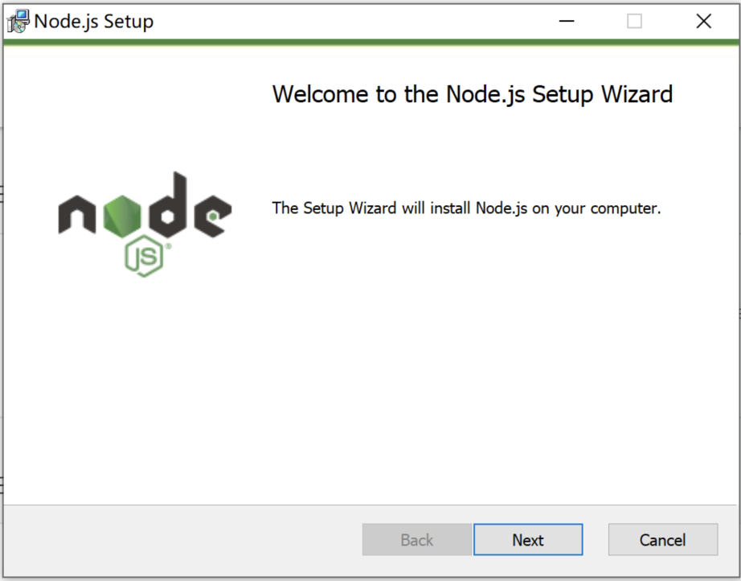


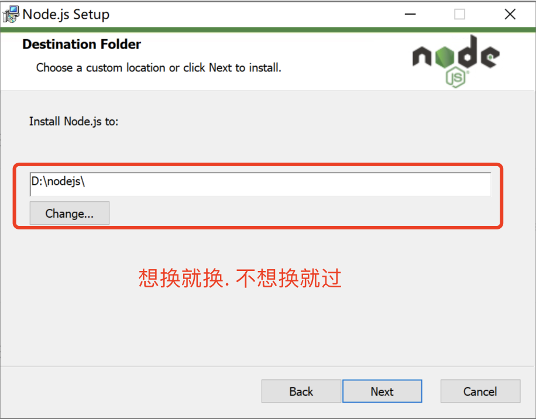

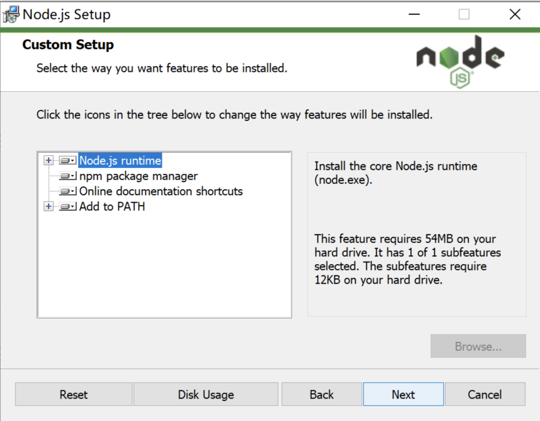

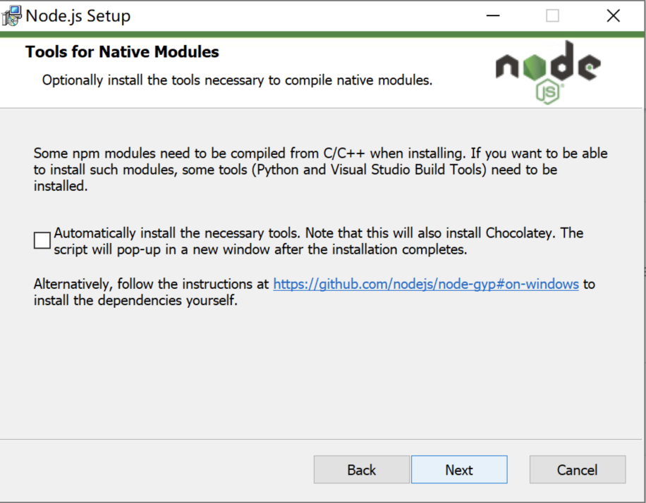


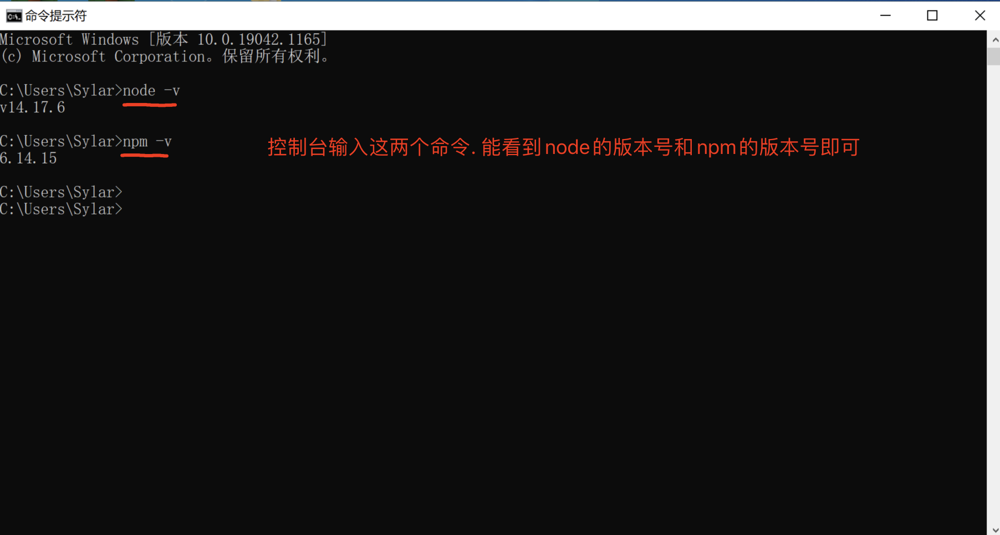

切记. 重启pycharm或者重启电脑. 

### 【2】 安装pyexecjs

```
pip install pyexecjs
```

测试一下:

````python
import execjs

print(execjs.get().name)  # 需要重启pycharm或者重启电脑 Node.js (V8)
````

简单使用

```python
import execjs

print(execjs.get().name)

# execjs.eval 可以直接运行js代码并得到结果
js = """
"a,b,c,d".split(",")
"""
res = execjs.eval(js)
print(res)

# execjs.compile(),  call()
# execjs.compile() 事先加载好一段js代码,
jj = execjs.compile("""
    function foo(a, b){
        return a + b    
    }
""")
# call() 运行代码中的xxx函数. 后续的参数是xxx的参数
ret = jj.call("foo", 10, 20)
print(ret)
```

windows中如果出现编码错误. 在引入execjs之前. 插入以下代码即可.

```python
import subprocess
from functools import partial
subprocess.Popen = partial(subprocess.Popen, encoding='utf-8')

import execjs
```

完事儿.  你没有看错. execjs就这几个功能就够咱用的了. 

## 10.2、编码算法

###  【1】一切从MD5开始

MD5是一个非常常见的摘要(hash)逻辑.  其特点就是小巧. 速度快. 极难被破解. 所以, md5依然是国内非常多的互联网公司选择的密码摘要算法. 

> 1. 这玩意不可逆. 所以. 摘要算法就不是一个加密逻辑. 
>
> 2. 相同的内容计算出来的摘要应该是一样的
>
> 3. 不同的内容(哪怕是一丢丢丢丢丢不一样) 计算出来的结果差别非常大

在数学上. 摘要其实计算逻辑就是hash. 

hash(数据)  => 数字

 	1. 密码
 	2. 一致性检测  

md5的python实现:

```python
from hashlib import md5

obj = md5()
obj.update("alex".encode("utf-8"))
# obj.update("wusir".encode('utf-8'))  # 可以添加多个被加密的内容

bs = obj.hexdigest()
print(bs)
```


我们把密文丢到网页里. 发现有些网站可以直接解密. 但其实不然. 这里并不是直接解密MD5. 而是"撞库". 

就是它网站里存储了大量的MD5的值. 就像这样:


而需要进行查询的时候. 只需要一条select语句就可以查询到了. 这就是传说中的撞库. 

如何避免撞库: md5在进行计算的时候可以加盐. 加盐之后. 就很难撞库了. 

```python
from hashlib import md5


salt = "我是盐.把我加进去就没人能破解了"
obj = md5(salt.encode("utf-8"))  # 加盐
obj.update("alex".encode("utf-8"))

bs = obj.hexdigest()
print(bs)
```


扩展; sha256

```python
from hashlib import sha1, sha256
sha = sha256(b'salt')
sha.update(b'alex')
print(sha.hexdigest())
```

不论是sha1, sha256, md5都属于摘要算法. 都是在计算hash值. 只是散列的程度不同而已. 这种算法有一个特性. 他们是散列. 不是加密. 而且, 由于hash算法是不可逆的, 所以不存在解密的逻辑.

### 【2】url编码

```python
import urllib.parse

# s = 'a'
s = ' 123'
ret = urllib.parse.quote(s)
print(ret)
s = urllib.parse.unquote(ret)
print(s)

params = {'name': '张三', 'age': 20, 'address': '北京市海淀区'}
query_string = urllib.parse.urlencode(params)
print(query_string)

query_string = 'name=%E5%BC%A0%E4%B8%89&age=20&address=%E5%8C%97%E4%BA%AC%E5%B8%82%E6%B5%B7%E6%B7%80%E5%8C%BA'
params = urllib.parse.parse_qs(query_string)
print(params, type(params))
```


### 【3】 base64编码

#### （1）base64是什么

Base64编码，是由64个字符组成编码集：**26个大写字母A~Z，26个小写字母a~z，10个数字0~9，符号“+”与符号“/”**。Base64编码的基本思路是**将原始数据的三个字节拆分转化为四个字节**，然后根据Base64的对应表，得到对应的编码数据。

当原始数据凑不够三个字节时，编码结果中会使用额外的**符号“=”**来表示这种情况。

#### （2）base64原理

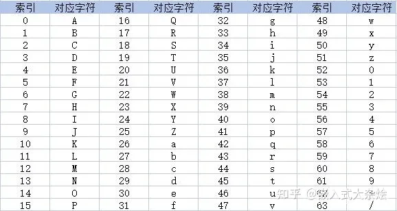

一个Base64字符实际上代表着6个二进制位(bit)，4个Base64字符对应3字节字符串/二进制数据。

3个字符为一组的的base64编码方式如：


小于3个字符为一组的编码方式如：


总结：base64过程

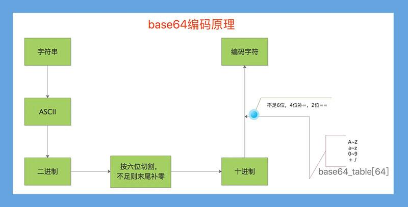

最后处理完的编码字符再转字节中不再有base64以外的任何字符。

#### （3）base64测试

```python
import base64

bs = "you".encode("utf-8")
# 把字节转化成b64
print(base64.b64encode(bs).decode())

bs = "yo".encode("utf-8")
# 把字节转化成b64
print(base64.b64encode(bs).decode())

# 猜测结果
bs = "y".encode("utf-8")
# 把字节转化成b64
print(base64.b64encode(bs).decode())


```

注意, b64处理后的字符串长度. 一定是4的倍数. 如果在网页上看到有些密文的b64长度不是4的倍数. 会报错

例如, 

```python
import base64

s = "eW91"
ret = base64.b64decode(s)
print(ret)

s = "eW91eQ=="
ret = base64.b64decode(s)
print(ret)

s = "eW91eQ"
ret = base64.b64decode(s)
print(ret)
```

解决思路. base64长度要求. 字符串长度必须是4的倍数. 填充一下即可

```python
s = "eW91eQ"
# ret = base64.b64decode(s)
# print(ret)

s += ("=" * (4 - len(s) % 4))
print("填充后", s)
ret = base64.b64decode(s).decode()
print(ret)
```

#### （4）base64变种

```python
# 方式1
data = res.text.replace("-", "+").replace("_", "/")
base64.b64decode(data)
# 方式2
data = base64.b64decode(res.text, altchars=b"-_")  # base64解码成字节流
```

#### （4）为什么要base64编码

base64 编码的优点：

- 算法是编码，不是压缩，编码后只会增加字节数（一般是比之前的多1/3，比如之前是3， 编码后是4）
- 算法简单，基本不影响效率
- 算法可逆，解码很方便，不用于私密传输。
- 毕竟编码了，肉眼不能直接读出原始内容。
- 加密后的字符串只有【0-9a-zA-Z+/=】 ，不可打印字符（转译字符）也可以传输（关键！！！）


有些网络传输协议是为了传输`ASCII文本`设计的，当你使用其传输二进制流时（比如视频/图片），二进制流中的数据可能会被协议错误的识别为控制字符等等，因而出现错误。那这时就要将二进制流传输编码，因为有些8Bit字节码并没有对应的ASCII字符。

比如十进制ASCII码8对应的是后退符号(backspace), 如果被编码的数据中包含这个数值，那么编码出来的结果在很多编程语言里会导致前一个字符被删掉。又比如ASCII码0对应的是空字符，在一些编程语言里代表字符串结束，后续的数据就不会被处理了。

用Base64编码因为限定了用于编码的字符集，确保编码的结果可打印且无歧义。

不同的网络节点设备交互数据需要：设备A把base64编码后的数据封装在`json字符串`里，设备B先解析json拿到value，再进行base64解码拿到想要的数据。

> 1. 早年制定的一些协议都是只支持文本设定的。随着不断发展需要支持非文本了，才搞了一个base64做兼容
>
> 2. 虽然编码之后的数据与加密一样都具有不可见性，但编码与加密的概念并不一样。编码是公开的，任何人都可以解码；而加密则相反，你只希望自己或者特定的人才可以对内容进行解密。

base64处理图片数据：

```python
import base64
source = ""
s = source.split(",")[1]
with open("a.png", "wb") as f:
    f.write(base64.b64decode(s))

```

### 【4】对称加密（AES与DES）

AES是一种对称加密，所谓对称加密就是加密与解密使用的秘钥是一个。

常见的对称加密: AES, DES, 3DES. 我们这里讨论AES。

安装：

```python
pip install pycryptodome
```

AES 加密最常用的模式就是 ECB模式 和 CBC 模式，当然还有很多其它模式，他们都属于AES加密。ECB模式和CBC 模式俩者区别就是 ECB 不需要 iv偏移量，而CBC需要。

```apl
参数	作用及数据类型

1. 秘钥	加密的时候用秘钥，解密的时候需要同样的秘钥才能解出来; 数据类型为bytes
2. 明文	需要加密的参数; 数据类型为bytes
3. 模式	aes 加密常用的有 ECB 和 CBC 模式（我只用了这两个模式，还有其他模式）;数据类型为aes类内部的枚举量
iv 偏移量	这个参数在 ECB 模式下不需要，在 CBC 模式下需要；数据类型为bytes

"""
长度
    16: *AES-128*
    24: *AES-192*
    32: *AES-256*
    
MODE 加密模式. 
    常见的ECB, CBC
    ECB：是一种基础的加密方式，密文被分割成分组长度相等的块（不足补齐），然后单独一个个加密，一个个输出组成密文。
    CBC：是一种循环模式，前一个分组的密文和当前分组的明文异或或操作后再加密，这样做的目的是增强破解难度。
"""
```

#### AES之ECB模式

ECB加密案例：

```python
from Crypto.Cipher import AES
import base64

key = '1234567890123456'.encode()  # 秘钥
# 秘钥：必须是16位字节或者24位字节或者32位字节

text = 'alex is dsb!!!!!'
# text = 'alex is dsb'  # 需要加密的内容
# while len(text.encode('utf-8')) % 16 != 0:  # 如果text不足16位的倍数就用空格补足为16位
#     text += '\0'
text = text.encode()
print("完整text:", text)

aes = AES.new(key, AES.MODE_ECB)  # 创建一个aes对象

en_text = aes.encrypt(text)  # 加密明文
print("加密数据:::", en_text)

en_text = base64.b64encode(en_text).decode()  # 将返回的字节型数据转进行base64编码
print(en_text)  # rRPMWCaOBYahYnKUJzq65A==
```

ECB解密：

```python
from Crypto.Cipher import AES
import base64

key = '1234567890123456'.encode()  # 秘钥
# 秘钥：必须是16位字节或者24位字节或者32位字节（因为python3的字符串是unicode编码，需要 encode才可以转换成字节型数据）
model = AES.MODE_ECB  # 定义模式
aes = AES.new(key, model)  # 创建一个aes对象

text = '3NeIhJsnhzy3Ojoquz+9eg=='.encode()  # 需要解密的文本
ecrypted_base64 = base64.b64decode(text)  # base64解码成字节流
str = aes.decrypt(ecrypted_base64).decode()  # 解密

print(str)
```

以上是针对ECB模式的加密解密，从这个例子中可以看出参数中有几个限制。

> 1. 秘钥必须为16字节或者16字节的倍数的字节型数据。
> 2. 明文必须为16字节或者16字节的倍数的字节型数据，如果不够16字节需要进行补全，关于补全规则，后面会在补全模式中具体介绍。

#### AES之CBC模式

CBC加密案例：

```python
from Crypto.Cipher import AES
import base64

key = '1234567890123456'.encode()  # 秘钥
# 秘钥：必须是16位字节或者24位字节或者32位字节
text = 'alex is dsb!!!!!'
# text = 'alex is dsb'  # 需要加密的内容
# while len(text.encode('utf-8')) % 16 != 0:  # 如果text不足16位的倍数就用空格补足为16位
#     text += '\0'
text = text.encode()
print("完整text:", text)

iv = b'abcdabcdabcdabcd'   #偏移量--必须16字节

aes = AES.new(key, AES.MODE_CBC,iv)  # 创建一个aes对象

en_text = aes.encrypt(text)  # 加密明文
print("aes加密数据:::", en_text)

en_text = base64.b64encode(en_text).decode()  # 将返回的字节型数据转进行base64编码
print(en_text)  # rRPMWCaOBYahYnKUJzq65A==
```

CBC解密案例：

````python
from Crypto.Cipher import AES
import base64

key = '1234567890123456'.encode()  # 秘钥
# 秘钥：必须是16位字节或者24位字节或者32位字节（因为python3的字符串是unicode编码，需要 encode才可以转换成字节型数据）
model = AES.MODE_CBC  # 定义模式
iv = b'abcdabcdabcdabcd'
aes = AES.new(key, model, iv)  # 创建一个aes对象

text = 'J8bwyhYt1chAPAGu8N6kKA=='.encode()  # 需要解密的文本
ecrypted_base64 = base64.b64decode(text)  # base64解码成字节流
str = aes.decrypt(ecrypted_base64).decode()  # 解密

print("aes解密数据:::")

````

> 1. 在Python中进行AES加密解密时，所传入的密文、明文、秘钥、iv偏移量、都需要是bytes（字节型）数据。python 在构建aes对象时也只能接受bytes类型数据。
> 2. 当秘钥，iv偏移量，待加密的明文，字节长度不够16字节或者16字节倍数的时候需要进行补全。
>
> 3. CBC模式需要重新生成AES对象，为了防止这类错误，无论是什么模式都重新生成AES对象就可以了。

### 【5】非对称加密(RSA)

非对称加密. 加密和解密的秘钥不是同一个秘钥. 这里需要两把钥匙. 一个公钥, 一个私钥.  公钥发送给客户端. 发送端用公钥对数据进行加密. 再发送给接收端, 接收端使用私钥来对数据解密. 由于私钥只存放在接受端这边. 所以即使数据被截获了. 也是无法进行解密的. 

[公钥和私钥](https://blog.csdn.net/Ruishine/article/details/114705443)

常见的非对称加密算法: RSA, DSA等等, 我们就介绍一个. RSA加密, 也是最常见的一种加密方案

1. 创建公钥和私钥

```python
from Crypto.PublicKey import RSA

# 生成秘钥
rsakey = RSA.generate(1024)
with open("rsa.public.pem", mode="wb") as f:
    f.write(rsakey.publickey().exportKey())

with open("rsa.private.pem", mode="wb") as f:
    f.write(rsakey.exportKey())
```

2. 加密

```python
from Crypto.PublicKey import RSA
from Crypto.Cipher import PKCS1_v1_5
import base64


# 加密
data = "我喜欢你"
with open("rsa.public.pem", mode="r") as f:
    pk = f.read()
    rsa_pk = RSA.importKey(pk)
    rsa = PKCS1_v1_5.new(rsa_pk)

    result = rsa.encrypt(data.encode("utf-8"))
    # 处理成b64方便传输
    b64_result = base64.b64encode(result).decode("utf-8")
    print(b64_result)

```

3. 解密

```python
from Crypto.PublicKey import RSA
from Crypto.Cipher import PKCS1_v1_5
import base64

data = "BkiKG8jzVGzbWOl4m8NXJEYglgtxhOB05MGmap8JSP97GzoewPBmDTs7c5iACUof3k/uJf0H88GygajVgBvkcbckJp7oO+Qj6VSUQYTOHhKN/VG2a8v+WzL34EO/S7BYoj2oOxIDAr8wDLxYxjBeXq/Be6Q1yBbnZcKaMkifhP8="
# 解密
with open("rsa.private.pem", mode="r") as f:
    prikey = f.read()
    rsa_pk = RSA.importKey(prikey)
    rsa = PKCS1_v1_5.new(rsa_pk)
    result = rsa.decrypt(base64.b64decode(data), None)
    print("rsa解密数据:::", result.decode("utf-8
```

## 10.3、逆向案例之有道翻译

### Part01:逆向请求

### （1）抓包

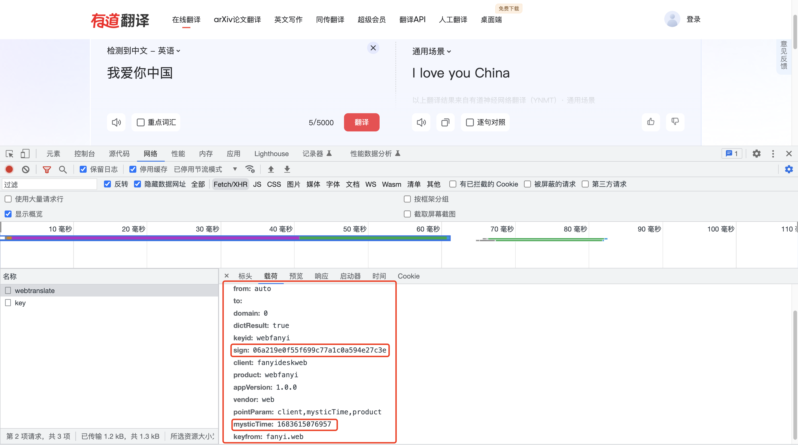

### （2）获取JS的请求入口

获取请求入口:搜索关键字，比如sign（有时候太多不好用），比如请求路径

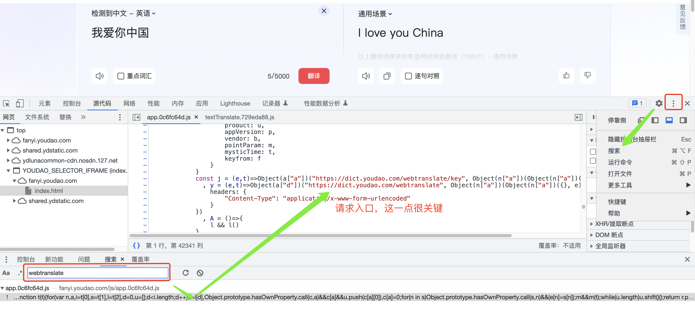

### （3）获取构建数据的目标函数

分析请求参数

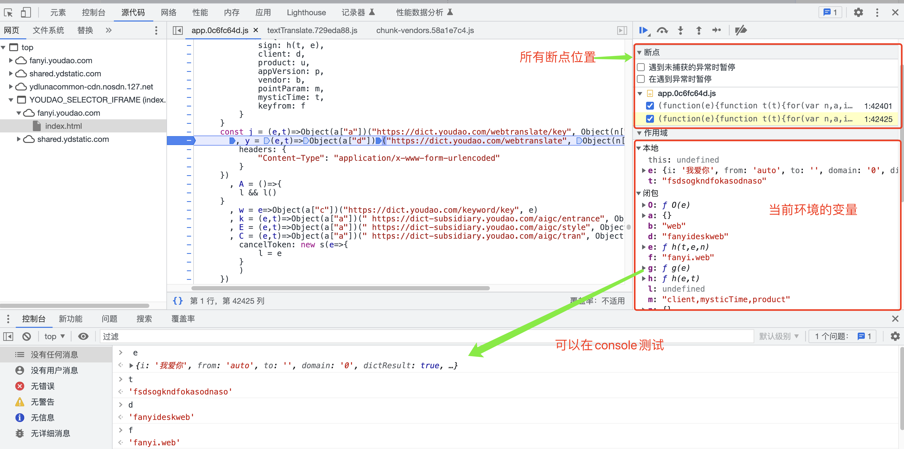


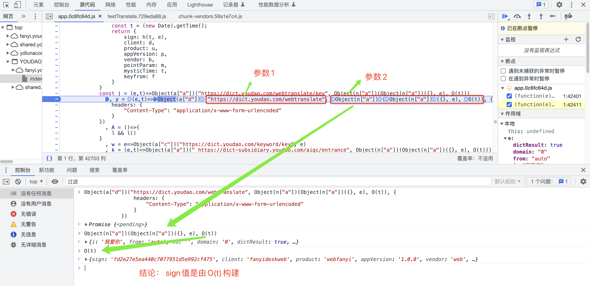

### （4）获取目标函数源码位置

方式1:

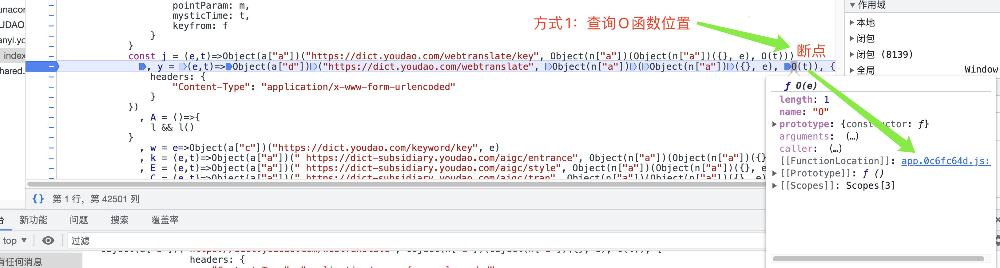


方式2:

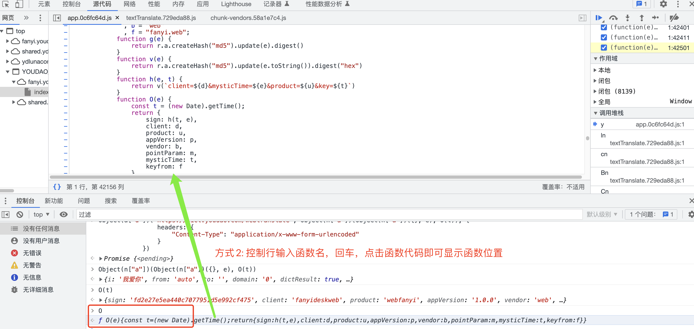

### （5） 逆向实现

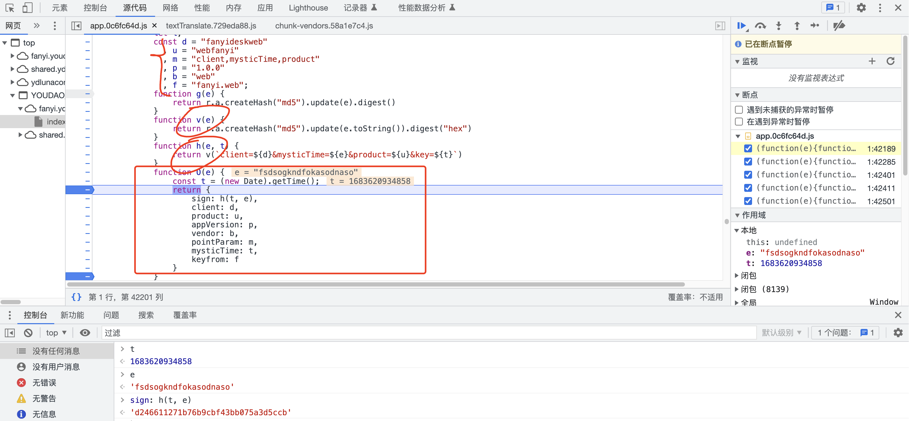

```python
# Python逆向模拟：
import time
import hashlib
import requests

session = requests.session()
session.get("https://fanyi.youdao.com/")
word = "apple"
# (1) 构建sign值
t = str(1683620934858)
s = f"client=fanyideskweb&mysticTime={t}&product=webfanyi&key=fsdsogkndfokasodnaso"
md5 = hashlib.md5()
md5.update(s.encode())
sign = md5.hexdigest()

print("sign:::", sign)
# sign::: d246611271b76b9cbf43bb075a3d5ccb
```

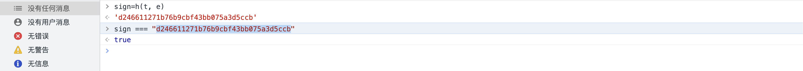

md5是标准的，没有魔改，程序员是个好人！

完整的逆向代码也就出来了：

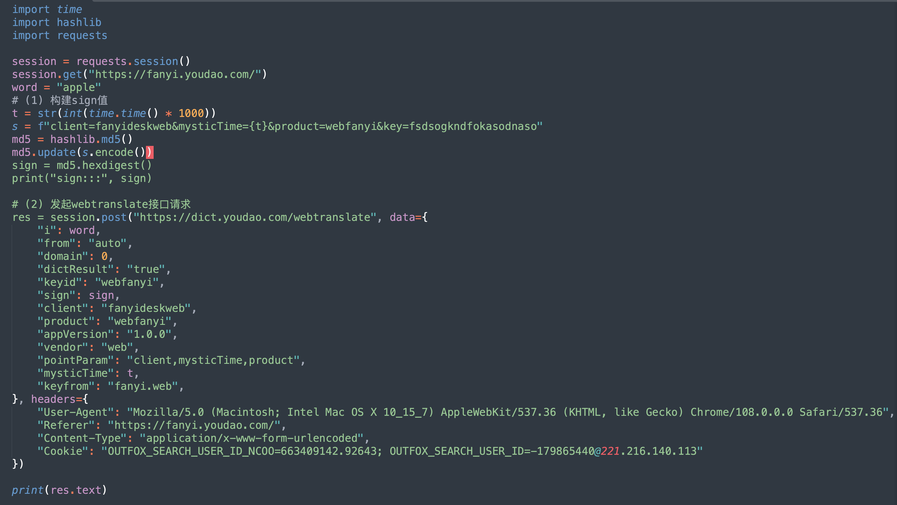

结果为：

```apl
Z21kD9ZK1ke6ugku2ccWu-MeDWh3z252xRTQv-wZ6jddVo3tJLe7gIXz4PyxGl73nSfLAADyElSjjvrYdCvEP4pfohVVEX1DxoI0yhm36ytQNvu-WLU94qULZQ72aml6JKK7ArS9fJXAcsG7ufBIE0gd6fbnhFcsGmdXspZe-8whVFbRB_8Fc9JlMHh8DDXnskDhGfEscN_rfi-A-AHB3F9Vets82vIYpkGNaJOft_JA-m5cGEjo-UNRDDpkTz_NIAvo5PbATpkh7PSna2tHcE6Hou9GBtPLB67vjScwplB96-zqZKXJJEzU5HGF0oPDY_weAkXArzXyGLBPXFCnn_IWJDkGD4vqBQQAh2n52f48GD_cb-PSCT_8b-ESsKUI9NJa11XsdaUZxAc8TzrYnXwdcQbtl_kZGKhS6_rCtuNEBouA_lvM2CbS7TTtV2U4zVmJKpp-c6nt3yZePK3Av01GWn1pH_3sZbaPEx8DUjSbdp4i4iK-Mj4p2HPoph67DR7B9MFETYku_28SgP9xsKRRvFH4aHBHESWX4FDbwaU=
```

### Part02：解密数据

### （1）解密入口

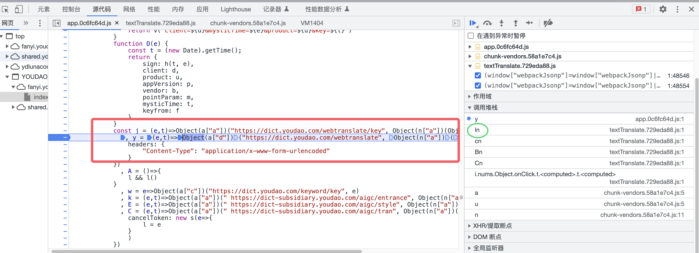

### （2）查找解密函数

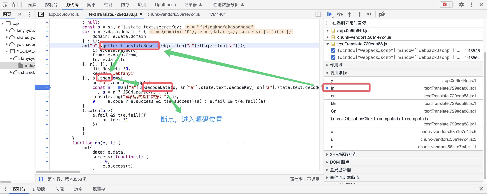

### （3）解密实现

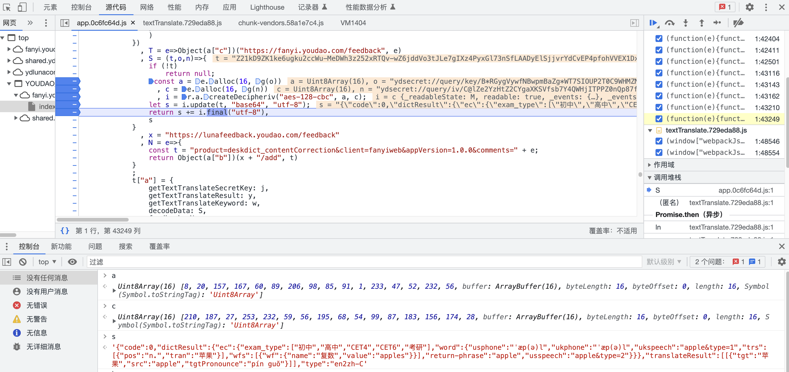

```python
import hashlib

def get_md5_digest(newkey):
    md5 = hashlib.md5()
    md5.update(newkey.encode())
    return md5.digest()

key = "ydsecret://query/key/B*RGygVywfNBwpmBaZg*WT7SIOUP2T0C9WHMZN39j^DAdaZhAnxvGcCY6VYFwnHl"
iv = "ydsecret://query/iv/C@lZe2YzHtZ2CYgaXKSVfsb7Y4QWHjITPPZ0nQp87fBeJ!Iv6v^6fvi2WN@bYpJ4"
key_md5 = get_md5_digest(key)
iv_md5 = get_md5_digest(iv)
```

基于Python的完整解密：

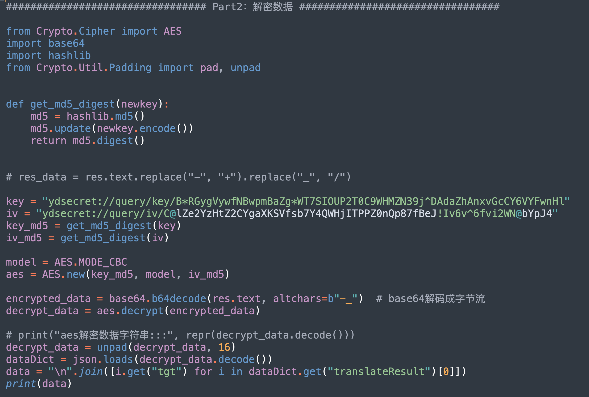

基于JS的完整解密：

```js
const crypto = require('crypto');

function g(e) {
    return crypto.createHash("md5").update(e).digest()
}

function s() {

    let o = 'ydsecret://query/key/B*RGygVywfNBwpmBaZg*WT7SIOUP2T0C9WHMZN39j^DAdaZhAnxvGcCY6VYFwnHl'
    let n = 'ydsecret://query/iv/C@lZe2YzHtZ2CYgaXKSVfsb7Y4QWHjITPPZ0nQp87fBeJ!Iv6v^6fvi2WN@bYpJ4'

    const a = Buffer.alloc(16, g(o))
        , c = Buffer.alloc(16, g(n))
        , i = crypto.createDecipheriv("aes-128-cbc", a, c);
    let s = i.update(t, "base64", "utf-8");
    return s += i.final("utf-8")

}
t = 'Z21kD9ZK1ke6ugku2ccWu-MeDWh3z252xRTQv-wZ6jddVo3tJLe7gIXz4PyxGl73nSfLAADyElSjjvrYdCvEP4pfohVVEX1DxoI0yhm36ytQNvu-WLU94qULZQ72aml6JKK7ArS9fJXAcsG7ufBIE0gd6fbnhFcsGmdXspZe-8whVFbRB_8Fc9JlMHh8DDXnskDhGfEscN_rfi-A-AHB3F9Vets82vIYpkGNaJOft_JA-m5cGEjo-UNRDDpkTz_NIAvo5PbATpkh7PSna2tHcE6Hou9GBtPLB67vjScwplB96-zqZKXJJEzU5HGF0oPDY_weAkXArzXyGLBPXFCnn_IWJDkGD4vqBQQAh2n52f48GD_cb-PSCT_8b-ESsKUI9NJa11XsdaUZxAc8TzrYnXwdcQbtl_kZGKhS6_rCtuNEBouA_lvM2CbS7TTtV2U4zVmJKpp-c6nt3yZePK3Av01GWn1pH_3sZbaPEx8DUjSbdp4i4iK-Mj4p2HPoph67DR7B9MFETYku_28SgP9xsKRRvFH4aHBHESWX4FDbwaU='
console.log(s())
```

```python
# 基于execjs实现js与py的结合

import execjs

with open("jiemi.js") as f:
    data = f.read()

JS = execjs.compile(data)
t = 'Z21kD9ZK1ke6ugku2ccWu-MeDWh3z252xRTQv-wZ6jddVo3tJLe7gIXz4PyxGl73nSfLAADyElSjjvrYdCvEP4pfohVVEX1DxoI0yhm36ytQNvu-WLU94qULZQ72aml6JKK7ArS9fJXAcsG7ufBIE0gd6fbnhFcsGmdXspZe-8whVFbRB_8Fc9JlMHh8DDXnskDhGfEscN_rfi-A-AHB3F9Vets82vIYpkGNaJOft_JA-m5cGEjo-UNRDDpkTz_NIAvo5PbATpkh7PSna2tHcE6Hou9GBtPLB67vjScwplB96-zqZKXJJEzU5HGF0oPDY_weAkXArzXyGLBPXFCnn_IWJDkGD4vqBQQAh2n52f48GD_cb-PSCT_8b-ESsKUI9NJa11XsdaUZxAc8TzrYnXwdcQbtl_kZGKhS6_rCtuNEBouA_lvM2CbS7TTtV2U4zVmJKpp-c6nt3yZePK3Av01GWn1pH_3sZbaPEx8DUjSbdp4i4iK-Mj4p2HPoph67DR7B9MFETYku_28SgP9xsKRRvFH4aHBHESWX4FDbwaU='
ret = JS.call("jieMi", t)
print(ret)

```

## 10.4、逆向案例之网易云音乐


### 【1】抓包解析

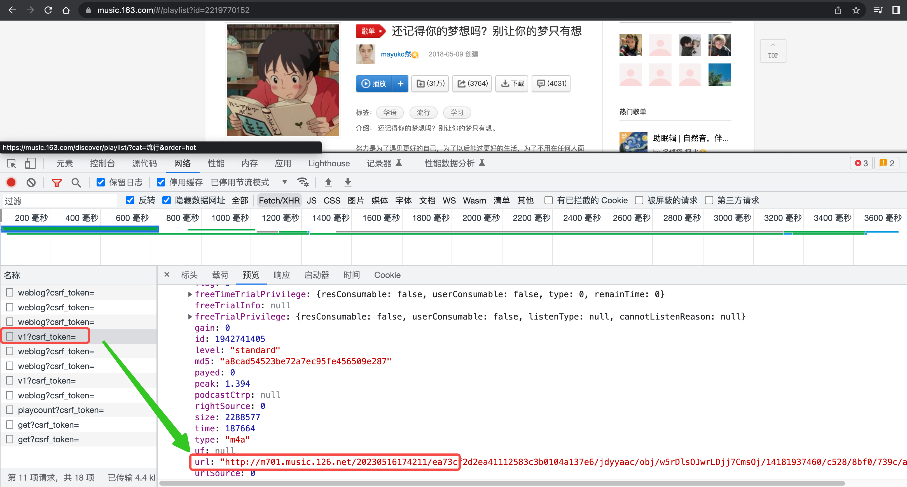

### 【2】目标定位

方式1:

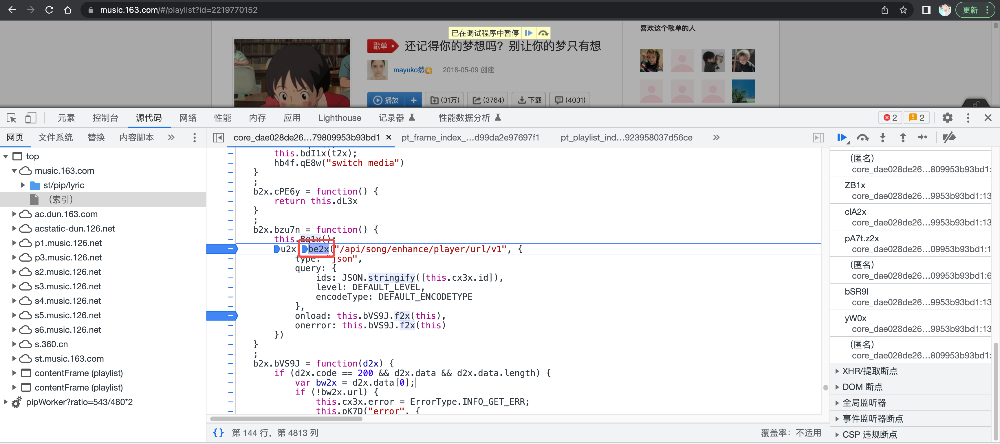

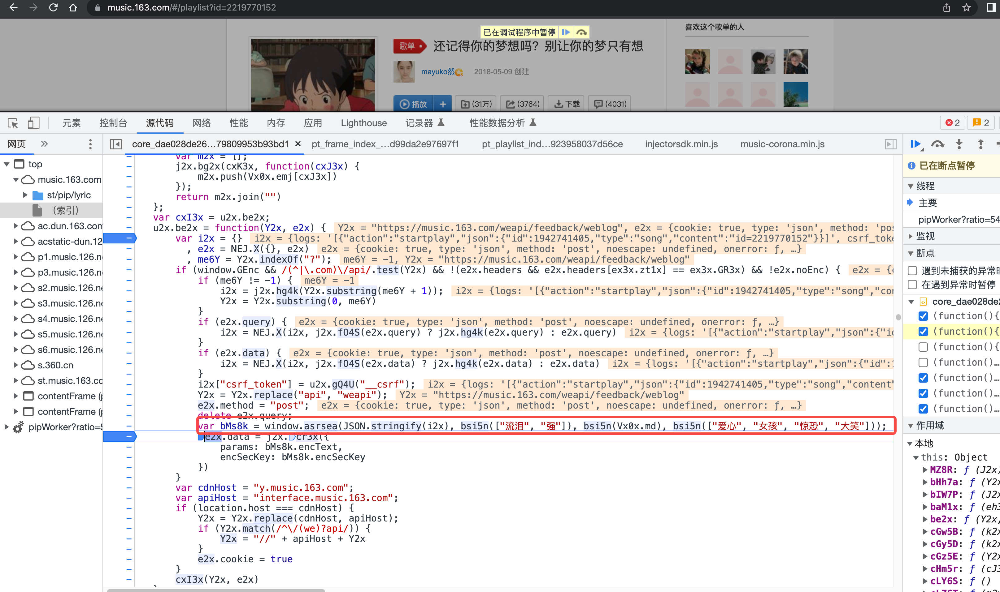


方式2:

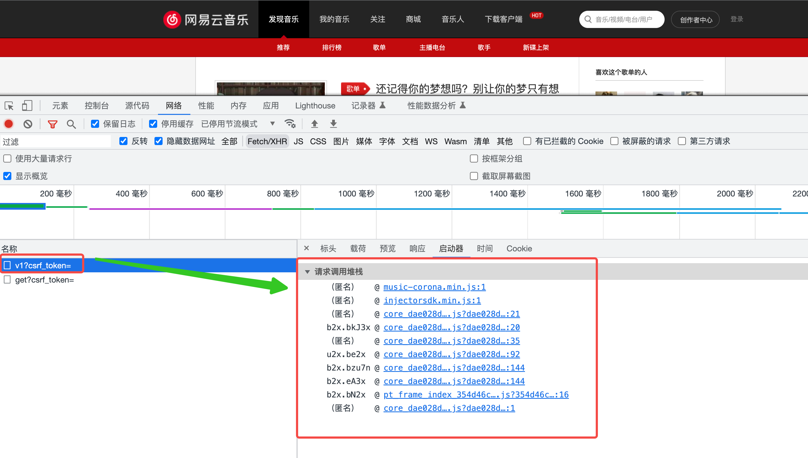

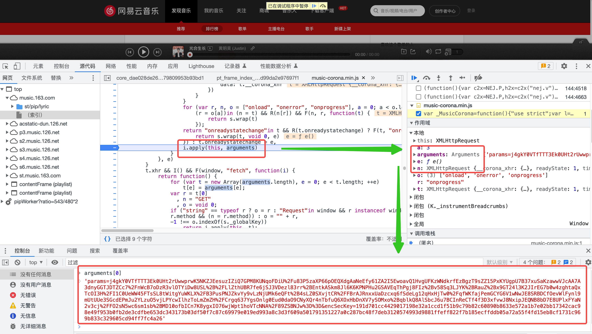

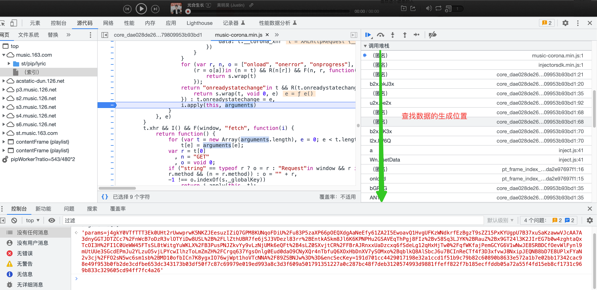

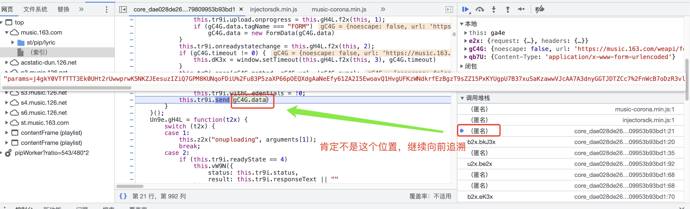

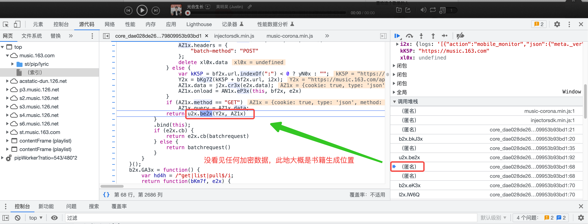

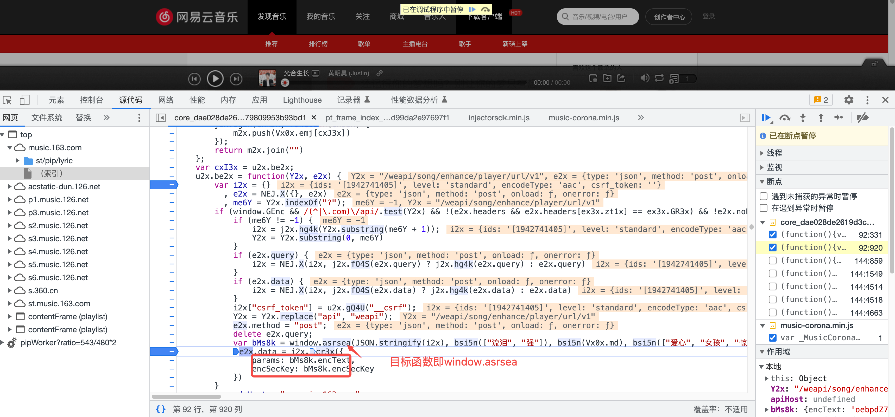


### 【3】逆向实现

#### （1）数据加密

```js
const CryptoJS = require('crypto-js');

function RSAKeyPair(a, b, c) {
    this.e = biFromHex(a),
        this.d = biFromHex(b),
        this.m = biFromHex(c),
        this.chunkSize = 2 * biHighIndex(this.m),
        this.radix = 16,
        this.barrett = new BarrettMu(this.m)
}

function twoDigit(a) {
    return (10 > a ? "0" : "") + String(a)
}

function encryptedString(a, b) {
    for (var f, g, h, i, j, k, l, c = new Array, d = b.length, e = 0; d > e;)
        c[e] = b.charCodeAt(e),
            e++;
    for (; 0 != c.length % a.chunkSize;)
        c[e++] = 0;
    for (f = c.length,
             g = "",
             e = 0; f > e; e += a.chunkSize) {
        for (j = new BigInt,
                 h = 0,
                 i = e; i < e + a.chunkSize; ++h)
            j.digits[h] = c[i++],
                j.digits[h] += c[i++] << 8;
        k = a.barrett.powMod(j, a.e),
            l = 16 == a.radix ? biToHex(k) : biToString(k, a.radix),
            g += l + " "
    }
    return g.substring(0, g.length - 1)
}

function decryptedString(a, b) {
    var e, f, g, h, c = b.split(" "), d = "";
    for (e = 0; e < c.length; ++e)
        for (h = 16 == a.radix ? biFromHex(c[e]) : biFromString(c[e], a.radix),
                 g = a.barrett.powMod(h, a.d),
                 f = 0; f <= biHighIndex(g); ++f)
            d += String.fromCharCode(255 & g.digits[f], g.digits[f] >> 8);
    return 0 == d.charCodeAt(d.length - 1) && (d = d.substring(0, d.length - 1)),
        d
}

function setMaxDigits(a) {
    maxDigits = a,
        ZERO_ARRAY = new Array(maxDigits);
    for (var b = 0; b < ZERO_ARRAY.length; b++)
        ZERO_ARRAY[b] = 0;
    bigZero = new BigInt,
        bigOne = new BigInt,
        bigOne.digits[0] = 1
}

function BigInt(a) {
    this.digits = "boolean" == typeof a && 1 == a ? null : ZERO_ARRAY.slice(0),
        this.isNeg = !1
}

function biFromDecimal(a) {
    for (var d, e, f, b = "-" == a.charAt(0), c = b ? 1 : 0; c < a.length && "0" == a.charAt(c);)
        ++c;
    if (c == a.length)
        d = new BigInt;
    else {
        for (e = a.length - c,
                 f = e % dpl10,
             0 == f && (f = dpl10),
                 d = biFromNumber(Number(a.substr(c, f))),
                 c += f; c < a.length;)
            d = biAdd(biMultiply(d, lr10), biFromNumber(Number(a.substr(c, dpl10)))),
                c += dpl10;
        d.isNeg = b
    }
    return d
}

function biCopy(a) {
    var b = new BigInt(!0);
    return b.digits = a.digits.slice(0),
        b.isNeg = a.isNeg,
        b
}

function biFromNumber(a) {
    var c, b = new BigInt;
    for (b.isNeg = 0 > a,
             a = Math.abs(a),
             c = 0; a > 0;)
        b.digits[c++] = a & maxDigitVal,
            a >>= biRadixBits;
    return b
}

function reverseStr(a) {
    var c, b = "";
    for (c = a.length - 1; c > -1; --c)
        b += a.charAt(c);
    return b
}

function biToString(a, b) {
    var d, e, c = new BigInt;
    for (c.digits[0] = b,
             d = biDivideModulo(a, c),
             e = hexatrigesimalToChar[d[1].digits[0]]; 1 == biCompare(d[0], bigZero);)
        d = biDivideModulo(d[0], c),
            digit = d[1].digits[0],
            e += hexatrigesimalToChar[d[1].digits[0]];
    return (a.isNeg ? "-" : "") + reverseStr(e)
}

function biToDecimal(a) {
    var c, d, b = new BigInt;
    for (b.digits[0] = 10,
             c = biDivideModulo(a, b),
             d = String(c[1].digits[0]); 1 == biCompare(c[0], bigZero);)
        c = biDivideModulo(c[0], b),
            d += String(c[1].digits[0]);
    return (a.isNeg ? "-" : "") + reverseStr(d)
}

function digitToHex(a) {
    var b = 15
        , c = "";
    for (i = 0; 4 > i; ++i)
        c += hexToChar[a & b],
            a >>>= 4;
    return reverseStr(c)
}

function biToHex(a) {
    var d, b = "";
    for (biHighIndex(a),
             d = biHighIndex(a); d > -1; --d)
        b += digitToHex(a.digits[d]);
    return b
}

function charToHex(a) {
    var h, b = 48, c = b + 9, d = 97, e = d + 25, f = 65, g = 90;
    return h = a >= b && c >= a ? a - b : a >= f && g >= a ? 10 + a - f : a >= d && e >= a ? 10 + a - d : 0
}

function hexToDigit(a) {
    var d, b = 0, c = Math.min(a.length, 4);
    for (d = 0; c > d; ++d)
        b <<= 4,
            b |= charToHex(a.charCodeAt(d));
    return b
}

function biFromHex(a) {
    var d, e, b = new BigInt, c = a.length;
    for (d = c,
             e = 0; d > 0; d -= 4,
             ++e)
        b.digits[e] = hexToDigit(a.substr(Math.max(d - 4, 0), Math.min(d, 4)));
    return b
}

function biFromString(a, b) {
    var g, h, i, j, c = "-" == a.charAt(0), d = c ? 1 : 0, e = new BigInt, f = new BigInt;
    for (f.digits[0] = 1,
             g = a.length - 1; g >= d; g--)
        h = a.charCodeAt(g),
            i = charToHex(h),
            j = biMultiplyDigit(f, i),
            e = biAdd(e, j),
            f = biMultiplyDigit(f, b);
    return e.isNeg = c,
        e
}

function biDump(a) {
    return (a.isNeg ? "-" : "") + a.digits.join(" ")
}

function biAdd(a, b) {
    var c, d, e, f;
    if (a.isNeg != b.isNeg)
        b.isNeg = !b.isNeg,
            c = biSubtract(a, b),
            b.isNeg = !b.isNeg;
    else {
        for (c = new BigInt,
                 d = 0,
                 f = 0; f < a.digits.length; ++f)
            e = a.digits[f] + b.digits[f] + d,
                c.digits[f] = 65535 & e,
                d = Number(e >= biRadix);
        c.isNeg = a.isNeg
    }
    return c
}

function biSubtract(a, b) {
    var c, d, e, f;
    if (a.isNeg != b.isNeg)
        b.isNeg = !b.isNeg,
            c = biAdd(a, b),
            b.isNeg = !b.isNeg;
    else {
        for (c = new BigInt,
                 e = 0,
                 f = 0; f < a.digits.length; ++f)
            d = a.digits[f] - b.digits[f] + e,
                c.digits[f] = 65535 & d,
            c.digits[f] < 0 && (c.digits[f] += biRadix),
                e = 0 - Number(0 > d);
        if (-1 == e) {
            for (e = 0,
                     f = 0; f < a.digits.length; ++f)
                d = 0 - c.digits[f] + e,
                    c.digits[f] = 65535 & d,
                c.digits[f] < 0 && (c.digits[f] += biRadix),
                    e = 0 - Number(0 > d);
            c.isNeg = !a.isNeg
        } else
            c.isNeg = a.isNeg
    }
    return c
}

function biHighIndex(a) {
    for (var b = a.digits.length - 1; b > 0 && 0 == a.digits[b];)
        --b;
    return b
}

function biNumBits(a) {
    var e, b = biHighIndex(a), c = a.digits[b], d = (b + 1) * bitsPerDigit;
    for (e = d; e > d - bitsPerDigit && 0 == (32768 & c); --e)
        c <<= 1;
    return e
}

function biMultiply(a, b) {
    var d, h, i, k, c = new BigInt, e = biHighIndex(a), f = biHighIndex(b);
    for (k = 0; f >= k; ++k) {
        for (d = 0,
                 i = k,
                 j = 0; e >= j; ++j,
                 ++i)
            h = c.digits[i] + a.digits[j] * b.digits[k] + d,
                c.digits[i] = h & maxDigitVal,
                d = h >>> biRadixBits;
        c.digits[k + e + 1] = d
    }
    return c.isNeg = a.isNeg != b.isNeg,
        c
}

function biMultiplyDigit(a, b) {
    var c, d, e, f;
    for (result = new BigInt,
             c = biHighIndex(a),
             d = 0,
             f = 0; c >= f; ++f)
        e = result.digits[f] + a.digits[f] * b + d,
            result.digits[f] = e & maxDigitVal,
            d = e >>> biRadixBits;
    return result.digits[1 + c] = d,
        result
}

function arrayCopy(a, b, c, d, e) {
    var g, h, f = Math.min(b + e, a.length);
    for (g = b,
             h = d; f > g; ++g,
             ++h)
        c[h] = a[g]
}

function biShiftLeft(a, b) {
    var e, f, g, h, c = Math.floor(b / bitsPerDigit), d = new BigInt;
    for (arrayCopy(a.digits, 0, d.digits, c, d.digits.length - c),
             e = b % bitsPerDigit,
             f = bitsPerDigit - e,
             g = d.digits.length - 1,
             h = g - 1; g > 0; --g,
             --h)
        d.digits[g] = d.digits[g] << e & maxDigitVal | (d.digits[h] & highBitMasks[e]) >>> f;
    return d.digits[0] = d.digits[g] << e & maxDigitVal,
        d.isNeg = a.isNeg,
        d
}

function biShiftRight(a, b) {
    var e, f, g, h, c = Math.floor(b / bitsPerDigit), d = new BigInt;
    for (arrayCopy(a.digits, c, d.digits, 0, a.digits.length - c),
             e = b % bitsPerDigit,
             f = bitsPerDigit - e,
             g = 0,
             h = g + 1; g < d.digits.length - 1; ++g,
             ++h)
        d.digits[g] = d.digits[g] >>> e | (d.digits[h] & lowBitMasks[e]) << f;
    return d.digits[d.digits.length - 1] >>>= e,
        d.isNeg = a.isNeg,
        d
}

function biMultiplyByRadixPower(a, b) {
    var c = new BigInt;
    return arrayCopy(a.digits, 0, c.digits, b, c.digits.length - b),
        c
}

function biDivideByRadixPower(a, b) {
    var c = new BigInt;
    return arrayCopy(a.digits, b, c.digits, 0, c.digits.length - b),
        c
}

function biModuloByRadixPower(a, b) {
    var c = new BigInt;
    return arrayCopy(a.digits, 0, c.digits, 0, b),
        c
}

function biCompare(a, b) {
    if (a.isNeg != b.isNeg)
        return 1 - 2 * Number(a.isNeg);
    for (var c = a.digits.length - 1; c >= 0; --c)
        if (a.digits[c] != b.digits[c])
            return a.isNeg ? 1 - 2 * Number(a.digits[c] > b.digits[c]) : 1 - 2 * Number(a.digits[c] < b.digits[c]);
    return 0
}

function biDivideModulo(a, b) {
    var f, g, h, i, j, k, l, m, n, o, p, q, r, s, c = biNumBits(a), d = biNumBits(b), e = b.isNeg;
    if (d > c)
        return a.isNeg ? (f = biCopy(bigOne),
            f.isNeg = !b.isNeg,
            a.isNeg = !1,
            b.isNeg = !1,
            g = biSubtract(b, a),
            a.isNeg = !0,
            b.isNeg = e) : (f = new BigInt,
            g = biCopy(a)),
            new Array(f, g);
    for (f = new BigInt,
             g = a,
             h = Math.ceil(d / bitsPerDigit) - 1,
             i = 0; b.digits[h] < biHalfRadix;)
        b = biShiftLeft(b, 1),
            ++i,
            ++d,
            h = Math.ceil(d / bitsPerDigit) - 1;
    for (g = biShiftLeft(g, i),
             c += i,
             j = Math.ceil(c / bitsPerDigit) - 1,
             k = biMultiplyByRadixPower(b, j - h); -1 != biCompare(g, k);)
        ++f.digits[j - h],
            g = biSubtract(g, k);
    for (l = j; l > h; --l) {
        for (m = l >= g.digits.length ? 0 : g.digits[l],
                 n = l - 1 >= g.digits.length ? 0 : g.digits[l - 1],
                 o = l - 2 >= g.digits.length ? 0 : g.digits[l - 2],
                 p = h >= b.digits.length ? 0 : b.digits[h],
                 q = h - 1 >= b.digits.length ? 0 : b.digits[h - 1],
                 f.digits[l - h - 1] = m == p ? maxDigitVal : Math.floor((m * biRadix + n) / p),
                 r = f.digits[l - h - 1] * (p * biRadix + q),
                 s = m * biRadixSquared + (n * biRadix + o); r > s;)
            --f.digits[l - h - 1],
                r = f.digits[l - h - 1] * (p * biRadix | q),
                s = m * biRadix * biRadix + (n * biRadix + o);
        k = biMultiplyByRadixPower(b, l - h - 1),
            g = biSubtract(g, biMultiplyDigit(k, f.digits[l - h - 1])),
        g.isNeg && (g = biAdd(g, k),
            --f.digits[l - h - 1])
    }
    return g = biShiftRight(g, i),
        f.isNeg = a.isNeg != e,
    a.isNeg && (f = e ? biAdd(f, bigOne) : biSubtract(f, bigOne),
        b = biShiftRight(b, i),
        g = biSubtract(b, g)),
    0 == g.digits[0] && 0 == biHighIndex(g) && (g.isNeg = !1),
        new Array(f, g)
}

function biDivide(a, b) {
    return biDivideModulo(a, b)[0]
}

function biModulo(a, b) {
    return biDivideModulo(a, b)[1]
}

function biMultiplyMod(a, b, c) {
    return biModulo(biMultiply(a, b), c)
}

function biPow(a, b) {
    for (var c = bigOne, d = a; ;) {
        if (0 != (1 & b) && (c = biMultiply(c, d)),
            b >>= 1,
        0 == b)
            break;
        d = biMultiply(d, d)
    }
    return c
}

function biPowMod(a, b, c) {
    for (var d = bigOne, e = a, f = b; ;) {
        if (0 != (1 & f.digits[0]) && (d = biMultiplyMod(d, e, c)),
            f = biShiftRight(f, 1),
        0 == f.digits[0] && 0 == biHighIndex(f))
            break;
        e = biMultiplyMod(e, e, c)
    }
    return d
}

function BarrettMu(a) {
    this.modulus = biCopy(a),
        this.k = biHighIndex(this.modulus) + 1;
    var b = new BigInt;
    b.digits[2 * this.k] = 1,
        this.mu = biDivide(b, this.modulus),
        this.bkplus1 = new BigInt,
        this.bkplus1.digits[this.k + 1] = 1,
        this.modulo = BarrettMu_modulo,
        this.multiplyMod = BarrettMu_multiplyMod,
        this.powMod = BarrettMu_powMod
}

function BarrettMu_modulo(a) {
    var i, b = biDivideByRadixPower(a, this.k - 1), c = biMultiply(b, this.mu), d = biDivideByRadixPower(c, this.k + 1),
        e = biModuloByRadixPower(a, this.k + 1), f = biMultiply(d, this.modulus),
        g = biModuloByRadixPower(f, this.k + 1), h = biSubtract(e, g);
    for (h.isNeg && (h = biAdd(h, this.bkplus1)),
             i = biCompare(h, this.modulus) >= 0; i;)
        h = biSubtract(h, this.modulus),
            i = biCompare(h, this.modulus) >= 0;
    return h
}

function BarrettMu_multiplyMod(a, b) {
    var c = biMultiply(a, b);
    return this.modulo(c)
}

function BarrettMu_powMod(a, b) {
    var d, e, c = new BigInt;
    for (c.digits[0] = 1,
             d = a,
             e = b; ;) {
        if (0 != (1 & e.digits[0]) && (c = this.multiplyMod(c, d)),
            e = biShiftRight(e, 1),
        0 == e.digits[0] && 0 == biHighIndex(e))
            break;
        d = this.multiplyMod(d, d)
    }
    return c
}

var maxDigits, ZERO_ARRAY, bigZero, bigOne, dpl10, lr10, hexatrigesimalToChar, hexToChar, highBitMasks, lowBitMasks,
    biRadixBase = 2, biRadixBits = 16, bitsPerDigit = biRadixBits, biRadix = 65536, biHalfRadix = biRadix >>> 1,
    biRadixSquared = biRadix * biRadix, maxDigitVal = biRadix - 1, maxInteger = 9999999999999998;
setMaxDigits(20),
    dpl10 = 15,
    lr10 = biFromNumber(1e15),
    hexatrigesimalToChar = new Array("0", "1", "2", "3", "4", "5", "6", "7", "8", "9", "a", "b", "c", "d", "e", "f", "g", "h", "i", "j", "k", "l", "m", "n", "o", "p", "q", "r", "s", "t", "u", "v", "w", "x", "y", "z"),
    hexToChar = new Array("0", "1", "2", "3", "4", "5", "6", "7", "8", "9", "a", "b", "c", "d", "e", "f"),
    highBitMasks = new Array(0, 32768, 49152, 57344, 61440, 63488, 64512, 65024, 65280, 65408, 65472, 65504, 65520, 65528, 65532, 65534, 65535),
    lowBitMasks = new Array(0, 1, 3, 7, 15, 31, 63, 127, 255, 511, 1023, 2047, 4095, 8191, 16383, 32767, 65535);

function a(a) {
    var d, e, b = "abcdefghijklmnopqrstuvwxyzABCDEFGHIJKLMNOPQRSTUVWXYZ0123456789", c = "";
    for (d = 0; a > d; d += 1)
        e = Math.random() * b.length,
            e = Math.floor(e),
            c += b.charAt(e);
    return c
}

function b(a, b) {
    var c = CryptoJS.enc.Utf8.parse(b)
        , d = CryptoJS.enc.Utf8.parse("0102030405060708")
        , e = CryptoJS.enc.Utf8.parse(a)
        , f = CryptoJS.AES.encrypt(e, c, {
        iv: d,
        mode: CryptoJS.mode.CBC
    });
    return f.toString()
}

function c(a, b, c) {
    var d, e;
    return setMaxDigits(131),
        d = new RSAKeyPair(b, "", c),
        e = encryptedString(d, a)
}

function d(d, e, f, g) {
    var h = {}
        , i = a(16);
    return h.encText = b(d, g),
        h.encText = b(h.encText, i),
        h.encSecKey = c(i, e, f),
        h
}

function e(a, b, d, e) {
    var f = {};
    return f.encText = c(a + e, b, d),
        f
}

ret = d('{"ids":"[1942741405]","level":"standard","encodeType":"aac","csrf_token":""}', '010001', '00e0b509f6259df8642dbc35662901477df22677ec152b5ff68ace615bb7b725152b3ab17a876aea8a5aa76d2e417629ec4ee341f56135fccf695280104e0312ecbda92557c93870114af6c9d05c4f7f0c3685b7a46bee255932575cce10b424d813cfe4875d3e82047b97ddef52741d546b8e289dc6935b3ece0462db0a22b8e7', '0CoJUm6Qyw8W8jud')
console.log(ret)
```

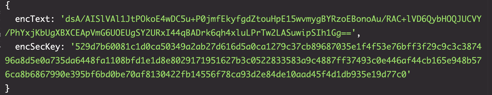

#### （2）模拟请求

```python
import execjs
import requests

data = (
'{"ids":"[1374626440]","level":"standard","encodeType":"aac","csrf_token":""}', '010001', '00e0b509f6259df8642dbc35662901477df22677ec152b5ff68ace615bb7b725152b3ab17a876aea8a5aa76d2e417629ec4ee341f56135fccf695280104e0312ecbda92557c93870114af6c9d05c4f7f0c3685b7a46bee255932575cce10b424d813cfe4875d3e82047b97ddef52741d546b8e289dc6935b3ece0462db0a22b8e7',
    '0CoJUm6Qyw8W8jud',
)
with open("网易音乐.js") as f:
    jsCode = f.read()

JS = execjs.compile(jsCode)
body = JS.call("d", *data)
print(body, type(body))

res = requests.post("https://music.163.com/weapi/song/enhance/player/url/v1?csrf_token=",
                    data={
                        "params": body.get("encText"),
                        "encSecKey": body.get("encSecKey"),
                    })

res = res.json()

song_url = res.get("data")[0].get("url")
res = requests.get(song_url)

with open("mySong.m4p", "wb") as f:
    f.write(res.content)

```

## 10.5、逆向案例之某车网

[某车网](https://car.yiche.com/baoma3xi/peizhi/)

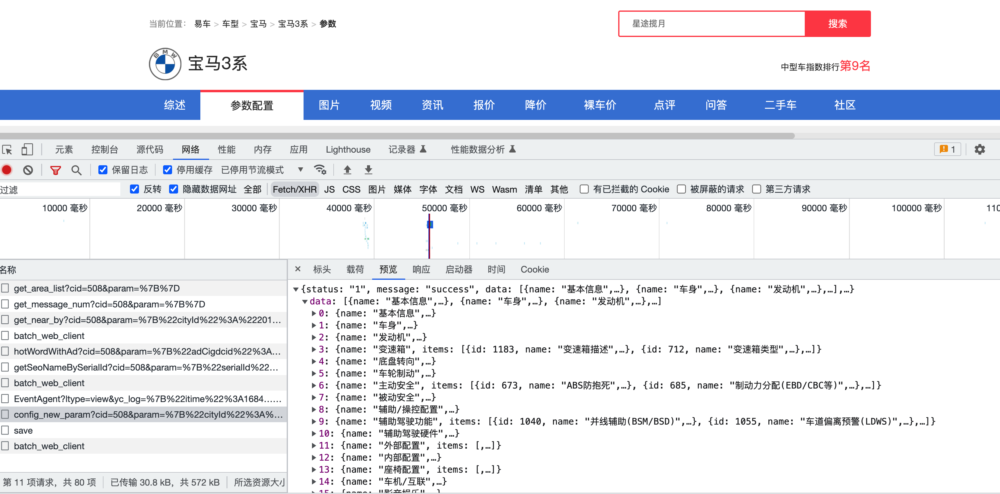

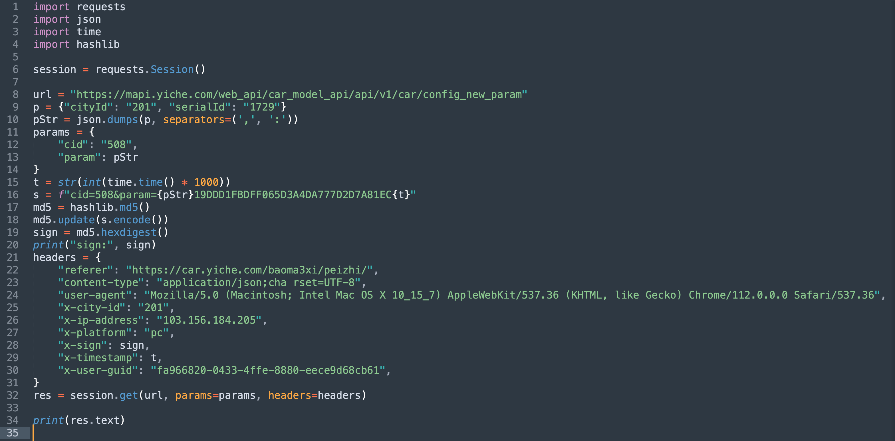

[练习网站](http://birdreport.cn/home/activity/page.html)

## 10.6、逆向案例之同花顺

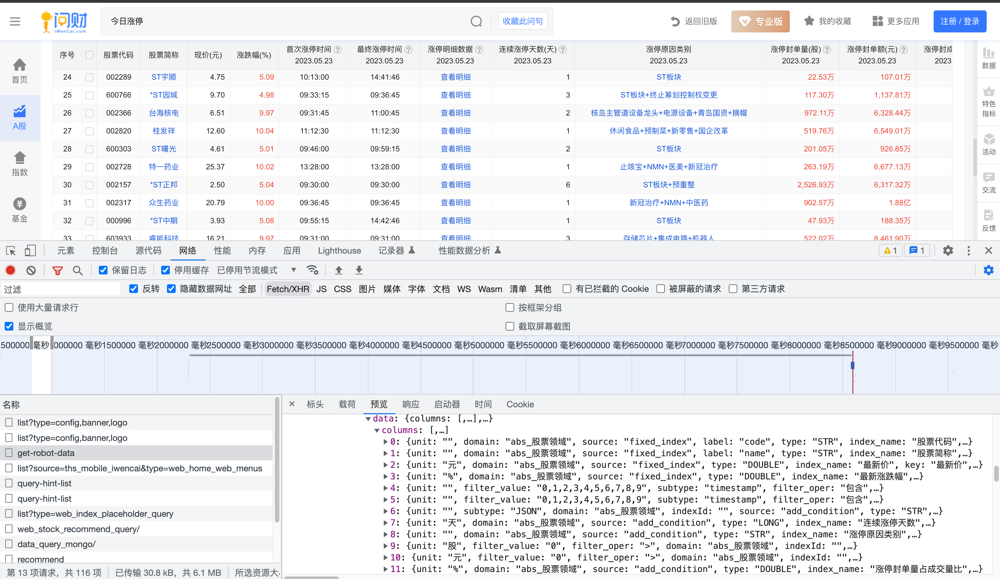


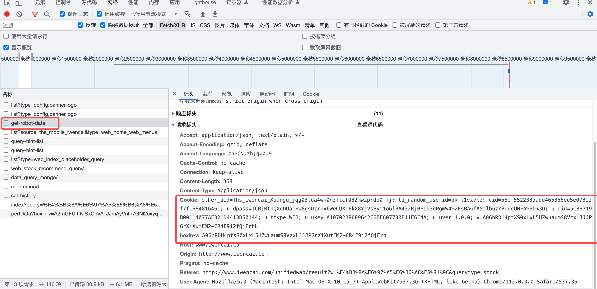

hook cookie设置

```python
(function(){
   'use strict'
    var _cookie = "";
    Object.defineProperty(document, 'cookie', {
        set: function(val) {
            console.log(val);
            debugger
            _cookie = val;
            return val;
        },
        get: function() {
            return _cookie;
        },
});
})()
```

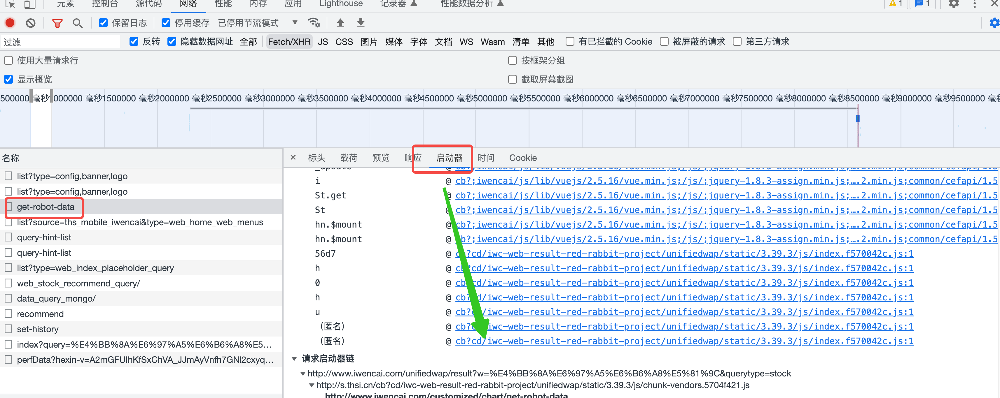

断点，hook。

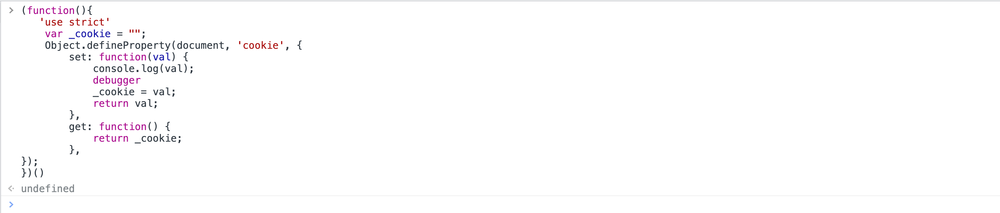

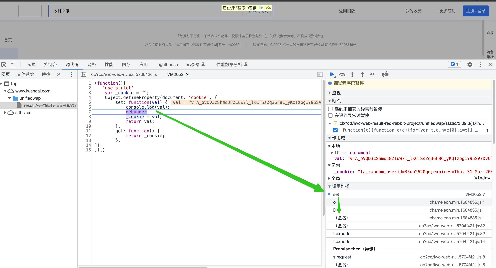


JS代码逆向生成动态值：

方式1:

```js
var TOKEN_SERVER_TIME = 1684826000.785;
document = {}
window = {}
var xxx = this
!function (n, t) {
    !function () {
        var r, e, a;
        r = e = a = n;
        var u, c, s;
        u = c = s = t;

        function v() {
            var n = arguments[s[0]];
            if (!n)
                return r[0];
            for (var t = u[1], o = a[1], i = c[2]; i < n.length; i++) {
                var v = n.charCodeAt(i)
                    , f = v ^ o;
                o = v,
                    t += e[2].fromCharCode(f)
            }
            return t
        }

        var f = c[3]
            , l = s[4]
            , p = Wn(e[3], r[4], s[5])
            , d = a[5]
            , h = Wn(c[6], s[7])
            , g = c[8]
            , w = c[9]
            , m = r[6]
            , I = u[10]
            , y = a[7]
            , _ = (s[11],
            c[12],
            s[13])
            , C = e[8]
            , E = u[14]
            , A = ot(e[9], e[10])
            , b = a[11]
            , T = u[15]
            , B = c[16]
            , R = r[12]
            , k = r[13]
            , S = s[17]
            , P = u[18]
            , M = Wn(s[19], s[20], u[21])
            , O = v(s[22], e[14])
            , D = s[23]
            , x = s[24]
            , N = u[25]
            , L = u[26]
            , W = Wn(s[27], r[15])
            , F = u[28]
            , Y = r[16]
            , j = a[17]
            , H = e[18]
            , $ = e[19]
            , U = r[20]
            , V = v(c[29], e[21], e[22])
            , X = s[30]
            , G = s[31]
            , K = s[32]
            , Q = s[33]
            , Z = r[23]
            , q = r[24]
            , z = v(u[12], u[34], s[35])
            , J = u[36]
            , nn = a[25]
            , tn = s[37]
            , rn = c[38]
            , en = r[26]
            , an = c[39]
            , on = s[40]
            , un = a[27]
            , cn = u[41]
            , sn = ot(s[42], c[43])
            , vn = r[28]
            , fn = u[8]
            , ln = s[44]
            , pn = a[29]
            , dn = s[45]
            , hn = a[30]
            , gn = c[46]
            , wn = a[31]
            , mn = a[32]
            , In = s[47]
            , yn = r[33]
            , _n = a[34]
            , Cn = c[48]
            , En = a[8]
            , An = v(a[35], s[49])
            , bn = c[50]
            , Tn = c[51]
            , Bn = at(r[36], s[52])
            , Rn = ot(r[37], e[38])
            , kn = e[39]
            , Sn = u[53]
            , Pn = r[40]
            , Mn = s[54]
            , On = s[55]
            , Dn = Wn(u[56], r[41], r[42])
            , xn = r[43]
            , Nn = u[57]
            , Ln = e[44];

        function Wn() {
            return arguments[u[0]].split(e[0]).reverse().join(c[1])
        }

        var Fn = r[45], Yn = Wn(c[58], e[46]), jn = v(s[59], u[60]), Hn = Wn(r[47], s[61]), $n = s[62], Un = s[63],
            Vn = u[2], Xn = [new u[27](r[48]), new u[27](c[64])],
            Gn = [new e[47](ot(a[49])), new u[27](ot(a[50], u[65]))];

        var rt;

        function at() {
            var n, t, r;
            n = t = r = u;
            var a, o, i;
            a = o = i = e;
            var c = arguments[o[52]];
            if (!c)
                return t[1];
            for (var s = o[0], v = o[1], f = a[52]; f < c.length; f++) {
                var l = c.charCodeAt(f)
                    , p = l ^ v;
                v = v * f % n[222] + o[200],
                    s += i[2].fromCharCode(p)
            }
            return s
        }

        function ot() {
            var n, t, e;
            n = t = e = c;
            var a, o, i;
            a = o = i = r;
            var u = arguments[a[52]];
            if (!u)
                return o[0];
            for (var s = a[0], v = n[267], f = o[200], l = t[2]; l < u.length; l++) {
                var p = u.charCodeAt(l);
                f = (f + t[0]) % v.length,
                    p ^= v.charCodeAt(f),
                    s += i[2].fromCharCode(p)
            }
            return s
        }

        var qn = function () {
            var n, t, r;
            n = t = r = a;
            var e, o, i;
            e = o = i = s;
            var u = o[15]
                , c = o[102]
                , f = e[103];

            function l(r) {
                var a = o[102]
                    , i = e[103];
                this[n[76]] = r;
                for (var u = t[52], c = r[a + g + i]; u < c; u++)
                    this[u] = t[52]
            }

            return l[e[104]][w + m + I + u] = function () {
                for (var a = e[105], u = this[a + y], c = [], s = -e[0], v = o[2], f = u[r[56]]; v < f; v++)
                    for (var l = this[v], p = u[v], d = s += p; c[d] = l & parseInt(t[77], n[78]),
                    --p != r[52];)
                        --d,
                            l >>= parseInt(n[79], i[106]);
                return c
            }
                ,
                l[v(t[80], t[81], b)][ot(i[107])] = function (n) {
                    for (var r = e[8], a = this[ot(e[108], e[109])], o = t[52], u = e[2], s = a[c + r + f]; u < s; u++) {
                        var v = a[u]
                            , l = i[2];
                        do {
                            l = (l << t[82]) + n[o++]
                        } while (--v > t[52]);
                        this[u] = l >>> i[2]
                    }
                }
                ,
                l
        }();
        var zn
        !function (n) {
            var t = s[13]
                , o = c[53]
                , i = r[83]
                , f = r[84]
                , l = s[110]
                , d = r[85]
                , h = r[86];

            function g(n, a, o, i, u) {
                for (var c = s[13], v = r[87], f = n[s[111]]; a < f;)
                    o[i++] = n[a++] ^ u & parseInt(c + v + t + _, r[88]),
                        u = ~(u * parseInt(e[89], e[82]))
            }

            function w(n) {
                for (var t = c[112], i = r[52], v = n[s[111]], f = []; i < v;) {
                    var l = n[i++] << parseInt(C + t, c[113]) | n[i++] << e[82] | n[i++];
                    f.push(m.charAt(l >> parseInt(e[90], e[82])), m.charAt(l >> parseInt(s[114], e[78]) & parseInt(a[91], r[88])), m.charAt(l >> u[59] & parseInt(E + o, a[78])), m.charAt(l & parseInt(a[92], u[113])))
                }
                return f.join(e[0])
            }

            for (var m = at(u[115], s[116]), I = {}, y = u[2]; y < parseInt(i + A, e[93]); y++)
                I[m.charAt(y)] = y;

            function O(n) {
                var t, r, e;
                t = r = e = s;
                var o, i, u;
                o = i = u = a;
                for (var c = ot(i[94]), l = e[2], p = n[o[56]], d = []; l < p;) {
                    var h = I[n.charAt(l++)] << parseInt(at(t[117]), u[82]) | I[n.charAt(l++)] << parseInt(v(t[118], u[95], e[119]), o[88]) | I[n.charAt(l++)] << t[59] | I[n.charAt(l++)];
                    d.push(h >> parseInt(e[120], t[106]), h >> parseInt(t[121], r[122]) & parseInt(f + b + c, t[106]), h & parseInt(o[96], u[88]))
                }
                return d
            }

            function D(n) {
                var t = O(n);
                if (rn,
                    p,
                t[r[52]] != h)
                    return error = T + B + l,
                        void 0;
                var a = t[c[0]]
                    , o = [];
                return g(t, +parseInt(e[79], c[122]), o, +u[2], a),
                    x(o) == a ? o : void 0
            }

            function x(n) {
                var t = o;
                t = Vn;
                for (var e = c[2], i = a[52], u = n[c[111]]; i < u; i++)
                    e = (e << s[123]) - e + n[i];
                return e & parseInt(s[124], r[88])
            }

            function N(n) {
                var t
                    , r = x(n)
                    , e = [h, r];
                return g(n, +a[52], e, +a[88], r),
                    t = P,
                    w(e)
            }

            n[e[97]] = w,
                n[R + k + S] = O,
                n[u[125]] = N,
                n[d + P + M] = D
        }(zn || (zn = {}));
        !function () {
            var r, e, a;
            r = e = a = n;
            var u, c, s;
            u = c = s = t;

            function v() {
                var n = arguments[s[0]];
                if (!n)
                    return r[0];
                for (var t = u[1], o = a[1], i = c[2]; i < n.length; i++) {
                    var v = n.charCodeAt(i)
                        , f = v ^ o;
                    o = v,
                        t += e[2].fromCharCode(f)
                }
                return t
            }

            var f = c[3]
                , l = s[4]
                , p = Wn(e[3], r[4], s[5])
                , d = a[5]
                , h = Wn(c[6], s[7])
                , g = c[8]
                , w = c[9]
                , m = r[6]
                , I = u[10]
                , y = a[7]
                , _ = (s[11],
                c[12],
                s[13])
                , C = e[8]
                , E = u[14]
                , A = ot(e[9], e[10])
                , b = a[11]
                , T = u[15]
                , B = c[16]
                , R = r[12]
                , k = r[13]
                , S = s[17]
                , P = u[18]
                , M = Wn(s[19], s[20], u[21])
                , O = v(s[22], e[14])
                , D = s[23]
                , x = s[24]
                , N = u[25]
                , L = u[26]
                , W = Wn(s[27], r[15])
                , F = u[28]
                , Y = r[16]
                , j = a[17]
                , H = e[18]
                , $ = e[19]
                , U = r[20]
                , V = v(c[29], e[21], e[22])
                , X = s[30]
                , G = s[31]
                , K = s[32]
                , Q = s[33]
                , Z = r[23]
                , q = r[24]
                , z = v(u[12], u[34], s[35])
                , J = u[36]
                , nn = a[25]
                , tn = s[37]
                , rn = c[38]
                , en = r[26]
                , an = c[39]
                , on = s[40]
                , un = a[27]
                , cn = u[41]
                , sn = ot(s[42], c[43])
                , vn = r[28]
                , fn = u[8]
                , ln = s[44]
                , pn = a[29]
                , dn = s[45]
                , hn = a[30]
                , gn = c[46]
                , wn = a[31]
                , mn = a[32]
                , In = s[47]
                , yn = r[33]
                , _n = a[34]
                , Cn = c[48]
                , En = a[8]
                , An = v(a[35], s[49])
                , bn = c[50]
                , Tn = c[51]
                , Bn = at(r[36], s[52])
                , Rn = ot(r[37], e[38])
                , kn = e[39]
                , Sn = u[53]
                , Pn = r[40]
                , Mn = s[54]
                , On = s[55]
                , Dn = Wn(u[56], r[41], r[42])
                , xn = r[43]
                , Nn = u[57]
                , Ln = e[44];

            function Wn() {
                return arguments[u[0]].split(e[0]).reverse().join(c[1])
            }

            var Fn = r[45], Yn = Wn(c[58], e[46]), jn = v(s[59], u[60]), Hn = Wn(r[47], s[61]), $n = s[62], Un = s[63],
                Vn = u[2],
                Xn = [new u[27](r[48]), new u[27](c[64])], Gn = [new e[47](ot(a[49])), new u[27](ot(a[50], u[65]))];

            var Jn;
            !function (n) {
                var t = Fn
                    , o = at(c[126], a[98])
                    , i = r[99]
                    , f = v(U, u[127])
                    , l = s[128]
                    , p = ot(a[100])
                    , d = r[5]
                    , h = r[101]
                    , g = ot(u[129])
                    , w = s[130]
                    , m = r[102]
                    , C = a[103]
                    , E = e[104];

                function A(n) {
                    for (var t = (Tn,
                        I,
                        []), e = r[52]; e < n[c[111]]; e++)
                        t.push(n.charCodeAt(e));
                    return t
                }

                function b() {
                    var n = new e[105];
                    try {
                        return time = s[52].now(),
                        time / parseInt(c[131], a[88]) >>> c[2]
                    } catch (t) {
                        return time = n.getTime(),
                        time / parseInt(s[121], s[84]) >>> r[52]
                    }
                }

                function T(n) {
                    var t = u[8]
                        , o = {}
                        , i = function (n, o) {
                        var i = c[102], f, l, p, d;
                        for (o = o.replace(s[132], u[1]),
                                 o = o.substring(u[0], o[e[56]] - c[0]),
                                 f = o.split(c[133]),
                                 p = c[2]; p < f[i + t + O]; p++)
                            if (l = f[p].split(v(r[106], c[134])),
                            l && !(l[r[56]] < s[122])) {
                                for (d = r[88]; d < l[r[56]]; d++)
                                    l[r[54]] = l[r[54]] + r[107] + l[d];
                                l[s[2]] = new r[47](c[135]).test(l[e[52]]) ? l[a[52]].substring(u[0], l[e[52]][D + x] - c[0]) : l[a[52]],
                                    l[r[54]] = new a[47](c[135]).test(l[r[54]]) ? l[e[54]].substring(s[0], l[a[54]][a[56]] - u[0]) : l[s[0]],
                                    n[l[c[2]]] = l[e[54]]
                            }
                        return n
                    };
                    return new r[47](e[108]).test(n) && (o = i(o, n)),
                        o
                }

                function B(n) {
                    var t, e, a;
                    t = e = a = c;
                    var u, s, v;
                    if (u = s = v = r,
                    typeof n === ot(s[109], sn) && n[Wn(y, a[136], s[110])])
                        try {
                            switch (parseInt(n[e[137]])) {
                                case parseInt(a[131], t[122]):
                                    break;
                                case parseInt(v[111], s[78]):
                                    top[e[138]][v[112]] = n[t[139]];
                                    break;
                                case parseInt(u[113], e[122]):
                                    top[o + i + N][e[140]] = n[s[114]];
                                    break;
                                default:
                                    break
                            }
                        } catch (f) {
                        }
                }

                function R(n, t, r) {
                    var e, a, o;
                    e = a = o = u,
                        q ? n.addEventListener(t, r) : n.attachEvent(a[25] + t, r)
                }

                function k() {
                    return Math.random() * parseInt(u[141], r[78]) >>> r[52]
                }

                function S(n, t) {
                    var o = en
                        , i = new r[47](e[115], a[116]);
                    o = T;
                    var s = new u[27](v(p, r[117], m));
                    if (n) {
                        var f = n.match(i);
                        if (f) {
                            var l = f[u[0]];
                            return t && s.test(l) && (l = l.split(r[118]).pop().split(r[107])[c[2]]),
                                l
                        }
                    }
                }

                function P(n) {
                    var t = mn
                        , o = c[142]
                        , i = r[119]
                        , v = e[120]
                        , I = a[121];
                    if (!(n > e[122])) {
                        n = n || a[52];
                        var y = parseInt(u[143], e[78])
                            , _ = a[51].createElement(u[144]);
                        t = Q,
                            _[c[145]] = location[r[123]] + a[124] + parseInt((new r[105]).getTime() / y) + (f + o + l),
                            _[e[125]] = function () {
                                Vn = u[0],
                                    setTimeout(function () {
                                        P(++n)
                                    }, n * parseInt(e[126], u[84]))
                            }
                            ,
                            _[p + L + d] = _[s[146]] = function () {
                                var n, t, r;
                                n = t = r = a;
                                var e, o, u;
                                e = o = u = c;
                                var s = e[147];
                                this[t[127]] && this[i + W] !== o[148] && this[u[149]] !== o[150] && this[s + F + h] !== u[151] || (Vn = n[52],
                                    _[e[152]] = _[g + w + v] = n[128])
                            }
                            ,
                            c[66][m + I].appendChild(_)
                    }
                }

                function M(n) {
                    var t, e, a;
                    t = e = a = r;
                    var o, i, u;
                    return o = i = u = s,
                        new u[27](t[129]).test(n)
                }

                function X() {
                    var n = new s[52];
                    return typeof TOKEN_SERVER_TIME == s[153] ? r[52] : (time = parseInt(TOKEN_SERVER_TIME),
                        time)
                }

                function G(n) {
                    var t, e, a;
                    t = e = a = s;
                    var o, i, u;
                    o = i = u = r;
                    for (var c = u[52], v = a[2], f = n[o[56]]; v < f; v++)
                        c = (c << a[123]) - c + n.charCodeAt(v),
                            c >>>= o[52];
                    return c
                }

                function K(n) {
                    var t = new s[27](e[130], s[80]);
                    if (n) {
                        return n.match(t)
                    }
                }

                function Z(n) {
                    var t = new u[27](c[154]);
                    if (M(n))
                        return n;
                    var o = t.test(n) ? -a[86] : -parseInt(r[79], e[88]);
                    return (tn,
                        _,
                        n.split(s[155])).slice(o).join(a[131])
                }

                n[Y + C + j] = T,
                    t = En,
                    n[c[156]] = P,
                    n[ot(u[157])] = B,
                    n[r[132]] = A,
                    n[c[158]] = G,
                    n[c[159]] = k,
                    n[r[133]] = M,
                    n[s[160]] = Z,
                    n[E + H] = S,
                    n[$ + U] = K,
                    n[s[161]] = z,
                    n[s[162]] = b,
                    n[r[134]] = X;
                var q = !!a[65][a[135]];

                function z(n) {
                    for (var t = v(O, u[163]), a = e[136], o = s[2], i = n[V + t + a] - s[0]; i >= r[52]; i--)
                        o = o << r[54] | +n[i];
                    return o
                }

                n[u[164]] = R
            }(Jn || (Jn = {}));

            var rt;
            (function (n) {
                var t = e[87], o = a[8], i = e[8], f = s[215], l = r[52], p = s[0], d = parseInt(c[216], u[122]),
                    h = e[86],
                    g = u[217], w = u[123], m = e[165], I = parseInt(t + En, c[122]), y = parseInt(a[79], a[82]),
                    _ = c[218],
                    C = parseInt(a[193], e[82]), E = parseInt(o + i, r[78]), A = parseInt(u[219], s[122]),
                    b = parseInt(f + An, s[106]), T = parseInt(r[194], s[106]), B = parseInt(ot(s[220], e[195]), r[82]),
                    R = parseInt(e[196], u[122]), k = parseInt(e[197], a[78]), S;

                function P() {
                    var n = s[0]
                        , t = r[88]
                        , e = parseInt(u[13], c[122])
                        , a = s[217];
                    S = new qn([a, a, a, a, n, n, n, e, t, t, t, t, t, t, t, a, t, n]),
                        S[p] = Jn.serverTimeNow(),
                        M(),
                        S[B] = 0,
                        S[k] = 'anguage',
                        S[R] = 3,
                        S[h] = 3003374309,
                        S[b] = 3748,
                        S[g] = 7,
                        S[w] = 10,
                        S[m] = 5
                }

                function M() {

                    S[l] = Jn.random()
                }

                function O() {
                    S[R]++,
                        S[p] = Jn.serverTimeNow(),
                        S[d] = Jn.timeNow(),
                        S[B] = Vn,
                        S[I] = 0,
                        S[y] = 0,
                        S[_] = 0,
                        S[C] = 0,
                        S[E] = 0,
                        S[A] = 0;
                    var n = S.toBuffer();
                    return zn.encode(n)
                }

                n[e[57]] = P;
                P()

                function D() {
                    return O()
                }

                n[v(an, a[198], r[199])] = D
                xxx.update = D


            })(rt || (rt = {}));
        }()

    }()
}(["", 9527, String, Boolean, "eh", "ad", "Bu", "ileds", "1", "\b", Array, "7", "base", "64De", "\u2543\u252b", "etatS", "pa", "e", "FromUrl", "getOrigi", "nFromUrl", "\u255b\u253e", "b?\x18q)", "ic", "k", "sted", "he", "wser", "oNo", "ckw", "ent", "hst", "^And", "RM", "systemL", 5, "\u255f\u0978\u095b\u09f5", "TR8", "!'", "gth", "er", "TP", 83, "r", !0, "v", "v-nixeh", RegExp, "thsi.cn", 'K\x19"]K^xVV', "KXxAPD?\x1b[Y", document, 0, "allow", 1, "; ", "length", "Init", "=", "; domain=", "checkcookie", !1, "eikooCled", "tnemucod", "d", window, "\u2553\u0972\u0959\u09e4\u09bd\u0938\u0980\u09c5\u09b1\u09d1\u09a7\u09dc\u09dd\u09d3\u09c2", "\u2556\u0979\u095e\u09d3\u09b5\u0935\u098f\u09c7\u099d\u09d2\u09b0", 23, "l$P$~", "frames", "ducument", "ydob", "documentElement", "del", "@[\\]^`{|}~]", "base_fileds", "255", 10, "10", 39, "\u2547\u2535\u255a\u252e\u2541\u2535\u254c\u253c\u2559", 8, "4", "3", "de", 3, "11", 2, "203", "22", "111111", "3f", 16, "\x0f", "\u2506\u2537\u2507\u2537", "11111111", "base64Encode", "v\x1d", "ati", "WY", "te", "bo", "rs", "getHost", Date, "{DF", ":", "^{.*}$", "WU<P[C", 52, "1001", "href", "1111101010", "redirect_url", "^\\s*(?:https?:)?\\/{2,}([^\\/\\?\\#\\\\]+)", "i", "\u256c\u252c\u2516\u254b", "@", "ready", "change", "dy", 7, "protocol", "//s.thsi.cn/js/chameleon/time.1", "onerror", "2000", "readyState", null, "^(\\d+\\.)+\\d+$", "^\\s*(?:(https?:))?\\/{2,}([^\\/\\?\\#\\\\]+)", ".", "strToBytes", "isIPAddr", "serverTimeNow", "addEventListener", "th", "wh", "Scro", "mousemove", 55, "evomhcuot", "[[?PVC\x0e", "getMouseMove", '_R"xWB%Po_3YT', "getMouseClick", "ght", "gin", "msD", "ack", "\u2556\u096b\u095f", "Nativ", "^A", "MozSettingsEvent", "safari", "ActiveXObject", "postMessage", "Uint8Array", "WeakMap", "Google Inc.", "vendor", "chrome", "python", "sgAppName", "JX", 6, "me", "LBBROWSER", "w4", "2345Explorer", "TheWorld", "\u2544", 40, "tTr", "\u2506", "navigator", "webdriver", "languages", "taborcA|FDP", "\u2541\u097c\u0949", 95, "1e0", "e Cli", "iso-8859-1", "defaultCharset", "localStorage", "^Win64", "^Linux armv|Android", "^iPhone", "^iPad", "B_{VV", "getPluginNum", "getBrowserFeature", "12", "16", "sE", "10000", "17", "\u2542\u2532\u2556\u2537\u2543\u2526", "\x1cx`R", 2333, "XMLH", "ers", "0", "lo", 57, "ylppa", "error", "target", "click", "unload", "HE9AWT9Y", "\\.", "c?", "$", "/", "fetch", "prototype", "url", "\u2556\u0971\u0956\u09fe\u09a7", "headers", "\u256b\u2554", 79, "?", "^(.*?):[ \\t]*([^\\r\\n]*)\\r?$", "gm", "s", "src", "analysisRst", "\u255e\u0973\u0949\u09f4\u09a2\u0929\u09ac\u09d4\u0992\u09d2\u09b0\u09d4", "appendChild", "Y", "jsonp_ignore", "^", 70, "421", "XH>a", "\u2574\u253c\u257d\u2530\u2575\u2539\u257c\u2533\u257d\u2522\u256e\u2521\u2560\u2524\u2561\u2525", "CHAMELEON_LOADED"], [1, "", 0, "he", "ad", 29, "\x180G\x1f", "?>=<;:\\\\/,+", "ng", "to", "ff", Number, Error, "11", "6", "er", "ro", "code", "co", "_?L", "ed", "@S\x15D*", Object, "len", "gth", "on", "lo", RegExp, "ySta", 13, "eel", "ee", "ouse", "ll", "\u2544\u2530\u2555\u2531", "FCm-", "isTru", "getC", "Pos", "ve", "or", "ae", "^", "On", "Sho", "can", "ont", "roid", "anguage", "\u2502", "ta", "tna", Date, "3", "am", "e", "n+", "f80", "\x1dD", 6, "\u255f\u253a\u2542\u252b\u2545\u2568\u251e", "KCABLLAC_NOELEMAHC", "X-Antispider-Message", 3, ".baidu.", Function, document, !0, "cookie", "; ", "=", 96, "\u255b\u253e\u2550\u2537\u2543\u252b", "\u250c\u252c\u255c\u253d\u2549\u2521\u251c", ";O", "; expires=", "getCookie", "Thu, 01 Jan 1970 00:00:00 GMT", "setCookie", "Z\x18|", "i", "\u255b\u2534\u2557\u2536\u255a\u2509\u257d\u2512\u2560\u2501\u2566\u2503", 52, window, 10, "Init", !1, "set", "v", "eliflmth", '<script>document.w=window<\/script><iframe src="/favicon.icon"></iframe>', "iS.p", "head", "#default#userData", "get", "[!\"#$%&'()*", "g", "^d", "$D", "\u2568\u2537\u2568\u254c\u256a", "]\\P", "___", "le", "th", "prototype", "base_f", 8, "\\R5Z\\R\x14@^Q3G", "ZV%PgQ?Y]S%", 67, "r", "length", "0", 16, "12", "\u2576\u095f\u0979\u09d5\u0995\u091b\u09a9\u09f9\u09bd\u09f7\u0989\u09fd\u09f5\u09f3\u09f9\u0a41\u0a4d\u098f\u0999\u0905\u0975\u09cb\u09a9\u09a9\u099d\u0927\u0933\u0913\u0a6b\u0999\u09a3\u0937\u098b\u09f5\u0933\u0a7b\u091b\u09b1\u0a63\u095f\u09fb\u094d\u0993\u0943\u092b\u0949\u09a3\u09e7\u09cb\u0925\u0993\u09ab\u09f0\u092c\u092c\u0942\u0950\u09c8\u0944\u09c6\u0990\u0944\u09cb\u098e", "i,", "\u2505\u092f", 12, 56, "20", "1000", 2, 5, "11111111", "encode", "\u255b\u0972\u0959", "\u2519", "s", "WY$PYS", "ystate", "1111101000", / /g, ",", "\u250d", '^".*"$', "edoc_sutats", "status_code", "location", "redirect_url", "href", "4294967295", "j", "1200000", "script", "src", "onreadystatechange", "read", "loaded", "readyState", "complete", "interactive", "onload", "undefined", "\\.com\\.cn$|\\.com\\.hk$", ".", "getServerTime", 'YY7YAD?FjD"', "strhash", "random", "getRootDomain", "booleanToDecimal", "timeNow", "\u2559\u253e", "eventBind", "onwh", "\u255b", 46, "DOMM", "cl", "T^5^", "div", "onmousewheel", "mousewheel", 51, "keydown", "clientY", "getKeyDown", "ch", "plu", "\u2543\u252b", "ouc", "art", "^i", "Po", "callPhantom", "max", "Hei", "ActiveXObject", "nd", "yG&Y]\x17\x15ZUG#A]Ez\x15qY5\x1b", "\u2576\u097e\u094e\u09f8\u09a6\u0938\u09b6\u09fe\u0996\u09d7\u09a7\u09d2\u09cc", "Maxthon", "Q", "opr", "chrome", "BIDUBrowser", "QQBro", "[_$ZUR", "UBrowser", "MSGesture", "plugins", "doNotTrack", "ShockwaveFlash.ShockwaveFlash", "]C|\x18", "webgl2", "platform", "name", "^Win32", "^MacIntel", "^Linux [ix]\\d+", "^BlackBerry", "language", "getPlatform", "getBrowserIndex", "1", "10", 4, 9, "1100", "\t\0", "3c", 256, "w", "TTP", "et", "c", "al", "\u255e", "base", "\u2569\u0975\u094e\u09e5\u09a0\u092e\u09d1\u09ed\u09ce", "target", "fh%PTQr", "#", "\u255f\u097c\u0949\u09f9", 97, "rg", "tnemelEcrs", "fn_Ws", "parentNode", "tagName", "A", "submit", "PX%", "me", "host", "\\.?", "d\x19", "Fri, 01 Feb 2050 00:00:00 GMT", "]E%", "toString", "[object Request]", "headers", 83, "&", encodeURIComponent, "open", "getAllResponseHeaders", "4", "tseuqeRpttHLMX", "Window", "\u2564\u095e", "RI", "\u2550\u0953", "(YaZ", "_", "_str", "V587"]);

console.log(xxx.update())
```

方式2:

````js
var TOKEN_SERVER_TIME = 1684827000.166;
document = {}
window = {}
var xxx = this


!function (n, t) {
    !function () {
        var r, e, a;
        r = e = a = n;
        var u, c, s;
        u = c = s = t;

        function v() {
            var n = arguments[s[0]];
            if (!n)
                return r[0];
            for (var t = u[1], o = a[1], i = c[2]; i < n.length; i++) {
                var v = n.charCodeAt(i)
                    , f = v ^ o;
                o = v,
                    t += e[2].fromCharCode(f)
            }
            return t
        }

        var f = c[3]
            , l = s[4]
            , p = Wn(e[3], r[4], s[5])
            , d = a[5]
            , h = Wn(c[6], s[7])
            , g = c[8]
            , w = c[9]
            , m = r[6]
            , I = u[10]
            , y = a[7]
            , _ = (s[11],
            c[12],
            s[13])
            , C = e[8]
            , E = u[14]
            , A = ot(e[9], e[10])
            , b = a[11]
            , T = u[15]
            , B = c[16]
            , R = r[12]
            , k = r[13]
            , S = s[17]
            , P = u[18]
            , M = Wn(s[19], s[20], u[21])
            , O = v(s[22], e[14])
            , D = s[23]
            , x = s[24]
            , N = u[25]
            , L = u[26]
            , W = Wn(s[27], r[15])
            , F = u[28]
            , Y = r[16]
            , j = a[17]
            , H = e[18]
            , $ = e[19]
            , U = r[20]
            , V = v(c[29], e[21], e[22])
            , X = s[30]
            , G = s[31]
            , K = s[32]
            , Q = s[33]
            , Z = r[23]
            , q = r[24]
            , z = v(u[12], u[34], s[35])
            , J = u[36]
            , nn = a[25]
            , tn = s[37]
            , rn = c[38]
            , en = r[26]
            , an = c[39]
            , on = s[40]
            , un = a[27]
            , cn = u[41]
            , sn = ot(s[42], c[43])
            , vn = r[28]
            , fn = u[8]
            , ln = s[44]
            , pn = a[29]
            , dn = s[45]
            , hn = a[30]
            , gn = c[46]
            , wn = a[31]
            , mn = a[32]
            , In = s[47]
            , yn = r[33]
            , _n = a[34]
            , Cn = c[48]
            , En = a[8]
            , An = v(a[35], s[49])
            , bn = c[50]
            , Tn = c[51]
            , Bn = at(r[36], s[52])
            , Rn = ot(r[37], e[38])
            , kn = e[39]
            , Sn = u[53]
            , Pn = r[40]
            , Mn = s[54]
            , On = s[55]
            , Dn = Wn(u[56], r[41], r[42])
            , xn = r[43]
            , Nn = u[57]
            , Ln = e[44];

        function Wn() {
            return arguments[u[0]].split(e[0]).reverse().join(c[1])
        }

        var Fn = r[45], Yn = Wn(c[58], e[46]), jn = v(s[59], u[60]), Hn = Wn(r[47], s[61]), $n = s[62], Un = s[63],
            Vn = u[2], Xn = [new u[27](r[48]), new u[27](c[64])],
            Gn = [new e[47](ot(a[49])), new u[27](ot(a[50], u[65]))],
            Kn = c[66][f + l], Qn;


        var Zn;
        !function (n) {
            var t = u[80], o = v(nn, s[81], u[82]), i = s[67], f, l = u[83][Wn(u[84], e[63])], p, d;

            function g(n) {
                var t = j;
                return t = dn,
                    i ? y(n) : f ? w(n) : void u[2]
            }

            function w(n) {
                E(function () {
                    return n = R(n),
                        f.getAttribute(n)
                })()
            }

            function m() {
                try {
                    return !!(o in s[83] && s[83][o])
                } catch (n) {
                    return void u[2]
                }
            }

            function I(n) {
                try {
                    f.removeItem(n)
                } catch (t) {
                }
            }

            n[c[85]] = C;

            function y(n) {
                try {
                    return f.getItem(n)
                } catch (t) {
                    return u[86]
                }
            }

            n[c[87]] = B;

            function _(n, t) {
                try {
                    f.setItem(n, t)
                } catch (r) {
                }
            }

            function C() {
                var n = e[64]
                    , r = u[88];
                if (i = m(),
                    i)
                    f = a[65][o];
                else if (l[at(e[66])][at(e[67], a[68])])
                    try {
                        p = new ActiveXObject(Wn(a[69], s[89], l)),
                            p.open(),
                            p.write(s[90]),
                            p.close(),
                            d = p.w[e[70]][s[2]][e[71]],
                            f = d.createElement(n + t + r)
                    } catch (c) {
                        f = l.createElement(o),
                            d = l[Wn(u[91], a[72])] || l.getElementsByTagName(s[92])[s[2]] || l[a[73]]
                    }
            }

            function E(n) {
                return function () {
                    d.appendChild(f),
                        f.addBehavior(s[93]),
                        f.load(o);
                    var t = n();
                    return d.removeChild(f),
                        t
                }
            }

            n[c[94]] = g;

            function A(n) {
                var t, r, e;
                if (t = r = e = a,
                    i)
                    I(n);
                else {
                    if (!f)
                        return void e[52];
                    b(n)
                }
            }

            function b(n) {
                E(function () {
                    n = R(n),
                        f.removeAttribute(n),
                        f.save(o)
                })()
            }

            function T(n, t) {
                E(function () {
                    n = R(n),
                        f.setAttribute(n, t),
                        f.save(o)
                })()
            }

            n[a[74]] = A;

            function B(n, t) {
                if (void 0 === t)
                    return A(n);
                if (i)
                    _(n, t);
                else {
                    if (!f)
                        return void u[2];
                    T(n, t)
                }
            }

            function R(n) {
                var t = s[95]
                    , e = r[75]
                    , a = new r[47](t + h + e, c[96]);
                return n.replace(new c[27](u[97]), v(s[98], s[99], s[100])).replace(a, c[101])
            }
        }(Zn || (Zn = {}));
        var qn = function () {
            var n, t, r;
            n = t = r = a;
            var e, o, i;
            e = o = i = s;
            var u = o[15]
                , c = o[102]
                , f = e[103];

            function l(r) {
                var a = o[102]
                    , i = e[103];
                this[n[76]] = r;
                for (var u = t[52], c = r[a + g + i]; u < c; u++)
                    this[u] = t[52]
            }

            return l[e[104]][w + m + I + u] = function () {
                for (var a = e[105], u = this[a + y], c = [], s = -e[0], v = o[2], f = u[r[56]]; v < f; v++)
                    for (var l = this[v], p = u[v], d = s += p; c[d] = l & parseInt(t[77], n[78]),
                    --p != r[52];)
                        --d,
                            l >>= parseInt(n[79], i[106]);
                return c
            }
                ,
                l[v(t[80], t[81], b)][ot(i[107])] = function (n) {
                    for (var r = e[8], a = this[ot(e[108], e[109])], o = t[52], u = e[2], s = a[c + r + f]; u < s; u++) {
                        var v = a[u]
                            , l = i[2];
                        do {
                            l = (l << t[82]) + n[o++]
                        } while (--v > t[52]);
                        this[u] = l >>> i[2]
                    }
                }
                ,
                l
        }(), zn;
        !function (n) {
              var t = s[13]
                , o = c[53]
                , i = r[83]
                , f = r[84]
                , l = s[110]
                , d = r[85]
                , h = r[86];

            function g(n, a, o, i, u) {
                for (var c = s[13], v = r[87], f = n[s[111]]; a < f;)
                    o[i++] = n[a++] ^ u & parseInt(c + v + t + _, r[88]),
                        u = ~(u * parseInt(e[89], e[82]))
            }

            function w(n) {
                for (var t = c[112], i = r[52], v = n[s[111]], f = []; i < v;) {
                    var l = n[i++] << parseInt(C + t, c[113]) | n[i++] << e[82] | n[i++];
                    f.push(m.charAt(l >> parseInt(e[90], e[82])), m.charAt(l >> parseInt(s[114], e[78]) & parseInt(a[91], r[88])), m.charAt(l >> u[59] & parseInt(E + o, a[78])), m.charAt(l & parseInt(a[92], u[113])))
                }
                return f.join(e[0])
            }

            for (var m = at(u[115], s[116]), I = {}, y = u[2]; y < parseInt(i + A, e[93]); y++)
                I[m.charAt(y)] = y;

            function O(n) {
                var t, r, e;
                t = r = e = s;
                var o, i, u;
                o = i = u = a;
                for (var c = ot(i[94]), l = e[2], p = n[o[56]], d = []; l < p;) {
                    var h = I[n.charAt(l++)] << parseInt(at(t[117]), u[82]) | I[n.charAt(l++)] << parseInt(v(t[118], u[95], e[119]), o[88]) | I[n.charAt(l++)] << t[59] | I[n.charAt(l++)];
                    d.push(h >> parseInt(e[120], t[106]), h >> parseInt(t[121], r[122]) & parseInt(f + b + c, t[106]), h & parseInt(o[96], u[88]))
                }
                return d
            }

            function D(n) {
                var t = O(n);
                if (rn,
                    p,
                t[r[52]] != h)
                    return error = T + B + l,
                        void 0;
                var a = t[c[0]]
                    , o = [];
                return g(t, +parseInt(e[79], c[122]), o, +u[2], a),
                    x(o) == a ? o : void 0
            }

            function x(n) {
                var t = o;
                t = Vn;
                for (var e = c[2], i = a[52], u = n[c[111]]; i < u; i++)
                    e = (e << s[123]) - e + n[i];
                return e & parseInt(s[124], r[88])
            }

            function N(n) {
                var t = et
                    , r = x(n)
                    , e = [h, r];
                return g(n, +a[52], e, +a[88], r),
                    t = P,
                    w(e)
            }

            n[e[97]] = w,
                n[R + k + S] = O,
                n[u[125]] = N,
                n[d + P + M] = D
        }(zn || (zn = {}));
        var Jn;
        !function (n) {
            var t = Fn
                , o = at(c[126], a[98])
                , i = r[99]
                , f = v(U, u[127])
                , l = s[128]
                , p = ot(a[100])
                , d = r[5]
                , h = r[101]
                , g = ot(u[129])
                , w = s[130]
                , m = r[102]
                , C = a[103]
                , E = e[104];

            function A(n) {
                for (var t = (Tn,
                    I,
                    []), e = r[52]; e < n[c[111]]; e++)
                    t.push(n.charCodeAt(e));
                return t
            }

            function b() {
                var n = new e[105];
                try {
                    return time = s[52].now(),
                    time / parseInt(c[131], a[88]) >>> c[2]
                } catch (t) {
                    return time = n.getTime(),
                    time / parseInt(s[121], s[84]) >>> r[52]
                }
            }

            function T(n) {
                var t = u[8]
                    , o = {}
                    , i = function (n, o) {
                    var i = c[102], f, l, p, d;
                    for (o = o.replace(s[132], u[1]),
                             o = o.substring(u[0], o[e[56]] - c[0]),
                             f = o.split(c[133]),
                             p = c[2]; p < f[i + t + O]; p++)
                        if (l = f[p].split(v(r[106], c[134])),
                        l && !(l[r[56]] < s[122])) {
                            for (d = r[88]; d < l[r[56]]; d++)
                                l[r[54]] = l[r[54]] + r[107] + l[d];
                            l[s[2]] = new r[47](c[135]).test(l[e[52]]) ? l[a[52]].substring(u[0], l[e[52]][D + x] - c[0]) : l[a[52]],
                                l[r[54]] = new a[47](c[135]).test(l[r[54]]) ? l[e[54]].substring(s[0], l[a[54]][a[56]] - u[0]) : l[s[0]],
                                n[l[c[2]]] = l[e[54]]
                        }
                    return n
                };
                return new r[47](e[108]).test(n) && (o = i(o, n)),
                    o
            }

            function B(n) {
                var t, e, a;
                t = e = a = c;
                var u, s, v;
                if (u = s = v = r,
                typeof n === ot(s[109], sn) && n[Wn(y, a[136], s[110])])
                    try {
                        switch (parseInt(n[e[137]])) {
                            case parseInt(a[131], t[122]):
                                break;
                            case parseInt(v[111], s[78]):
                                top[e[138]][v[112]] = n[t[139]];
                                break;
                            case parseInt(u[113], e[122]):
                                top[o + i + N][e[140]] = n[s[114]];
                                break;
                            default:
                                break
                        }
                    } catch (f) {
                    }
            }

            function R(n, t, r) {
                var e, a, o;
                e = a = o = u
            }

            function k() {
                return Math.random() * parseInt(u[141], r[78]) >>> r[52]
            }

            function S(n, t) {
                var o = en
                    , i = new r[47](e[115], a[116]);
                o = T;
                var s = new u[27](v(p, r[117], m));
                if (n) {
                    var f = n.match(i);
                    if (f) {
                        var l = f[u[0]];
                        return t && s.test(l) && (l = l.split(r[118]).pop().split(r[107])[c[2]]),
                            l
                    }
                }
            }

            function P(n) {
                var t = mn
                    , o = c[142]
                    , i = r[119]
                    , v = e[120]
                    , I = a[121];
                if (!(n > e[122])) {
                    n = n || a[52];
                    var y = parseInt(u[143], e[78])
                        , _ = a[51].createElement(u[144]);
                    t = Q,
                        _[c[145]] = location[r[123]] + a[124] + parseInt((new r[105]).getTime() / y) + (f + o + l),
                        _[e[125]] = function () {
                            Vn = u[0],
                                setTimeout(function () {
                                    P(++n)
                                }, n * parseInt(e[126], u[84]))
                        }
                        ,
                        _[p + L + d] = _[s[146]] = function () {
                            var n, t, r;
                            n = t = r = a;
                            var e, o, u;
                            e = o = u = c;
                            var s = e[147];
                            this[t[127]] && this[i + W] !== o[148] && this[u[149]] !== o[150] && this[s + F + h] !== u[151] || (Vn = n[52],
                                _[e[152]] = _[g + w + v] = n[128])
                        }
                        ,
                        c[66][m + I].appendChild(_)
                }
            }

            function M(n) {
                var t, e, a;
                t = e = a = r;
                var o, i, u;
                return o = i = u = s,
                    new u[27](t[129]).test(n)
            }

            function X() {
                var n = new s[52];
                return typeof TOKEN_SERVER_TIME == s[153] ? r[52] : (time = parseInt(TOKEN_SERVER_TIME),
                    time)
            }

            function G(n) {
                var t, e, a;
                t = e = a = s;
                var o, i, u;
                o = i = u = r;
                for (var c = u[52], v = a[2], f = n[o[56]]; v < f; v++)
                    c = (c << a[123]) - c + n.charCodeAt(v),
                        c >>>= o[52];
                return c
            }

            function K(n) {
                var t = new s[27](e[130], s[80]);
                if (n) {
                    return n.match(t)
                }
            }

            function Z(n) {
                var t = new u[27](c[154]);
                if (M(n))
                    return n;
                var o = t.test(n) ? -a[86] : -parseInt(r[79], e[88]);
                return (tn,
                    _,
                    n.split(s[155])).slice(o).join(a[131])
            }

            n[Y + C + j] = T,
                t = En,
                n[c[156]] = P,
                n[ot(u[157])] = B,
                n[r[132]] = A,
                n[c[158]] = G,
                n[c[159]] = k,
                n[r[133]] = M,
                n[s[160]] = Z,
                n[E + H] = S,
                n[$ + U] = K,
                n[s[161]] = z,
                n[s[162]] = b,
                n[r[134]] = X;
            var q = !!a[65][a[135]];

            function z(n) {
                for (var t = v(O, u[163]), a = e[136], o = s[2], i = n[V + t + a] - s[0]; i >= r[52]; i--)
                    o = o << r[54] | +n[i];
                return o
            }

            n[u[164]] = R
        }(Jn || (Jn = {}));
        var nt;
        !function (n) {
            var t = u[165]
                , o = a[137]
                , i = at(s[166], s[167])
                , v = u[168]
                , f = a[138]
                , l = c[169]
                , p = ot(s[170], B)
                , d = a[52]
                , h = r[52]
                , g = c[2]
                , w = c[2]
                , m = c[2]
                , I = s[2]
                , y = s[67]
                , _ = t + X in [] ? o + G + i : s[172] in c[66] ? u[173] : v + K + f + Q;
            Jn.eventBind(s[66], _, S),
                Jn.eventBind(a[51], r[139], T),
                Jn.eventBind(u[66], Wn(e[140], e[141], s[174]), T),
                Jn.eventBind(c[66], l + Z + q, M),
                Jn.eventBind(u[66], c[175], b);

            function C() {
                return w
            }

            function E() {
                return d
            }

            function b(n) {
                w++
            }

            function T(n) {
                d++
            }

            function R() {
                return h
            }

            function k() {
                return g
            }

            function S(n) {
                h++
            }

            function P() {
                return {
                    x: m,
                    y: I,
                    trusted: y
                }
            }

            function M(n) {
                var t, r, e;
                t = r = e = a;
                var o, i, u;
                o = i = u = c;
                var s = (S,
                    A,
                    u[36]);
                g++,
                    y = void 0 == n[s + z] || n[J + nn],
                    m = n[ot(r[142], o[84])],
                    I = n[i[176]]
            }

            n[e[143]] = E,
                n[ot(e[144])] = R,
                n[e[145]] = k,
                n[u[177]] = C,
                n[tn + p + rn] = P
        }(nt || (nt = {}));
        var tt;
        !function (n) {
            var t = e[146]
                , f = c[4]
                , l = c[178]
                , p = u[179]
                , h = r[147]
                , g = r[148]
                , m = e[149]
                , I = s[102]
                , y = v(rn, u[180], zn)
                , _ = at(r[150], Y)
                , C = a[151]
                , E = u[181]
                , A = c[182]
                , b = e[152]
                , B = u[183]
                , R = s[184]
                , k = a[64];
            BROWSER_LIST = {
                _1: function () {
                    return c[185] in r[65]
                },
                _2: function () {
                    return a[153] in r[65]
                },
                _3: function () {
                    return e[154] in u[83]
                },
                _4: function () {
                    var n = J
                        , r = u[186]
                        , o = s[187];
                    return n = et,
                    e[155] in e[65] && !(r + o + t in a[51].getElementsByTagName(en + f)[s[2]])
                },
                _5: function () {
                    return e[155] in s[83] && !(e[156] in c[83])
                },
                _6: function () {
                    var n, t, r;
                    n = t = r = c;
                    var e, o, u;
                    return e = o = u = a,
                    e[155] in t[83] && !i
                },
                _7: function () {
                    var n, t, r;
                    n = t = r = a;
                    var e, o, i;
                    return e = o = i = u,
                    o[188] in o[83] && !o[83][r[157]]
                },
                _8: function () {
                    return a[155] in e[65] && !e[65][e[158]]
                },
                _9: function () {
                    return u[188] in s[83] && r[65][e[158]]
                },
                _10: function () {
                    var n, t, r;
                    n = t = r = a;
                    var e, o, i;
                    e = o = i = c;
                    var u = o[189];
                    return n[159] === navigator[an + u + on]
                },
                _11: function () {
                    return ot(u[190]) === navigator[r[160]]
                },
                _12: function () {
                    var n, t, r;
                    return n = t = r = s,
                    at(t[191]) in r[83]
                },
                _13: function () {
                    var n, t, r;
                    n = t = r = s;
                    var a, o, i;
                    return a = o = i = e,
                    i[161] in t[83]
                },
                _14: function () {
                    return new u[27](a[162], r[116]).test(navigator.appVersion)
                },
                _15: function () {
                    return e[163] in navigator
                },
                _16: function () {
                    return new c[27](u[192], ot(u[193])).test(navigator.vendor)
                },
                _17: function () {
                    return u[194] in u[83]
                },
                _18: function () {
                    return u[195] in c[83] && new r[47](s[196], e[116]).test(o)
                },
                _19: function () {
                    var n, t, r;
                    n = t = r = s;
                    var a, i, u;
                    a = i = u = e;
                    var c = ot(i[164], i[165])
                        , v = u[166];
                    return l + c + v in t[83] && new n[27](u[167], t[80]).test(o)
                },
                _20: function () {
                    var n = u[197];
                    return r[161] in u[83] && new r[47](n + un).test(o)
                },
                _21: function () {
                    return ot(s[198], r[168]) in r[65] && new c[27](c[199], r[116]).test(o)
                },
                _22: function () {
                    var n = x;
                    return n = S,
                    s[195] in e[65] && new c[27](a[169]).test(o)
                },
                _23: function () {
                    var n, t, r;
                    n = t = r = c;
                    var a, i, u;
                    return a = i = u = e,
                    u[161] in a[65] && new t[27](u[170]).test(o)
                },
                _24: function () {
                    return s[195] in r[65] && s[200] in e[65]
                },
                _25: function () {
                    var n = w;
                    return n = Q,
                    cn + sn in u[83]
                }
            };

            function P() {
                var n = v(q, e[171], r[172]);
                return plugin_num = a[52],
                navigator[u[201]] && (plugin_num = navigator[p + h + n][c[111]]),
                    plugin_num
            }

            function M() {
                for (var n in BROWSER_LIST)
                    if (BROWSER_LIST.hasOwnProperty(n)) {
                        var t = BROWSER_LIST[n];
                        if (t())
                            return +n.substr(u[0])
                    }
                return s[2]
            }

            var O ;

            function D() {
                var n, t, r;
                n = t = r = s;
                var e, o, i;
                e = o = i = a;
                var u = e[173];
                return at(e[174]) == (navigator[g + vn + u + m] || navigator[n[202]])
            }

            function N(n) {
                if (!e[65][at(s[191])])
                    return !a[54];
                var t;
                try {
                    t = new a[65][a[155]](n)
                } catch (r) {
                    return !u[0]
                }
                return !!t
            }

            function L() {
                return a[65][a[175]][a[176]]
            }

            function W() {
                for (var n = [], t = r[52]; t < parseInt(a[79], a[93]); t++)
                    n[t] = tn[t]();
                return Jn.booleanToDecimal(n)
            }

            function F() {
                var t = (n,
                    d,
                    navigator[r[177]]);
                return t && t[I + fn + y] > a[52]
            }

            function j() {
                return z(new a[47](ln + pn + _, s[80])) || N(s[203])
            }

            function H() {
                return z(new a[47](Wn(s[204], r[178]), e[116]))
            }

            function $() {
                var n = Y
                    , t = at(a[179], a[180]);
                n = J;
                var r;
                try {
                    r = c[66].createElement(dn + t).getContext(c[205])
                } catch (e) {
                }
                return !!r
            }

            function U() {
                return -parseInt(r[181], u[113]) === (new c[52]).getTimezoneOffset()
            }

            function V() {
                var n, t, e;
                n = t = e = r;
                var a, o, i;
                a = o = i = u;
                for (var c = navigator[o[206]], s = o[2]; s < An[o[111]]; s++)
                    if (An[s].test(c))
                        return s + e[54];
                return i[2]
            }

            function X() {
                var n = (m,
                    B,
                    a[182]);
                return z(new r[47](C + n + hn))
            }

            function G() {
                return gn + E + wn + A in a[51]
            }

            function K() {
                var n, t, r;
                return n = t = r = c,
                    r[86]
            }

            function Z() {
                return u[86]
            }

            function q() {
                return navigator.javaEnabled()
            }

            function z(n) {
                var t = T;
                t = h;
                for (var r = a[52]; r < O[u[111]]; r++) {
                    var e = O[r][s[207]];
                    if (n.test(e))
                        return !a[52]
                }
                return !c[0]
            }

            function J() {
                var n, t, r;
                return n = t = r = e,
                n[183] === r[51][t[184]]
            }

            function nn() {
                var n, t, r;
                return n = t = r = c,
                    n[86]
            }

            var tn = [q, j, H, X, L, En, D, bn, G, U, $, F, J, nn, Z, K];

            function En() {
                var n = Nn;
                n = un;
                try {
                    return a[185] in s[83]
                } catch (t) {
                    return s[86]
                }
            }

            var An = [new a[47](u[208]), new a[47](e[186]), new e[47](a[187]), new s[27](mn + In), new e[47](r[188]), new u[27](e[189]), new s[27](s[209]), new u[27](u[210]), new a[47](b + yn), new e[47](B + R + k), new c[27](u[211])];

            function bn() {
                return new u[27](ot(r[190]), u[80]).test(navigator[s[212]] || navigator[_n + Cn])
            }

            n[s[213]] = V,
                n[c[214]] = M,
                n[e[191]] = P,
                n[e[192]] = W
        }(tt || (tt = {}));
        var rt;
        !function (n) {
            var t = e[87], o = a[8], i = e[8], f = s[215], l = r[52], p = s[0], d = parseInt(c[216], u[122]), h = e[86],
                g = u[217], w = u[123], m = e[165], I = parseInt(t + En, c[122]), y = parseInt(a[79], a[82]),
                _ = c[218], C = parseInt(a[193], e[82]), E = parseInt(o + i, r[78]), A = parseInt(u[219], s[122]),
                b = parseInt(f + An, s[106]), T = parseInt(r[194], s[106]), B = parseInt(ot(s[220], e[195]), r[82]),
                R = parseInt(e[196], u[122]), k = parseInt(e[197], a[78]), S;

            function P() {
                var n = s[0]
                    , t = r[88]
                    , e = parseInt(u[13], c[122])
                    , a = s[217];
                S = new qn([a, a, a, a, n, n, n, e, t, t, t, t, t, t, t, a, t, n]),
                 S[p] = Jn.serverTimeNow(),
                        M(),
                        S[B] = 0,
                        S[k] = 'anguage',
                        S[R] = 3,
                        S[h] = 3003374309,
                        S[b] = 3748,
                        S[g] = 7,
                        S[w] = 10,
                        S[m] = 5
            }

            function M() {

                S[l] = Jn.random()
            }

            function O() {
                S[R]++,
                    S[p] = Jn.serverTimeNow(),
                    S[d] = Jn.timeNow(),
                    S[B] = Vn,
                    S[I] = nt.getMouseMove(),
                    S[y] = nt.getMouseClick(),
                    S[_] = nt.getMouseWhell(),
                    S[C] = nt.getKeyDown(),
                    S[E] = nt.getClickPos().x,
                    S[A] = nt.getClickPos().y;
                var n = S.toBuffer();
                return zn.encode(n)
            }

            n[e[57]] = P;
            P()

            function D() {
                return O()
            }

            n[v(an, a[198], r[199])] = D
            xxx.update = D
        }(rt || (rt = {}));
        var et;

        function at() {
            var n, t, r;
            n = t = r = u;
            var a, o, i;
            a = o = i = e;
            var c = arguments[o[52]];
            if (!c)
                return t[1];
            for (var s = o[0], v = o[1], f = a[52]; f < c.length; f++) {
                var l = c.charCodeAt(f)
                    , p = l ^ v;
                v = v * f % n[222] + o[200],
                    s += i[2].fromCharCode(p)
            }
            return s
        }

        !function (n) {
            var t, r, e;
            t = r = e = a;
            var o, i, c;
            o = i = c = u;
            var s = c[223], f = t[201], l = i[224], p = o[225], d = t[202], h = i[92], g = e[203], w = o[226],
                m = c[110], I = c[223], y = !!r[65][r[135]], _, E, A, T, B, R;

            function k(n) {
                var r = o[227]
                    , e = t[204];
                return j(n) && Qn[r + e + s]
            }

            function S(n, t, e) {
                var a, i, u;
                a = i = u = o;
                var c, s, v;
                c = s = v = r;
                var f = b;
                if (f = En,
                Wn(v[205], s[206]) in t)
                    return t.apply(n, e);
                switch (e[v[56]]) {
                    case v[52]:
                        return t();
                    case i[0]:
                        return t(e[c[52]]);
                    case u[122]:
                        return t(e[c[52]], e[a[0]]);
                    default:
                        return t(e[u[2]], e[v[88]], e[i[63]])
                }
            }

            function P() {
                var n, t, r;
                n = t = r = i;
                var a, o, u;
                a = o = u = e,
                    U(o[65], n[188], function (r) {
                        return function (e) {
                            if (e && new t[27](f + l, v(Fn, n[228])).test(e))
                                try {
                                    D()
                                } catch (o) {
                                    return a[207]
                                }
                            return new r(e)
                        }
                    })
            }

            function M() {
                var n = t[51].getElementsByTagName(c[229]);

                function a(a) {
                    if (!new i[27](at(o[230])).test(a.protocol))
                        return r[61];
                    var u = a[i[231]];
                    if (!u) {
                        var s = n[i[2]];
                        s && (u = s[t[208]])
                    }
                    if ((!u || new e[47](ot(c[232], $n), c[80]).test(u)) && (a[o[140]].split(i[233])[e[52]] == _ && a[at(i[234], c[235])]))
                        return i[86];
                    return e[44]
                }

                Jn.eventBind(t[51], r[209], function (n) {
                    var t = i[236];
                    n = n || event;
                    var r = n[bn + t + p] || n[Wn(o[5], c[237], o[238])];
                    do {
                        if (r[i[240]] == i[241]) {
                            a(r) && D();
                            break
                        }
                    } while (r = r[i[239]])
                }),
                    Jn.eventBind(i[66], o[242], D),
                Ln || Jn.eventBind(o[83], e[210], D)
            }

            function O() {
                var n = ot(o[243])
                    , e = o[244];
                _ = location[c[140]].split(o[233])[i[2]],
                    E = location[n + Tn + e],
                    T = location[i[245]],
                    B = location[ot(t[211])],
                    A = Jn.getRootDomain(E),
                    R = new o[27](i[246] + A.replace(new r[47](t[212], i[96]), ot(c[247], r[213])) + t[214], r[116]),
                    M(),
                    Y(),
                    N(),
                    $(),
                    D()
            }

            function D() {
                var n = rt.update();
                return Qn.setCookie(Fn, n, o[248], A, t[215]),
                    Zn.set(jn, n),
                    n
            }

            function N() {
                var n = B;
                n = Un;
                var r = ot(c[249]);
                H(t[216], function (n) {
                    return function (t, a) {
                        var i, u, c;
                        i = u = c = e;
                        var s, v, f;
                        s = v = f = o,
                        f[22][i[217]][f[250]].call(t) === v[251] && (t = t[u[218]] || i[0]);
                        var l = D();
                        return a = a || {},
                            Qn[at(u[219], K)] ? X(t) ? k || (t = L(t)) : a[i[220]] ? a[v[252]][jn] = l : (a[s[252]] = new Headers,
                                a[u[220]].append(jn, l)) : (l = rt.update(),
                                a[f[252]] ? a[Bn + d][jn] = l : (a[h + r] = new Headers,
                                    a[i[220]].append(jn, l))),
                            n.call(this, t, a)
                    }
                })
            }

            function L(n) {
                for (var a = rt.update(), u = Gn, s = c[2]; s < u[Rn + kn]; s++)
                    if (u[s].test(n))
                        return n;
                return n + (new t[47](v(r[82], r[221], t[222])).test(n) ? Wn(c[253], i[254], bn) : e[223]) + Yn + c[70] + o[255](a)
            }

            function W(n) {
                var t = cn
                    , a = i[16]
                    , u = e[43];
                t = C;
                var s;
                U(n, c[256], function (n) {
                    return function () {
                        var t, r, a;
                        t = r = a = i;
                        var o, u, c;
                        o = u = c = e;
                        try {
                            X(arguments[o[54]]) && !k(arguments[a[0]]) ? arguments[t[0]] = L(arguments[r[0]]) : s = D(),
                                n.apply(this, arguments),
                            X(arguments[r[0]]) || (Qn[u[53]] || (s = rt.update()),
                                this.setRequestHeader(jn, s))
                        } catch (v) {
                            return o[207]
                        }
                    }
                }),
                    U(n, c[257], function (n) {
                        var t = w;
                        return t = p,
                            function () {
                                var t, e, i;
                                t = e = i = r;
                                var c, s, v;
                                c = s = v = o;
                                var f = c[258];
                                try {
                                    if (parseInt(this.status) === parseInt(f + g + Sn, e[78])) {
                                        for (var l = n.apply(this, arguments), p = new s[27](i[224], t[225]), d, h, w = {}; d = p.exec(l);)
                                            w[d[s[0]].toLowerCase()] = d[i[88]];
                                        Jn.analysisRst(Jn.parse(w[$n.toLowerCase()]))
                                    }
                                } catch (m) {
                                    return Pn + a + u
                                }
                                return n.apply(this, arguments)
                            }
                    })
            }

            function Y() {
                var n = i[83][Wn(x, c[259])];
                n && W(n.prototype),
                r[65][o[188]] && P()
            }

            function j(n) {
                var r = rn;
                r = p;
                var e = Jn.getHostFromUrl(n, t[44]);
                return e ? R.test(e) : t[44]
            }

            function H(n, t) {
                if (n in i[83]) {
                    c[83].hasOwnProperty(n) && U(i[83], n, t);
                    var r = e[65][c[260]];
                    if (r) {
                        var a = r[o[104]];
                        a.hasOwnProperty(n) && U(a, n, t)
                    }
                }
            }

            function $() {
                var n = at(c[261])
                    , e = c[262]
                    , a = r[226];

                function u(n) {
                    return function (t) {
                        try {
                            s(t)
                        } catch (r) {
                            return r
                        }
                        return S(this, n, arguments)
                    }
                }

                function s(r) {
                    var u = it
                        , c = i[50]
                        , s = at(o[263], i[264]);
                    if (r && r[c + s + Mn + On] == n + e + Dn) {
                        var v = r[t[227]];
                        u = F,
                        V(v) || (k(v) ? D() : r[a + xn + w] = L(r.src))
                    }
                }

                function v(n) {
                    y ? U(Element.prototype, n, u) : (U(Kn, n, u),
                        U(r[51].body, n, u))
                }

                t[65][Hn] = Jn[t[228]],
                    v(at(r[229])),
                    v(r[230])
            }

            function U(n, a, i) {
                var u = D
                    , s = c[265]
                    , v = ot(t[231]);
                if (!n)
                    return e[61];
                var f = n[a];
                if (u = S,
                    !f)
                    return o[86];
                var l = i(f);
                return y || (l[c[266]] = f + t[0]),
                    l[s + m + v + I] = f,
                    n[a] = l,
                    r[44]
            }

            function V(n) {
                var t = Xn
                    , e = o[83][r[232]];
                e && (t = t.concat(e));
                for (var a = i[2]; a < t[c[111]]; a++)
                    if (t[a].test(n))
                        return o[67];
                return o[86]
            }

            function X(n) {
                var t = Jn.getOriginFromUrl(n);
                return t ? !new r[47](e[233] + T).test(t[c[122]]) || !new o[27](B).test(t[r[54]]) : e[61]
            }

            n[t[57]] = O
        }(et || (et = {}));

        function ot() {
            var n, t, e;
            n = t = e = c;
            var a, o, i;
            a = o = i = r;
            var u = arguments[a[52]];
            if (!u)
                return o[0];
            for (var s = a[0], v = n[267], f = o[200], l = t[2]; l < u.length; l++) {
                var p = u.charCodeAt(l);
                f = (f + t[0]) % v.length,
                    p ^= v.charCodeAt(f),
                    s += i[2].fromCharCode(p)
            }
            return s
        }

        var it;
        !function (n) {
            var t = Wn(r[234], e[235]);

            function o() {
                try {
                    c()
                } catch (n) {
                    return n
                }
            }

            function i() {
                var n = parseInt(t + Nn, s[113]);
                setInterval(function () {
                    Jn.getServerTime()
                }, n)
            }

            function c() {
                Qn.Init(),
                    Zn.Init(),
                    rt.Init(),
                    et.Init(),
                    i()
            }

            u[83][v(r[236], e[237])] || (o(),
                u[83][a[238]] = a[44])
        }(it || (it = {}))
    }()
}(["", 9527, String, Boolean, "eh", "ad", "Bu", "ileds", "1", "\b", Array, "7", "base", "64De", "\u2543\u252b", "etatS", "pa", "e", "FromUrl", "getOrigi", "nFromUrl", "\u255b\u253e", "b?\x18q)", "ic", "k", "sted", "he", "wser", "oNo", "ckw", "ent", "hst", "^And", "RM", "systemL", 5, "\u255f\u0978\u095b\u09f5", "TR8", "!'", "gth", "er", "TP", 83, "r", !0, "v", "v-nixeh", RegExp, "thsi.cn", 'K\x19"]K^xVV', "KXxAPD?\x1b[Y", document, 0, "allow", 1, "; ", "length", "Init", "=", "; domain=", "checkcookie", !1, "eikooCled", "tnemucod", "d", window, "\u2553\u0972\u0959\u09e4\u09bd\u0938\u0980\u09c5\u09b1\u09d1\u09a7\u09dc\u09dd\u09d3\u09c2", "\u2556\u0979\u095e\u09d3\u09b5\u0935\u098f\u09c7\u099d\u09d2\u09b0", 23, "l$P$~", "frames", "ducument", "ydob", "documentElement", "del", "@[\\]^`{|}~]", "base_fileds", "255", 10, "10", 39, "\u2547\u2535\u255a\u252e\u2541\u2535\u254c\u253c\u2559", 8, "4", "3", "de", 3, "11", 2, "203", "22", "111111", "3f", 16, "\x0f", "\u2506\u2537\u2507\u2537", "11111111", "base64Encode", "v\x1d", "ati", "WY", "te", "bo", "rs", "getHost", Date, "{DF", ":", "^{.*}$", "WU<P[C", 52, "1001", "href", "1111101010", "redirect_url", "^\\s*(?:https?:)?\\/{2,}([^\\/\\?\\#\\\\]+)", "i", "\u256c\u252c\u2516\u254b", "@", "ready", "change", "dy", 7, "protocol", "//s.thsi.cn/js/chameleon/time.1", "onerror", "2000", "readyState", null, "^(\\d+\\.)+\\d+$", "^\\s*(?:(https?:))?\\/{2,}([^\\/\\?\\#\\\\]+)", ".", "strToBytes", "isIPAddr", "serverTimeNow", "addEventListener", "th", "wh", "Scro", "mousemove", 55, "evomhcuot", "[[?PVC\x0e", "getMouseMove", '_R"xWB%Po_3YT', "getMouseClick", "ght", "gin", "msD", "ack", "\u2556\u096b\u095f", "Nativ", "^A", "MozSettingsEvent", "safari", "ActiveXObject", "postMessage", "Uint8Array", "WeakMap", "Google Inc.", "vendor", "chrome", "python", "sgAppName", "JX", 6, "me", "LBBROWSER", "w4", "2345Explorer", "TheWorld", "\u2544", 40, "tTr", "\u2506", "navigator", "webdriver", "languages", "taborcA|FDP", "\u2541\u097c\u0949", 95, "1e0", "e Cli", "iso-8859-1", "defaultCharset", "localStorage", "^Win64", "^Linux armv|Android", "^iPhone", "^iPad", "B_{VV", "getPluginNum", "getBrowserFeature", "12", "16", "sE", "10000", "17", "\u2542\u2532\u2556\u2537\u2543\u2526", "\x1cx`R", 2333, "XMLH", "ers", "0", "lo", 57, "ylppa", "error", "target", "click", "unload", "HE9AWT9Y", "\\.", "c?", "$", "/", "fetch", "prototype", "url", "\u2556\u0971\u0956\u09fe\u09a7", "headers", "\u256b\u2554", 79, "?", "^(.*?):[ \\t]*([^\\r\\n]*)\\r?$", "gm", "s", "src", "analysisRst", "\u255e\u0973\u0949\u09f4\u09a2\u0929\u09ac\u09d4\u0992\u09d2\u09b0\u09d4", "appendChild", "Y", "jsonp_ignore", "^", 70, "421", "XH>a", "\u2574\u253c\u257d\u2530\u2575\u2539\u257c\u2533\u257d\u2522\u256e\u2521\u2560\u2524\u2561\u2525", "CHAMELEON_LOADED"], [1, "", 0, "he", "ad", 29, "\x180G\x1f", "?>=<;:\\\\/,+", "ng", "to", "ff", Number, Error, "11", "6", "er", "ro", "code", "co", "_?L", "ed", "@S\x15D*", Object, "len", "gth", "on", "lo", RegExp, "ySta", 13, "eel", "ee", "ouse", "ll", "\u2544\u2530\u2555\u2531", "FCm-", "isTru", "getC", "Pos", "ve", "or", "ae", "^", "On", "Sho", "can", "ont", "roid", "anguage", "\u2502", "ta", "tna", Date, "3", "am", "e", "n+", "f80", "\x1dD", 6, "\u255f\u253a\u2542\u252b\u2545\u2568\u251e", "KCABLLAC_NOELEMAHC", "X-Antispider-Message", 3, ".baidu.", Function, document, !0, "cookie", "; ", "=", 96, "\u255b\u253e\u2550\u2537\u2543\u252b", "\u250c\u252c\u255c\u253d\u2549\u2521\u251c", ";O", "; expires=", "getCookie", "Thu, 01 Jan 1970 00:00:00 GMT", "setCookie", "Z\x18|", "i", "\u255b\u2534\u2557\u2536\u255a\u2509\u257d\u2512\u2560\u2501\u2566\u2503", 52, window, 10, "Init", !1, "set", "v", "eliflmth", '<script>document.w=window<\/script><iframe src="/favicon.icon"></iframe>', "iS.p", "head", "#default#userData", "get", "[!\"#$%&'()*", "g", "^d", "$D", "\u2568\u2537\u2568\u254c\u256a", "]\\P", "___", "le", "th", "prototype", "base_f", 8, "\\R5Z\\R\x14@^Q3G", "ZV%PgQ?Y]S%", 67, "r", "length", "0", 16, "12", "\u2576\u095f\u0979\u09d5\u0995\u091b\u09a9\u09f9\u09bd\u09f7\u0989\u09fd\u09f5\u09f3\u09f9\u0a41\u0a4d\u098f\u0999\u0905\u0975\u09cb\u09a9\u09a9\u099d\u0927\u0933\u0913\u0a6b\u0999\u09a3\u0937\u098b\u09f5\u0933\u0a7b\u091b\u09b1\u0a63\u095f\u09fb\u094d\u0993\u0943\u092b\u0949\u09a3\u09e7\u09cb\u0925\u0993\u09ab\u09f0\u092c\u092c\u0942\u0950\u09c8\u0944\u09c6\u0990\u0944\u09cb\u098e", "i,", "\u2505\u092f", 12, 56, "20", "1000", 2, 5, "11111111", "encode", "\u255b\u0972\u0959", "\u2519", "s", "WY$PYS", "ystate", "1111101000", / /g, ",", "\u250d", '^".*"$', "edoc_sutats", "status_code", "location", "redirect_url", "href", "4294967295", "j", "1200000", "script", "src", "onreadystatechange", "read", "loaded", "readyState", "complete", "interactive", "onload", "undefined", "\\.com\\.cn$|\\.com\\.hk$", ".", "getServerTime", 'YY7YAD?FjD"', "strhash", "random", "getRootDomain", "booleanToDecimal", "timeNow", "\u2559\u253e", "eventBind", "onwh", "\u255b", 46, "DOMM", "cl", "T^5^", "div", "onmousewheel", "mousewheel", 51, "keydown", "clientY", "getKeyDown", "ch", "plu", "\u2543\u252b", "ouc", "art", "^i", "Po", "callPhantom", "max", "Hei", "ActiveXObject", "nd", "yG&Y]\x17\x15ZUG#A]Ez\x15qY5\x1b", "\u2576\u097e\u094e\u09f8\u09a6\u0938\u09b6\u09fe\u0996\u09d7\u09a7\u09d2\u09cc", "Maxthon", "Q", "opr", "chrome", "BIDUBrowser", "QQBro", "[_$ZUR", "UBrowser", "MSGesture", "plugins", "doNotTrack", "ShockwaveFlash.ShockwaveFlash", "]C|\x18", "webgl2", "platform", "name", "^Win32", "^MacIntel", "^Linux [ix]\\d+", "^BlackBerry", "language", "getPlatform", "getBrowserIndex", "1", "10", 4, 9, "1100", "\t\0", "3c", 256, "w", "TTP", "et", "c", "al", "\u255e", "base", "\u2569\u0975\u094e\u09e5\u09a0\u092e\u09d1\u09ed\u09ce", "target", "fh%PTQr", "#", "\u255f\u097c\u0949\u09f9", 97, "rg", "tnemelEcrs", "fn_Ws", "parentNode", "tagName", "A", "submit", "PX%", "me", "host", "\\.?", "d\x19", "Fri, 01 Feb 2050 00:00:00 GMT", "]E%", "toString", "[object Request]", "headers", 83, "&", encodeURIComponent, "open", "getAllResponseHeaders", "4", "tseuqeRpttHLMX", "Window", "\u2564\u095e", "RI", "\u2550\u0953", "(YaZ", "_", "_str", "V587"]);
console.log(xxx.update())
````

完整JS逆向代码：

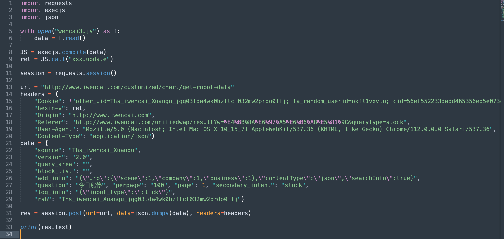

## 10.7、逆向案例之今日头条

https://developer.mozilla.org/zh-CN/docs/Web/API/Window

### 【1】 JS的补充

#### 1. 函数命名

```js
/*add = function add(){
  console.log(add)
}*/

function add(){
  console.log(add)
}

add()

function add(){
  console.log("111")
}
```

#### 2. 继承

在 JavaScript 中，可以使用 `new` 关键字创建对象，也可以使用字面量 `{}` 创建对象。

使用 `new` 关键字创建对象时，首先需要先定义一个构造函数，然后使用 `new` 关键字来调用构造函数，从而创建一个新的对象。例如：

````js
function Person(name, age) {
  this.name = name;
  this.age = age;
}

const person1 = new Person('John', 30);

````

而使用字面量 `{}` 创建对象时，可以直接使用花括号来创建一个新的对象，并且可以在花括号中添加属性和方法。例如：

```js
const person2 = {
  name: 'Jane',
  age: 35
};
```

使用 `new` 关键字创建对象时，还可以使用原型链来实现继承等高级功能，而使用字面量创建的对象则不支持这些高级功能。

### 【2】Proxy代理

```js
var window = {
    username: "yuan",
    age: 22
}
window = new Proxy(window, {
    get(target, p, receiver) {
        console.log("target: ", target);
        console.log("p: ", p);
        // return window['username'];/// 这里如果这样写. 有递归风险的...
        // return Reflect.get(...arguments);
        return Reflect.get(target, p);
    },
    set(target, p, value, receiver) {
        console.log("设置操作")
        Reflect.set(target, p, value);
    }
}); 

console.log(window.username);
console.log(window.age);
window.username = "rain"
window.age = 18
```

### 【3】vm2

vm2是一个Node.js模块，它提供了一种在Node.js中运行沙箱环境的机制。它可以让你在一个安全的环境中运行不受信任的代码，以避免代码对系统的破坏和损害。

vm2基于Node.js的vm模块实现，但是提供了更严格的沙箱环境。它可以限制代码的访问权限，例如限制代码的文件读写、网络访问、系统调用等。同时，vm2还提供了一些额外的安全机制，例如限制代码的CPU和内存使用等，以进一步增强沙箱的安全性。

vm2可以用于一些需要运行不受信任的代码的场景，例如在线代码编辑器、代码评测系统等，它可以帮助你在安全的环境中运行代码，避免代码对系统的破坏和损害。

```js
npm install vm2@3.9.3. // 版本较为纯净
```

注释或删除像global，process等痕迹

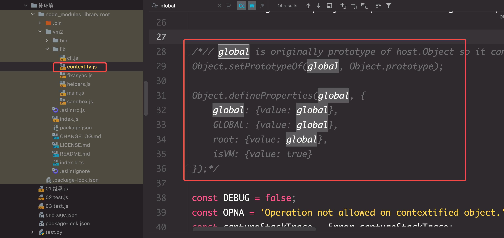

使用vm2:

```js
var vm = require("vm2")

const {VM, VMScript} = vm

var myvm = new VM()

// ret = myvm.run("process")
// console.log(ret)

ret = myvm.run("1+2")
console.log(ret)
```

### 【4】今日头条案例

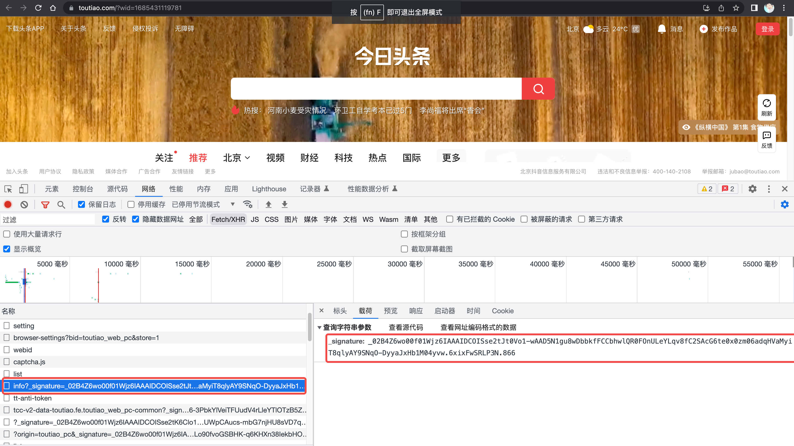


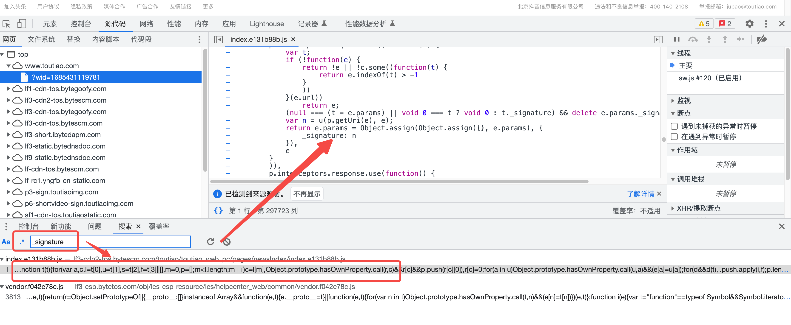

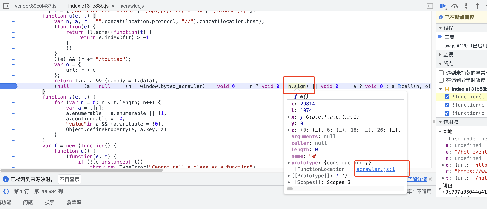

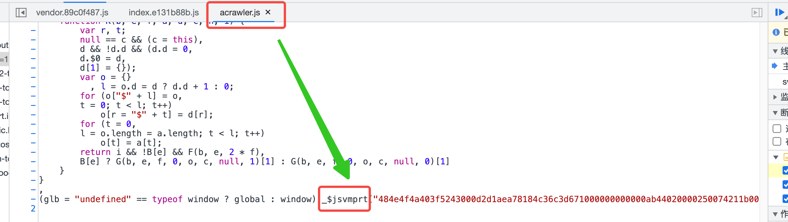

在爬虫领域，VMP通常指“虚拟机保护”（Virtual Machine Protection）。VMP是一种旨在保护软件代码不被逆向工程和恶意修改的技术。它通过使用虚拟机技术，将真正的程序代码转换成虚拟指令，从而使得反汇编和逆向工程变得更加困难。

在爬虫中，VMP通常用于保护爬虫程序的代码，以防止恶意用户分析和修改爬虫程序。这种保护技术可以有效防止黑客和恶意用户利用爬虫程序进行攻击和非法行为。

### 【5】完整代码

#### (1) 今日头条.py

```python
import execjs
import requests

# 有的检测sign. 有的不检测
url = "https://www.toutiao.com/api/pc/list/feed?offset=0&channel_id=94349549395&max_behot_time=0&category=pc_profile_channel&disable_raw_data=true&aid=24&app_name=toutiao_web"

f = open("今日头条.js", mode="r", encoding="utf-8")
js_code = f.read()

js = execjs.compile(js_code)
sign = js.call("fn", url)

print("sign", sign)
params = {
    "_signature": sign
}
# cookie: msToken=foBljwu_lJgAolE3xxrEK-P6oz5Dpk101Rsx1kyz3-vtwKF2CDzongE81glRx6OR-l78WvqusRfBNnZSy6nz_qXiZffmyHX1_n98S0vAWxo=; __ac_signature=_02B4Z6wo00f014kJx9QAAIDDCQs9lKX25UeJKcNAAIZe7c; tt_webid=7211478517695039034; ttcid=0c13fa2fa2f04b66a71cfd3d40bf70e139; local_city_cache=%E5%8C%97%E4%BA%AC; csrftoken=4dcb3da757d011305174056a31c395c4; s_v_web_id=verify_lfcgx7l4_isLbnSez_dPJo_41Tt_8z52_ldqVZh1xhb9O; _ga=GA1.1.1962291559.1679053199; tt_scid=WJ35PCDU.3NmYJ0XW.myIF92VJ5rC9Uxha8g6UH.6lqg.6B9pZkBp-MTza2dcjit5920; ttwid=1%7CdAuWEouKeMG_oWUBvS3z8w8w7PjV7UwEtZ3leV8UMXI%7C1679057393%7Cb074cd6be208cba624fb0541ee7edf9bf1600bcf6cd590718190fc129635b778; _ga_QEHZPBE5HH=GS1.1.1679057391.2.1.1679057623.0.0.0
headers = {
    "referer": "https://www.toutiao.com/?wid=1679053196370",
    "user-agent": "Mozilla/5.0 (Windows NT 10.0; Win64; x64) AppleWebKit/537.36 (KHTML, like Gecko) Chrome/111.0.0.0 Safari/537.36",

}

resp = requests.get(url, params=params, headers=headers)

print(resp.text)

```

#### (2) 今日头条.js

````js
var vm = require("vm2");
var fs = require("fs"); // nodejs内置的读取文件的写法
const {VM, VMScript} = vm; // 解包. 从解包中获取到VM和VMScript

var myvm = new VM();

let js_code = "";

// nodejs读取文件的写法
js_code += fs.readFileSync("./补充环境4.js"); // 先加载我补充的代码
js_code += fs.readFileSync("./源码.js"); // 然后加载需要补环境的代码

function fn(url) {
    js_code += `;o = {url: '${url}'};window.byted_acrawler.sign(o)`
    return myvm.run(js_code);
}

console.log(fn("666"))
````

#### (3) 源码.js

```js
try {
    debugger;
    var glb;
    (glb = "undefined" == typeof window ? global : window)._$jsvmprt = function (b, e, f) {
        function a() {
            if ("undefined" == typeof Reflect || !Reflect.construct) return !1;
            if (Reflect.construct.sham) return !1;
            if ("function" == typeof Proxy) return !0;
            try {
                return Date.prototype.toString.call(Reflect.construct(Date, [], (function () {
                }))), !0
            } catch (b) {
                return !1
            }
        }

        function d(b, e, f) {
            return (d = a() ? Reflect.construct : function (b, e, f) {
                var a = [null];
                a.push.apply(a, e);
                var d = new (Function.bind.apply(b, a));
                return f && c(d, f.prototype), d
            }).apply(null, arguments)
        }

        function c(b, e) {
            return (c = Object.setPrototypeOf || function (b, e) {
                return b.__proto__ = e, b
            })(b, e)
        }

        function n(b) {
            return function (b) {
                if (Array.isArray(b)) {
                    for (var e = 0, f = new Array(b.length); e < b.length; e++) f[e] = b[e];
                    return f
                }
            }(b) || function (b) {
                if (Symbol.iterator in Object(b) || "[object Arguments]" === Object.prototype.toString.call(b)) return Array.from(b)
            }(b) || function () {
                throw new TypeError("Invalid attempt to spread non-iterable instance")
            }()
        }

        for (var i = [], r = 0, t = [], o = 0, l = function (b, e) {
            var f = b[e++], a = b[e], d = parseInt("" + f + a, 16);
            if (d >> 7 == 0) return [1, d];
            if (d >> 6 == 2) {
                var c = parseInt("" + b[++e] + b[++e], 16);
                return d &= 63, [2, c = (d <<= 8) + c]
            }
            if (d >> 6 == 3) {
                var n = parseInt("" + b[++e] + b[++e], 16), i = parseInt("" + b[++e] + b[++e], 16);
                return d &= 63, [3, i = (d <<= 16) + (n <<= 8) + i]
            }
        }, u = function (b, e) {
            var f = parseInt("" + b[e] + b[e + 1], 16);
            return f = f > 127 ? -256 + f : f
        }, s = function (b, e) {
            var f = parseInt("" + b[e] + b[e + 1] + b[e + 2] + b[e + 3], 16);
            return f = f > 32767 ? -65536 + f : f
        }, p = function (b, e) {
            var f = parseInt("" + b[e] + b[e + 1] + b[e + 2] + b[e + 3] + b[e + 4] + b[e + 5] + b[e + 6] + b[e + 7], 16);
            return f = f > 2147483647 ? 0 + f : f
        }, y = function (b, e) {
            return parseInt("" + b[e] + b[e + 1], 16)
        }, v = function (b, e) {
            return parseInt("" + b[e] + b[e + 1] + b[e + 2] + b[e + 3], 16)
        }, g = g || this || window, h = Object.keys || function (b) {
            var e = {}, f = 0;
            for (var a in b) e[f++] = a;
            return e.length = f, e
        }, m = (b.length, 0), I = "", C = m; C < m + 16; C++) {
            var q = "" + b[C++] + b[C];
            q = parseInt(q, 16), I += String.fromCharCode(q)
        }
        if ("HNOJ@?RC" != I) throw new Error("error magic number " + I);
        m += 16;
        parseInt("" + b[m] + b[m + 1], 16);
        m += 8, r = 0;
        for (var w = 0; w < 4; w++) {
            var S = m + 2 * w, R = "" + b[S++] + b[S], x = parseInt(R, 16);
            r += (3 & x) << 2 * w
        }
        m += 16, m += 8;
        var z = parseInt("" + b[m] + b[m + 1] + b[m + 2] + b[m + 3] + b[m + 4] + b[m + 5] + b[m + 6] + b[m + 7], 16),
            O = z, E = m += 8, j = v(b, m += z);
        j[1];
        m += 4, i = {p: [], q: []};
        for (var A = 0; A < j; A++) {
            for (var D = l(b, m), T = m += 2 * D[0], $ = i.p.length, P = 0; P < D[1]; P++) {
                var U = l(b, T);
                i.p.push(U[1]), T += 2 * U[0]
            }
            m = T, i.q.push([$, i.p.length])
        }
        var _ = {5: 1, 6: 1, 70: 1, 22: 1, 23: 1, 37: 1, 73: 1}, k = {72: 1}, M = {74: 1},
            H = {11: 1, 12: 1, 24: 1, 26: 1, 27: 1, 31: 1}, J = {10: 1}, N = {2: 1, 29: 1, 30: 1, 20: 1}, B = [],
            W = [];

        function F(b, e, f) {
            for (var a = e; a < e + f;) {
                var d = y(b, a);
                B[a] = d, a += 2;
                k[d] ? (W[a] = u(b, a), a += 2) : _[d] ? (W[a] = s(b, a), a += 4) : M[d] ? (W[a] = p(b, a), a += 8) : H[d] ? (W[a] = y(b, a), a += 2) : J[d] ? (W[a] = v(b, a), a += 4) : N[d] && (W[a] = v(b, a), a += 4)
            }
        }

        return K(b, E, O / 2, [], e, f);

        function G(b, e, f, a, c, l, m, I) {
            null == l && (l = this);
            var C, q, w, S = [], R = 0;
            m && (C = m);
            var x, z, O = e, E = O + 2 * f;
            if (!I) for (; O < E;) {
                var j = parseInt("" + b[O] + b[O + 1], 16);
                O += 2;
                var A = 3 & (x = 13 * j % 241);
                if (x >>= 2, A < 1) {
                    A = 3 & x;
                    if (x >>= 2, A > 2) (A = x) > 10 ? S[++R] = void 0 : A > 1 ? (C = S[R--], S[R] = S[R] >= C) : A > -1 && (S[++R] = null); else if (A > 1) {
                        if ((A = x) > 11) throw S[R--];
                        if (A > 7) {
                            for (C = S[R--], z = v(b, O), A = "", P = i.q[z][0]; P < i.q[z][1]; P++) A += String.fromCharCode(r ^ i.p[P]);
                            O += 4, S[R--][A] = C
                        } else A > 5 && (S[R] = h(S[R]))
                    } else if (A > 0) {
                        (A = x) > 8 ? (C = S[R--], S[R] = typeof C) : A > 6 ? S[R] = --S[R] : A > 4 ? S[R -= 1] = S[R][S[R + 1]] : A > 2 && (q = S[R--], (A = S[R]).x === G ? A.y >= 1 ? S[R] = K(b, A.c, A.l, [q], A.z, w, null, 1) : (S[R] = K(b, A.c, A.l, [q], A.z, w, null, 0), A.y++) : S[R] = A(q))
                    } else {
                        if ((A = x) > 14) z = s(b, O), (U = function e() {
                            var f = arguments;
                            return e.y > 0 ? K(b, e.c, e.l, f, e.z, this, null, 0) : (e.y++, K(b, e.c, e.l, f, e.z, this, null, 0))
                        }).c = O + 4, U.l = z - 2, U.x = G, U.y = 0, U.z = c, S[R] = U, O += 2 * z - 2; else if (A > 12) q = S[R--], w = S[R--], (A = S[R--]).x === G ? A.y >= 1 ? S[++R] = K(b, A.c, A.l, q, A.z, w, null, 1) : (S[++R] = K(b, A.c, A.l, q, A.z, w, null, 0), A.y++) : S[++R] = A.apply(w, q); else if (A > 5) C = S[R--], S[R] = S[R] != C; else if (A > 3) C = S[R--], S[R] = S[R] * C; else if (A > -1) return [1, S[R--]]
                    }
                } else if (A < 2) {
                    A = 3 & x;
                    if (x >>= 2, A < 1) {
                        if ((A = x) > 9) ; else if (A > 7) C = S[R--], S[R] = S[R] & C; else if (A > 5) z = y(b, O), O += 2, S[R -= z] = 0 === z ? new S[R] : d(S[R], n(S.slice(R + 1, R + z + 1))); else if (A > 3) {
                            z = s(b, O);
                            try {
                                if (t[o][2] = 1, 1 == (C = G(b, O + 4, z - 3, [], c, l, null, 0))[0]) return C
                            } catch (m) {
                                if (t[o] && t[o][1] && 1 == (C = G(b, t[o][1][0], t[o][1][1], [], c, l, m, 0))[0]) return C
                            } finally {
                                if (t[o] && t[o][0] && 1 == (C = G(b, t[o][0][0], t[o][0][1], [], c, l, null, 0))[0]) return C;
                                t[o] = 0, o--
                            }
                            O += 2 * z - 2
                        }
                    } else if (A < 2) {
                        if ((A = x) > 12) S[++R] = u(b, O), O += 2; else if (A > 10) C = S[R--], S[R] = S[R] << C; else if (A > 8) {
                            for (z = v(b, O), A = "", P = i.q[z][0]; P < i.q[z][1]; P++) A += String.fromCharCode(r ^ i.p[P]);
                            O += 4, S[R] = S[R][A]
                        } else A > 6 && (q = S[R--], C = delete S[R--][q])
                    } else if (A < 3) {
                        (A = x) < 2 ? S[++R] = C : A < 4 ? (C = S[R--], S[R] = S[R] <= C) : A < 11 ? (C = S[R -= 2][S[R + 1]] = S[R + 2], R--) : A < 13 && (C = S[R], S[++R] = C)
                    } else {
                        if ((A = x) > 12) S[++R] = l; else if (A > 5) C = S[R--], S[R] = S[R] !== C; else if (A > 3) C = S[R--], S[R] = S[R] / C; else if (A > 1) {
                            if ((z = s(b, O)) < 0) {
                                I = 1, F(b, e, 2 * f), O += 2 * z - 2;
                                break
                            }
                            O += 2 * z - 2
                        } else A > -1 && (S[R] = !S[R])
                    }
                } else if (A < 3) {
                    A = 3 & x;
                    if (x >>= 2, A > 2) (A = x) > 7 ? (C = S[R--], S[R] = S[R] | C) : A > 5 ? (z = y(b, O), O += 2, S[++R] = c["$" + z]) : A > 3 && (z = s(b, O), t[o][0] && !t[o][2] ? t[o][1] = [O + 4, z - 3] : t[o++] = [0, [O + 4, z - 3], 0], O += 2 * z - 2); else if (A > 1) {
                        if ((A = x) < 2) {
                            for (z = v(b, O), C = "", P = i.q[z][0]; P < i.q[z][1]; P++) C += String.fromCharCode(r ^ i.p[P]);
                            S[++R] = C, O += 4
                        } else if (A < 4) if (S[R--]) O += 4; else {
                            if ((z = s(b, O)) < 0) {
                                I = 1, F(b, e, 2 * f), O += 2 * z - 2;
                                break
                            }
                            O += 2 * z - 2
                        } else A < 6 ? (C = S[R--], S[R] = S[R] % C) : A < 8 ? (C = S[R--], S[R] = S[R] instanceof C) : A < 15 && (S[++R] = !1)
                    } else if (A > 0) {
                        (A = x) < 1 ? S[++R] = g : A < 3 ? (C = S[R--], S[R] = S[R] + C) : A < 5 ? (C = S[R--], S[R] = S[R] == C) : A < 14 && (C = S[R - 1], q = S[R], S[++R] = C, S[++R] = q)
                    } else {
                        (A = x) < 2 ? (C = S[R--], S[R] = S[R] > C) : A < 9 ? (z = v(b, O), O += 4, q = R + 1, S[R -= z - 1] = z ? S.slice(R, q) : []) : A < 11 ? (z = y(b, O), O += 2, C = S[R--], c[z] = C) : A < 13 ? (C = S[R--], S[R] = S[R] >> C) : A < 15 && (S[++R] = s(b, O), O += 4)
                    }
                } else {
                    A = 3 & x;
                    if (x >>= 2, A > 2) (A = x) > 13 ? (S[++R] = p(b, O), O += 8) : A > 11 ? (C = S[R--], S[R] = S[R] >>> C) : A > 9 ? S[++R] = !0 : A > 7 ? (z = y(b, O), O += 2, S[R] = S[R][z]) : A > 0 && (C = S[R--], S[R] = S[R] < C); else if (A > 1) {
                        (A = x) > 10 ? (z = s(b, O), t[++o] = [[O + 4, z - 3], 0, 0], O += 2 * z - 2) : A > 8 ? (C = S[R--], S[R] = S[R] ^ C) : A > 6 && (C = S[R--])
                    } else if (A > 0) {
                        if ((A = x) < 3) {
                            var D = 0, T = S[R].length, $ = S[R];
                            S[++R] = function () {
                                var b = D < T;
                                if (b) {
                                    var e = $[D++];
                                    S[++R] = e
                                }
                                S[++R] = b
                            }
                        } else A < 5 ? (z = y(b, O), O += 2, C = c[z], S[++R] = C) : A < 7 ? S[R] = ++S[R] : A < 9 && (C = S[R--], S[R] = S[R] in C)
                    } else {
                        if ((A = x) > 13) C = S[R], S[R] = S[R - 1], S[R - 1] = C; else if (A > 4) C = S[R--], S[R] = S[R] === C; else if (A > 2) C = S[R--], S[R] = S[R] - C; else if (A > 0) {
                            for (z = v(b, O), A = "", P = i.q[z][0]; P < i.q[z][1]; P++) A += String.fromCharCode(r ^ i.p[P]);
                            A = +A, O += 4, S[++R] = A
                        }
                    }
                }
            }
            if (I) for (; O < E;) {
                j = B[O];
                O += 2;
                A = 3 & (x = 13 * j % 241);
                if (x >>= 2, A < 1) {
                    var U;
                    A = 3 & x;
                    if (x >>= 2, A < 1) {
                        if ((A = x) > 14) z = W[O], (U = function e() {
                            var f = arguments;
                            return e.y > 0 ? K(b, e.c, e.l, f, e.z, this, null, 0) : (e.y++, K(b, e.c, e.l, f, e.z, this, null, 0))
                        }).c = O + 4, U.l = z - 2, U.x = G, U.y = 0, U.z = c, S[R] = U, O += 2 * z - 2; else if (A > 12) q = S[R--], w = S[R--], (A = S[R--]).x === G ? A.y >= 1 ? S[++R] = K(b, A.c, A.l, q, A.z, w, null, 1) : (S[++R] = K(b, A.c, A.l, q, A.z, w, null, 0), A.y++) : S[++R] = A.apply(w, q); else if (A > 5) C = S[R--], S[R] = S[R] != C; else if (A > 3) C = S[R--], S[R] = S[R] * C; else if (A > -1) return [1, S[R--]]
                    } else if (A < 2) {
                        (A = x) < 4 ? (q = S[R--], (A = S[R]).x === G ? A.y >= 1 ? S[R] = K(b, A.c, A.l, [q], A.z, w, null, 1) : (S[R] = K(b, A.c, A.l, [q], A.z, w, null, 0), A.y++) : S[R] = A(q)) : A < 6 ? S[R -= 1] = S[R][S[R + 1]] : A < 8 ? S[R] = --S[R] : A < 10 && (C = S[R--], S[R] = typeof C)
                    } else if (A < 3) {
                        if ((A = x) > 11) throw S[R--];
                        if (A > 7) {
                            for (C = S[R--], z = W[O], A = "", P = i.q[z][0]; P < i.q[z][1]; P++) A += String.fromCharCode(r ^ i.p[P]);
                            O += 4, S[R--][A] = C
                        } else A > 5 && (S[R] = h(S[R]))
                    } else {
                        (A = x) < 1 ? S[++R] = null : A < 3 ? (C = S[R--], S[R] = S[R] >= C) : A < 12 && (S[++R] = void 0)
                    }
                } else if (A < 2) {
                    A = 3 & x;
                    if (x >>= 2, A > 2) (A = x) > 12 ? S[++R] = l : A > 5 ? (C = S[R--], S[R] = S[R] !== C) : A > 3 ? (C = S[R--], S[R] = S[R] / C) : A > 1 ? O += 2 * (z = W[O]) - 2 : A > -1 && (S[R] = !S[R]); else if (A > 1) {
                        (A = x) < 2 ? S[++R] = C : A < 4 ? (C = S[R--], S[R] = S[R] <= C) : A < 11 ? (C = S[R -= 2][S[R + 1]] = S[R + 2], R--) : A < 13 && (C = S[R], S[++R] = C)
                    } else if (A > 0) {
                        if ((A = x) < 8) q = S[R--], C = delete S[R--][q]; else if (A < 10) {
                            for (z = W[O], A = "", P = i.q[z][0]; P < i.q[z][1]; P++) A += String.fromCharCode(r ^ i.p[P]);
                            O += 4, S[R] = S[R][A]
                        } else A < 12 ? (C = S[R--], S[R] = S[R] << C) : A < 14 && (S[++R] = W[O], O += 2)
                    } else {
                        if ((A = x) < 5) {
                            z = W[O];
                            try {
                                if (t[o][2] = 1, 1 == (C = G(b, O + 4, z - 3, [], c, l, null, 0))[0]) return C
                            } catch (m) {
                                if (t[o] && t[o][1] && 1 == (C = G(b, t[o][1][0], t[o][1][1], [], c, l, m, 0))[0]) return C
                            } finally {
                                if (t[o] && t[o][0] && 1 == (C = G(b, t[o][0][0], t[o][0][1], [], c, l, null, 0))[0]) return C;
                                t[o] = 0, o--
                            }
                            O += 2 * z - 2
                        } else A < 7 ? (z = W[O], O += 2, S[R -= z] = 0 === z ? new S[R] : d(S[R], n(S.slice(R + 1, R + z + 1)))) : A < 9 && (C = S[R--], S[R] = S[R] & C)
                    }
                } else if (A < 3) {
                    A = 3 & x;
                    if (x >>= 2, A < 1) (A = x) < 2 ? (C = S[R--], S[R] = S[R] > C) : A < 9 ? (z = W[O], O += 4, q = R + 1, S[R -= z - 1] = z ? S.slice(R, q) : []) : A < 11 ? (z = W[O], O += 2, C = S[R--], c[z] = C) : A < 13 ? (C = S[R--], S[R] = S[R] >> C) : A < 15 && (S[++R] = W[O], O += 4); else if (A < 2) {
                        (A = x) < 1 ? S[++R] = g : A < 3 ? (C = S[R--], S[R] = S[R] + C) : A < 5 ? (C = S[R--], S[R] = S[R] == C) : A < 14 && (C = S[R - 1], q = S[R], S[++R] = C, S[++R] = q)
                    } else if (A < 3) {
                        if ((A = x) < 2) {
                            for (z = W[O], C = "", P = i.q[z][0]; P < i.q[z][1]; P++) C += String.fromCharCode(r ^ i.p[P]);
                            S[++R] = C, O += 4
                        } else A < 4 ? S[R--] ? O += 4 : O += 2 * (z = W[O]) - 2 : A < 6 ? (C = S[R--], S[R] = S[R] % C) : A < 8 ? (C = S[R--], S[R] = S[R] instanceof C) : A < 15 && (S[++R] = !1)
                    } else {
                        (A = x) > 7 ? (C = S[R--], S[R] = S[R] | C) : A > 5 ? (z = W[O], O += 2, S[++R] = c["$" + z]) : A > 3 && (z = W[O], t[o][0] && !t[o][2] ? t[o][1] = [O + 4, z - 3] : t[o++] = [0, [O + 4, z - 3], 0], O += 2 * z - 2)
                    }
                } else {
                    A = 3 & x;
                    if (x >>= 2, A > 2) (A = x) > 13 ? (S[++R] = W[O], O += 8) : A > 11 ? (C = S[R--], S[R] = S[R] >>> C) : A > 9 ? S[++R] = !0 : A > 7 ? (z = W[O], O += 2, S[R] = S[R][z]) : A > 0 && (C = S[R--], S[R] = S[R] < C); else if (A > 1) {
                        (A = x) > 10 ? (z = W[O], t[++o] = [[O + 4, z - 3], 0, 0], O += 2 * z - 2) : A > 8 ? (C = S[R--], S[R] = S[R] ^ C) : A > 6 && (C = S[R--])
                    } else if (A > 0) {
                        if ((A = x) > 7) C = S[R--], S[R] = S[R] in C; else if (A > 5) S[R] = ++S[R]; else if (A > 3) z = W[O], O += 2, C = c[z], S[++R] = C; else if (A > 1) {
                            D = 0, T = S[R].length, $ = S[R];
                            S[++R] = function () {
                                var b = D < T;
                                if (b) {
                                    var e = $[D++];
                                    S[++R] = e
                                }
                                S[++R] = b
                            }
                        }
                    } else {
                        if ((A = x) < 2) {
                            for (z = W[O], A = "", P = i.q[z][0]; P < i.q[z][1]; P++) A += String.fromCharCode(r ^ i.p[P]);
                            A = +A, O += 4, S[++R] = A
                        } else A < 4 ? (C = S[R--], S[R] = S[R] - C) : A < 6 ? (C = S[R--], S[R] = S[R] === C) : A < 15 && (C = S[R], S[R] = S[R - 1], S[R - 1] = C)
                    }
                }
            }
            return [0, null]
        }

        function K(b, e, f, a, d, c, n, i) {
            var r, t;
            null == c && (c = this), d && !d.d && (d.d = 0, d.$0 = d, d[1] = {});
            var o = {}, l = o.d = d ? d.d + 1 : 0;
            for (o["$" + l] = o, t = 0; t < l; t++) o[r = "$" + t] = d[r];
            for (t = 0, l = o.length = a.length; t < l; t++) o[t] = a[t];
            return i && !B[e] && F(b, e, 2 * f), B[e] ? G(b, e, f, 0, o, c, null, 1)[1] : G(b, e, f, 0, o, c, null, 0)[1]
        }
    }, (glb = "undefined" == typeof window ? global : window)._$jsvmprt("", [, , "undefined" != typeof exports ? exports : void 0, "undefined" != typeof module ? module : void 0, "undefined" != typeof define ? define : void 0, "undefined" != typeof Object ? Object : void 0, void 0, "undefined" != typeof TypeError ? TypeError : void 0, "undefined" != typeof document ? document : void 0, "undefined" != typeof InstallTrigger ? InstallTrigger : void 0, "undefined" != typeof safari ? safari : void 0, "undefined" != typeof Date ? Date : void 0, "undefined" != typeof Math ? Math : void 0, "undefined" != typeof navigator ? navigator : void 0, "undefined" != typeof location ? location : void 0, "undefined" != typeof history ? history : void 0, "undefined" != typeof Image ? Image : void 0, "undefined" != typeof console ? console : void 0, "undefined" != typeof PluginArray ? PluginArray : void 0, "undefined" != typeof indexedDB ? indexedDB : void 0, "undefined" != typeof DOMException ? DOMException : void 0, "undefined" != typeof parseInt ? parseInt : void 0, "undefined" != typeof String ? String : void 0, "undefined" != typeof Array ? Array : void 0, "undefined" != typeof Error ? Error : void 0, "undefined" != typeof JSON ? JSON : void 0, "undefined" != typeof Promise ? Promise : void 0, "undefined" != typeof WebSocket ? WebSocket : void 0, "undefined" != typeof eval ? eval : void 0, "undefined" != typeof setTimeout ? setTimeout : void 0, "undefined" != typeof encodeURIComponent ? encodeURIComponent : void 0, "undefined" != typeof encodeURI ? encodeURI : void 0, "undefined" != typeof Request ? Request : void 0, "undefined" != typeof Headers ? Headers : void 0, "undefined" != typeof decodeURIComponent ? decodeURIComponent : void 0, "undefined" != typeof RegExp ? RegExp : void 0]);
    debugger;

    // 我们用的是vm2. vm2的返回. 就在末尾.直接写出你要返回的东西即可
    // var o = {url: 'https://www.toutiao.com/toutiao/api/pc/info'};

    // window.init();
    // 暂时先把可用的cookie直接怼进来...7
    document.cookie = "msToken=foBljwu_lJgAolE3xxrEK-P6oz5Dpk101Rsx1kyz3-vtwKF2CDzongE81glRx6OR-l78WvqusRfBNnZSy6nz_qXiZffmyHX1_n98S0vAWxo=; __ac_signature=_02B4Z6wo00f014kJx9QAAIDDCQs9lKX25UeJKcNAAIZe7c; ttcid=0c13fa2fa2f04b66a71cfd3d40bf70e139; local_city_cache=%E5%8C%97%E4%BA%AC; csrftoken=4dcb3da757d011305174056a31c395c4; s_v_web_id=verify_lfcgx7l4_isLbnSez_dPJo_41Tt_8z52_ldqVZh1xhb9O; _ga=GA1.1.1962291559.1679053199; tt_scid=WJ35PCDU.3NmYJ0XW.myIF92VJ5rC9Uxha8g6UH.6lqg.6B9pZkBp-MTza2dcjit5920; _ga_QEHZPBE5HH=GS1.1.1679057391.2.1.1679057623.0.0.0"
    // window.byted_acrawler.sign(o);

} catch (e) {
    console.log(e);
    debugger;
}
debugger;

```

#### (4) 补充环境.js

```js
function my_proxy(obj) {
    return new Proxy(obj, {
        get(target, p, receiver) {
            let val = Reflect.get(...arguments);
            console.log("get操作", target, ":::获取属性>", p, ":::值>", val);
            return val;
        },
        set(target, p, value, receiver) {
            console.log("set操作", target, ":::设置属性>", p, ":::值>", value);
            return Reflect.set(...arguments);
        }
    });
}

// ================window==============//
window = this; // 当前对象/当前作用域..

Window = function Window() {
};
// 给window设置原型
// window.__proto__ = Window.prototype;
Object.setPrototypeOf(window, Window.prototype);
// ================ 补document===================//
document = {
    referrer: 'https://www.toutiao.com/?wid=1678689641771'
}

Document = function Document() {}

Object.setPrototypeOf(document, Document.prototype);


// ================ 补Location===================//

location = {
    href: 'https://www.toutiao.com/?wid=1679053196370',
    protocol: 'https:',
};
Location = function Location() {
}

Object.setPrototypeOf(location, Location.prototype);

//====================设置Navigator===============//
navigator = {
    userAgent: "Mozilla/5.0 (Windows NT 10.0; Win64; x64) AppleWebKit/537.36 (KHTML, like Gecko) Chrome/111.0.0.0 Safari/537.36"

}
Navigator = function Navigator() {
}
Object.setPrototypeOf(navigator, Navigator.prototype);

```

## 10.8、逆向案例之拼多多

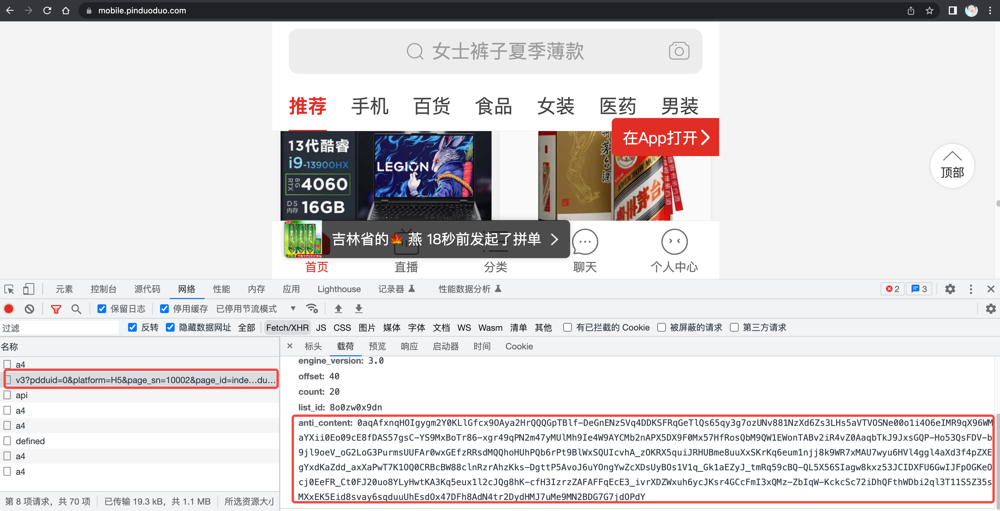

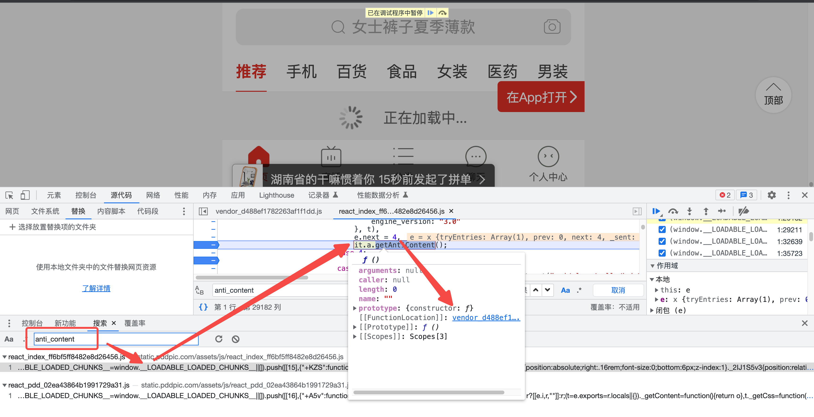

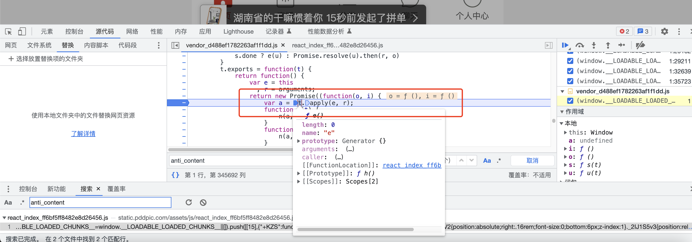

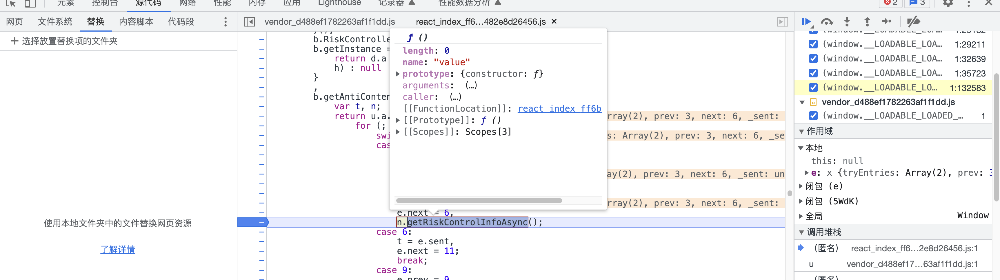

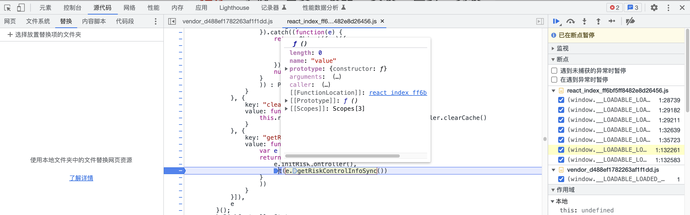

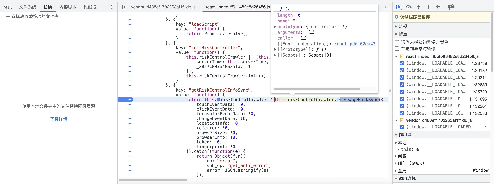

`pinduoduo.js`

```js
var vm = require("vm2")
var fs = require("fs")

const {VM, VMScript} = vm
var myvm = new VM()

code = ""
// 一、补环境
BuCode = fs.readFileSync("./补环境.js")

code += BuCode
code += ";;;\n"
// 二、源码JS
YuanCode = fs.readFileSync("./源码.js")
// console.log(YuanCode.toString())
code += YuanCode
code += ";;;\n"
// console.log(code)

// 三、生成anti_content

function fn() {
    ret = myvm.run(code)

    return ret
}

console.log("结果：",fn())

```

补环境：

```js
// proxy代理声明
function proxy_watch(obj) {

    return new Proxy(obj, {
        get(target, p, receiver) {
            debugger;
            let val = Reflect.get(...arguments);
            console.log("get", target, "=获取属性>", p, "=值>", val);
            return val;
        },
        set(target, p, value, receiver) {
            debugger;
            console.log("set", target, "=设置属性>", p, "=值>", value);
            return Reflect.set(...arguments);
        }
    });
};
// 一、补充window环境
window = {}

window = this

Window = function Window() {

}

Object.setPrototypeOf(window, Window.prototype)

Window.prototype.setTimeout = function setTimeout(){

}

//二、补充 document
document = {
    referrer: ''
}

Document = function Document() {

}
Object.setPrototypeOf(document, Document.prototype)


Document.prototype.addEventListener = function () {

}

//三、补充 location
location = {
    href: 'https://mobile.pinduoduo.com/',
    protocol: 'https:',
}

Location = function Location() {

}

Object.setPrototypeOf(location, Location.prototype)

// 四、补充 navigator
navigator = {
    userAgent: 'Mozilla/5.0 (Macintosh; Intel Mac OS X 10_15_7) AppleWebKit/537.36 (KHTML, like Gecko) Chrome/113.0.0.0 Safari/537.36'
}

Navigator = function Navigator() {

}
Object.setPrototypeOf(navigator, Navigator.prototype)

Navigator.prototype.hasOwnProperty = function () {
    return true
}

// 五、补充 screen
screen = {
    // width: 1728,
}

Screen = function Screen() {

}
Object.setPrototypeOf(screen, Screen.prototype)


// 六、补充 history对象
history = {}
History = function History() {

}
Object.setPrototypeOf(history, History.prototype)
History.prototype.back = function () {

}


// 代理对象设置
window = proxy_watch(window)
document = proxy_watch(document)
location = proxy_watch(location)
navigator = proxy_watch(navigator)
```


