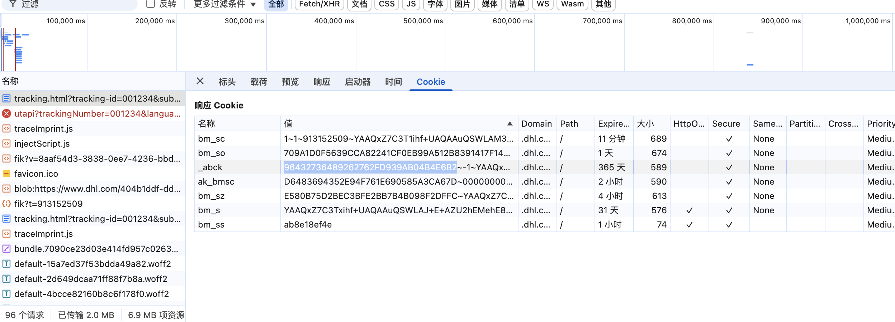
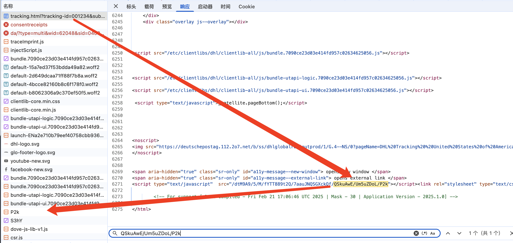
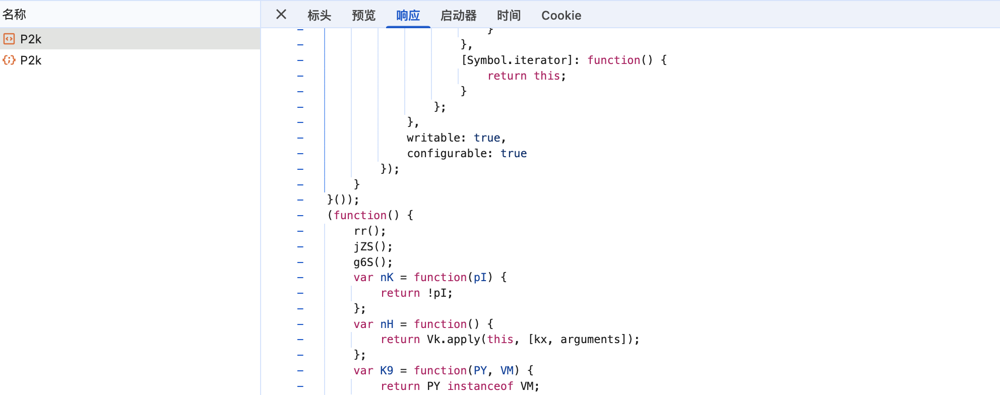
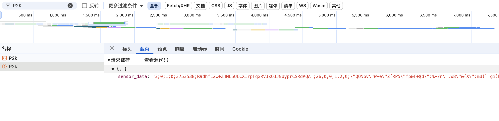
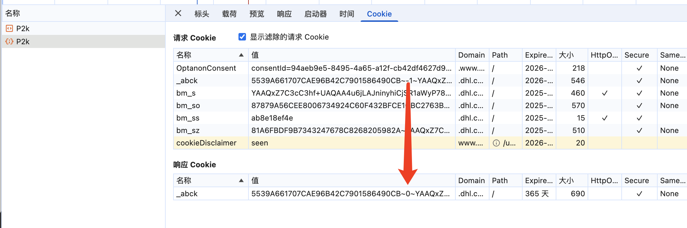
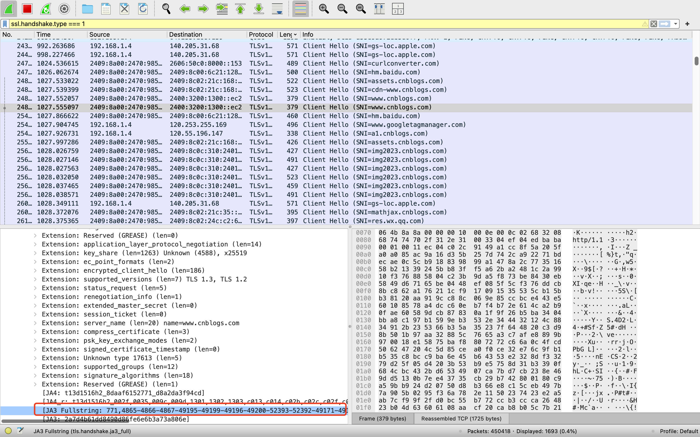

# 了解akamai的执行过程

## 1.简介：

Akamai是一家提供内容传递网络（CDN）和云服务的公司。CDN通过将内容分发到全球各地的服务器，以减少网络延迟并提高用户访问网站的速度和性能。在其服务中，Akamai使用一种称为Akamai Cookie加密的技术来增强安全性和保护用户的隐私。


目前大部分网站都是Akamai3.0 很少再看到Akamai2.0了

## 2.执行流程

Akamai也是对cookie进加密处理的过程,但是和瑞数有区别,Akamai请求过程:

先有一个请求html 可以拿到一些cookie



同时地址会返回一个外链js文件



对外链地址发送get请求,获取到对应的js代码




在对当前外链js地址发送post请求,带上参数`sensor_data`

带上参数请求之后,会响应一个正确的`_abck`





逆向参数时需要注意Akamai,每周会有一小改,一个月会大改一次

最重要的就是第二次的post请求,逆向的参数是`sensor_data`


# akamai解析思路

目标地址：https://www.dhl.com/us-en/home/tracking.html?tracking-id=001234&submit=1&inputsource=marketingstage

参数 sensor_data

采用AST 稍微解一下混淆

提取需要解混淆的参数

```python
import json
import re

with open("xxx.js", "r") as f:
    js = f.read()


main_func_list = ["WK","lA","P8","DU","pOq","RS","xh"]
call_list = []

for func_name in main_func_list:
    res = re.findall(rf"{func_name}\(\)\[..\((?:..|...)\)]", js)
    call_list += res


with open("call_list.json", "w") as f:
    f.write(json.dumps(list(set(call_list)), indent=4))
```

赋值到网页 提取所需要的解混淆后字符串

```js
func_list = [
    "xh()[N8(U1)]",
    "lA()[AS(CH)]",
    "lA()[AS(j8)]",
    "P8()[N9(qW)]",
    "RS()[W3(fK)]",
    "P8()[N9(vU)]",
    "P8()[N9(KW)]",
    "lA()[AS(H1)]",
    "DU()[gY(nY)]",
    "RS()[W3(Cs)]",
    "P8()[N9(Jw)]",
    "P8()[N9(v6)]",
    "lA()[AS(NK)]",
    "RS()[W3(cT)]",
    "xh()[N8(S5)]",
    "P8()[N9(Kvq)]",
    "RS()[W3(I1)]",
    "P8()[N9(NY)]",
    "RS()[W3(QK)]",
    "P8()[N9(j4)]",
    "RS()[W3(DW)]",
    "lA()[AS(RM)]",
    "lA()[AS(gW)]",
    "P8()[N9(Pt)]",
    "P8()[N9(tQq)]",
    "RS()[W3(Sw)]",
    "RS()[W3(YU)]",
    "lA()[AS(O9)]",
    "P8()[N9(E1)]",
    "RS()[W3(Rf)]",
    "P8()[N9(Akq)]",
    "RS()[W3(vD)]",
    "xh()[N8(tt)]",
    "P8()[N9(DW)]",
    "P8()[N9(Acq)]",
    "xh()[N8(b3)]",
    "P8()[N9(rg)]",
    "P8()[N9(bm)]",
    "P8()[N9(BD)]",
    "lA()[AS(qw)]",
    "RS()[W3(x7)]",
    "lA()[AS(rS)]",
    "lA()[AS(FW)]",
    "P8()[N9(z8)]",
    "RS()[W3(b3)]",
    "P8()[N9(PX)]",
    "lA()[AS(GT)]",
    "RS()[W3(mE)]",
    "xh()[N8(C3)]",
    "xh()[N8(W9)]",
    "lA()[AS(CS)]",
    "P8()[N9(m8)]",
    "P8()[N9(jn)]",
    "P8()[N9(hx)]",
    "RS()[W3(VX)]",
    "DU()[gY(Z8)]",
    "lA()[AS(s4)]",
    "P8()[N9(A3)]",
    "P8()[N9(bp)]",
    "P8()[N9(N3)]",
    "RS()[W3(DD)]",
    "xh()[N8(qw)]",
    "P8()[N9(Orq)]",
    "lA()[AS(cp)]",
    "P8()[N9(nF)]",
    "lA()[AS(dj)]",
    "lA()[AS(Y4)]",
    "DU()[gY(SF)]",
    "P8()[N9(nj)]",
    "P8()[N9(jT)]",
    "lA()[AS(qD)]",
    "P8()[N9(RM)]",
    "P8()[N9(fm)]",
    "P8()[N9(Mkq)]",
    "RS()[W3(QQq)]",
    "xh()[N8(hT)]",
    "RS()[W3(H1)]",
    "RS()[W3(CT)]",
    "P8()[N9(kOq)]",
    "P8()[N9(MS)]",
    "RS()[W3(rg)]",
    "P8()[N9(gZ)]",
    "RS()[W3(UN)]",
    "P8()[N9(dj)]",
    "RS()[W3(R3)]",
    "lA()[AS(bX)]",
    "lA()[AS(T8)]",
    "lA()[AS(bm)]",
    "P8()[N9(VK)]",
    "lA()[AS(gh)]",
    "xh()[N8(MT)]",
    "RS()[W3(SH)]",
    "P8()[N9(Cs)]",
    "P8()[N9(HH)]",
    "xh()[N8(QK)]",
    "P8()[N9(R1)]",
    "xh()[N8(qS)]",
    "lA()[AS(hx)]",
    "lA()[AS(P4)]",
    "DU()[gY(Xt)]",
    "RS()[W3(k1)]",
    "RS()[W3(Ls)]",
    "RS()[W3(XT)]",
    "lA()[AS(Qs)]",
    "P8()[N9(s4)]",
    "xh()[N8(Bt)]",
    "lA()[AS(JU)]",
    "P8()[N9(Rf)]",
    "P8()[N9(nz)]",
    "P8()[N9(OF)]",
    "xh()[N8(NE)]",
    "lA()[AS(I4)]",
    "P8()[N9(Ybq)]",
    "xh()[N8(D4)]",
    "P8()[N9(rn)]",
    "RS()[W3(nZ)]",
    "xh()[N8(WT)]",
    "lA()[AS(dz)]",
    "lA()[AS(qh)]",
    "DU()[gY(gS)]",
    "xh()[N8(m1)]",
    "DU()[gY(qh)]",
    "RS()[W3(jT)]",
    "lA()[AS(IE)]",
    "P8()[N9(xt)]",
    "RS()[W3(Y1)]",
    "RS()[W3(M6)]",
    "lA()[AS(UQq)]",
    "P8()[N9(Tz)]",
    "DU()[gY(d4)]",
    "P8()[N9(T5)]",
    "RS()[W3(qD)]",
    "lA()[AS(A3)]",
    "RS()[W3(qS)]",
    "P8()[N9(bX)]",
    "RS()[W3(tt)]",
    "P8()[N9(m1)]",
    "RS()[W3(C3)]",
    "lA()[AS(MS)]",
    "lA()[AS(W9)]",
    "P8()[N9(qS)]",
    "RS()[W3(FS)]",
    "RS()[W3(Px)]",
    "P8()[N9(c8)]",
    "RS()[W3(gh)]",
    "RS()[W3(xt)]",
    "P8()[N9(qh)]",
    "lA()[AS(I6)]",
    "P8()[N9(fE)]",
    "P8()[N9(C3)]",
    "DU()[gY(g5)]",
    "P8()[N9(UT)]",
    "P8()[N9(v9)]",
    "P8()[N9(Xt)]",
    "P8()[N9(x0)]",
    "RS()[W3(cp)]",
    "lA()[AS(k1)]",
    "lA()[AS(SD)]",
    "P8()[N9(mA)]",
    "lA()[AS(Xt)]",
    "P8()[N9(sZ)]",
    "RS()[W3(VT)]",
    "lA()[AS(WE)]",
    "P8()[N9(QQq)]",
    "lA()[AS(cZ)]",
    "P8()[N9(mf)]",
    "P8()[N9(kf)]",
    "lA()[AS(w4)]",
    "P8()[N9(wLq)]",
    "RS()[W3(F5)]",
    "P8()[N9(CX)]",
    "RS()[W3(bM)]",
    "P8()[N9(hT)]",
    "P8()[N9(bU)]",
    "P8()[N9(WT)]",
    "P8()[N9(YRq)]",
    "DU()[gY(XC)]",
    "DU()[gY(A8)]",
    "RS()[W3(rA)]",
    "RS()[W3(N3)]",
    "lA()[AS(A8)]",
    "RS()[W3(Vz)]",
    "RS()[W3(lE)]",
    "lA()[AS(nF)]",
    "P8()[N9(I4)]",
    "P8()[N9(qM)]",
    "lA()[AS(IX)]",
    "lA()[AS(GI)]",
    "RS()[W3(Xcq)]",
    "P8()[N9(YE)]",
    "RS()[W3(pU)]",
    "lA()[AS(dn)]",
    "RS()[W3(hx)]",
    "DU()[gY(PX)]",
    "P8()[N9(rp)]",
    "lA()[AS(vD)]",
    "lA()[AS(gf)]",
    "DU()[gY(j4)]",
    "P8()[N9(GT)]",
    "RS()[W3(nz)]",
    "RS()[W3(OA)]",
    "lA()[AS(B0)]",
    "xh()[N8(n9)]",
    "P8()[N9(tz)]",
    "P8()[N9(nY)]",
    "P8()[N9(Z8)]",
    "RS()[W3(IX)]",
    "P8()[N9(cT)]",
    "RS()[W3(B0)]",
    "lA()[AS(UN)]",
    "P8()[N9(KA)]",
    "RS()[W3(sz)]",
    "P8()[N9(tJq)]",
    "P8()[N9(JU)]",
    "lA()[AS(j4)]",
    "RS()[W3(PX)]",
    "lA()[AS(SH)]",
    "lA()[AS(mE)]",
    "lA()[AS(ht)]",
    "lA()[AS(m1)]",
    "RS()[W3(qw)]",
    "lA()[AS(Ls)]",
    "RS()[W3(IE)]",
    "lA()[AS(E1)]",
    "xh()[N8(nF)]",
    "RS()[W3(VE)]",
    "lA()[AS(N3)]",
    "P8()[N9(UN)]",
    "xh()[N8(gh)]",
    "lA()[AS(GS)]",
    "lA()[AS(c8)]",
    "xh()[N8(Xt)]",
    "RS()[W3(qh)]",
    "P8()[N9(FW)]",
    "P8()[N9(n9)]",
    "P8()[N9(R3)]",
    "DU()[gY(tt)]",
    "P8()[N9(WE)]",
    "lA()[AS(VM)]",
    "P8()[N9(YU)]",
    "lA()[AS(C3)]",
    "RS()[W3(BX)]",
    "RS()[W3(CX)]",
    "RS()[W3(WE)]",
    "P8()[N9(SS)]",
    "P8()[N9(ZC)]",
    "P8()[N9(t0)]",
    "lA()[AS(VD)]",
    "P8()[N9(OA)]",
    "RS()[W3(w4)]",
    "P8()[N9(KE)]",
    "lA()[AS(m8)]",
    "lA()[AS(rA)]",
    "lA()[AS(XC)]",
    "P8()[N9(Qs)]",
    "P8()[N9(n8)]",
    "lA()[AS(BX)]",
    "lA()[AS(xA)]",
    "P8()[N9(SD)]",
    "P8()[N9(U1)]",
    "DU()[gY(T5)]",
    "lA()[AS(X5)]",
    "RS()[W3(FW)]",
    "RS()[W3(bp)]",
    "lA()[AS(WF)]",
    "P8()[N9(BX)]",
    "RS()[W3(nx)]",
    "RS()[W3(S5)]",
    "RS()[W3(CU)]",
    "RS()[W3(mA)]",
    "lA()[AS(Zf)]",
    "lA()[AS(YE)]",
    "RS()[W3(X5)]",
    "P8()[N9(T8)]",
    "xh()[N8(mA)]",
    "lA()[AS(rt)]",
    "lA()[AS(svq)]",
    "P8()[N9(Vz)]",
    "xh()[N8(cT)]",
    "P8()[N9(dn)]",
    "lA()[AS(N0)]",
    "DU()[gY(U1)]",
    "DU()[gY(k1)]",
    "lA()[AS(fE)]",
    "lA()[AS(DW)]",
    "P8()[N9(qrq)]",
    "lA()[AS(Ej)]",
    "lA()[AS(VE)]",
    "P8()[N9(j8)]",
    "RS()[W3(z8)]",
    "P8()[N9(JK)]",
    "lA()[AS(jX)]",
    "RS()[W3(sX)]",
    "xh()[N8(n8)]",
    "lA()[AS(sZ)]",
    "lA()[AS(VH)]",
    "P8()[N9(G4)]",
    "lA()[AS(Pt)]",
    "lA()[AS(nqq)]",
    "P8()[N9(Dh)]",
    "DU()[gY(A3)]",
    "P8()[N9(O9)]",
    "xh()[N8(k1)]",
    "P8()[N9(n0)]",
    "P8()[N9(n6)]",
    "xh()[N8(j4)]",
    "P8()[N9(tx)]",
    "P8()[N9(b3)]",
    "P8()[N9(ST)]",
    "RS()[W3(VK)]",
    "lA()[AS(WT)]",
    "RS()[W3(A8)]",
    "DU()[gY(qS)]",
    "lA()[AS(I1)]",
    "P8()[N9(TI)]",
    "P8()[N9(dz)]",
    "DU()[gY(CX)]",
    "DU()[gY(gh)]",
    "lA()[AS(VK)]",
    "P8()[N9(GS)]",
    "DU()[gY(X5)]",
    "P8()[N9(fK)]",
    "RS()[W3(GI)]",
    "P8()[N9(mm)]",
    "RS()[W3(d4)]",
    "RS()[W3(KE)]",
    "RS()[W3(D4)]",
    "DU()[gY(KE)]",
    "RS()[W3(ST)]",
    "xh()[N8(nY)]",
    "xh()[N8(rA)]",
    "lA()[AS(Ph)]",
    "DU()[gY(C3)]",
    "lA()[AS(UT)]",
    "lA()[AS(nx)]",
    "lA()[AS(DD)]",
    "lA()[AS(xC)]",
    "P8()[N9(g5)]",
    "lA()[AS(CX)]",
    "DU()[gY(NY)]",
    "RS()[W3(R1)]",
    "lA()[AS(R3)]",
    "xh()[N8(Y1)]",
    "RS()[W3(x0)]",
    "P8()[N9(nZ)]",
    "RS()[W3(XC)]",
    "RS()[W3(JK)]",
    "P8()[N9(P4)]",
    "lA()[AS(tz)]",
    "P8()[N9(BT)]",
    "DU()[gY(GT)]",
    "RS()[W3(QS)]",
    "P8()[N9(XN)]",
    "lA()[AS(JK)]",
    "lA()[AS(n0)]",
    "RS()[W3(I4)]",
    "RS()[W3(jn)]",
    "lA()[AS(CT)]",
    "P8()[N9(QS)]",
    "RS()[W3(rn)]",
    "P8()[N9(M6)]",
    "RS()[W3(m1)]",
    "P8()[N9(gW)]",
    "lA()[AS(TU)]",
    "P8()[N9(DD)]",
    "P8()[N9(A8)]",
    "lA()[AS(cT)]",
    "lA()[AS(kf)]",
    "RS()[W3(GT)]",
    "P8()[N9(gh)]",
    "P8()[N9(IE)]",
    "RS()[W3(Y4)]",
    "RS()[W3(fE)]",
    "lA()[AS(vU)]",
    "RS()[W3(xC)]",
    "lA()[AS(f9)]",
    "RS()[W3(jz)]",
    "lA()[AS(gS)]",
    "lA()[AS(Gh)]",
    "P8()[N9(GI)]",
    "lA()[AS(OF)]",
    "xh()[N8(rS)]",
    "P8()[N9(FS)]",
    "P8()[N9(pU)]",
    "P8()[N9(Px)]",
    "lA()[AS(NE)]",
    "P8()[N9(W9)]",
    "DU()[gY(rt)]",
    "lA()[AS(tx)]",
    "P8()[N9(n4)]",
    "lA()[AS(bp)]",
    "RS()[W3(n8)]",
    "RS()[W3(SD)]",
    "RS()[W3(RM)]",
    "xh()[N8(JK)]",
    "RS()[W3(mf)]",
    "RS()[W3(ht)]",
    "RS()[W3(WF)]",
    "xh()[N8(s4)]",
    "lA()[AS(D4)]",
    "P8()[N9(d4)]",
    "P8()[N9(LE)]",
    "lA()[AS(n4)]",
    "RS()[W3(Zf)]",
    "lA()[AS(Bt)]",
    "lA()[AS(KE)]",
    "RS()[W3(dz)]",
    "P8()[N9(WF)]",
    "lA()[AS(Sw)]",
    "P8()[N9(VE)]",
    "RS()[W3(Vf)]",
    "RS()[W3(BD)]",
    "DU()[gY(n8)]",
    "DU()[gY(SS)]",
    "lA()[AS(xt)]",
    "RS()[W3(nY)]",
    "lA()[AS(fm)]",
    "RS()[W3(rt)]",
    "lA()[AS(sX)]",
    "P8()[N9(VN)]",
    "RS()[W3(MS)]",
    "P8()[N9(H1)]",
    "RS()[W3(I6)]",
    "lA()[AS(hT)]",
    "xh()[N8(fE)]",
    "lA()[AS(sz)]",
    "P8()[N9(qD)]",
    "DU()[gY(s4)]",
    "P8()[N9(rw)]",
    "P8()[N9(I1)]",
    "DU()[gY(nF)]",
    "RS()[W3(mm)]",
    "P8()[N9(Iw)]",
    "P8()[N9(Zf)]",
    "DU()[gY(IX)]",
    "RS()[W3(JU)]",
    "P8()[N9(x7)]",
    "xh()[N8(Z8)]",
    "P8()[N9(fU)]",
    "RS()[W3(Akq)]",
    "lA()[AS(SS)]",
    "lA()[AS(Xcq)]",
    "P8()[N9(bM)]",
    "RS()[W3(vU)]",
    "lA()[AS(d6)]",
    "RS()[W3(Iw)]",
    "xh()[N8(jX)]",
    "P8()[N9(XC)]",
    "P8()[N9(QK)]",
    "RS()[W3(E1)]",
    "lA()[AS(Z8)]",
    "lA()[AS(Us)]",
    "DU()[gY(Pt)]",
    "P8()[N9(v5)]",
    "lA()[AS(LE)]",
    "P8()[N9(sX)]",
    "RS()[W3(LK)]",
    "lA()[AS(nj)]",
    "P8()[N9(Nj)]",
    "lA()[AS(v5)]",
    "lA()[AS(rp)]",
    "xh()[N8(VT)]",
    "P8()[N9(VT)]",
    "lA()[AS(n8)]",
    "lA()[AS(FS)]",
    "P8()[N9(N0)]",
    "RS()[W3(G4)]",
    "lA()[AS(OA)]",
    "RS()[W3(OF)]",
    "xh()[N8(vD)]",
    "lA()[AS(R1)]",
    "lA()[AS(Tz)]",
    "P8()[N9(cZ)]",
    "xh()[N8(CX)]",
    "P8()[N9(Y4)]",
    "RS()[W3(bm)]",
    "xh()[N8(mf)]",
    "xh()[N8(d4)]",
    "RS()[W3(gW)]",
    "RS()[W3(Bt)]",
    "P8()[N9(nqq)]",
    "P8()[N9(rA)]",
    "P8()[N9(nx)]",
    "DU()[gY(cT)]",
    "RS()[W3(Pt)]",
    "RS()[W3(sZ)]",
    "lA()[AS(z8)]",
    "DU()[gY(m1)]",
    "RS()[W3(fm)]",
    "P8()[N9(NE)]",
    "P8()[N9(k1)]",
    "RS()[W3(NK)]",
    "P8()[N9(Yh)]",
    "DU()[gY(vD)]",
    "RS()[W3(n0)]",
    "DU()[gY(qw)]",
    "P8()[N9(gS)]",
    "lA()[AS(HH)]",
    "P8()[N9(xC)]",
    "DU()[gY(BD)]",
    "lA()[AS(Rkq)]",
    "P8()[N9(TU)]",
    "lA()[AS(n9)]",
    "P8()[N9(UQq)]",
    "lA()[AS(QS)]",
    "P8()[N9(Jvq)]",
    "P8()[N9(D4)]",
    "lA()[AS(d4)]",
    "P8()[N9(gf)]",
    "DU()[gY(NE)]",
    "RS()[W3(U1)]",
    "DU()[gY(rS)]",
    "P8()[N9(mE)]",
    "xh()[N8(KE)]",
    "P8()[N9(XT)]",
    "RS()[W3(Z8)]",
    "RS()[W3(UT)]",
    "RS()[W3(kf)]",
    "DU()[gY(TU)]",
    "lA()[AS(v9)]",
    "RS()[W3(dn)]",
    "DU()[gY(n9)]",
    "P8()[N9(jC)]",
    "P8()[N9(LX)]",
    "P8()[N9(MT)]",
    "P8()[N9(jX)]",
    "P8()[N9(tvq)]",
    "P8()[N9(f9)]",
    "xh()[N8(Gh)]",
    "P8()[N9(Ap)]",
    "RS()[W3(fU)]",
    "RS()[W3(gS)]",
    "xh()[N8(g5)]",
    "RS()[W3(rp)]",
    "lA()[AS(Vz)]",
    "lA()[AS(jn)]",
    "xh()[N8(A3)]",
    "P8()[N9(Sw)]",
    "P8()[N9(CU)]",
    "DU()[gY(LX)]",
    "RS()[W3(gZ)]",
    "P8()[N9(Gh)]",
    "P8()[N9(wM)]",
    "P8()[N9(Ls)]",
    "RS()[W3(CS)]",
    "RS()[W3(A3)]",
    "RS()[W3(v9)]",
    "RS()[W3(bU)]",
    "xh()[N8(NY)]",
    "RS()[W3(wK)]",
    "lA()[AS(mA)]",
    "lA()[AS(Rf)]",
    "lA()[AS(SF)]",
    "P8()[N9(B0)]",
    "RS()[W3(TI)]",
    "xh()[N8(DD)]",
    "P8()[N9(SH)]",
    "RS()[W3(n4)]",
    "RS()[W3(OU)]",
    "P8()[N9(lE)]",
    "lA()[AS(G4)]",
    "P8()[N9(Vf)]",
    "lA()[AS(MT)]",
    "RS()[W3(Tz)]",
    "RS()[W3(T5)]",
    "lA()[AS(LK)]",
    "RS()[W3(nj)]",
    "xh()[N8(A8)]",
    "DU()[gY(Bt)]",
    "P8()[N9(F5)]",
    "xh()[N8(XC)]",
    "RS()[W3(Nj)]",
    "DU()[gY(MT)]",
    "P8()[N9(jz)]",
    "xh()[N8(rt)]",
    "lA()[AS(ST)]",
    "RS()[W3(Us)]",
    "lA()[AS(z6)]",
    "DU()[gY(v5)]",
    "lA()[AS(mm)]",
    "P8()[N9(CT)]",
    "lA()[AS(TI)]",
    "P8()[N9(xA)]",
    "RS()[W3(s4)]",
    "RS()[W3(VH)]",
    "P8()[N9(LK)]",
    "P8()[N9(CH)]",
    "lA()[AS(mf)]",
    "xh()[N8(VE)]",
    "lA()[AS(gZ)]",
    "P8()[N9(svq)]",
    "RS()[W3(g5)]",
    "lA()[AS(Nj)]",
    "P8()[N9(Hz)]",
    "P8()[N9(CS)]",
    "DU()[gY(c8)]",
    "xh()[N8(SF)]",
    "lA()[AS(qS)]",
    "DU()[gY(S5)]",
    "xh()[N8(LX)]",
    "RS()[W3(dj)]",
    "RS()[W3(TU)]",
    "RS()[W3(P4)]",
    "lA()[AS(b3)]",
    "RS()[W3(NE)]",
    "RS()[W3(v5)]",
    "RS()[W3(jC)]",
    "lA()[AS(fK)]",
    "lA()[AS(rg)]",
    "RS()[W3(MT)]",
    "RS()[W3(bX)]",
    "RS()[W3(NY)]",
    "DU()[gY(W9)]",
    "RS()[W3(jX)]",
    "RS()[W3(Dh)]",
    "lA()[AS(wM)]",
    "RS()[W3(rw)]",
    "DU()[gY(Gh)]",
    "RS()[W3(GS)]",
    "lA()[AS(qM)]",
    "lA()[AS(OU)]",
    "P8()[N9(d6)]",
    "P8()[N9(VD)]",
    "RS()[W3(CH)]",
    "xh()[N8(xt)]",
    "P8()[N9(NK)]",
    "xh()[N8(PX)]",
    "P8()[N9(IX)]",
    "RS()[W3(W9)]",
    "lA()[AS(M6)]",
    "RS()[W3(gf)]",
    "DU()[gY(DD)]",
    "P8()[N9(tt)]",
    "lA()[AS(fU)]",
    "RS()[W3(j8)]",
    "RS()[W3(LX)]",
    "lA()[AS(KW)]",
    "DU()[gY(hT)]",
    "xh()[N8(GT)]",
    "P8()[N9(Rkq)]",
    "lA()[AS(VX)]",
    "RS()[W3(n9)]",
    "P8()[N9(rS)]",
    "xh()[N8(fU)]",
    "RS()[W3(Ph)]",
    "P8()[N9(S5)]",
    "lA()[AS(F5)]",
    "RS()[W3(HH)]",
    "lA()[AS(Vf)]",
    "xh()[N8(X5)]",
    "lA()[AS(U1)]",
    "RS()[W3(KW)]",
    "lA()[AS(LX)]",
    "P8()[N9(X5)]",
    "RS()[W3(VM)]",
    "lA()[AS(BD)]",
    "RS()[W3(nF)]",
    "P8()[N9(GN)]",
    "lA()[AS(BT)]",
    "P8()[N9(z6)]",
    "RS()[W3(LE)]",
    "DU()[gY(fE)]",
    "RS()[W3(tx)]",
    "lA()[AS(Y1)]",
    "RS()[W3(xA)]",
    "RS()[W3(qW)]",
    "RS()[W3(SF)]",
    "xh()[N8(gS)]",
    "RS()[W3(Ej)]",
    "P8()[N9(M9)]",
    "RS()[W3(Rkq)]",
    "RS()[W3(z6)]",
    "P8()[N9(Xcq)]",
    "lA()[AS(NY)]",
    "P8()[N9(qw)]",
    "xh()[N8(T5)]",
    "P8()[N9(I6)]",
    "DU()[gY(QK)]",
    "RS()[W3(j4)]",
    "P8()[N9(wK)]",
    "lA()[AS(Cs)]",
    "P8()[N9(Dn)]",
    "P8()[N9(VH)]",
    "lA()[AS(bM)]",
    "RS()[W3(kOq)]",
    "xh()[N8(Pt)]",
    "xh()[N8(c8)]",
    "DU()[gY(mA)]",
    "lA()[AS(QK)]",
    "DU()[gY(Y1)]",
    "RS()[W3(hT)]",
    "xh()[N8(SS)]",
    "P8()[N9(ht)]",
    "lA()[AS(g5)]",
    "RS()[W3(Qs)]",
    "lA()[AS(XT)]",
    "RS()[W3(svq)]",
    "P8()[N9(E0)]",
    "RS()[W3(rS)]",
    "xh()[N8(sX)]",
    "DU()[gY(rA)]",
    "lA()[AS(lE)]",
    "lA()[AS(nY)]",
    "DU()[gY(JK)]",
    "xh()[N8(v5)]",
    "RS()[W3(c8)]",
    "lA()[AS(kOq)]",
    "P8()[N9(vD)]",
    "lA()[AS(Dh)]",
    "lA()[AS(bU)]",
    "DU()[gY(MS)]",
    "xh()[N8(TU)]",
    "xh()[N8(BD)]",
    "P8()[N9(VM)]",
    "P8()[N9(Us)]",
    "xh()[N8(v9)]",
    "DU()[gY(b3)]",
    "DU()[gY(VT)]",
    "lA()[AS(wK)]",
    "lA()[AS(nZ)]",
    "RS()[W3(wM)]",
    "P8()[N9(Jp)]",
    "RS()[W3(cZ)]",
    "lA()[AS(PX)]",
    "lA()[AS(T5)]",
    "lA()[AS(CU)]",
    "P8()[N9(sz)]",
    "RS()[W3(T8)]",
    "xh()[N8(qh)]",
    "lA()[AS(VT)]",
    "RS()[W3(UQq)]",
    "RS()[W3(N0)]",
    "P8()[N9(OU)]",
    "lA()[AS(tt)]",
    "lA()[AS(x7)]",
    "P8()[N9(ln)]",
    "RS()[W3(WT)]",
    "RS()[W3(m8)]",
    "lA()[AS(jT)]",
    "P8()[N9(Ej)]",
    "lA()[AS(Px)]",
    "RS()[W3(f9)]",
    "P8()[N9(Y1)]",
    "P8()[N9(Ph)]",
    "P8()[N9(VX)]",
    "lA()[AS(jz)]",
    "lA()[AS(nz)]",
    "RS()[W3(BT)]",
    "RS()[W3(tz)]",
    "P8()[N9(Bt)]",
    "RS()[W3(VD)]",
    "P8()[N9(w4)]",
    "lA()[AS(pU)]",
    "RS()[W3(d6)]",
    "xh()[N8(MS)]",
    "RS()[W3(Xt)]",
    "P8()[N9(SF)]",
    "DU()[gY(jX)]",
    "RS()[W3(qM)]",
    "RS()[W3(YE)]",
    "lA()[AS(jC)]",
    "RS()[W3(nqq)]",
    "P8()[N9(cp)]",
    "lA()[AS(rn)]",
    "DU()[gY(fU)]",
    "RS()[W3(O9)]",
    "RS()[W3(SS)]",
    "lA()[AS(S5)]",
    "P8()[N9(rt)]",
    "DU()[gY(D4)]",
    "RS()[W3(Gh)]",
    "lA()[AS(x0)]"
]
result_map = {}
for(let i = 0;i<func_list.length;i++){
    try {
        result = eval(func_list[i] + '()')
        if(typeof result === 'string') {
            result_map[func_list[i]] = result
        }
    }catch (e){

    }
}
console.log(result_map)
```

用AST解混淆

```js
const fs = require('fs');
const types = require("@babel/types");
const parser = require("@babel/parser");
const template = require("@babel/template").default;
const traverse = require("@babel/traverse").default;
const generator = require("@babel/generator").default;


//js混淆代码读取
process.argv.length > 2 ? encodeFile = process.argv[2] : encodeFile = "./国泰0216.js";  //默认的js文件
process.argv.length > 3 ? decodeFile = process.argv[3] : decodeFile = encodeFile.replace(".js", "") + "_ok.js";

//将源代码解析为AST
let sourceCode = fs.readFileSync(encodeFile, { encoding: "utf-8" });
let ast = parser.parse(sourceCode);
console.time("处理完毕，耗时");

resultMap = {
    "lA()[AS(j8)]": "postData",
    "P8()[N9(qW)]": "ontouchstart",
    "RS()[W3(fK)]": "collectHeadlessSignals",
    "P8()[N9(vU)]": "__selenium_evaluate",
    "lA()[AS(H1)]": "stack",
    "RS()[W3(Cs)]": "fmz",
    "P8()[N9(Jw)]": "outerWidth",
    "P8()[N9(v6)]": "/",
    "RS()[W3(cT)]": "l",
    "P8()[N9(NY)]": "lastName",
    "P8()[N9(j4)]": "prototype",
    "RS()[W3(DW)]": ",x11:",
    "lA()[AS(RM)]": "availHeight",
    "P8()[N9(Pt)]": "",
    "P8()[N9(tQq)]": "tsd",
    "RS()[W3(Sw)]": "reset",
    "RS()[W3(YU)]": "{\"sensor_data\":",
    "lA()[AS(O9)]": "chrome",
    "RS()[W3(Rf)]": "navPerm",
    "P8()[N9(Akq)]": "HTMLElement",
    "RS()[W3(vD)]": "bm_sz",
    "P8()[N9(DW)]": "accelerometer",
    "P8()[N9(rg)]": "getBrowser",
    "P8()[N9(bm)]": "fpc",
    "P8()[N9(BD)]": "Date",
    "RS()[W3(x7)]": "InstallTrigger",
    "lA()[AS(FW)]": "emit",
    "lA()[AS(GT)]": "1",
    "RS()[W3(mE)]": "getItem",
    "lA()[AS(CS)]": "mozAlarms",
    "P8()[N9(m8)]": "-1",
    "P8()[N9(jn)]": "storage",
    "P8()[N9(hx)]": "nfas",
    "lA()[AS(s4)]": "a",
    "P8()[N9(bp)]": "open",
    "RS()[W3(DD)]": "watinExpressionError",
    "P8()[N9(Orq)]": ",bat:",
    "P8()[N9(nF)]": "codePointAt",
    "lA()[AS(dj)]": "_setPowState",
    "P8()[N9(nj)]": "\n",
    "lA()[AS(qD)]": "at newHandler.<computed> [as apply]",
    "P8()[N9(RM)]": "pde",
    "P8()[N9(fm)]": "tst",
    "P8()[N9(Mkq)]": "/_bm/_data",
    "RS()[W3(H1)]": "getHeadlessBrowserData",
    "P8()[N9(kOq)]": "ww8",
    "RS()[W3(rg)]": "ceil",
    "P8()[N9(dj)]": "imul",
    "lA()[AS(T8)]": "sharedArrayBuffer",
    "lA()[AS(bm)]": "query",
    "P8()[N9(VK)]": "t_en",
    "RS()[W3(SH)]": ",fc:",
    "P8()[N9(Cs)]": "permissions",
    "P8()[N9(HH)]": "addEventListener",
    "P8()[N9(R1)]": "aprApTimer",
    "lA()[AS(P4)]": "Buffer",
    "RS()[W3(k1)]": "6",
    "RS()[W3(Ls)]": "ajt",
    "P8()[N9(s4)]": "t",
    "P8()[N9(Rf)]": "createElement",
    "P8()[N9(OF)]": "mst",
    "lA()[AS(I4)]": "pur",
    "P8()[N9(rn)]": "map",
    "RS()[W3(nZ)]": "hasPrivateToken",
    "lA()[AS(dz)]": "wow",
    "RS()[W3(jT)]": "type",
    "lA()[AS(IE)]": "hardwareConcurrency",
    "P8()[N9(xt)]": "cdc_adoQpoasnfa76pfcZLmcfl_Array",
    "RS()[W3(M6)]": "requestWakeLock",
    "P8()[N9(T5)]": "CustomErrorAfterFunctionCall",
    "RS()[W3(qD)]": "calculateFP",
    "RS()[W3(qS)]": "domAutomationController",
    "P8()[N9(bX)]": "__webdriver_unwrapped",
    "RS()[W3(tt)]": "8",
    "P8()[N9(m1)]": "Number",
    "lA()[AS(W9)]": "XJ0sBlA0DB4fVcx5oRRnYgd6+M/sWLrsNRfQQrw9eik=",
    "RS()[W3(FS)]": "touchstart",
    "P8()[N9(c8)]": "assign",
    "P8()[N9(qh)]": "push",
    "P8()[N9(C3)]": "undefined",
    "P8()[N9(UT)]": "QvQ",
    "P8()[N9(v9)]": "__driver_unwrapped",
    "P8()[N9(x0)]": "dme",
    "lA()[AS(k1)]": "Array",
    "P8()[N9(mA)]": "e",
    "P8()[N9(sZ)]": "stackLen",
    "lA()[AS(WE)]": "+",
    "P8()[N9(QQq)]": "$cdc_asdjflasutopfhvcZLmcfl_",
    "lA()[AS(cZ)]": ",wrc:",
    "P8()[N9(mf)]": "cdc_adoQpoasnfa76pfcZLmcfl_Promise",
    "P8()[N9(wLq)]": "_phantom",
    "P8()[N9(CX)]": "hasOwnProperty",
    "RS()[W3(bM)]": "POST",
    "P8()[N9(hT)]": "startTimestamp",
    "P8()[N9(WT)]": "OSMJIF",
    "P8()[N9(YRq)]": "xag",
    "lA()[AS(A8)]": "RegExp",
    "RS()[W3(Vz)]": "if",
    "lA()[AS(nF)]": "_abck",
    "P8()[N9(I4)]": "fpcf",
    "lA()[AS(GI)]": "getElementsByTagName",
    "RS()[W3(Xcq)]": "mouseup",
    "P8()[N9(YE)]": "checkIprSignals",
    "lA()[AS(vD)]": "ak_",
    "lA()[AS(gf)]": "h",
    "P8()[N9(GT)]": "7",
    "RS()[W3(nz)]": "buildPostData",
    "lA()[AS(B0)]": "pevl",
    "P8()[N9(tz)]": "rval",
    "P8()[N9(nY)]": "oAAAAHoa78UAAGAAxQABImAAxQAAYADFAAFcYAC8AAZ3aW5kb3fFAAluYXZpZ2F0b3IkAcUACXVzZXJBZ2VudCQBxQAFc3BsaXQkAEgBAAHFAARqb2luJABIAQABxQAFc3BsaXQkAEgBAAHFAARqb2luJABIAQABWZq1AAAAAAAFxQACdlKkAKAAAACyGu/FAAJVUqQAYAJgALwAAlVSxQAIdG9TdHJpbmckAEgBAAFZmrUAAQAAAI3FAAJTZKQAoAAAAU4a78UAAldxpACpxQACcUekAJsAABUFvAACcUekAGAAxQACenKkALwAAldxxQAGbGVuZ3RoJAG8AAJ6cuQVAAAAAUQavAACenJgALwAAldxxQAKY2hhckNvZGVBdCQASAEAAWAhvAACcUcPFrwAAnFHpABZvAACenLLAqAAAADrYAC8AAJxR4VZmrUAAQAAAMXFAAJVR6QAoAAACaIa78UAAkxPpADFAAJPdqQAxQACUDKkAMUAAlRxpACpxQACUmykAMUAAW68AAJSbKQAoAAACYoaqcUAAlprpACpxQACUEykAKnFAAJwWaQAqcUAAll2pACpxQACbWKkAKnFAAJadqQAqcUAAmpkpAC8AAJ2UkgBAAC8AAJaa6QAxQAfYTNjZDllZmdoaVlqa2xtN29wcXJzMXV2d1F4eUJ6MrwAAlBMpAC8AAJQMmAAvAAGU3RyaW5nSAEAAWAgSWAAvAACWmvFAAVzbGljZSQASAEAAbwABndpbmRvd8UABGJtYWskAcUAB3N0YXJ0VHMkAGAAvAAGU3RyaW5nSAEAAbwAAlRxYAC8AAZTdHJpbmdIAQABeHh4vAACcFmkALwAAnBZYAC8AAJVR0gBAAG8AAJZdqQAvAACWXZgALwAAlNkSAEAAbwAAm1ipADFAABgALwAAlBMxQAFc3BsaXQkAEgBAAG8AAJadqQAbAC8AAJqZKQAYADFAAJxWaQAvAACUEzFAAZsZW5ndGgkAbwAAnFZ5BUAAAADmhqgAAADKBq8AAJadrwAAnFZJABgALwAAmpkxQAEcHVzaCQASAAAAVmgAAADjcUAATG8AAJtYrwAAm1ixQAGbGVuZ3RoJAG8AAJxWX8kASNwAAAAAwGgAAADfBq8AAJadrwAAnFZJABgALwAAmpkxQAEcHVzaCQASAAAAVmgAAADjWAAYAO8AAJxWX8jcAAAAANVWbwAAnFZywKgAAAC36AAAAlWGqnFAAJTQqQAqcUAAlZRpACpxQACSFCkAKnFAAJjUKQAqcUAAklRpACpxQACVWKkAKnFAAJ6Y6QAqcUAAlBPpACpxQACQmSkAKnFAAJjcqQAqcUAAllkpACpxQACY0+kAKnFAAJTbKQAxQAAvAACU0KkAMUAA2RpdmAAvAAIZG9jdW1lbnTFAA1jcmVhdGVFbGVtZW50JABIAQABvAACVlGkAGAFYA9gBWADD3h4vAACSFCkALwABE1hdGjFAAJQSSQAYAC8AARNYXRoxQADY29zJABIAQABvAACY1CkAGACvAACSVGkAGABYApgGjq8AARNYXRoxQAGcmFuZG9tJABIAQAAD2AAvAAETWF0aMUABWZsb29yJABIAQABeLwAAlVipABgCWAAvAAETWF0aMUABHNxcnQkAEgBAAFgAmAAYAJgALwABE1hdGjFAANwb3ckAEgBAAJ4vAACSFB6YABgCmAAvAAIcGFyc2VJbnRIAQACvAACSFCkAGABSbwAAmNQD7wAAmNQpACgAAAFObwAAkhQoAAABWepvAACVlHFABRnZXRFbGVtZW50c0J5VGFnTmFtZSQBe3AAAAAFL2AMmwAAAh86vAACemOkAKAAAAV9vAACY1CgAAAFoqm8AAJWUcUADkFUVFJJQlVURV9OT0RFJAF7cAAAAAVzYAxgbzq8AAJQT6QAoAAABb68AAJVYrwAAklReKAAAAXZqbwAAlZRxQAHYmFzZVVSSSQBe3AAAAAFrmAbvAACQmSkALwAAlAyYAC8AAZTdHJpbmdIAQABvAACT3ZgALwABlN0cmluZ0gBAAG8AAJMT2AAvAAGU3RyaW5nSAEAAXh4vAACY3KkALwAAmNyYAC8AAJVR0gBAAG8AAJZdni8AAJZdqQAvAACWXZgALwAAlNkSAEAAbwAAllkpABgBrwAAllkxQAGbGVuZ3RoJAHkFQAAAAaKGsUAATC8AAJZZHi8AAJZZKQAWaAAAAZZYADFAAJwR6QAYAa8AAJwR+QVAAAACEkaqcUAAkRMpACpxQACQmKkAKnFAAJOT6QAqcUAAlBQpACpxQACTkykAKnFAAJzUqQAvAACWWS8AAJwRyQBvAACREykALwAAmpkvAACamTFAAZsZW5ndGgkAbwAAnBHfyQBxQAKY2hhckNvZGVBdCQASAEAALwAAkJipAC8AAJETGAAYApgALwACHBhcnNlSW50SAEAArwAAkJil7wAAnpjvAACQmKJULwAAk5PpAC8AAJQT7wAAkJiD7wAAkRMYABgCmAAvAAIcGFyc2VJbnRIAQACYAMPvAACQmKJOrwAAlBQpAC8AAJVYrwAAkJkOrwAAkJieLwAAkRMYABgCmAAvAAIcGFyc2VJbnRIAQACYAcPFrwAAk5MpAC8AAJqZMUABmxlbmd0aCQBvAACTky8AAJQULwAAk5PDzpgALwABE1hdGjFAANhYnMkAEgBAAF/vAACc1KkALwAAmpkvAACc1JgAGAKYAC8AAhwYXJzZUludEgBAAJgALwABE1hdGjFAANhYnMkAEgBAAEkAbwAAlNCeLwAAlNCpABZvAACcEfLAqAAAAaTxQAAvAACY0+kALwAAkxPvAAGd2luZG93xQAEYm1hayQBxQAHc3RhcnRUcyQBeGAAvAAGU3RyaW5nSAEAAbwAAlAyYAC8AAZTdHJpbmdIAQABeLwAAlNspABgAMUAAlhPpAC8AAJTbMUABmxlbmd0aCQBvAACWE/kFQAAAAk+GqnFAAJRWaQAvAACamTFAAZsZW5ndGgkAbwAAlhPYAC8AAJTbMUABmNoYXJBdCQASAEAAWAAYApgALwACHBhcnNlSW50SAEAAn+8AAJRWaQAvAACamS8AAJRWSQBvAACY094vAACY0+kAFm8AAJYT8sCoAAACKu8AAJTQrwAAmNPeLwAAlJspABZoAAACXK8AAZ3aW5kb3fFAAluYXZpZ2F0b3LYcAAAAAOfWZoaxQACT0ekAMUAAWW8AAJSbKQAWZqamwAACYmbAAAJdJsAAAGX7gC8AAJSbFmatQAEAAABYcUAAmRZpAAm",
    "P8()[N9(Z8)]": "Module",
    "P8()[N9(cT)]": "n",
    "RS()[W3(B0)]": "dd2",
    "lA()[AS(UN)]": "pac",
    "P8()[N9(KA)]": "ucs",
    "RS()[W3(sz)]": "sts",
    "lA()[AS(j4)]": "parseInt",
    "RS()[W3(PX)]": ",",
    "lA()[AS(mE)]": "getAttribute",
    "lA()[AS(ht)]": "blur",
    "lA()[AS(m1)]": "sur",
    "lA()[AS(Ls)]": "signals",
    "RS()[W3(IE)]": "appendChild",
    "lA()[AS(E1)]": "speaker",
    "RS()[W3(VE)]": "$chrome_asyncScriptInfo",
    "P8()[N9(UN)]": "startTracking",
    "lA()[AS(GS)]": "iframeChromium",
    "lA()[AS(c8)]": "name",
    "RS()[W3(qh)]": "length",
    "P8()[N9(FW)]": "click",
    "P8()[N9(R3)]": "getTelemetryHeaderForAutopost",
    "DU()[gY(tt)]": "",
    "lA()[AS(VM)]": "ua",
    "P8()[N9(YU)]": "msManipulationViewsEnabled",
    "lA()[AS(C3)]": "get",
    "RS()[W3(BX)]": "failedAprApCnt",
    "RS()[W3(CX)]": "m",
    "RS()[W3(WE)]": "DeviceMotionEvent",
    "P8()[N9(SS)]": "writable",
    "P8()[N9(ZC)]": ",cwen:",
    "P8()[N9(t0)]": ",isc:",
    "lA()[AS(VD)]": "indexOf",
    "P8()[N9(OA)]": "decodeURIComponent",
    "RS()[W3(w4)]": "TouchEvent",
    "lA()[AS(rA)]": "month",
    "P8()[N9(Qs)]": "it",
    "P8()[N9(n8)]": "2",
    "lA()[AS(xA)]": "hz1",
    "P8()[N9(SD)]": "biometricAPInflight",
    "lA()[AS(X5)]": "random",
    "lA()[AS(WF)]": "dummy",
    "P8()[N9(BX)]": "__fxdriver_unwrapped",
    "RS()[W3(nx)]": ",x12:",
    "RS()[W3(S5)]": "__esModule",
    "RS()[W3(mA)]": "year",
    "lA()[AS(Zf)]": "hea",
    "P8()[N9(T8)]": "style",
    "lA()[AS(svq)]": "touchcancel",
    "P8()[N9(Vz)]": "runtimePlaywright",
    "lA()[AS(N0)]": "Promise",
    "lA()[AS(Ej)]": "tc",
    "lA()[AS(VE)]": "_Selenium_IDE_Recorder",
    "P8()[N9(j8)]": "head",
    "lA()[AS(jX)]": "street",
    "RS()[W3(sX)]": "geb",
    "xh()[N8(n8)]": "",
    "lA()[AS(sZ)]": "jsrf2",
    "P8()[N9(G4)]": "availWidth",
    "lA()[AS(nqq)]": "get_telemetry",
    "P8()[N9(Dh)]": "isNaN",
    "P8()[N9(O9)]": "location",
    "P8()[N9(n6)]": "nodeType",
    "P8()[N9(b3)]": "user",
    "P8()[N9(ST)]": "iterator",
    "lA()[AS(WT)]": "callSelenium",
    "P8()[N9(TI)]": "mousedown",
    "lA()[AS(VK)]": "j",
    "RS()[W3(d4)]": ";",
    "RS()[W3(KE)]": "__webdriver_evaluate",
    "RS()[W3(D4)]": "btoa",
    "lA()[AS(Ph)]": ",sc:",
    "lA()[AS(CX)]": "configurable",
    "lA()[AS(R3)]": "pev",
    "RS()[W3(x0)]": "credentials",
    "P8()[N9(nZ)]": "size",
    "RS()[W3(JK)]": "s",
    "P8()[N9(P4)]": "keydown",
    "P8()[N9(BT)]": "touchend",
    "P8()[N9(XN)]": "form_submit",
    "lA()[AS(JK)]": "k",
    "lA()[AS(n0)]": "checkStopProtocol",
    "RS()[W3(I4)]": "b",
    "lA()[AS(CT)]": "mozIsLocallyAvailable",
    "P8()[N9(QS)]": "src",
    "RS()[W3(rn)]": "innerHeight",
    "RS()[W3(m1)]": "zipcode",
    "lA()[AS(TU)]": "QvkQXkXsFQXB9RRRRRR",
    "P8()[N9(DD)]": "plugins",
    "P8()[N9(A8)]": "pw",
    "lA()[AS(kf)]": "DeviceOrientationEvent",
    "RS()[W3(GT)]": "Qv",
    "lA()[AS(vU)]": "isArray",
    "RS()[W3(xC)]": "pmo",
    "RS()[W3(jz)]": "mousemove",
    "lA()[AS(gS)]": "country",
    "lA()[AS(Gh)]": "p",
    "P8()[N9(GI)]": "pc",
    "lA()[AS(OF)]": "msMaxTouchPoints",
    "P8()[N9(FS)]": "devl",
    "P8()[N9(pU)]": "spynner_additional_js_loaded",
    "lA()[AS(NE)]": "0",
    "P8()[N9(W9)]": "QvsBFXK",
    "RS()[W3(n8)]": "parseFloat",
    "RS()[W3(RM)]": "registerProtocolHandler",
    "RS()[W3(mf)]": "symbol",
    "lA()[AS(D4)]": "bmint_",
    "P8()[N9(d4)]": "split",
    "P8()[N9(LE)]": "clipboard",
    "lA()[AS(n4)]": "JSON",
    "RS()[W3(Zf)]": "tev",
    "lA()[AS(Bt)]": "getUTCDate",
    "RS()[W3(dz)]": "adp",
    "P8()[N9(VE)]": "localStorage",
    "lA()[AS(xt)]": "__webdriver__chr",
    "RS()[W3(nY)]": "charAt",
    "lA()[AS(sX)]": "__fxdriver_evaluate",
    "P8()[N9(VN)]": "domAutomation",
    "RS()[W3(MS)]": "__phantomas",
    "lA()[AS(sz)]": "mouseMoveData",
    "P8()[N9(rw)]": "hypot",
    "RS()[W3(mm)]": "iReset",
    "P8()[N9(Iw)]": "vibrate",
    "P8()[N9(Zf)]": "Document",
    "RS()[W3(JU)]": "calcFontMetrics",
    "P8()[N9(x7)]": "input",
    "P8()[N9(bM)]": "getGamepads",
    "RS()[W3(vU)]": "QvQB",
    "lA()[AS(d6)]": "fpt",
    "P8()[N9(XC)]": "slice",
    "P8()[N9(QK)]": "tel",
    "RS()[W3(E1)]": "QvB",
    "lA()[AS(Z8)]": "create",
    "P8()[N9(v5)]": "ax",
    "lA()[AS(nj)]": "jsrf1",
    "P8()[N9(Nj)]": "getHeartbeatTimestamp",
    "lA()[AS(v5)]": "last",
    "lA()[AS(rp)]": "getDeviceData",
    "P8()[N9(VT)]": "fn",
    "lA()[AS(n8)]": "4",
    "lA()[AS(FS)]": "pointerup",
    "P8()[N9(N0)]": "ajr",
    "RS()[W3(G4)]": "<init/>",
    "RS()[W3(OF)]": "mozConnection",
    "lA()[AS(R1)]": "removeItem",
    "lA()[AS(Tz)]": "fpValCalculated",
    "P8()[N9(cZ)]": "defaultValue",
    "P8()[N9(Y4)]": "//",
    "RS()[W3(gW)]": "https://",
    "P8()[N9(nqq)]": "then",
    "P8()[N9(rA)]": "email",
    "P8()[N9(nx)]": "magnetometer",
    "RS()[W3(Pt)]": ".",
    "P8()[N9(NE)]": "3",
    "P8()[N9(k1)]": "document",
    "RS()[W3(NK)]": "QvM",
    "RS()[W3(n0)]": "XDomainRequest",
    "P8()[N9(gS)]": "password",
    "lA()[AS(HH)]": "npl",
    "P8()[N9(xC)]": "ifrmAttr",
    "lA()[AS(Rkq)]": "<bpd>",
    "P8()[N9(UQq)]": "dm_en",
    "lA()[AS(QS)]": "checkBiometricSignal",
    "P8()[N9(Jvq)]": "}",
    "P8()[N9(D4)]": "QvsBBKB9RRRRRR",
    "lA()[AS(d4)]": "concat",
    "P8()[N9(gf)]": "includes",
    "RS()[W3(U1)]": "9",
    "P8()[N9(mE)]": "test",
    "RS()[W3(Z8)]": "window",
    "RS()[W3(kf)]": "kevl",
    "RS()[W3(dn)]": "devPixelRatio",
    "P8()[N9(jC)]": "required",
    "P8()[N9(LX)]": "toStringTag",
    "P8()[N9(MT)]": "zip",
    "P8()[N9(jX)]": "QvkRXs",
    "P8()[N9(f9)]": "extractAbckHeartbeatTimestamp",
    "P8()[N9(Ap)]": ",vib:",
    "RS()[W3(fU)]": "cdc_adoQpoasnfa76pfcZLmcfl_Symbol",
    "RS()[W3(rp)]": "XMLHttpRequest",
    "lA()[AS(Vz)]": "din",
    "lA()[AS(jn)]": "lastIndexOf",
    "RS()[W3(gZ)]": "deviceData",
    "P8()[N9(wM)]": "ver",
    "P8()[N9(Ls)]": "PushManager",
    "RS()[W3(A3)]": "RTCPeerConnection",
    "RS()[W3(bU)]": "protocol",
    "RS()[W3(wK)]": "fwd",
    "lA()[AS(mA)]": "QvMRQk",
    "P8()[N9(B0)]": "stringify",
    "RS()[W3(TI)]": "language",
    "P8()[N9(SH)]": "onvoiceschanged",
    "RS()[W3(OU)]": "swi",
    "P8()[N9(Vf)]": "calledSelenium",
    "RS()[W3(Tz)]": "mevl",
    "RS()[W3(T5)]": "pin",
    "RS()[W3(nj)]": "dvc",
    "P8()[N9(F5)]": "forEach",
    "P8()[N9(jz)]": "dmvl",
    "lA()[AS(z6)]": "brave",
    "P8()[N9(CT)]": "inf",
    "lA()[AS(TI)]": "spawn",
    "RS()[W3(s4)]": "exports",
    "RS()[W3(VH)]": "pluginData",
    "P8()[N9(LK)]": "keys",
    "lA()[AS(mf)]": "awesomium",
    "lA()[AS(gZ)]": "startTs",
    "P8()[N9(svq)]": "PiZtE",
    "RS()[W3(g5)]": "__webdriverFuncgeb",
    "lA()[AS(Nj)]": "hidden",
    "P8()[N9(CS)]": "vev",
    "RS()[W3(TU)]": "object",
    "RS()[W3(P4)]": "span",
    "lA()[AS(b3)]": "replace",
    "RS()[W3(v5)]": "username",
    "RS()[W3(jC)]": "Constructor",
    "lA()[AS(rg)]": "dsi",
    "RS()[W3(MT)]": "navigator",
    "RS()[W3(jX)]": "birthYear",
    "lA()[AS(wM)]": "accessibility-events",
    "lA()[AS(qM)]": "height",
    "lA()[AS(OU)]": "she",
    "P8()[N9(d6)]": "filePath",
    "P8()[N9(VD)]": "setInterval",
    "P8()[N9(NK)]": "__webdriver_script_func",
    "RS()[W3(W9)]": "region",
    "lA()[AS(M6)]": "width",
    "RS()[W3(gf)]": "do_en",
    "RS()[W3(LX)]": "String",
    "lA()[AS(KW)]": "documentMode",
    "RS()[W3(n9)]": "__lastWatirPrompt",
    "RS()[W3(Ph)]": ",i1:",
    "P8()[N9(S5)]": "message",
    "RS()[W3(HH)]": "pha",
    "lA()[AS(U1)]": "B",
    "RS()[W3(KW)]": "callPhantom",
    "lA()[AS(LX)]": "Symbol",
    "P8()[N9(X5)]": "|",
    "RS()[W3(VM)]": "maxTouchPoints",
    "RS()[W3(nF)]": "fromCharCode",
    "P8()[N9(GN)]": "FileReader",
    "lA()[AS(BT)]": "hal",
    "P8()[N9(z6)]": "ffs",
    "RS()[W3(LE)]": "fmh",
    "RS()[W3(tx)]": "synthesisSpeechHash",
    "RS()[W3(xA)]": "asw",
    "RS()[W3(qW)]": "debug",
    "RS()[W3(SF)]": "fpValStr",
    "RS()[W3(Ej)]": "rcfp",
    "P8()[N9(M9)]": "dau",
    "RS()[W3(Rkq)]": "totVel",
    "RS()[W3(z6)]": "gyroscope",
    "P8()[N9(Xcq)]": "delt",
    "P8()[N9(qw)]": "mobile",
    "RS()[W3(j4)]": "5",
    "P8()[N9(wK)]": "ajType",
    "lA()[AS(Cs)]": "onloadend",
    "P8()[N9(Dn)]": "onLine",
    "RS()[W3(kOq)]": "keypress",
    "lA()[AS(QK)]": "birthMonth",
    "P8()[N9(ht)]": "QvQRMs",
    "RS()[W3(Qs)]": "pointerdown",
    "lA()[AS(XT)]": "send",
    "P8()[N9(E0)]": "listFunctions",
    "RS()[W3(rS)]": "__$webdriverAsyncExecutor",
    "lA()[AS(nY)]": "oAAAA68a78UAAlVxpADFAAJPMqQAqcUAAlJRpACpxQACcmSkAGAMYABgBGAAYAdgAGAFYABgDmAAYABgAGABYABgDWAAYApgAGARYABgFWAAYAJgAGAUYABgCWAAYAhgAGADYABgBmAAYBBgAGAPYABgE2AAYBJgAGAWYABgC2AAbBdgAGAVYABgD2AAYAZgAGAEYABgDWAAYBZgAGAAYABgFGAAYANgAGAQYABgEWAAYApgAGACYABgEmAAYAdgAGATYABgDGAAYAVgAGAIYABgC2AAYAFgAGAJYABgDmAAbBdgAGAEYABgCmAAYBJgAGATYABgAmAAYAFgAGAWYABgC2AAYAhgAGAFYABgD2AAYA5gAGAAYABgEWAAYAlgAGAMYABgFWAAYA1gAGAHYABgBmAAYBBgAGAUYABgA2AAbBdgAGAMYABgBGAAYAdgAGAFYABgDmAAYABgAGABYABgDWAAYApgAGARYABgFWAAYAJgAGAUYABgCWAAYAhgAGADYABgBmAAYBBgAGAPYABgE2AAYBJgAGAWYABgC2AAbBdgAGAIYABgCWAAYBRgAGALYABgAGAAYA1gAGAKYABgE2AAYANgAGACYABgD2AAYBJgAGAHYABgBWAAYAZgAGAEYABgAWAAYBBgAGAOYABgFmAAYAxgAGARYABgFWAAbBdgAGwFvAACUlGkAJs8U3MOYAAMQnO/gPH8EABgAJsxrTCEYAAMQhHIlRLgAABgAAxCLUfEaZoAAElgAGwFvAACcmSkAKAAAANYGqnFAAJUY6QAqcUAAlpPpACpxQACTmKkALwAAk8yYAC8AAJyZMUAB2luZGV4T2YkAEgBAAG8AAJUY6QAoAAAAp0avAACVXFZWVmaWaAAAAKsYAFJvAACVGMjcAAAAAKNvAACUlG8AAJUYyQBvAACWk+kAGwAvAACTmKkAGAAxQACSjKkALwAAlpPxQAGbGVuZ3RoJAG8AAJKMuQVAAAAA0oaqcUAAkxZpAC8AAJaT7wAAkoyJAG8AAJMWaQAoAAAAy8avAACVXG8AAJMWSQBvAACTmK8AAJKMiQBpABZoAAAAz1gALwAAkxZY3AAAAADDlm8AAJKMssCoAAAAtG8AAJOYllZmlmgAAADrbwAAlJRYAC8AAVBcnJhecUAB2lzQXJyYXkkAEgBAAEVAQAAA5y8AAJyZGAAvAAFQXJyYXnFAAdpc0FycmF5JABIAQABQnAAAAACTBq8AAJVcVlZmllZmrUAAgAAAAXFAAJQY6QAJg==",
    "RS()[W3(c8)]": "o",
    "lA()[AS(kOq)]": "getElementById",
    "P8()[N9(vD)]": ":",
    "lA()[AS(Dh)]": "QvR",
    "P8()[N9(Us)]": "https:",
    "lA()[AS(wK)]": "doe",
    "RS()[W3(wM)]": "getVoices",
    "P8()[N9(Jp)]": "wiw",
    "RS()[W3(cZ)]": ",opc:",
    "lA()[AS(PX)]": "getUTCMonth",
    "lA()[AS(T5)]": "first",
    "RS()[W3(T8)]": "rCFP",
    "RS()[W3(N0)]": "ambient-light-sensor",
    "lA()[AS(tt)]": "Math",
    "lA()[AS(x7)]": "getBattery",
    "P8()[N9(ln)]": "cTc",
    "RS()[W3(WT)]": "key",
    "P8()[N9(Ej)]": "Function",
    "P8()[N9(Ph)]": "toLowerCase",
    "P8()[N9(VX)]": "__selenium_unwrapped",
    "RS()[W3(BT)]": "ibr",
    "P8()[N9(Bt)]": "td",
    "RS()[W3(d6)]": "dpw",
    "RS()[W3(Xt)]": "__lastWatirConfirm",
    "P8()[N9(SF)]": "phone",
    "RS()[W3(qM)]": "sendBeacon",
    "RS()[W3(YE)]": "visibilitychange",
    "lA()[AS(jC)]": "cpen:",
    "RS()[W3(nqq)]": "ssh",
    "lA()[AS(rn)]": "nap",
    "RS()[W3(SS)]": "r",
    "lA()[AS(S5)]": "charCodeAt",
    "P8()[N9(rt)]": "address",
    "RS()[W3(Gh)]": "i",
    "lA()[AS(x0)]": "webkitTemporaryStorage"
}
resultMap2 = {}
for (var i in resultMap){
    resultMap2[i] = resultMap[i];
    resultMap2[i+'.call'] = resultMap[i];
    resultMap2[i+'.apply'] = resultMap[i];
}
// console.log(resultMap2)
traverse(ast,{
    CallExpression(path) {
        let callee_code = generator(path.node.callee).code;
        // console.log(callee_code)
        if(typeof resultMap2[callee_code] == 'string'){
            console.log(callee_code,'---->',resultMap2[callee_code])
            path.replaceWith(types.stringLiteral(resultMap2[callee_code]))
        }
    }
})


console.timeEnd("处理完毕，耗时");
let { code } = generator(ast, opts = {
    "compact": false,  // 是否压缩代码
    "comments": false,  // 是否保留注释
    "jsescOption": { "minimal": true },  //Unicode转义
});

fs.writeFile(decodeFile, code, (err) => { });
```

本地替换完就可以开始分析了

结果代码

```js
window = global;
startTime = Date.now()
RS = new Array(127);
Cm = "";
XQ = 1;
j2 = 0;
ver = 'v1bCVELOYY2/5v7BR13nkJgvUU5VvSLHVt+Ob8Ea5zQ=';
vfH = 0;
LZH = 0;
dFH= 0;
function cS() {
    return Date.now()
}

function gen_jdH(bm_sz) {
    const defaultIVY = [8888888, 9100823];
    const decoded = decodeURIComponent(bm_sz).split('~');

    if (decoded.length >= 4) {
        const parsedValue = parseInt(decoded[2], 10);
        defaultIVY[0] = isNaN(parsedValue) ? 8888888 : parsedValue;
    }
    return defaultIVY;
}

function dpH_1(mlH) {
    j2 = 0
    var twH = mlH[0];
    var BTH = mlH[1];
    var gkH;
    var TmH;
    var ESH;
    var RwH;

    var R0H = ':';
    var PqH = twH["split"](R0H);
    for (RwH = j2; (RwH < PqH["length"]); RwH++) {
        gkH = (((BTH >> 8) & 65535) % PqH["length"]);
        ;
        BTH *= 65793;
        BTH &= 4294967295;
        BTH += 4282663;
        BTH &= 8388607;
        TmH = (((BTH >> 8) & 65535) % PqH["length"]);
        BTH *= 65793;
        BTH &= 4294967295;
        BTH += 4282663;
        BTH &= 8388607;
        ESH = PqH[gkH];
        PqH[gkH] = PqH[TmH];
        PqH[TmH] = ESH;
    }
    var RlH;
    return RlH = PqH["join"](R0H), RlH;
}

function Pb(a, b) {
    return a - b
}


var cX = function (nk, w3) {

    for (var NW = j2; NW < 127; ++NW) {
        if ((NW < 32) || (NW === 39) || (NW === 34) || (NW === 92)) {
            RS[NW] = -1;
        } else {
            RS[NW] = Cm["length"];
            Cm += window["String"]["fromCharCode"](NW);
        }
    }

    var Nl = "";
    for (var ww = j2; ww < nk["length"]; ww++) {
        var Xm = nk["charAt"](ww);
        var cw = ((w3 >> 8) & 65535);
        w3 *= 65793;
        w3 &= 4294967295;
        w3 += 4282663;
        w3 &= 8388607;
        var FR = RS[nk["charCodeAt"](ww)];
        // if (VQ(typeof Xm[Bn()[zB(F2)](S9, m2, L7, xl)], "function")) {
        var dL = Xm['codePointAt'](j2);
        if ((dL >= 32) && (dL < 127)) {
            FR = RS[dL];
        }
        // }
        if (FR >= j2) {
            var Mm = cw % Cm["length"];
            FR += Mm;
            FR %= Cm["length"];
            Xm = Cm[FR];
        }
        Nl += Xm;
    }
    return Nl
};
var k1H = function (ssH) {
    var bsH ="3";
    var UsH = "0";
    var xtH = XQ;
    var YsH = 0;//qHH[Bn()[zB(xn)].call(null, l7, W9, lK, xFH)];
    var HdH = ver;
    var p1H = [bsH, UsH, xtH, YsH, ssH[0], HdH];
    var LpH = p1H["join"](";");
    var ZHH;
    return ZHH = LpH, ZHH;
};

function sensor(bm_sz) {

    // bm_sz = '34D603BAB6162B69E3A2AC88824AC4CF~YAAQL9gjF1LrIwKVAQAAUHJKLBofOFj06RfMqneGjQZsGNVD7pxtqRczyiy0369wnbBy48YTEKv/ozSriDwf2S0bdrmSZo/OrRtU3lM0MElBH9E/38mV0J9Ns0pyMkDOg4c3YgpIzaxr1bjr0N1YcZ7esw7O3azAYiptNgyqO8CpDyJprLxmjDchckmytrV07JnXMCnMm7pJxEFZdMNTQjKeihnupNp+dKlUHm1DStEb5Xk6BN39aWUNL5kh18Uj9IeU86qVA8gEYMoEQc6t6wIZXD+2rRry/JDlaxGs3GJ1Oaeg66cdC7ZLBS9oTs8K+LNzJz38tnwkU5FDaeIUq++livvmSzVgCCtt5cXk5bo4RBpcyxpc6XZ6Iy0Y2jjLGSw4lDAl8/ihmRBNxHhs/dScaUdtudhKUr3g38FMVar4RQ1kS54=~3490360~3421239';
    let vtH = {
        "ver": ver,
        "fpt": "-1",
        "fpc": "94",
        "ajr": "26;2|4",
        "din": [
            {
                "wow": 1440
            },
            {
                "hal": 870102416513
            },
            {
                "npl": 5
            },
            {
                "ibr": 0
            },
            {
                "pha": 0
            },
            {
                "swi": 1440
            },
            {
                "she": 900
            },
            {
                "ran": "0.303208505151"
            },
            {
                "dau": 0
            },
            {
                "ucs": "8752"
            },
            {
                "nps": "20030107"
            },
            {
                "adp": "cpen:0,i1:0,dm:0,cwen:0,non:1,opc:0,fc:0,sc:0,wrc:1,isc:0,vib:1,bat:1,x11:0,x12:1"
            },
            {
                "ua": "Mozilla/5.0 (Macintosh; Intel Mac OS X 10_15_7) AppleWebKit/537.36 (KHTML, like Gecko) Chrome/133.0.0.0 Safari/537.36"
            },
            {
                "asw": 1440
            },
            {
                "ash": 900
            },
            {
                "hz1": 428173
            },
            {
                "xag": 12147
            },
            {
                "tsd": 0
            },
            {
                "wdr": 0
            },
            {
                "wih": 778
            },
            {
                "wiw": 517
            },
            {
                "nap": "Gecko"
            },
            {
                "nal": "zh-CN"
            }
        ],
        "eem": "do_en,dm_en,t_en",
        "ffs": "0,0,0,0,4909,113,0;0,-1,1,1,4988,1101,0;0,0,0,0,4851,113,0;0,-1,1,1,4871,1101,0;0,-1,1,1,4821,1101,0;0,0,0,0,4924,113,0;0,-1,1,1,4736,1101,0;0,0,0,0,4983,113,0;",
        "vev": "",
        "inf": "0,0,0,0,4909,113,0;0,-1,1,1,4988,1101,0;0,0,0,0,4851,113,0;0,-1,1,1,4871,1101,0;0,-1,1,1,4821,1101,0;0,0,0,0,4924,113,0;0,-1,1,1,4736,1101,0;0,0,0,0,4983,113,0;",
        "ajt": "0,0",
        "kev": "",
        "dme": "",
        "mev": "",
        "doe": "",
        "pur": "https://www.dhl.com/us-en/home/tracking.html?tracking-id=001234&submit=1&inputsource=marketingstage",
        "pev": "",
        "mst": [
            {
                "kevl": 1
            },
            {
                "mevl": 32
            },
            {
                "tevl": 32
            },
            {
                "devl": 0
            },
            {
                "dmvl": 0
            },
            {
                "pevl": 0
            },
            {
                "tovl": 0
            },
            {
                "delt": 2
            },
            {
                "it": 0
            },
            {
                "sts": 1740204833026
            },
            {
                "fct": -999999
            },
            {
                "dd2": 18616
            },
            {
                "kc": 0
            },
            {
                "mc": 0
            },
            {
                "ww8": 0
            },
            {
                "pc": 0
            },
            {
                "tc": 0
            },
            {
                "ssts": 4
            },
            {
                "tst": 0
            },
            {
                "rval": "-1"
            },
            {
                "rcfp": "-1"
            },
            {
                "nfas": 30261693
            },
            {
                "jsrf": "PiZtE"
            },
            {
                "jsrf1": 92447
            },
            {
                "jsrf2": 88
            },
            {
                "signals": "0"
            },
            {
                "mwd": "0"
            },
            {
                "hea": ""
            },
            {
                "dvc": "ackgadag7ffad712adfd,12,c+h+i+l+g+j+e+a+"
            },
            {
                "srd": "0"
            }
        ],
        "o9": 0,
        "tev": "",
        "sde": "0,0,0,0,1,0,0",
        "pmo": "",
        "dpw": "",
        "pac": "",
        "per": "8",
        "pde": "",
        "oev": "",
        "if": "",
        "fwd": [
            {
                "fmh": ""
            },
            {
                "fmz": ""
            },
            {
                "ssh": "0"
            }
        ]
    }
    dpH = window["JSON"]["stringify"](vtH)

    var ktH = cS();
    jdH = gen_jdH(bm_sz);
    dpH = dpH_1([dpH, jdH[XQ]]);
    ktH = Pb(cS(), ktH);
    var jU = cS();
    dpH = cX(dpH, jdH[j2]);
    jU = Pb(cS(), jU);
    var MZH = ""['concat'](Pb(cS(), startTime), ",")['concat'](vfH, ",")['concat'](LZH, ",")['concat'](ktH, ",")['concat'](jU, ",")['concat'](dFH);
    var tU = k1H(jdH);
    dpH = ""['concat'](tU, ";")['concat'](MZH, ";")['concat'](dpH);


    var X1H = window["JSON"]["stringify"](dpH);

    var UZH = "{\"sensor_data\":" ['concat'](X1H, "}");
    return UZH;
}

// console.log(sensor());
```

python请求代码

```python
# import execjs
# from curl_cffi import requests
import requests_go
from bs4 import BeautifulSoup
import execjs
import random
ja3_string = ['771,4865-4866-4867-49196-49195-52393-49200-49199-52392-49162-49161-49172-49171-157-156-53-47-49160-49170-10,0-23-65281-10-11-16-5-13-18-51-45-43-27-21,29-23-24-25,0',
              '771,4865-4866-4867-49195-49199-49196-49200-52393-52392-49171-49172-156-157-47-53,10-18-65281-51-0-11-16-43-13-23-45-17513-27-65037-5-35,4588-29-23-24,0',
              '771,4865-4866-4867-49195-49199-49196-49200-52393-52392-49171-49172-156-157-47-53,16-51-11-65037-43-5-65281-23-35-0-27-45-18-17613-10-13,4588-29-23-24,0']

tls = requests_go.tls_config.TLSConfig()
tls.ja3 = random.choice(ja3_string)

session = requests_go.Session()

# session = requests.Session()
headers = {
    'accept': 'text/html,application/xhtml+xml,application/xml;q=0.9,image/avif,image/webp,image/apng,*/*;q=0.8,application/signed-exchange;v=b3;q=0.7',
    'accept-language': 'zh-CN,zh;q=0.9',
    'cache-control': 'no-cache',
    'pragma': 'no-cache',
    'priority': 'u=0, i',
    'referer': 'https://www.dhl.com/us-en/home.html',
    'sec-ch-ua': '"Not(A:Brand";v="99", "Google Chrome";v="133", "Chromium";v="133"',
    'sec-ch-ua-mobile': '?0',
    'sec-ch-ua-platform': '"macOS"',
    'sec-fetch-dest': 'document',
    'sec-fetch-mode': 'navigate',
    'sec-fetch-site': 'same-origin',
    'sec-fetch-user': '?1',
    'upgrade-insecure-requests': '1',
    'user-agent': 'Mozilla/5.0 (Macintosh; Intel Mac OS X 10_15_7) AppleWebKit/537.36 (KHTML, like Gecko) Chrome/133.0.0.0 Safari/537.36',
}

params = {
    'tracking-id': '001234',
    'submit': '1',
    'inputsource': 'marketingstage',
}

response = session.get('https://www.dhl.com/us-en/home/tracking.html', params=params, headers=headers)

bm_sz = response.cookies.get_dict()['bm_sz']
headers = {
    'accept': '*/*',
    'accept-language': 'zh-CN,zh;q=0.9',
    'cache-control': 'no-cache',
    'content-type': 'text/plain;charset=UTF-8',
    'origin': 'https://www.dhl.com',
    'pragma': 'no-cache',
    'priority': 'u=1, i',
    'referer': 'https://www.dhl.com/us-en/home/tracking.html?tracking-id=001234&submit=1&inputsource=marketingstage',
    'sec-ch-ua': '"Not(A:Brand";v="99", "Google Chrome";v="133", "Chromium";v="133"',
    'sec-ch-ua-mobile': '?0',
    'sec-ch-ua-platform': '"macOS"',
    'sec-fetch-dest': 'empty',
    'sec-fetch-mode': 'cors',
    'sec-fetch-site': 'same-origin',
    'user-agent': 'Mozilla/5.0 (Macintosh; Intel Mac OS X 10_15_7) AppleWebKit/537.36 (KHTML, like Gecko) Chrome/133.0.0.0 Safari/537.36',
    # 'cookie': 'OptanonConsent=consentId=dcb906c1-6727-4d5a-a33b-b2f776eba97a&datestamp=Mon+Feb+17+2025+20%3A31%3A18+GMT%2B0800+(%E4%B8%AD%E5%9B%BD%E6%A0%87%E5%87%86%E6%97%B6%E9%97%B4)&version=202411.1.0&interactionCount=0&isAnonUser=1; bm_ss=ab8e18ef4e; bm_s=YAAQSlLNF/ENBwCVAQAAnjzkEwJ0hU+FWSl/vJPIpHjfPf/VV7ZdzN+LZjQxYwZPsmSiJwcZ8TLc310fuRIrWhiUnNgUlbBF3uav9MJBSfDebvM3jmOCQSAHukTP3ELHA2knHD4LGzvevK9G15ee9pUgQ4oDmgdGr55wyMUfNAOUMFbuhLdzADNE3ToTo5ZRr+TP9eQWGWY8ZPfMijPycPmNMhU0lNroXk/YcgprygiWRK0yaUC+vkEvzDuK1z8rz65cIDI2akEZyCGKFEatSpa1JN22uTk1lIuCAYmZptbKYa24HkF1nJaM707f6GYV0dImlam6dSlZ8p4i+ahlR+toQokiNaDkBOL8LeI+7iz5zT+aMG8BGmxZTE8z8SgT8vpy4Zk7bpadByVRgVLxH1FlOyLM+K4/phTQF4PDKecMFdVnEVX21kzQvGHy9YDXUVRgm4nc; bm_so=807F10C2ADA436F48903DA2D9513AF567395F9328082CBB9440CF5FC3D446E53~YAAQSlLNF/INBwCVAQAAnjzkEwIzudOnRe5wb6QJafdi3DXDZaDI6mJh5j/ljavg6CIbGKL2kKkVUZ6vaxw1j/E1Bl0EHoi14hqW+gBF/BMpKIYXrtFIvKH9tHWlTDv3HGVQ64oR2utq9VKP5g9lGP6gcOdJxrDUNeGdOoZynyHy3epZFEitI04jDBDXbpQmZvg3usVw1MKmtQ+GInvKJZRsqhPHTZMbPAsFTRYQhacv0HkLI6/O3o23HwcqnVBNMyBfetGoyNHYV43bNFYUh0oS7olM7MmzS4ZoQeSpO1P79bakmMgXCoAU6ycZOyuiuFOIlfvVcwZL6PlY4FfSwRmqZi8KBtvUsrIWnX781OHn8Uw5ulS+oqITdHMheQ0/yReRuWp/X5BhGwcABIoSbL00aAxZvrMbhuGNTueuXHWTHHec7UA+T/VooN2pqc4aoi9CCIXwf955GCc=; bm_sz=B1F0CDAFE389EEF2DACF4498A5D5BB56~YAAQSlLNF/MNBwCVAQAAnjzkExqDBEQKc6fBQ0O1BCf6k9XErwxXq7myPOGlAaRkLub+Lc3PpbuoITHYUZh+bi8TDjYslnkfH0AtPPRKX6mVAnjNNlaL+1qC3N3KQA9bcfUkYLJr1bqX1MyDzfEMax0AyRwAo7J6mYcKuJSTeGqazAu8+r0pk/1+m1LK123zUXnFbZWSj83xq2RmWs9QKPLB8q5efeYPNavzmKTVfilZWh6FmV6RswDk6OKlFalOx6k5ujt6p5Acxn8kUlKktXClplXQ7lx2miz0Ulh+63mt4o83IxpbieunW+ZVRXdl7sSd+Yqy6YJvCANj+Jp+VRZQdTusLD0a/rRRGz5vxioBJw0oPfc06c8Nb23joDxa0OHx6Ok9DSsOfjyoWOCohDcfic3BU02QQw/5Lg==~3488070~3487299; _abck=04E0BE04B3E2A5C8F8F1DB97ABB1B433~-1~YAAQSlLNF+0UBwCVAQAAUEfkEw1f1dWUPFLkdVwvURYSLUPsX5zDk+aa/b6weQARLlSycdPvxdiOYha6cJlHtdQXpgOJFZdKQzr29gnR+XmTAFBFpNQGcnf1jgu9xuiW2pw0nQ6Tza+XYnmvdn+gssFwlQy1RhBSFLjT+9i2i6A+DJKvai0ueLGagk4lc/nqwulijyTzc2xS8tgjj0ucKhRJiuM0+aMpvINMYk+Gw85bT2Ex8rF4Okp67xdo91Qvd8n05v33Sti/e1UFYBEyIWBFIzQEtv21o7N4IahrLXSWMhNmU49PfP3yho7tn/DE6pABJX0mhzs0RsIXDZvAogCiwaZ0LMZ+RNMjj0oJHuYrc5YMKSN/M9eo9Y/TrSmyK+FRmHVqO1QKr9+NgU6Q9bZ+dgTDfX2LDVmkjJWdlDAOr09FhNHXQqx4skSoHoPbvBQMeELtRYT9Gw4t1NpDO5pOrUYPhd/zMWUzEm8aPKF8sJfr~-1~-1~-1; ak_bmsc=DD86FFB9602CC063C006DE767646380B~000000000000000000000000000000~YAAQSlLNF1MVBwCVAQAAVkjkExoukbWcKr5OaOJ2/s9EyR2Xwxl9WBNO5iG+JdkZutwtRRV0Jq7jYcPxqcFsMUY4ZyJEKKbX33KMqwlMtHSHx8nngVEntGCApG/zylQvcpRIWlP3Wj0oVc9W+msZOUDzIyRjBXZhLgbQDeSbamR6/Or4l4tPaqwr4f8U1i7h+lZfaqIB1ftPyAMZWdl5eysikXZqkfFrXze+vvrm818VJ/y623cBAZCki1rV+5Q7gO1amLRAfMMAqB5KYVN1ys//2aqqcBL9aFFJk2qhEpKq/Vy2kVlOBm2grBj4HB1NtB+zWQzJYRfNFpiVEXY9cFeucOaew7cnDbLjLwhDP143quwpdNxn8+PR5WP7Q63CdroCozZiIQ==',
}
sensor_data = execjs.compile(open('main.js','r').read()).call('sensor',bm_sz)
print(sensor_data)
data = sensor_data

response_f = session.post(
    'https://www.dhl.com/aFQmf1/8Toc/N91AE/3SccY/XzJC/9w7uGrw20VXNOY9c/TgxyDCYfAw/RH47W1UP/ES0',
    headers=headers,
    # cookies=cookies,
    data=data,
)

print(response_f.text)
print(response_f.cookies.get_dict()["_abck"])
```

# tls指纹反爬原理

测试网站：https://tls.browserleaks.com/json

或者wireshark抓底层包

ssl.handshake.type === 1 



过ja3指纹可以用 python的库from curl_cffi import requests 和 import requests_go

使用方法

```python
import requests_go
import random

ja3_string = ['771,4865-4866-4867-49196-49195-52393-49200-49199-52392-49162-49161-49172-49171-157-156-53-47-49160-49170-10,0-23-65281-10-11-16-5-13-18-51-45-43-27-21,29-23-24-25,0',
              '771,4865-4866-4867-49195-49199-49196-49200-52393-52392-49171-49172-156-157-47-53,10-18-65281-51-0-11-16-43-13-23-45-17513-27-65037-5-35,4588-29-23-24,0',
              '771,4865-4866-4867-49195-49199-49196-49200-52393-52392-49171-49172-156-157-47-53,16-51-11-65037-43-5-65281-23-35-0-27-45-18-17613-10-13,4588-29-23-24,0']

tls = requests_go.tls_config.TLSConfig()
tls.ja3 = random.choice(ja3_string)
```

```python
from curl_cffi import requests 
BrowserTypeLiteral = Literal[
    # Edge
    "edge99",
    "edge101",
    # Chrome
    "chrome99",
    "chrome100",
    "chrome101",
    "chrome104",
    "chrome107",
    "chrome110",
    "chrome116",
    "chrome119",
    "chrome120",
    "chrome123",
    "chrome124",
    "chrome99_android",
    # Safari
    "safari15_3",
    "safari15_5",
    "safari17_0",
    "safari17_2_ios",
    # alias
    "chrome",
    "edge",
    "safari",
    "safari_ios",
    "chrome_android",
]
requests.get('www.baidu.com',impersonate = "chrome_android")
```

# 风控类型

#### 1. 分控

- 后台会根据客户端携带数据来判断用户等级,在后台会做一个评分模型
  - 比方: 满分100分
  - 网页上获取浏览器插件都是数组5,但是自己补的环境或者其他的方式,可能他的长度只会有3或者4,后台评分之后会给客户端减分,要是分数不够的情况下就不会返回正确的数据,所以补akamai每个参数都很重要都要补的很细致,会有很多的减分操作(浏览器指纹,ip,屏幕大小(正常用户不会打开抓包工具)...)

#### 2. 风控等级

##### 1. 初级风控

- ua信息, 插件信息,屏幕分辨率

##### 2. 中级风控

- 显卡配置,canvas指纹,权限指纹

##### 3. 高级风控

- 鼠标轨迹, 函数执行次数