# 1 云片滑块

- **网址**：`aHR0cHM6Ly93d3cueXVucGlhbi5jb20vcHJvZHVjdC9jYXB0Y2hh`

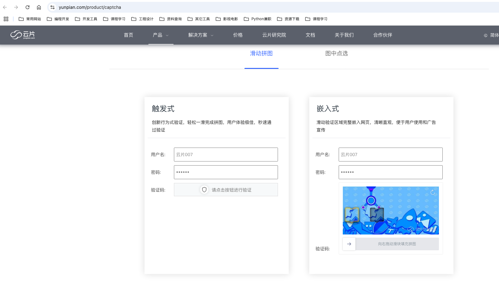

# 2 滑块问题思路分析

## 2.1 获取初始化接口

- 验证类型`model`：**滑块**-`slide`，**点选**-`select`
- 验证图片信息：**图片链接**-`img_url`，**图片数据**-`img_base64`
- 唯一性参数：用于最终验证参数（哪一次的验证）

## 2.2 中间辅助接口

- 根据具体网站确定即可，可有可无

- 例如：极验3滑块，除了初始化接口，还要准备3个接口，缺一个就会验证失败

  ~~~python
  # 1、https://www.geetest.com/demo/gt/register-slide-official，获取gt，challenge
  gt, challenge = parse_register_slide_official_url()
  
  # 2、https://api.geetest.com/get.php，获取"c": [12, 58, 98, 36, 43, 95, 62, 15, 12],"s": "2e4f506e",
  parse_geetest_get_php_url(gt, challenge)
  
  # 3、"https://api.geevisit.com/ajax.php"，获取验证类型:slide
  parse_geevisit_ajax_php_url(gt, challenge)
  
  # 4、https://api.geevisit.com/get.php，获取滑块图片
  challenge, bg_url, slice_url, c, s = parse_geevisit_get_php(gt, challenge)
  # print(challenge, bg_url, slice_url, c, s)
  ~~~

## 2.3 滑块分析（两大参数）

- 滑动距离：缺口图片—>背景图片，**X轴**距离，有时会需要**Y轴**距离（图片左上角为坐标原点）

  ~~~python
  # 利用Python第三方库，如ddddocr、OpenCV计算
  # 利用打码平台计算
  ~~~

- 滑动轨迹

  ~~~python
  # 根据滑动距离，生成轨迹
  # 分析轨迹组成结构，利用Python实现，一般需要3个参数x、y、t，x是横坐标（增量），y是纵坐标（增量），t是时间（增量）
  # 滑块轨迹最终形成一个大的列表，对于不同网站，可能在轨迹的基础上，针对列表的每一项，再生成加密轨迹
  ~~~

## 2.4 最终校验

- 提交上述过程中，产生的全部参数，并提交最终滑块验证接口，完成滑块验证
- 验证成功后，返回一个验证成功参数

# 3 云片滑块分析

## 3.1 抓包分析（两个接口）

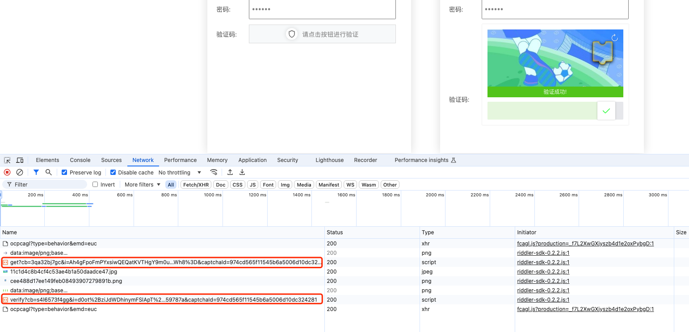

- `v1/jsonp/captcha/get`前置接口，含有4个请求参数，其中3个加密参数：
  - `cb`：加密值，待分析逆向
  - `i`：加密值，待分析逆向
  - `k`：加密值，待分析逆向

- `v1/jsonp/captcha/verify`验证接口，含有5个请求参数，其中3个加密参数：
  - `cb`：加密值，待分析逆向
  - `i`：加密值，待分析逆向
  - `k`：加密值，待分析逆向

## 3.2 `v1/jsonp/captcha/get`前置接口

- `v1/jsonp/captcha/get`前置接口，获取验证图片，及其它相关参数

  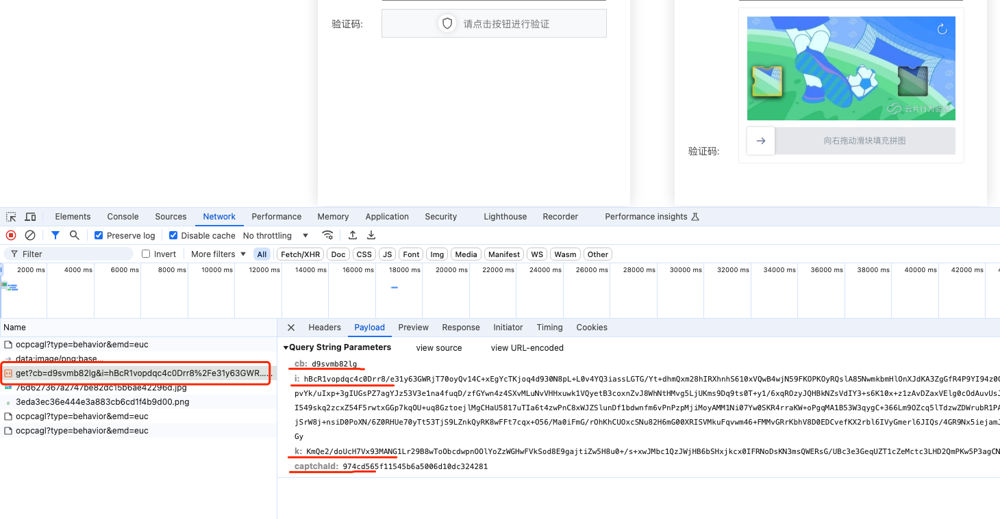

- 请求地址

  ~~~python
  url = "https://captcha.yunpian.com/v1/jsonp/captcha/get"
  ~~~

- 请求参数分析：

  ~~~python
  params = {
      "cb": "d9svmb82lg", # 加密参数
      "i": "hBcR1vopdqc4c0Drr8/e31y63GWRjT70oyQv14C+xEgYcTKjoq4d930N8...", # 加密参数
      "k": "KmQe2/doUcH7Vx93MANG1Lr29B8wToObcdwpn...", # 加密参数
      "captchaId": "974cd565f11545b6a5006d10dc324281" # 网页Id，固定值
  }
  ~~~

- 响应参数分析（先搁置，不用过分纠结，在逆向参数时回头再查看）：

  ~~~python
  ypjsonp({
      "cb": "d9svmb82lg",
      "code": 0,
      "data": {
          "bg": "https://captcha.yunpian.com/v1/image/76d627367a2747be82dc15b6ae42296d.jpg", # 背景图
          "front": "https://captcha.yunpian.com/v1/image/3eda3ec36e444e3a883cb6cd1f4b9d00.png", # 缺口图
          "height": 240,
          "logoOptions": {
              "chText": "由云片行为验证提供技术支持",
              "customized": false,
              "enText": "Powered by YunPian's CAPTCHA",
              "href": "https://dx5.cn",
              "logo": "data:image/png;base64,iVBORw0KGgoAAAANSUhEUgAAADEAAAAlCAYAAADr2wGRAAAACX...",
              "status": 1
          },
          "sliderWidth": 93,
          "token": "3e4d78de619542e18882c47bf3033473",
          "type": 1,
          "width": 480
      },
      "msg": "ok"
  })
  ~~~

## 3.3 `v1/jsonp/captcha/verify`验证接口

- `v1/jsonp/captcha/verify`验证接口，提交滑块参数

  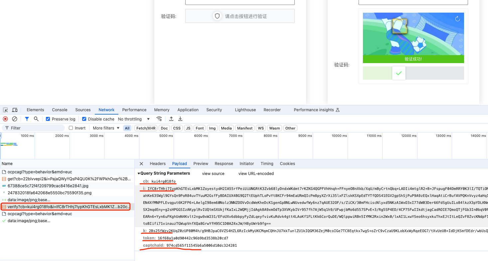

- 请求地址

  ~~~python
  url = "https://captcha.yunpian.com/v1/jsonp/captcha/verify"
  ~~~

- 请求参数分析：

  ~~~python
  params = {
      "cb": "kui4rg018fo", # 加密参数
      "i": "IfC8rTHhj7IypKhGTEsLxbMK1ZoyestydH2IA55rfPeiUiUNGRtK3Zvb68lyDn...", # 加密参数
      "k": "2Bs25fWzv2KUqZ0zUP80M4h/g9HBJpaC6VZS4HZL6RzIckMyUKCMqmCQHnJU7kkTunlZU...", # 加密参数
      "token": "16f68a1a0d90442c96b9bd3538b20cd7", # 唯一性参数
      "captchaId": "974cd565f11545b6a5006d10dc324281" # 网页Id，固定值
  }
  ~~~

- 响应参数：

  ~~~python
  ypjsonp({
      "cb": "kui4rg018fo",
      "code": 0,
      "data": {
          "authenticate": "4406afd954ae48b0930e65c020f570a2",
          "result": true,
          "token": "16f68a1a0d90442c96b9bd3538b20cd7"
      },
      "msg": "ok"
  })
  ~~~

# 4 云片滑块详细步骤

## 4.1 总体流程

~~~python
def main():
    # 0、准备参数
    yp_riddler_id = str(uuid.uuid4())

    # 1、https://captcha.yunpian.com/v1/jsonp/captcha/get，获取滑块图片
    # 1.1、params参数分析：cb、i、k
    get_params = parse_get_params(yp_riddler_id)
    # print(get_params)
    # 1.2、发送请求
    bg, front, token = parse_captcha_get_url(get_params)
    # print(bg, front, token)

    # 2、滑块滑动距离分析
    # 2.1、距离
    slide_distance = parse_slide(bg, front)
    # print('slide_distance--->', slide_distance)
    # 2.2、缺口front图片宽度
    front_width = parse_front()
    # print('front_width--->', front_width)

    # 3、轨迹
    traceData = parse_traceData(slide_distance)
    # print(traceData, len(traceData))

    # 4、https://captcha.yunpian.com/v1/jsonp/captcha/verify，发送验证请求
    # 4.1、params参数分析：cb、i、k
    verify_params = parse_verify_params(
        yp_riddler_id, slide_distance, front_width, traceData)
    # print(verify_params)
    # 4.2、发送请求
    response = parse_captcha_verify_url(token, verify_params)
    print(response)
    return

if __name__ == '__main__':
    for i in range(5):
        main()
# https://www.yunpian.com/product/captcha
~~~

## 4.2 `v1/jsonp/captcha/get`前置接口

### 4.2.1 `cb`、`i`、`k`分析

- 通过堆栈分析，查找加密参数，接口堆栈不多，可以逐个查看堆栈内容

  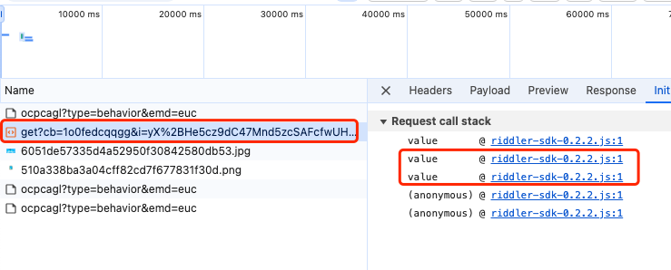

- 根据堆栈分析，不难看出，倒数第二、第三`value`堆栈有关键内容，可以直接找到加密位置

  - 先看倒数第二`value`堆栈，找到了`cb`、`i`、`k`三个加密参数，并且加密位置可以直接找到

    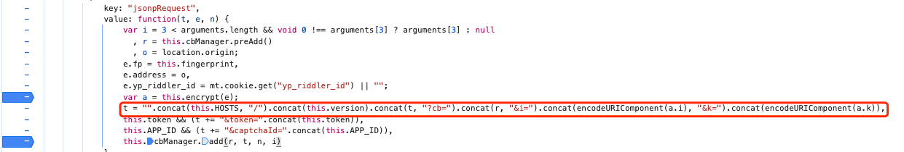

  - 此处发现一个`yp_riddler_id`，是获取`cookie.get`，发现类似uuid，为了确认，可以通过`cookie.set`查找

  - 回到堆栈，发现在倒数第三`value`堆栈，有相关信息，确认了就是创建了一个uuid

    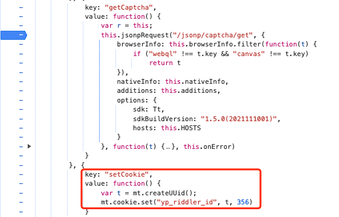

- 找到全部加密信息后，可以开始扣代码，在倒数第二`value`堆栈找到加密入口`var a = this.encrypt(e);`，进入函数发现类似AES加密，可以直接使用标准库，也可以直接使用webpack，本例采用后者

  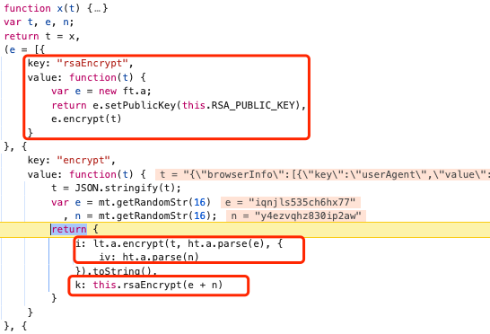

- 加密参数

  ~~~python
  def parse_get_params(yp_riddler_id):
      # yp_riddler_id = "c5e24b6d-40a0-4c28-9935-0fcad2cd4240"
      with open('./2-params.js', 'r') as f:
          js_file = f.read()
      ctx = execjs.compile(js_file)
      cb = ctx.call('preAdd')
      get_params = {'cb': cb}
      get_params.update(ctx.call('encrypt_get', yp_riddler_id))
      return get_params
  
  # 0、准备参数
  yp_riddler_id = str(uuid.uuid4())
  # 1、https://captcha.yunpian.com/v1/jsonp/captcha/get，获取滑块图片
  # 1.1、params参数分析：cb、i、k
  get_params = parse_get_params(yp_riddler_id)
  # print(get_params)
  ~~~

### 4.2.2 前置接口发送请求

- 破解加密参数后，发送前置接口请求

  ~~~python
  def parse_captcha_get_url(params):
      url = "https://captcha.yunpian.com/v1/jsonp/captcha/get"
      headers = {}
      params["captchaId"] = "974cd565f11545b6a5006d10dc324281"
      response = requests.get(url, headers=headers, params=params)
      json_data = json.loads(response.text[8:-1])
      bg = json_data['data']['bg']
      front = json_data['data']['front']
      token = json_data['data']['token']
      return bg, front, token
  
  # 1.2、发送请求
  bg, front, token = parse_captcha_get_url(get_params)
  # print(bg, front, token)
  ~~~

- 在前置接口中，获取相关参数，用于下次请求

- 获取背景图、滑块图，用于滑动距离分析

## 4.3 `v1/jsonp/captcha/verify`验证接口

### 4.3.1 `cb`、`i`、`k`分析

- 通过堆栈分析，查找加密参数，接口堆栈不多，与前置接口类似

- 根据堆栈分析，倒数第二、第四`value`堆栈有关键内容，可以直接找到加密位置

  - 先看倒数第四`value`堆栈，发现轨迹、滑动距离比例

    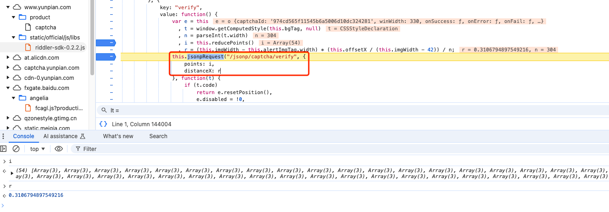

  - 针对滑动比例，注意观察，有缺口图宽度、滑动距离、背景图宽度

    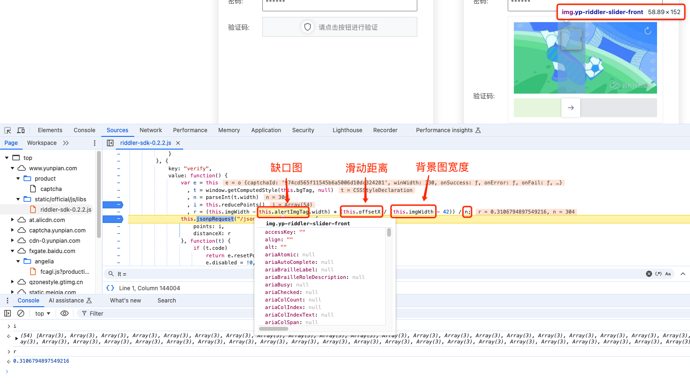

  - 注意，缺口图宽度进行了缩放，原宽度在前置请求返回参数里，缩放比例为：`1.57`

  - 回到堆栈，再看倒数第二`value`堆栈，发现与前置接口逻辑相同

    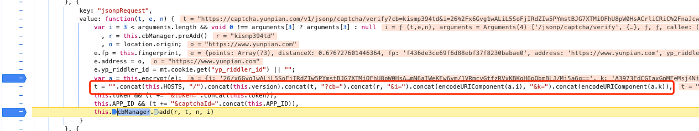

- 整体加密逻辑与前置接口相同，开始扣代码逆向，可以先固定相关滑动参数，后续补充即可

### 4.3.2 滑块距离分析

- 在分析加密前，需计算滑块距离，并生成轨迹

- 获取背景图`bg`、缺口图`front`，下载图片，计算滑动距离

- 由于网页与实际图片可能存在误差或缩放问题，为了准确计算滑动距离，需通过比对确认

  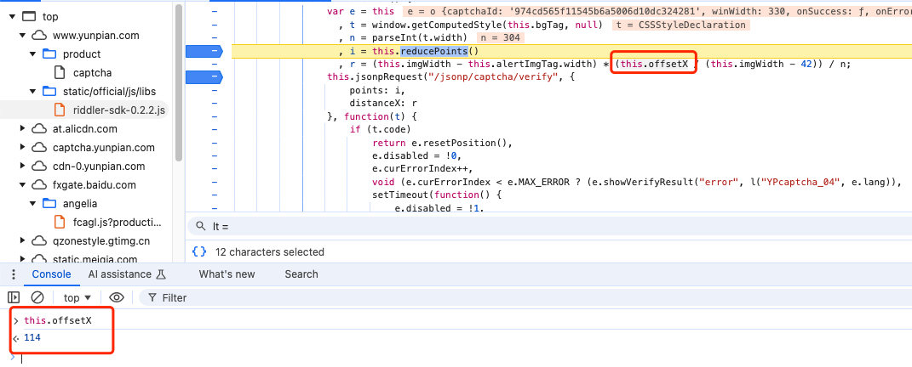

  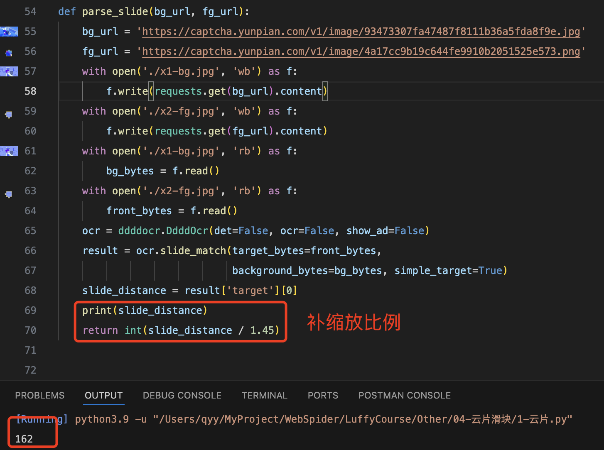

- 滑动距离代码

  ~~~python
  def parse_slide(bg_url, fg_url):
      # bg_url = 'https://captcha.yunpian.com/v1/image/93473307fa47487f8111b36a5fda8f9e.jpg'
      # fg_url = 'https://captcha.yunpian.com/v1/image/4a17cc9b19c644fe9910b2051525e573.png'
      with open('./x1-bg.jpg', 'wb') as f:
          f.write(requests.get(bg_url).content)
      with open('./x2-fg.jpg', 'wb') as f:
          f.write(requests.get(fg_url).content)
      with open('./x1-bg.jpg', 'rb') as f:
          bg_bytes = f.read()
      with open('./x2-fg.jpg', 'rb') as f:
          front_bytes = f.read()
      ocr = ddddocr.DdddOcr(det=False, ocr=False, show_ad=False)
      result = ocr.slide_match(target_bytes=front_bytes,
                               background_bytes=bg_bytes, simple_target=True)
      slide_distance = result['target'][0]
      # print(slide_distance)
      return int(slide_distance / 1.45)
  
  # 2、滑块滑动距离分析
  # 2.1、距离
  slide_distance = parse_slide(bg, front)
  # print('slide_distance--->', slide_distance)
  ~~~

- 注意补充缺口front图片宽度，缩放比例为1.57，直接从前置接口获取缺口图原始宽度，也可以本地读取图片获取宽度

  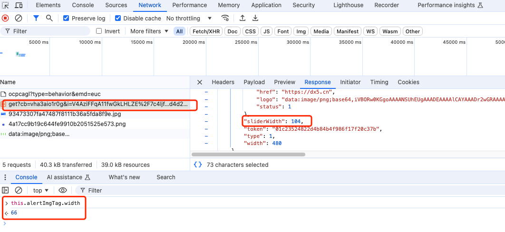

  ~~~python
  def parse_front():
      # 打开图片文件
      image = Image.open('./x2-fg.jpg')
      # 获取图片尺寸
      # width, height = image.size
      return int(image.size[0]/1.57)
  
  # 2.2、缺口front图片宽度
  front_width = parse_front()
  # print('front_width--->', front_width)
  ~~~

### 4.3.3 滑块轨迹分析

- 轨迹通过`i = this.reducePoints()`进行了处理，进入函数发现轨迹列表，此处后续处理需要扣代码

- 生产轨迹前，先从网页获取轨迹，大致分析轨迹生成规则

  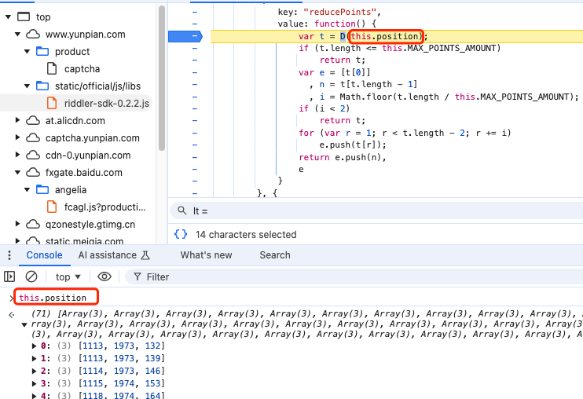

- 观察轨迹，`x`、`t`是变化的，`y`是滑块在网页上高度位置，可不做分析，通过脚本分析变化规律

  ~~~python
  track = [[1113, 1973, 132], [1113, 1973, 139], [1114, 1973, 146], ...]
  
  for index, item in enumerate(track[:-1]):
      print(track[index+1][0]-item[0], track[index+1][2]-item[2])
  ~~~

  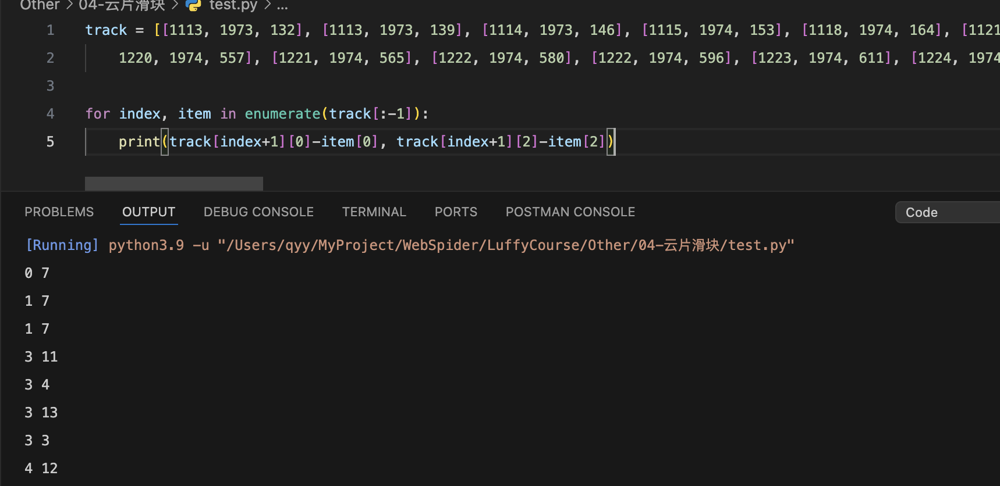

- 无复杂规律，生产轨迹

  ~~~python
  def parse_traceData(slide_distance):
      start_x = random.randint(1100, 1120)
      start_y = random.randint(1880, 1890)
      start_t = random.randint(50, 60)
      traceData = [[start_x, start_y, start_t]]
      x = 0
      t = 0
      while x < slide_distance:
          x += random.randint(1, 5)
          y = random.randint(-1, 1)
          t += random.randint(10, 20)
          point_x = start_x + x
          point_y = start_y + y
          point_t = start_t + t
          if x >= slide_distance:
              point_x = start_x + slide_distance
              trace = [point_x, point_y, point_t]
              traceData.append(trace)
              break
          trace = [point_x, point_y, point_t]
          traceData.append(trace)
      for i in range(5):
          t += random.randint(10, 20)
          point_t = start_t + t
          trace = [point_x, point_y, point_t]
          traceData.append(trace)
      return traceData
  
  # 3、轨迹
  traceData = parse_traceData(slide_distance)
  # print(traceData, len(traceData))
  ~~~

### 4.3.4 生产加密参数

- 传递参数：`yp_riddler_id`、`slide_distance`、`front_width`、`traceData`

  ~~~python
  def parse_verify_params(yp_riddler_id, slide_distance, front_width, traceData):
      with open('./2-params.js', 'r') as f:
          js_file = f.read()
      ctx = execjs.compile(js_file)
      cb = ctx.call('preAdd')
      verify_params = {'cb': cb}
      verify_params.update(ctx.call('encrypt_verify', yp_riddler_id,
                                    slide_distance, front_width, traceData))
      return verify_params
  
  # 4、https://captcha.yunpian.com/v1/jsonp/captcha/verify，发送验证请求
  # 4.1、params参数分析：cb、i、k
  verify_params = parse_verify_params(yp_riddler_id, slide_distance, front_width, traceData)
  # print(verify_params)
  ~~~

### 4.3.5 最终提交验证

~~~python
def parse_captcha_verify_url(token, verify_params):
    url = "https://captcha.yunpian.com/v1/jsonp/captcha/verify"
    headers = {}
    verify_params.update({
        "token": token,
        "captchaId": "974cd565f11545b6a5006d10dc324281"
    })
    response = requests.get(url, headers=headers, params=verify_params)
    return response.text

# 4.2、发送请求
response = parse_captcha_verify_url(token, verify_params)
print(response)
~~~

# 5 滑块案例

- 竞技世界：`aHR0cHM6Ly9sb2dpbi5qai5jbi91c2VyL2xvZ2luLnBocA==`
- 安居客：`aHR0cHM6Ly9hcGkuYW5qdWtlLmNvbS93ZWIvZ2VuZXJhbC9jYXB0Y2hhTmV3Lmh0bWw=`
- 360牛盾：`aHR0cHM6Ly9pbmZvLnNvLmNvbS9jYWNoZV9yZW1vdmUuaHRtbA==`
- ABC滑块：`aHR0cHM6Ly94eGdzLmNoaW5hbnBvLm1jYS5nb3YuY24vZ3N4dC9uZXdMaXN0`
- 有赞：`aHR0cHM6Ly9wYXNzcG9ydC55b3V6YW4uY29tL2xvZ2luL3Bhc3N3b3Jk`
- 房天下：`aHR0cHM6Ly9wYXNzcG9ydC5mYW5nLmNvbS8=`
- 中国邮政：`aHR0cHM6Ly9wYXNzcG9ydC4xMTE4NS5jbi9jYXMvbG9naW4=`
- 青青牧场：`aHR0cDovL3FxbWMuaHVpdHVpLnByby9wYWdlcy9yZWdpc3Rlci9pbmRleC5odG1s`
- 游卡：`aHR0cHM6Ly9zcGx1czIuZG9iZXN0LmNuL2xvZ2lu`
- 云南省建设监管公共服务平台：`aHR0cHM6Ly93d3cueW5qempnY3guY29tL2xvZ2lu`
- 指针平台：`aHR0cHM6Ly92OC5jaGFveGluZy5jb20v`
- 工业和信息化部：`aHR0cHM6Ly9iZWlhbi5taWl0Lmdvdi5jbi8/d209MTkxOSMvSW50ZWdyYXRlZC9pbmRleA==`
- 蝉妈妈：`aHR0cHM6Ly93d3cuY2hhbm1hbWEuY29tL3JlZ2lzdGVyLmh0bWw=`
- 189邮箱：`aHR0cHM6Ly93ZWJtYWlsMzAuMTg5LmNuL3cyL2luZGV4Lmh0bWw=`
- 39健康网：`aHR0cHM6Ly9wYXNzcG9ydC4zOS5uZXQvQWNjb3VudC9Mb2dpbg==`