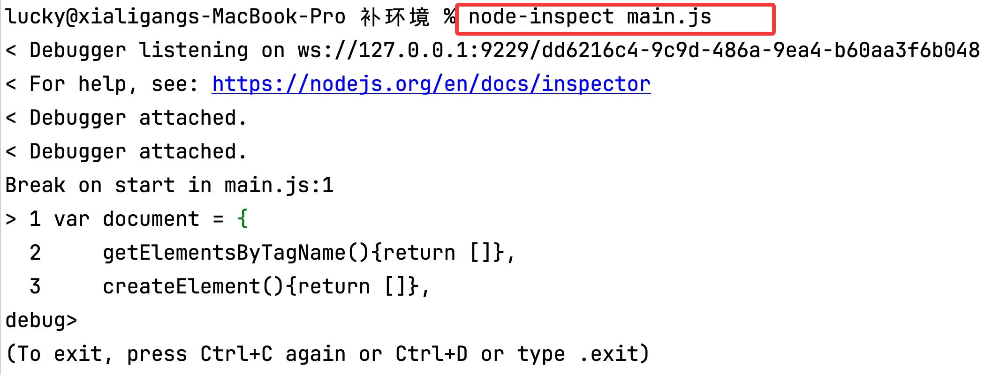
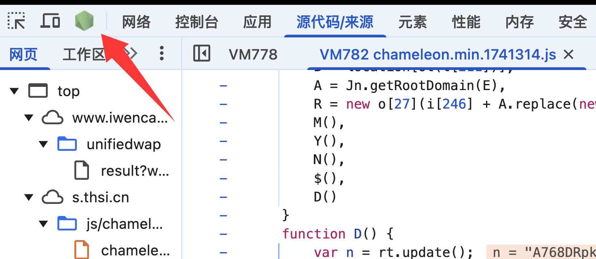
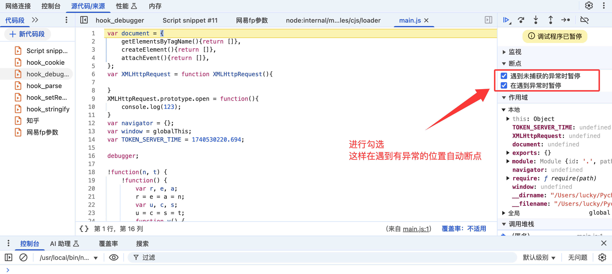

# 补环境

## 一、设置于node-inspect

### 1、pycharm设置


### 2、node-inspect

#### 【1】安装

+ 新版本node默认已经安装了node-inspect

+ 安装

  ```
  npm install node-inspect
  ```

  如果安装完找不到命令

  ```
  npm install -g node-inspect
  ```

+ 安装每次修改代码后不需要重启node-inspect

  ```
  sudo npm install -g nodemon
  ```

#### 【2】使用

+ node-inspect  文件.js

+ nodemon --inspect-brk  文件.js  推荐使用  代码修改 ctrl+s 后自动重新运行

  

+ 点击

  

+ 勾选

  

  

## 二、浏览器与事件

### 1、DOM与BOM

在 Web 开发中，JavaScript（JS）中的 DOM（文档对象模型）和 BOM（浏览器对象模型）是两个重要的概念，它们分别代表了网页文档结构和浏览器窗口的抽象表示。它们的主要区别在于它们所表示的对象以及它们的作用范围。

**DOM（文档对象模型）：**

DOM 是指文档对象模型（Document Object Model），它是 HTML 和 XML 文档的编程接口，提供了对文档的结构化表述，并定义了一种方式可以对结构进行访问、操作和更新。

主要作用：
- 将 HTML 或 XML 文档以树形结构表示，每个节点都是一个对象，可以通过 JS 脚本来访问和操作。
- 提供了对文档中元素、属性、文本内容等的增、删、改、查等操作，从而实现了对文档的动态修改。
- 允许开发者对文档进行事件处理和交互操作，例如监听用户的点击事件、表单提交事件等。

**BOM（浏览器对象模型）：**

BOM 是指浏览器对象模型（Browser Object Model），它提供了与浏览器窗口交互的对象和方法，包括对浏览器窗口的访问、控制和修改。

主要作用：
- 提供了对浏览器窗口和浏览器本身的操作，例如打开新窗口、关闭窗口、获取窗口尺寸等。
- 提供了对浏览器的历史记录的访问和控制，例如前进、后退、跳转等。
- 提供了与浏览器交互的一些方法，例如弹出对话框、确认框、提示框等。

**区别：**

1. **对象范围：** DOM 是文档对象模型，主要操作和处理的是网页文档中的元素节点、文本节点等内容；而 BOM 是浏览器对象模型，主要操作和处理的是浏览器窗口、浏览器本身及其属性。

2. **作用对象：** DOM 主要用于操作网页文档的结构和内容，例如 HTML 元素、文本内容等；而 BOM 主要用于操作浏览器窗口，例如控制窗口尺寸、打开新窗口等。

3. **功能区别：** DOM 主要用于访问和操作网页文档中的元素节点，提供了对文档结构的动态修改和交互操作；BOM 主要用于与浏览器窗口交互，提供了对浏览器窗口和浏览器功能的控制。

常用浏览器事件与DOM事件，包括鼠标事件、键盘事件、框架/对象事件、表单事件、剪贴板事件、打印事件、拖动事件、媒体事件、动画事件、过渡事件。

### 2、各种事件

#### (1) 加载相关

+ onbeforeunload: 该事将离开页面 (刷新或关闭)时触发onload: 文档加载完成后触发.
+ onunload: 当窗口卸载其内容和资源时触发
+ onerror: 当发生lavaScript运行时错误与资源加载失败时触发
+ onabort: 发送到window的中I上abort事件的事件处理程序，不适用于Firefox 2或Safari.

#### (2) DOM事件之过度相关

+ atransitionend: 该事件在CSS完成过渡后触发。

#### (3) 窗口相关

+ onblur: 窗口失去焦点时触发
+ onfocus: 窗口获得焦点时触发
+ onresize: 窗口大小发生改变时触发
+ onscroll:窗口发生滚动时触发。
+ onmessage: 窗口对象接收消息事件时触发
+ onchange: 窗口内表单元素的内容改变时触发
+ oninput: 窗口内表单元素获取用户输入时触发.
+ onreset: 窗口内表单重置时触发.
+ onselect: 窗口内表单元素中文本被选中时触发onsubmit: 窗口内表单中submit按钮被按下触
+ onhashchange: 当窗口的锚点哈希值发生变化时触发

#### (4) 鼠标事件

+ onclick: 鼠标单击事件
+ onmouseover: 鼠标移入事件
+ onmouseout: 鼠标移出事件
+ onmousedown:  鼠标按下事件
+ onmouseup : 鼠标松开事件
+ onmousemove : 鼠标移动事件

#### (5) 键盘事件

+ onkeydown: 键盘按下
+ onkeyup: 键盘松开

#### (6) 表单事件

+ onchange: 处理表单元素值变化事件。
+ onsubmit: 处理表单提交事件。
+ onreset: 处理表单重置事件。
+ oninput: 处理表单输入事件。
+ onselect: 处理选择表单元素事件。
+ onfocus: 处理表单元素获得焦点事件。
+ onblur: 处理表单元素失去焦点事件。

#### (7）编辑事件

+ oncopy :  复制（拷贝）时触发
+ onselect:  页面内容被选取时触发
+ oncontextmenu:  按下鼠标右键时触发

#### (8) 动画事件 (Animation Events)

+ animationstart: 处理动画开始事件。
+ animationend: 处理动画结束事件。
+ animationiteration: 处理动画迭代事件。

#### (9) 动画相关

+ onanimationcancel: 当CSS动画意外中止时，即在任何时候它停止运行而不发送animationend事件时将发送此事件，例如当animation-name被改变，动画被删除等
+ onanimationend: 当CSS动画到达其活动周期的末尾时，按照(animation-duration*animation-iteration-count) + animation-delay进行计算，将发送此事件。
+ onanimationiteration: 此事件将会在CSS动画到达每次迭代结束时触发，当通过执行最后一个动画步骤完成对动画指令序列的单次传递完成时，迭代结束。

#### (10) 应用相关

+ onappinstalled: 一旦将Web应用程序成功安装为渐进式Web应用程序，该事件就会被分派。
+ onbeforeinstallprompt: 当用户即将被提示安装web应用程序时，该处理程序将在设备上调度，其相关联的事件可以保存以供稍后用于在更适合的时间提示用户。

#### (11) 设备相关

+ ondevicemotion: 设备状态发生改变时触发
+ ondeviceorientation: 设备相对方向发生改变时触发
+ ondeviceproximity: 当设备传感器检测到物体变得更接近或更远离设备时触发。

#### (12) DOM事件之打印相关

+ onafterprint: 该事件在页面已经开始打印，或者打印窗口已经关闭时触发。
+ onbeforeprint: 该事件在页面即将开始打印时触发。

#### (13) DOM事件之拖动相关

+ ondrag: 该事件在元素正在拖动时触发。
+ ondragend: 该事件在用户完成元素的拖动时触发。
+ ondragenter: 该事件在拖动的元素进入放置目标时触发。
+ ondragleave: 该事件在拖动元素离开放置目标时触发。
+ ondragover: 该事件在拖动元素在放置目标上时触发。
+ ondragstart: 该事件在用户开始拖动元素时触发。
+ ondrop: 该事件在拖动元素放置在目标区域时触发。

#### (14) DOM事件之框架/图像相关

+ onload: 一张页面或一幅图像完成加载。
+ onpageshow: 该事件在用户访问页面时触发
+ onpagehide: 该事件在用户离开当前网页跳转到另外一个页面时触发
+ visibilitychange:document监听事件，浏览器标签页被隐藏或显示的时触发
+ ononline: 该事件在浏览器开始在线工作时触发。
+ onoffline: 该事件在浏览器开始离线工作时触发。
+ onshow: 该事件当<menu>元素在上下文菜单显示时触发。
+ ontoggle: 该事件在用户打开或关闭<details>元素时触发。

#### (15) DOM事件之多媒体相关

+ onabort: 事件在视频/音频终止加载时触发。
+ oncanplay: 事件在用户可以开始播放视频/音频时触发。
+ oncanplaythrough: 事件在视频/音频可以正常播放且无需停顿和缓冲时触发。
+ ondurationchange: 事件在视频/音频的时长发生变化时触发。
+ onemptied: 当期播放列表为空时触发
+ onended: 事件在视频/音频播放结束时触发。
+ onerror: 事件在视频/音频数据加载期间发生错误时触发。
+ onloadeddata: 事件在浏览器加载视频/音当前帧时触发触发。
+ onloadedmetadata: 事件在指定视频/音频的元数据加载后触发。
+ onloadstart: 事件在浏览器开始寻找指定视频/音频触发。
+ onpause: 事件在视频/音频暂停时触发。
+ onplay: 事件在视频/音频开始播放时触发。
+ onplaying: 事件在视频/音频暂停或者在缓冲后准备重新开始播放时触发。
+ onprogress: 事件在浏览器下载指定的视频/音频时触发。
+ onratechange: 事件在视频/音频的播放速度发送改变时触发。
+ onseeked: 事件在用户重新定位视频/音频的播放位置后触发。
+ onseeking: 事件在用户开始重新定位视频/音频时触发。
+ onstalled: 事件在浏览器获取媒体数据，但媒体数据不可用时触发。
+ onsuspend: 事件在浏览器读取媒体数据中止时触发。
+ ontimeupdate: 事件在当前的播放位置发送改变时触发。
+ onvolumechange: 事件在音量发生改变时触发。
+ onwaiting: 事件在视频由于要播放下一帧而需要缓冲时触发。

### 3、HTML DOM EventListener  事件监听

可以对一个element绑定多个同样的事件  且不会被覆盖

+ addEventListener() 方法

  语法

  ##### *element*.addEventListener(*event, function, useCapture*);

  第一个参数是事件的类型 (如 "click" 或 "mousedown"). 

  第二个参数是事件触发后调用的函数。 

  第三个参数是个布尔值用于描述事件是冒泡还是捕获。该参数是可选的。

  + 实例:

    在用户移动鼠标时触发监听事件：

  ```javascript
  <!DOCTYPE html>
  <html>
  <head>
      <meta charset="UTF-8">
      <title>Title</title>
  
  </head>
  <body>
  给当前的documen添加事件监听 mousemove
  </body>
  </html>
  <script>
      var i = 0
      document.addEventListener('mousemove', function (arg) {
          console.log('正在移动', i, arg) /*arg为移动鼠标是传入的对象*/
          i += 1
      })
  </script>
  ```

+ 结果

  

### 4、补mousemove环境

#### 4.1 在浏览器中查看当前移动对象

##### (1) 将当前打印的移动对象设置为全局对象


结果


##### (2) 查看temp1对象


##### (3) Object.getOwnPropertyDescriptor()

**作用：** 返回一个对象，该对象描述给定对象上特定属性（即直接存在于对象上而不在对象的原型链中的属性）的配置。返回的对象是可变的，但对其进行更改不会影响原始属性的配置。

##### (4) 查看当前temp1对象中**isTrusted**对象有哪些属性和方法


##### (5) 补**isTrusted**

+ 浏览器中调试查看各属性值  用于后续的补环境

  

+ **代码**

  ```javascript
  var Mousemove = function(){
      // 补isTrusted对象的属性和方法
      Object.defineProperty(this, 'isTrusted', {
          configurable: false,
          enumerable: true,
          get: function () {
              return true;
          },
          set: undefined
      })
      // 补充isTrusted对象中get对象的name属性的值和浏览器中的值保持一致
      Object.defineProperty(Object.getOwnPropertyDescriptor(this, 'isTrusted').get, 'name', {
          configurable: true,
          enumerable:false,
          value:"get isTrusted",
          writable:false
      })
      // 补充isTrusted对象中get对象的length属性的值和浏览器中的值保持一致
      Object.defineProperty(Object.getOwnPropertyDescriptor(this, 'isTrusted').get, 'length', {
          configurable: true,
          enumerable:false,
          value:0,
          writable:false
      })
  }
  // 实例化
  var temp1 = new Mousemove()
  console.log(temp1.isTrusted)
  // 获取当前的get对象的name属性值
  console.log(Object.getOwnPropertyDescriptor(temp1, 'isTrusted').get)
  console.log(Object.getOwnPropertyDescriptor(temp1, 'isTrusted').get.name)
  console.log(Object.getOwnPropertyDescriptor(temp1, 'isTrusted').get.length)
  ```

+ 结果对比

  浏览器中

  

  pycharm

  

  