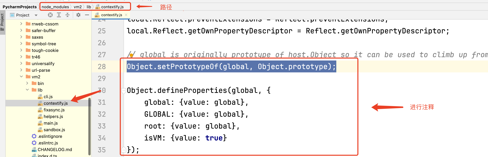
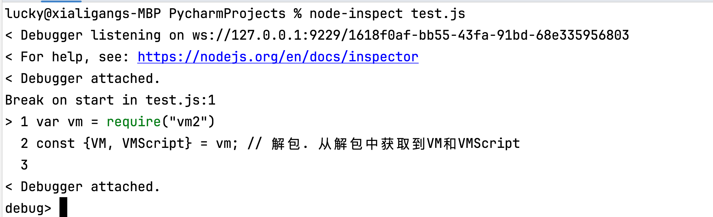
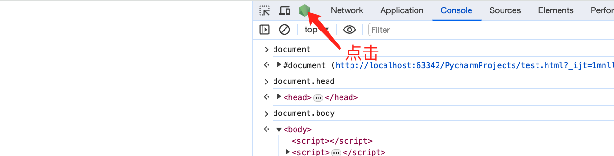
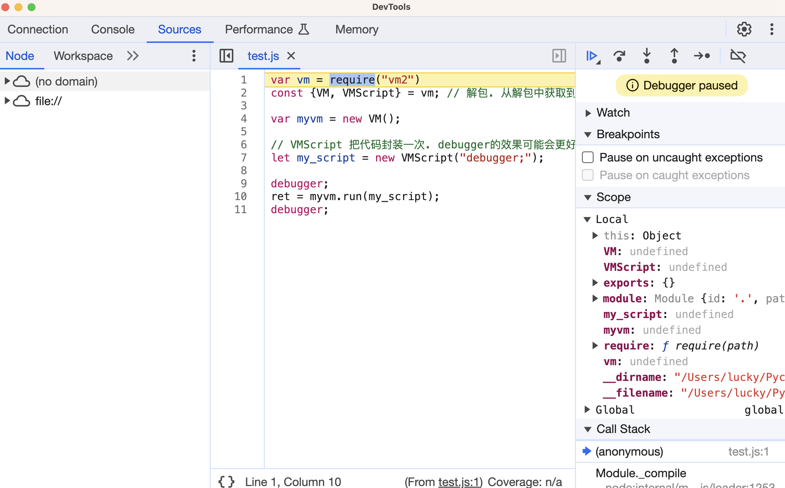

+ vm2运行环境
  vm2 是一个用于在 Node.js中创建沙盒环境的模块。

  vm2 允许你创建一个虚拟机实例（VM），在该实例中运行 JavaScript 代码。这个虚拟机实例是一个隔离的环境，与主 Node.js 进程相互独立，可以在其中执行代码。    

  借助node环境中的v8. 剥离node环境本身的一些东西.防止被检测到. 干净的只有v8引擎的一个js运行环境..
  vm2 => 干净的v8(最新版本里面也有坑). 选择一个相对较低的版本 3.9.3 版本....(也许要手动去调整一些东西)

+ 安装

  ```
  npm install vm2@3.9.3
  ```

+ 调整: 

  node_modules => vm2 => lib => contextify.js =>搜global. 然后注释掉声明global的地方

  ```javascript
  Object.setPrototypeOf(global, Object.prototype);
   
  Object.defineProperties(global, {
      global: {value: global},
      GLOBAL: {value: global},
      root: {value: global},
      isVM: {value: true}
  });
  ```

+ 图例

  


+ 代码

  ```javascript
  var vm = require("vm2")
  const {VM, VMScript} = vm; // 解包. 从解包中获取到VM和VMScript
  
  var myvm = new VM();
  
  let my_script = new VMScript("debugger;");
  
  debugger;
  ret = myvm.run(my_script);
  debugger;
  ```

  **VMScript**

    你可以使用预编译的脚本来提高性能。预编译的VMScript可以多次运行

+ 启动

  ```
   node-inspect test.js 
  ```

  

+ 打开浏览器

  

在这儿就可以看到当前代码的执行



  
