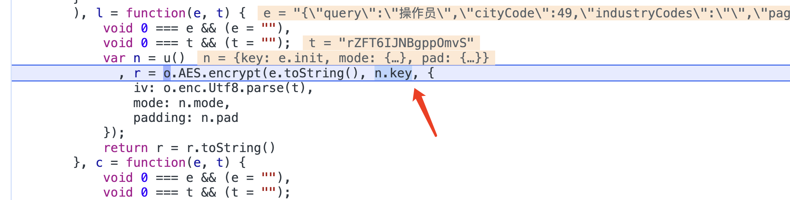
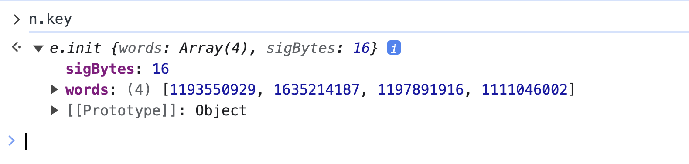
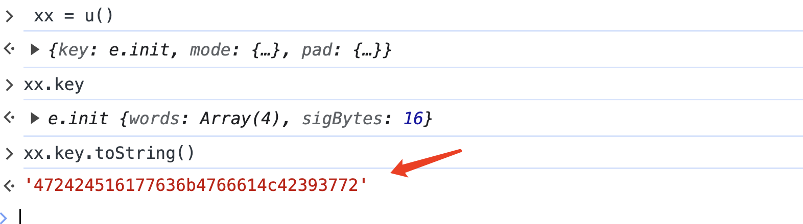
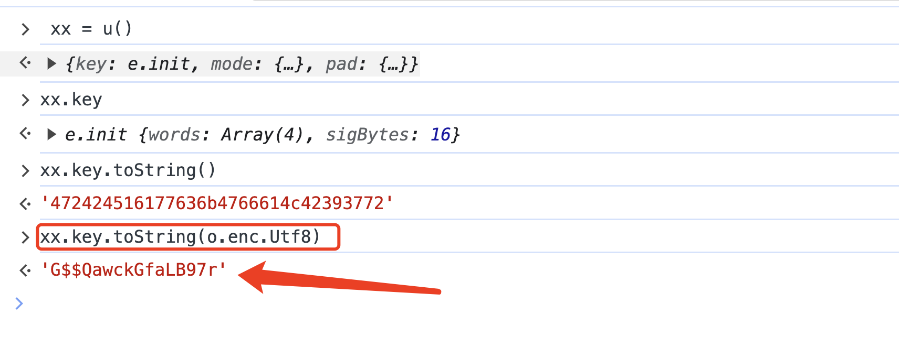
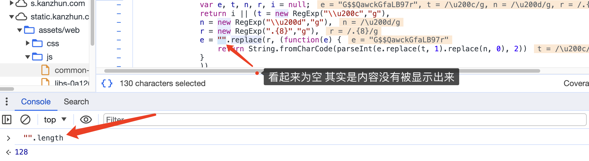

## 一、void 0

void 0 === e && (e = "")

正确理解方式为 (void 0)   === e && (e = "") 

void 0 得结果为undefined  也就是如果e没有被定义 则赋值空字符串

## 二、加密秘钥

```javascript
{
    "words": [
        1193550929,
        1635214187,
        1197891916,
        1111046002
    ],
    "sigBytes": 16
}
```





当前对象为 CryptoJs内部封装的对象

### **还原：**

#### 1、使用python还原



使用xx获取当前u的对象

xx.key.toString()  进行获取 十进制字符串 拿到字符串后使用python

```python
import binascii
s = '472424516177636b4766614c42393772'
# 将一个十六进制字符串转换为一个字节串
key = binascii.a2b_hex(s).decode()
# print(key)  # G$$QawckGfaLB97r
```

#### 2、使用js还原



使用UTF-8的编码进行转换

## 三、空字符串 ” “

